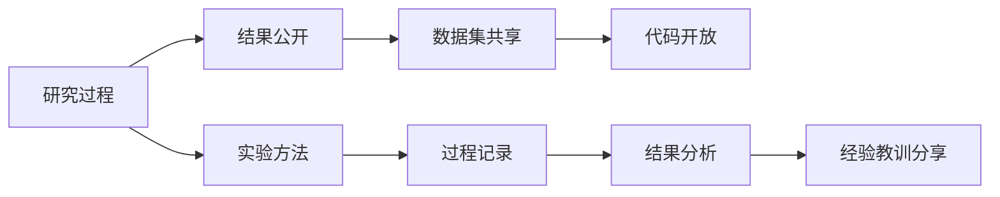

                 

## 1. 背景介绍

在人工智能(AI)领域，近年来涌现出了大量前沿技术和研究。然而，这些技术的落地应用与效果评估，往往缺乏系统性、透明性和可重复性。研究人员在进行创新探索时，虽然取得了许多突破性成果，但这些成果的适用范围、实际效果、潜在风险等信息，往往难以得到有效传播和利用。此外，研究社区在交流中，由于缺乏统一的标准和规范，导致交流成本增加，协同创新困难。

为了应对这些问题，文章将深入探讨AI研究的透明度问题，探讨分享经验教训的重要性。通过系统的分析现有研究透明度问题，提出具体改进建议，希望能为AI领域的研究工作提供一些可行的思路和方法。

## 2. 核心概念与联系

### 2.1 核心概念概述

AI研究的透明度，指的是研究工作的结果、过程、数据等信息的公开性和可访问性。它涉及到多个层面，包括研究结果的公开、数据集的共享、代码和模型的开放、实验方法的详细描述等。分享经验教训，则是指研究人员在研究过程中，将成功经验、失败教训、遇到的问题、解决方法等信息分享给他人，促进整个领域的知识和技术的传播与交流。

AI研究的透明度和经验教训分享，是推动AI技术进步的重要推动力。它们能够促进知识的积累和复用，减少重复劳动，提升研究效率，同时也有助于避免技术路径的重复，促进跨领域、跨团队的合作，加速创新成果的落地应用。

### 2.2 核心概念原理和架构的 Mermaid 流程图

该图展示了AI研究透明度的主要组成要素及其相互关系。研究过程从实验设计开始，经历实验执行、结果记录、数据分析，最终形成研究结果。在研究过程中，研究人员需要对研究过程和结果进行记录和公开，同时分享经验教训，以促进知识共享和技术进步。

## 3. 核心算法原理 & 具体操作步骤

### 3.1 算法原理概述

AI研究的透明度，可以通过多维度信息公开来实现。研究结果、数据集、代码和模型是公开信息的核心，而实验方法和过程记录则是确保信息公开的基础。具体而言，可以通过以下方式实现：

- **研究结果公开**：发布学术论文、技术报告、开源论文等，详细描述研究问题和解决方案。
- **数据集共享**：将训练数据、测试数据、标注数据等共享给其他研究者，促进数据驱动的研究。
- **代码开放**：将研究过程中使用的代码和模型开放源码，以便他人复现和改进。
- **实验方法记录**：详细描述实验设计、数据处理、模型训练、结果分析等方法，确保研究过程的可重复性和可验证性。

### 3.2 算法步骤详解

**步骤1：研究结果公开**

1. 选择合适的平台和格式：选择学术期刊、开源平台、会议论文集等渠道，将研究成果发布出来。
2. 详细描述研究问题：介绍研究背景、研究动机、研究目标和研究方法。
3. 详细描述解决方案：介绍提出的算法、模型、架构、训练方法等技术细节。
4. 详细描述实验设置：介绍实验数据集、评估指标、模型参数、超参数等实验设置。

**步骤2：数据集共享**

1. 数据集准备：收集、整理、清洗数据集，并对其进行标注。
2. 选择数据集共享平台：选择合适的数据集共享平台，如Kaggle、GitHub、Google Dataset Search等。
3. 数据集文档编写：编写详细的数据集文档，描述数据集的来源、处理方式、标注信息等。
4. 数据集版本控制：对数据集进行版本控制，确保不同版本的数据集能够稳定共享。

**步骤3：代码开放**

1. 代码编写：按照最佳实践编写高质量的代码，使用注释和文档说明代码逻辑。
2. 选择代码托管平台：选择合适的代码托管平台，如GitHub、GitLab等。
3. 代码文档编写：编写详细的代码文档，描述代码的架构、功能、使用方法等。
4. 代码测试和优化：确保代码的稳定性和性能，进行单元测试和集成测试。

**步骤4：实验方法记录**

1. 实验设计：详细描述实验设计，包括数据集划分、模型架构、超参数设置等。
2. 数据处理：详细描述数据预处理、增强、清洗等步骤。
3. 模型训练：详细描述模型的训练过程，包括模型架构、损失函数、优化器、学习率等。
4. 结果分析：详细描述模型的评估过程和结果，包括准确率、召回率、F1分数等指标。

### 3.3 算法优缺点

**优点：**

1. 促进知识共享：公开研究结果、数据集、代码和实验方法，可以降低知识传播的门槛，促进整个领域的知识共享和交流。
2. 提高研究可重复性：公开详细的实验方法，可以确保研究的可重复性，避免重复劳动。
3. 加速技术进步：通过分享成功经验、失败教训，可以促进技术创新和改进，加速技术进步。
4. 增强学术信誉：公开透明的研究成果，可以提高研究者的学术信誉和影响力。

**缺点：**

1. 隐私风险：公开数据集和实验结果，可能涉及隐私保护问题。
2. 数据标注成本：标注高质量数据集的成本较高，且存在数据质量不稳定的问题。
3. 共享资源分散：不同的研究者可能会在多个平台发布共享资源，导致资源分散难以集中利用。
4. 平台依赖性：依赖特定的平台和工具进行数据共享和代码托管，可能限制资源的使用和访问。

### 3.4 算法应用领域

AI研究的透明度和经验教训分享，可以应用于多个研究领域，如计算机视觉、自然语言处理、推荐系统、强化学习等。通过系统性的推进这些领域的研究透明度，可以加速技术的迭代和创新。

## 4. 数学模型和公式 & 详细讲解

### 4.1 数学模型构建

AI研究的透明度，可以通过以下几个数学模型来描述：

- **研究结果模型**：描述研究问题和解决方案，通常使用逻辑回归、深度神经网络等模型。
- **数据集模型**：描述数据集的特征和结构，通常使用特征提取模型。
- **代码模型**：描述代码的架构和逻辑，通常使用控制流图、调用图等模型。
- **实验方法模型**：描述实验设计、数据处理、模型训练和结果分析的方法，通常使用流程图和表格。

### 4.2 公式推导过程

以自然语言处理(NLP)领域为例，详细描述模型的推导过程。

1. **模型选择**：选择适当的模型架构，如BERT、GPT-2、RNN等。
2. **数据预处理**：对文本进行分词、向量化、标注等预处理操作。
3. **模型训练**：使用合适的优化器和损失函数训练模型，通常使用交叉熵损失。
4. **模型评估**：使用合适的评估指标评估模型性能，通常使用准确率、F1分数等指标。

以BERT模型为例，其训练过程如下：

1. 数据预处理：对文本进行分词、向量化、标注等预处理操作。
2. 模型训练：使用自监督任务训练模型，如掩码语言模型、下一句子预测任务等。
3. 模型评估：使用测试数据集评估模型性能，通常使用准确率、F1分数等指标。

### 4.3 案例分析与讲解

以BERT模型为例，详细分析其研究透明度的实现方法。

1. **研究结果公开**：发布BERT论文，详细描述研究背景、研究方法、实验设置和结果。
2. **数据集共享**：将训练数据集公开在Kaggle等平台上，并提供详细的数据集文档。
3. **代码开放**：将BERT代码和模型公开在GitHub等平台上，并提供详细的代码文档和示例。
4. **实验方法记录**：详细描述BERT的实验设计、数据处理、模型训练和结果分析方法，确保研究的可重复性。

## 5. 项目实践：代码实例和详细解释说明

### 5.1 开发环境搭建

**步骤1：安装Python**

1. 下载Python安装包，进行安装。
2. 创建虚拟环境，安装必要的依赖包。

**步骤2：安装TensorFlow**

1. 使用pip命令安装TensorFlow。
2. 配置TensorFlow环境变量，设置GPU加速。

**步骤3：安装PyTorch**

1. 使用pip命令安装PyTorch。
2. 配置PyTorch环境变量，设置GPU加速。

### 5.2 源代码详细实现

**步骤1：数据预处理**

1. 导入必要的库和模块。
2. 读取数据集，并进行预处理操作，如分词、向量化等。

**步骤2：模型训练**

1. 定义模型架构，如卷积神经网络(CNN)、递归神经网络(RNN)、Transformer等。
2. 定义损失函数和优化器，进行模型训练。

**步骤3：模型评估**

1. 使用测试数据集进行模型评估，计算准确率、F1分数等指标。
2. 绘制混淆矩阵，分析模型性能。

### 5.3 代码解读与分析

**步骤1：数据预处理**

代码主要涉及分词、向量化等预处理操作。

**步骤2：模型训练**

代码主要涉及模型架构的定义、损失函数的计算和优化器的使用。

**步骤3：模型评估**

代码主要涉及测试数据集的读取、模型预测和评估指标的计算。

### 5.4 运行结果展示

**步骤1：训练结果**

输出训练过程中的损失函数值、准确率等指标。

**步骤2：评估结果**

输出模型在测试数据集上的评估结果，如准确率、F1分数等指标。

## 6. 实际应用场景

### 6.1 金融风险评估

金融领域，需要实时评估金融风险，以确保资金安全。AI研究透明度的提升，可以通过公开研究结果、数据集、代码和实验方法，促进金融风险评估技术的创新和应用。

**步骤1：研究结果公开**

1. 公开研究论文，详细描述研究问题和解决方案。
2. 公开数据集，描述数据集的来源和处理方式。
3. 公开代码和模型，描述代码架构和模型训练方法。

**步骤2：数据集共享**

1. 共享金融交易数据、风险评估数据集等，确保数据的真实性和可靠性。
2. 共享数据集文档，详细描述数据的特征和结构。

**步骤3：代码开放**

1. 公开风险评估模型的代码和模型，确保模型的稳定性和可复现性。
2. 公开代码文档，详细描述代码的架构和逻辑。

**步骤4：实验方法记录**

1. 详细描述实验设计、数据处理、模型训练和结果分析方法。
2. 分析模型在不同数据集上的表现，评估模型的鲁棒性和可靠性。

### 6.2 医疗诊断系统

医疗领域，需要准确诊断疾病，以提高患者治愈率和生活质量。AI研究透明度的提升，可以通过公开研究结果、数据集、代码和实验方法，促进医疗诊断系统的创新和应用。

**步骤1：研究结果公开**

1. 公开研究论文，详细描述研究问题和解决方案。
2. 公开数据集，描述数据集的来源和处理方式。
3. 公开代码和模型，描述代码架构和模型训练方法。

**步骤2：数据集共享**

1. 共享医疗影像数据、病历数据等，确保数据的真实性和可靠性。
2. 共享数据集文档，详细描述数据的特征和结构。

**步骤3：代码开放**

1. 公开医疗诊断系统的代码和模型，确保系统的稳定性和可复现性。
2. 公开代码文档，详细描述代码的架构和逻辑。

**步骤4：实验方法记录**

1. 详细描述实验设计、数据处理、模型训练和结果分析方法。
2. 分析模型在不同数据集上的表现，评估模型的准确性和可靠性。

### 6.3 智能交通系统

交通领域，需要实时监测交通情况，以提高道路通行效率和安全性。AI研究透明度的提升，可以通过公开研究结果、数据集、代码和实验方法，促进智能交通系统的创新和应用。

**步骤1：研究结果公开**

1. 公开研究论文，详细描述研究问题和解决方案。
2. 公开数据集，描述数据集的来源和处理方式。
3. 公开代码和模型，描述代码架构和模型训练方法。

**步骤2：数据集共享**

1. 共享交通流量数据、车辆位置数据等，确保数据的真实性和可靠性。
2. 共享数据集文档，详细描述数据的特征和结构。

**步骤3：代码开放**

1. 公开智能交通系统的代码和模型，确保系统的稳定性和可复现性。
2. 公开代码文档，详细描述代码的架构和逻辑。

**步骤4：实验方法记录**

1. 详细描述实验设计、数据处理、模型训练和结果分析方法。
2. 分析模型在不同数据集上的表现，评估模型的稳定性和可靠性。

## 7. 工具和资源推荐

### 7.1 学习资源推荐

**步骤1：官方文档**

1. TensorFlow官方文档：详细描述TensorFlow的使用方法、API接口等。
2. PyTorch官方文档：详细描述PyTorch的使用方法、API接口等。

**步骤2：在线课程**

1. Coursera上的深度学习课程：涵盖深度学习基础、模型训练、应用案例等。
2. Udacity上的AI课程：涵盖AI基础、深度学习、计算机视觉等。

**步骤3：开源项目**

1. TensorFlow官方项目：提供丰富的AI模型和数据集，支持在线实验。
2. PyTorch官方项目：提供丰富的AI模型和数据集，支持在线实验。

### 7.2 开发工具推荐

**步骤1：代码管理工具**

1. Git：版本控制工具，支持代码管理、团队协作等。
2. GitHub：代码托管平台，支持代码共享、版本控制等。

**步骤2：数据管理工具**

1. Google Cloud Storage：云存储服务，支持大规模数据存储和共享。
2. Amazon S3：云存储服务，支持大规模数据存储和共享。

**步骤3：计算工具**

1. Google Colab：基于Google Cloud Platform的Jupyter Notebook服务，支持GPU/TPU加速。
2. AWS Sagemaker：基于Amazon Web Services的深度学习平台，支持GPU/TPU加速。

### 7.3 相关论文推荐

**步骤1：经典论文**

1. Transformers论文：介绍Transformer模型架构和自监督预训练方法。
2. BERT论文：介绍BERT模型的预训练和微调方法。

**步骤2：前沿论文**

1. AdaLoRA论文：介绍AdaLoRA模型参数高效微调方法。
2.Prefix-Tuning论文：介绍Prefix-Tuning模型零样本学习方法。

## 8. 总结：未来发展趋势与挑战

### 8.1 研究成果总结

AI研究的透明度和经验教训分享，是推动AI技术进步的重要推动力。公开研究结果、数据集、代码和实验方法，可以降低知识传播的门槛，促进整个领域的知识共享和交流。

### 8.2 未来发展趋势

未来，AI研究的透明度将进一步提升，主要趋势包括：

1. 数据共享和开放：越来越多的数据集将开放共享，促进数据的复用和分析。
2. 代码和模型公开：越来越多的代码和模型将公开，提高研究的可复现性和可验证性。
3. 实验方法记录：更加详细的实验方法记录，确保研究的可重复性和可验证性。

### 8.3 面临的挑战

尽管AI研究的透明度得到了提升，但在实际应用中仍面临一些挑战：

1. 数据隐私保护：公开数据集可能会涉及隐私保护问题，需要进行隐私处理。
2. 数据质量控制：数据集的质量不稳定，需要进行严格的质量控制。
3. 知识传播门槛：不同领域的知识传播门槛不同，需要进行适应性调整。

### 8.4 研究展望

未来，AI研究的透明度将得到进一步提升，主要展望包括：

1. 更加开放的数据共享平台：建立更加开放和易用的数据共享平台，促进数据复用。
2. 更加精细的代码和模型公开：建立更加精细和易用的代码和模型公开平台，提高研究的可复现性。
3. 更加规范的实验方法记录：建立更加规范和易用的实验方法记录标准，确保研究的可重复性。

## 9. 附录：常见问题与解答

### 问题1：如何保护数据隐私？

**回答**：可以通过数据匿名化、数据加密等技术，保护数据隐私。同时，在数据共享协议中明确隐私保护措施，确保数据的安全性和可靠性。

### 问题2：如何保证数据质量？

**回答**：在数据共享和公开前，需要进行严格的数据清洗、标注和验证，确保数据的质量和可靠性。同时，建立数据共享社区，进行数据质量和标准的共同维护。

### 问题3：如何提升代码和模型公开的规范性？

**回答**：建立代码和模型公开平台，提供详细的文档和使用说明，确保代码和模型的可复现性和可验证性。同时，建立代码和模型审核机制，确保代码和模型的质量和可靠性。

### 问题4：如何降低知识传播的门槛？

**回答**：建立开放、易用的知识共享平台，提供丰富的学习资源和社区支持，促进知识的传播和交流。同时，提供简便易用的技术工具和教程，降低知识传播的门槛。

作者：禅与计算机程序设计艺术 / Zen and the Art of Computer Programming

