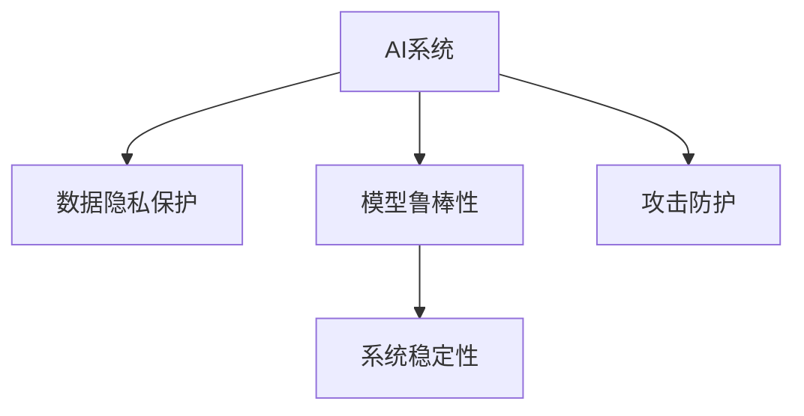

                 

# AI系统的信息化与安全性

## 1. 背景介绍

### 1.1 问题由来

在当前的信息化时代，人工智能（AI）系统在医疗、金融、教育、工业、安全等多个领域的应用变得越来越广泛。AI系统通过大数据、机器学习等技术手段，实现了对海量数据的高效处理与智能决策。然而，随着AI系统在实际应用中的不断深化，其安全性问题也越来越受到关注。

### 1.2 问题核心关键点

AI系统的安全性涉及多方面内容，包括数据隐私保护、模型鲁棒性、系统稳定性和攻击防护等。这些问题直接关系到AI系统的可信度和应用效果，对于提升用户信任、促进AI技术应用具有重要意义。

## 2. 核心概念与联系

### 2.1 核心概念概述

为更好地理解AI系统的安全性问题，本节将介绍几个密切相关的核心概念：

- **AI系统**：利用机器学习、深度学习等技术手段，通过大量数据训练得到的智能决策系统。
- **数据隐私保护**：保护用户数据不被未授权获取、篡改和泄漏。
- **模型鲁棒性**：指模型在面对不同数据分布、噪声干扰等情况时仍能保持稳定输出的能力。
- **系统稳定性**：确保AI系统在面对各种异常情况时能够稳定运行，不发生系统崩溃或异常输出。
- **攻击防护**：防止恶意攻击者利用AI系统漏洞进行非法操作，保护系统安全和数据安全。

这些核心概念之间的逻辑关系可以通过以下Mermaid流程图来展示：



这个流程图展示出AI系统的各个核心概念之间的逻辑关系：

1. AI系统通过数据隐私保护、模型鲁棒性和攻击防护等技术手段，提升系统的安全性。
2. 数据隐私保护保障用户数据的安全，防止数据泄露和滥用。
3. 模型鲁棒性确保模型在面对各种数据分布和干扰时仍能保持稳定输出。
4. 系统稳定性保障系统在异常情况下的正常运行，防止系统崩溃或异常输出。
5. 攻击防护防止恶意攻击，确保系统不受非法攻击的影响。

## 3. 核心算法原理 & 具体操作步骤

### 3.1 算法原理概述

AI系统的安全性问题可以通过以下算法原理来解决：

- **数据隐私保护算法**：如差分隐私、同态加密、联邦学习等，能够在保护数据隐私的前提下，确保AI系统能正常使用。
- **模型鲁棒性算法**：如对抗训练、噪声注入、数据扩充等，提升模型对各种数据分布和干扰的适应能力。
- **系统稳定性算法**：如梯度裁剪、正则化、dropout等，防止系统在面对异常数据和攻击时发生不稳定。
- **攻击防护算法**：如异常检测、模型脱敏、系统加固等，防止恶意攻击对系统造成破坏。

### 3.2 算法步骤详解

以下是AI系统安全性问题的解决步骤：

**Step 1: 数据隐私保护**

- **差分隐私算法**：在数据预处理和模型训练过程中，加入噪声或随机化操作，防止数据分析时泄露个人隐私。
- **同态加密算法**：利用数学原理，在加密状态下进行数据运算，确保数据隐私不被泄露。
- **联邦学习算法**：多个参与方通过各自的数据模型进行协同训练，不共享原始数据，保护数据隐私。

**Step 2: 模型鲁棒性提升**

- **对抗训练算法**：在训练过程中，加入对抗样本进行训练，提升模型的鲁棒性。
- **噪声注入算法**：在模型输入中添加噪声，增强模型对数据分布变化的适应能力。
- **数据扩充算法**：通过生成或扩充数据集，提升模型对各种数据分布的适应能力。

**Step 3: 系统稳定性保障**

- **梯度裁剪算法**：限制梯度的大小，防止梯度爆炸或消失，确保模型训练稳定。
- **正则化算法**：在损失函数中加入正则项，防止过拟合，确保模型泛化能力强。
- **dropout算法**：在训练过程中，随机丢弃神经元，防止过拟合，提升模型鲁棒性。

**Step 4: 攻击防护措施**

- **异常检测算法**：通过监测模型输出和系统状态，及时发现异常情况，防止恶意攻击。
- **模型脱敏算法**：通过混淆和扰动，降低模型对恶意攻击的敏感度。
- **系统加固措施**：通过加密存储、访问控制、权限管理等手段，防止系统被非法攻击。

### 3.3 算法优缺点

AI系统安全性问题解决算法的优点包括：

- **保护隐私**：通过各种隐私保护算法，确保数据在收集、存储和使用过程中不泄露用户隐私。
- **提高鲁棒性**：通过对抗训练、噪声注入等方法，提升模型对各种数据分布和干扰的适应能力。
- **保障稳定性**：通过梯度裁剪、正则化等措施，防止系统在异常情况下的不稳定运行。
- **防护攻击**：通过异常检测、模型脱敏等手段，防止恶意攻击对系统造成破坏。

同时，这些算法也存在一定的局限性：

- **复杂度较高**：一些隐私保护和鲁棒性算法涉及复杂的数学计算，实现难度较大。
- **资源消耗大**：对抗训练、噪声注入等算法需要额外的计算资源，可能影响系统性能。
- **安全性难以完全保障**：即使采用了多种安全性措施，仍然存在被攻破的可能性。
- **隐私保护与实用性之间的权衡**：一些隐私保护算法可能会牺牲部分系统性能，需要在隐私保护和实用性之间进行权衡。

## 4. 数学模型和公式 & 详细讲解 & 举例说明

### 4.1 数学模型构建

在AI系统的安全性问题中，数学模型的构建是非常重要的一环。这里我们以差分隐私为例，来详细讲解数学模型的构建和公式推导过程。

**差分隐私**：差分隐私是指在数据分析过程中，添加噪声以保护个体隐私，使得任何个体数据的加入或删除对数据分析结果的影响极小。差分隐私可以表示为以下数学公式：

$$
\Pr[D(S_1) = S] \leq \exp\left(-\epsilon \cdot \frac{D(f(S))}{\delta}\right)
$$

其中，$S$ 为数据集，$S_1$ 为$S$ 添加一个或删除一个样本后的数据集，$\epsilon$ 为隐私预算，$\delta$ 为数据库的变动量，$D(f(S))$ 表示在数据集$S$上执行函数$f$的结果与在$S_1$上执行函数$f$的结果之间的距离。

### 4.2 公式推导过程

差分隐私的公式推导过程如下：

1. 定义隐私预算$\epsilon$和数据库的变动量$\delta$。
2. 计算在数据集$S$上执行函数$f$的结果与在$S_1$上执行函数$f$的结果之间的距离$D(f(S))$。
3. 根据隐私预算和变动量，计算概率$Pr[D(S_1) = S]$。
4. 通过概率不等式，得到差分隐私的保护条件：

$$
\Pr[D(S_1) = S] \leq \exp\left(-\epsilon \cdot \frac{D(f(S))}{\delta}\right)
$$

差分隐私的公式推导过程展示了如何在数据保护和数据分析之间进行权衡，确保隐私保护的同时，最大限度地利用数据进行有效分析。

### 4.3 案例分析与讲解

以下是差分隐私的实际应用案例：

1. **医疗数据分析**：在医疗数据分析中，通过差分隐私保护患者隐私，使得数据可以在不泄露个人隐私的前提下，用于疾病分析和公共卫生决策。
2. **社会调查**：在社会调查中，通过差分隐私保护受访者的隐私，使得调查结果可以公开发布，同时确保每个人的隐私不被泄露。
3. **广告投放**：在广告投放中，通过差分隐私保护用户数据，使得广告投放策略可以在不泄露用户个人信息的前提下，进行有效分析。

## 5. 项目实践：代码实例和详细解释说明

### 5.1 开发环境搭建

在进行AI系统安全性问题解决时，需要搭建开发环境。以下是使用Python进行差分隐私开发的环境配置流程：

1. 安装Anaconda：从官网下载并安装Anaconda，用于创建独立的Python环境。
2. 创建并激活虚拟环境：
```bash
conda create -n differential_privacy python=3.8 
conda activate differential_privacy
```

3. 安装必要的Python包：
```bash
pip install numpy pandas sympy differential_privacy
```

4. 安装差分隐私库：
```bash
pip install differential_privacy
```

完成上述步骤后，即可在`differential_privacy`环境中开始开发。

### 5.2 源代码详细实现

以下是使用Python进行差分隐私开发的示例代码：

```python
from differential_privacy import Laplace, DifferentialPrivacy
import numpy as np
import pandas as pd

# 设置隐私预算
epsilon = 1
delta = 0.1

# 构造差分隐私对象
dp = DifferentialPrivacy(epsilon=epsilon, delta=delta)

# 定义数据集
data = pd.DataFrame({'x': np.random.normal(), 'y': np.random.normal()})

# 在数据集上执行函数
f = dp.apply_function(lambda x: x['x'] + x['y'])

# 计算结果的差分隐私保护条件
dp_result = dp.check_privacy(data, f)

print(dp_result)
```

### 5.3 代码解读与分析

让我们再详细解读一下关键代码的实现细节：

**DifferentialPrivacy类**：
- `__init__`方法：初始化隐私预算$\epsilon$和数据库的变动量$\delta$。
- `apply_function`方法：在数据集上执行指定的函数$f$，并计算结果的隐私保护条件。

**差分隐私计算**：
- 在数据集上执行函数$f$时，差分隐私库会自动加入噪声，确保结果的隐私保护。
- 通过调用`check_privacy`方法，可以检查差分隐私保护条件是否满足。

**应用场景**：
- 在医疗数据分析中，可以通过差分隐私保护患者隐私，确保数据集在公开分析时，不泄露任何个体信息。
- 在社会调查中，可以通过差分隐私保护受访者的隐私，使得调查结果可以公开发布，同时确保每个人的隐私不被泄露。

## 6. 实际应用场景

### 6.1 医疗数据分析

在医疗数据分析中，差分隐私可以用于保护患者隐私，使得数据集在公开分析时，不泄露任何个体信息。具体应用如下：

- **病历数据**：在病历数据分析中，差分隐私可以保护患者隐私，使得数据分析结果可以在不泄露患者个人信息的前提下，用于疾病分析和公共卫生决策。
- **基因数据**：在基因数据分析中，差分隐私可以保护患者隐私，使得基因数据可以在不泄露患者信息的前提下，用于遗传疾病研究和药物开发。

### 6.2 金融数据分析

在金融数据分析中，差分隐私可以用于保护用户隐私，使得数据集在公开分析时，不泄露任何个体信息。具体应用如下：

- **交易数据**：在交易数据分析中，差分隐私可以保护用户隐私，使得交易数据可以在不泄露用户个人信息的前提下，用于风险评估和金融监管。
- **信用数据**：在信用数据分析中，差分隐私可以保护用户隐私，使得信用数据可以在不泄露用户信息的前提下，用于信用评估和信贷决策。

### 6.3 社交网络分析

在社交网络分析中，差分隐私可以用于保护用户隐私，使得数据集在公开分析时，不泄露任何个体信息。具体应用如下：

- **好友关系**：在好友关系数据分析中，差分隐私可以保护用户隐私，使得好友关系数据可以在不泄露用户信息的前提下，用于社交网络分析和推荐系统设计。
- **互动数据**：在互动数据分析中，差分隐私可以保护用户隐私，使得互动数据可以在不泄露用户信息的前提下，用于用户行为分析和广告推荐。

### 6.4 未来应用展望

随着差分隐私技术的不断发展和应用，未来将有更多的场景可以采用差分隐私技术来保护用户隐私。以下是未来可能的趋势：

1. **大规模数据集隐私保护**：差分隐私技术可以应用于大规模数据集的隐私保护，如大数据分析和数据共享。
2. **分布式数据隐私保护**：差分隐私技术可以应用于分布式数据集的保护，如多机构协同数据分析。
3. **实时数据隐私保护**：差分隐私技术可以应用于实时数据的隐私保护，如实时监控和大数据分析。
4. **隐私保护与数据利用相结合**：差分隐私技术可以与数据利用相结合，实现隐私保护与数据利用的双重目标。

## 7. 工具和资源推荐

### 7.1 学习资源推荐

为了帮助开发者系统掌握差分隐私技术，这里推荐一些优质的学习资源：

1. **《差分隐私基础》**：介绍差分隐私的基本概念和应用，适合初学者入门。
2. **《差分隐私：实践与挑战》**：讨论差分隐私的实现和挑战，适合进阶学习。
3. **《差分隐私：算法与实现》**：讲解差分隐私算法的实现细节，适合深入研究。
4. **《差分隐私与数据保护》**：研究差分隐私在实际应用中的各种问题和解决方法，适合理论研究。
5. **差分隐私课程**：许多大学和机构提供的差分隐私课程，涵盖从基础到高级的各个方面。

### 7.2 开发工具推荐

高效的开发离不开优秀的工具支持。以下是几款用于差分隐私开发的常用工具：

1. **Anaconda**：用于创建和管理Python环境，适合差分隐私开发。
2. **Jupyter Notebook**：交互式编程环境，适合数据分析和差分隐私实验。
3. **PyTorch**：深度学习框架，支持差分隐私计算。
4. **TensorFlow**：深度学习框架，支持差分隐私计算。
5. **scikit-learn**：机器学习库，支持差分隐私计算。

### 7.3 相关论文推荐

差分隐私技术的发展源于学界的持续研究。以下是几篇奠基性的相关论文，推荐阅读：

1. **《差分隐私》**：介绍差分隐私的基本概念和应用，是差分隐私领域的经典著作。
2. **《差分隐私在医疗数据中的应用》**：研究差分隐私在医疗数据保护中的应用，提出了一些具体实现方法。
3. **《差分隐私在金融数据分析中的应用》**：研究差分隐私在金融数据分析中的应用，提出了一些具体实现方法。
4. **《差分隐私在社交网络中的应用》**：研究差分隐私在社交网络数据保护中的应用，提出了一些具体实现方法。

## 8. 总结：未来发展趋势与挑战

### 8.1 总结

本文对AI系统的安全性问题进行了全面系统的介绍。首先阐述了差分隐私的基本概念和应用，明确了差分隐私在数据保护方面的重要价值。其次，从原理到实践，详细讲解了差分隐私的数学模型和具体实现方法，给出了差分隐私开发的完整代码实例。同时，本文还探讨了差分隐私在医疗、金融、社交网络等多个领域的应用前景，展示了差分隐私技术的广泛应用潜力。此外，本文精选了差分隐私学习的相关资源，力求为读者提供全方位的技术指引。

通过本文的系统梳理，可以看到，差分隐私技术在AI系统的安全性问题解决中具有重要的地位，是保护数据隐私的重要手段。未来，伴随差分隐私技术的不断演进，AI系统将能够更加安全、可靠地处理海量数据，为人类认知智能的进化提供坚实的基础。

### 8.2 未来发展趋势

展望未来，差分隐私技术将呈现以下几个发展趋势：

1. **隐私预算优化**：隐私预算优化是差分隐私的重要研究方向，通过调整隐私预算，可以在隐私保护和数据利用之间进行更好的权衡。
2. **分布式隐私保护**：分布式隐私保护技术可以应用于多机构协同数据分析，确保各参与方的数据隐私。
3. **实时隐私保护**：实时隐私保护技术可以应用于实时监控和大数据分析，确保数据在实时采集时的隐私保护。
4. **隐私保护与数据利用相结合**：隐私保护技术可以与数据利用相结合，实现隐私保护与数据利用的双重目标。
5. **隐私保护算法优化**：差分隐私算法的优化是未来的重要研究方向，通过算法优化可以提高隐私保护的效率和效果。

以上趋势凸显了差分隐私技术的广阔前景。这些方向的探索发展，必将进一步提升AI系统的安全性，确保数据在处理和使用过程中的隐私保护。

### 8.3 面临的挑战

尽管差分隐私技术已经取得了瞩目成就，但在迈向更加智能化、普适化应用的过程中，它仍面临着诸多挑战：

1. **隐私预算分配**：如何在隐私预算有限的情况下，合理分配隐私预算，保护重要数据的隐私。
2. **隐私保护与数据利用之间的权衡**：如何在隐私保护和数据利用之间进行更好的权衡，实现隐私保护与数据利用的双重目标。
3. **数据敏感性分析**：如何识别和分析数据的敏感性，确保隐私保护的重点和力度。
4. **隐私保护算法的复杂度**：差分隐私算法涉及复杂的数学计算，实现难度较大，需要更多的技术支持。
5. **隐私保护技术与业务流程的结合**：如何将隐私保护技术与实际业务流程相结合，提升隐私保护的效果和效率。

这些挑战亟需学界和产业界共同努力，寻求有效的解决方案，才能使差分隐私技术在实际应用中发挥更大的作用。

### 8.4 研究展望

未来，差分隐私技术的研究方向将包括：

1. **隐私保护算法的优化**：通过算法优化，提高差分隐私保护的效果和效率。
2. **隐私预算的合理分配**：研究隐私预算的合理分配方法，确保隐私保护的重点和力度。
3. **数据敏感性分析**：研究数据敏感性分析方法，识别和分析数据的敏感性，确保隐私保护的重点和力度。
4. **隐私保护与数据利用的结合**：研究隐私保护与数据利用的结合方法，实现隐私保护与数据利用的双重目标。
5. **隐私保护技术的推广应用**：推广隐私保护技术在各个领域的应用，提升AI系统的安全性。

这些研究方向将为差分隐私技术的发展提供新的突破口，为人类认知智能的进化提供坚实的基础。

## 9. 附录：常见问题与解答

**Q1：差分隐私算法有哪些优点和缺点？**

A: 差分隐私算法的优点包括：

- **保护隐私**：通过添加噪声，确保数据在分析过程中不被泄露。
- **应用广泛**：差分隐私算法可以应用于多种数据集的保护，包括医疗、金融、社交网络等。
- **可解释性强**：差分隐私算法的原理简单明了，易于理解和实现。

差分隐私算法的缺点包括：

- **资源消耗大**：差分隐私算法涉及复杂的数学计算，需要额外的计算资源，可能影响系统性能。
- **隐私保护与数据利用之间的权衡**：差分隐私算法需要在隐私保护和数据利用之间进行权衡，有时可能会牺牲部分系统性能。
- **隐私预算难以确定**：隐私预算的确定需要根据具体应用场景进行调整，有时可能难以确定合适的预算值。

**Q2：差分隐私算法如何实现？**

A: 差分隐私算法可以通过以下步骤实现：

1. **隐私预算设置**：设置隐私预算$\epsilon$和数据库的变动量$\delta$。
2. **数据预处理**：对数据进行预处理，包括数据标准化、归一化等。
3. **添加噪声**：在数据上添加噪声，确保数据在分析过程中不被泄露。
4. **隐私保护条件检查**：检查隐私保护条件是否满足，如果不满足，则重新调整噪声大小。

**Q3：差分隐私算法有哪些应用场景？**

A: 差分隐私算法可以应用于以下场景：

1. **医疗数据分析**：在医疗数据分析中，差分隐私可以保护患者隐私，使得数据集在公开分析时，不泄露任何个体信息。
2. **金融数据分析**：在金融数据分析中，差分隐私可以保护用户隐私，使得数据集在公开分析时，不泄露任何个体信息。
3. **社交网络分析**：在社交网络分析中，差分隐私可以保护用户隐私，使得数据集在公开分析时，不泄露任何个体信息。
4. **广告投放**：在广告投放中，差分隐私可以保护用户隐私，使得广告投放策略可以在不泄露用户个人信息的前提下，进行有效分析。

**Q4：如何提高差分隐私算法的效率？**

A: 提高差分隐私算法的效率可以从以下几个方面入手：

1. **优化隐私预算**：通过优化隐私预算的分配，确保隐私保护的重点和力度，提高隐私保护的效率。
2. **减少噪声大小**：通过减少噪声大小，降低计算资源的消耗，提高隐私保护的效率。
3. **优化数据预处理**：通过优化数据预处理流程，提高数据处理的速度，降低计算资源的消耗。
4. **优化隐私保护条件检查**：通过优化隐私保护条件的检查流程，提高隐私保护条件的检查速度，降低计算资源的消耗。

**Q5：差分隐私算法在实际应用中有哪些挑战？**

A: 差分隐私算法在实际应用中面临以下挑战：

1. **隐私预算难以确定**：隐私预算的确定需要根据具体应用场景进行调整，有时可能难以确定合适的预算值。
2. **隐私保护与数据利用之间的权衡**：差分隐私算法需要在隐私保护和数据利用之间进行权衡，有时可能会牺牲部分系统性能。
3. **数据敏感性分析**：如何识别和分析数据的敏感性，确保隐私保护的重点和力度。
4. **隐私预算的分配**：如何在隐私预算有限的情况下，合理分配隐私预算，保护重要数据的隐私。
5. **隐私保护算法的复杂度**：差分隐私算法涉及复杂的数学计算，实现难度较大，需要更多的技术支持。

差分隐私算法虽然在数据隐私保护方面具有重要价值，但在实际应用中仍需面对诸多挑战，需要学界和产业界共同努力，寻求有效的解决方案。

---

作者：禅与计算机程序设计艺术 / Zen and the Art of Computer Programming

