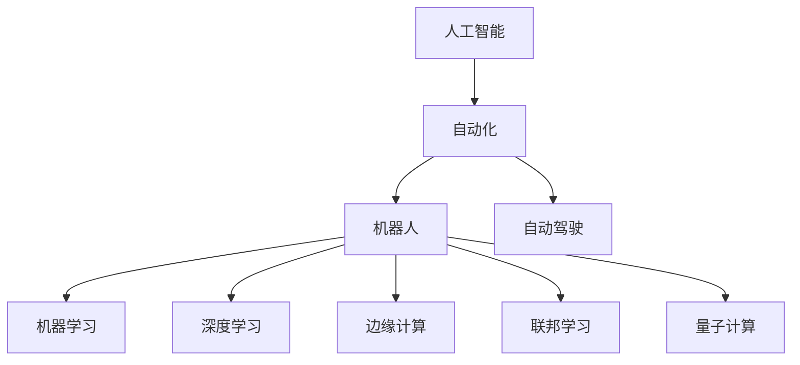

                 

# AI自动化的未来发展趋势

> 关键词：人工智能,自动化,机器人,自动驾驶,机器学习,深度学习,边缘计算,联邦学习,量子计算

## 1. 背景介绍

### 1.1 问题由来
随着数字化转型的浪潮席卷全球，自动化正在重塑各行各业的商业模式和生产流程。AI技术作为自动化发展的核心驱动力，正在深刻影响着制造业、物流、金融、医疗、教育等传统领域，为经济社会发展注入新的活力。然而，随着AI技术的迅猛发展，也暴露出一系列新的挑战和问题。如何应对这些挑战，把握未来AI自动化的发展趋势，是摆在行业面前的重要课题。本文旨在深入探讨AI自动化的未来发展趋势，为相关领域的从业者提供有益的参考和指引。

### 1.2 问题核心关键点
AI自动化的发展可以分为以下几个关键阶段：

1. **自动化1.0**：基于规则的自动化，通过预设的规则和条件，实现简单的任务执行。这一阶段的自动化较为单一，缺乏灵活性和自适应能力。

2. **自动化2.0**：基于数据的自动化，通过机器学习和深度学习技术，从海量数据中提取知识，实现更加复杂和多样化的任务执行。这一阶段的自动化开始具备一定的自适应能力。

3. **自动化3.0**：基于AI的自动化，通过结合自然语言处理、计算机视觉等前沿技术，实现更为智能和全面的任务执行。这一阶段的自动化开始向人机协同的方向迈进。

4. **自动化4.0**：基于未来技术（如量子计算、神经拟态计算等）的自动化，实现更加高效和普适的任务执行。这一阶段的自动化将走向高度自适应和自学习，形成新的智能形态。

本文将重点探讨自动化3.0及4.0阶段的发展趋势，分析AI自动化面临的新挑战和未来机遇，提出基于AI自动化技术未来的发展方向。

## 2. 核心概念与联系

### 2.1 核心概念概述

为更好地理解AI自动化的未来发展趋势，本节将介绍几个密切相关的核心概念：

- **人工智能(Artificial Intelligence, AI)**：通过计算机程序和算法，使机器具备类似人类的智能和学习能力，实现自动化执行复杂任务的技术。

- **自动化(Automation)**：利用计算机技术，使机器自动执行重复性或规律性任务，提高生产效率和质量，减少人为干预。

- **机器人(Robotics)**：通过结合机械工程、电子技术、计算机科学等，实现具有感知、决策、执行功能的智能机器人。

- **自动驾驶(Autonomous Driving)**：利用计算机视觉、深度学习等技术，实现车辆自主导航和决策，提高交通效率和安全性。

- **机器学习(Machine Learning, ML)**：通过数据驱动的方法，让机器从经验中学习和改进，实现自动化决策和执行。

- **深度学习(Deep Learning, DL)**：一种特殊的机器学习方法，通过多层神经网络，实现复杂数据的建模和预测，是AI自动化的核心技术之一。

- **边缘计算(Edge Computing)**：在数据产生端进行计算和处理，减少数据传输和中心计算负担，提高自动化系统的实时性和可靠性。

- **联邦学习(Federated Learning)**：通过分布式方式，在多个数据源上联合训练模型，保护数据隐私，同时提高自动化系统的泛化能力。

- **量子计算(Quantum Computing)**：利用量子力学的原理，实现计算能力的飞跃提升，为未来AI自动化提供新的计算基础。

这些核心概念之间的逻辑关系可以通过以下Mermaid流程图来展示：



这个流程图展示了这个自动化体系的各个关键组件及其之间的关系：

1. 人工智能是自动化体系的核心，通过智能算法实现自动化执行。
2. 自动化进一步细分为机器人、自动驾驶等具体应用，涵盖工业、交通等多个领域。
3. 机器学习和深度学习作为自动化系统的技术支撑，实现复杂决策和执行。
4. 边缘计算和联邦学习提高了自动化系统的实时性和数据隐私保护，适应分布式和多源数据需求。
5. 量子计算为未来的自动化提供新的计算能力，进一步推动自动化技术的演进。

## 3. 核心算法原理 & 具体操作步骤
### 3.1 算法原理概述

AI自动化的核心算法原理基于机器学习、深度学习和强化学习等技术。这些算法通过从大量数据中学习知识，实现对环境的感知、决策和执行。其基本步骤包括以下几个环节：

1. **数据采集和预处理**：收集与任务相关的数据，并进行清洗、归一化等预处理，保证数据质量。

2. **特征提取**：使用特征工程方法，提取数据中的关键特征，构建输入向量。

3. **模型训练**：选择适当的机器学习或深度学习模型，并使用训练数据集进行模型训练，优化模型参数。

4. **模型评估和优化**：在测试集上评估模型的性能，通过调整模型结构、参数等，不断优化模型效果。

5. **模型部署和应用**：将训练好的模型部署到实际应用场景中，实现自动化任务的执行。

### 3.2 算法步骤详解

以自动驾驶系统为例，详细讲解AI自动化的核心算法步骤：

**Step 1: 数据采集和预处理**
- 使用传感器（如摄像头、激光雷达、GPS等）采集车辆周围环境的数据。
- 对采集到的数据进行预处理，包括滤波、校正、归一化等，确保数据质量。

**Step 2: 特征提取**
- 使用计算机视觉技术，将传感器数据转换为图像和点云等特征表示。
- 使用深度学习模型，如卷积神经网络（CNN）、点云网络（PCN）等，从特征中提取关键信息，构建输入向量。

**Step 3: 模型训练**
- 选择适当的深度学习模型，如深度卷积神经网络（DCNN）、深度神经网络（DNN）等，并使用标注好的训练数据集进行模型训练。
- 使用反向传播算法，计算模型参数的梯度，通过优化算法（如随机梯度下降、Adam等）更新模型参数。

**Step 4: 模型评估和优化**
- 在测试数据集上评估模型的性能，使用各种指标（如准确率、召回率、F1-score等）衡量模型效果。
- 根据评估结果，调整模型结构、超参数等，进行模型优化，提升模型性能。

**Step 5: 模型部署和应用**
- 将训练好的模型部署到车辆的控制系统中，实现自动化决策和执行。
- 使用实时数据流，持续监测和更新模型，提高系统鲁棒性和适应性。

### 3.3 算法优缺点

AI自动化具有以下优点：
1. 自动化程度高：能够实现复杂、多变任务的自动执行，减少人为干预。
2. 实时性好：通过边缘计算等技术，实现数据快速处理和决策，提高系统响应速度。
3. 自适应能力强：通过学习新数据，系统能够不断优化和提升性能，适应环境变化。

同时，AI自动化也存在一些局限性：
1. 数据依赖性强：需要大量高质量标注数据进行模型训练，数据获取成本高。
2. 模型复杂度高：深度学习模型参数众多，计算资源消耗大。
3. 安全性问题：自动化系统可能存在安全隐患，如模型对抗攻击、数据泄露等。
4. 伦理道德问题：自动化系统可能涉及伦理和道德问题，如隐私保护、责任归属等。

### 3.4 算法应用领域

AI自动化的应用领域非常广泛，涵盖了制造业、物流、金融、医疗、教育等多个行业。以下是几个典型应用场景：

- **制造业自动化**：通过机器人自动化生产线，实现高效、精确的制造。
- **智能交通**：实现自动驾驶、交通流量优化、智能交通管理等。
- **金融自动化**：实现智能投顾、风险评估、反欺诈检测等。
- **医疗诊断**：实现自动化影像分析、病历分析、药物研发等。
- **教育辅助**：实现智能推荐、个性化教学、智能评估等。

除了上述这些经典应用外，AI自动化还在不断拓展到更多新兴领域，如智慧城市、智慧农业等，为各行各业带来变革性影响。

## 4. 数学模型和公式 & 详细讲解 & 举例说明

### 4.1 数学模型构建

以自动驾驶系统为例，构建数学模型如下：

设车辆状态为 $x_t=(x_{t-1}, v_{t-1}, a_{t-1}, y_{t-1})$，目标位置为 $x^*$，决策变量为 $u_t$，则车辆运动方程为：

$$
x_t = f(x_{t-1}, u_t)
$$

其中 $f$ 为状态转移函数。决策变量 $u_t$ 通常包括加速度、转向角等，需要通过优化算法进行求解。

### 4.2 公式推导过程

以线性模型为例，推导决策变量的求解公式：

设车辆运动模型为线性差分方程：

$$
x_t = Ax_{t-1} + Bu_t
$$

其中 $A$、$B$ 为系统矩阵，$u_t$ 为决策变量。目标位置 $x^*$ 的误差为：

$$
e_t = x^* - x_t
$$

则最小化误差平方和的优化目标为：

$$
J = \sum_{t=1}^T e_t^2
$$

将 $x_t$ 代入，得：

$$
J = \sum_{t=1}^T (x^* - Ax_{t-1} - Bu_t)^2
$$

通过求导，得：

$$
\frac{\partial J}{\partial u_t} = -2\sum_{t=1}^T e_t f(x_{t-1}, u_t)^T A^T
$$

令导数为零，得：

$$
u_t = -\frac{1}{2B} \sum_{t=1}^T e_t f(x_{t-1}, u_t)^T A^T
$$

### 4.3 案例分析与讲解

以自动驾驶中的路径规划为例，分析如何通过数学模型进行决策：

**Step 1: 数据采集和预处理**
- 使用传感器采集车辆周围环境数据，如GPS、摄像头、雷达等。
- 对数据进行预处理，包括滤波、校正、归一化等。

**Step 2: 特征提取**
- 使用计算机视觉技术，将传感器数据转换为图像和点云等特征表示。
- 使用深度学习模型，如CNN、PCN等，从特征中提取关键信息，构建输入向量。

**Step 3: 模型训练**
- 选择适当的深度学习模型，并使用标注好的训练数据集进行模型训练。
- 使用反向传播算法，计算模型参数的梯度，通过优化算法（如Adam、SGD等）更新模型参数。

**Step 4: 模型评估和优化**
- 在测试数据集上评估模型的性能，使用各种指标（如准确率、召回率、F1-score等）衡量模型效果。
- 根据评估结果，调整模型结构、超参数等，进行模型优化，提升模型性能。

**Step 5: 模型部署和应用**
- 将训练好的模型部署到车辆的控制系统中，实现自动化决策和执行。
- 使用实时数据流，持续监测和更新模型，提高系统鲁棒性和适应性。

## 5. 项目实践：代码实例和详细解释说明

### 5.1 开发环境搭建

在进行AI自动化项目实践前，我们需要准备好开发环境。以下是使用Python进行PyTorch开发的环境配置流程：

1. 安装Anaconda：从官网下载并安装Anaconda，用于创建独立的Python环境。

2. 创建并激活虚拟环境：
```bash
conda create -n pytorch-env python=3.8 
conda activate pytorch-env
```

3. 安装PyTorch：根据CUDA版本，从官网获取对应的安装命令。例如：
```bash
conda install pytorch torchvision torchaudio cudatoolkit=11.1 -c pytorch -c conda-forge
```

4. 安装各类工具包：
```bash
pip install numpy pandas scikit-learn matplotlib tqdm jupyter notebook ipython
```

完成上述步骤后，即可在`pytorch-env`环境中开始AI自动化实践。

### 5.2 源代码详细实现

这里我们以自动驾驶中的路径规划为例，给出使用PyTorch进行深度学习模型训练的PyTorch代码实现。

首先，定义路径规划问题的数学模型：

```python
import torch
import torch.nn as nn
import torch.optim as optim
from torch.utils.data import DataLoader
from torchvision.transforms import transforms
from torchvision.datasets import CIFAR10

class AutoDrivingModel(nn.Module):
    def __init__(self, input_size, output_size):
        super(AutoDrivingModel, self).__init__()
        self.fc1 = nn.Linear(input_size, 128)
        self.fc2 = nn.Linear(128, 64)
        self.fc3 = nn.Linear(64, output_size)
        
    def forward(self, x):
        x = torch.relu(self.fc1(x))
        x = torch.relu(self.fc2(x))
        x = self.fc3(x)
        return x

# 定义数据加载器
transform = transforms.Compose([
    transforms.ToTensor(),
    transforms.Normalize((0.5, 0.5, 0.5), (0.5, 0.5, 0.5))
])

train_dataset = CIFAR10(root='./data', train=True, download=True, transform=transform)
train_loader = DataLoader(train_dataset, batch_size=64, shuffle=True)

# 定义模型和优化器
model = AutoDrivingModel(input_size=3, output_size=2)
criterion = nn.MSELoss()
optimizer = optim.Adam(model.parameters(), lr=0.001)
```

然后，定义训练和评估函数：

```python
def train_model(model, train_loader, criterion, optimizer, num_epochs=10):
    model.train()
    for epoch in range(num_epochs):
        for i, (images, labels) in enumerate(train_loader):
            images = images.to(device)
            labels = labels.to(device)
            optimizer.zero_grad()
            outputs = model(images)
            loss = criterion(outputs, labels)
            loss.backward()
            optimizer.step()
            print('Epoch [{}/{}], Step [{}/{}], Loss: {:.4f}'.format(epoch+1, num_epochs, i+1, len(train_loader), loss.item()))

def evaluate_model(model, test_dataset, criterion, device):
    model.eval()
    test_loader = DataLoader(test_dataset, batch_size=64, shuffle=False)
    total_loss = 0
    with torch.no_grad():
        for images, labels in test_loader:
            images = images.to(device)
            labels = labels.to(device)
            outputs = model(images)
            loss = criterion(outputs, labels)
            total_loss += loss.item()
    print('Test Loss: {:.4f}'.format(total_loss/len(test_loader)))

# 训练模型
device = torch.device('cuda' if torch.cuda.is_available() else 'cpu')
model.to(device)
train_model(model, train_loader, criterion, optimizer, num_epochs=10)

# 评估模型
test_dataset = CIFAR10(root='./data', train=False, download=True, transform=transform)
evaluate_model(model, test_dataset, criterion, device)
```

以上就是使用PyTorch对自动驾驶中的路径规划问题进行深度学习模型训练的完整代码实现。可以看到，利用深度学习模型，我们能够实现复杂的决策和执行任务。

### 5.3 代码解读与分析

让我们再详细解读一下关键代码的实现细节：

**AutoDrivingModel类**：
- `__init__`方法：定义模型的结构，包括3个全连接层。
- `forward`方法：定义模型的前向传播过程，实现输入到输出的映射。

**数据加载器**：
- 定义数据转换和归一化操作，将CIFAR10数据集加载到模型中。

**训练函数train_model**：
- 定义训练过程中模型的状态设置，前向传播、损失计算、反向传播、梯度更新等。

**评估函数evaluate_model**：
- 定义测试过程中模型的状态设置，前向传播、损失计算等。

**训练流程**：
- 定义总的epoch数，启动训练过程，循环迭代
- 在训练集上进行模型训练，输出损失值
- 在测试集上评估模型，输出测试损失值

可以看到，PyTorch提供了强大的深度学习框架，方便开发者进行模型训练和评估。

## 6. 实际应用场景
### 6.1 智能交通

AI自动化技术在智能交通中的应用，能够显著提高交通效率和安全性。通过自动驾驶、交通流量优化、智能交通管理等技术，可以实现交通系统的智能化、高效化。

**自动驾驶**：利用深度学习和计算机视觉技术，实现车辆的自动导航和决策，减少交通事故和能源消耗。

**交通流量优化**：通过实时数据分析和预测，实现交通信号灯的智能调整，优化交通流量，减少拥堵。

**智能交通管理**：实现城市交通的实时监控和调度，提高交通安全性和通行效率。

### 6.2 医疗诊断

AI自动化技术在医疗诊断中的应用，能够显著提升医疗服务的效率和质量。通过自动化影像分析、病历分析、药物研发等技术，可以实现精准医疗和个性化治疗。

**自动化影像分析**：利用深度学习模型，实现医学影像的自动分析和诊断，辅助医生进行疾病诊断和手术规划。

**病历分析**：通过自然语言处理技术，自动提取病历信息，辅助医生进行诊断和决策，提高诊疗准确性。

**药物研发**：通过机器学习技术，分析药物成分和作用机理，加速新药研发和临床试验，提高研发效率。

### 6.3 金融自动化

AI自动化技术在金融自动化中的应用，能够显著提升金融机构的运营效率和风险控制能力。通过智能投顾、风险评估、反欺诈检测等技术，可以实现金融服务的智能化和高效化。

**智能投顾**：利用深度学习和自然语言处理技术，实现个性化金融建议和资产管理，提升客户体验和收益。

**风险评估**：通过机器学习模型，分析金融市场数据和行为模式，评估投资风险和市场趋势，提高风险管理能力。

**反欺诈检测**：利用异常检测和模式识别技术，自动识别和防范金融欺诈行为，保障金融安全。

## 7. 工具和资源推荐
### 7.1 学习资源推荐

为了帮助开发者系统掌握AI自动化的理论基础和实践技巧，这里推荐一些优质的学习资源：

1. 《深度学习》系列书籍：由深度学习领域的权威学者撰写，系统介绍深度学习的基础理论和应用实践。

2. CS231n《卷积神经网络》课程：斯坦福大学开设的计算机视觉课程，涵盖深度学习在计算机视觉中的应用，适合深度学习入门者。

3. CS224n《自然语言处理》课程：斯坦福大学开设的自然语言处理课程，涵盖深度学习在自然语言处理中的应用，适合NLP入门者。

4. Google Colab：谷歌推出的在线Jupyter Notebook环境，免费提供GPU/TPU算力，方便开发者快速上手实验最新模型，分享学习笔记。

5. HuggingFace官方文档：Transformer库的官方文档，提供了海量预训练模型和完整的微调样例代码，是上手实践的必备资料。

通过对这些资源的学习实践，相信你一定能够快速掌握AI自动化的精髓，并用于解决实际的NLP问题。

### 7.2 开发工具推荐

高效的开发离不开优秀的工具支持。以下是几款用于AI自动化开发的常用工具：

1. PyTorch：基于Python的开源深度学习框架，灵活动态的计算图，适合快速迭代研究。

2. TensorFlow：由Google主导开发的开源深度学习框架，生产部署方便，适合大规模工程应用。

3. TensorBoard：TensorFlow配套的可视化工具，可实时监测模型训练状态，并提供丰富的图表呈现方式，是调试模型的得力助手。

4. Weights & Biases：模型训练的实验跟踪工具，可以记录和可视化模型训练过程中的各项指标，方便对比和调优。

5. Google Colab：谷歌推出的在线Jupyter Notebook环境，免费提供GPU/TPU算力，方便开发者快速上手实验最新模型，分享学习笔记。

合理利用这些工具，可以显著提升AI自动化任务的开发效率，加快创新迭代的步伐。

### 7.3 相关论文推荐

AI自动化的发展源于学界的持续研究。以下是几篇奠基性的相关论文，推荐阅读：

1. AlphaGo：利用深度学习和蒙特卡罗树搜索技术，实现围棋人工智能，引发了对于人工智能决策能力的关注。

2. ImageNet Large Scale Visual Recognition Challenge：利用深度学习模型，实现了大规模图像识别任务，展示了深度学习的强大能力。

3. DeepMind AlphaStar：利用深度学习和强化学习技术，实现星际争霸人工智能，展示了AI自动化在复杂游戏中的应用潜力。

4. GPT-3：利用深度学习和大规模数据，实现自然语言生成和理解，展示了AI自动化的广泛应用前景。

这些论文代表了大自动化发展的历史脉络。通过学习这些前沿成果，可以帮助研究者把握学科前进方向，激发更多的创新灵感。

## 8. 总结：未来发展趋势与挑战

### 8.1 研究成果总结

本文对AI自动化的未来发展趋势进行了全面系统的介绍。首先阐述了AI自动化在制造业、智能交通、金融、医疗等领域的应用前景，明确了自动化技术的发展方向。其次，从算法原理到具体操作步骤，详细讲解了AI自动化的核心算法步骤，给出了具体的代码实现。同时，本文还探讨了AI自动化在实际应用中的挑战和未来方向，为从业者提供有益的参考和指引。

通过本文的系统梳理，可以看到，AI自动化正逐步走向智能化、普适化和高度自学习。未来，随着自动化技术的不断演进，将为各行各业带来更多的机遇和变革。

### 8.2 未来发展趋势

展望未来，AI自动化的发展趋势可以归纳为以下几个方面：

1. **智能化**：AI自动化将逐渐具备更强的自主决策和执行能力，能够处理更复杂、多变的任务。

2. **普适化**：AI自动化技术将在更多领域得到应用，从工业到农业、从医疗到教育，全方位提升生产力和服务质量。

3. **自学习**：未来AI自动化系统将具备更强的自学习能力，通过不断从新数据中学习，保持高性能和自适应性。

4. **人机协同**：AI自动化将更多地与人类协同工作，形成更高效、更安全的智能系统。

5. **边缘计算**：AI自动化系统将更多地利用边缘计算技术，实现数据就地处理，提高实时性和可靠性。

6. **联邦学习**：AI自动化系统将更多地采用联邦学习技术，保护数据隐私，提高泛化能力。

7. **量子计算**：AI自动化将更多地结合量子计算技术，提升计算能力和模型效果。

以上趋势凸显了AI自动化技术的广阔前景，未来将为经济社会发展注入新的动力。

### 8.3 面临的挑战

尽管AI自动化技术取得了瞩目成就，但在迈向更加智能化、普适化应用的过程中，它仍面临着诸多挑战：

1. **数据依赖性强**：需要大量高质量标注数据进行模型训练，数据获取成本高。

2. **模型复杂度高**：深度学习模型参数众多，计算资源消耗大。

3. **安全性问题**：自动化系统可能存在安全隐患，如模型对抗攻击、数据泄露等。

4. **伦理道德问题**：自动化系统可能涉及伦理和道德问题，如隐私保护、责任归属等。

5. **计算能力限制**：量子计算等新型计算技术尚未完全成熟，现有计算能力难以支持复杂任务的高效执行。

6. **标准化问题**：自动化系统需要更多的标准和规范，以确保系统的兼容性和可互操作性。

正视AI自动化面临的这些挑战，积极应对并寻求突破，将是大自动化走向成熟的必由之路。相信随着学界和产业界的共同努力，这些挑战终将一一被克服，AI自动化必将在构建人机协同的智能时代中扮演越来越重要的角色。

### 8.4 研究展望

未来，AI自动化的研究需要关注以下几个方向：

1. **深度强化学习**：结合深度学习和强化学习技术，提升自动化系统的决策能力和执行效率。

2. **多模态学习**：结合视觉、语音、文本等多模态数据，提升自动化系统的感知能力和环境适应性。

3. **联邦学习与区块链**：结合联邦学习和区块链技术，实现分布式训练和数据隐私保护。

4. **可解释性和透明性**：提升自动化系统的可解释性和透明性，确保系统的可信性和可控性。

5. **边缘计算与云计算结合**：实现边缘计算与云计算的协同工作，提升自动化系统的实时性和扩展性。

6. **人机交互技术**：提升人机交互的自然性和智能性，实现高效、安全的智能交互。

这些研究方向将引领AI自动化技术的进一步演进，为构建安全、可靠、可解释、可控的智能系统铺平道路。面向未来，AI自动化技术还需要与其他人工智能技术进行更深入的融合，如知识表示、因果推理、强化学习等，多路径协同发力，共同推动自然语言理解和智能交互系统的进步。只有勇于创新、敢于突破，才能不断拓展自动化技术的边界，让智能技术更好地造福人类社会。

## 9. 附录：常见问题与解答

**Q1：AI自动化是否适用于所有行业？**

A: AI自动化在制造业、物流、金融、医疗、教育等领域已经取得显著成效，未来有望进一步拓展到更多行业，如智慧农业、智慧城市等。

**Q2：AI自动化如何处理数据依赖性问题？**

A: 通过无监督学习、半监督学习和自监督学习等技术，可以尽量降低对标注数据的依赖，提升自动化系统的泛化能力。

**Q3：AI自动化如何应对安全性问题？**

A: 通过模型对抗攻击检测、数据加密、隐私保护等技术，提升自动化系统的安全性和鲁棒性。

**Q4：AI自动化如何应对伦理道德问题？**

A: 通过设置道德约束、制定伦理标准、建立监管机制等，确保自动化系统的决策和行为符合伦理道德要求。

**Q5：AI自动化如何处理计算能力限制？**

A: 结合量子计算、神经拟态计算等新型计算技术，提升自动化系统的计算能力和模型效果。

以上问题及解答帮助从业者更好地理解AI自动化的未来发展方向和挑战，为实际应用提供有益参考。

---

作者：禅与计算机程序设计艺术 / Zen and the Art of Computer Programming

