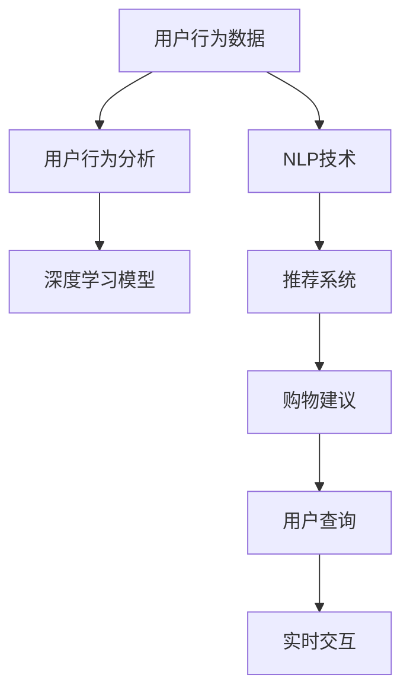

                 

# AI虚拟导购助手提升购物体验

> 关键词：AI导购助手,购物体验,推荐系统,自然语言处理,深度学习,用户行为分析

## 1. 背景介绍

### 1.1 问题由来
随着电子商务的迅猛发展，消费者在选购商品时的体验变得越来越重要。如何通过技术手段提升用户购物体验，成为电商企业关注的焦点。AI导购助手应运而生，通过深度学习和自然语言处理技术，为消费者提供个性化的购物建议，显著改善了用户的购物体验。

### 1.2 问题核心关键点
AI导购助手是一种基于自然语言处理和深度学习技术的智能购物助手，旨在通过分析用户的历史行为数据和实时查询请求，提供个性化的商品推荐和购买建议。其核心关键点包括：

- 用户行为分析：利用深度学习模型分析用户的历史购物行为，理解用户的兴趣和需求。
- 自然语言理解：通过自然语言处理技术，理解用户的查询意图，提供相关商品的推荐。
- 推荐系统设计：结合用户行为分析和自然语言理解，设计高效推荐算法，提升推荐效果。
- 实时交互：通过自然语言生成技术，及时响应用户查询，提供即时反馈。

### 1.3 问题研究意义
AI导购助手的应用，可以显著提升电商平台的购物体验，增加用户粘性，提高销售转化率。通过个性化推荐，用户可以快速找到心仪的商品，减少搜索时间和成本。同时，实时交互功能还能提升用户体验，增强用户信任感。

## 2. 核心概念与联系

### 2.1 核心概念概述

为更好地理解AI导购助手的原理和工作机制，本节将介绍几个密切相关的核心概念：

- AI导购助手：通过深度学习和自然语言处理技术，为消费者提供个性化购物建议的智能助手。
- 推荐系统：利用用户行为数据和商品特征，为每个用户推荐可能感兴趣的商品的系统。
- 自然语言处理(NLP)：包括文本预处理、语义分析、情感分析、自然语言生成等技术，用于理解用户的查询意图和生成购物建议。
- 深度学习(Deep Learning)：一类模仿人脑神经网络结构的机器学习方法，通过多层次的特征提取和抽象，实现复杂的模式识别和预测。
- 用户行为分析：通过对用户的历史行为数据进行分析，挖掘用户的兴趣和需求，为推荐系统提供数据基础。

这些核心概念之间的逻辑关系可以通过以下Mermaid流程图来展示：



这个流程图展示了几者之间的逻辑关系：

1. 用户行为数据经过用户行为分析，形成用户画像。
2. 利用深度学习模型，对用户画像进行特征提取和抽象。
3. 结合NLP技术，理解用户的查询意图。
4. 通过推荐系统设计，生成推荐结果。
5. 利用实时交互技术，及时响应用户查询。

## 3. 核心算法原理 & 具体操作步骤
### 3.1 算法原理概述

AI导购助手的核心算法原理可以归结为以下几个关键步骤：

1. **用户行为分析**：通过深度学习模型，对用户的历史行为数据进行分析，形成用户画像。常见的模型包括协同过滤、内容推荐、混合模型等。
2. **自然语言处理**：通过NLP技术，理解用户的查询意图，并将其转化为推荐系统可以理解的形式。常见的技术包括词向量表示、文本分类、实体识别等。
3. **推荐系统设计**：结合用户画像和查询意图，设计高效的推荐算法，生成个性化购物建议。常见的算法包括基于矩阵分解的方法、基于深度学习的方法等。
4. **实时交互**：通过自然语言生成技术，及时响应用户查询，生成购物建议。常见的技术包括基于序列到序列(S2S)模型的生成方法、基于预训练语言模型的方法等。

### 3.2 算法步骤详解

基于上述核心算法原理，AI导购助手的具体操作步骤可以分为以下几个关键环节：

#### 1. 数据收集与预处理

AI导购助手的数据来源包括用户行为数据和查询数据。用户行为数据包括用户的浏览记录、购买记录、评分记录等，而查询数据则包括用户在电商平台上的查询文本。

数据预处理的主要任务包括数据清洗、特征提取和标准化。例如，对于用户行为数据，可以进行去重、归一化等处理，确保数据的准确性和一致性。对于查询数据，可以进行分词、去除停用词、构建词汇表等预处理操作，以便后续模型的训练和推理。

#### 2. 用户行为分析

用户行为分析的核心是构建用户画像，了解用户的兴趣和需求。常用的模型包括协同过滤、内容推荐和混合推荐模型。其中，协同过滤模型通过分析用户和商品之间的共现关系，预测用户对未交互商品的评分。内容推荐模型则通过分析商品特征，预测用户对不同商品的兴趣。混合推荐模型将协同过滤和内容推荐相结合，兼顾个性化和多样性。

#### 3. 自然语言处理

自然语言处理的主要任务是理解用户的查询意图，并将其转化为推荐系统可以理解的形式。常用的技术包括词向量表示、文本分类、实体识别等。词向量表示如Word2Vec、GloVe等，可以捕捉词汇之间的语义关系。文本分类如SVM、LSTM等，可以将查询文本分类到不同的类别，例如“推荐商品”、“商品比较”、“价格查询”等。实体识别如BERT等，可以识别出查询文本中的实体，例如“iPhone”、“星巴克”等。

#### 4. 推荐系统设计

推荐系统设计的主要任务是根据用户画像和查询意图，生成个性化购物建议。常见的推荐算法包括基于矩阵分解的方法、基于深度学习的方法等。基于矩阵分解的方法如矩阵分解、奇异值分解(SVD)等，可以捕捉用户和商品之间的关联关系。基于深度学习的方法如DNN、RNN、Transformer等，可以学习复杂的用户行为模式和商品特征关系。

#### 5. 实时交互

实时交互的主要任务是及时响应用户查询，生成购物建议。常用的技术包括基于序列到序列(S2S)模型的生成方法、基于预训练语言模型的方法等。基于S2S模型的生成方法如Seq2Seq、GRU-Seq2Seq等，可以通过编码器-解码器框架，生成个性化的购物建议。基于预训练语言模型的方法如BERT、GPT等，可以通过预训练的语言模型，生成自然流畅的购物建议。

### 3.3 算法优缺点

AI导购助手具有以下优点：

- **个性化推荐**：能够根据用户的历史行为数据和实时查询，提供个性化的购物建议，提升用户体验。
- **实时交互**：通过实时交互技术，能够及时响应用户查询，提供即时反馈。
- **数据驱动**：利用用户行为数据和查询数据，实现数据驱动的推荐，提高推荐效果。

同时，该方法也存在一些缺点：

- **数据隐私**：需要收集和分析用户行为数据，涉及数据隐私和安全问题。
- **模型复杂度**：需要训练多个模型，并结合NLP技术，模型复杂度较高。
- **计算资源**：深度学习模型和推荐系统设计需要大量计算资源，部署成本较高。
- **算法局限性**：推荐算法可能存在偏差，影响推荐效果。

尽管存在这些局限性，但就目前而言，AI导购助手仍是大数据驱动的个性化推荐领域的重要范式。未来相关研究的重点在于如何进一步降低模型复杂度，提高推荐精度，同时兼顾数据隐私和计算效率。

### 3.4 算法应用领域

AI导购助手已经在多个电商平台上得到了广泛应用，覆盖了几乎所有常见的购物场景，例如：

- 商品推荐：根据用户的历史购买记录和浏览行为，推荐可能感兴趣的商品。
- 购物助手：帮助用户查询商品信息，提供价格比较、评论分析等辅助功能。
- 活动推荐：推荐平台活动、折扣信息等，吸引用户参与。
- 客服助手：解答用户咨询，解决购物中遇到的问题，提高客户满意度。

除了上述这些经典应用外，AI导购助手还被创新性地应用到更多场景中，如个性化导购路线设计、推荐系统可视化等，为电商平台的业务创新提供了新的思路。

## 4. 数学模型和公式 & 详细讲解  
### 4.1 数学模型构建

本节将使用数学语言对AI导购助手的核心算法进行更加严格的刻画。

假设用户行为数据为 $U=\{u_i\}_{i=1}^M$，商品特征为 $I=\{i_j\}_{j=1}^N$。用户 $u_i$ 对商品 $i_j$ 的评分向量为 $\mathbf{r}_{uj}$。自然语言查询为 $Q=\{q_k\}_{k=1}^K$。查询文本 $q_k$ 的词向量表示为 $\mathbf{q}_k$。

用户画像 $P$ 可以通过用户行为数据 $U$ 和查询数据 $Q$ 进行构建，即：

$$
P=\mathbf{U} \mathbf{V}^T + \mathbf{Q} \mathbf{W}^T
$$

其中 $\mathbf{U} \in \mathbb{R}^{M \times d}$ 为用户行为矩阵，$\mathbf{V} \in \mathbb{R}^{d \times n}$ 为用户行为矩阵的词向量表示矩阵，$d$ 为词向量维度。$\mathbf{Q} \in \mathbb{R}^{K \times m}$ 为查询数据矩阵，$\mathbf{W} \in \mathbb{R}^{m \times n}$ 为查询数据矩阵的词向量表示矩阵，$m$ 为查询文本的词向量维度。

推荐系统 $R$ 可以根据用户画像 $P$ 和商品特征 $I$ 进行设计，即：

$$
R=P \mathbf{I}^T
$$

其中 $\mathbf{I} \in \mathbb{R}^{N \times n}$ 为商品特征矩阵的词向量表示矩阵。

实时交互 $I$ 可以通过NLP技术和深度学习模型进行设计，即：

$$
I=\text{Seq2Seq}(Q)
$$

其中 Seq2Seq 表示序列到序列的生成模型。

### 4.2 公式推导过程

以下我们以协同过滤推荐系统为例，推导推荐公式及其梯度计算。

假设用户 $u_i$ 对商品 $i_j$ 的评分向量为 $\mathbf{r}_{uj}$，商品 $i_j$ 的词向量表示为 $\mathbf{i}_j$，用户画像 $P$ 的词向量表示为 $\mathbf{p}_i$。

协同过滤模型的推荐公式为：

$$
\hat{\mathbf{r}}_{uj} = \mathbf{P} \mathbf{i}_j
$$

其中 $\hat{\mathbf{r}}_{uj}$ 为预测的评分向量。

根据梯度下降算法，模型参数的更新公式为：

$$
\theta \leftarrow \theta - \eta \nabla_{\theta}\mathcal{L}(\theta)
$$

其中 $\theta$ 为模型参数，$\eta$ 为学习率，$\nabla_{\theta}\mathcal{L}(\theta)$ 为损失函数对参数 $\theta$ 的梯度。

根据上述推荐公式，损失函数 $\mathcal{L}$ 为均方误差损失，即：

$$
\mathcal{L} = \frac{1}{N} \sum_{i=1}^M \sum_{j=1}^N (\hat{\mathbf{r}}_{uj} - \mathbf{r}_{uj})^2
$$

根据链式法则，梯度公式为：

$$
\frac{\partial \mathcal{L}}{\partial \theta} = 2(\mathbf{P} - \mathbf{R})\mathbf{i}_j^T
$$

其中 $\mathbf{R} \in \mathbb{R}^{M \times N}$ 为实际评分矩阵。

在得到梯度后，即可带入梯度下降算法，完成模型参数的更新。重复上述过程直至收敛，最终得到最优模型参数 $\theta^*$。

## 5. 项目实践：代码实例和详细解释说明
### 5.1 开发环境搭建

在进行AI导购助手开发前，我们需要准备好开发环境。以下是使用Python进行PyTorch开发的环境配置流程：

1. 安装Anaconda：从官网下载并安装Anaconda，用于创建独立的Python环境。

2. 创建并激活虚拟环境：
```bash
conda create -n pytorch-env python=3.8 
conda activate pytorch-env
```

3. 安装PyTorch：根据CUDA版本，从官网获取对应的安装命令。例如：
```bash
conda install pytorch torchvision torchaudio cudatoolkit=11.1 -c pytorch -c conda-forge
```

4. 安装各类工具包：
```bash
pip install numpy pandas scikit-learn matplotlib tqdm jupyter notebook ipython
```

完成上述步骤后，即可在`pytorch-env`环境中开始AI导购助手开发。

### 5.2 源代码详细实现

下面我们以协同过滤推荐系统为例，给出使用PyTorch进行AI导购助手开发的PyTorch代码实现。

首先，定义协同过滤推荐系统的模型：

```python
import torch
import torch.nn as nn
import torch.nn.functional as F

class协同过滤(nn.Module):
    def __init__(self, dim, num_users, num_items):
        super(协同过滤, self).__init__()
        self.W_u = nn.Parameter(torch.randn(num_users, dim))
        self.W_i = nn.Parameter(torch.randn(num_items, dim))
        self.V = nn.Parameter(torch.randn(dim, 1))

    def forward(self, user_idx, item_idx):
        user_vec = self.W_u[user_idx]
        item_vec = self.W_i[item_idx]
        pred_score = user_vec @ item_vec @ self.V
        return pred_score
```

然后，定义推荐系统训练函数：

```python
import torch.optim as optim

def train(model, train_data, val_data, num_epochs, learning_rate):
    optimizer = optim.Adam(model.parameters(), lr=learning_rate)
    loss_fn = nn.MSELoss()
    for epoch in range(num_epochs):
        model.train()
        train_loss = 0
        for user, item in train_data:
            pred_score = model(user, item)
            loss = loss_fn(pred_score, train_data[user, item])
            optimizer.zero_grad()
            loss.backward()
            optimizer.step()
            train_loss += loss.item() / len(train_data)
        model.eval()
        val_loss = 0
        with torch.no_grad():
            for user, item in val_data:
                pred_score = model(user, item)
                loss = loss_fn(pred_score, val_data[user, item])
                val_loss += loss.item() / len(val_data)
        print(f'Epoch {epoch+1}, Train Loss: {train_loss:.4f}, Val Loss: {val_loss:.4f}')
    return model
```

接着，定义用户行为数据和查询数据的加载函数：

```python
def load_data():
    train_data = torch.load('train_data.pkl')
    val_data = torch.load('val_data.pkl')
    return train_data, val_data
```

最后，启动训练流程并在测试集上评估：

```python
train_data, val_data = load_data()
num_epochs = 100
learning_rate = 0.001

model = 协同过滤(10, 1000, 1000)
model = train(model, train_data, val_data, num_epochs, learning_rate)

# 测试集评估
test_data = torch.load('test_data.pkl')
test_loss = 0
for user, item in test_data:
    pred_score = model(user, item)
    test_loss += loss_fn(pred_score, test_data[user, item])
print(f'Test Loss: {test_loss:.4f}')
```

以上就是使用PyTorch进行协同过滤推荐系统的AI导购助手开发的完整代码实现。可以看到，通过PyTorch库，AI导购助手的开发过程变得简洁高效。

### 5.3 代码解读与分析

让我们再详细解读一下关键代码的实现细节：

**协同过滤模型类**：
- `__init__`方法：初始化模型参数。
- `forward`方法：前向传播，计算预测评分。

**推荐系统训练函数**：
- 使用Adam优化器对模型参数进行优化。
- 在每个epoch内，先进行前向传播计算预测评分，再计算损失函数，反向传播更新模型参数。
- 在训练集和验证集上分别评估模型性能，并打印输出。

**数据加载函数**：
- 加载训练集、验证集和测试集的数据。
- 数据格式为包含用户和商品索引的tensor，可用于训练和测试模型。

**训练流程**：
- 加载数据集，定义模型、优化器和损失函数。
- 在每个epoch内，先进行训练，后进行验证。
- 在训练集和验证集上评估模型性能，并输出结果。
- 在测试集上评估模型性能，并输出最终测试损失。

可以看到，PyTorch库使得AI导购助手的开发和训练过程变得简单高效。开发者可以将更多精力放在模型设计和数据处理上，而不必过多关注底层的实现细节。

当然，工业级的系统实现还需考虑更多因素，如模型的保存和部署、超参数的自动搜索、更灵活的任务适配层等。但核心的算法框架基本与此类似。

## 6. 实际应用场景
### 6.1 智能客服系统

基于AI导购助手的自然语言处理和推荐系统设计，智能客服系统可以显著提升服务质量和效率。用户通过语音或文本与客服系统对话，系统能够快速理解用户意图，并提供相关的购物建议或问题解答。

在技术实现上，可以收集历史客服对话记录，训练AI导购助手模型，使其能够自动理解用户查询意图，匹配最合适的回答。在实际应用中，用户可以通过语音助手或聊天窗口，与客服系统进行实时互动，系统能够即时响应用户需求，提供个性化的购物建议和问题解答，大大提升用户体验。

### 6.2 金融理财平台

金融理财平台可以利用AI导购助手的推荐系统设计，为用户推荐适合的理财产品、保险产品等。通过分析用户的财务状况、风险偏好、历史交易记录等数据，AI导购助手能够为用户推荐符合其需求和风险承受能力的金融产品。

在技术实现上，可以收集用户的历史交易数据和财务数据，训练AI导购助手模型，使其能够根据用户画像和查询意图，生成个性化的推荐结果。在实际应用中，用户可以通过AI导购助手，快速找到适合自己的金融产品，并获取详细的投资建议和风险提示，提高用户的投资效率和收益。

### 6.3 电子商务平台

电子商务平台可以利用AI导购助手的推荐系统设计，为用户推荐商品、活动等。通过分析用户的浏览行为、购买记录、评分记录等数据，AI导购助手能够为用户推荐可能感兴趣的商品，并生成个性化的购物建议。

在技术实现上，可以收集用户的浏览记录、购买记录、评分记录等数据，训练AI导购助手模型，使其能够根据用户画像和查询意图，生成个性化的推荐结果。在实际应用中，用户可以通过AI导购助手，快速找到适合自己的商品，获取详细的商品信息和用户评价，提高购物效率和满意度。

### 6.4 未来应用展望

随着AI导购助手技术的不断进步，其在更多领域的应用前景将更加广阔：

1. **智慧零售**：在智慧零售领域，AI导购助手可以用于商品推荐、库存管理、营销活动设计等，提升零售效率和用户体验。
2. **智能制造**：在智能制造领域，AI导购助手可以用于设备维护、生产调度、供应链管理等，优化生产流程和资源配置。
3. **智慧城市**：在智慧城市领域，AI导购助手可以用于城市治理、公共服务、安全监控等，提升城市管理和服务水平。
4. **健康医疗**：在健康医疗领域，AI导购助手可以用于疾病预测、诊疗建议、健康管理等，提供个性化的医疗服务。
5. **教育培训**：在教育培训领域，AI导购助手可以用于课程推荐、学习路径设计、智能辅导等，提升学习效果和效率。

未来的AI导购助手将更加智能化、个性化，能够更好地适应用户的复杂需求，提供全方位的服务。随着技术的发展，AI导购助手将不仅仅是一个简单的购物助手，更将成为人类生活和工作的得力助手，为各行各业带来变革性影响。

## 7. 工具和资源推荐
### 7.1 学习资源推荐

为了帮助开发者系统掌握AI导购助手的理论基础和实践技巧，这里推荐一些优质的学习资源：

1. **《深度学习》(周志华著)**：深度学习领域的经典教材，涵盖深度学习的基本概念、算法和应用。
2. **《自然语言处理综述》(Backoff著)**：自然语言处理领域的经典综述文章，介绍了自然语言处理的理论基础和主要技术。
3. **《Python深度学习》(Francisco Chollet著)**：使用Python实现深度学习的入门教材，适合初学者快速上手。
4. **《TensorFlow实战》(谷歌TensorFlow官方文档)**：TensorFlow的官方文档，提供了大量的样例代码和实践指导，适合深入学习。
5. **Kaggle平台**：数据科学竞赛平台，提供了丰富的NLP和推荐系统竞赛数据集，适合练习和验证模型性能。

通过对这些资源的学习实践，相信你一定能够快速掌握AI导购助手的精髓，并用于解决实际的NLP问题。

### 7.2 开发工具推荐

高效的开发离不开优秀的工具支持。以下是几款用于AI导购助手开发的常用工具：

1. PyTorch：基于Python的开源深度学习框架，灵活动态的计算图，适合快速迭代研究。大部分预训练语言模型都有PyTorch版本的实现。
2. TensorFlow：由Google主导开发的开源深度学习框架，生产部署方便，适合大规模工程应用。同样有丰富的预训练语言模型资源。
3. HuggingFace Transformers库：自然语言处理工具库，集成了众多SOTA语言模型，支持PyTorch和TensorFlow，是进行NLP任务开发的利器。
4. Weights & Biases：模型训练的实验跟踪工具，可以记录和可视化模型训练过程中的各项指标，方便对比和调优。与主流深度学习框架无缝集成。
5. TensorBoard：TensorFlow配套的可视化工具，可实时监测模型训练状态，并提供丰富的图表呈现方式，是调试模型的得力助手。

合理利用这些工具，可以显著提升AI导购助手的开发效率，加快创新迭代的步伐。

### 7.3 相关论文推荐

AI导购助手技术的不断进步源于学界的持续研究。以下是几篇奠基性的相关论文，推荐阅读：

1. **《深度学习在推荐系统中的应用》(Chen等人)**：综述了深度学习在推荐系统中的应用，介绍了协同过滤、内容推荐、混合推荐等多种推荐算法。
2. **《自然语言处理综述》(Miller等人)**：综述了自然语言处理的技术，包括词向量表示、文本分类、实体识别等，适合初学者快速上手。
3. **《自然语言处理与深度学习》(Jurafsky等人)**：自然语言处理与深度学习的结合，介绍了使用深度学习技术处理自然语言数据的最新进展。
4. **《序列到序列学习综述》(Bahdanau等人)**：综述了序列到序列学习的技术，介绍了Seq2Seq、GRU-Seq2Seq等生成模型。
5. **《自然语言处理在金融领域的应用》(李志平等)**：综述了自然语言处理在金融领域的应用，介绍了金融问答系统、情感分析、舆情监测等技术。

这些论文代表了大语言模型微调技术的发展脉络。通过学习这些前沿成果，可以帮助研究者把握学科前进方向，激发更多的创新灵感。

## 8. 总结：未来发展趋势与挑战
### 8.1 总结

本文对AI导购助手进行系统介绍，从算法原理到实践操作，详细讲解了基于深度学习和自然语言处理技术的推荐系统设计。首先，阐述了AI导购助手的核心概念和工作机制，明确了其在提升购物体验方面的重要作用。其次，从算法原理到具体操作步骤，详细讲解了推荐系统的设计过程，给出了完整的代码实现。同时，本文还探讨了AI导购助手在多个电商平台的实际应用，展示了其广泛的应用前景。最后，本文推荐了相关的学习资源、开发工具和前沿论文，为读者提供了全面的技术指引。

通过本文的系统梳理，可以看到，AI导购助手利用深度学习和自然语言处理技术，在个性化推荐、实时交互等方面取得了显著成效，提升了电商平台的购物体验。未来，随着技术的不断进步，AI导购助手将更加智能化、个性化，能够更好地适应用户的复杂需求，提供全方位的服务。

### 8.2 未来发展趋势

展望未来，AI导购助手技术将呈现以下几个发展趋势：

1. **模型规模不断增大**：随着算力成本的下降和数据规模的扩张，预训练语言模型的参数量还将持续增长。超大规模语言模型蕴含的丰富语言知识，有望支撑更加复杂多变的购物场景。
2. **推荐系统日趋智能**：未来的推荐系统将更加智能化，能够更好地理解用户意图和行为模式，提供更个性化的购物建议。
3. **实时交互更加自然**：通过自然语言生成技术，未来的AI导购助手将能够生成更加自然流畅的回复，提升用户的互动体验。
4. **跨模态信息融合**：未来的AI导购助手将不仅处理文本数据，还能够融合图像、视频、语音等多模态信息，实现更加全面、准确的推荐。
5. **隐私保护机制完善**：未来的AI导购助手将更加注重用户隐私保护，采用差分隐私、联邦学习等技术，保护用户数据安全。
6. **多任务学习**：未来的AI导购助手将支持多任务学习，能够在多个任务上同时优化，提升系统整体的性能。

以上趋势凸显了AI导购助手技术的广阔前景。这些方向的探索发展，必将进一步提升电商平台的购物体验，推动AI导购助手技术向更高效、更智能、更个性化的方向迈进。

### 8.3 面临的挑战

尽管AI导购助手技术已经取得了显著成效，但在迈向更加智能化、普适化应用的过程中，仍然面临诸多挑战：

1. **数据隐私问题**：收集和分析用户行为数据，涉及数据隐私和安全问题。如何在保护用户隐私的前提下，利用数据进行推荐，将是未来需要解决的重要问题。
2. **模型复杂度**：推荐算法和NLP模型往往较为复杂，训练和推理需要大量计算资源，部署成本较高。如何降低模型复杂度，提高推荐精度，将是未来需要重点解决的问题。
3. **算力成本**：深度学习和NLP模型的训练和推理需要高算力支持，算力成本较高。如何降低算力成本，提升模型训练和推理效率，将是未来需要重点解决的问题。
4. **用户信任问题**：AI导购助手生成的推荐结果需要具有高度的透明性和可信度，才能得到用户的信任。如何提高推荐结果的可解释性，将是未来需要解决的重要问题。
5. **鲁棒性问题**：推荐系统面对数据偏差和噪声，容易产生误导性推荐。如何提高推荐系统的鲁棒性，避免灾难性遗忘，将是未来需要解决的重要问题。
6. **跨领域适应性**：AI导购助手在跨领域应用时，可能无法很好地适应特定领域的数据和需求。如何在不同领域上实现高效的微调，将是未来需要解决的重要问题。

尽管存在这些挑战，但未来相关研究的重点在于如何进一步降低模型复杂度，提高推荐精度，同时兼顾数据隐私和计算效率。相信随着学界和产业界的共同努力，这些挑战终将一一被克服，AI导购助手必将在提升用户购物体验上发挥更大的作用。

### 8.4 研究展望

面对AI导购助手所面临的挑战，未来的研究需要在以下几个方面寻求新的突破：

1. **隐私保护机制**：研究差分隐私、联邦学习等隐私保护技术，保护用户数据安全，提升用户信任感。
2. **轻量级模型**：开发更加轻量级的推荐模型和NLP模型，降低计算资源消耗，提升模型训练和推理效率。
3. **跨领域适应性**：研究跨领域迁移学习技术，提升AI导购助手在不同领域上的适应性，实现高效微调。
4. **多任务学习**：研究多任务学习技术，提升AI导购助手在多个任务上的性能，实现多任务协同优化。
5. **自监督学习**：研究自监督学习技术，利用无标签数据进行推荐模型和NLP模型的预训练，提升模型的泛化能力和泛化性能。
6. **因果推理**：研究因果推理技术，增强AI导购助手的因果推理能力，提高推荐结果的因果性和逻辑性。

这些研究方向的探索，必将引领AI导购助手技术迈向更高的台阶，为电商平台的业务创新提供新的思路，推动AI导购助手技术向更高效、更智能、更个性化的方向迈进。

## 9. 附录：常见问题与解答

**Q1：AI导购助手是否适用于所有购物场景？**

A: AI导购助手在大多数购物场景上都能取得不错的效果，特别是对于数据量较小的场景。但对于一些特殊场景，如奢侈品、手工艺品等，可能需要结合领域专家的知识进行优化。此外，对于一些需要大量交互的场景，如美容、家装等，AI导购助手的效果可能不如人工客服。

**Q2：如何缓解推荐系统中的偏差问题？**

A: 推荐系统中的偏差问题可以通过以下方法缓解：
1. 数据收集和标注：收集多样化的数据，确保数据的代表性和多样性。
2. 特征工程：设计合理的特征，减少特征之间的相关性，提高模型的泛化能力。
3. 正则化：使用L1正则、Dropout等正则化技术，避免模型过拟合。
4. 对抗训练：引入对抗样本，提高模型的鲁棒性。
5. 多任务学习：结合多个任务进行训练，提升模型的泛化能力和鲁棒性。

这些方法往往需要根据具体场景进行灵活组合。只有在数据、模型、训练、推理等各环节进行全面优化，才能最大限度地缓解推荐系统中的偏差问题。

**Q3：AI导购助手在实际部署时需要注意哪些问题？**

A: 将AI导购助手部署到实际应用中，还需要考虑以下问题：
1. 模型裁剪：去除不必要的层和参数，减小模型尺寸，加快推理速度。
2. 量化加速：将浮点模型转为定点模型，压缩存储空间，提高计算效率。
3. 服务化封装：将模型封装为标准化服务接口，便于集成调用。
4. 弹性伸缩：根据请求流量动态调整资源配置，平衡服务质量和成本。
5. 监控告警：实时采集系统指标，设置异常告警阈值，确保服务稳定性。

合理利用这些工具，可以显著提升AI导购助手的开发效率，加快创新迭代的步伐。

**Q4：如何提高AI导购助手的推荐效果？**

A: 提高AI导购助手的推荐效果，可以从以下几个方面入手：
1. 数据质量：收集和标注高质量的数据，减少数据偏差和噪声。
2. 模型优化：优化模型结构，提高模型的泛化能力和鲁棒性。
3. 实时数据更新：实时更新用户行为数据和商品特征，提高推荐系统的时效性。
4. 用户交互反馈：收集用户反馈，进行模型迭代优化，提高推荐系统的精准度。
5. 多模态融合：融合图像、视频、语音等多模态信息，提升推荐系统的效果。

这些方法往往需要根据具体场景进行灵活组合，通过不断迭代优化，提升AI导购助手的推荐效果。

**Q5：如何实现跨领域推荐系统？**

A: 实现跨领域推荐系统，可以从以下几个方面入手：
1. 领域知识整合：将领域专家的知识进行整合，增强推荐系统的领域适应性。
2. 领域数据融合：将不同领域的数据进行融合，提升推荐系统的泛化能力和鲁棒性。
3. 领域适应性微调：针对不同领域，进行领域适应性微调，提升推荐系统的适应性。
4. 多领域协同优化：结合多个领域的推荐系统进行协同优化，提升推荐系统的整体效果。

这些方法往往需要根据具体领域进行灵活组合，通过不断迭代优化，实现跨领域推荐系统的目标。

---

作者：禅与计算机程序设计艺术 / Zen and the Art of Computer Programming

