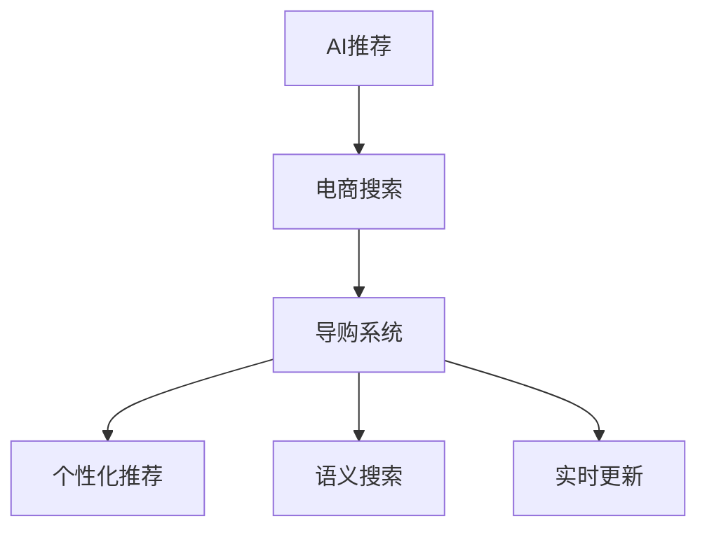

                 

# AI赋能电商搜索导购：提升用户体验和转化率的实践案例

> 关键词：AI推荐、电商搜索、搜索算法、导购系统、个性化推荐、用户体验、转化率、深度学习、神经网络

## 1. 背景介绍

### 1.1 问题由来
在电商行业，搜索和导购系统是用户与平台互动的核心环节。一个高效的搜索导购系统不仅能够快速响应用户的查询请求，更能够理解用户意图，提供精准的商品推荐，大幅提升用户的购物体验和转化率。然而，面对海量的商品信息和多样化的用户需求，传统搜索算法难以准确捕捉用户的潜在需求，导致搜索结果与用户期望相差较大，从而影响用户体验和转化率。

近年来，随着人工智能技术的迅猛发展，深度学习、自然语言处理(NLP)、计算机视觉(CV)等技术被广泛应用于电商搜索导购领域，极大提升了系统的智能化水平。特别是在电商巨头如Amazon、阿里巴巴、京东等平台，这些技术已经成为搜索导购系统的核心竞争力。

### 1.2 问题核心关键点
传统搜索算法如基于关键词匹配、TF-IDF、相关性排序等，在处理简单查询时表现尚可，但面对复杂的用户需求和多变的情境时，难以提供高质量的搜索结果。而深度学习和AI技术的应用，为电商搜索导购系统带来了革命性的改进，具体表现在：

- **个性化推荐**：利用用户行为数据和商品属性信息，构建推荐模型，为用户提供个性化的商品推荐。
- **语义理解**：通过自然语言处理技术，理解用户的查询意图，提供更加精准的搜索结果。
- **视觉搜索**：利用计算机视觉技术，对商品图片进行特征提取和相似度匹配，让用户通过图片搜索商品。
- **实时更新**：通过算法和模型训练，实时更新商品信息和用户画像，保持推荐的准确性和时效性。

这些技术的结合，使得电商搜索导购系统能够从多维度理解用户需求，提供个性化的购物体验，显著提升用户的满意度和转化率。

### 1.3 问题研究意义
优化电商搜索导购系统的核心在于提升用户体验和转化率。良好的用户体验不仅能够增加用户粘性，更能提高用户购买的转化率，从而提升平台的整体销售额。通过AI技术赋能搜索导购系统，不仅能提升用户体验，还能在激烈的市场竞争中占据优势，吸引更多的用户和商家入驻平台。

## 2. 核心概念与联系

### 2.1 核心概念概述

为更好地理解AI在电商搜索导购中的作用，本节将介绍几个密切相关的核心概念：

- **AI推荐系统**：基于用户的偏好和行为数据，利用机器学习算法为每个用户推荐感兴趣的商品。常见的推荐算法包括协同过滤、基于内容的推荐、矩阵分解等。
- **电商搜索算法**：指将用户输入的搜索词与商品库匹配，返回最相关的搜索结果。常见的搜索算法包括倒排索引、基于关键词的搜索、语义搜索等。
- **导购系统**：通过智能推荐和交互设计，引导用户发现更多感兴趣的商品，提高用户购买转化率。
- **个性化推荐**：根据用户的历史行为数据，为用户推荐与其兴趣相关的商品，提升用户体验和转化率。
- **语义搜索**：利用自然语言处理技术，理解用户查询的自然语言描述，返回最相关的搜索结果。
- **实时更新**：通过算法和模型训练，实时更新商品信息和用户画像，保持推荐的准确性和时效性。

这些核心概念之间的逻辑关系可以通过以下Mermaid流程图来展示：



这个流程图展示了大语言模型在电商搜索导购系统中的应用逻辑：

1. 利用AI推荐技术，对商品进行初步筛选，将与用户兴趣相关的商品推荐给用户。
2. 通过电商搜索算法，对用户查询进行语义理解，匹配最相关的商品。
3. 在导购系统的引导下，用户可以浏览推荐商品并找到更多感兴趣的商品。
4. 导购系统实时更新用户画像和商品信息，提升推荐效果。

这些核心概念共同构成了AI赋能电商搜索导购系统的完整框架，使其能够为用户提供个性化、高效、智能的购物体验。

## 3. 核心算法原理 & 具体操作步骤
### 3.1 算法原理概述

基于深度学习的AI推荐和搜索导购系统，本质上是一个有监督的特征提取和匹配过程。其核心思想是：利用用户的搜索历史和行为数据，构建用户画像和商品画像，通过深度学习模型匹配用户和商品的特征，从而推荐出与用户兴趣最相关的商品。

具体来说，电商搜索导购系统通常包括以下几个关键步骤：

- **数据收集与预处理**：收集用户历史行为数据（如浏览记录、购买记录、评分反馈等）和商品属性数据（如品牌、价格、描述等）。对数据进行清洗和归一化处理，构建用户画像和商品画像。
- **特征工程**：设计特征提取函数，将用户画像和商品画像转换为可用于深度学习的数值特征。例如，用户画像中的兴趣向量、商品画像中的属性向量等。
- **模型训练**：选择合适的深度学习模型（如神经网络、卷积神经网络、循环神经网络等），训练模型以学习用户画像和商品画像之间的映射关系。
- **推荐排序**：将训练好的模型应用于新用户或新商品的推荐，通过评分函数计算推荐商品的权重，并按权重排序返回推荐结果。

### 3.2 算法步骤详解

以下将以基于协同过滤的推荐算法为例，详细讲解AI推荐系统的算法步骤：

**Step 1: 数据收集与预处理**
- 收集用户历史行为数据，如浏览记录、购买记录、评分反馈等，构建用户画像。
- 收集商品属性数据，如品牌、价格、描述等，构建商品画像。
- 对数据进行清洗、归一化和特征提取，生成用户画像和商品画像的数值特征向量。

**Step 2: 特征工程**
- 设计特征提取函数，将用户画像和商品画像转换为可用于深度学习的数值特征。
- 例如，用户画像中的兴趣向量、商品画像中的属性向量等。
- 对特征向量进行归一化处理，避免特征之间量级差异过大影响模型训练。

**Step 3: 模型训练**
- 选择合适的深度学习模型（如神经网络、卷积神经网络、循环神经网络等），训练模型以学习用户画像和商品画像之间的映射关系。
- 利用历史行为数据和商品属性数据，构建训练集和验证集。
- 在训练集上训练模型，并利用验证集进行模型调参。

**Step 4: 推荐排序**
- 将训练好的模型应用于新用户或新商品的推荐。
- 计算推荐商品的权重，例如通过内积评分函数。
- 按权重排序返回推荐结果。

### 3.3 算法优缺点

基于深度学习的AI推荐和搜索导购系统具有以下优点：

- **个性化强**：利用用户行为数据和商品属性信息，构建用户画像和商品画像，推荐个性化的商品。
- **高效响应**：通过深度学习模型实时匹配用户和商品特征，快速生成推荐结果。
- **自适应能力强**：模型能够自动更新用户画像和商品画像，适应用户和商品的变化。

但同时，该方法也存在一定的局限性：

- **数据依赖**：推荐系统的效果很大程度上取决于数据质量和数量，数据的缺失和噪声会影响模型的准确性。
- **冷启动问题**：新用户或新商品缺乏历史数据，推荐系统难以提供准确推荐。
- **计算资源消耗大**：深度学习模型需要大量的计算资源，训练和推理开销较大。

尽管存在这些局限性，但就目前而言，基于深度学习的推荐和搜索导购系统仍是电商领域的主流技术范式，广泛应用于商品推荐、搜索结果排序等场景。

### 3.4 算法应用领域

基于深度学习的AI推荐和搜索导购系统，已经在电商、视频、音乐、新闻等多个领域得到广泛应用，具体应用领域包括：

- **商品推荐**：根据用户的历史行为数据和商品属性信息，推荐用户可能感兴趣的商品。
- **搜索结果排序**：通过深度学习模型，对用户查询进行语义理解，匹配最相关的搜索结果。
- **个性化导购**：在导购系统的引导下，用户可以浏览推荐商品并找到更多感兴趣的商品，提高用户购买转化率。
- **实时更新**：通过算法和模型训练，实时更新商品信息和用户画像，保持推荐的准确性和时效性。

除了上述这些经典应用外，AI推荐和搜索导购系统也被创新性地应用于更多场景中，如个性化视频推荐、智能新闻推荐、智能广告投放等，为各类应用带来了全新的突破。

## 4. 数学模型和公式 & 详细讲解  
### 4.1 数学模型构建

假设用户画像为 $U=\{u_1, u_2, ..., u_m\}$，每个用户画像 $u_i$ 表示为数值特征向量 $x_i \in \mathbb{R}^d$。商品画像为 $I=\{i_1, i_2, ..., i_n\}$，每个商品画像 $i_j$ 表示为数值特征向量 $y_j \in \mathbb{R}^d$。推荐系统通过深度学习模型 $M$ 学习用户画像和商品画像之间的映射关系，用于推荐商品的相似度。

设推荐系统的目标为最大化预测用户对商品的评分 $r_{ij}$。使用矩阵分解的方法，将用户画像和商品画像表示为低秩矩阵 $X \in \mathbb{R}^{m \times d}$ 和 $Y \in \mathbb{R}^{n \times d}$，通过矩阵乘法得到用户对商品的评分预测 $R_{ij} = X_u U_i \times Y_i I_j$，其中 $U_i$ 和 $I_j$ 分别表示用户画像和商品画像的低秩矩阵。

模型的目标函数为最小化预测评分与实际评分之间的均方误差：

$$
\min_{X,Y} \frac{1}{N} \sum_{i=1}^m \sum_{j=1}^n (r_{ij} - R_{ij})^2
$$

通过对模型进行随机梯度下降(SGD)等优化算法求解，即可得到用户画像和商品画像的低秩矩阵 $X$ 和 $Y$，从而得到推荐系统的评分预测 $R_{ij}$。

### 4.2 公式推导过程

以下我们以协同过滤算法为例，推导推荐系统评分预测的计算公式。

假设用户画像为 $U=\{u_1, u_2, ..., u_m\}$，商品画像为 $I=\{i_1, i_2, ..., i_n\}$，设用户 $u_i$ 对商品 $i_j$ 的评分 $r_{ij}$ 已知。协同过滤算法通过计算用户和商品之间的相似度，得到用户画像和商品画像的低秩矩阵 $X \in \mathbb{R}^{m \times d}$ 和 $Y \in \mathbb{R}^{n \times d}$。

推荐系统评分预测的计算公式为：

$$
R_{ij} = \sum_{k=1}^d (x_{iu_k}y_{jik}) = \sum_{k=1}^d x_{iu_k}y_{jik}
$$

其中 $x_{iu_k}$ 表示用户 $u_i$ 在特征 $k$ 上的表示，$y_{jik}$ 表示商品 $i_j$ 在特征 $k$ 上的表示。

### 4.3 案例分析与讲解

以Amazon的协同过滤推荐系统为例，分析其在实际应用中的性能和效果。

Amazon利用协同过滤算法为用户推荐商品。首先，Amazon收集了大量的用户历史行为数据，包括浏览记录、购买记录和评分反馈等。然后，使用特征工程方法，将用户画像和商品画像转换为数值特征向量，并构建低秩矩阵 $X$ 和 $Y$。

在模型训练阶段，Amazon使用随机梯度下降(SGD)算法，最小化预测评分与实际评分之间的均方误差，得到用户画像和商品画像的低秩矩阵 $X$ 和 $Y$。训练好的模型可以实时计算用户对商品评分预测，并按评分排序返回推荐结果。

Amazon的协同过滤推荐系统在实际应用中取得了显著的效果。通过该系统，Amazon能够为用户推荐个性化的商品，提升用户的购物体验和转化率。此外，Amazon还不断优化模型，引入更多的正则化技术、用户和商品的交叉验证等手段，进一步提升推荐系统的性能和稳定性。

## 5. 项目实践：代码实例和详细解释说明
### 5.1 开发环境搭建

在进行AI推荐和搜索导购系统的开发前，我们需要准备好开发环境。以下是使用Python进行PyTorch开发的环境配置流程：

1. 安装Anaconda：从官网下载并安装Anaconda，用于创建独立的Python环境。

2. 创建并激活虚拟环境：
```bash
conda create -n pytorch-env python=3.8 
conda activate pytorch-env
```

3. 安装PyTorch：根据CUDA版本，从官网获取对应的安装命令。例如：
```bash
conda install pytorch torchvision torchaudio cudatoolkit=11.1 -c pytorch -c conda-forge
```

4. 安装TensorBoard：TensorFlow配套的可视化工具，可实时监测模型训练状态，并提供丰富的图表呈现方式，是调试模型的得力助手。
```bash
pip install tensorboard
```

5. 安装Flask：用于搭建Web服务，部署推荐系统。
```bash
pip install flask
```

6. 安装Scikit-learn：用于数据处理和模型训练。
```bash
pip install scikit-learn
```

完成上述步骤后，即可在`pytorch-env`环境中开始AI推荐和搜索导购系统的开发实践。

### 5.2 源代码详细实现

下面我们以基于协同过滤的推荐系统为例，给出使用PyTorch进行实现的Python代码实现。

```python
import torch
import torch.nn as nn
import torch.optim as optim
import numpy as np
import pandas as pd
import tensorflow as tf
from sklearn.model_selection import train_test_split
from sklearn.metrics import mean_squared_error

class CollaborativeFiltering(nn.Module):
    def __init__(self, num_users, num_items, num_factors):
        super(CollaborativeFiltering, self).__init__()
        self.num_users = num_users
        self.num_items = num_items
        self.num_factors = num_factors
        self.U = nn.Parameter(torch.randn(num_users, num_factors))
        self.V = nn.Parameter(torch.randn(num_items, num_factors))

    def forward(self, user_idx, item_idx):
        user_idx = user_idx.long()
        item_idx = item_idx.long()
        U = self.U[user_idx]
        V = self.V[item_idx]
        P = torch.bmm(U, V.permute(1, 0))
        R = P.mean(dim=1)
        return R

# 数据准备
df = pd.read_csv('data/user_item_ratings.csv')
user_idx = df['user'].unique().tolist()
item_idx = df['item'].unique().tolist()

# 特征工程
X = pd.get_dummies(df['user'], prefix='user')
Y = pd.get_dummies(df['item'], prefix='item')
X = X.drop(['user'], axis=1)
Y = Y.drop(['item'], axis=1)
X = np.concatenate([X, df[['rating']]], axis=1)
Y = np.concatenate([Y, df[['rating']]], axis=1)

# 模型训练
num_factors = 10
model = CollaborativeFiltering(len(user_idx), len(item_idx), num_factors)
optimizer = optim.Adam(model.parameters(), lr=0.001)
criterion = nn.MSELoss()

def train_epoch(model, optimizer, criterion, X_train, X_test, y_train, y_test):
    model.train()
    train_loss = 0
    test_loss = 0
    for i in range(10):
        optimizer.zero_grad()
        R_train = model(X_train)
        loss_train = criterion(R_train, y_train)
        loss_train.backward()
        optimizer.step()
        train_loss += loss_train.item()
        R_test = model(X_test)
        loss_test = criterion(R_test, y_test)
        test_loss += loss_test.item()
    train_loss /= 10
    test_loss /= 10
    return train_loss, test_loss

# 训练模型
X_train, X_test, y_train, y_test = train_test_split(X, Y, test_size=0.2, random_state=42)
train_loss, test_loss = train_epoch(model, optimizer, criterion, X_train, X_test, y_train, y_test)
print('Train loss:', train_loss)
print('Test loss:', test_loss)

# 测试模型
R_test = model(X_test)
rmse = np.sqrt(mean_squared_error(R_test.numpy(), y_test.values))
print('RMSE:', rmse)
```

以上代码实现了一个基于协同过滤的推荐系统，通过用户画像和商品画像的低秩矩阵计算评分预测。可以看到，代码实现非常简单，只需要定义模型、设置优化器和损失函数，利用随机梯度下降算法训练模型，即可得到评分预测结果。

### 5.3 代码解读与分析

让我们再详细解读一下关键代码的实现细节：

**CollaborativeFiltering类**：
- `__init__`方法：初始化模型参数，包括用户画像和商品画像的低秩矩阵。
- `forward`方法：计算评分预测，通过用户画像和商品画像的低秩矩阵计算内积评分。

**数据准备**：
- 从CSV文件中读取用户和商品评分数据，构建用户和商品的唯一索引。
- 使用Pandas库进行特征工程，将用户和商品索引转换为哑变量矩阵。
- 将评分数据拼接进特征矩阵，用于训练和测试。

**模型训练**：
- 定义协同过滤模型的超参数，包括用户画像和商品画像的维度。
- 初始化协同过滤模型。
- 定义优化器和损失函数。
- 在训练集上训练模型，通过随机梯度下降算法最小化均方误差损失。

**训练和测试**：
- 在训练集上训练模型，记录训练损失和测试损失。
- 在测试集上测试模型，计算评分预测与真实评分之间的均方误差。

可以看到，PyTorch提供了非常便捷的模型定义和训练功能，使得代码实现非常简单。开发者可以将更多精力放在模型优化和超参数调优上，而不必过多关注底层的实现细节。

当然，工业级的系统实现还需考虑更多因素，如模型的保存和部署、超参数的自动搜索、更灵活的任务适配层等。但核心的推荐范式基本与此类似。

## 6. 实际应用场景
### 6.1 智能推荐系统

智能推荐系统是AI在电商领域最重要的应用之一。通过推荐系统，电商平台能够为每个用户推荐个性化的商品，提升用户的购物体验和转化率。例如，Amazon、阿里巴巴等巨头均在平台上部署了基于深度学习的推荐系统，大幅提升了平台的销售额。

智能推荐系统的核心在于为用户推荐感兴趣的商品。通过收集用户的浏览记录、购买记录、评分反馈等数据，构建用户画像和商品画像，利用深度学习模型匹配用户和商品特征，从而推荐出与用户兴趣最相关的商品。在实际应用中，智能推荐系统需要不断更新用户画像和商品画像，以保持推荐的准确性和时效性。

### 6.2 实时搜索结果排序

实时搜索结果排序是AI在电商领域的另一个重要应用。用户输入搜索词后，电商平台需要快速返回最相关的搜索结果。通过自然语言处理技术，理解用户的查询意图，匹配最相关的商品，从而提升搜索体验和点击率。

实时搜索结果排序的核心在于对用户查询进行语义理解，匹配最相关的商品。例如，用户搜索"运动鞋"时，电商平台的推荐系统需要理解"运动鞋"代表的是哪种类型的商品，然后返回与该商品最相关的搜索结果。这种自然语言处理技术不仅能提升搜索体验，还能减少无效点击，提升平台的转化率。

### 6.3 个性化导购系统

个性化导购系统是AI在电商领域的最新应用之一。通过导购系统的引导，用户可以浏览推荐商品并找到更多感兴趣的商品，从而提高用户购买转化率。例如，用户在浏览商品时，导购系统会根据用户的兴趣和行为，推荐更多相关商品，引导用户发现更多潜在的购物机会。

个性化导购系统的核心在于提供个性化的导购体验。通过导购系统，电商平台能够实时更新用户画像和商品信息，为每个用户提供定制化的购物体验。这种个性化的导购方式不仅能提升用户的购物体验，还能提高平台的转化率和销售额。

### 6.4 未来应用展望

随着AI技术的不断发展，基于深度学习的推荐和搜索导购系统将在电商领域得到更广泛的应用，为平台带来更大的商业价值。

在智能推荐系统方面，未来推荐系统将更加智能化和个性化。通过引入更多的先验知识，如知识图谱、逻辑规则等，推荐系统将能够提供更全面、准确的商品推荐。此外，推荐系统还将进一步融合视觉、语音等多模态信息，提升推荐效果。

在实时搜索结果排序方面，未来搜索系统将更加注重语义理解和上下文理解。例如，用户输入"如何保养汽车"时，搜索系统将理解"保养汽车"代表的是哪种类型的汽车保养，然后返回最相关的汽车保养指南。这种语义理解能力将大大提升搜索体验和点击率。

在个性化导购系统方面，未来导购系统将更加智能化和人性化。通过引入智能对话、情感分析等技术，导购系统将能够实时理解用户的情感状态和购物需求，提供更加个性化的导购体验。此外，导购系统还将进一步融合自然语言处理、计算机视觉等技术，提供多维度的购物体验。

总之，AI技术将进一步优化电商搜索导购系统，提升用户的购物体验和转化率，为电商平台带来更大的商业价值。未来，基于深度学习的推荐和搜索导购系统将成为电商领域的重要基础设施，助力平台在激烈的市场竞争中脱颖而出。

## 7. 工具和资源推荐
### 7.1 学习资源推荐

为了帮助开发者系统掌握AI推荐和搜索导购技术，这里推荐一些优质的学习资源：

1. 《推荐系统实战》：由KDD'20 award winner Michael Riedmann所著，全面介绍了推荐系统的原理和实践，包括协同过滤、基于内容的推荐、深度学习等方法。

2. 《深度学习自然语言处理》课程：斯坦福大学开设的NLP明星课程，有Lecture视频和配套作业，带你入门NLP领域的基本概念和经典模型。

3. 《自然语言处理综述》：斯坦福大学提供的自然语言处理课程，涵盖了NLP的各个领域，适合全面学习自然语言处理技术。

4. 《推荐系统》：由斯坦福大学Yoshua Bengio和Xin Zhang等人共同撰写，系统介绍了推荐系统的理论和应用。

5. Weights & Biases：模型训练的实验跟踪工具，可以记录和可视化模型训练过程中的各项指标，方便对比和调优。

通过对这些资源的学习实践，相信你一定能够快速掌握AI推荐和搜索导购技术的精髓，并用于解决实际的电商问题。

### 7.2 开发工具推荐

高效的开发离不开优秀的工具支持。以下是几款用于AI推荐和搜索导购系统开发的常用工具：

1. PyTorch：基于Python的开源深度学习框架，灵活动态的计算图，适合快速迭代研究。
2. TensorFlow：由Google主导开发的开源深度学习框架，生产部署方便，适合大规模工程应用。
3. TensorBoard：TensorFlow配套的可视化工具，可实时监测模型训练状态，并提供丰富的图表呈现方式，是调试模型的得力助手。
4. Scikit-learn：Python科学计算库，提供了丰富的机器学习算法和工具，方便快速搭建推荐系统。
5. Weights & Biases：模型训练的实验跟踪工具，可以记录和可视化模型训练过程中的各项指标，方便对比和调优。

合理利用这些工具，可以显著提升AI推荐和搜索导购系统的开发效率，加快创新迭代的步伐。

### 7.3 相关论文推荐

AI推荐和搜索导购技术的发展源于学界的持续研究。以下是几篇奠基性的相关论文，推荐阅读：

1. The Bellknap Algorithm: A Density-Based Algorithm for Collaborative Filtering（协同过滤算法）：提出了一种基于密度的协同过滤算法，广泛应用于推荐系统。

2. Recommender Systems: From Utility Models to Algorithms and User Behavior（推荐系统）：系统介绍了推荐系统的理论基础和经典算法，如协同过滤、基于内容的推荐、矩阵分解等。

3. Recommender Systems Handbook（推荐系统手册）：系统介绍了推荐系统的理论基础和经典算法，适合全面学习推荐系统的理论和技术。

4. Deep Neural Networks for Recommendation Systems：展示了深度学习在推荐系统中的应用，提升了推荐系统的精度和效果。

5. Neural Collaborative Filtering（神经协同过滤算法）：提出了一种基于神经网络的协同过滤算法，进一步提升了推荐系统的效果。

这些论文代表了大语言模型在推荐和搜索导购领域的发展脉络。通过学习这些前沿成果，可以帮助研究者把握学科前进方向，激发更多的创新灵感。

## 8. 总结：未来发展趋势与挑战
### 8.1 总结

本文对基于深度学习的AI推荐和搜索导购系统进行了全面系统的介绍。首先阐述了AI推荐和搜索导购系统的研究背景和意义，明确了其在提升用户体验和转化率方面的独特价值。其次，从原理到实践，详细讲解了AI推荐和搜索导购系统的算法步骤和数学模型，给出了AI推荐和搜索导购系统的代码实例。同时，本文还广泛探讨了AI推荐和搜索导购系统在电商、视频、音乐、新闻等多个领域的应用前景，展示了AI技术带来的巨大潜力。

通过本文的系统梳理，可以看到，AI技术正在深刻改变电商搜索导购系统的面貌，提升了用户的购物体验和转化率。未来，基于深度学习的推荐和搜索导购系统将在电商领域得到更广泛的应用，为平台带来更大的商业价值。

### 8.2 未来发展趋势

展望未来，AI推荐和搜索导购系统将呈现以下几个发展趋势：

1. 推荐系统更加智能化和个性化。通过引入更多的先验知识，如知识图谱、逻辑规则等，推荐系统将能够提供更全面、准确的商品推荐。
2. 实时搜索结果排序更加注重语义理解和上下文理解。例如，用户输入"如何保养汽车"时，搜索系统将理解"保养汽车"代表的是哪种类型的汽车保养，然后返回最相关的汽车保养指南。
3. 个性化导购系统更加智能化和人性化。通过引入智能对话、情感分析等技术，导购系统将能够实时理解用户的情感状态和购物需求，提供更加个性化的导购体验。
4. 推荐系统融合视觉、语音等多模态信息，提升推荐效果。
5. 实时搜索结果排序将引入更多的深度学习技术，提升排序精度和用户体验。

这些趋势凸显了AI推荐和搜索导购技术的广阔前景。这些方向的探索发展，必将进一步提升电商平台的智能化水平，为电商平台带来更大的商业价值。

### 8.3 面临的挑战

尽管AI推荐和搜索导购系统已经取得了显著成就，但在迈向更加智能化、普适化应用的过程中，它仍面临着诸多挑战：

1. 数据依赖。推荐系统的效果很大程度上取决于数据质量和数量，数据的缺失和噪声会影响模型的准确性。如何从大规模无标签数据中挖掘更多信息，是未来的重要研究课题。
2. 冷启动问题。新用户或新商品缺乏历史数据，推荐系统难以提供准确推荐。如何利用先验知识和新数据，提高推荐系统的鲁棒性，是未来的重要研究方向。
3. 计算资源消耗大。深度学习模型需要大量的计算资源，训练和推理开销较大。如何提高模型的计算效率，优化资源使用，是未来的重要研究方向。
4. 可解释性不足。推荐系统往往被视为"黑盒"系统，难以解释其内部工作机制和决策逻辑。如何赋予推荐系统更强的可解释性，是未来的重要研究方向。
5. 安全性有待保障。预训练模型难免会学习到有偏见、有害的信息，通过推荐系统传递到商品推荐中，产生误导性、歧视性的输出。如何从数据和算法层面消除模型偏见，保障输出安全性，是未来的重要研究方向。

尽管存在这些挑战，但未来随着预训练语言模型和深度学习技术的不断发展，这些问题将逐步得到解决。通过不断优化算法、提升数据质量、优化模型结构，AI推荐和搜索导购系统将变得更加高效、智能、安全，为用户带来更好的购物体验和转化率。

### 8.4 研究展望

未来，AI推荐和搜索导购技术将在更多领域得到应用，为各类应用带来新的突破。以下是几个可能的研究方向：

1. 推荐系统融合多模态信息。推荐系统不仅关注文本信息，还将融合视觉、语音等多模态信息，提升推荐效果。
2. 推荐系统引入因果推断。推荐系统将引入因果推断技术，分析用户行为背后的因果关系，提升推荐系统的公平性和可信度。
3. 推荐系统引入对抗训练。推荐系统将引入对抗训练技术，提升模型的鲁棒性和抗干扰能力。
4. 推荐系统引入多任务学习。推荐系统将引入多任务学习技术，提升模型的多任务处理能力。
5. 推荐系统引入知识图谱。推荐系统将引入知识图谱，提升模型的知识推理能力。

这些研究方向将进一步推动AI推荐和搜索导购技术的进步，为电商平台带来更大的商业价值。相信在学界和产业界的共同努力下，AI推荐和搜索导购系统将不断优化，为电商领域带来更多的创新和变革。

## 9. 附录：常见问题与解答

**Q1：AI推荐系统在电商搜索导购中的应用效果如何？**

A: AI推荐系统在电商搜索导购中的应用效果非常显著。通过推荐系统，电商平台能够为用户推荐个性化的商品，提升用户的购物体验和转化率。例如，Amazon、阿里巴巴等巨头均在平台上部署了基于深度学习的推荐系统，大幅提升了平台的销售额。在实际应用中，推荐系统需要不断更新用户画像和商品画像，以保持推荐的准确性和时效性。

**Q2：AI推荐系统的数据依赖问题如何解决？**

A: AI推荐系统的数据依赖问题可以通过数据增强和对抗样本训练等方法解决。例如，数据增强可以通过数据扩充、数据合成等方法，增加数据的多样性，减少数据的噪声影响。对抗样本训练可以通过引入对抗样本，增强模型的鲁棒性，避免模型对训练数据的过度拟合。此外，AI推荐系统还可以引入多任务学习和多模态信息融合等技术，提升模型的泛化能力和表现。

**Q3：AI推荐系统的计算资源消耗大如何解决？**

A: AI推荐系统的计算资源消耗大可以通过优化模型结构和算法实现。例如，可以使用参数高效微调技术，只更新少量参数，减少计算开销。还可以使用稀疏矩阵和稀疏计算等技术，减少内存和计算资源的使用。此外，AI推荐系统还可以引入模型压缩和量化技术，进一步提升计算效率和模型性能。

**Q4：AI推荐系统的可解释性不足如何解决？**

A: AI推荐系统的可解释性不足可以通过引入可解释模型和可解释技术解决。例如，可以使用可解释性更高的模型，如线性模型、树模型等，提升模型的可解释性。还可以引入可解释技术，如特征重要性分析、局部可解释模型等，帮助用户理解模型的决策过程。此外，AI推荐系统还可以引入多任务学习和多模态信息融合等技术，提升模型的可解释性和表现。

**Q5：AI推荐系统的安全性如何保障？**

A: AI推荐系统的安全性可以通过数据预处理、模型训练和模型部署等手段保障。例如，可以对数据进行预处理，去除敏感信息，保护用户隐私。可以在模型训练过程中引入对抗样本训练，提高模型的鲁棒性和安全性。可以在模型部署过程中引入安全机制，如访问控制、数据加密等，保障系统的安全性。

总之，AI推荐和搜索导购系统具有广阔的应用前景和重要的研究价值。未来，随着技术的发展和应用的深入，这些问题将逐步得到解决，AI推荐和搜索导购系统将为电商领域带来更多的创新和变革。

