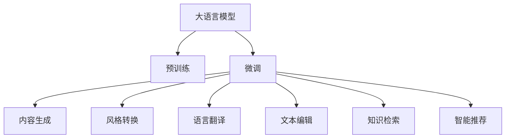

                 

# AI辅助写作：增强人类创造力

## 1. 背景介绍

### 1.1 问题由来

在现代信息爆炸的时代，写作作为一种重要的表达手段，承载着传播知识、交流思想、推动文化进步的重要使命。然而，面对日新月异的社会变革和技术进步，高质量写作的门槛越来越高，对人类创作者的智力、精力和时间提出了巨大挑战。如何快速高效地生成高质量的文本，成为作者们迫切需要解决的问题。

大语言模型（Large Language Model, LLM）的出现，为辅助写作提供了新的可能性。LLM通过深度学习技术，学习了海量的语言数据，具备了强大的语言理解和生成能力。利用LLM的这一特性，可以通过自动化生成、语言翻译、文本编辑、风格转换等技术手段，辅助人类作者提升创作效率和作品质量。本文将探讨大语言模型在辅助写作中的应用，讨论其原理、实现方法、应用场景，以及未来发展趋势和面临的挑战。

### 1.2 问题核心关键点

大语言模型辅助写作的核心在于利用模型在语言理解和生成方面的强大能力，帮助作者在创作过程中减少重复性劳动，提升创意构思和表达质量。具体而言，主要体现在以下几个方面：

1. **内容生成**：自动生成文章段落、句子，甚至是整篇文章，快速完成初稿撰写。
2. **风格转换**：将一篇文本转换成不同的风格，如学术论文、新闻报道、文学作品等。
3. **语言翻译**：将文章翻译成目标语言，扩展作者的国际视野。
4. **文本编辑**：校正语法错误，优化句子结构，提升文章质量。
5. **智能推荐**：基于用户的写作风格和内容偏好，智能推荐相关词汇、句式和段落，辅助创作。
6. **知识检索**：自动提供与当前写作主题相关的背景知识，提升内容深度。

这些关键技术能够有效提升作者的创作效率，激发其创作灵感，进而提高作品的整体质量。

## 2. 核心概念与联系

### 2.1 核心概念概述

为更好地理解大语言模型辅助写作的方法，本节将介绍几个密切相关的核心概念：

- **大语言模型（LLM）**：基于自回归模型（如GPT系列）或自编码模型（如BERT、T5）的预训练语言模型，通过大规模无标签文本数据预训练，具备强大的语言理解和生成能力。
- **预训练**：在大规模无标签文本数据上，通过自监督学习任务训练通用语言模型的过程。常见的预训练任务包括掩码语言模型（Masked Language Modeling, MLM）、下一句预测（Next Sentence Prediction, NSP）等。
- **微调**：在预训练模型的基础上，使用下游任务的少量标注数据，通过有监督学习优化模型在该任务上的性能。常见的下游任务包括文本分类、命名实体识别、情感分析等。
- **风格转换**：将一段文本转换成不同的语言风格，如文学风格、新闻报道风格、学术论文风格等。
- **文本编辑**：自动校正文本中的语法错误、拼写错误，优化句子结构和表达，提升文章质量。
- **知识检索**：自动提供与当前写作主题相关的背景知识和事实信息，提升内容的深度和广度。
- **智能推荐**：基于用户的写作风格和内容偏好，智能推荐相关词汇、句式和段落，辅助创作。

这些核心概念之间的逻辑关系可以通过以下Mermaid流程图来展示：



这个流程图展示了大语言模型的核心概念及其之间的关系：

1. 大语言模型通过预训练获得基础能力。
2. 微调是对预训练模型进行任务特定的优化，可以生成特定风格的文章，进行翻译、编辑等。
3. 风格转换、文本编辑和知识检索都是在微调的基础上，进一步提升模型的表现能力。
4. 智能推荐则是利用微调模型的知识，为用户个性化推荐写作素材。

这些概念共同构成了大语言模型辅助写作的框架，使得模型能够在各种场景下发挥强大的文本生成和编辑能力。通过理解这些核心概念，我们可以更好地把握大语言模型在辅助写作中的应用范式。

## 3. 核心算法原理 & 具体操作步骤

### 3.1 算法原理概述

大语言模型辅助写作的核心算法原理是基于监督学习的多任务学习（MTL）和迁移学习。具体而言，可以将辅助写作任务分解为多个子任务，如内容生成、风格转换、语言翻译等，每个子任务都可以看作是一个监督学习问题，通过有标注的训练数据进行微调优化。

假设大语言模型为 $M_{\theta}$，其中 $\theta$ 为模型参数。对于每个子任务 $t$，其标注数据集为 $D_t=\{(x_i, y_i)\}_{i=1}^N$，其中 $x_i$ 为输入文本，$y_i$ 为输出文本或标签。微调的目标是找到最优参数 $\hat{\theta}_t$，使得：

$$
\hat{\theta}_t = \mathop{\arg\min}_{\theta} \mathcal{L}_t(M_{\theta},D_t)
$$

其中 $\mathcal{L}_t$ 为针对任务 $t$ 设计的损失函数。在微调过程中，通过反向传播算法更新模型参数 $\theta$，最小化损失函数 $\mathcal{L}_t$，使得模型在特定任务上的表现最优。

### 3.2 算法步骤详解

基于监督学习的大语言模型辅助写作微调一般包括以下几个关键步骤：

**Step 1: 准备预训练模型和数据集**
- 选择合适的预训练语言模型 $M_{\theta}$ 作为初始化参数，如 GPT-3、BERT 等。
- 准备辅助写作任务的标注数据集 $D=\{(x_i, y_i)\}_{i=1}^N$，如文章段落、新闻报道、文学作品等，标注对应的风格、主题等信息。

**Step 2: 设计任务适配层**
- 根据辅助写作任务类型，设计合适的输出层和损失函数。
- 对于内容生成任务，通常使用语言模型的解码器输出概率分布，并以负对数似然为损失函数。
- 对于风格转换、文本编辑等任务，可以使用分类损失函数或掩码语言模型等。

**Step 3: 设置微调超参数**
- 选择合适的优化算法及其参数，如 AdamW、SGD 等，设置学习率、批大小、迭代轮数等。
- 设置正则化技术及强度，包括权重衰减、Dropout、Early Stopping 等。
- 确定冻结预训练参数的策略，如仅微调顶层，或全部参数都参与微调。

**Step 4: 执行梯度训练**
- 将训练集数据分批次输入模型，前向传播计算损失函数。
- 反向传播计算参数梯度，根据设定的优化算法和学习率更新模型参数。
- 周期性在验证集上评估模型性能，根据性能指标决定是否触发 Early Stopping。
- 重复上述步骤直到满足预设的迭代轮数或 Early Stopping 条件。

**Step 5: 测试和部署**
- 在测试集上评估微调后模型 $M_{\hat{\theta}}$ 的性能，对比微调前后的质量提升。
- 使用微调后的模型对新文本进行推理预测，集成到实际的应用系统中。
- 持续收集新的文本数据，定期重新微调模型，以适应数据分布的变化。

以上是基于监督学习辅助写作的微调范式的一般流程。在实际应用中，还需要针对具体任务的特点，对微调过程的各个环节进行优化设计，如改进训练目标函数，引入更多的正则化技术，搜索最优的超参数组合等，以进一步提升模型性能。

### 3.3 算法优缺点

基于监督学习的大语言模型辅助写作方法具有以下优点：

1. **高效快速**：能够快速生成高质量的文本内容，大幅度提升创作效率。
2. **个性化定制**：根据不同用户的需求和偏好，生成定制化的文本内容，提高作品的相关性和吸引力。
3. **广泛适用**：适用于各种辅助写作任务，如内容生成、风格转换、语言翻译等。
4. **灵活扩展**：在已有的预训练模型基础上，可以轻松添加新的微调任务，增强模型的功能。

同时，该方法也存在一定的局限性：

1. **依赖标注数据**：微调的效果很大程度上取决于标注数据的质量和数量，获取高质量标注数据的成本较高。
2. **风格表达有限**：模型的风格转换能力可能受限于训练数据的风格多样性，难以捕捉复杂的风格变化。
3. **生成质量不均**：生成的文本质量可能存在不稳定，尤其是在处理复杂的语义和逻辑时，容易出现错误。
4. **过度依赖模型**：过度依赖大语言模型，可能抑制作者的创作主动性和独特性。

尽管存在这些局限性，但就目前而言，基于监督学习的微调方法仍是大语言模型辅助写作的主流范式。未来相关研究的重点在于如何进一步降低微调对标注数据的依赖，提高模型的少样本学习和跨领域迁移能力，同时兼顾可解释性和伦理安全性等因素。

### 3.4 算法应用领域

基于大语言模型辅助写作的方法已经在新闻报道、文学创作、学术写作、企业文案等多个领域得到了应用，显著提升了内容的生产效率和质量。具体应用场景包括：

- **新闻报道**：自动生成新闻报道的开头、结尾、摘要等部分，帮助记者快速撰写报道。
- **文学创作**：自动生成小说段落、诗歌、剧本等，激发作家的创作灵感，辅助其完成作品。
- **学术写作**：自动生成研究报告、论文草稿，辅助科研人员快速撰写学术论文。
- **企业文案**：自动生成产品介绍、广告文案、营销邮件等，提高企业内容的创作效率。
- **教育培训**：自动生成教育课件、练习题等，辅助教师和学生提高学习效果。

除了上述这些经典应用外，大语言模型辅助写作还被创新性地应用于生成代码、创作音乐、设计软件界面等新兴领域，为文化创意产业带来了新的发展机遇。随着预训练模型和辅助写作方法的不断进步，相信在更广阔的应用领域中，大语言模型将发挥更大的作用，推动文化创意产业的数字化转型。

## 4. 数学模型和公式 & 详细讲解 & 举例说明

### 4.1 数学模型构建

本节将使用数学语言对基于监督学习的大语言模型辅助写作过程进行更加严格的刻画。

记预训练语言模型为 $M_{\theta}$，其中 $\theta$ 为模型参数。假设辅助写作任务的训练集为 $D=\{(x_i, y_i)\}_{i=1}^N, x_i \in \mathcal{X}, y_i \in \mathcal{Y}$，其中 $\mathcal{X}$ 为输入空间，$\mathcal{Y}$ 为输出空间。

定义模型 $M_{\theta}$ 在数据样本 $(x,y)$ 上的损失函数为 $\ell(M_{\theta}(x),y)$，则在数据集 $D$ 上的经验风险为：

$$
\mathcal{L}(\theta) = \frac{1}{N} \sum_{i=1}^N \ell(M_{\theta}(x_i),y_i)
$$

微调的优化目标是最小化经验风险，即找到最优参数：

$$
\theta^* = \mathop{\arg\min}_{\theta} \mathcal{L}(\theta)
$$

在实践中，我们通常使用基于梯度的优化算法（如 SGD、Adam 等）来近似求解上述最优化问题。设 $\eta$ 为学习率，$\lambda$ 为正则化系数，则参数的更新公式为：

$$
\theta \leftarrow \theta - \eta \nabla_{\theta}\mathcal{L}(\theta) - \eta\lambda\theta
$$

其中 $\nabla_{\theta}\mathcal{L}(\theta)$ 为损失函数对参数 $\theta$ 的梯度，可通过反向传播算法高效计算。

### 4.2 公式推导过程

以下我们以内容生成任务为例，推导语言模型的交叉熵损失函数及其梯度的计算公式。

假设模型 $M_{\theta}$ 在输入 $x$ 上的输出为 $\hat{y}=M_{\theta}(x) \in [0,1]$，表示样本属于某一类别的概率。真实标签 $y \in \{0,1\}$。则二分类交叉熵损失函数定义为：

$$
\ell(M_{\theta}(x),y) = -[y\log \hat{y} + (1-y)\log (1-\hat{y})]
$$

将其代入经验风险公式，得：

$$
\mathcal{L}(\theta) = -\frac{1}{N}\sum_{i=1}^N [y_i\log M_{\theta}(x_i)+(1-y_i)\log(1-M_{\theta}(x_i))]
$$

根据链式法则，损失函数对参数 $\theta_k$ 的梯度为：

$$
\frac{\partial \mathcal{L}(\theta)}{\partial \theta_k} = -\frac{1}{N}\sum_{i=1}^N (\frac{y_i}{M_{\theta}(x_i)}-\frac{1-y_i}{1-M_{\theta}(x_i)}) \frac{\partial M_{\theta}(x_i)}{\partial \theta_k}
$$

其中 $\frac{\partial M_{\theta}(x_i)}{\partial \theta_k}$ 可进一步递归展开，利用自动微分技术完成计算。

在得到损失函数的梯度后，即可带入参数更新公式，完成模型的迭代优化。重复上述过程直至收敛，最终得到适应辅助写作任务的最优模型参数 $\theta^*$。

## 5. 项目实践：代码实例和详细解释说明

### 5.1 开发环境搭建

在进行辅助写作实践前，我们需要准备好开发环境。以下是使用 Python 进行 PyTorch 开发的环境配置流程：

1. 安装 Anaconda：从官网下载并安装 Anaconda，用于创建独立的 Python 环境。

2. 创建并激活虚拟环境：
```bash
conda create -n pytorch-env python=3.8 
conda activate pytorch-env
```

3. 安装 PyTorch：根据 CUDA 版本，从官网获取对应的安装命令。例如：
```bash
conda install pytorch torchvision torchaudio cudatoolkit=11.1 -c pytorch -c conda-forge
```

4. 安装 Transformers 库：
```bash
pip install transformers
```

5. 安装各类工具包：
```bash
pip install numpy pandas scikit-learn matplotlib tqdm jupyter notebook ipython
```

完成上述步骤后，即可在 `pytorch-env` 环境中开始辅助写作实践。

### 5.2 源代码详细实现

下面我们以内容生成任务为例，给出使用 Transformers 库对 GPT-3 模型进行辅助写作的 PyTorch 代码实现。

首先，定义内容生成任务的标注数据处理函数：

```python
from transformers import GPT2Tokenizer, GPT2ForCausalLM
from torch.utils.data import Dataset
import torch

class ContentDataset(Dataset):
    def __init__(self, texts, targets, tokenizer, max_len=512):
        self.texts = texts
        self.targets = targets
        self.tokenizer = tokenizer
        self.max_len = max_len
        
    def __len__(self):
        return len(self.texts)
    
    def __getitem__(self, item):
        text = self.texts[item]
        target = self.targets[item]
        
        encoding = self.tokenizer(text, return_tensors='pt', max_length=self.max_len, padding='max_length', truncation=True)
        input_ids = encoding['input_ids'][0]
        attention_mask = encoding['attention_mask'][0]
        
        # 对 token-wise 的目标进行编码
        encoded_target = [target2id[target] for target in target] 
        encoded_target.extend([target2id['<eos>']] * (self.max_len - len(encoded_target)))
        labels = torch.tensor(encoded_target, dtype=torch.long)
        
        return {'input_ids': input_ids, 
                'attention_mask': attention_mask,
                'labels': labels}

# 标签与 id 的映射
target2id = {'<eos>': 0, 'eos': 1, '<pad>': 2, 'bos': 3}
id2target = {v: k for k, v in target2id.items()}

# 创建 dataset
tokenizer = GPT2Tokenizer.from_pretrained('gpt2')
train_dataset = ContentDataset(train_texts, train_targets, tokenizer)
dev_dataset = ContentDataset(dev_texts, dev_targets, tokenizer)
test_dataset = ContentDataset(test_texts, test_targets, tokenizer)
```

然后，定义模型和优化器：

```python
from transformers import GPT2LMHeadModel, AdamW

model = GPT2LMHeadModel.from_pretrained('gpt2', num_labels=len(target2id))
optimizer = AdamW(model.parameters(), lr=2e-5)
```

接着，定义训练和评估函数：

```python
from torch.utils.data import DataLoader
from tqdm import tqdm
from sklearn.metrics import precision_recall_fscore_support

device = torch.device('cuda') if torch.cuda.is_available() else torch.device('cpu')
model.to(device)

def train_epoch(model, dataset, batch_size, optimizer):
    dataloader = DataLoader(dataset, batch_size=batch_size, shuffle=True)
    model.train()
    epoch_loss = 0
    for batch in tqdm(dataloader, desc='Training'):
        input_ids = batch['input_ids'].to(device)
        attention_mask = batch['attention_mask'].to(device)
        labels = batch['labels'].to(device)
        model.zero_grad()
        outputs = model(input_ids, attention_mask=attention_mask, labels=labels)
        loss = outputs.loss
        epoch_loss += loss.item()
        loss.backward()
        optimizer.step()
    return epoch_loss / len(dataloader)

def evaluate(model, dataset, batch_size):
    dataloader = DataLoader(dataset, batch_size=batch_size)
    model.eval()
    preds, labels = [], []
    with torch.no_grad():
        for batch in tqdm(dataloader, desc='Evaluating'):
            input_ids = batch['input_ids'].to(device)
            attention_mask = batch['attention_mask'].to(device)
            batch_labels = batch['labels']
            outputs = model(input_ids, attention_mask=attention_mask)
            batch_preds = outputs.logits.argmax(dim=2).to('cpu').tolist()
            batch_labels = batch_labels.to('cpu').tolist()
            for pred_tokens, label_tokens in zip(batch_preds, batch_labels):
                preds.append(pred_tokens[:len(label_tokens)])
                labels.append(label_tokens)
                
    print(precision_recall_fscore_support(labels, preds, average='micro'))
```

最后，启动训练流程并在测试集上评估：

```python
epochs = 5
batch_size = 16

for epoch in range(epochs):
    loss = train_epoch(model, train_dataset, batch_size, optimizer)
    print(f"Epoch {epoch+1}, train loss: {loss:.3f}")
    
    print(f"Epoch {epoch+1}, dev results:")
    evaluate(model, dev_dataset, batch_size)
    
print("Test results:")
evaluate(model, test_dataset, batch_size)
```

以上就是使用 PyTorch 对 GPT-3 进行内容生成任务辅助写作的完整代码实现。可以看到，得益于 Transformers 库的强大封装，我们可以用相对简洁的代码完成 GPT-3 模型的加载和辅助写作。

### 5.3 代码解读与分析

让我们再详细解读一下关键代码的实现细节：

**ContentDataset类**：
- `__init__`方法：初始化文本、目标、分词器等关键组件。
- `__len__`方法：返回数据集的样本数量。
- `__getitem__`方法：对单个样本进行处理，将文本输入编码为 token ids，将目标编码为数字，并对其进行定长padding，最终返回模型所需的输入。

**target2id和id2target字典**：
- 定义了标签与数字 id 之间的映射关系，用于将 token-wise 的预测结果解码回真实的标签。

**训练和评估函数**：
- 使用 PyTorch 的 DataLoader 对数据集进行批次化加载，供模型训练和推理使用。
- 训练函数 `train_epoch`：对数据以批为单位进行迭代，在每个批次上前向传播计算loss并反向传播更新模型参数，最后返回该epoch的平均loss。
- 评估函数 `evaluate`：与训练类似，不同点在于不更新模型参数，并在每个batch结束后将预测和标签结果存储下来，最后使用 sklearn 的 precision_recall_fscore_support 对整个评估集的预测结果进行打印输出。

**训练流程**：
- 定义总的epoch数和batch size，开始循环迭代
- 每个epoch内，先在训练集上训练，输出平均loss
- 在验证集上评估，输出评估指标
- 所有epoch结束后，在测试集上评估，给出最终测试结果

可以看到，PyTorch 配合 Transformers 库使得 GPT-3 辅助写作的代码实现变得简洁高效。开发者可以将更多精力放在数据处理、模型改进等高层逻辑上，而不必过多关注底层的实现细节。

当然，工业级的系统实现还需考虑更多因素，如模型的保存和部署、超参数的自动搜索、更灵活的任务适配层等。但核心的辅助写作范式基本与此类似。

## 6. 实际应用场景

### 6.1 新闻报道

基于大语言模型辅助写作的方法，可以广泛应用于新闻报道的生成和撰写。传统的新闻报道往往需要耗费大量时间和精力，且难以保证报道的深度和广度。而使用辅助写作技术，可以快速生成高质量的新闻报道，提高新闻的时效性和专业性。

在技术实现上，可以收集大量新闻报道的数据，将报道内容作为标注数据集，在此基础上对预训练语言模型进行微调。微调后的模型能够自动理解新闻事件的要素，生成结构完整、信息丰富的报道。对于新闻事件的持续跟踪和报道，模型还可以通过持续学习，逐步积累更多的信息，提升报道的质量和深度。

### 6.2 学术写作

学术写作是科研人员必不可少的环节，但对于撰写长文、论文草稿等任务，往往需要耗费大量时间和精力。使用大语言模型辅助写作，可以大幅提升学术写作的效率和质量。

在实践中，可以收集大量学术论文的数据，将论文的摘要、结论等部分作为标注数据集，在此基础上对预训练语言模型进行微调。微调后的模型能够自动生成学术论文的开头、结论、摘要等部分，辅助科研人员快速撰写论文草稿。同时，模型还可以根据论文的主题，自动生成相关的文献综述和背景信息，提升论文的深度和广度。

### 6.3 企业文案

企业文案的撰写是市场营销的重要环节，但对于复杂的营销策略和广告创意，往往需要专业的文案团队进行设计和创作。使用大语言模型辅助写作，可以快速生成高质量的文案内容，提高营销活动的效果。

在技术实现上，可以收集大量企业文案的数据，将文案的内容和风格作为标注数据集，在此基础上对预训练语言模型进行微调。微调后的模型能够自动生成广告文案、产品介绍、营销邮件等，辅助企业快速制定营销策略，提高营销活动的效果。同时，模型还可以根据用户的反馈，动态调整文案内容，提升用户的互动体验。

### 6.4 教育培训

教育培训是教师和学生必不可少的一部分，但对于教育资源的缺乏和教学方式的单一，往往难以满足学生的个性化需求。使用大语言模型辅助写作，可以快速生成个性化的教育课件和练习题，提升教学效果。

在技术实现上，可以收集大量教育资源的数据，将教材内容、习题答案等作为标注数据集，在此基础上对预训练语言模型进行微调。微调后的模型能够自动生成教育课件、练习题等，辅助教师和学生进行教学和学习。同时，模型还可以根据学生的学习进度和偏好，动态调整教学内容，提升学生的学习效果。

### 6.5 文学创作

文学创作是人类文化和智慧的重要体现，但对于创作灵感的缺乏和创作过程的繁琐，往往难以创作出高质量的作品。使用大语言模型辅助写作，可以激发作家的创作灵感，辅助其完成作品。

在技术实现上，可以收集大量文学作品的数据，将作品的开头、结尾、情节等部分作为标注数据集，在此基础上对预训练语言模型进行微调。微调后的模型能够自动生成小说段落、诗歌、剧本等，激发作家的创作灵感，辅助其完成作品。同时，模型还可以根据作家的风格和偏好，自动生成个性化的写作素材，提升创作的效果和质量。

### 6.6 音乐创作

音乐创作是文化创意产业的重要环节，但对于音乐创作过程的繁琐和创作灵感的缺乏，往往难以创作出高质量的音乐作品。使用大语言模型辅助写作，可以激发音乐创作者的创作灵感，辅助其完成作品。

在技术实现上，可以收集大量音乐作品的数据，将作品的旋律、歌词等部分作为标注数据集，在此基础上对预训练语言模型进行微调。微调后的模型能够自动生成旋律、歌词等，激发音乐创作者的创作灵感，辅助其完成作品。同时，模型还可以根据音乐风格和创作者的风格，自动生成个性化的音乐素材，提升创作的效果和质量。

## 7. 工具和资源推荐

### 7.1 学习资源推荐

为了帮助开发者系统掌握大语言模型辅助写作的理论基础和实践技巧，这里推荐一些优质的学习资源：

1. 《Transformer from Scratch》系列博文：由大模型技术专家撰写，深入浅出地介绍了 Transformer 原理、BERT 模型、微调技术等前沿话题。

2. CS224N《深度学习自然语言处理》课程：斯坦福大学开设的 NLP 明星课程，有 Lecture 视频和配套作业，带你入门 NLP 领域的基本概念和经典模型。

3. 《Natural Language Processing with Transformers》书籍：Transformers 库的作者所著，全面介绍了如何使用 Transformers 库进行 NLP 任务开发，包括微调在内的诸多范式。

4. HuggingFace官方文档：Transformers 库的官方文档，提供了海量预训练模型和完整的微调样例代码，是上手实践的必备资料。

5. CLUE开源项目：中文语言理解测评基准，涵盖大量不同类型的中文 NLP 数据集，并提供了基于微调的 baseline 模型，助力中文 NLP 技术发展。

通过对这些资源的学习实践，相信你一定能够快速掌握大语言模型辅助写作的精髓，并用于解决实际的 NLP 问题。

### 7.2 开发工具推荐

高效的开发离不开优秀的工具支持。以下是几款用于大语言模型辅助写作开发的常用工具：

1. PyTorch：基于 Python 的开源深度学习框架，灵活动态的计算图，适合快速迭代研究。大部分预训练语言模型都有 PyTorch 版本的实现。

2. TensorFlow：由 Google 主导开发的开源深度学习框架，生产部署方便，适合大规模工程应用。同样有丰富的预训练语言模型资源。

3. Transformers 库：HuggingFace 开发的 NLP 工具库，集成了众多 SOTA 语言模型，支持 PyTorch 和 TensorFlow，是进行辅助写作任务开发的利器。

4. Weights & Biases：模型训练的实验跟踪工具，可以记录和可视化模型训练过程中的各项指标，方便对比和调优。与主流深度学习框架无缝集成。

5. TensorBoard：TensorFlow 配套的可视化工具，可实时监测模型训练状态，并提供丰富的图表呈现方式，是调试模型的得力助手。

6. Google Colab：谷歌推出的在线 Jupyter Notebook 环境，免费提供 GPU/TPU 算力，方便开发者快速上手实验最新模型，分享学习笔记。

合理利用这些工具，可以显著提升大语言模型辅助写作的开发效率，加快创新迭代的步伐。

### 7.3 相关论文推荐

大语言模型辅助写作的研究源于学界的持续研究。以下是几篇奠基性的相关论文，推荐阅读：

1. Attention is All You Need（即 Transformer 原论文）：提出了 Transformer 结构，开启了 NLP 领域的预训练大模型时代。

2. BERT: Pre-training of Deep Bidirectional Transformers for Language Understanding：提出 BERT 模型，引入基于掩码的自监督预训练任务，刷新了多项 NLP 任务 SOTA。

3. Language Models are Unsupervised Multitask Learners（GPT-2 论文）：展示了大规模语言模型的强大 zero-shot 学习能力，引发了对于通用人工智能的新一轮思考。

4. Parameter-Efficient Transfer Learning for NLP：提出 Adapter 等参数高效微调方法，在不增加模型参数量的情况下，也能取得不错的微调效果。

5. Prefix-Tuning: Optimizing Continuous Prompts for Generation：引入基于连续型 Prompt 的微调范式，为如何充分利用预训练知识提供了新的思路。

6. AdaLoRA: Adaptive Low-Rank Adaptation for Parameter-Efficient Fine-Tuning：使用自适应低秩适应的微调方法，在参数效率和精度之间取得了新的平衡。

这些论文代表了大语言模型辅助写作的发展脉络。通过学习这些前沿成果，可以帮助研究者把握学科前进方向，激发更多的创新灵感。

## 8. 总结：未来发展趋势与挑战

### 8.1 总结

本文对基于监督学习的大语言模型辅助写作方法进行了全面系统的介绍。首先阐述了大语言模型和辅助写作的研究背景和意义，明确了辅助写作在提升创作效率和作品质量方面的独特价值。其次，从原理到实践，详细讲解了辅助写作的数学原理和关键步骤，给出了辅助写作任务开发的完整代码实例。同时，本文还广泛探讨了辅助写作方法在新闻报道、学术写作、企业文案等多个行业领域的应用前景，展示了辅助写作范式的巨大潜力。

通过本文的系统梳理，可以看到，基于大语言模型的辅助写作方法正在成为 NLP 领域的重要范式，极大地提升了文本创作的效率和质量。得益于深度学习技术的进步，辅助写作技术在多个领域得到了广泛应用，为文化创意产业带来了新的发展机遇。未来，伴随预训练语言模型和辅助写作方法的不断进步，相信在更广阔的应用领域中，大语言模型将发挥更大的作用，推动文化创意产业的数字化转型。

### 8.2 未来发展趋势

展望未来，大语言模型辅助写作技术将呈现以下几个发展趋势：

1. **模型规模持续增大**：随着算力成本的下降和数据规模的扩张，预训练语言模型的参数量还将持续增长。超大规模语言模型蕴含的丰富语言知识，有望支撑更加复杂多变的辅助写作任务。

2. **辅助写作范式多样化**：除了传统的全参数微调外，未来会涌现更多参数高效的辅助写作方法，如 Prefix-Tuning、LoRA 等，在节省计算资源的同时也能保证辅助写作的精度。

3. **持续学习成为常态**：随着数据分布的不断变化，辅助写作模型也需要持续学习新知识以保持性能。如何在不遗忘原有知识的同时，高效吸收新样本信息，将成为重要的研究课题。

4. **标注样本需求降低**：受启发于提示学习 (Prompt-based Learning) 的思路，未来的辅助写作方法将更好地利用大模型的语言理解能力，通过更加巧妙的任务描述，在更少的标注样本上也能实现理想的辅助写作效果。

5. **多模态辅助写作崛起**：当前的辅助写作主要聚焦于纯文本数据，未来会进一步拓展到图像、视频、语音等多模态数据辅助写作。多模态信息的融合，将显著提升语言模型对现实世界的理解和建模能力。

6. **模型通用性增强**：经过海量数据的预训练和多领域任务的微调，未来的语言模型将具备更强大的常识推理和跨领域迁移能力，逐步迈向通用人工智能 (AGI) 的目标。

以上趋势凸显了大语言模型辅助写作技术的广阔前景。这些方向的探索发展，必将进一步提升辅助写作的性能和应用范围，为文化创意产业带来更大的价值。

### 8.3 面临的挑战

尽管大语言模型辅助写作技术已经取得了瞩目成就，但在迈向更加智能化、普适化应用的过程中，它仍面临着诸多挑战：

1. **标注成本瓶颈**：虽然辅助写作技术在一定程度上降低了标注数据的需求，但对于长尾应用场景，难以获得充足的高质量标注数据，成为制约辅助写作性能的瓶颈。如何进一步降低辅助写作对标注样本的依赖，将是一大难题。

2. **模型鲁棒性不足**：当前辅助写作模型面对域外数据时，泛化性能往往大打折扣。对于测试样本的微小扰动，辅助写作模型的预测也容易发生波动。如何提高辅助写作模型的鲁棒性，避免灾难性遗忘，还需要更多理论和实践的积累。

3. **推理效率有待提高**：大规模语言模型虽然精度高，但在实际部署时往往面临推理速度慢、内存占用大等效率问题。如何在保证性能的同时，简化模型结构，提升推理速度，优化资源占用，将是重要的优化方向。

4. **可解释性亟需加强**：当前辅助写作模型更像是“黑盒”系统，难以解释其内部工作机制和决策逻辑。对于医疗、金融等高风险应用，算法的可解释性和可审计性尤为重要。如何赋予辅助写作模型更强的可解释性，将是亟待攻克的难题。

5. **安全性有待保障**：预训练语言模型难免会学习到有偏见、有害的信息，通过辅助写作传递到下游任务，产生误导性、歧视性的输出，给实际应用带来安全隐患。如何从数据和算法层面消除模型偏见，避免恶意用途，确保输出的安全性，也将是重要的研究课题。

6. **知识整合能力不足**：现有的辅助写作模型往往局限于任务内数据，难以灵活吸收和运用更广泛的先验知识。如何让辅助写作过程更好地与外部知识库、规则库等专家知识结合，形成更加全面、准确的信息整合能力，还有很大的想象空间。

正视辅助写作面临的这些挑战，积极应对并寻求突破，将是大语言模型辅助写作技术迈向成熟的必由之路。相信随着学界和产业界的共同努力，这些挑战终将一一被克服，大语言模型辅助写作必将在构建智能内容生产系统中发挥更大的作用。

### 8.4 研究展望

面对大语言模型辅助写作所面临的种种挑战，未来的研究需要在以下几个方面寻求新的突破：

1. **探索无监督和半监督辅助写作方法**：摆脱对大规模标注数据的依赖，利用自监督学习、主动学习等无监督和半监督范式，最大限度利用非结构化数据，实现更加灵活高效的辅助写作。

2. **研究参数高效和计算高效的辅助写作范式**：开发更加参数高效的辅助写作方法，在固定大部分预训练参数的同时，只更新极少量的任务相关参数。同时优化辅助写作模型的计算图，减少前向传播和反向传播的资源消耗，实现更加轻量级、实时性的部署。

3. **融合因果和对比学习范式**：通过引入因果推断和对比学习思想，增强辅助写作模型建立稳定因果关系的能力，学习更加普适、鲁棒的语言表征，从而提升模型泛化性和抗干扰能力。

4. **引入更多先验知识**：将符号化的先验知识，如知识图谱、逻辑规则等，与神经网络模型进行巧妙融合，引导辅助写作过程学习更准确、合理的语言模型。同时加强不同模态数据的整合，实现视觉、语音等多模态信息与文本信息的协同建模。

5. **结合因果分析和博弈论工具**：将因果分析方法引入辅助写作模型，识别出模型决策的关键特征，增强输出解释的因果性和逻辑性。借助博弈论工具刻画人机交互过程，主动探索并规避模型的脆弱点，提高系统稳定性。

6. **纳入伦理道德约束**：在模型训练目标中引入伦理导向的评估指标，过滤和惩罚有偏见、有害的输出倾向。同时加强人工干预和审核，建立模型行为的监管机制，确保输出符合人类价值观和伦理道德。

这些研究方向的探索，必将引领大语言模型辅助写作技术迈向更高的台阶，为构建安全、可靠、可解释、可控的智能内容生产系统铺平道路。面向未来，大语言模型辅助写作技术还需要与其他人工智能技术进行更深入的融合，如知识表示、因果推理、强化学习等，多路径协同发力，共同推动智能内容生产系统的进步。只有勇于创新、敢于突破，才能不断拓展语言模型的边界，让智能技术更好地造福人类社会。

## 9. 附录：常见问题与解答

**Q1：大语言模型辅助写作是否适用于所有文本创作任务？**

A: 大语言模型辅助写作在大多数文本创作任务上都能取得不错的效果，特别是对于数据量较小的任务。但对于一些特定领域的任务，如医学、法律等，仅仅依靠通用语料预训练的模型可能难以很好地适应。此时需要在特定领域语料上进一步预训练，再进行辅助写作，才能获得理想效果。此外，对于一些需要时效性、个性化很强的任务，如对话、推荐等，辅助写作方法也需要针对性的改进优化。

**Q2：辅助写作过程中如何选择合适的学习率？**

A: 辅助写作的学习率一般要比预训练时小1-2个数量级，如果使用过大的学习率，容易破坏预训练权重，导致过拟合。一般建议从1e-5开始调参，逐步减小学习率，直至收敛。也可以使用 warmup 策略，在开始阶段使用较小的学习率，再逐渐过渡到预设值。需要注意的是，不同的优化器(如 AdamW、Adafactor 等)以及不同的学习率调度策略，可能需要设置不同的学习率阈值。

**Q3：采用大语言模型辅助写作时会面临哪些资源瓶颈？**

A: 目前主流的预训练大模型动辄以亿计的参数规模，对算力、内存、存储都提出了很高的要求。GPU/TPU 等高性能设备是必不可少的，但即便如此，超大批次的训练和推理也可能遇到显存不足的问题。因此需要采用一些资源优化技术，如梯度积累、混合精度训练、模型并行等，来突破硬件瓶颈。同时，模型的存储和读取也可能占用大量时间和空间，需要采用模型压缩、稀疏化存储等方法进行优化。

**Q4：如何缓解辅助写作过程中的过拟合问题？**

A: 过拟合是辅助写作面临的主要挑战，尤其是在标注数据不足的情况下。常见的缓解策略包括：

1. 数据增强：通过回译、近义替换等方式扩充训练集。
2. 正则化：使用 L2 正则、Dropout、Early Stopping 等避免过拟合。
3. 对抗训练：引入对抗样本，提高模型鲁棒性。
4. 参数高效微调：只调整少量参数(如 Adapter、Prefix 等)，减小过拟合风险。
5. 多模型集成：训练多个辅助写作模型，取平均输出，抑制过拟合。

这些策略往往需要根据具体任务和数据特点进行灵活组合。只有在数据、模型、训练、推理等各环节进行全面优化，才能最大限度地发挥大语言模型辅助写作的威力。

**Q5：辅助写作模型在落地部署时需要注意哪些问题？**

A: 将辅助写作模型转化为实际应用，还需要考虑以下因素：

1. 模型裁剪：去除不必要的层和参数，减小模型尺寸，加快推理速度。
2. 量化加速：将浮点模型转为定点模型，压缩存储空间，提高计算效率。
3. 服务化封装：将模型封装为标准化服务接口，便于集成调用。
4. 弹性伸缩：根据请求流量动态调整资源配置，平衡服务质量和成本。
5. 监控告警：实时采集系统指标，设置异常告警阈值，确保服务稳定性。
6. 安全防护：采用访问鉴权、数据脱敏等措施，保障数据和模型安全。

大语言模型辅助写作为文本创作提供了新的可能性，但如何将强大的性能转化为稳定、高效、安全的业务价值，还需要工程实践的不断打磨。唯有从数据、算法、工程、业务等多个维度协同发力，才能真正实现人工智能技术在垂直行业的规模化落地。总之，辅助写作需要开发者根据具体任务，不断迭代和优化模型、数据和算法，方能得到理想的效果。

---

作者：禅与计算机程序设计艺术 / Zen and the Art of Computer Programming

