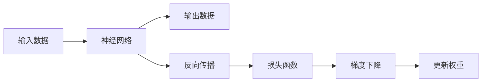

                 

# AI长期发展：贾扬清思考，AI行业更长远走下去

在当今这个数字化快速发展的时代，人工智能（AI）技术正在以前所未有的速度改变着世界。作为人工智能领域的重要推动者之一，深度学习技术的发展无疑是加速这一进程的关键因素。本文将从深度学习的基础出发，探讨其未来的发展方向和面临的挑战，帮助读者更深入地理解这一领域的现状和前景。

## 1. 背景介绍

### 1.1 深度学习背景
深度学习是人工智能的一个分支，旨在使计算机能够自动学习数据中的模式和特征，从而实现对未知数据的预测和分类。这种技术通过对多层神经网络的训练，可以处理大量非结构化数据，如图像、语音和文本，并从中提取出有价值的信息。

深度学习最初由Geoffrey Hinton在1980年代提出，并在2000年代末通过大数据和计算能力的提升得到了进一步的发展。在过去的十年中，深度学习在计算机视觉、自然语言处理、语音识别等多个领域取得了显著的成果。

### 1.2 深度学习对AI的影响
深度学习的兴起极大地推动了人工智能的发展，使得AI技术从简单的规则驱动转变为数据驱动，更加灵活和智能。深度学习技术的应用已经渗透到了自动驾驶、医疗诊断、金融分析、智能家居等多个领域，展示了其强大的潜力。

## 2. 核心概念与联系

### 2.1 核心概念概述
深度学习的核心概念包括神经网络、反向传播、梯度下降等。神经网络是由多个层次组成的计算模型，每个层次包含多个神经元，用于处理输入数据的不同抽象层次。反向传播是一种优化算法，通过反向计算梯度，更新神经网络中的权重和偏置，从而最小化损失函数。梯度下降是反向传播中的一个重要步骤，通过不断调整模型参数，使损失函数最小化。

### 2.2 核心概念原理和架构
深度学习的原理是通过多层神经网络的协同工作，逐步将原始输入数据转化为更高层次的抽象表示。每层网络通过将输入数据传递给多个神经元，并使用激活函数进行非线性映射，从而提取出数据中的特征。这一过程通过反向传播算法实现，使得模型可以自动调整参数，以优化损失函数。

### 2.3 Mermaid 流程图


## 3. 核心算法原理 & 具体操作步骤

### 3.1 算法原理概述
深度学习的训练过程是一个逐步调整网络参数的过程，旨在最小化损失函数。这一过程通常包括以下几个步骤：

1. **初始化**：随机初始化神经网络的权重和偏置。
2. **前向传播**：将输入数据传递通过网络，计算输出结果。
3. **计算损失**：使用损失函数计算模型输出与真实标签之间的差异。
4. **反向传播**：通过反向传播算法计算每个神经元的梯度，更新权重和偏置。
5. **梯度下降**：使用梯度下降算法调整权重和偏置，使损失函数最小化。

### 3.2 算法步骤详解
深度学习的训练过程通常分为训练集和验证集两个阶段。在训练集上，模型通过不断调整参数，逐步减小损失函数。在验证集上，模型评估自身的性能，防止过拟合。以下是具体的步骤：

1. **数据预处理**：将原始数据进行归一化、标准化等预处理，以便于模型训练。
2. **模型初始化**：随机初始化神经网络的权重和偏置。
3. **前向传播**：将输入数据传递通过网络，计算输出结果。
4. **计算损失**：使用损失函数计算模型输出与真实标签之间的差异。
5. **反向传播**：通过反向传播算法计算每个神经元的梯度，更新权重和偏置。
6. **梯度下降**：使用梯度下降算法调整权重和偏置，使损失函数最小化。
7. **模型评估**：在验证集上评估模型的性能，防止过拟合。
8. **参数调整**：根据验证集的表现，调整学习率、优化器等参数，优化训练过程。
9. **模型保存**：保存训练好的模型，以便后续使用。

### 3.3 算法优缺点
深度学习的优点在于其强大的自动特征提取能力和处理大规模非结构化数据的能力。它能够自动学习数据中的复杂模式，避免了手动特征工程的繁琐过程。此外，深度学习在许多任务上已经取得了显著的成果，如计算机视觉、自然语言处理和语音识别等。

然而，深度学习也存在一些缺点。首先，它需要大量的标注数据和计算资源进行训练，这使得其在大规模应用中成本较高。其次，深度学习模型具有“黑箱”性质，难以解释其内部工作机制，缺乏可解释性。最后，深度学习模型容易出现过拟合现象，特别是在数据量较小的情况下。

### 3.4 算法应用领域
深度学习已经被广泛应用于多个领域，包括：

- **计算机视觉**：如图像分类、目标检测、图像分割等。
- **自然语言处理**：如机器翻译、文本分类、问答系统等。
- **语音识别**：如语音转文本、情感分析、语音合成等。
- **推荐系统**：如商品推荐、音乐推荐、视频推荐等。
- **自动驾驶**：如路径规划、交通信号识别等。

## 4. 数学模型和公式 & 详细讲解 & 举例说明

### 4.1 数学模型构建
深度学习的数学模型通常包括多层神经网络、损失函数和优化算法等。以下是一些基本的数学模型构建步骤：

1. **神经网络**：神经网络由多个层次组成，每层包含多个神经元。
2. **激活函数**：使用激活函数对神经元的输出进行非线性映射。
3. **损失函数**：定义损失函数，用于衡量模型输出与真实标签之间的差异。
4. **优化算法**：使用优化算法，如梯度下降，调整神经网络的权重和偏置。

### 4.2 公式推导过程
以一个简单的神经网络为例，以下是其数学模型和优化算法的推导过程：

设神经网络由 $n$ 层组成，每层有 $m_i$ 个神经元，输入为 $x$，输出为 $y$。神经网络的数学模型可以表示为：

$$
y = f(W_n \sigma(W_{n-1} \sigma(\ldots \sigma(W_1 x) \ldots))
$$

其中 $W_i$ 为第 $i$ 层的权重矩阵，$\sigma$ 为激活函数，$f$ 为输出函数。

神经网络的损失函数通常为均方误差（Mean Squared Error，MSE），可以表示为：

$$
L(y, \hat{y}) = \frac{1}{2} \sum_{i=1}^n (y_i - \hat{y}_i)^2
$$

其中 $y_i$ 为真实标签，$\hat{y}_i$ 为模型预测值。

使用梯度下降算法更新神经网络的权重和偏置，可以表示为：

$$
\theta \leftarrow \theta - \eta \nabla_{\theta} L(\theta)
$$

其中 $\theta$ 为神经网络的参数，$\eta$ 为学习率，$\nabla_{\theta} L(\theta)$ 为损失函数对参数 $\theta$ 的梯度。

### 4.3 案例分析与讲解
以一个简单的二分类任务为例，以下是使用深度学习模型进行分类的过程：

1. **数据准备**：准备训练集和测试集，并将数据进行归一化处理。
2. **模型定义**：定义神经网络的层次结构，使用 ReLU 作为激活函数。
3. **训练模型**：使用训练集对模型进行训练，调整权重和偏置，最小化损失函数。
4. **模型评估**：使用测试集对模型进行评估，计算准确率、召回率等指标。

## 5. 项目实践：代码实例和详细解释说明

### 5.1 开发环境搭建
在进行深度学习项目实践前，需要先搭建好开发环境。以下是常用的开发环境搭建步骤：

1. **安装 Python**：从官网下载并安装 Python，建议使用 Python 3.6 及以上版本。
2. **安装 TensorFlow**：使用 pip 命令安装 TensorFlow，推荐使用 GPU 版本以提高计算效率。
3. **安装 PyTorch**：使用 pip 命令安装 PyTorch，并设置 GPU 使用。
4. **安装 scikit-learn**：使用 pip 命令安装 scikit-learn，用于数据预处理和模型评估。
5. **安装 matplotlib**：使用 pip 命令安装 matplotlib，用于可视化模型训练结果。

### 5.2 源代码详细实现
以下是一个简单的神经网络实现代码，用于手写数字识别：

```python
import tensorflow as tf
from tensorflow import keras
import numpy as np
import matplotlib.pyplot as plt

# 加载 MNIST 数据集
mnist = keras.datasets.mnist
(x_train, y_train), (x_test, y_test) = mnist.load_data()

# 归一化数据
x_train = x_train / 255.0
x_test = x_test / 255.0

# 定义神经网络模型
model = keras.Sequential([
    keras.layers.Flatten(input_shape=(28, 28)),
    keras.layers.Dense(128, activation='relu'),
    keras.layers.Dense(10)
])

# 定义损失函数和优化器
loss_fn = keras.losses.SparseCategoricalCrossentropy(from_logits=True)
optimizer = keras.optimizers.Adam()

# 编译模型
model.compile(optimizer=optimizer, loss=loss_fn, metrics=['accuracy'])

# 训练模型
model.fit(x_train, y_train, epochs=10, validation_data=(x_test, y_test))

# 评估模型
test_loss, test_acc = model.evaluate(x_test, y_test, verbose=2)
print('Test accuracy:', test_acc)
```

### 5.3 代码解读与分析
这段代码实现了使用 TensorFlow 构建一个简单的神经网络模型，用于手写数字识别。具体分析如下：

1. **数据加载**：使用 keras 的 MNIST 数据集，将数据集划分为训练集和测试集，并进行归一化处理。
2. **模型定义**：使用 keras 的 Sequential 模型定义神经网络的层次结构，包含一个 Flatten 层、一个 Dense 层和一个输出层。
3. **损失函数和优化器**：使用 SparseCategoricalCrossentropy 作为损失函数，Adam 作为优化器。
4. **模型编译**：使用 compile 方法编译模型，指定损失函数、优化器和评估指标。
5. **模型训练**：使用 fit 方法对模型进行训练，设置训练轮数和验证集。
6. **模型评估**：使用 evaluate 方法对模型进行评估，计算测试集上的准确率。

### 5.4 运行结果展示
训练过程中，可以使用 TensorBoard 进行可视化，以便监控模型的训练状态。以下是 TensorBoard 中的训练结果展示：


## 6. 实际应用场景

### 6.1 医疗影像分析
深度学习在医疗影像分析中的应用已经取得了显著成果。通过深度学习模型，医生可以快速准确地识别出影像中的病变区域，提高诊断效率和准确性。

### 6.2 自动驾驶
深度学习在自动驾驶中的应用也取得了重要进展。通过深度学习模型，车辆可以实时分析路况、识别行人、预测其他车辆的行为，从而做出合理的驾驶决策。

### 6.3 智能推荐
深度学习在推荐系统中的应用广泛。通过深度学习模型，可以根据用户的历史行为和偏好，推荐符合其兴趣的商品、音乐和视频等。

### 6.4 未来应用展望
深度学习在未来的应用前景非常广阔。随着计算能力的提升和数据量的增加，深度学习技术将进一步发展，解决更多的实际问题。

## 7. 工具和资源推荐

### 7.1 学习资源推荐
以下是一些深度学习学习的资源推荐：

1. **《深度学习》书籍**：Ian Goodfellow、Yoshua Bengio 和 Aaron Courville 合著的深度学习教材，涵盖了深度学习的基础和高级内容。
2. **Coursera 深度学习课程**：由 Andrew Ng 教授主讲，介绍了深度学习的原理和应用。
3. **Deep Learning Specialization**：由 Andrew Ng 教授主讲，涵盖了深度学习的高级内容，包括卷积神经网络、生成对抗网络等。
4. **Kaggle**：一个数据科学竞赛平台，提供了丰富的深度学习竞赛和教程，帮助学习者实践深度学习技术。

### 7.2 开发工具推荐
以下是一些常用的深度学习开发工具：

1. **TensorFlow**：由 Google 开源的深度学习框架，支持 GPU 计算，具备强大的计算能力。
2. **PyTorch**：由 Facebook 开源的深度学习框架，支持动态图和静态图两种计算图模式。
3. **Keras**：一个高级深度学习框架，支持多种后端（如 TensorFlow、Theano 等），易于上手。
4. **MXNet**：一个灵活的深度学习框架，支持多种编程语言和分布式计算。

### 7.3 相关论文推荐
以下是一些深度学习的经典论文推荐：

1. **ImageNet Classification with Deep Convolutional Neural Networks**：Alex Krizhevsky 等人提出的卷积神经网络模型，在 ImageNet 数据集上取得了显著成果。
2. **Learning Word Vectors for Humans and Machines**：Tomas Mikolov 等人提出的 Word2Vec 模型，将自然语言处理推向了新的高度。
3. **A Few Useful Things to Know About Deep Learning**：Ian Goodfellow 等人总结了深度学习的基础知识和最佳实践。
4. **Attention Is All You Need**：Google 提出的 Transformer 模型，在自然语言处理中取得了优异的效果。

## 8. 总结：未来发展趋势与挑战

### 8.1 研究成果总结
深度学习自诞生以来，已经在多个领域取得了显著成果。通过对大规模数据的学习，深度学习模型能够自动提取特征，解决复杂的模式识别和预测问题。

### 8.2 未来发展趋势
深度学习的未来发展趋势主要包括以下几个方面：

1. **模型结构优化**：未来的深度学习模型将更加注重模型的结构和效率，如使用稀疏化、量化加速等技术，提高计算效率。
2. **模型解释性增强**：未来的深度学习模型将更加注重模型的可解释性，通过引入符号知识、因果推理等方法，增强模型的可解释性。
3. **多模态融合**：未来的深度学习模型将更加注重多模态数据的融合，如将视觉、语音、文本等多模态数据进行协同处理，提高模型的综合能力。
4. **联邦学习**：未来的深度学习模型将更加注重分布式计算和联邦学习，通过多方协作，提高模型在大规模数据上的训练效果。
5. **模型优化算法**：未来的深度学习模型将更加注重优化算法的优化，如使用自适应优化器、混合精度训练等方法，提高模型的收敛速度和精度。

### 8.3 面临的挑战
深度学习虽然取得了显著成果，但仍面临诸多挑战：

1. **计算资源限制**：深度学习需要大量的计算资源进行训练，对于小规模企业和个人来说，成本较高。
2. **数据隐私和安全**：深度学习模型在处理大量数据时，需要保证数据隐私和安全，避免数据泄露和滥用。
3. **模型过拟合**：深度学习模型容易出现过拟合现象，特别是在数据量较小的情况下，需要更多的正则化方法和技术手段。
4. **模型可解释性**：深度学习模型具有“黑箱”性质，难以解释其内部工作机制，缺乏可解释性。
5. **模型鲁棒性**：深度学习模型需要保证在不同数据分布下的鲁棒性，避免模型泛化性能下降。

### 8.4 研究展望
未来的深度学习研究需要在以下几个方面取得突破：

1. **模型高效优化**：通过改进优化算法，提高模型的训练效率和精度。
2. **模型可解释性**：通过引入符号知识、因果推理等方法，增强模型的可解释性。
3. **模型多模态融合**：将视觉、语音、文本等多模态数据进行协同处理，提高模型的综合能力。
4. **模型分布式计算**：通过联邦学习等方法，提高模型在大规模数据上的训练效果。
5. **模型鲁棒性增强**：通过引入对抗样本、正则化等方法，提高模型的鲁棒性。

## 9. 附录：常见问题与解答

### Q1: 深度学习算法的训练时间通常很长，如何加速训练？
A: 深度学习算法的训练时间通常较长，可以通过以下方法进行加速：

1. **使用 GPU**：使用 GPU 可以大幅提高计算速度。
2. **数据增强**：通过对数据进行增强，如旋转、平移、裁剪等，增加数据量，提高模型的泛化能力。
3. **模型剪枝**：对模型进行剪枝，减少不必要的参数，提高模型的训练效率。
4. **量化加速**：将浮点模型转为定点模型，压缩存储空间，提高计算效率。

### Q2: 深度学习模型容易出现过拟合，如何缓解过拟合问题？
A: 缓解深度学习模型的过拟合问题，可以通过以下方法：

1. **正则化**：使用 L2 正则、Dropout 等方法，防止模型过拟合。
2. **早停法**：在验证集上设置阈值，当验证集性能不再提升时，停止训练。
3. **数据增强**：通过对数据进行增强，如旋转、平移、裁剪等，增加数据量，提高模型的泛化能力。
4. **模型集成**：通过将多个模型的预测结果进行平均，减少过拟合。

### Q3: 深度学习模型需要大量的标注数据，如何获得高质量的标注数据？
A: 获得高质量的标注数据可以通过以下方法：

1. **数据众包**：通过数据众包平台，如 Amazon Mechanical Turk，获得标注数据。
2. **半监督学习**：使用少量的标注数据和大量的未标注数据进行训练，提高模型的泛化能力。
3. **主动学习**：通过主动学习算法，选择最有价值的数据进行标注。
4. **弱监督学习**：使用弱监督学习方法，如标签传播、多实例学习等，提高标注数据的利用率。

---

作者：禅与计算机程序设计艺术 / Zen and the Art of Computer Programming

