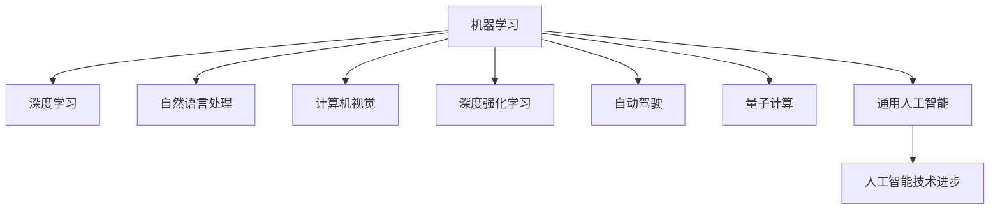

                 

# AI领域的技术进步与突破

> 关键词：人工智能,机器学习,深度学习,深度强化学习,自然语言处理,计算机视觉,自动驾驶,量子计算,通用人工智能

## 1. 背景介绍

### 1.1 问题由来
人工智能(AI)技术在过去的几十年里取得了长足的进步，涵盖了从简单的规则匹配到复杂的深度学习模型，再到跨领域的通用智能。然而，尽管取得了巨大的成功，AI在诸多领域仍面临诸多挑战。本博文将详细探讨AI领域的最新技术进步与突破，从多个前沿研究领域揭示未来可能的方向和挑战。

### 1.2 问题核心关键点
AI领域的技术进步与突破主要集中在以下几个关键领域：

- **机器学习与深度学习**：从传统的浅层模型到深层神经网络，再到更高效的模型结构，如Transformer、Attention等。

- **深度强化学习**：将强化学习应用于游戏、机器人控制、自动化交易等领域，推动智能体决策能力的提升。

- **自然语言处理**：包括文本生成、语言理解、对话系统等，推动了自然语言与机器交互能力的飞跃。

- **计算机视觉**：如目标检测、图像分割、3D建模等，推动了视觉信息处理的自动化和智能化。

- **自动驾驶**：从感知到决策的全栈系统，实现了更加安全、可靠的无人驾驶。

- **量子计算**：利用量子态的并行计算能力，为复杂问题提供更高效的计算方案。

- **通用人工智能**：即通用智能，推动AI系统具备超越特定任务的全面智能。

## 2. 核心概念与联系

### 2.1 核心概念概述

为更好地理解AI领域的最新技术，本节将介绍几个密切相关的核心概念：

- **机器学习**：通过数据训练模型，使其能够对新数据进行预测或决策的算法。

- **深度学习**：利用深层神经网络处理数据，以实现更高层次的特征提取与学习。

- **深度强化学习**：结合强化学习与深度学习，使智能体通过与环境的交互，自动优化策略，达到最优决策。

- **自然语言处理(NLP)**：涉及文本数据的处理、理解、生成和交互，目标是为机器赋予类似人类的语言能力。

- **计算机视觉(CV)**：利用计算机处理和分析图像与视频数据，实现目标识别、图像分割等任务。

- **自动驾驶**：使用计算机视觉、深度学习和强化学习等技术，实现自动驾驶汽车。

- **量子计算**：利用量子力学原理，实现比传统计算机更快更高效的计算。

- **通用人工智能**：使AI系统具备处理各种类型任务的能力，甚至超越特定任务。

这些核心概念之间的逻辑关系可以通过以下Mermaid流程图来展示：



这个流程图展示了AI核心概念之间的相互联系和支撑关系：

1. 机器学习是AI的基础，从浅层模型到深层网络，从传统到深度。
2. 深度学习通过更深的网络结构和更多参数，提升了特征提取和学习能力。
3. 自然语言处理、计算机视觉、自动驾驶、量子计算等各领域，均在深度学习的支撑下取得进展。
4. 深度强化学习在复杂决策问题上的应用，进一步提升了智能体的决策能力。
5. 通用人工智能则代表了AI技术发展的最终目标，是各领域技术融合的产物。

## 3. 核心算法原理 & 具体操作步骤
### 3.1 算法原理概述

AI领域的技术进步与突破主要体现在算法原理的不断演进。以下将简要介绍几个代表性算法：

- **深度神经网络(DNN)**：通过多层非线性变换，从原始数据中学习特征表示。
- **卷积神经网络(CNN)**：适用于图像处理，通过卷积层和池化层提取局部特征。
- **循环神经网络(RNN)**：适用于序列数据，通过门控机制处理时间依赖关系。
- **Transformer**：利用自注意力机制，实现跨模态数据的高效融合。
- **深度强化学习**：通过智能体与环境的交互，学习最优策略。

### 3.2 算法步骤详解

AI技术的进步与突破通常通过以下步骤实现：

**Step 1: 数据准备**
- 收集大量标注数据，保证数据质量与多样性。
- 进行数据预处理，包括清洗、归一化、增强等操作。

**Step 2: 模型选择与设计**
- 选择适合的算法框架（如TensorFlow、PyTorch等），并设计网络结构。
- 选择合适的损失函数、优化器等超参数，并进行初始化。

**Step 3: 模型训练**
- 通过反向传播算法更新模型参数，最小化损失函数。
- 采用数据增强、正则化等技术，防止过拟合。
- 进行超参数调优，提升模型性能。

**Step 4: 模型评估与部署**
- 在验证集上评估模型性能，确保模型泛化能力强。
- 将训练好的模型部署到实际应用场景中，进行实时推理。
- 持续收集反馈数据，不断优化模型性能。

### 3.3 算法优缺点

AI技术进步与突破在带来巨大成效的同时，也存在以下优缺点：

**优点**
- **高精度**：深度学习、Transformer等算法在处理复杂数据时表现优异。
- **广泛适用**：从图像识别到自然语言处理，再到自动驾驶，AI技术在多个领域取得突破。
- **自动化**：深度学习、强化学习等技术，自动优化模型性能，减少了人工干预。

**缺点**
- **计算成本高**：深层网络、大模型需要大量计算资源。
- **模型复杂**：模型结构复杂，训练过程难以解释。
- **数据依赖**：依赖高质量、大量标注数据，数据获取成本高。

### 3.4 算法应用领域

AI技术的进步与突破在多个领域得到应用，以下是几个典型应用场景：

- **医疗诊断**：利用AI进行医学影像分析、病理诊断等。
- **金融分析**：使用AI进行市场预测、信用评分、欺诈检测等。
- **智能客服**：通过AI构建自动化客服系统，提升客户服务效率。
- **自动驾驶**：实现自动驾驶汽车，提升交通安全与效率。
- **智能推荐**：基于用户行为数据，提供个性化推荐服务。
- **智能制造**：通过AI优化生产流程，提升制造业智能化水平。

## 4. 数学模型和公式 & 详细讲解  
### 4.1 数学模型构建

本节将使用数学语言对AI领域的核心算法进行更加严格的描述。

**卷积神经网络**
- 输入：$x = (x_1, x_2, ..., x_n)$
- 输出：$y = (y_1, y_2, ..., y_n)$
- 公式：
  $$
  y_i = f(W*x_i + b_i)
  $$
  其中 $f$ 为激活函数，$W$ 为权重，$b$ 为偏置。

**循环神经网络**
- 输入序列：$(x_t)$
- 输出序列：$(y_t)$
- 公式：
  $$
  h_t = f(W*x_t + U*h_{t-1} + b)
  $$
  $$
  y_t = g(h_t)
  $$
  其中 $f$ 为激活函数，$g$ 为输出函数。

**Transformer**
- 输入序列：$(x_1, x_2, ..., x_n)$
- 输出序列：$(y_1, y_2, ..., y_n)$
- 公式：
  $$
  Q = XW_Q
  $$
  $$
  K = XW_K
  $$
  $$
  V = XW_V
  $$
  $$
  A = \frac{\exp(QK^T)}{\sum_j\exp(QK_j^T)}
  $$
  $$
  O = AV
  $$
  其中 $X$ 为输入序列，$W_Q$、$W_K$、$W_V$ 为线性变换矩阵，$A$ 为注意力矩阵。

**深度强化学习**
- 智能体：$A$，状态：$S$，行动：$A$
- 目标：最大化累计奖励 $R$
- 公式：
  $$
  \max_A \sum_{t=0}^T R_t
  $$
  $$
  Q(S,A) = \mathbb{E}[R_{t+1} + \gamma Q(S',A')]
  $$
  $$
  A(S) = \arg\max_A Q(S,A)
  $$
  其中 $R_t$ 为奖励函数，$\gamma$ 为折扣因子。

### 4.2 公式推导过程

以下我们将通过示例来具体分析这些算法的公式推导过程。

**卷积神经网络**
- 输入：$x = (x_1, x_2, ..., x_n)$
- 输出：$y = (y_1, y_2, ..., y_n)$
- 权重矩阵：$W$
- 偏置向量：$b$

卷积神经网络通过多个卷积层和池化层提取图像特征，公式推导如下：

$$
h_1 = f(W*x_1 + b_1)
$$
$$
h_2 = f(W*h_1 + b_2)
$$
$$
...
$$
$$
h_n = f(W*h_{n-1} + b_n)
$$
$$
y = g(h_n)
$$

其中 $f$ 为激活函数，$g$ 为输出函数。

**循环神经网络**
- 输入序列：$(x_t)$
- 输出序列：$(y_t)$
- 权重矩阵：$W$
- 偏置向量：$b$

循环神经网络通过隐藏状态 $h_t$ 传递信息，公式推导如下：

$$
h_1 = f(W*x_1 + b_1)
$$
$$
h_2 = f(W*x_2 + U*h_{1} + b_2)
$$
$$
...
$$
$$
h_t = f(W*x_t + U*h_{t-1} + b_t)
$$
$$
y_t = g(h_t)
$$

其中 $f$ 为激活函数，$g$ 为输出函数。

**Transformer**
- 输入序列：$(x_1, x_2, ..., x_n)$
- 输出序列：$(y_1, y_2, ..., y_n)$
- 权重矩阵：$W_Q$、$W_K$、$W_V$

Transformer通过自注意力机制提取序列特征，公式推导如下：

$$
Q = XW_Q
$$
$$
K = XW_K
$$
$$
V = XW_V
$$
$$
A = \frac{\exp(QK^T)}{\sum_j\exp(QK_j^T)}
$$
$$
O = AV
$$

其中 $X$ 为输入序列，$W_Q$、$W_K$、$W_V$ 为线性变换矩阵，$A$ 为注意力矩阵。

**深度强化学习**
- 智能体：$A$，状态：$S$，行动：$A$
- 目标：最大化累计奖励 $R$
- 权重矩阵：$W$
- 偏置向量：$b$

深度强化学习通过智能体与环境的交互，公式推导如下：

$$
Q(S,A) = \mathbb{E}[R_{t+1} + \gamma Q(S',A')]
$$
$$
A(S) = \arg\max_A Q(S,A)
$$

其中 $R_t$ 为奖励函数，$\gamma$ 为折扣因子。

## 5. 项目实践：代码实例和详细解释说明
### 5.1 开发环境搭建

在进行AI模型开发前，需要先搭建好开发环境。以下是使用Python进行TensorFlow开发的环境配置流程：

1. 安装Anaconda：从官网下载并安装Anaconda，用于创建独立的Python环境。

2. 创建并激活虚拟环境：
```bash
conda create -n tf-env python=3.8 
conda activate tf-env
```

3. 安装TensorFlow：根据CUDA版本，从官网获取对应的安装命令。例如：
```bash
pip install tensorflow
```

4. 安装各类工具包：
```bash
pip install numpy pandas scikit-learn matplotlib tqdm jupyter notebook ipython
```

完成上述步骤后，即可在`tf-env`环境中开始AI模型的开发。

### 5.2 源代码详细实现

我们以深度神经网络在手写数字识别任务中的应用为例，给出TensorFlow的代码实现。

首先，定义模型结构：

```python
import tensorflow as tf
from tensorflow.keras import layers

model = tf.keras.Sequential([
    layers.Conv2D(32, (3, 3), activation='relu', input_shape=(28, 28, 1)),
    layers.MaxPooling2D((2, 2)),
    layers.Flatten(),
    layers.Dense(10, activation='softmax')
])
```

接着，编译并训练模型：

```python
model.compile(optimizer='adam', loss='sparse_categorical_crossentropy', metrics=['accuracy'])
model.fit(train_images, train_labels, epochs=10, validation_data=(test_images, test_labels))
```

最后，评估模型性能：

```python
test_loss, test_acc = model.evaluate(test_images, test_labels)
print(f'Test accuracy: {test_acc:.2f}')
```

以上代码实现了深度神经网络对手写数字图像的分类任务。通过TensorFlow，我们可以轻松地搭建、训练、评估深度学习模型。

### 5.3 代码解读与分析

让我们再详细解读一下关键代码的实现细节：

**模型定义**
- `Sequential`：定义了线性堆叠的模型结构。
- `Conv2D`：定义了2D卷积层，用于提取图像特征。
- `MaxPooling2D`：定义了最大池化层，用于减小特征图尺寸。
- `Flatten`：将特征图展平，为全连接层提供输入。
- `Dense`：定义了全连接层，用于输出最终分类结果。

**编译与训练**
- `compile`：编译模型，设置优化器、损失函数和评估指标。
- `fit`：训练模型，指定训练数据、训练轮数和验证集。
- `evaluate`：评估模型，在测试集上计算准确率和损失函数。

**评估与输出**
- `accuracy`：模型在测试集上的准确率。

通过上述代码，可以直观地了解深度神经网络在手写数字识别任务中的应用流程。在实际应用中，开发者可以根据具体任务，进一步优化模型结构和参数设置，提升性能。

## 6. 实际应用场景
### 6.1 医疗诊断

深度学习在医疗诊断领域的应用非常广泛，包括医学影像分析、病理诊断等。通过AI算法，医生可以更快速、更准确地识别病变区域，辅助诊断。

例如，在X光片诊断中，利用深度学习模型对胸片进行自动分析，可以识别出肺炎、结核等疾病。利用卷积神经网络，模型能够从图像中提取局部特征，并进行分类。通过进一步训练和优化，AI算法甚至可以超越人类医生，提供更为精准的诊断结果。

### 6.2 金融分析

在金融领域，AI技术可以应用于市场预测、信用评分、欺诈检测等。通过深度学习算法，模型可以从大量的金融数据中学习规律，提供投资建议、风险评估等服务。

例如，利用卷积神经网络对股票价格序列进行分析，可以预测未来价格变化趋势。利用循环神经网络处理时间序列数据，可以识别出异常交易行为，及时发现金融欺诈。

### 6.3 智能客服

智能客服系统通过AI技术，可以自动处理客户咨询，提升服务效率。通过深度学习模型，系统可以理解客户意图，生成标准回复，甚至进行情感分析。

例如，在客服对话中，利用自然语言处理技术，模型可以分析客户语义，匹配最佳回答。通过进一步训练，模型可以生成更自然流畅的对话，增强客户满意度。

### 6.4 自动驾驶

自动驾驶技术利用深度学习、计算机视觉等技术，实现汽车自主导航。通过多传感器融合，系统可以实时感知周围环境，做出智能决策。

例如，利用卷积神经网络对图像进行目标检测，可以识别出道路、车辆、行人等物体。利用循环神经网络处理时间序列数据，可以预测行人、车辆行为，避免碰撞事故。

### 6.5 智能推荐

智能推荐系统通过AI算法，根据用户行为数据，提供个性化推荐服务。通过深度学习模型，系统可以分析用户兴趣，推荐相关商品或内容。

例如，在电商平台上，利用深度学习算法对用户浏览记录进行分析，可以推荐用户感兴趣的商品。利用循环神经网络处理用户行为序列，可以预测用户购买行为，提升转化率。

## 7. 工具和资源推荐
### 7.1 学习资源推荐

为了帮助开发者系统掌握AI技术的理论基础和实践技巧，这里推荐一些优质的学习资源：

1. **《深度学习》课程**：由斯坦福大学开设的深度学习课程，深入浅出地讲解深度学习的基本概念和算法。
2. **《计算机视觉：算法与应用》书籍**：详细介绍了计算机视觉的原理、技术和应用。
3. **《强化学习：算法与实践》书籍**：介绍了强化学习的原理、算法和实际应用。
4. **Kaggle平台**：全球最大的数据科学竞赛平台，提供大量AI领域的竞赛数据集和模型。
5. **arXiv.org**：学术界最权威的预印本服务器，提供最新研究成果和论文。

通过对这些资源的学习实践，相信你一定能够快速掌握AI技术的精髓，并用于解决实际的业务问题。

### 7.2 开发工具推荐

高效的开发离不开优秀的工具支持。以下是几款用于AI开发常用的工具：

1. **TensorFlow**：Google开发的深度学习框架，支持分布式计算，易于部署和扩展。
2. **PyTorch**：Facebook开源的深度学习框架，灵活易用，支持动态计算图。
3. **Keras**：高层次的深度学习库，易于上手，支持多种后端。
4. **Jupyter Notebook**：交互式编程环境，支持代码调试、实时输出。
5. **GitHub**：全球最大的代码托管平台，方便团队协作和代码共享。

合理利用这些工具，可以显著提升AI开发的效率，加快创新迭代的步伐。

### 7.3 相关论文推荐

AI技术的发展离不开学界的持续研究。以下是几篇奠基性的相关论文，推荐阅读：

1. **AlexNet：ImageNet Large Scale Visual Recognition Challenge**：提出了卷积神经网络，用于图像分类任务，取得了SOTA成绩。
2. **RNN：Learning Phrase Representations using RNN Encoder-Decoder for Statistical Machine Translation**：利用循环神经网络进行序列到序列的翻译任务，取得了SOTA成绩。
3. **AlphaGo：Mastering the Game of Go without Human Knowledge**：通过深度强化学习，AlphaGo成功击败了人类围棋冠军。
4. **GAN：Generative Adversarial Nets**：提出了生成对抗网络，用于生成逼真的图像和视频。
5. **BERT：Bidirectional Encoder Representations from Transformers**：利用Transformer结构进行预训练语言模型，取得了SOTA的自然语言理解效果。

这些论文代表了大AI领域的技术进步与突破，展示了前沿技术的发展脉络。通过学习这些前沿成果，可以帮助研究者把握学科前进方向，激发更多的创新灵感。

## 8. 总结：未来发展趋势与挑战
### 8.1 研究成果总结

AI领域的最新技术进步与突破主要体现在以下几个方面：

1. **深度学习**：从卷积神经网络到Transformer，模型结构不断演进，提升了特征提取和表示学习能力。
2. **计算机视觉**：通过卷积神经网络，图像处理和目标检测等任务取得了显著进展。
3. **自然语言处理**：利用Transformer等模型，语言理解和生成能力大幅提升，推动了对话系统、文本生成等任务的发展。
4. **深度强化学习**：通过多智能体协同优化，提升了决策能力和环境适应性。
5. **自动驾驶**：通过多传感器融合和深度学习，实现了自主导航和智能决策。
6. **量子计算**：利用量子态并行计算，提升了复杂问题的计算效率。
7. **通用人工智能**：推动AI系统具备全面智能，实现跨领域任务处理。

### 8.2 未来发展趋势

展望未来，AI领域的技术发展将呈现以下几个趋势：

1. **自监督学习**：利用未标注数据进行预训练，减少对标注数据的需求。
2. **跨模态学习**：将文本、图像、视频等多模态数据进行融合，提升整体感知能力。
3. **联邦学习**：在分布式环境下进行模型训练，保护数据隐私。
4. **模型压缩与加速**：利用模型压缩和加速技术，提升模型的实时性。
5. **因果推断**：通过因果推断方法，增强模型决策的因果性和可解释性。
6. **模型鲁棒性**：提升模型对噪声和对抗样本的鲁棒性，增强系统的可靠性。
7. **伦理性**：研究模型决策的伦理性，确保其符合人类价值观和道德规范。

### 8.3 面临的挑战

尽管AI技术取得巨大进展，但在应用过程中仍面临诸多挑战：

1. **数据获取成本高**：高质量标注数据获取成本高，限制了模型的应用范围。
2. **模型可解释性差**：深度学习模型难以解释其内部工作机制，缺乏透明性。
3. **鲁棒性不足**：模型对噪声和对抗样本敏感，鲁棒性有待提升。
4. **伦理问题**：AI决策可能带来伦理问题，如偏见、歧视等。
5. **隐私保护**：数据隐私保护成为重要课题，需要在模型训练和部署中加以考虑。

### 8.4 研究展望

面对AI技术面临的挑战，未来的研究需要在以下几个方面寻求新的突破：

1. **数据生成技术**：通过生成对抗网络等技术，生成高质量标注数据，降低对真实数据的依赖。
2. **模型压缩与加速**：利用模型压缩和加速技术，提升模型的实时性和可部署性。
3. **模型可解释性**：引入因果推断和可解释性技术，增强模型决策的透明性和可信度。
4. **公平性与伦理性**：研究模型决策的公平性和伦理性，确保其符合人类价值观和道德规范。
5. **隐私保护**：研究隐私保护技术，确保数据隐私和安全。

这些研究方向的探索，必将引领AI技术迈向更高的台阶，为构建安全、可靠、可解释、可控的智能系统铺平道路。面向未来，AI技术还需要与其他AI技术进行更深入的融合，如知识表示、因果推理、强化学习等，多路径协同发力，共同推动AI系统的进步。只有勇于创新、敢于突破，才能不断拓展AI技术的边界，让智能技术更好地造福人类社会。

---

作者：禅与计算机程序设计艺术 / Zen and the Art of Computer Programming

