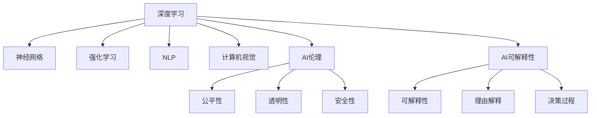

                 

# AI领域的技术进步与突破

> 关键词：人工智能,机器学习,深度学习,强化学习,自然语言处理,NLP,计算机视觉,计算机视觉,AI伦理,可解释性

## 1. 背景介绍

### 1.1 问题由来
近年来，人工智能(AI)领域经历了翻天覆地的变革，从简单的图像识别、语音识别，到复杂的自然语言处理(NLP)、决策支持等，AI技术的应用范围不断拓展，其对社会生活的影响也愈加深远。AI技术的发展，尤其是深度学习、强化学习等技术的突破，为各行各业带来了巨大的商业价值和创新潜力。然而，随着AI技术在更多领域的应用，也引发了人们对于AI技术的伦理、安全、可解释性等问题的深思。

### 1.2 问题核心关键点
当前，AI领域的技术进步与突破主要集中在以下几个方面：

- 深度学习与神经网络：通过多层神经网络，可以自动学习并提取数据特征，实现图像、语音、文本等多种数据类型的处理。
- 强化学习与博弈论：通过与环境的交互，AI系统能够在复杂环境中进行决策，应用领域包括游戏、机器人控制、推荐系统等。
- 自然语言处理(NLP)：NLP技术能够理解、生成自然语言，其应用场景包括机器翻译、智能客服、智能问答等。
- 计算机视觉：通过深度学习模型，AI系统可以自动识别、分类图像，广泛应用于图像识别、医学影像分析等领域。
- AI伦理与可解释性：在AI技术大规模应用的同时，如何确保其公平性、透明度，提升可解释性，是当前的重要研究课题。

这些技术进步和突破，推动了AI技术在各个领域的应用，并在实践中不断优化和改进，提升AI系统的性能和可靠性。

## 2. 核心概念与联系

### 2.1 核心概念概述

为更好地理解AI领域的技术进步与突破，本节将介绍几个密切相关的核心概念：

- 深度学习(Deep Learning)：基于多层神经网络，能够自动学习特征并进行复杂数据建模的技术。
- 神经网络(Neural Networks)：由大量神经元组成，通过反向传播算法进行参数更新，能够学习数据特征的模型。
- 强化学习(Reinforcement Learning)：通过与环境的交互，AI系统通过奖励信号进行策略优化，实现决策优化。
- 自然语言处理(NLP)：处理、理解和生成自然语言的技术，广泛应用于机器翻译、语音识别、问答系统等。
- 计算机视觉(Computer Vision)：处理、分析和理解图像的技术，包括图像分类、目标检测、图像生成等。
- AI伦理(AI Ethics)：涉及AI技术在应用过程中如何确保公平性、透明性和安全性。
- AI可解释性(Explainability)：AI系统在做出决策时，能够提供可解释的理由和依据，增强用户信任。

这些核心概念之间的逻辑关系可以通过以下Mermaid流程图来展示：



这个流程图展示了大语言模型的核心概念及其之间的关系：

1. 深度学习通过神经网络进行特征学习，强化学习通过与环境互动进行策略优化。
2. NLP、计算机视觉等技术从数据中提取特征，并通过神经网络进行建模。
3. AI伦理和可解释性确保AI系统在应用中的公平、透明和安全性。
4. 这些概念共同构成了AI技术的基础框架，支持AI系统在各个领域的应用。

## 3. 核心算法原理 & 具体操作步骤
### 3.1 算法原理概述

AI领域的技术进步与突破，本质上是算法和模型的不断优化与创新。下面以深度学习、强化学习、自然语言处理和计算机视觉为例，介绍这些核心技术的算法原理和具体操作步骤。

### 3.2 算法步骤详解

**深度学习**：

1. 数据准备：收集和预处理训练数据，确保数据质量和多样性。
2. 模型设计：选择合适的神经网络架构，包括卷积神经网络(CNN)、循环神经网络(RNN)、Transformer等。
3. 模型训练：使用反向传播算法和优化器更新模型参数，最小化损失函数。
4. 模型评估：在验证集上评估模型性能，选择最优模型。
5. 模型应用：将模型应用于实际问题，进行推理和预测。

**强化学习**：

1. 环境设计：定义环境和状态空间，确定奖励函数。
2. 策略选择：选择合适的策略，如Q-Learning、SARSA等。
3. 模型训练：在环境中进行策略优化，通过迭代更新策略参数，提高决策性能。
4. 策略评估：在实际问题中测试策略效果，收集反馈信息。
5. 策略改进：根据反馈信息调整策略，继续优化。

**自然语言处理(NLP)**：

1. 数据预处理：清洗文本数据，进行分词、去停用词、词性标注等预处理。
2. 模型训练：使用神经网络模型进行训练，如LSTM、GRU、BERT等。
3. 模型应用：进行文本分类、情感分析、机器翻译、对话系统等任务。

**计算机视觉**：

1. 数据准备：收集和标注图像数据，进行数据增强。
2. 模型设计：选择合适的卷积神经网络架构，如VGG、ResNet、Inception等。
3. 模型训练：使用反向传播算法和优化器更新模型参数，最小化损失函数。
4. 模型评估：在验证集上评估模型性能，选择最优模型。
5. 模型应用：进行图像分类、目标检测、图像生成等任务。

### 3.3 算法优缺点

深度学习、强化学习、NLP和计算机视觉各自有其优点和局限性：

**深度学习**：

优点：
- 能够自动提取数据特征，减少了特征工程的工作量。
- 适用于非线性复杂数据建模，能够处理大规模数据集。

缺点：
- 模型复杂度较高，需要大量的计算资源和存储空间。
- 存在过拟合风险，需要大量的标注数据进行训练。

**强化学习**：

优点：
- 适用于复杂环境中的决策优化，能够自适应环境变化。
- 能够处理多模态数据，应用广泛。

缺点：
- 需要大量的计算资源和环境互动时间，训练成本较高。
- 环境设计复杂，需要明确的状态空间和奖励函数。

**NLP**：

优点：
- 能够处理自然语言，应用场景广泛。
- 能够进行文本分类、情感分析等任务。

缺点：
- 处理长文本时效率较低，需要额外的技术优化。
- 对数据预处理要求较高，需要标注高质量的数据集。

**计算机视觉**：

优点：
- 能够处理图像数据，广泛应用于图像分类、目标检测等任务。
- 算法性能稳定，适用于各种复杂场景。

缺点：
- 对数据标注要求较高，需要大量的标注数据。
- 模型复杂度较高，需要大量的计算资源和存储空间。

## 4. 数学模型和公式 & 详细讲解

### 4.1 数学模型构建

本节将使用数学语言对AI领域的主要算法进行严格的数学建模。

- 深度学习：
$$
y=f(x)=\sum_{i=1}^n w_i g(z_i)
$$
其中 $f$ 为神经网络模型，$x$ 为输入，$y$ 为输出，$w_i$ 为权重，$g$ 为激活函数，$z_i$ 为神经元的输入。

- 强化学习：
$$
Q(s,a)=\sum_{i=1}^{n} R_i+\gamma Q'(s',a')
$$
其中 $Q(s,a)$ 为状态-动作的Q值，$R_i$ 为即时奖励，$\gamma$ 为折扣因子，$s'$ 为下一个状态，$a'$ 为下一个动作，$Q'(s',a')$ 为下一个状态-动作的Q值。

- 自然语言处理(NLP)：
$$
\text{EMBEDDING}(\text{WORD}) = \text{CONCAT}(EMBEDDING(\text{CONTEXT}), EMODELS(\text{TEXT}))
$$
其中 EMBEDDING 为词向量表示，EMODELS 为上下文模型，TEXT 为输入文本。

- 计算机视觉：
$$
\text{CONVOLUTION}(\text{IMAGE}) = \text{CONCAT}(\text{CONVOLUTION}(\text{IMAGE}), \text{CONVOLUTION}(\text{IMAGE}))
$$
其中 CONVOLUTION 为卷积操作，IMAGE 为输入图像。

### 4.2 公式推导过程

- 深度学习：
$$
\text{Loss Function}=\frac{1}{m} \sum_{i=1}^m (\text{COST}(y,\hat{y}))
$$
其中 $\text{COST}$ 为损失函数，$m$ 为样本数量，$y$ 为真实标签，$\hat{y}$ 为模型预测结果。

- 强化学习：
$$
\text{Loss Function}=\sum_{i=1}^{n} (R_i+\gamma Q'(s',a')) - Q(s,a)
$$
其中 $R_i$ 为即时奖励，$\gamma$ 为折扣因子，$s'$ 为下一个状态，$a'$ 为下一个动作，$Q'(s',a')$ 为下一个状态-动作的Q值。

- 自然语言处理(NLP)：
$$
\text{Loss Function}=\frac{1}{m} \sum_{i=1}^m (l(y_i,\hat{y}_i))
$$
其中 $l$ 为损失函数，$m$ 为样本数量，$y_i$ 为真实标签，$\hat{y}_i$ 为模型预测结果。

- 计算机视觉：
$$
\text{Loss Function}=\frac{1}{m} \sum_{i=1}^m (\text{COST}(y,\hat{y}))
$$
其中 $\text{COST}$ 为损失函数，$m$ 为样本数量，$y$ 为真实标签，$\hat{y}$ 为模型预测结果。

### 4.3 案例分析与讲解

以自然语言处理(NLP)中的BERT模型为例，进行详细讲解：

BERT模型使用自监督学习任务进行预训练，包括掩码语言模型(Masked Language Model, MLM)和下一句预测(Next Sentence Prediction, NSP)两种任务。掩码语言模型任务是将部分单词进行随机掩码，预测被掩码的单词。下一句预测任务是将两个句子作为输入，预测它们是否是相邻的。

在微调过程中，可以使用数据集中的标注数据对模型进行有监督学习，如情感分析、文本分类、问答系统等任务。微调的目标是最小化损失函数，即：

$$
\text{Loss Function}=\frac{1}{m} \sum_{i=1}^m (\text{COST}(y_i,\hat{y}_i))
$$

其中 $y_i$ 为真实标签，$\hat{y}_i$ 为模型预测结果。通过反向传播算法和优化器更新模型参数，使得模型能够更准确地预测任务结果。

## 5. 项目实践：代码实例和详细解释说明
### 5.1 开发环境搭建

在进行AI项目开发前，我们需要准备好开发环境。以下是使用Python进行深度学习和计算机视觉开发的环境配置流程：

1. 安装Anaconda：从官网下载并安装Anaconda，用于创建独立的Python环境。

2. 创建并激活虚拟环境：
```bash
conda create -n ai-env python=3.8 
conda activate ai-env
```

3. 安装必要的工具包：
```bash
conda install numpy pandas scikit-learn matplotlib tensorflow torch torchvision
```

4. 安装深度学习框架：
```bash
pip install torch torchtext
```

5. 安装计算机视觉库：
```bash
pip install opencv-python
```

完成上述步骤后，即可在`ai-env`环境中开始开发。

### 5.2 源代码详细实现

下面我们以图像分类任务为例，给出使用PyTorch进行深度学习和计算机视觉任务开发的PyTorch代码实现。

首先，定义数据处理函数：

```python
import torch
from torchvision import datasets, transforms
from torch.utils.data import DataLoader

def get_data_loader(data_dir, batch_size, train=True, transform=None):
    transform = transform or transforms.ToTensor()
    train_transform = transforms.Compose([
        transforms.RandomHorizontalFlip(),
        transforms.RandomCrop(224),
        transform,
    ])
    test_transform = transforms.Compose([
        transform,
    ])
    
    if train:
        train_dataset = datasets.ImageFolder(data_dir, train_transform)
    else:
        test_dataset = datasets.ImageFolder(data_dir, test_transform)
        
    train_loader = DataLoader(train_dataset, batch_size=batch_size, shuffle=True)
    test_loader = DataLoader(test_dataset, batch_size=batch_size, shuffle=False)
    
    return train_loader, test_loader
```

然后，定义模型和优化器：

```python
import torch.nn as nn
import torch.optim as optim

class ResNet(nn.Module):
    def __init__(self):
        super(ResNet, self).__init__()
        self.resnet18 = torchvision.models.resnet18(pretrained=True)
        self.fc = nn.Linear(512, 10)
        
    def forward(self, x):
        features = self.resnet18(x)
        x = self.fc(features[:, 0])
        return x

model = ResNet()
optimizer = optim.SGD(model.parameters(), lr=0.001, momentum=0.9)
```

接着，定义训练和评估函数：

```python
import torch.nn.functional as F

def train_epoch(model, train_loader, optimizer):
    model.train()
    total_loss = 0
    for images, labels in train_loader:
        images = images.to(device)
        labels = labels.to(device)
        optimizer.zero_grad()
        output = model(images)
        loss = F.cross_entropy(output, labels)
        total_loss += loss.item()
        loss.backward()
        optimizer.step()
    return total_loss / len(train_loader)

def evaluate(model, test_loader):
    model.eval()
    correct = 0
    total = 0
    with torch.no_grad():
        for images, labels in test_loader:
            images = images.to(device)
            labels = labels.to(device)
            output = model(images)
            _, predicted = torch.max(output, 1)
            total += labels.size(0)
            correct += (predicted == labels).sum().item()
    print('Accuracy: %d %%' % (100 * correct / total))
```

最后，启动训练流程并在测试集上评估：

```python
device = torch.device('cuda' if torch.cuda.is_available() else 'cpu')
model.to(device)

train_loader, test_loader = get_data_loader('data', 32, train=True)
test_loader = get_data_loader('data', 32, train=False)

epochs = 10
for epoch in range(epochs):
    loss = train_epoch(model, train_loader, optimizer)
    print('Epoch: %d, Loss: %.4f' % (epoch+1, loss))
    
    evaluate(model, test_loader)
```

以上就是使用PyTorch进行图像分类任务开发的完整代码实现。可以看到，借助深度学习框架和计算机视觉库，我们可以快速搭建并训练深度学习模型，并对其进行评估和应用。

### 5.3 代码解读与分析

让我们再详细解读一下关键代码的实现细节：

**数据处理函数**：
- `get_data_loader`函数：根据给定的数据目录、批量大小和是否为训练集，返回训练集和测试集的数据加载器。
- 数据增强：在训练集上使用随机水平翻转和随机裁剪，增强模型对图像的泛化能力。
- 模型定义：
  - `ResNet`类：定义了一个ResNet模型，包含一个预训练的ResNet-18模型和一个全连接层。
  - `model`变量：初始化一个ResNet模型，并使用SGD优化器进行参数更新。

**训练函数**：
- `train_epoch`函数：在每个epoch内，对数据集进行迭代，更新模型参数，并返回平均损失。
- 模型训练：
  - 将输入数据和标签转换为GPU/TPU张量。
  - 调用模型前向传播，计算输出结果。
  - 计算损失，并进行反向传播和参数更新。

**评估函数**：
- `evaluate`函数：对测试集进行迭代，计算模型在测试集上的准确率。
- 模型评估：
  - 在测试集上对模型进行前向传播。
  - 计算预测结果与真实标签的差异，并统计准确率。

**训练流程**：
- 定义总的epoch数。
- 对每个epoch，先在训练集上训练，并输出平均损失。
- 在测试集上评估模型性能。

可以看到，PyTorch的深度学习框架使得代码实现简洁高效。开发者可以专注于模型的设计、数据的处理和算法的优化，而不必过多关注底层的实现细节。

## 6. 实际应用场景

### 6.1 智慧医疗

AI技术在智慧医疗领域的应用越来越广泛，涉及医学影像分析、疾病诊断、药物研发等多个方面。AI系统能够自动分析影像数据，识别病灶，辅助医生进行诊断和制定治疗方案。通过深度学习和计算机视觉技术，AI系统能够快速、准确地处理大量的医学影像数据，提升医生的工作效率和诊断准确性。

在实际应用中，可以通过医疗影像数据集对模型进行预训练和微调，使得模型能够适应特定医院的数据分布和诊断标准。微调后的模型能够更好地识别病灶，辅助医生进行精确诊断。同时，AI系统还可以结合医学知识库，进行知识推理和决策支持，提升医疗系统的智能化水平。

### 6.2 智能制造

智能制造是工业4.0的重要组成部分，涉及智能工厂、智能物流、智能仓储等多个环节。AI技术在智能制造中扮演了重要角色，通过数据分析和决策支持，提升了生产效率和资源利用率。

在智能制造中，AI系统能够对生产数据进行实时监控和分析，识别生产过程中的异常情况，并自动调整生产参数，优化生产流程。同时，AI系统还可以进行预测性维护，预测设备故障，提前进行维护，减少生产停机时间。通过深度学习和强化学习技术，AI系统能够不断学习和优化生产过程，提升企业的竞争力。

### 6.3 智慧城市

智慧城市建设是城市管理现代化的重要方向，涉及交通管理、能源管理、环境监测等多个方面。AI技术在智慧城市中的应用，提升了城市的智能化和便捷化水平，改善了居民的生活质量。

在智慧城市中，AI系统能够进行交通流量预测和优化，缓解交通拥堵，提升出行效率。同时，AI系统还可以进行能源管理，通过智能电网和智能建筑，优化能源使用，减少资源浪费。此外，AI系统还可以进行环境监测，实时监测空气质量、水质等指标，提升城市的环保水平。

### 6.4 未来应用展望

随着AI技术的不断进步，未来AI系统将具备更强大的学习和推理能力，应用于更广泛的领域。以下是未来AI技术的发展趋势：

1. 跨模态AI：AI系统能够同时处理和融合视觉、语音、文本等多种数据类型，实现更全面的数据建模和分析。
2. 联邦学习：通过分布式计算和数据共享，AI系统能够在不共享数据的情况下，进行模型训练和更新。
3. 自主学习：AI系统能够通过自我学习和自适应，不断优化自身模型，提升学习效率和适应性。
4. 鲁棒性增强：AI系统将具备更强的鲁棒性和抗干扰能力，能够在复杂环境和噪声环境下进行稳定工作。
5. 实时计算：AI系统将具备更强的实时计算能力，能够进行实时数据分析和决策支持。
6. 伦理和安全性：AI系统将具备更强的伦理和安全性保障，确保其在应用中的公平性、透明性和安全性。

## 7. 工具和资源推荐
### 7.1 学习资源推荐

为了帮助开发者系统掌握AI技术，这里推荐一些优质的学习资源：

1. 《深度学习》（Ian Goodfellow）：深度学习领域的经典教材，系统介绍了深度学习的理论基础和实践应用。
2. 《机器学习实战》（Peter Harrington）：介绍机器学习的算法和实现，适合初学者入门。
3. 《计算机视觉：算法与应用》（Richard Szeliski）：介绍计算机视觉的算法和应用，涵盖图像处理、特征提取、物体检测等多个方面。
4. 《强化学习：一种现代方法》（Richard S. Sutton）：介绍强化学习的算法和应用，涵盖决策优化、智能控制等多个方面。
5. 《自然语言处理综论》（Daniel Jurafsky, James H. Martin）：介绍自然语言处理的算法和应用，涵盖文本分类、情感分析、机器翻译等多个方面。

这些资源涵盖了AI领域的各个方面，通过系统的学习，可以帮助开发者掌握AI技术的核心原理和实践技能。

### 7.2 开发工具推荐

高效的开发离不开优秀的工具支持。以下是几款用于AI开发的常用工具：

1. PyTorch：基于Python的开源深度学习框架，具有灵活的计算图和动态网络结构，支持深度学习模型的开发和训练。
2. TensorFlow：由Google主导开发的开源深度学习框架，支持分布式计算和模型优化，适合大规模工程应用。
3. Jupyter Notebook：开源的交互式编程环境，支持Python、R等多种语言，适合进行数据处理和算法开发。
4. HuggingFace Transformers：预训练语言模型的库，包含大量SOTA模型和微调样例，支持自然语言处理任务。
5. OpenAI Gym：环境库，支持各种强化学习任务和算法，方便进行实验和测试。

合理利用这些工具，可以显著提升AI开发效率，加快创新迭代的步伐。

### 7.3 相关论文推荐

AI领域的技术进步与突破离不开学界的持续研究。以下是几篇奠基性的相关论文，推荐阅读：

1. AlexNet：提出卷积神经网络，开启计算机视觉领域的大规模数据和深度学习研究。
2. ResNet：提出残差网络，解决深度神经网络的梯度消失问题，提升模型深度和性能。
3. AlphaGo：提出深度强化学习，在围棋等复杂游戏中取得优异表现，推动强化学习的快速发展。
4. Transformer：提出自注意力机制，提升自然语言处理模型的性能，成为预训练语言模型的基础。
5. BERT：提出掩码语言模型和下一句预测任务，提升自然语言处理模型的泛化能力，刷新多项任务SOTA。

这些论文代表了大语言模型微调技术的发展脉络，通过学习这些前沿成果，可以帮助研究者把握学科前进方向，激发更多的创新灵感。

## 8. 总结：未来发展趋势与挑战

### 8.1 总结

本文对AI领域的技术进步与突破进行了全面系统的介绍。首先阐述了AI技术的核心概念和研究背景，明确了深度学习、强化学习、自然语言处理和计算机视觉等技术的重要性和应用场景。其次，从原理到实践，详细讲解了这些核心技术的算法原理和具体操作步骤，给出了微调任务的代码实例和详细解释说明。同时，本文还广泛探讨了AI技术在各个领域的应用前景，展示了AI技术的广阔应用空间。

通过本文的系统梳理，可以看到，AI技术在各个领域的应用正在不断拓展，并为人类认知智能的进化带来了深远影响。未来，伴随AI技术的不断演进，其在各行各业的应用将更加广泛，为经济社会发展注入新的动力。

### 8.2 未来发展趋势

展望未来，AI领域的技术进步与突破将呈现以下几个发展趋势：

1. 深度学习与计算机视觉：未来，深度学习将进一步提升模型的性能和泛化能力，计算机视觉技术将应用于更广泛的场景，如图像生成、医学影像分析等。
2. 强化学习与智能制造：强化学习将在智能制造中发挥更大的作用，通过智能决策和优化，提升生产效率和资源利用率。
3. 自然语言处理与智慧医疗：自然语言处理技术将进一步提升医疗系统的智能化水平，通过AI系统进行疾病诊断和治疗方案推荐。
4. 跨模态AI与智慧城市：跨模态AI将提升城市管理的智能化水平，通过AI系统进行交通流量预测、能源管理等。
5. 联邦学习与联邦计算：联邦学习将推动AI系统进行分布式计算和数据共享，确保数据安全和隐私保护。
6. 自主学习与实时计算：未来AI系统将具备更强的自主学习和实时计算能力，实现更灵活和高效的决策支持。
7. 伦理和安全性：AI系统将具备更强的伦理和安全性保障，确保其在应用中的公平性、透明性和安全性。

以上趋势凸显了AI技术的广阔前景。这些方向的探索发展，必将进一步提升AI系统的性能和可靠性，推动AI技术在各个领域的应用。

### 8.3 面临的挑战

尽管AI技术的发展带来了许多机遇，但在迈向更加智能化、普适化应用的过程中，也面临着诸多挑战：

1. 数据隐私和安全：AI系统需要处理大量的数据，如何确保数据隐私和安全成为一大难题。
2. 算力资源消耗：大规模深度学习模型的训练和推理需要大量的计算资源，如何提高计算效率，降低成本，是当前的重要研究方向。
3. 模型可解释性：AI系统决策的透明性和可解释性不足，难以让用户理解和信任。
4. 伦理和法律问题：AI系统在应用中可能存在伦理和法律问题，如何确保其公平性和安全性，需要多方协同。
5. 跨领域应用障碍：不同领域的数据、任务和知识差异较大，如何将AI技术有效地应用于特定领域，仍需不断探索和优化。

正视AI技术面临的这些挑战，积极应对并寻求突破，将是大规模应用AI技术的必由之路。

### 8.4 研究展望

面对AI技术所面临的挑战，未来的研究需要在以下几个方面寻求新的突破：

1. 数据隐私保护：引入差分隐私、联邦学习等技术，确保数据隐私和安全。
2. 计算效率提升：引入模型压缩、分布式训练等技术，提升计算效率和资源利用率。
3. 模型可解释性：引入可解释性技术，如决策树、LIME等，增强模型的透明性和可解释性。
4. 伦理和法律研究：制定AI伦理规范，推动AI技术的公平性和安全性。
5. 跨领域应用优化：结合领域知识，开发特定领域的AI模型，提升应用效果。

这些研究方向的探索，必将引领AI技术迈向更高的台阶，为构建安全、可靠、可解释、可控的智能系统铺平道路。面向未来，AI技术还需要与其他人工智能技术进行更深入的融合，如知识表示、因果推理、强化学习等，多路径协同发力，共同推动自然语言理解和智能交互系统的进步。只有勇于创新、敢于突破，才能不断拓展AI技术的边界，让智能技术更好地造福人类社会。

## 9. 附录：常见问题与解答

**Q1：深度学习算法中，什么是反向传播算法？**

A: 反向传播算法是一种用于深度神经网络训练的优化算法，通过计算损失函数对模型参数的梯度，并使用梯度下降等优化方法更新模型参数，最小化损失函数。反向传播算法是深度学习中常用的优化算法之一，广泛应用于图像识别、语音识别、自然语言处理等多个领域。

**Q2：如何处理深度学习中的过拟合问题？**

A: 过拟合是深度学习中常见的问题，可以通过以下方法解决：
1. 数据增强：通过扩充训练数据，增加数据的多样性和数量，提升模型的泛化能力。
2. 正则化：通过L1、L2正则化、Dropout等方法，限制模型复杂度，避免过拟合。
3. 早停法：在训练过程中，定期在验证集上评估模型性能，如果性能不再提升，则停止训练。
4. 模型简化：通过减少模型层数、减少参数数量等方法，降低模型复杂度。
5. 批归一化：通过批归一化技术，提升模型的泛化能力，减少过拟合风险。

**Q3：如何提高AI系统的实时计算能力？**

A: 提高AI系统的实时计算能力，可以从以下几个方面入手：
1. 模型压缩：通过模型压缩技术，减少模型参数和计算量，提升计算效率。
2. 并行计算：通过分布式计算、GPU/TPU等硬件加速，提升计算速度。
3. 数据预处理：通过数据预处理技术，减少计算量和存储空间，提升计算效率。
4. 硬件优化：通过硬件优化技术，如网络优化、缓存优化等，提升计算效率。
5. 算法优化：通过优化算法，减少计算量和存储空间，提升计算效率。

通过上述方法，可以有效提升AI系统的实时计算能力，实现更高效的数据处理和决策支持。

**Q4：AI系统如何进行跨领域应用？**

A: AI系统进行跨领域应用，需要解决以下几个问题：
1. 数据转换：将不同领域的数据转换为统一的格式，方便模型处理。
2. 知识融合：将不同领域的专业知识进行融合，提升模型的泛化能力。
3. 模型微调：通过微调模型参数，适应特定领域的数据分布和任务需求。
4. 迁移学习：通过迁移学习技术，将已有模型的知识和经验迁移到新领域，提升模型的适应性。
5. 数据增强：通过数据增强技术，扩充训练数据，提升模型的泛化能力。

通过以上方法，可以有效解决跨领域应用中的问题，提升AI系统的应用效果。

---

作者：禅与计算机程序设计艺术 / Zen and the Art of Computer Programming

