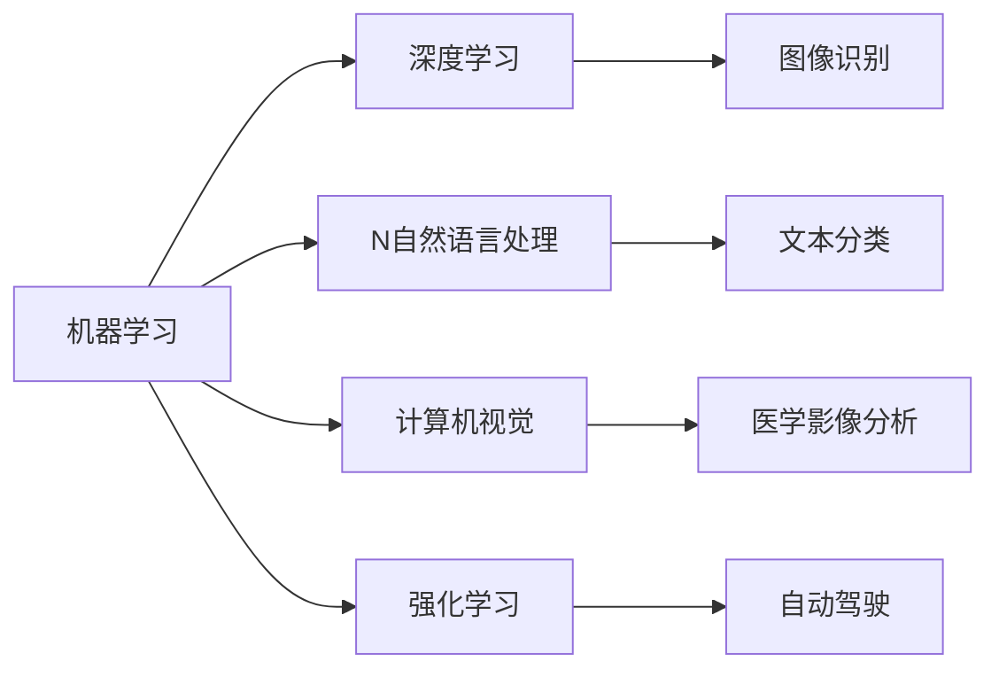

                 

# AI领域的最新技术进展

## 1. 背景介绍

随着科技的飞速发展，人工智能（AI）技术已经逐渐深入到各个领域，包括医疗、金融、自动驾驶、智能家居等。AI技术的发展离不开不断的技术创新，本文将详细介绍AI领域最新的技术进展，帮助读者了解当前AI技术的最新动态。

## 2. 核心概念与联系

### 2.1 核心概念概述

AI领域的核心概念包括机器学习、深度学习、自然语言处理、计算机视觉、强化学习等。这些概念之间相互关联，共同构成了AI技术的底层框架。

**机器学习（Machine Learning）**：指通过数据驱动的方式，训练算法模型以完成特定的任务。机器学习分为监督学习、无监督学习和强化学习三大类。

**深度学习（Deep Learning）**：是机器学习的一个子领域，通过多层神经网络模拟人脑的神经元结构，进行特征提取和模式识别。深度学习在图像识别、语音识别等领域取得了巨大成功。

**自然语言处理（NLP）**：研究如何让计算机理解和生成人类语言，包括文本分类、机器翻译、情感分析等任务。NLP在智能客服、智能翻译等应用中发挥了重要作用。

**计算机视觉（CV）**：研究如何让计算机“看”和理解图像和视频内容，广泛应用于安防监控、无人驾驶、医学影像分析等领域。

**强化学习（RL）**：研究如何让智能体通过与环境的交互，自主学习最优策略以完成目标任务，如AlphaGo、机器人控制等。

这些核心概念之间的联系可以通过以下Mermaid流程图来展示：



## 3. 核心算法原理 & 具体操作步骤

### 3.1 算法原理概述

AI技术的核心是算法，以下是几种最新的AI算法及其原理：

**深度学习中的卷积神经网络（CNN）**：通过卷积操作提取图像中的特征，广泛应用于图像识别、物体检测等领域。

**自然语言处理中的Transformer**：通过自注意力机制提取文本中的语义信息，广泛应用于机器翻译、文本生成等领域。

**强化学习中的Q-learning**：通过Q值表记录每个状态-动作对的价值，指导智能体选择最优动作，应用于游戏AI、机器人控制等领域。

**无监督学习中的自编码器（Autoencoder）**：通过学习数据压缩和重建的方式，发现数据的内在结构，广泛应用于特征提取、数据降维等领域。

### 3.2 算法步骤详解

**卷积神经网络（CNN）**：

1. 数据准备：将图像数据进行预处理，如归一化、标准化等。
2. 构建网络结构：包括卷积层、池化层、全连接层等。
3. 模型训练：通过反向传播算法，最小化损失函数。
4. 模型评估：在测试集上评估模型性能，如准确率、召回率等。

**Transformer**：

1. 数据准备：将文本数据进行分词和编码。
2. 构建模型结构：包括编码器、解码器、多头自注意力机制等。
3. 模型训练：通过最大似然估计，最小化损失函数。
4. 模型评估：在测试集上评估模型性能，如BLEU、ROUGE等。

**Q-learning**：

1. 定义状态空间和动作空间。
2. 初始化Q值表。
3. 智能体与环境交互，通过贪心策略选择最优动作。
4. 更新Q值表，最小化状态-动作对的价值。

**自编码器（Autoencoder）**：

1. 数据准备：将原始数据进行编码，得到低维特征向量。
2. 构建编码器：包括卷积层、池化层等。
3. 构建解码器：将低维特征向量解码为原始数据。
4. 模型训练：最小化重构误差，即原始数据与重构数据之间的差异。

### 3.3 算法优缺点

**卷积神经网络（CNN）**：

优点：具有较好的局部感知能力，可以提取图像中的局部特征。

缺点：对于长程依赖的特征提取能力较弱，需要堆叠多个卷积层。

**Transformer**：

优点：具有较好的全局感知能力，可以提取文本中的全局语义信息。

缺点：计算复杂度较高，需要大量的计算资源。

**Q-learning**：

优点：简单易懂，易于实现。

缺点：需要大量的交互数据，训练时间长。

**自编码器（Autoencoder）**：

优点：可以发现数据的内在结构，适用于特征提取和数据降维。

缺点：对于复杂的非线性关系，无法有效捕捉。

### 3.4 算法应用领域

**卷积神经网络（CNN）**：

应用于图像识别、物体检测、人脸识别等领域。如Google的Inception、Microsoft的ResNet等。

**Transformer**：

应用于机器翻译、文本生成、问答系统等领域。如OpenAI的GPT-3、Google的BERT等。

**Q-learning**：

应用于自动驾驶、机器人控制、游戏AI等领域。如AlphaGo、Pong等。

**自编码器（Autoencoder）**：

应用于特征提取、数据降维、图像去噪等领域。如MNIST数字识别、图像去雾等。

## 4. 数学模型和公式 & 详细讲解 & 举例说明

### 4.1 数学模型构建

**卷积神经网络（CNN）**：

假设输入图像大小为$H \times W \times C$，卷积核大小为$K \times K$，步幅为$s$，输出特征图大小为$O \times P \times Q$。则卷积操作可以表示为：

$$
C_{\text{conv}} = \sum_{c=0}^{C-1} W^c_{i,j} * I^c_{i',j'}
$$

其中$W^c_{i,j}$为卷积核，$I^c_{i',j'}$为输入图像。

**Transformer**：

Transformer模型包括编码器-解码器结构，其中自注意力机制可以表示为：

$$
\text{Attention}(Q,K,V) = \frac{e^{QK^T / \sqrt{d_k}}}{\sum_{j=1}^n e^{QK_j^T / \sqrt{d_k}}}
$$

其中$Q$为查询向量，$K$为键向量，$V$为值向量，$d_k$为键向量的维度。

**Q-learning**：

假设智能体在状态$s$下，通过动作$a$获得了下一个状态$s'$和奖励$r$，则Q值更新公式为：

$$
Q(s,a) \leftarrow Q(s,a) + \alpha (r + \gamma \max_{a'} Q(s',a') - Q(s,a))
$$

其中$\alpha$为学习率，$\gamma$为折扣因子。

**自编码器（Autoencoder）**：

自编码器包括编码器和解码器两部分，其中编码器的输出$Z$可以表示为：

$$
Z = W^H * H^t * X
$$

解码器的输出$\hat{X}$可以表示为：

$$
\hat{X} = W^D * D^t * Z
$$

其中$W^H$和$W^D$分别为编码器和解码器的权重矩阵。

### 4.2 公式推导过程

**卷积神经网络（CNN）**：

假设输入图像大小为$H \times W \times C$，卷积核大小为$K \times K$，步幅为$s$，输出特征图大小为$O \times P \times Q$。则卷积操作可以表示为：

$$
C_{\text{conv}} = \sum_{c=0}^{C-1} \sum_{i=0}^{H-K} \sum_{j=0}^{W-K} I^c_{i',j'} W^c_{i,j}
$$

其中$i'=i*s+0$，$j'=j*s+0$，$i'=i$，$j'=j$。

**Transformer**：

Transformer模型中的自注意力机制可以表示为：

$$
\text{Attention}(Q,K,V) = \frac{e^{QK^T / \sqrt{d_k}}}{\sum_{j=1}^n e^{QK_j^T / \sqrt{d_k}}}
$$

其中$Q$、$K$、$V$均为维度为$d_k$的向量，$d_k$为键向量的维度。

**Q-learning**：

Q-learning算法中，智能体通过贪心策略选择动作$a$，更新Q值：

$$
Q(s,a) \leftarrow Q(s,a) + \alpha (r + \gamma \max_{a'} Q(s',a') - Q(s,a))
$$

其中$\alpha$为学习率，$\gamma$为折扣因子。

**自编码器（Autoencoder）**：

自编码器中，编码器的输出$Z$可以表示为：

$$
Z = W^H * H^t * X
$$

解码器的输出$\hat{X}$可以表示为：

$$
\hat{X} = W^D * D^t * Z
$$

其中$W^H$和$W^D$分别为编码器和解码器的权重矩阵。

### 4.3 案例分析与讲解

**卷积神经网络（CNN）**：

假设有一张$28 \times 28$的手写数字图片，可以使用LeNet网络进行特征提取。LeNet网络包括卷积层、池化层和全连接层等，其中卷积层大小为$5 \times 5$，步幅为$1$，输出特征图大小为$10 \times 10 \times 6$。则卷积操作可以表示为：

$$
C_{\text{conv}} = \sum_{c=0}^{5} \sum_{i=0}^{10} \sum_{j=0}^{10} I^c_{i',j'} W^c_{i,j}
$$

其中$i'=i*s+0$，$j'=j*s+0$，$i'=i$，$j'=j$。

**Transformer**：

假设有一个长度为$n$的句子，可以将其编码为Transformer模型。Transformer模型包括编码器-解码器结构，其中自注意力机制可以表示为：

$$
\text{Attention}(Q,K,V) = \frac{e^{QK^T / \sqrt{d_k}}}{\sum_{j=1}^n e^{QK_j^T / \sqrt{d_k}}}
$$

其中$Q$、$K$、$V$均为维度为$d_k$的向量，$d_k$为键向量的维度。

**Q-learning**：

假设有一个环境，智能体在状态$s=1$下，通过动作$a=0$获得了下一个状态$s'=1$和奖励$r=1$，则Q值更新公式为：

$$
Q(1,0) \leftarrow Q(1,0) + \alpha (1 + \gamma \max_{a'} Q(1',a') - Q(1,0))
$$

其中$\alpha$为学习率，$\gamma$为折扣因子。

**自编码器（Autoencoder）**：

假设有一个大小为$256 \times 256$的图像，可以使用自编码器进行特征提取。自编码器包括编码器和解码器两部分，其中编码器的输出$Z$可以表示为：

$$
Z = W^H * H^t * X
$$

解码器的输出$\hat{X}$可以表示为：

$$
\hat{X} = W^D * D^t * Z
$$

其中$W^H$和$W^D$分别为编码器和解码器的权重矩阵。

## 5. 项目实践：代码实例和详细解释说明

### 5.1 开发环境搭建

在进行AI项目实践前，我们需要准备好开发环境。以下是使用Python进行TensorFlow开发的环境配置流程：

1. 安装Anaconda：从官网下载并安装Anaconda，用于创建独立的Python环境。

2. 创建并激活虚拟环境：
```bash
conda create -n tf-env python=3.8 
conda activate tf-env
```

3. 安装TensorFlow：从官网获取对应的安装命令。例如：
```bash
conda install tensorflow tensorflow-gpu -c conda-forge
```

4. 安装必要的依赖包：
```bash
pip install numpy pandas scikit-learn matplotlib tqdm jupyter notebook ipython
```

完成上述步骤后，即可在`tf-env`环境中开始AI项目实践。

### 5.2 源代码详细实现

这里我们以卷积神经网络（CNN）为例，给出使用TensorFlow进行图像识别任务开发的Python代码实现。

首先，导入必要的库：

```python
import tensorflow as tf
from tensorflow.keras import layers, models
import numpy as np
import matplotlib.pyplot as plt
```

然后，准备训练数据：

```python
# 加载手写数字数据集
(x_train, y_train), (x_test, y_test) = tf.keras.datasets.mnist.load_data()

# 归一化数据
x_train = x_train / 255.0
x_test = x_test / 255.0

# 将标签转化为独热编码
y_train = tf.keras.utils.to_categorical(y_train, 10)
y_test = tf.keras.utils.to_categorical(y_test, 10)
```

接着，构建卷积神经网络（CNN）模型：

```python
# 定义模型结构
model = models.Sequential([
    layers.Conv2D(32, (3,3), activation='relu', input_shape=(28, 28, 1)),
    layers.MaxPooling2D((2,2)),
    layers.Conv2D(64, (3,3), activation='relu'),
    layers.MaxPooling2D((2,2)),
    layers.Flatten(),
    layers.Dense(10, activation='softmax')
])

# 编译模型
model.compile(optimizer='adam', loss='categorical_crossentropy', metrics=['accuracy'])
```

然后，训练模型：

```python
# 训练模型
history = model.fit(x_train.reshape(-1, 28, 28, 1), y_train, epochs=10, batch_size=128, validation_data=(x_test.reshape(-1, 28, 28, 1), y_test))
```

最后，评估模型：

```python
# 评估模型
test_loss, test_acc = model.evaluate(x_test.reshape(-1, 28, 28, 1), y_test)
print('Test accuracy:', test_acc)
```

以上就是使用TensorFlow进行图像识别任务开发的完整代码实现。可以看到，TensorFlow的高级API使得模型构建和训练变得非常简单，开发者可以将更多精力放在模型优化和数据处理等关键环节上。

### 5.3 代码解读与分析

让我们再详细解读一下关键代码的实现细节：

**数据准备**：
- 使用`tf.keras.datasets.mnist.load_data()`加载手写数字数据集，并进行归一化处理。
- 将标签转化为独热编码，用于多分类任务。

**模型结构**：
- 使用`layers.Conv2D()`和`layers.MaxPooling2D()`构建卷积层和池化层。
- 使用`layers.Flatten()`将特征图展开为一维向量。
- 使用`layers.Dense()`构建全连接层，输出类别概率。

**模型编译**：
- 使用`model.compile()`编译模型，指定优化器、损失函数和评估指标。

**模型训练**：
- 使用`model.fit()`训练模型，指定训练集、验证集、训练轮数、批次大小等参数。
- 使用`history`记录训练过程中的各项指标，如损失和准确率。

**模型评估**：
- 使用`model.evaluate()`在测试集上评估模型性能，输出损失和准确率。

可以看到，TensorFlow的高层API使得模型构建和训练变得非常简单，开发者可以通过丰富的API和模块，快速实现各种AI算法。

## 6. 实际应用场景

### 6.1 自动驾驶

自动驾驶是AI技术的重要应用之一，通过计算机视觉和深度学习技术，自动驾驶车辆可以识别道路、行人、车辆等环境信息，并做出相应的决策。

**计算机视觉**：
- 使用卷积神经网络（CNN）进行目标检测和图像分类。
- 使用语义分割技术对道路、车辆等区域进行划分。

**深度学习**：
- 使用强化学习（RL）进行路径规划和决策。
- 使用生成对抗网络（GAN）生成虚拟交通环境，进行模拟训练。

### 6.2 医疗影像分析

医疗影像分析是AI技术在医疗领域的重要应用，通过计算机视觉和深度学习技术，可以辅助医生进行疾病诊断和病灶定位。

**计算机视觉**：
- 使用卷积神经网络（CNN）进行图像分类和语义分割。
- 使用生成对抗网络（GAN）生成合成图像，进行数据增强。

**深度学习**：
- 使用卷积神经网络（CNN）进行病灶检测和分割。
- 使用生成对抗网络（GAN）生成虚拟图像，进行数据增强。

### 6.3 金融风控

金融风控是AI技术在金融领域的重要应用，通过机器学习和深度学习技术，可以辅助金融机构进行风险评估和信用评分。

**机器学习**：
- 使用逻辑回归和支持向量机进行信用评分。
- 使用随机森林和梯度提升树进行风险评估。

**深度学习**：
- 使用卷积神经网络（CNN）进行文本分类和情感分析。
- 使用循环神经网络（RNN）进行序列建模和预测。

## 7. 工具和资源推荐

### 7.1 学习资源推荐

为了帮助开发者系统掌握AI技术的基础理论和实践技巧，这里推荐一些优质的学习资源：

1. 《深度学习》系列书籍：Ian Goodfellow、Yoshua Bengio、Aaron Courville等专家合著，深入浅出地介绍了深度学习的原理和应用。

2. Coursera《深度学习专项课程》：由Ian Goodfellow和Andrew Ng等人讲授，涵盖深度学习的各个方面，包括神经网络、卷积神经网络、循环神经网络等。

3. TensorFlow官方文档：TensorFlow的官方文档提供了详尽的API文档和示例代码，适合开发者快速上手。

4. PyTorch官方文档：PyTorch的官方文档提供了丰富的教程和样例代码，适合开发者深入学习。

5. Kaggle竞赛平台：Kaggle是数据科学和机器学习竞赛的知名平台，提供了丰富的数据集和模型库，适合开发者进行实战练习。

通过对这些资源的学习实践，相信你一定能够快速掌握AI技术的精髓，并用于解决实际的AI问题。

### 7.2 开发工具推荐

高效的开发离不开优秀的工具支持。以下是几款用于AI开发常用的工具：

1. TensorFlow：由Google主导开发的开源深度学习框架，生产部署方便，适合大规模工程应用。

2. PyTorch：Facebook开源的深度学习框架，灵活性高，适合研究和实验。

3. Jupyter Notebook：开源的交互式编程环境，支持Python和R等语言，适合数据处理和模型训练。

4. Keras：高层次的深度学习API，可以运行在TensorFlow和Theano等后端上，适合快速原型开发。

5. Scikit-learn：Python机器学习库，包含丰富的机器学习算法和工具，适合数据处理和特征工程。

6. OpenCV：计算机视觉库，提供丰富的图像处理和计算机视觉算法，适合计算机视觉任务。

合理利用这些工具，可以显著提升AI项目的开发效率，加快创新迭代的步伐。

### 7.3 相关论文推荐

AI技术的发展离不开学界的持续研究。以下是几篇奠基性的相关论文，推荐阅读：

1. AlexNet：ImageNet大规模视觉识别挑战赛的冠军，引入了深度卷积神经网络，开辟了深度学习的新时代。

2. ResNet：提出了残差连接网络结构，解决了深度神经网络训练中的梯度消失问题，提升了深度神经网络的性能。

3. InceptionNet：提出多尺度卷积和并行卷积结构，提升了卷积神经网络的性能，成为当前图像识别领域的经典模型。

4. LSTM：循环神经网络中的长短期记忆网络，适用于序列数据建模，广泛应用于语音识别和自然语言处理等领域。

5. GAN：生成对抗网络，可以生成逼真的图像和视频，应用于图像生成、图像修复等任务。

这些论文代表了大数据时代的深度学习技术，推动了AI技术的快速发展。通过学习这些前沿成果，可以帮助研究者把握学科前进方向，激发更多的创新灵感。

## 8. 总结：未来发展趋势与挑战

### 8.1 总结

本文对AI领域的最新技术进展进行了全面系统的介绍，涵盖深度学习、自然语言处理、计算机视觉、强化学习等多个方向。通过本文的系统梳理，可以看到，AI技术在各个领域都有广泛的应用，正在不断推动社会进步和变革。

## 9. 附录：常见问题与解答

**Q1：AI技术的优势和劣势是什么？**

A: AI技术具有强大的数据分析和模型训练能力，可以自动化完成繁琐、重复的任务，提升工作效率。但同时，AI技术也需要大量的数据和计算资源，存在一定的开发成本和技术门槛。

**Q2：如何选择合适的AI模型？**

A: 根据具体的任务需求，选择适合的数据类型和模型结构。一般来说，对于图像识别任务，可以选择卷积神经网络（CNN）；对于文本处理任务，可以选择循环神经网络（RNN）或Transformer等。

**Q3：AI技术在开发和应用中需要注意哪些问题？**

A: 在开发过程中，需要注意数据预处理、模型优化、超参数调优等问题。在应用过程中，需要注意模型的可解释性、安全性、公平性等问题。

**Q4：未来AI技术的发展方向是什么？**

A: AI技术未来的发展方向包括自动化、智能化、普适化、可解释化等。通过AI技术，可以实现自动化的任务处理、智能化的决策支持、普适化的服务应用、可解释化的模型分析等。

**Q5：AI技术的局限性有哪些？**

A: AI技术的局限性包括数据质量、模型性能、算法复杂度、应用场景等。由于数据质量问题，模型可能会出现偏差和误判；由于模型性能问题，模型可能无法处理复杂任务；由于算法复杂度问题，模型可能存在计算瓶颈；由于应用场景问题，模型可能无法直接应用于某些领域。

通过这些问题的解答，可以帮助读者更好地理解AI技术，规避开发和应用中的常见问题，掌握AI技术的最新进展。

---

作者：禅与计算机程序设计艺术 / Zen and the Art of Computer Programming

