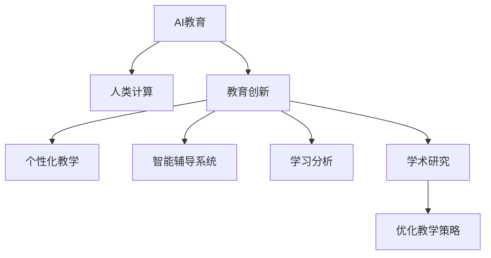

                 

# AI驱动的创新：人类计算在教育中的作用

> 关键词：AI教育、人类计算、教育创新、学习分析、个性化教学、智能辅导、学术研究

## 1. 背景介绍

### 1.1 问题由来
当前，全球范围内正面临着一场教育领域的变革。数字化技术的迅猛发展为教育带来了前所未有的机遇，同时也带来了巨大的挑战。传统教育模式逐渐被数字化教学系统所取代，在线教育平台如雨后春笋般涌现，教师和学生都面临着全新的教学和学习方式。然而，数字化教学系统依然存在诸多问题，如过度依赖技术、缺乏对学生认知的深度理解、个性化教学难以实现等。为了解决这些问题，AI技术正被引入教育领域，利用人类计算和AI的融合，创造更高效、更个性化、更具创新性的教学和学习体验。

### 1.2 问题核心关键点
AI教育的核心在于利用AI技术，结合人类对教育、学习过程的深刻理解，优化教学和学习过程。其核心关键点包括以下几个方面：

1. **数据驱动**：通过收集、分析大量的学习数据，洞察学生的学习行为和认知特点，为个性化教学提供依据。
2. **智能辅导**：利用AI算法设计智能教学系统，能够实时解答学生问题，提供个性化的学习建议。
3. **学习分析**：通过机器学习技术分析学习数据，发现学习者的学习模式和瓶颈，从而进行精准干预。
4. **教学优化**：利用AI对教师的教学行为进行分析，优化教学策略和资源配置，提升教学效果。
5. **教育研究**：利用AI技术进行学术研究，验证教育理念和策略的有效性，推动教育理论的发展。

这些关键点共同构成了AI教育的核心，旨在通过人类计算和AI的结合，创造更高效、更个性化、更具创新性的教学和学习体验。

### 1.3 问题研究意义
AI教育的研究和应用，对于提升教育质量、促进教育公平、加速教育创新具有重要意义：

1. **提升教育质量**：利用AI技术，能够实现个性化教学，提升学生的学习效果。
2. **促进教育公平**：AI教育系统可以在全球范围内推广，帮助资源匮乏地区的学生获得高质量的教育资源。
3. **加速教育创新**：AI技术为教育研究提供了新的工具和方法，推动教育理论的创新和发展。

## 2. 核心概念与联系

### 2.1 核心概念概述

为更好地理解AI在教育中的应用，本节将介绍几个关键概念及其联系：

- **AI教育（AI Education）**：利用AI技术优化教育过程，包括智能辅导、学习分析、教学优化等，旨在提高教育质量和效率。
- **人类计算（Human Computation）**：指利用人类对教育过程的深刻理解，结合AI技术进行教学设计和决策。
- **教育创新（Education Innovation）**：通过技术手段和新方法，创造新的教育模式和策略，提升教育体验和效果。
- **个性化教学（Personalized Learning）**：根据学生的学习特点和需求，提供定制化的教学内容和策略，满足不同学生的学习需求。
- **智能辅导系统（Intelligent Tutoring Systems）**：通过AI算法设计，能够实时解答学生问题，提供个性化的学习建议，辅助学生完成学习任务。
- **学习分析（Learning Analytics）**：通过分析学习数据，洞察学生的学习行为和认知特点，为个性化教学提供依据。
- **学术研究（Academic Research）**：利用AI技术进行学术研究，验证教育理念和策略的有效性，推动教育理论的发展。

这些核心概念之间的逻辑关系可以通过以下Mermaid流程图来展示：



这个流程图展示了几大核心概念及其之间的关系：

1. AI教育通过人类计算和AI技术的结合，推动教育创新。
2. 教育创新涵盖了个性化教学、智能辅导、学习分析等多个方面。
3. 学习分析通过数据驱动，为个性化教学和智能辅导提供依据。
4. 学术研究验证教育理念和策略的有效性，推动教育理论的发展。

这些概念共同构成了AI教育的应用框架，使得AI技术能够在教育领域发挥更大的作用。

## 3. 核心算法原理 & 具体操作步骤
### 3.1 算法原理概述

AI教育的核心算法原理基于数据驱动和智能决策，旨在通过分析学生数据，洞察学习行为和认知特点，提供个性化的教学建议和智能辅导。其主要算法包括：

- **机器学习算法**：利用大量学习数据，训练模型预测学生的学习效果和行为模式。
- **自然语言处理（NLP）**：分析学生的文本反馈，理解学生的学习状态和需求。
- **强化学习**：通过与学生的互动反馈，不断优化教学策略和资源配置。
- **推荐系统**：根据学生的学习历史和行为，推荐适合的学习内容和策略。

这些算法通过与人类对教育过程的深刻理解相结合，共同构成了AI教育的核心。

### 3.2 算法步骤详解

AI教育的实施一般包括以下几个关键步骤：

**Step 1: 数据收集与处理**
- 收集学生的基本信息、学习历史、行为数据、文本反馈等。
- 对数据进行清洗、去重、标准化处理，确保数据的准确性和一致性。

**Step 2: 模型训练与优化**
- 选择合适的算法模型，如决策树、随机森林、深度学习等，利用收集到的数据进行训练。
- 使用交叉验证等技术优化模型参数，提高模型的预测准确性和泛化能力。

**Step 3: 教学策略设计**
- 根据模型的预测结果，设计个性化的教学策略和资源配置。
- 结合教师的个人经验和教育理论，进行策略调整和优化。

**Step 4: 智能辅导与反馈**
- 利用AI算法设计智能辅导系统，实时解答学生问题，提供个性化的学习建议。
- 收集学生的反馈和互动数据，不断优化教学策略和资源配置。

**Step 5: 学习分析与评估**
- 通过机器学习算法分析学习数据，洞察学生的学习行为和认知特点。
- 利用评估指标（如学习效果、学习兴趣、学习进度等），评估教学策略的有效性，进行持续优化。

**Step 6: 教学反思与改进**
- 定期进行教学反思，分析教学过程中的成功和失败案例。
- 结合教育研究和学术反馈，进行教学策略的改进和优化。

### 3.3 算法优缺点

AI教育基于数据驱动和智能决策，具有以下优点：

1. **个性化教学**：能够根据学生的学习特点和需求，提供定制化的教学内容和策略，满足不同学生的学习需求。
2. **智能辅导**：通过AI算法设计，实时解答学生问题，提供个性化的学习建议，辅助学生完成学习任务。
3. **学习分析**：通过分析学习数据，洞察学生的学习行为和认知特点，为个性化教学提供依据。
4. **教学优化**：利用AI对教师的教学行为进行分析，优化教学策略和资源配置，提升教学效果。
5. **教育研究**：利用AI技术进行学术研究，验证教育理念和策略的有效性，推动教育理论的发展。

然而，AI教育也存在一些局限性：

1. **数据隐私和安全**：收集和分析学生数据需要严格遵守隐私保护政策，确保数据安全。
2. **模型复杂性**：机器学习模型较为复杂，需要大量的数据和计算资源进行训练和优化。
3. **技术依赖**：过度依赖技术可能导致教学过程中的人性化因素被忽视。
4. **算法偏见**：AI算法可能存在偏见，影响教学效果和公平性。
5. **学生自主性**：过度依赖智能系统可能削弱学生的自主学习和自我管理能力。

尽管存在这些局限性，但AI教育通过结合人类对教育过程的深刻理解，能够显著提升教育质量和效率，具有广阔的应用前景。

### 3.4 算法应用领域

AI教育在多个领域得到了广泛应用，包括但不限于以下几个方面：

- **在线教育平台**：利用AI技术优化在线课程设计，提供个性化的学习体验。
- **智能辅导系统**：开发智能辅导系统，实时解答学生问题，提供个性化的学习建议。
- **学习分析平台**：通过机器学习算法分析学习数据，洞察学生的学习行为和认知特点，为个性化教学提供依据。
- **虚拟实验室**：利用AI技术设计虚拟实验室，提供虚拟实验环境，支持学生自主探究和实验。
- **智能评估系统**：利用AI技术设计智能评估系统，自动批改作业和考试，提高评估效率。
- **学术研究工具**：利用AI技术进行学术研究，验证教育理念和策略的有效性，推动教育理论的发展。

这些应用领域展示了AI教育技术的强大潜力，为教育行业的数字化转型提供了有力支持。

## 4. 数学模型和公式 & 详细讲解 & 举例说明

### 4.1 数学模型构建

本节将使用数学语言对AI教育的模型构建过程进行更加严格的刻画。

假设一个学生 $S_i$ 的学习数据为 $D_i=\{x_i,y_i,z_i\}$，其中 $x_i$ 为学生的学习行为数据，$y_i$ 为学生的学习效果数据，$z_i$ 为学生的反馈数据。通过收集大量学生的学习数据 $D=\{D_i\}_{i=1}^N$，构建一个学习效果预测模型 $M$。

定义模型 $M$ 在学生 $S_i$ 的学习数据 $D_i$ 上的预测结果为 $\hat{y}_i=M(D_i)$。模型的损失函数为：

$$
\mathcal{L}(M) = \frac{1}{N}\sum_{i=1}^N \ell(M(D_i),y_i)
$$

其中 $\ell$ 为损失函数，如均方误差、交叉熵等。

### 4.2 公式推导过程

以下我们以二分类任务为例，推导分类模型的损失函数及其梯度的计算公式。

假设模型 $M$ 在输入 $x$ 上的输出为 $\hat{y}=M(x) \in [0,1]$，表示学生属于正类的概率。真实标签 $y \in \{0,1\}$。则二分类交叉熵损失函数定义为：

$$
\ell(M(x),y) = -[y\log \hat{y} + (1-y)\log (1-\hat{y})]
$$

将其代入经验风险公式，得：

$$
\mathcal{L}(M) = -\frac{1}{N}\sum_{i=1}^N [y_i\log M(D_i)+(1-y_i)\log(1-M(D_i))]
$$

根据链式法则，损失函数对模型参数 $\theta_k$ 的梯度为：

$$
\frac{\partial \mathcal{L}(M)}{\partial \theta_k} = -\frac{1}{N}\sum_{i=1}^N (\frac{y_i}{M(D_i)}-\frac{1-y_i}{1-M(D_i)}) \frac{\partial M(D_i)}{\partial \theta_k}
$$

其中 $\frac{\partial M(D_i)}{\partial \theta_k}$ 可进一步递归展开，利用自动微分技术完成计算。

### 4.3 案例分析与讲解

假设一个在线教育平台收集了大量学生的学习数据，每个学生记录了观看视频的时长、做题数量、得分等行为数据。平台利用这些数据，构建了一个学习效果预测模型，用于预测学生的学习效果。

具体而言，可以将学生 $S_i$ 的观看视频时长 $x_{i1}$、做题数量 $x_{i2}$、得分 $x_{i3}$ 作为输入特征，预测其最终成绩 $y_i$。构建一个线性回归模型：

$$
\hat{y}_i = \theta_0 + \sum_{k=1}^3 \theta_k x_{ik}
$$

其中 $\theta_0,\theta_k$ 为模型参数。利用二分类交叉熵损失函数进行训练：

$$
\mathcal{L}(M) = -\frac{1}{N}\sum_{i=1}^N [y_i\log \hat{y}_i+(1-y_i)\log(1-\hat{y}_i)]
$$

模型参数的更新公式为：

$$
\theta_k \leftarrow \theta_k - \eta \nabla_{\theta_k}\mathcal{L}(M) - \eta\lambda\theta_k
$$

其中 $\eta$ 为学习率，$\lambda$ 为正则化系数，用于防止过拟合。

在训练过程中，可以不断调整模型参数 $\theta_k$，最小化损失函数 $\mathcal{L}(M)$，使得模型输出逼近真实标签 $y_i$。完成训练后，平台可以利用该模型预测新学生的学习效果，根据预测结果提供个性化的学习建议和智能辅导。

## 5. 项目实践：代码实例和详细解释说明
### 5.1 开发环境搭建

在进行AI教育项目的开发前，我们需要准备好开发环境。以下是使用Python进行Scikit-learn开发的Python环境配置流程：

1. 安装Anaconda：从官网下载并安装Anaconda，用于创建独立的Python环境。

2. 创建并激活虚拟环境：
```bash
conda create -n pytorch-env python=3.8 
conda activate pytorch-env
```

3. 安装Scikit-learn：
```bash
conda install scikit-learn
```

4. 安装Pandas、NumPy等工具包：
```bash
pip install pandas numpy
```

5. 安装Jupyter Notebook：
```bash
pip install jupyter notebook
```

完成上述步骤后，即可在`pytorch-env`环境中开始AI教育项目的开发。

### 5.2 源代码详细实现

下面我们以学生学习效果预测为例，给出使用Scikit-learn进行训练的Python代码实现。

首先，定义训练数据集：

```python
import pandas as pd
from sklearn.model_selection import train_test_split

# 导入数据集
data = pd.read_csv('student_data.csv')

# 划分训练集和测试集
X = data[['观看视频时长', '做题数量', '得分']]
y = data['最终成绩']
X_train, X_test, y_train, y_test = train_test_split(X, y, test_size=0.2, random_state=42)
```

然后，定义训练和评估函数：

```python
from sklearn.linear_model import LinearRegression

# 定义模型
model = LinearRegression()

# 训练模型
model.fit(X_train, y_train)

# 评估模型
score = model.score(X_test, y_test)
print(f"模型准确率：{score:.2f}")
```

接着，进行模型训练和评估：

```python
# 训练模型
model.fit(X_train, y_train)

# 评估模型
score = model.score(X_test, y_test)
print(f"模型准确率：{score:.2f}")
```

### 5.3 代码解读与分析

让我们再详细解读一下关键代码的实现细节：

**学生数据集定义**：
- 使用pandas库读取CSV格式的学生学习数据。
- 从数据集中划分出特征（观看视频时长、做题数量、得分）和标签（最终成绩）。
- 使用train_test_split函数将数据集划分为训练集和测试集。

**模型定义与训练**：
- 使用Scikit-learn库中的LinearRegression类定义线性回归模型。
- 调用fit函数对模型进行训练，以训练集数据为输入。

**模型评估**：
- 使用score函数计算模型在测试集上的准确率，并输出结果。
- 如果模型性能不佳，可以进行参数调整，重新训练模型。

可以看到，Scikit-learn库提供了丰富的机器学习算法和工具，使得模型的构建和训练变得简洁高效。开发者可以将更多精力放在数据处理和模型优化上，而不必过多关注底层的实现细节。

当然，工业级的系统实现还需考虑更多因素，如模型保存和部署、超参数的自动搜索、更灵活的任务适配层等。但核心的AI教育过程基本与此类似。

## 6. 实际应用场景
### 6.1 智能辅导系统

智能辅导系统是AI教育的核心应用之一。传统的一对一辅导模式成本高昂，且效果有限。智能辅导系统通过AI技术，能够实现大规模、低成本、高效率的个性化辅导。

具体而言，智能辅导系统通过分析学生的学习数据，生成个性化的学习路径和建议。例如，在数学学习中，系统可以根据学生的错误题目，推荐相关的习题和讲解视频，帮助学生巩固知识。系统还可以实时解答学生的问题，提供个性化的学习建议，辅助学生完成学习任务。

### 6.2 学习分析平台

学习分析平台通过对学生的学习数据进行分析，洞察学生的学习行为和认知特点，为个性化教学提供依据。

例如，平台可以利用机器学习算法分析学生的学习数据，预测其学习效果。通过分析学生的学习进度、学习时间、学习效果等指标，平台可以发现学生的学习瓶颈，及时进行干预。例如，如果发现学生在某一知识点上得分较低，系统可以推荐相关的复习资料，并提供详细的学习指导。

### 6.3 在线教育平台

在线教育平台利用AI技术，优化在线课程设计，提供个性化的学习体验。

例如，平台可以根据学生的学习数据，推荐适合的学习资源。对于编程课程，系统可以根据学生的代码提交情况，推荐相关的编程视频和资料。对于语言学习，系统可以根据学生的词汇量、语法错误等，推荐相应的语言练习和资料。

### 6.4 未来应用展望

随着AI教育的不断发展，未来将会在更多领域得到应用，为教育行业带来变革性影响。

在智慧教室中，AI技术可以用于课堂监控、互动问答、作业批改等环节，提升课堂教学效果。智能学习助手可以通过智能语音识别、自然语言处理等技术，帮助学生解答疑问，提供学习建议。

在远程教育中，AI技术可以用于学生识别、情感分析、学习效果预测等环节，提升远程教学的互动性和个性化。智能考试系统可以利用AI技术，自动批改试卷，提供个性化的考试反馈，帮助学生及时调整学习策略。

在职业教育中，AI技术可以用于技能评估、学习路径推荐、技能提升等环节，帮助学生快速提升职业技能。智能实训系统可以通过虚拟现实技术，提供沉浸式的实训环境，支持学生自主探究和实践。

总之，AI技术将在教育领域的各个环节发挥重要作用，推动教育行业向更加智能化、个性化、高效化的方向发展。相信随着技术的不断进步，AI教育必将在教育行业中大放异彩，为人类教育事业带来新的生机和活力。

## 7. 工具和资源推荐
### 7.1 学习资源推荐

为了帮助开发者系统掌握AI教育理论基础和实践技巧，这里推荐一些优质的学习资源：

1. 《AI教育：基于数据驱动的个性化学习》系列博文：由教育专家撰写，深入浅出地介绍了AI教育的基本概念、应用场景和技术手段。

2. 《深度学习教育》课程：斯坦福大学开设的教育学课程，涵盖深度学习在教育领域的应用，包括智能辅导、学习分析等。

3. 《AI教育研究》书籍：详细介绍了AI技术在教育领域的应用，包括学习分析、个性化教学、智能辅导等。

4. HuggingFace官方文档：Transformer库的官方文档，提供了大量预训练语言模型和微调样例代码，是实践AI教育的必备资料。

5. CSCL（Computers in Secondary Classroom Learning）开放平台：提供丰富的AI教育资源，包括教学案例、学术论文等，助力教育技术的发展。

通过对这些资源的学习实践，相信你一定能够快速掌握AI教育的核心技术，并用于解决实际的教育问题。

### 7.2 开发工具推荐

高效的开发离不开优秀的工具支持。以下是几款用于AI教育开发的常用工具：

1. Python：开源的高级编程语言，易于学习，广泛应用于数据科学和机器学习领域。
2. Scikit-learn：基于Python的机器学习库，提供了丰富的机器学习算法和工具，适合快速迭代研究。
3. TensorFlow：由Google主导开发的深度学习框架，生产部署方便，适合大规模工程应用。
4. PyTorch：基于Python的开源深度学习框架，灵活动态的计算图，适合快速迭代研究。
5. Jupyter Notebook：开源的交互式笔记本环境，支持代码、文本、图像等多种格式，便于开发和分享。
6. Weights & Biases：模型训练的实验跟踪工具，可以记录和可视化模型训练过程中的各项指标，方便对比和调优。
7. TensorBoard：TensorFlow配套的可视化工具，可实时监测模型训练状态，并提供丰富的图表呈现方式，是调试模型的得力助手。

合理利用这些工具，可以显著提升AI教育任务的开发效率，加快创新迭代的步伐。

### 7.3 相关论文推荐

AI教育的研究源于学界的持续研究。以下是几篇奠基性的相关论文，推荐阅读：

1. AI教育技术综述（AI Education Technology Review）：总结了AI教育技术的研究现状和应用趋势。
2. 智能辅导系统研究（Intelligent Tutoring Systems Research）：介绍智能辅导系统的基本概念和设计原则。
3. 学习分析研究（Learning Analytics Research）：探讨了学习分析的潜在价值和应用领域。
4. 在线教育平台设计（Online Education Platform Design）：介绍了在线教育平台的设计思路和关键技术。
5. 教育数据挖掘（Educational Data Mining）：讨论了教育数据挖掘的基本概念和技术手段。

这些论文代表了大规模AI教育技术的发展脉络。通过学习这些前沿成果，可以帮助研究者把握学科前进方向，激发更多的创新灵感。

## 8. 总结：未来发展趋势与挑战

### 8.1 总结

本文对AI教育技术进行了全面系统的介绍。首先阐述了AI教育的研究背景和意义，明确了数据驱动、智能决策和个性化教学的核心思想。其次，从原理到实践，详细讲解了AI教育的数学模型和关键步骤，给出了AI教育任务开发的完整代码实例。同时，本文还广泛探讨了AI教育在智能辅导、学习分析、在线教育等各个领域的应用前景，展示了AI教育技术的强大潜力。

通过本文的系统梳理，可以看到，AI教育技术通过结合人类对教育过程的深刻理解，利用AI技术进行数据驱动和智能决策，显著提升了教育质量和效率，具有广阔的应用前景。

### 8.2 未来发展趋势

展望未来，AI教育技术将呈现以下几个发展趋势：

1. **深度学习技术的进步**：深度学习技术的不断进步，将推动AI教育技术在更加复杂的任务上取得突破。
2. **教育数据的丰富化**：随着物联网、大数据等技术的发展，教育数据将更加丰富，为AI教育技术提供了更多数据支持。
3. **个性化教育的普及**：AI教育技术将进一步推动个性化教育的普及，帮助学生实现更加个性化的学习体验。
4. **跨领域融合**：AI教育技术将与其他领域的技术进行更深入的融合，如AI、物联网、虚拟现实等，推动教育技术的创新发展。
5. **教育公平的实现**：AI教育技术将帮助实现教育公平，为资源匮乏地区的学生提供高质量的教育资源。
6. **智能评估和反馈的优化**：智能评估和反馈技术将不断优化，帮助学生及时了解学习效果，调整学习策略。

这些趋势凸显了AI教育技术的广阔前景。AI教育技术将在教育领域的各个环节发挥重要作用，推动教育行业向更加智能化、个性化、高效化的方向发展。

### 8.3 面临的挑战

尽管AI教育技术已经取得了瞩目成就，但在迈向更加智能化、普适化应用的过程中，它仍面临着诸多挑战：

1. **数据隐私和安全**：收集和分析学生数据需要严格遵守隐私保护政策，确保数据安全。
2. **算法偏见**：AI算法可能存在偏见，影响教学效果和公平性。
3. **技术依赖**：过度依赖技术可能导致教学过程中的人性化因素被忽视。
4. **学生自主性**：过度依赖智能系统可能削弱学生的自主学习和自我管理能力。
5. **技术成本**：AI教育技术的开发和部署需要大量的技术投入，成本较高。
6. **教育公平**：AI教育技术可能在一定程度上加剧教育不公平现象，需要进一步优化。

尽管存在这些挑战，但AI教育技术的潜力巨大，通过不断优化和改进，未来必将在教育领域发挥更大的作用。

### 8.4 研究展望

面对AI教育技术所面临的挑战，未来的研究需要在以下几个方面寻求新的突破：

1. **数据隐私保护**：开发隐私保护算法和技术，确保学生数据的安全和隐私。
2. **算法偏见纠正**：开发公平性算法和工具，减少AI算法中的偏见，提高教学效果和公平性。
3. **技术与人性结合**：平衡技术与人性的关系，确保教学过程中的人性化因素得到充分考虑。
4. **自主学习能力的培养**：通过智能辅导和个性化教学，培养学生的自主学习和自我管理能力。
5. **资源共享与协作**：建立教育资源的共享和协作机制，推动教育技术的普及和应用。
6. **教育公平的实现**：利用AI技术，缩小城乡、区域、群体的教育差距，实现教育公平。

这些研究方向的探索，必将引领AI教育技术迈向更高的台阶，为构建安全、可靠、可解释、可控的智能教育系统铺平道路。面向未来，AI教育技术还需要与其他人工智能技术进行更深入的融合，如知识表示、因果推理、强化学习等，多路径协同发力，共同推动教育技术的进步。只有勇于创新、敢于突破，才能不断拓展AI教育技术的边界，让智能技术更好地造福人类教育事业。

## 9. 附录：常见问题与解答

**Q1：AI教育是否适用于所有教育阶段？**

A: AI教育技术可以应用于所有教育阶段，从学前教育到高等教育。在学前教育中，AI技术可以用于智能早教、游戏化学习等环节。在基础教育中，AI技术可以用于个性化辅导、学习分析等环节。在高等教育中，AI技术可以用于课程设计、科研辅助等环节。

**Q2：AI教育如何处理语言和文化差异？**

A: AI教育技术可以通过数据驱动和智能决策，处理语言和文化差异。例如，在多语言教育中，可以利用机器翻译技术，将教材和教学资源翻译成多种语言。在跨文化教育中，可以利用情感分析技术，分析学生的情感和认知特点，设计适合的文化课程。

**Q3：AI教育是否会取代人类教师？**

A: AI教育技术可以辅助人类教师，提升教学效果。然而，教师在学生的情感关怀、人文素养、道德教育等方面的作用是不可替代的。AI教育技术可以解放教师的劳动强度，让他们专注于教学设计和个性化指导，从而提升教学质量。

**Q4：AI教育如何保护学生隐私？**

A: AI教育技术需要严格遵守数据隐私保护政策，确保学生数据的保密性和安全性。例如，在数据收集和处理过程中，可以采用匿名化和去标识化技术，减少数据泄露的风险。同时，需要建立完善的数据保护机制，确保数据的使用符合伦理和法律要求。

**Q5：AI教育是否适用于所有学科？**

A: AI教育技术可以应用于各种学科，包括数学、物理、化学、历史等。在自然科学领域，可以利用AI技术进行实验模拟和数据分析，提升教学效果。在人文社科领域，可以利用AI技术进行文本分析和情感分析，提高教学质量。

总之，AI教育技术将在教育领域的各个环节发挥重要作用，推动教育行业向更加智能化、个性化、高效化的方向发展。相信随着技术的不断进步，AI教育必将在教育行业中大放异彩，为人类教育事业带来新的生机和活力。

---

作者：禅与计算机程序设计艺术 / Zen and the Art of Computer Programming

