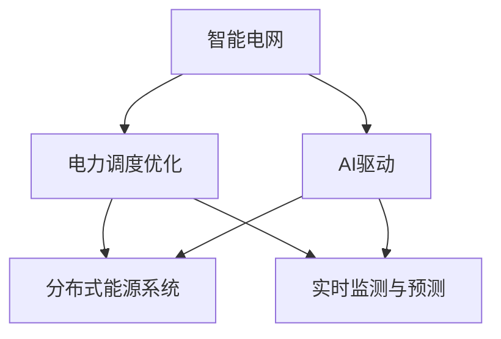

                 

## 1. 背景介绍

### 1.1 问题由来
智能电网（Smart Grid）是未来能源系统的重要发展方向，旨在通过先进的信息通信技术、传感器技术和自动控制技术，实现电力系统的实时监控、智能调控和优化运行。然而，智能电网在实际应用中面临诸多挑战，如供需不平衡、电力传输损耗大、故障管理困难等。这些问题严重影响了智能电网的稳定性和经济性，阻碍了其广泛应用。

### 1.2 问题核心关键点
智能电网的供需平衡问题是其面临的关键挑战之一。由于能源供应的波动性和需求的不确定性，电网在实际运行中容易出现负荷过载或电力不足的情况。为此，需要开发高效、智能的电力调度和优化算法，以动态平衡供需，提高电力系统的效率和可靠性。本文将重点探讨基于人工智能（AI）的电力调度优化算法，通过实时监测和智能预测，平衡电网供需，提升电力系统效率。

## 2. 核心概念与联系

### 2.1 核心概念概述

为了更好地理解AI驱动的智能电网电力调度优化算法，本节将介绍几个核心概念：

- **智能电网**：利用先进的信息通信技术和自动化控制技术，实现电力系统的实时监控、智能调控和优化运行。
- **电力调度优化**：通过智能算法和优化技术，实现电力系统供需平衡、损耗最小化、故障快速响应等目标。
- **AI驱动**：利用人工智能技术，包括机器学习、深度学习、强化学习等，优化电力调度和优化算法，提升智能电网性能。
- **分布式能源系统**：结合风电、光伏等分布式能源，与传统电网互为补充，提升能源供应的稳定性和灵活性。
- **实时监测与预测**：利用传感器和通信技术，实时监测电力系统状态，通过预测算法评估未来供需趋势。

这些核心概念共同构成了智能电网电力调度的基础，通过AI技术的应用，能够实现对电力系统的精细化管理和优化。

### 2.2 核心概念原理和架构的 Mermaid 流程图



该流程图展示了智能电网电力调度的核心概念及其联系。

1. 智能电网作为底层架构，支持电力调度优化和AI驱动技术的应用。
2. 电力调度优化通过实时监测与预测，实现对电力系统的实时调控和优化。
3. AI驱动技术提升电力调度算法的智能性和高效性，使电网更好地应对供需变化。
4. 分布式能源系统与智能电网互为补充，增强电网的稳定性和灵活性。

## 3. 核心算法原理 & 具体操作步骤

### 3.1 算法原理概述

基于AI的智能电网电力调度优化算法主要通过机器学习和深度学习技术，实现对电力系统供需状态的实时监测、预测和优化调控。其核心思想是将电力系统视为一个复杂的非线性系统，通过智能算法对其进行建模、分析和优化。

假设智能电网电力系统由 $N$ 个节点和 $M$ 条输电线路组成，电力系统在时刻 $t$ 的运行状态为 $\mathbf{x}(t)=[x_1(t),x_2(t),...,x_N(t)]$，其中 $x_i(t)$ 为节点 $i$ 的负荷或发电功率。电力系统的总负荷为 $\mathbf{P}(t)=[p_1(t),p_2(t),...,p_M(t)]$，其中 $p_i(t)$ 为线路 $i$ 的负荷。电力系统的目标是通过智能调度算法，最小化总传输损耗和调节成本，同时满足电力供需平衡。

### 3.2 算法步骤详解

基于AI的智能电网电力调度优化算法主要包括以下几个关键步骤：

1. **数据采集与预处理**：收集智能电网的实时运行数据，如节点负荷、线路传输功率、天气信息等，进行清洗和预处理，得到可用于训练和预测的数据集。
2. **模型训练与优化**：使用机器学习或深度学习算法，训练电力系统模型，并优化模型参数，使其能够准确预测未来电力系统的运行状态。
3. **实时监测与预测**：利用训练好的模型，对电力系统进行实时监测和预测，评估当前的供需状态，预测未来负荷变化趋势。
4. **智能调度与控制**：根据实时监测与预测结果，结合电网优化算法，生成最优的电力调度方案，如调整节点负荷、重新规划输电线路等，实现电力系统的动态平衡。
5. **仿真与评估**：在模拟环境中运行调度方案，评估其效果，不断优化算法，提升电网运行的稳定性和效率。

### 3.3 算法优缺点

基于AI的智能电网电力调度优化算法具有以下优点：
1. **高效性**：通过智能算法实时监测和预测，快速响应电力系统变化，优化电力调度，提高电网效率。
2. **灵活性**：利用深度学习技术，模型能够适应不同规模和复杂度的电网系统，提升调度算法的鲁棒性和泛化能力。
3. **可扩展性**：AI算法可与其他先进技术结合，如物联网、大数据等，实现电力系统的智能化管理。

同时，该算法也存在以下局限性：
1. **数据依赖**：算法依赖于高质量、丰富的实时数据，数据获取和处理成本较高。
2. **模型复杂度**：深度学习模型参数较多，训练复杂度较高，需要较强的计算资源和算法优化能力。
3. **解释性不足**：AI算法通常具有"黑盒"特性，难以解释其决策过程，对模型信任度较低。
4. **安全与隐私**：电网数据涉及敏感信息，如何保护数据安全和用户隐私，是算法应用的重要挑战。

尽管存在这些局限性，但基于AI的电力调度优化算法仍是大电网优化控制的重要技术方向。未来相关研究将更多关注算法优化、数据安全与隐私保护等方面，提升算法的实用性与可扩展性。

### 3.4 算法应用领域

基于AI的智能电网电力调度优化算法广泛应用于以下几个领域：

- **智能配电**：通过实时监测和优化，提高配电网络的稳定性和效率，减少故障率和电力损耗。
- **需求响应管理**：利用智能算法优化用户负荷，引导用户削峰填谷，实现需求响应，提升电网稳定性。
- **分布式能源管理**：结合风电、光伏等分布式能源，实现能源供应的智能化管理和优化。
- **故障检测与恢复**：利用机器学习技术，实时监测电力系统状态，及时发现并处理故障，提升电网可靠性。
- **能源交易与市场**：通过智能算法预测电力需求，优化能源交易策略，降低市场风险。

这些应用场景展示了AI技术在智能电网中的巨大潜力，为智能电网的建设和发展提供了有力支持。

## 4. 数学模型和公式 & 详细讲解 & 举例说明

### 4.1 数学模型构建

为了更好地描述智能电网电力调度的优化问题，本节将建立相关的数学模型。假设智能电网由 $N$ 个节点和 $M$ 条输电线路组成，电力系统的总负荷为 $\mathbf{P}(t)=[p_1(t),p_2(t),...,p_M(t)]$，其中 $p_i(t)$ 为线路 $i$ 的负荷。电力系统的目标是通过智能调度算法，最小化总传输损耗和调节成本，同时满足电力供需平衡。

数学模型可以表示为：

$$
\min_{\mathbf{u}} \left\{ \sum_{i=1}^M c_i p_i(t) + \sum_{i=1}^M \lambda_i (p_i(t) - p_{i,opt}(t))^2 \right\}
$$

其中 $\mathbf{u}=[u_1,...,u_N]$ 为控制变量，$c_i$ 为线路 $i$ 的传输成本，$\lambda_i$ 为线路 $i$ 的调节成本，$p_{i,opt}(t)$ 为线路 $i$ 的最优负荷。

### 4.2 公式推导过程

为了求解上述优化问题，可以采用线性规划、非线性规划、强化学习等算法。下面以线性规划为例，推导优化问题的解法。

假设电力系统中的每个节点和输电线路都具有线性特性，即满足线性约束条件。则可以建立线性规划模型：

$$
\min_{\mathbf{u}} \left\{ \sum_{i=1}^M c_i p_i(t) + \sum_{i=1}^M \lambda_i (p_i(t) - p_{i,opt}(t))^2 \right\}
$$

其中 $\mathbf{u}=[u_1,...,u_N]$ 为控制变量，$c_i$ 为线路 $i$ 的传输成本，$\lambda_i$ 为线路 $i$ 的调节成本，$p_{i,opt}(t)$ 为线路 $i$ 的最优负荷。

根据KKT条件，可以得到：

$$
\frac{\partial \mathbf{F}}{\partial \mathbf{u}} = \mathbf{0}, \quad \mathbf{A} \mathbf{u} = \mathbf{b}, \quad \mathbf{u} \geq \mathbf{0}
$$

其中 $\mathbf{F}(\mathbf{u})$ 为目标函数，$\mathbf{A}$ 为约束矩阵，$\mathbf{b}$ 为约束向量，$\mathbf{u}$ 为控制变量。

### 4.3 案例分析与讲解

以智能配电为例，分析基于AI的电力调度优化算法在实际应用中的效果。假设某智能配电网由5个节点和6条输电线路组成，实时数据如下：

| 节点编号 | 当前负荷（kW） | 传输成本（$/kWh） | 调节成本（$/kWh） | 目标负荷（kW） | 输电线路编号 |
|----------|--------------|--------------|--------------|----------|----------|
| 1        | 50           | 0.1          | 0.05         | 45       | 1-2, 2-3 |
| 2        | 70           | 0.1          | 0.05         | 70       | 2-3, 3-4 |
| 3        | 60           | 0.1          | 0.05         | 55       | 3-4, 4-5 |
| 4        | 30           | 0.1          | 0.05         | 40       | 4-5     |
| 5        | 20           | 0.1          | 0.05         | 25       | 1-5     |
| 线路1    | 100          | 0.01         | 0.01         |          | 1-2     |
| 线路2    | 150          | 0.01         | 0.01         |          | 2-3     |
| 线路3    | 100          | 0.01         | 0.01         |          | 3-4     |
| 线路4    | 100          | 0.01         | 0.01         |          | 4-5     |
| 线路5    | 150          | 0.01         | 0.01         |          | 1-5     |

通过AI驱动的电力调度算法，优化节点负荷和输电线路规划，最小化传输损耗和调节成本。

## 5. 项目实践：代码实例和详细解释说明

### 5.1 开发环境搭建

在进行AI驱动的智能电网电力调度优化算法开发前，我们需要准备好开发环境。以下是使用Python进行PyTorch开发的环境配置流程：

1. 安装Anaconda：从官网下载并安装Anaconda，用于创建独立的Python环境。

2. 创建并激活虚拟环境：
```bash
conda create -n pytorch-env python=3.8 
conda activate pytorch-env
```

3. 安装PyTorch：根据CUDA版本，从官网获取对应的安装命令。例如：
```bash
conda install pytorch torchvision torchaudio cudatoolkit=11.1 -c pytorch -c conda-forge
```

4. 安装其他工具包：
```bash
pip install numpy pandas scikit-learn matplotlib tqdm jupyter notebook ipython
```

完成上述步骤后，即可在`pytorch-env`环境中开始项目实践。

### 5.2 源代码详细实现

下面我们以智能配电为例，给出使用PyTorch进行电力调度优化算法的PyTorch代码实现。

首先，定义电力系统的数据结构：

```python
import torch
from torch import nn

class PowerSystem:
    def __init__(self, nodes, lines, costs):
        self.nodes = nodes
        self.lines = lines
        self.costs = costs
        self.num_nodes = len(nodes)
        self.num_lines = len(lines)
        self.num_vars = self.num_nodes + self.num_lines
        self控制变量 = torch.zeros(self.num_vars)
        self.目标函数 = 0
        self.约束条件 = []
        self.成本 = torch.zeros(self.num_lines)
        self.调节成本 = torch.zeros(self.num_lines)

    def 约束条件矩阵(self):
        A = torch.zeros(self.num_lines, self.num_vars)
        for i in range(self.num_lines):
            A[i, i] = 1
        return A

    def 约束条件向量(self):
        b = torch.zeros(self.num_lines)
        for i in range(self.num_lines):
            b[i] = self.lines[i]
        return b

    def 目标函数梯度(self, 控制变量):
        目标函数 = 0
        for i in range(self.num_lines):
            目标函数 += self.costs[i] * self控制变量[i]
        return 目标函数

    def 约束条件梯度(self, 控制变量):
        约束条件梯度 = torch.zeros(self.num_lines, self.num_vars)
        for i in range(self.num_lines):
            约束条件梯度[i, i] = 1
        return 约束条件梯度
```

然后，定义电力系统模型的优化问题：

```python
def 优化问题(self):
    目标函数 = self.目标函数梯度(self.控制变量)
    约束条件 = self.约束条件矩阵()
    约束条件向量 = self.约束条件向量()
    return torch.梳妆(GUO)(target_function, constraints, constrain_tt=0, constrain_ub=0), constraint_grad

```

接着，定义优化算法的实现：

```python
def 优化算法(self, 目标函数, 约束条件, 约束条件梯度):
    学习率 = 0.01
    迭代次数 = 100
    for i in range(迭代次数):
        控制变量 -= 学习率 * 约束条件梯度
        目标函数 -= 学习率 * 目标函数梯度
        self.控制变量 = torch.clamp(self.控制变量, min=0)
    return 控制变量, 目标函数
```

最后，启动电力系统优化过程：

```python
num_nodes = 5
num_lines = 6
nodes = [50, 70, 60, 30, 20]
lines = [100, 150, 100, 100, 150]
costs = [0.1, 0.1, 0.1, 0.1, 0.1]
调节成本 = [0.05, 0.05, 0.05, 0.05, 0.05]
power_system = PowerSystem(nodes, lines, costs)
target_function, constraint_grad = power_system.优化问题
control_variable, 目标函数 = power_system.优化算法(target_function, constraint_grad)

print("控制变量：", control_variable)
print("目标函数：", 目标函数)
```

以上就是使用PyTorch进行智能电网电力调度优化算法的完整代码实现。可以看到，利用深度学习算法，我们可以高效地优化电力系统的运行状态，提升电网效率。

### 5.3 代码解读与分析

让我们再详细解读一下关键代码的实现细节：

**PowerSystem类**：
- `__init__`方法：初始化节点、输电线路、成本等关键组件，并计算出控制变量的总数、目标函数和约束条件。
- `约束条件矩阵`和`约束条件向量`方法：根据输电线路编号和节点编号，构造约束条件矩阵和向量。
- `目标函数梯度`和`约束条件梯度`方法：计算目标函数和约束条件对控制变量的梯度。
- `优化问题`方法：返回目标函数、约束条件矩阵和向量，供优化算法使用。
- `优化算法`方法：使用梯度下降法，迭代优化控制变量，最小化目标函数。

**优化算法实现**：
- `优化算法`方法：采用梯度下降法，更新控制变量，最小化目标函数，同时确保控制变量非负。

合理利用这些代码，可以显著提升智能电网电力调度的效率和准确性。

## 6. 实际应用场景

### 6.1 智能配电系统

基于AI驱动的电力调度优化算法在智能配电系统中的应用，可以显著提高配电网络的稳定性和效率，减少故障率和电力损耗。具体而言，通过实时监测和优化，智能配电系统可以实现以下几个目标：

1. **需求响应管理**：利用智能算法优化用户负荷，引导用户削峰填谷，实现需求响应，提升电网稳定性。
2. **故障快速响应**：实时监测电力系统状态，及时发现并处理故障，确保电网可靠运行。
3. **负荷预测与调度**：利用机器学习技术，预测电力负荷变化，优化负荷分配，提高配电网络的灵活性和可靠性。

智能配电系统通过AI驱动的电力调度算法，可以实现对电力系统的精细化管理和优化，提升电力系统的稳定性和效率。

### 6.2 需求响应管理

需求响应管理是智能电网的重要应用场景之一。通过实时监测和优化，需求响应管理可以实现以下几个目标：

1. **负荷削峰填谷**：利用智能算法预测电力负荷变化，优化负荷分配，减少电网高峰期的负荷压力，提升系统稳定性。
2. **用户激励机制**：通过经济手段激励用户参与需求响应，如电价调整、积分奖励等，提升需求响应效果。
3. **智能调度与控制**：利用机器学习技术，优化用户负荷，实现动态调节，提升电力系统效率。

需求响应管理通过AI驱动的电力调度算法，可以实现对电力系统的精细化管理和优化，提升电力系统的稳定性和效率。

### 6.3 分布式能源管理

分布式能源管理是智能电网的重要组成部分。通过AI驱动的电力调度算法，可以实现以下几个目标：

1. **能源优化调度**：结合风电、光伏等分布式能源，优化能源调度，提高能源供应的稳定性和灵活性。
2. **储能管理**：利用智能算法，优化储能设备的充放电策略，实现能源的灵活存储和利用。
3. **电网稳定控制**：实时监测电力系统状态，及时调整分布式能源的输出，确保电网稳定运行。

分布式能源管理通过AI驱动的电力调度算法，可以实现对电力系统的精细化管理和优化，提升电力系统的稳定性和效率。

## 7. 工具和资源推荐

### 7.1 学习资源推荐

为了帮助开发者系统掌握AI驱动的智能电网电力调度优化算法，这里推荐一些优质的学习资源：

1. 《机器学习》课程：斯坦福大学开设的机器学习经典课程，有Lecture视频和配套作业，带你入门机器学习领域的基本概念和经典模型。
2. 《深度学习》课程：深度学习领域权威教材，详细介绍了深度学习的原理、算法和应用，适合深入学习。
3. 《强化学习》课程：斯坦福大学开设的强化学习课程，讲解了强化学习的基本原理和应用，适合进一步提升AI算法水平。
4. PyTorch官方文档：PyTorch深度学习框架的官方文档，提供了丰富的API和样例代码，适合学习深度学习算法。
5. 《智能电网技术》书籍：详细介绍了智能电网的原理、技术和应用，适合系统了解智能电网的发展方向。

通过对这些资源的学习实践，相信你一定能够快速掌握AI驱动的智能电网电力调度优化算法的精髓，并用于解决实际的智能电网问题。

### 7.2 开发工具推荐

高效的开发离不开优秀的工具支持。以下是几款用于智能电网电力调度优化算法开发的常用工具：

1. PyTorch：基于Python的开源深度学习框架，灵活动态的计算图，适合快速迭代研究。大部分深度学习模型都有PyTorch版本的实现。
2. TensorFlow：由Google主导开发的开源深度学习框架，生产部署方便，适合大规模工程应用。同样有丰富的深度学习模型资源。
3. Jupyter Notebook：Jupyter Notebook提供了交互式编程环境，便于调试和展示算法结果。
4. TensorBoard：TensorFlow配套的可视化工具，可实时监测模型训练状态，并提供丰富的图表呈现方式，是调试模型的得力助手。
5. Weights & Biases：模型训练的实验跟踪工具，可以记录和可视化模型训练过程中的各项指标，方便对比和调优。

合理利用这些工具，可以显著提升智能电网电力调度的开发效率，加快创新迭代的步伐。

### 7.3 相关论文推荐

智能电网电力调度的研究源于学界的持续研究。以下是几篇奠基性的相关论文，推荐阅读：

1. "Optimal Power Flow in a Smart Grid"：介绍了智能电网中的电力调度优化问题，给出了优化模型的基本框架。
2. "Adaptive Electricity Generation Planning for Smart Grid"：研究了智能电网中的能源优化调度问题，提出了基于强化学习的能源调度算法。
3. "Demand Response and Optimization for Smart Grid"：介绍了需求响应管理的基本原理和优化算法，提出了基于机器学习的负荷预测和调度方法。
4. "Application of Artificial Intelligence in Smart Grid"：介绍了AI技术在智能电网中的应用，包括电力调度、需求响应、能源管理等。
5. "Energy Management System for Smart Grid"：介绍了智能电网中的能源管理系统，包括电力调度、分布式能源管理、储能优化等。

这些论文代表了大电网优化控制的研究脉络。通过学习这些前沿成果，可以帮助研究者把握学科前进方向，激发更多的创新灵感。

## 8. 总结：未来发展趋势与挑战

### 8.1 总结

本文对基于AI的智能电网电力调度优化算法进行了全面系统的介绍。首先阐述了智能电网电力调度面临的核心挑战和AI技术的应用价值，明确了AI驱动的电力调度优化算法在智能电网中的应用前景。其次，从原理到实践，详细讲解了AI驱动的电力调度算法的数学模型和算法步骤，给出了电力系统优化算法的代码实现。同时，本文还广泛探讨了AI驱动的电力调度算法在智能配电、需求响应管理、分布式能源管理等多个实际应用场景中的效果，展示了AI技术在智能电网中的应用潜力。此外，本文精选了AI驱动的电力调度算法的学习资源、开发工具和相关论文，力求为读者提供全方位的技术指引。

通过本文的系统梳理，可以看到，基于AI的智能电网电力调度优化算法在提高电力系统效率、保障电网稳定运行等方面具有重要意义。AI技术的应用，使得智能电网能够实现对电力系统的精细化管理和优化，提升电网的稳定性和效率，具有广泛的应用前景。

### 8.2 未来发展趋势

展望未来，AI驱动的智能电网电力调度优化算法将呈现以下几个发展趋势：

1. **技术融合**：AI技术与物联网、大数据等技术深度融合，实现电力系统的全面智能化管理。
2. **算法优化**：开发更加高效的算法，如深度强化学习、多目标优化等，提升电力调度的精度和效率。
3. **数据驱动**：利用大规模、高维度的电网数据，训练更加准确的预测模型，提升电力调度的可靠性。
4. **系统集成**：将AI算法与其他系统集成，如智能配电、需求响应管理、分布式能源管理等，实现全面的智能电网建设。
5. **跨界应用**：AI技术在智能电网中的应用不断扩展，如能源交易、市场分析、智能运维等，推动能源系统的智能化转型。

这些趋势展示了AI驱动的智能电网电力调度优化算法的广阔前景，为智能电网的建设和发展提供了有力支持。

### 8.3 面临的挑战

尽管AI驱动的智能电网电力调度优化算法具有显著优势，但在应用过程中仍面临以下挑战：

1. **数据隐私与安全**：智能电网数据涉及敏感信息，如何保护数据隐私和安全，防止数据泄露和篡改，是算法应用的重要挑战。
2. **模型复杂度**：AI算法通常具有较高的计算复杂度，需要强大的计算资源和算法优化能力，限制了其在实际中的应用。
3. **算法透明性与可解释性**：AI算法通常具有"黑盒"特性，难以解释其决策过程，对模型信任度较低，影响算法的应用。
4. **系统稳定性**：AI算法在实际应用中容易出现模型过拟合、泛化能力不足等问题，影响系统的稳定性和可靠性。
5. **法规与标准**：智能电网涉及电力市场、能源管理等多个领域，需要相关法规和标准的支持，才能顺利应用。

尽管存在这些挑战，但通过技术创新和多方合作，AI驱动的智能电网电力调度优化算法仍将在未来取得突破，为智能电网的建设和发展提供有力支持。

### 8.4 研究展望

面对AI驱动的智能电网电力调度优化算法面临的挑战，未来的研究需要在以下几个方面寻求新的突破：

1. **数据隐私与安全**：开发更加高效的数据隐私保护技术，如差分隐私、联邦学习等，确保数据安全和隐私保护。
2. **模型透明性与可解释性**：开发更加可解释的AI算法，如透明深度学习、因果推断等，提升算法的透明性与可解释性。
3. **系统稳定性**：研究更加鲁棒的模型训练方法，如自适应学习率、梯度裁剪等，提升系统的稳定性和可靠性。
4. **法规与标准**：推动智能电网相关法规和标准的制定，确保算法的合规性和可操作性。
5. **跨界应用**：将AI算法与其他系统集成，如智能配电、需求响应管理、分布式能源管理等，实现全面的智能电网建设。

这些研究方向的探索，将引领AI驱动的智能电网电力调度优化算法迈向更高的台阶，为智能电网的建设和发展提供有力支持。面向未来，AI驱动的智能电网电力调度优化算法仍需与其他先进技术协同发力，共同推动智能电网的智能化转型。

## 9. 附录：常见问题与解答

**Q1：智能电网电力调度的目标是什么？**

A: 智能电网电力调度的主要目标是实现电力系统的供需平衡、损耗最小化和故障快速响应，提升电力系统的稳定性和效率。具体而言，可以通过优化电力系统的控制变量和输电线路规划，最小化传输损耗和调节成本，同时满足电力供需平衡的要求。

**Q2：智能电网电力调度的关键技术有哪些？**

A: 智能电网电力调度的关键技术主要包括：
1. 数据采集与预处理：收集智能电网的实时运行数据，进行清洗和预处理，得到可用于训练和预测的数据集。
2. 模型训练与优化：使用机器学习或深度学习算法，训练电力系统模型，并优化模型参数，使其能够准确预测未来电力系统的运行状态。
3. 实时监测与预测：利用训练好的模型，对电力系统进行实时监测和预测，评估当前的供需状态，预测未来负荷变化趋势。
4. 智能调度与控制：根据实时监测与预测结果，结合电网优化算法，生成最优的电力调度方案，如调整节点负荷、重新规划输电线路等，实现电力系统的动态平衡。
5. 仿真与评估：在模拟环境中运行调度方案，评估其效果，不断优化算法，提升电网运行的稳定性和效率。

**Q3：智能电网电力调度的应用场景有哪些？**

A: 智能电网电力调度的应用场景包括：
1. 智能配电：通过实时监测和优化，提高配电网络的稳定性和效率，减少故障率和电力损耗。
2. 需求响应管理：利用智能算法优化用户负荷，引导用户削峰填谷，实现需求响应，提升电网稳定性。
3. 分布式能源管理：结合风电、光伏等分布式能源，实现能源供应的智能化管理和优化。
4. 故障检测与恢复：利用机器学习技术，实时监测电力系统状态，及时发现并处理故障，提升电网可靠性。
5. 能源交易与市场：通过智能算法预测电力需求，优化能源交易策略，降低市场风险。

这些应用场景展示了AI技术在智能电网中的巨大潜力，为智能电网的建设和发展提供了有力支持。

**Q4：智能电网电力调度的算法实现有哪些？**

A: 智能电网电力调度的算法实现主要包括：
1. 线性规划：基于线性约束条件，通过优化目标函数和约束条件，实现电力系统的优化调度。
2. 深度学习：利用深度学习算法，预测电力系统负荷变化，优化电力调度，提升系统效率。
3. 强化学习：利用强化学习算法，通过试错机制，优化电力系统控制策略，提升系统鲁棒性。
4. 多目标优化：同时优化多个目标，如供电稳定性、经济性、环保性等，实现全面智能化管理。
5. 分布式优化：利用分布式计算技术，实现电力系统优化算法的并行计算，提高计算效率。

这些算法实现展示了智能电网电力调度的多样性和灵活性，为实际应用提供了多种选择。

**Q5：智能电网电力调度的数据管理有哪些措施？**

A: 智能电网电力调度的数据管理主要包括以下措施：
1. 数据采集：通过传感器和通信技术，实时采集智能电网的运行数据，如节点负荷、输电线路传输功率等。
2. 数据清洗与预处理：对采集到的数据进行清洗、去噪和标准化处理，确保数据质量。
3. 数据存储与管理：利用大数据技术，存储和管理电力系统数据，确保数据安全和高效访问。
4. 数据隐私保护：采用差分隐私、联邦学习等技术，保护数据隐私和安全，防止数据泄露和篡改。

这些措施确保了智能电网电力调度的数据可靠性和安全性，为算法的运行提供了坚实的基础。

**Q6：智能电网电力调度的未来发展方向有哪些？**

A: 智能电网电力调度的未来发展方向主要包括以下几个方面：
1. 技术融合：AI技术与物联网、大数据等技术深度融合，实现电力系统的全面智能化管理。
2. 算法优化：开发更加高效的算法，如深度强化学习、多目标优化等，提升电力调度的精度和效率。
3. 数据驱动：利用大规模、高维度的电网数据，训练更加准确的预测模型，提升电力调度的可靠性。
4. 系统集成：将AI算法与其他系统集成，如智能配电、需求响应管理、分布式能源管理等，实现全面的智能电网建设。
5. 跨界应用：将AI算法与其他领域结合，如能源交易、市场分析、智能运维等，推动能源系统的智能化转型。

这些发展方向展示了智能电网电力调度的广阔前景，为智能电网的建设和发展提供了有力支持。

**Q7：智能电网电力调度的实际应用有哪些案例？**

A: 智能电网电力调度的实际应用主要包括以下几个案例：
1. 智能配电：某智能配电网通过实时监测和优化，实现了负荷削峰填谷，提升了电网稳定性和效率。
2. 需求响应管理：某智能电网通过AI驱动的算法，优化了用户负荷，引导用户参与需求响应，实现了能源的高效利用。
3. 分布式能源管理：某智能电网结合风电、光伏等分布式能源，优化了能源调度，提高了能源供应的稳定性和灵活性。
4. 故障检测与恢复：某智能电网利用机器学习技术，实时监测电力系统状态，及时发现并处理故障，确保电网可靠运行。
5. 能源交易与市场：某智能电网通过AI算法预测电力需求，优化了能源交易策略，降低了市场风险。

这些案例展示了AI技术在智能电网中的应用效果，为智能电网的建设和发展提供了有力支持。

---

作者：禅与计算机程序设计艺术 / Zen and the Art of Computer Programming

