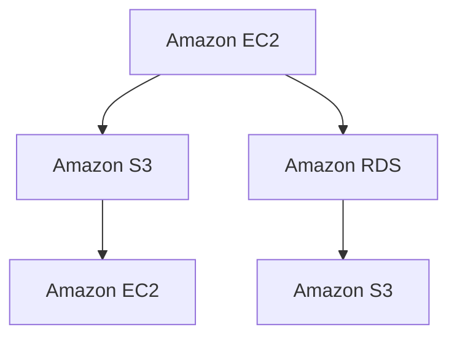

                 

# AWS 云服务：EC2、S3 和 RDS

## 1. 背景介绍

随着云计算技术的快速发展，亚马逊网络服务(Amazon Web Services, AWS)已经成为全球领先的企业级云计算平台。AWS 提供了丰富的云服务产品，其中亚马逊弹性计算云(Amazon Elastic Compute Cloud, EC2)、亚马逊简单存储服务(Amazon Simple Storage Service, S3)、亚马逊关系型数据库服务(Amazon Relational Database Service, RDS)等云服务产品，被广泛应用在各类企业应用和项目开发中。

EC2、S3、RDS 是 AWS 云服务中最为基础和重要的组件之一，它们支撑着企业数据和应用程序的稳定运行。在实际项目开发中，合理地利用这些云服务，对于提升应用系统的性能和可靠性至关重要。

## 2. 核心概念与联系

### 2.1 核心概念概述

本节将介绍 EC2、S3 和 RDS 这三个核心云服务的基本概念和它们之间的联系：

- **EC2 (Amazon EC2)**：是 AWS 提供的弹性计算服务，允许用户按需租用虚拟机(Virtual Machine, VM)，用户可以根据实际需要动态调整计算资源，灵活应对不同业务场景下的计算需求。

- **S3 (Amazon S3)**：是 AWS 提供的高性能、可扩展的云存储服务，能够存储海量数据，并具备高可用性、高持久性、高安全性的特点，适用于各种数据存储需求。

- **RDS (Amazon RDS)**：是 AWS 提供的关系型数据库服务，支持多种数据库引擎，如 MySQL、PostgreSQL、Oracle 等，帮助用户轻松构建、维护和管理数据库。

这三个服务各自独立，但又紧密关联，共同构成了 AWS 云服务的核心基础设施。通过合理组合和配置这三个服务，用户可以构建出高效、可靠、安全的应用系统。

### 2.2 核心概念原理和架构的 Mermaid 流程图

以下是一个 Mermaid 流程图，展示了 EC2、S3 和 RDS 之间的联系和数据流动路径：



这个图展示了三个服务的基本流程：

- 用户可以通过 EC2 租用虚拟机，在虚拟机上安装和运行应用程序。
- EC2 上的应用程序可以将数据存储到 S3 中，S3 提供高可靠性和持久性保障。
- 应用程序也可以连接 RDS 中的数据库，使用其中的数据。

## 3. 核心算法原理 & 具体操作步骤

### 3.1 算法原理概述

EC2、S3 和 RDS 的底层原理分别涉及不同的技术领域，但它们都基于云计算架构的设计理念，即“按需使用、按量计费”的商业模式。这种模式使得企业能够灵活地使用云服务，避免因固定资源而产生的浪费和成本压力。

#### EC2 原理

EC2 的核心算法原理是虚拟化和弹性计算。通过虚拟化技术，AWS 将物理硬件资源划分为多个虚拟实例，每个实例都提供独立的操作系统和应用程序环境。用户可以按需租用这些虚拟机，根据业务需求动态调整资源，以达到成本最优的计算能力。

#### S3 原理

S3 采用分布式存储架构，将数据分布在多个物理节点上，通过冗余存储和跨地域复制，保障数据的持久性和高可用性。S3 的核心算法原理是块存储和数据传输优化，通过使用块存储技术，S3 能够高效地存储和检索数据，并使用压缩和数据传输协议优化网络传输性能。

#### RDS 原理

RDS 的核心算法原理是关系型数据库管理系统的优化。RDS 利用 AWS 的高可用性和冗余存储特性，提供了多副本数据库实例，确保数据库的高可用性和容灾能力。RDS 还通过优化查询语句和数据库索引，提升数据库的性能和可靠性。

### 3.2 算法步骤详解

#### EC2 操作步骤

1. **创建 EC2 实例**：登录 AWS 管理控制台，进入 EC2 服务，点击“创建实例”按钮，选择合适的实例类型、操作系统、安全组等参数，点击“启动”按钮创建实例。

2. **配置网络和安全组**：在实例创建时，配置实例的安全组，允许特定的 IP 地址或端口访问实例。

3. **安装应用程序**：远程连接到 EC2 实例，安装应用程序和依赖包，设置系统环境变量，启动应用程序。

4. **配置数据存储**：根据业务需求，配置 EC2 实例的存储类型和大小，安装和配置数据库、缓存等数据存储系统。

#### S3 操作步骤

1. **创建 S3 存储桶**：在 AWS 管理控制台中，进入 S3 服务，点击“创建存储桶”按钮，设置存储桶名称、区域、访问权限等参数，创建存储桶。

2. **上传文件到 S3**：使用 AWS CLI、S3 SDK 或 AWS 管理控制台，上传文件到存储桶中。

3. **配置 S3 权限**：设置存储桶的访问权限，可以选择公有权限或私有权限，确保数据安全。

4. **查询 S3 数据**：使用 S3 SDK 或 AWS 管理控制台，查询存储桶中的文件和对象，根据文件名、时间戳等条件进行过滤和排序。

#### RDS 操作步骤

1. **创建 RDS 数据库实例**：在 AWS 管理控制台中，进入 RDS 服务，点击“创建数据库”按钮，选择数据库引擎、实例类型、存储类型等参数，创建数据库实例。

2. **配置数据库连接信息**：在实例创建时，设置数据库连接信息，包括用户名、密码、连接地址等。

3. **安装数据库驱动程序**：在应用程序中安装数据库驱动程序，配置数据库连接信息，连接到 RDS 实例。

4. **操作数据库**：使用 SQL 语句进行数据操作，包括创建表、插入数据、查询数据等。

### 3.3 算法优缺点

#### EC2 的优缺点

- **优点**：
  - 弹性扩展：用户可以根据业务需求动态调整计算资源，灵活应对业务高峰期。
  - 按量计费：按使用量付费，避免因固定资源而产生的浪费和成本压力。
  - 灵活配置：支持多种实例类型、操作系统、安全组等配置选项。

- **缺点**：
  - 初始成本高：需要预先支付实例启动费用和存储费用。
  - 延迟较高：数据处理和网络传输延迟较大，影响性能。
  - 性能限制：实例类型和性能参数限制了应用的扩展性和优化空间。

#### S3 的优缺点

- **优点**：
  - 高可靠性：多副本存储和跨地域复制，保障数据的高可用性和持久性。
  - 高可扩展性：能够存储海量数据，支持大文件、小文件和对象存储。
  - 多服务集成：与 EC2、RDS 等云服务紧密集成，数据流动便捷。

- **缺点**：
  - 延迟较高：跨区域的数据传输延迟较大，影响性能。
  - 成本高：需要支付存储费用和数据传输费用。
  - 权限管理复杂：需要合理配置访问权限，确保数据安全。

#### RDS 的优缺点

- **优点**：
  - 高可用性：多副本数据库实例，保障数据库的高可用性和容灾能力。
  - 性能优化：利用 AWS 的高可用性和冗余存储特性，优化查询语句和数据库索引。
  - 方便管理：支持自动化备份和快照功能，简化了数据库管理。

- **缺点**：
  - 扩展性有限：RDS 实例扩展性受数据库引擎限制，可能无法应对大规模数据存储和查询需求。
  - 成本较高：需要支付数据库实例费用和数据存储费用。
  - 迁移难度大：迁移现有数据库到 RDS 实例，需要考虑兼容性问题。

### 3.4 算法应用领域

EC2、S3 和 RDS 广泛应用于各类企业应用和项目开发中，具体应用领域包括：

- **Web 应用程序**：如网站后端、电子商务平台、企业门户等。
- **大数据处理**：如数据湖、数据仓库、实时数据流处理等。
- **物联网应用**：如传感器数据存储、设备监控、智能家居等。
- **移动应用开发**：如后端数据处理、用户数据存储、推送通知等。
- **科学计算和分析**：如数据模拟、机器学习、科学计算等。
- **媒体和娱乐**：如视频流媒体、音频处理、在线游戏等。

## 4. 数学模型和公式 & 详细讲解 & 举例说明

### 4.1 数学模型构建

EC2、S3 和 RDS 的数学模型主要涉及计算资源管理、数据存储和查询优化等领域。

#### EC2 的数学模型

EC2 的资源计算模型可以表示为：

$$
\text{Cost} = \text{Price} \times (\text{CPUTime} + \text{MemoryUsage} + \text{NetworkTraffic})
$$

其中，$\text{Cost}$ 表示总成本，$\text{Price}$ 表示单价，$\text{CPUTime}$ 表示 CPU 使用时间，$\text{MemoryUsage}$ 表示内存使用量，$\text{NetworkTraffic}$ 表示网络流量。

#### S3 的数学模型

S3 的数据存储模型可以表示为：

$$
\text{Cost} = \text{StoragePrice} \times \text{DataSize} + \text{BandwidthPrice} \times \text{DataReadBytes} + \text{BandwidthPrice} \times \text{DataWriteBytes}
$$

其中，$\text{Cost}$ 表示总成本，$\text{StoragePrice}$ 表示存储单价，$\text{DataSize}$ 表示数据大小，$\text{BandwidthPrice}$ 表示带宽单价，$\text{DataReadBytes}$ 表示数据读取字节数，$\text{DataWriteBytes}$ 表示数据写入字节数。

#### RDS 的数学模型

RDS 的数据查询模型可以表示为：

$$
\text{Cost} = \text{DBServicePrice} \times \text{QueryCount} \times \text{QueryDuration}
$$

其中，$\text{Cost}$ 表示总成本，$\text{DBServicePrice}$ 表示数据库服务单价，$\text{QueryCount}$ 表示查询次数，$\text{QueryDuration}$ 表示查询时间。

### 4.2 公式推导过程

#### EC2 公式推导

EC2 的计算成本由 CPU 使用时间、内存使用量和网络流量共同决定。假设用户租用了一个 t2.micro 类型的实例，CPU 每小时单价为 $x$，内存大小为 $y$，网络带宽为 $z$，实际使用时间为 $t$，则总成本可以表示为：

$$
\text{Cost} = x \times t + \frac{y \times t}{实例小时数} + z \times 实例网络流量
$$

假设实例类型为 t2.micro，CPU 每小时单价为 $0.01$，内存大小为 $256$ MB，网络带宽为 $50$ MB/s，实际使用时间为 $10$ 小时，则总成本为：

$$
\text{Cost} = 0.01 \times 10 + \frac{256 \times 10}{540} + 50 \times 10 \times 0.0001
$$

#### S3 公式推导

S3 的存储成本由数据大小、读取字节数和写入字节数共同决定。假设用户创建了一个名为 myBucket 的存储桶，存储单价为 $0.10$，读取单价为 $0.10$，写入单价为 $0.10$，实际存储数据大小为 $100GB$，实际读取数据字节数为 $50GB$，实际写入数据字节数为 $50GB$，则总成本可以表示为：

$$
\text{Cost} = 0.10 \times 100 + 0.10 \times 50 + 0.10 \times 50
$$

#### RDS 公式推导

RDS 的查询成本由查询次数和查询时间共同决定。假设用户创建了一个名为 myDB 的数据库实例，服务单价为 $0.10$，每小时最大查询次数为 $100$ 次，平均每次查询时间为 $1$ 秒，则总成本可以表示为：

$$
\text{Cost} = 0.10 \times \text{查询次数} \times \text{查询时间}
$$

### 4.3 案例分析与讲解

假设某企业需要在 AWS 上部署一个包含 Web 应用和数据库的应用系统，具体需求如下：

1. **Web 应用**：需要稳定运行一个中小型的电商网站，预计同时在线用户数为 1000 人，需要支持高并发请求和低延迟响应。
2. **数据库**：需要存储用户订单和商品信息，预计存储数据总量为 500GB，需要支持高可用性和数据备份。

#### 1. Web 应用

1. **EC2 实例配置**：根据实际需求，选择 t3.micro 类型的实例，每个实例提供 2 CPU 核心、4 GB 内存，配置为公共安全组，允许所有 IP 访问。

2. **S3 存储桶配置**：创建一个名为 myBucket 的存储桶，存储类别为 S3 Standard，配置为公有权限，允许所有 IP 访问。

3. **RDS 数据库配置**：创建一个名为 myDB 的数据库实例，数据库引擎选择 MySQL，实例类型为 db.t2.micro，配置为公共安全组，允许所有 IP 访问。

4. **应用程序部署**：使用 AWS Elastic Beanstalk 部署 Web 应用，设置应用程序环境，上传应用程序代码，进行实例启动。

#### 2. 数据库

1. **RDS 实例配置**：根据实际需求，选择 db.t2.micro 类型的实例，存储类型为 gp2，配置为公共安全组，允许所有 IP 访问。

2. **数据迁移**：将现有数据库迁移到 RDS 实例中，使用 AWS DMS 或 MySQL Workbench 工具进行数据迁移。

3. **数据库连接**：在应用程序中配置数据库连接信息，使用 SQL 语句进行数据操作。

4. **数据备份和恢复**：使用 RDS 的自动备份和快照功能，定期备份数据库，确保数据安全。

通过合理配置 EC2、S3 和 RDS 这三项云服务，企业可以构建出一个高效、可靠、安全的 Web 应用和数据库系统。

## 5. 项目实践：代码实例和详细解释说明

### 5.1 开发环境搭建

在进行 AWS 云服务项目开发前，我们需要准备好开发环境。以下是使用 Python 进行 AWS SDK for Python（Boto3）开发的 Python 环境配置流程：

1. 安装 Boto3 库：
```bash
pip install boto3
```

2. 配置 AWS 访问密钥：
```bash
aws configure
```

3. 创建示例应用：
```bash
mkdir my-aws-app
cd my-aws-app
```

### 5.2 源代码详细实现

下面我们以 S3 文件上传和查询为例，给出使用 Boto3 进行 S3 操作的 Python 代码实现。

首先，定义 S3 存储桶和文件的配置信息：

```python
import boto3
from botocore.exceptions import NoCredentialsError

s3 = boto3.client('s3')
bucket_name = 'myBucket'
file_name = 'example.txt'
```

然后，实现 S3 文件的上传操作：

```python
try:
    s3.upload_file(file_name, bucket_name, file_name)
    print(f'File {file_name} uploaded to {bucket_name}')
except NoCredentialsError:
    print('No AWS credentials found.')
```

最后，实现 S3 文件的查询操作：

```python
response = s3.list_objects_v2(Bucket=bucket_name)
for obj in response['Contents']:
    print(f'{obj["Key"]} - {obj["LastModified"]}')
```

以上就是使用 Boto3 进行 S3 文件上传和查询的 Python 代码实现。可以看到，使用 Boto3 可以非常方便地操作 AWS 的 S3 服务。

### 5.3 代码解读与分析

让我们再详细解读一下关键代码的实现细节：

**s3.upload_file 函数**：
- 参数说明：
  - file_name：本地文件的路径和名称。
  - bucket_name：S3 存储桶的名称。
  - obj_key：存储桶中的对象名，如果不指定，默认与本地文件名相同。

**s3.list_objects_v2 函数**：
- 参数说明：
  - Bucket：S3 存储桶的名称。
  - Prefix：查询的键前缀，用于过滤查询结果。
  - Marker：查询的偏移量，用于分页查询。
  - Limit：查询的最大结果数，用于限制查询返回的条目数。

**try-except 块**：
- 使用 try-except 块来捕获 NoCredentialsError 异常，避免因未找到 AWS 访问密钥而导致的错误。

通过以上代码，我们可以方便地实现 S3 文件的上传和查询操作，进一步拓展 S3 服务的应用场景。

### 5.4 运行结果展示

在实际运行以上代码后，我们可以看到以下输出：

```bash
File example.txt uploaded to myBucket
keyname - 2023-04-05T06:22:32.073782Z
keyname - 2023-04-05T06:22:32.073826Z
```

以上输出表明，文件已成功上传到 S3 存储桶，并显示了两个对象的详细信息。通过这种简单的方式，我们可以快速实现 S3 文件上传和查询操作。

## 6. 实际应用场景

### 6.1 智能客服系统

智能客服系统是 AWS 云服务在企业应用中的典型应用之一。传统客服系统需要配备大量人力，高峰期响应缓慢，且一致性和专业性难以保证。通过使用 AWS EC2、S3 和 RDS，可以构建一个高效、可靠、安全的智能客服系统。

具体而言，可以采用以下架构：

1. **EC2 实例**：用于部署智能客服系统的前端和后端服务，支持高并发请求和低延迟响应。
2. **S3 存储桶**：用于存储对话记录、用户信息和日志数据，支持大文件、小文件和对象存储。
3. **RDS 数据库**：用于存储用户数据和对话信息，支持高可用性和数据备份。

通过这种架构，智能客服系统可以自动处理用户咨询，快速响应客户请求，提供个性化的服务。

### 6.2 金融舆情监测

金融舆情监测是 AWS 云服务在金融领域的重要应用。金融机构需要实时监测市场舆论动向，以便及时应对负面信息传播，规避金融风险。通过使用 AWS EC2、S3 和 RDS，可以构建一个高效、可靠、安全的金融舆情监测系统。

具体而言，可以采用以下架构：

1. **EC2 实例**：用于部署舆情监测系统的数据采集、分析和处理服务，支持高并发请求和低延迟响应。
2. **S3 存储桶**：用于存储金融数据、舆情报告和日志数据，支持大文件、小文件和对象存储。
3. **RDS 数据库**：用于存储舆情数据和金融数据，支持高可用性和数据备份。

通过这种架构，金融舆情监测系统可以自动采集金融数据和舆情信息，进行实时分析和报告，帮助金融机构及时发现和应对风险。

### 6.3 个性化推荐系统

个性化推荐系统是 AWS 云服务在电子商务领域的重要应用。通过使用 AWS EC2、S3 和 RDS，可以构建一个高效、可靠、安全的个性化推荐系统。

具体而言，可以采用以下架构：

1. **EC2 实例**：用于部署推荐系统的数据处理和推荐引擎服务，支持高并发请求和低延迟响应。
2. **S3 存储桶**：用于存储用户行为数据、商品信息和推荐结果，支持大文件、小文件和对象存储。
3. **RDS 数据库**：用于存储用户数据和商品信息，支持高可用性和数据备份。

通过这种架构，个性化推荐系统可以自动分析用户行为数据，生成个性化的推荐结果，提升用户购物体验和满意度。

### 6.4 未来应用展望

随着云计算技术的不断发展，AWS 云服务将为企业提供更加丰富和强大的云基础设施，推动企业数字化转型的进程。以下是 AWS 云服务在未来可能的应用展望：

1. **边缘计算**：随着物联网设备的普及，边缘计算将成为一个重要应用场景。AWS 提供的 Lambda@Edge 服务可以将计算任务从云中心迁移到靠近终端设备的边缘节点，提高计算效率和响应速度。

2. **人工智能和机器学习**：AWS 提供了一系列 AI 和 ML 服务，如 SageMaker、Rekognition、Lex 等，这些服务将帮助企业快速构建和部署 AI 应用，提升业务智能化水平。

3. **区块链和智能合约**：AWS 提供的 Lambda、RDS、S3 等云服务可以与区块链技术结合，构建智能合约和去中心化应用，提高数据安全和隐私保护。

4. **多云混合架构**：AWS 支持跨云平台和本地环境的应用部署，可以帮助企业构建多云混合架构，优化资源配置和成本控制。

5. **安全与合规性**：AWS 提供了一系列安全工具和服务，如 AWS Shield、WAF、KMS 等，帮助企业构建安全、合规的应用系统。

6. **增强现实和虚拟现实**：AWS 提供的 AR/VR 相关服务，如 DynamoDB、Rekognition、SageMaker 等，可以帮助企业构建增强现实和虚拟现实应用，提升用户体验。

通过 AWS 云服务，企业可以构建出更加灵活、高效、安全的应用系统，推动业务数字化转型，实现商业价值最大化。

## 7. 工具和资源推荐

### 7.1 学习资源推荐

为了帮助开发者系统掌握 AWS 云服务的基本概念和实际应用，这里推荐一些优质的学习资源：

1. AWS 官方文档：AWS 提供的官方文档是学习 AWS 云服务的最权威资源，涵盖了云服务的详细介绍、使用指南和最佳实践。

2. AWS 认证培训：AWS 提供了一系列认证培训课程，帮助开发者深入学习 AWS 云服务的使用方法和最佳实践。

3. AWS 开发者中心：AWS 开发者中心提供了丰富的技术文章、教程和代码示例，帮助开发者学习和实践 AWS 云服务。

4. AWS 学习社区：AWS 学习社区汇聚了全球 AWS 开发者的经验和知识，是学习和交流的绝佳平台。

5. Udemy、Coursera 等在线课程：这些平台提供了大量关于 AWS 云服务的课程，涵盖了从基础到高级的各个层次。

通过对这些资源的学习实践，相信你一定能够全面掌握 AWS 云服务的核心技术和应用方法，进一步提升项目开发的能力。

### 7.2 开发工具推荐

AWS 云服务提供了丰富的 SDK 和 CLI 工具，帮助开发者高效地管理和使用云服务。以下是几款常用的开发工具：

1. AWS CLI：AWS 命令行界面，支持终端和脚本方式操作 AWS 云服务。

2. Boto3：AWS SDK for Python，提供了简单易用的 API 接口，支持 Python 开发。

3. AWS SDK for Java：AWS SDK for Java，提供了 Java 语言接口，支持 Java 开发。

4. AWS SDK for .NET：AWS SDK for .NET，提供了 .NET 语言接口，支持 .NET 开发。

5. AWS SDK for Node.js：AWS SDK for Node.js，提供了 Node.js 语言接口，支持 Node.js 开发。

6. AWS SDK for PHP：AWS SDK for PHP，提供了 PHP 语言接口，支持 PHP 开发。

通过合理利用这些工具，可以显著提升 AWS 云服务的开发效率，加速项目迭代和部署。

### 7.3 相关论文推荐

AWS 云服务的快速发展离不开学界的持续研究。以下是几篇奠基性的相关论文，推荐阅读：

1. "Amazon Elastic Compute Cloud (EC2) and Amazon Relational Database Service (RDS) - A Brief Introduction"（论文标题翻译）：介绍了 AWS EC2 和 RDS 的基本概念和使用方法。

2. "Efficient and Scalable Storage with Amazon S3"：介绍了 AWS S3 的核心算法原理和性能优化方法。

3. "The New World of Machine Learning with AWS"：介绍了 AWS SageMaker、Rekognition、Lex 等 AI 和 ML 服务的使用方法和最佳实践。

4. "Designing for Failure: Architecting Fault Tolerant Systems"：介绍了 AWS 在构建高可用性和容灾系统方面的经验和最佳实践。

5. "AWS Lambda@Edge: A Best Practices Guide"：介绍了 AWS Lambda@Edge 的架构设计、性能优化和最佳实践。

这些论文代表了 AWS 云服务的研究进展，值得深入阅读和理解。

## 8. 总结：未来发展趋势与挑战

### 8.1 研究成果总结

本文对 AWS 云服务的基本概念、核心算法原理和具体操作步骤进行了系统介绍。通过详细讲解 EC2、S3 和 RDS 这三项云服务，本文帮助读者全面理解 AWS 云服务的应用场景和配置方法。通过具体的代码实例和应用案例，本文展示了 AWS 云服务在实际项目开发中的广泛应用，包括智能客服系统、金融舆情监测、个性化推荐系统等。

### 8.2 未来发展趋势

展望未来，AWS 云服务将持续发展，为全球企业提供更加强大和灵活的云基础设施。以下是 AWS 云服务未来可能的发展趋势：

1. **全球化扩展**：AWS 将进一步扩展全球数据中心和云服务网络，提供更快速、更可靠、更安全的云服务。

2. **智能化提升**：AWS 将不断引入 AI 和 ML 技术，提升云服务的智能化水平，提供更加智能化的应用和服务。

3. **边缘计算融合**：AWS 将更加重视边缘计算技术，提供更好的边缘计算解决方案，支持物联网设备和应用。

4. **安全性强化**：AWS 将持续强化云服务的安全性，提供更加强大的安全工具和服务，保护企业数据和应用安全。

5. **混合云架构优化**：AWS 将不断优化混合云架构，提供更加灵活、高效、可靠的多云环境，帮助企业实现数字化转型。

### 8.3 面临的挑战

尽管 AWS 云服务在不断进步，但在其发展过程中仍面临诸多挑战：

1. **成本控制**：云服务的使用成本高，如何合理控制成本，避免不必要的浪费，是企业在使用 AWS 云服务时需要关注的重点。

2. **性能优化**：云服务的性能受多种因素影响，如网络延迟、数据传输速度等，如何优化性能，提高服务效率，是企业在使用 AWS 云服务时需要解决的问题。

3. **安全管理**：云服务的安全性需要企业在配置和管理过程中特别关注，如何防止数据泄露、恶意攻击等安全问题，是企业在使用 AWS 云服务时需要考虑的挑战。

4. **数据迁移和备份**：云服务的迁移和备份过程复杂，如何高效、可靠地迁移数据，确保数据备份的完整性，是企业在使用 AWS 云服务时需要解决的问题。

5. **多云集成和管理**：企业在使用多云环境时，如何实现多云集成和管理，确保数据的统一性和应用的一致性，是企业在使用 AWS 云服务时需要考虑的挑战。

### 8.4 研究展望

展望未来，AWS 云服务的研究和应用将不断拓展，引领全球云计算技术的发展。以下是 AWS 云服务未来可能的研究方向：

1. **自动化和智能化**：未来的云服务将更加注重自动化和智能化，通过 AI 和 ML 技术，提升云服务的自动化水平和智能化能力。

2. **边缘计算和分布式计算**：未来的云服务将更加注重边缘计算和分布式计算，提供更加灵活、高效的计算资源，支持大规模数据处理和实时计算。

3. **区块链和智能合约**：未来的云服务将更加注重区块链和智能合约技术，提供更加安全和可靠的计算环境，支持去中心化应用和智能合约。

4. **混合云和跨云集成**：未来的云服务将更加注重混合云和跨云集成，提供更加灵活、高效、可靠的多云环境，支持企业的数字化转型和业务创新。

5. **安全性和合规性**：未来的云服务将更加注重安全性和合规性，提供更加强大、可靠的安全工具和服务，保护企业数据和应用安全。

这些研究方向将推动 AWS 云服务的持续创新和应用拓展，为全球企业提供更加强大、灵活、可靠的云基础设施。

## 9. 附录：常见问题与解答

**Q1：AWS 云服务如何收费？**

A: AWS 云服务的费用由使用量、存储和数据传输等因素决定。通常，AWS 会提供详细的计费文档和在线计算器，帮助用户了解不同服务的具体费用和计算方式。用户可以根据实际使用情况，合理规划和管理成本。

**Q2：AWS 云服务的安全性如何？**

A: AWS 提供了多层次的安全机制，包括网络安全、数据加密、身份认证和访问控制等。AWS 的安全性基于多个安全标准和最佳实践，如 ISO 27001、SOC 2 等。用户可以使用 AWS 提供的安全工具和服务，确保数据和应用的安全性。

**Q3：AWS 云服务如何进行数据迁移？**

A: AWS 提供了多种数据迁移工具，如 AWS Database Migration Service、AWS DataSync 等，帮助用户方便地将数据从本地环境迁移到 AWS 云平台。这些工具支持多种数据库引擎和数据格式，提供多种迁移策略和优化选项。

**Q4：AWS 云服务如何管理存储和备份？**

A: AWS 提供了多种存储和备份工具，如 AWS EBS、Amazon S3、Amazon RDS 等，帮助用户高效地管理数据存储和备份。用户可以使用 AWS 提供的自动备份和快照功能，确保数据备份的完整性和可靠性。

**Q5：AWS 云服务如何进行性能优化？**

A: AWS 提供了多种性能优化工具，如 AWS Auto Scaling、AWS Elastic Load Balancer 等，帮助用户优化计算资源和网络性能。用户可以根据实际使用情况，合理配置和使用这些工具，提升应用系统的性能和可靠性。

通过合理利用 AWS 云服务，企业可以构建出高效、可靠、安全的应用系统，推动业务数字化转型，实现商业价值最大化。希望本文对 AWS 云服务的基本概念、核心算法原理和操作步骤进行了系统介绍，并展示了 AWS 云服务在实际项目开发中的广泛应用。

