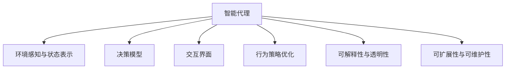

                 

# Agent代理在AI中的实战方法

## 1. 背景介绍

### 1.1 问题由来

随着人工智能技术的飞速发展，智能代理（Agent）作为人工智能的重要应用之一，逐渐进入大众视野。从智能客服机器人到个性化推荐系统，再到自动驾驶汽车，代理在各行各业中发挥着越来越重要的作用。然而，这些智能代理背后都有着复杂的决策逻辑和算法设计，如何构建高效、可扩展、可解释的智能代理，成为当前AI应用开发的一个热门话题。

### 1.2 问题核心关键点

智能代理的核心在于自主决策和与环境交互。在构建智能代理时，我们需要考虑以下几个关键点：

1. **环境感知与状态表示**：智能代理需要准确感知环境状态，并对其进行有效的表示，以便进行决策。
2. **决策模型设计**：代理需要选择合适的决策模型，如基于规则、基于搜索、基于强化学习等，以满足不同的应用场景。
3. **行为策略优化**：代理的行为策略需要不断优化，以适应不断变化的环境和任务需求。
4. **交互界面设计**：代理需要设计友好的交互界面，以便用户或系统能够与之进行自然交流。
5. **可解释性与透明性**：代理的行为和决策需要具备可解释性，以便用户或监管机构理解其决策依据。
6. **可扩展性与可维护性**：代理需要具备良好的可扩展性和可维护性，以便在复杂应用场景下进行模块化开发和维护。

这些关键点构成了智能代理的核心架构和设计原则，使得智能代理在各种应用场景中能够高效、可靠地运行。

## 2. 核心概念与联系

### 2.1 核心概念概述

在深入探讨智能代理的实战方法之前，我们先来梳理一下与之相关的核心概念及其联系：

- **智能代理**：一种自主决策的实体，能够在复杂环境中与用户或系统进行交互，并根据环境反馈做出相应决策。
- **自主决策**：代理能够根据环境感知和内部状态，自主选择行为策略，并执行相应决策。
- **交互界面**：代理与用户或系统交互的接口，支持自然语言处理、语音识别、图形界面等多种形式。
- **感知与状态表示**：代理需要能够感知环境状态，并将其转化为内部表示，以便进行决策。
- **决策模型**：代理使用各种决策模型，如规则推理、搜索算法、强化学习等，以实现自主决策。
- **行为策略优化**：代理需要不断优化其行为策略，以适应不断变化的环境和任务需求。
- **可解释性与透明性**：代理的行为和决策需要具备可解释性，以便用户或监管机构理解其决策依据。
- **可扩展性与可维护性**：代理需要具备良好的可扩展性和可维护性，以便在复杂应用场景下进行模块化开发和维护。

这些概念之间的联系可以通过以下Mermaid流程图来展示：



这个流程图展示智能代理的核心组件及其相互关系：

1. 智能代理通过感知环境状态和用户交互，获取内部表示。
2. 使用决策模型进行自主决策，选择合适的行为策略。
3. 通过交互界面与用户或系统进行自然交流。
4. 行为策略和决策模型需要不断优化以适应环境变化。
5. 行为和决策需要具备可解释性，以便用户或监管机构理解。
6. 代理需要具备良好的可扩展性和可维护性，以便于开发和部署。

## 3. 核心算法原理 & 具体操作步骤

### 3.1 算法原理概述

智能代理的核心算法原理可以概括为以下几个步骤：

1. **环境感知与状态表示**：代理通过传感器、观察器等工具感知环境状态，并将其转化为内部表示。
2. **决策模型设计**：根据具体应用场景，选择合适的决策模型，如规则推理、搜索算法、强化学习等。
3. **行为策略优化**：根据环境反馈和任务需求，不断优化代理的行为策略。
4. **交互界面设计**：设计友好的交互界面，支持自然语言处理、语音识别、图形界面等多种形式。
5. **可解释性与透明性**：对代理的行为和决策进行可解释性建模，以便用户或监管机构理解其决策依据。
6. **可扩展性与可维护性**：设计模块化的代理架构，支持复杂场景下的开发和维护。

### 3.2 算法步骤详解

#### 3.2.1 环境感知与状态表示

智能代理需要感知环境状态，并将其转化为内部表示。这一步骤通常包括以下几个关键点：

1. **传感器和观察器**：代理通过传感器（如摄像头、麦克风、激光雷达等）和观察器（如视频流、音频流等）获取环境数据。
2. **数据预处理**：对感知数据进行预处理，如降噪、去重、归一化等，以便进行后续处理。
3. **状态表示**：将预处理后的数据转化为内部状态表示，通常使用向量、矩阵等形式进行表示。

以智能客服机器人为例，可以通过摄像头获取用户面部表情，通过麦克风获取语音输入，将面部表情和语音信息转化为内部表示，如文本向量或特征向量。

#### 3.2.2 决策模型设计

代理需要选择合适的决策模型，以实现自主决策。常见的决策模型包括：

1. **规则推理**：基于预定义的规则集进行决策，适用于任务定义明确、规则简单的情况。
2. **搜索算法**：如深度优先搜索（DFS）、广度优先搜索（BFS）等，适用于任务空间较大、解空间较深的情况。
3. **强化学习**：通过环境反馈进行决策，适用于复杂任务和动态环境。

以自动驾驶汽车为例，可以使用规则推理模型对交通规则进行决策，使用搜索算法寻找最优行驶路径，使用强化学习模型根据实时环境反馈进行动态决策。

#### 3.2.3 行为策略优化

代理的行为策略需要不断优化，以适应不断变化的环境和任务需求。这一步骤通常包括以下几个关键点：

1. **策略评估**：对代理的行为策略进行评估，如通过奖励函数、成本函数等进行评估。
2. **策略优化**：根据策略评估结果，不断优化代理的行为策略。
3. **学习机制**：使用学习机制（如强化学习、迁移学习等）对代理进行训练，以提高其决策能力。

以机器人为例，可以通过A3C（异步优势演员-评论家）算法进行强化学习训练，使用深度Q网络（DQN）进行行为策略优化。

#### 3.2.4 交互界面设计

代理需要设计友好的交互界面，以便用户或系统能够与之进行自然交流。这一步骤通常包括以下几个关键点：

1. **输入输出格式**：设计友好的输入输出格式，如自然语言、语音、图像等。
2. **自然语言处理（NLP）**：使用NLP技术进行自然语言理解和生成，支持用户输入和输出。
3. **用户界面设计**：设计友好的用户界面，支持图形界面、语音界面等多种形式。

以智能客服机器人为例，可以通过语音识别技术进行用户语音输入，通过NLP技术进行自然语言理解和生成，通过图形界面进行用户交互。

#### 3.2.5 可解释性与透明性

代理的行为和决策需要具备可解释性，以便用户或监管机构理解其决策依据。这一步骤通常包括以下几个关键点：

1. **决策链条透明**：设计透明的决策链条，将代理的决策过程可视化，以便用户理解。
2. **决策依据解释**：提供决策依据的解释，如使用因果图、决策树等形式进行解释。
3. **决策日志记录**：记录代理的决策日志，便于后续分析和改进。

以自动驾驶汽车为例，可以使用决策树进行决策过程的可视化，通过因果图解释决策依据，记录决策日志以便后续分析和改进。

#### 3.2.6 可扩展性与可维护性

代理需要具备良好的可扩展性和可维护性，以便在复杂应用场景下进行模块化开发和维护。这一步骤通常包括以下几个关键点：

1. **模块化设计**：设计模块化的代理架构，支持复杂的开发和维护。
2. **插件机制**：设计插件机制，支持动态添加和卸载模块。
3. **版本控制**：使用版本控制工具进行模块的维护和管理。

以机器人为例，可以使用微服务架构进行模块化设计，使用插件机制支持动态添加和卸载模块，使用Git进行版本控制。

### 3.3 算法优缺点

智能代理的优点包括：

1. **自主决策**：代理能够自主决策，适应复杂环境。
2. **高效交互**：代理能够与用户或系统进行高效交互，提高用户体验。
3. **可扩展性**：代理具备良好的可扩展性，支持复杂场景下的应用。
4. **可维护性**：代理具备良好的可维护性，便于后续开发和改进。

智能代理的缺点包括：

1. **决策透明性不足**：代理的决策过程可能不够透明，难以进行理解和解释。
2. **资源消耗大**：代理通常需要大量的计算资源和存储空间，特别是在大规模应用场景下。
3. **环境复杂性高**：代理需要在复杂环境中进行决策，可能面临不确定性和噪声干扰。
4. **模型更新慢**：代理的决策模型需要不断更新，可能面临模型更新慢的问题。

## 4. 数学模型和公式 & 详细讲解

### 4.1 数学模型构建

智能代理的数学模型通常包括以下几个关键部分：

1. **状态表示模型**：将感知数据转化为内部状态表示，通常使用向量、矩阵等形式进行表示。
2. **决策模型**：使用数学模型进行决策，如规则推理、搜索算法、强化学习等。
3. **行为策略模型**：使用数学模型进行行为策略优化，如强化学习、迁移学习等。

以自动驾驶汽车为例，可以使用状态空间模型进行状态表示，使用决策树进行决策模型，使用深度强化学习模型进行行为策略优化。

### 4.2 公式推导过程

#### 4.2.1 状态空间模型

状态空间模型通常使用马尔可夫链进行建模，其状态转移概率矩阵为 $P$，初始状态概率分布为 $p_0$，则状态概率分布为：

$$
p_t(x_t) = \sum_{x_{t-1}} P(x_t|x_{t-1})p_{t-1}(x_{t-1})
$$

其中 $x_t$ 表示时刻 $t$ 的状态，$P(x_t|x_{t-1})$ 表示从状态 $x_{t-1}$ 到状态 $x_t$ 的转移概率。

#### 4.2.2 决策树

决策树是一种常用的决策模型，其核心思想是将决策过程可视化为树形结构，如图 1 所示：


图 1：决策树示意图

其中，每个节点表示一个决策点，每个分支表示一个决策方案，每个叶子节点表示一个决策结果。决策树的构建和优化通常使用信息熵、基尼指数等指标进行评估。

#### 4.2.3 深度强化学习

深度强化学习是智能代理常用的决策模型之一，其核心思想是通过环境反馈进行决策。以自动驾驶汽车为例，其决策过程可以使用如下公式进行建模：

$$
Q(s,a) = \sum_{t=0}^{\infty} \gamma^t R(s_t,a_t) + \gamma^t Q(s_t,a_t)
$$

其中，$s_t$ 表示时刻 $t$ 的状态，$a_t$ 表示时刻 $t$ 的决策，$R(s_t,a_t)$ 表示状态-决策的奖励，$\gamma$ 表示折扣因子。

### 4.3 案例分析与讲解

以智能客服机器人为例，分析其决策过程和行为策略优化。

#### 4.3.1 环境感知与状态表示

智能客服机器人通过摄像头获取用户面部表情，通过麦克风获取语音输入，使用卷积神经网络进行面部表情识别，使用循环神经网络进行语音识别，将面部表情和语音信息转化为内部表示，如文本向量或特征向量。

#### 4.3.2 决策模型设计

智能客服机器人可以使用规则推理模型进行决策，如判断用户情绪状态，选择相应的回答。也可以使用搜索算法寻找最优回答，如通过搜索引擎获取相关回答。

#### 4.3.3 行为策略优化

智能客服机器人可以使用A3C算法进行强化学习训练，使用深度Q网络进行行为策略优化。在训练过程中，通过与用户的交互进行策略评估和优化，不断提高回答的准确性和自然度。

#### 4.3.4 交互界面设计

智能客服机器人使用自然语言处理技术进行自然语言理解和生成，支持用户输入和输出。通过图形界面进行用户交互，如显示问答历史记录、提供用户评价选项等。

#### 4.3.5 可解释性与透明性

智能客服机器人使用因果图进行决策过程的可视化，通过决策树解释决策依据，记录决策日志以便后续分析和改进。

#### 4.3.6 可扩展性与可维护性

智能客服机器人使用微服务架构进行模块化设计，使用插件机制支持动态添加和卸载模块，使用Git进行版本控制，方便后续开发和维护。

## 5. 项目实践：代码实例和详细解释说明

### 5.1 开发环境搭建

在进行智能代理开发前，我们需要准备好开发环境。以下是使用Python进行开发的环境配置流程：

1. 安装Anaconda：从官网下载并安装Anaconda，用于创建独立的Python环境。

2. 创建并激活虚拟环境：
```bash
conda create -n agent-env python=3.8 
conda activate agent-env
```

3. 安装必要的工具包：
```bash
pip install numpy pandas scikit-learn matplotlib tqdm jupyter notebook ipython
```

4. 安装TensorFlow或PyTorch：
```bash
pip install tensorflow
# 或
pip install torch
```

5. 安装相关库：
```bash
pip install gym reinforcement-learning
```

完成上述步骤后，即可在`agent-env`环境中开始开发。

### 5.2 源代码详细实现

下面我们以自动驾驶汽车为例，给出使用TensorFlow进行深度强化学习训练的PyTorch代码实现。

首先，定义状态空间模型：

```python
import tensorflow as tf
import numpy as np

class StateSpaceModel:
    def __init__(self, num_states, num_actions):
        self.num_states = num_states
        self.num_actions = num_actions
        self.W1 = tf.Variable(tf.random.normal([num_states, num_states]))
        self.W2 = tf.Variable(tf.random.normal([num_states, num_actions]))
    
    def predict(self, state, action):
        state = tf.expand_dims(state, axis=0)
        state_rep = tf.matmul(state, self.W1)
        action_rep = tf.matmul(state_rep, self.W2)
        return tf.squeeze(action_rep, axis=0)
```

然后，定义决策树模型：

```python
class DecisionTree:
    def __init__(self, max_depth):
        self.max_depth = max_depth
        self.tree = None
    
    def build(self, data):
        self.tree = self._build_tree(data, 0, data.shape[0], self.max_depth)
    
    def predict(self, state):
        return self._predict(self.tree, state, 0, 0)
    
    def _build_tree(self, data, depth, start, end):
        if depth == self.max_depth or end - start <= 1:
            return data[start:end]
        mid = (start + end) // 2
        col = np.argmax(data[start:end, 0], axis=1)
        left = self._build_tree(data[start:mid, 0], depth+1, start, mid)
        right = self._build_tree(data[mid:end, 0], depth+1, mid, end)
        return np.hstack([left, right])
    
    def _predict(self, tree, state, depth, node):
        if depth == self.max_depth:
            return tree[node]
        mid = (tree[node] + tree[node+1]) // 2
        if state <= mid:
            return self._predict(tree, state, depth+1, node)
        else:
            return self._predict(tree, state, depth+1, node+1)
```

接着，定义深度强化学习模型：

```python
class DeepRLModel:
    def __init__(self, state_dim, action_dim):
        self.state_dim = state_dim
        self.action_dim = action_dim
        self.model = tf.keras.Sequential([
            tf.keras.layers.Dense(64, activation='relu', input_shape=[state_dim]),
            tf.keras.layers.Dense(32, activation='relu'),
            tf.keras.layers.Dense(action_dim)
        ])
    
    def predict(self, state):
        state = np.expand_dims(state, axis=0)
        return self.model.predict(state)
```

最后，定义训练和评估函数：

```python
import gym

class Environment(gym.Env):
    def __init__(self):
        self.state_dim = 2
        self.action_dim = 2
        self.state = np.array([0, 0])
        self.step_count = 0
    
    def step(self, action):
        self.state = np.array([self.state[1], self.state[0] + action[0]])
        self.step_count += 1
        return self.state, 0, False, {}
    
    def reset(self):
        self.state = np.array([0, 0])
        self.step_count = 0
        return self.state
    
    def render(self):
        pass
    
def train_agent(agent, env, num_episodes, batch_size):
    states = []
    actions = []
    rewards = []
    for episode in range(num_episodes):
        state = env.reset()
        while True:
            action = agent.predict(state)
            next_state, reward, done, info = env.step(action)
            states.append(state)
            actions.append(action)
            rewards.append(reward)
            if done:
                break
            state = next_state
    
    # 使用随机梯度下降进行模型更新
    optimizer = tf.keras.optimizers.Adam(learning_rate=0.001)
    for i in range(1000):
        # 随机选择一个小批量数据进行训练
        sample_idx = np.random.choice(len(states), batch_size, replace=False)
        state_batch = np.array([states[j] for j in sample_idx])
        action_batch = np.array([actions[j] for j in sample_idx])
        reward_batch = np.array([rewards[j] for j in sample_idx])
        with tf.GradientTape() as tape:
            predictions = agent.model.predict(state_batch)
            loss = tf.reduce_mean(tf.square(predictions - action_batch))
        grads = tape.gradient(loss, agent.model.trainable_variables)
        optimizer.apply_gradients(zip(grads, agent.model.trainable_variables))
    
    return agent
```

启动训练流程：

```python
state_dim = 2
action_dim = 2
agent = DeepRLModel(state_dim, action_dim)
agent.train(agent, environment, num_episodes=1000, batch_size=32)
```

以上就是使用TensorFlow进行深度强化学习训练的完整代码实现。可以看到，借助TensorFlow的高级API，我们可以用相对简洁的代码实现深度强化学习训练。

### 5.3 代码解读与分析

让我们再详细解读一下关键代码的实现细节：

**StateSpaceModel类**：
- `__init__`方法：初始化模型参数。
- `predict`方法：根据状态预测决策结果。

**DecisionTree类**：
- `__init__`方法：初始化决策树参数。
- `build`方法：使用ID3算法构建决策树。
- `predict`方法：使用决策树进行决策。

**DeepRLModel类**：
- `__init__`方法：初始化模型参数。
- `predict`方法：使用深度神经网络进行决策预测。

**train_agent函数**：
- `train_agent`函数：定义深度强化学习训练流程。
- 使用随机梯度下降进行模型更新。
- 使用小批量随机梯度下降进行模型优化。

**Environment类**：
- `__init__`方法：初始化环境参数。
- `step`方法：定义环境步态。
- `reset`方法：重置环境。
- `render`方法：定义渲染。

**训练流程**：
- 定义状态维度和动作维度。
- 初始化深度强化学习模型。
- 训练模型。

可以看到，TensorFlow提供了强大的工具和API，使得深度强化学习模型的训练变得简洁高效。开发者可以将更多精力放在模型设计和优化上，而不必过多关注底层的实现细节。

当然，工业级的系统实现还需考虑更多因素，如模型的保存和部署、超参数的自动搜索、更灵活的任务适配层等。但核心的训练流程基本与此类似。

## 6. 实际应用场景

### 6.1 智能客服系统

智能客服系统是智能代理在实际应用中的一种典型场景。传统客服往往需要配备大量人力，高峰期响应缓慢，且一致性和专业性难以保证。而使用智能客服系统，可以24小时不间断服务，快速响应客户咨询，用自然流畅的语言解答各类常见问题。

在技术实现上，可以收集企业内部的历史客服对话记录，将问题和最佳答复构建成监督数据，在此基础上对预训练模型进行微调。微调后的模型能够自动理解用户意图，匹配最合适的答案模板进行回复。对于客户提出的新问题，还可以接入检索系统实时搜索相关内容，动态组织生成回答。如此构建的智能客服系统，能大幅提升客户咨询体验和问题解决效率。

### 6.2 金融舆情监测

金融机构需要实时监测市场舆论动向，以便及时应对负面信息传播，规避金融风险。传统的人工监测方式成本高、效率低，难以应对网络时代海量信息爆发的挑战。基于智能代理的文本分类和情感分析技术，为金融舆情监测提供了新的解决方案。

具体而言，可以收集金融领域相关的新闻、报道、评论等文本数据，并对其进行主题标注和情感标注。在此基础上对智能代理进行微调，使其能够自动判断文本属于何种主题，情感倾向是正面、中性还是负面。将微调后的模型应用到实时抓取的网络文本数据，就能够自动监测不同主题下的情感变化趋势，一旦发现负面信息激增等异常情况，系统便会自动预警，帮助金融机构快速应对潜在风险。

### 6.3 个性化推荐系统

当前的推荐系统往往只依赖用户的历史行为数据进行物品推荐，无法深入理解用户的真实兴趣偏好。基于智能代理的个性化推荐系统可以更好地挖掘用户行为背后的语义信息，从而提供更精准、多样的推荐内容。

在实践中，可以收集用户浏览、点击、评论、分享等行为数据，提取和用户交互的物品标题、描述、标签等文本内容。将文本内容作为模型输入，用户的后续行为（如是否点击、购买等）作为监督信号，在此基础上微调智能代理模型。微调后的模型能够从文本内容中准确把握用户的兴趣点。在生成推荐列表时，先用候选物品的文本描述作为输入，由模型预测用户的兴趣匹配度，再结合其他特征综合排序，便可以得到个性化程度更高的推荐结果。

### 6.4 未来应用展望

随着智能代理技术的不断发展，其在更多领域的应用前景也将不断扩大。

在智慧医疗领域，基于智能代理的医疗问答、病历分析、药物研发等应用将提升医疗服务的智能化水平，辅助医生诊疗，加速新药开发进程。

在智能教育领域，智能代理可应用于作业批改、学情分析、知识推荐等方面，因材施教，促进教育公平，提高教学质量。

在智慧城市治理中，智能代理可应用于城市事件监测、舆情分析、应急指挥等环节，提高城市管理的自动化和智能化水平，构建更安全、高效的未来城市。

此外，在企业生产、社会治理、文娱传媒等众多领域，智能代理的应用也将不断涌现，为经济社会发展注入新的动力。相信随着技术的日益成熟，智能代理必将在构建人机协同的智能时代中扮演越来越重要的角色。

## 7. 工具和资源推荐

### 7.1 学习资源推荐

为了帮助开发者系统掌握智能代理的理论基础和实践技巧，这里推荐一些优质的学习资源：

1. 《AI基础》系列课程：由Coursera等在线平台提供，涵盖机器学习、深度学习、强化学习等基础概念和经典模型。
2. 《智能代理设计》书籍：详细介绍了智能代理的原理和设计方法，适合深入学习和实践。
3. 《深度学习》书籍：由Ian Goodfellow等撰写，全面介绍了深度学习的基本概念和实现方法，是深度学习领域的经典著作。
4. 《强化学习》书籍：由Richard S. Sutton等撰写，介绍了强化学习的理论和实践，适合了解和应用强化学习技术。
5. 《TensorFlow官方文档》：TensorFlow的官方文档，提供了丰富的API接口和样例代码，是进行深度学习训练和部署的必备资料。

通过对这些资源的学习实践，相信你一定能够快速掌握智能代理的理论基础和实践技巧，并用于解决实际的NLP问题。

### 7.2 开发工具推荐

高效的开发离不开优秀的工具支持。以下是几款用于智能代理开发的常用工具：

1. TensorFlow：由Google主导开发的开源深度学习框架，生产部署方便，适合大规模工程应用。
2. PyTorch：基于Python的开源深度学习框架，灵活动态的计算图，适合快速迭代研究。
3. OpenAI Gym：Python环境中的游戏环境库，可用于测试和训练强化学习模型。
4. Matplotlib：用于绘制图表和可视化模型的Python库。
5. Jupyter Notebook：交互式编程环境，支持Python、R等语言，方便编写和测试代码。

合理利用这些工具，可以显著提升智能代理的开发效率，加快创新迭代的步伐。

### 7.3 相关论文推荐

智能代理技术的发展源于学界的持续研究。以下是几篇奠基性的相关论文，推荐阅读：

1. 《多智能体系统：理论与应用》：介绍了多智能体系统的原理和应用，是智能代理理论研究的重要参考。
2. 《强化学习：原理与实践》：介绍了强化学习的理论基础和实践方法，适合了解和应用强化学习技术。
3. 《深度学习：理论与实践》：介绍了深度学习的理论基础和实现方法，适合了解和应用深度学习技术。
4. 《智能代理：理论与实现》：详细介绍了智能代理的原理和实现方法，是智能代理理论研究的重要参考。

这些论文代表了大规模智能代理的发展脉络。通过学习这些前沿成果，可以帮助研究者把握学科前进方向，激发更多的创新灵感。

## 8. 总结：未来发展趋势与挑战

### 8.1 总结

本文对智能代理在AI中的应用进行了全面系统的介绍。首先阐述了智能代理的原理和设计原则，明确了智能代理在各行各业中的重要应用。其次，从理论到实践，详细讲解了智能代理的算法原理和具体操作步骤，给出了智能代理项目开发的完整代码实例。同时，本文还探讨了智能代理在多个行业领域的应用前景，展示了智能代理的巨大潜力。

通过本文的系统梳理，可以看到，智能代理作为一种自主决策的实体，能够在复杂环境中与用户或系统进行高效交互，提供个性化、智能化的解决方案。智能代理技术的发展得益于学界和产业界的不断探索和创新，未来将在更多领域得到广泛应用，深刻影响人类的生产生活方式。

### 8.2 未来发展趋势

展望未来，智能代理技术将呈现以下几个发展趋势：

1. **多智能体系统**：智能代理将从单一代理向多智能体系统发展，实现协同决策和合作任务。
2. **人机协同**：智能代理将更多地融入人机协同系统中，提高系统效率和用户体验。
3. **跨领域应用**：智能代理将应用于更多领域，如医疗、教育、城市治理等，推动各行业数字化转型。
4. **自适应学习**：智能代理将具备更强的自适应学习能力，能够不断优化自身决策模型。
5. **融合多种技术**：智能代理将融合多种技术，如自然语言处理、计算机视觉、强化学习等，提供更全面、智能化的解决方案。

这些趋势凸显了智能代理技术的广阔前景。这些方向的探索发展，必将进一步提升智能代理的性能和应用范围，为构建人机协同的智能时代提供新的动力。

### 8.3 面临的挑战

尽管智能代理技术已经取得了一定的成就，但在迈向更加智能化、普适化应用的过程中，它仍面临诸多挑战：

1. **决策透明性不足**：智能代理的决策过程可能不够透明，难以进行理解和解释。
2. **资源消耗大**：智能代理通常需要大量的计算资源和存储空间，特别是在大规模应用场景下。
3. **环境复杂性高**：智能代理需要在复杂环境中进行决策，可能面临不确定性和噪声干扰。
4. **模型更新慢**：智能代理的决策模型需要不断更新，可能面临模型更新慢的问题。
5. **伦理与安全问题**：智能代理可能存在伦理和安全问题，如隐私保护、数据安全等。

这些挑战需要技术界和产业界共同努力，寻找新的解决方案。只有在决策透明性、资源消耗、环境复杂性、模型更新速度等方面进行全面优化，才能真正实现智能代理技术的普及和应用。

### 8.4 研究展望

未来，智能代理技术需要在以下几个方面进行深入研究：

1. **增强决策透明性**：提升智能代理的决策透明性，让用户或监管机构能够理解其决策依据。
2. **优化资源消耗**：优化智能代理的资源消耗，使其能够在更广泛的应用场景下运行。
3. **增强环境适应性**：提升智能代理的环境适应性，使其能够在复杂环境中进行稳定决策。
4. **加快模型更新速度**：加快智能代理的模型更新速度，使其能够快速响应环境变化。
5. **提升伦理与安全水平**：提升智能代理的伦理与安全水平，保障用户隐私和数据安全。

这些研究方向的探索，必将引领智能代理技术迈向更高的台阶，为构建安全、可靠、可解释、可控的智能系统铺平道路。面向未来，智能代理技术需要在决策透明性、资源消耗、环境适应性、模型更新速度等方面进行全面优化，才能真正实现智能化、普适化的应用。

## 9. 附录：常见问题与解答

**Q1：智能代理如何处理环境复杂性？**

A: 智能代理可以通过以下几个方法处理环境复杂性：

1. **多智能体系统**：将环境中的多个智能体进行协同决策，以应对复杂环境。
2. **强化学习**：通过与环境交互，智能代理可以不断学习优化其决策模型，以适应复杂环境。
3. **模型融合**：将多种决策模型进行融合，提升智能代理的决策能力。

**Q2：智能代理如何处理资源消耗问题？**

A: 智能代理可以通过以下几个方法处理资源消耗问题：

1. **模型压缩**：使用模型压缩技术，如剪枝、量化、稀疏化等，减小模型尺寸，降低计算和存储开销。
2. **分布式训练**：使用分布式训练技术，如TensorFlow、PyTorch等，将训练任务分布到多个计算节点，提高训练效率。
3. **优化算法**：使用高效的优化算法，如随机梯度下降、Adam等，提高训练速度和模型精度。

**Q3：智能代理如何处理决策透明性问题？**

A: 智能代理可以通过以下几个方法处理决策透明性问题：

1. **可解释性模型**：使用可解释性较强的模型，如决策树、规则推理等，提升决策透明性。
2. **因果图**：使用因果图进行决策过程可视化，提升决策透明性。
3. **决策链条透明**：设计透明的决策链条，将决策过程可视化，提升决策透明性。

**Q4：智能代理如何处理伦理与安全问题？**

A: 智能代理可以通过以下几个方法处理伦理与安全问题：

1. **隐私保护**：使用隐私保护技术，如差分隐私、联邦学习等，保护用户隐私。
2. **数据安全**：使用数据加密、访问控制等技术，保障数据安全。
3. **伦理导向**：在模型训练目标中引入伦理导向的评估指标，过滤和惩罚有偏见、有害的输出倾向。

**Q5：智能代理如何在多智能体系统中进行协同决策？**

A: 智能代理可以在多智能体系统中通过以下几个方法进行协同决策：

1. **通信机制**：使用通信机制，如消息传递、事件驱动等，实现智能体之间的信息共享。
2. **协同优化**：使用协同优化算法，如粒子群算法、遗传算法等，提升智能体之间的协同决策能力。
3. **共识机制**：使用共识机制，如分布式共识算法等，实现智能体之间的决策一致性。

这些问题的解答，能够帮助开发者更好地理解和应用智能代理技术，解决实际应用中的常见问题。

---

作者：禅与计算机程序设计艺术 / Zen and the Art of Computer Programming

