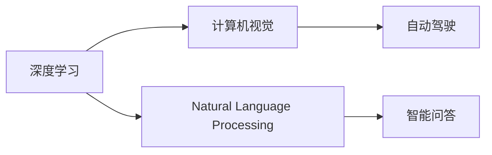

                 

# Andrej Karpathy谈AI的历史与未来

> 关键词：AI历史、深度学习、神经网络、计算机视觉、自然语言处理、未来趋势

## 1. 背景介绍

Andrej Karpathy，斯坦福大学教授，谷歌AI首席科学家，深度学习先驱，计算机视觉领域的领军人物。他的学术贡献和工业界影响力无人能敌。本文将深入探讨Karpathy关于人工智能历史与未来的洞见，及其对当前深度学习研究方向的思考。

## 2. 核心概念与联系

### 2.1 核心概念概述

人工智能(AI)是一个跨学科的领域，涉及计算机科学、数学、认知科学、语言学等多个方向。通过深度学习与神经网络技术，AI已取得了令人瞩目的突破。Karpathy强调，AI的历史和未来发展应着重于三个关键概念：深度学习、计算机视觉和自然语言处理。

**深度学习**：一种基于神经网络的机器学习算法，能够处理非线性关系和复杂数据结构，是实现各种AI任务的核心技术。

**计算机视觉**：使计算机理解图像、视频等视觉数据的科学。计算机视觉的进步使得AI系统能够从视觉数据中提取有用信息，实现自动驾驶、医学影像分析、物体识别等任务。

**自然语言处理**：使计算机理解、生成和处理人类语言的技术。NLP的进展使得AI系统能够进行机器翻译、语音识别、智能问答等任务。

### 2.2 核心概念原理和架构的 Mermaid 流程图



## 3. 核心算法原理 & 具体操作步骤

### 3.1 算法原理概述

Karpathy认为，AI的算法发展可以分为几个关键阶段：

1. **符号主义AI**：早期的AI使用规则和符号来模拟人类的认知过程。由于规则难以覆盖所有情况，因此难以实现复杂任务。

2. **统计机器学习**：使用统计模型进行数据拟合。虽能处理一些简单任务，但处理复杂数据和任务时效果有限。

3. **深度学习**：通过神经网络自动学习特征表示。神经网络具有强大的表达能力和学习能力，已实现多项AI突破。

### 3.2 算法步骤详解

深度学习算法的基本步骤如下：

1. **数据准备**：收集并标注大量数据，准备用于训练神经网络。

2. **模型构建**：选择合适的神经网络结构，如卷积神经网络(CNN)、循环神经网络(RNN)、Transformer等。

3. **模型训练**：使用反向传播算法，通过大量数据对模型进行优化训练，调整权重和偏置，最小化损失函数。

4. **模型评估**：使用验证集和测试集评估模型性能，选择最优模型。

5. **模型部署**：将训练好的模型部署到实际应用中，进行推理和预测。

### 3.3 算法优缺点

**优点**：

- **自适应**：深度学习模型能够自适应数据特性，处理复杂任务。
- **泛化能力**：深度学习模型通常具备较好的泛化能力，能在不同数据集上表现出色。
- **可扩展性**：深度学习模型易于扩展到各种应用场景，如计算机视觉、自然语言处理等。

**缺点**：

- **计算资源需求大**：深度学习模型通常需要大量的计算资源进行训练和推理。
- **黑箱特性**：深度学习模型难以解释，难以理解其内部机制。
- **过拟合风险**：由于模型复杂，容易发生过拟合。

### 3.4 算法应用领域

深度学习已广泛应用于计算机视觉、自然语言处理、语音识别、推荐系统等多个领域：

- **计算机视觉**：自动驾驶、医学影像分析、物体识别等。
- **自然语言处理**：机器翻译、智能问答、情感分析等。
- **语音识别**：智能语音助手、语音输入、语音转换等。
- **推荐系统**：电商推荐、新闻推荐、个性化内容推荐等。

## 4. 数学模型和公式 & 详细讲解 & 举例说明

### 4.1 数学模型构建

深度学习的核心是神经网络。以卷积神经网络(CNN)为例，其基本结构包括卷积层、池化层、全连接层等。CNN模型通常包含多个卷积核，通过卷积操作提取局部特征。

### 4.2 公式推导过程

以简单的卷积操作为例：

设输入数据为 $x \in \mathbb{R}^{m\times n\times c}$，卷积核为 $w \in \mathbb{R}^{k\times k \times c\times o}$，输出特征图为 $y \in \mathbb{R}^{m\times n \times o}$。则卷积操作可以表示为：

$$
y_{ij} = \sum_k \sum_l \sum_c x_{i+k,j+l,c} \cdot w_{k,l,c,o}
$$

### 4.3 案例分析与讲解

假设输入图像大小为 $32\times 32$，卷积核大小为 $3\times 3$，输入通道数为 $3$，输出通道数为 $16$。则输入特征图大小为 $32\times 32 \times 3$，卷积核大小为 $3\times 3 \times 3 \times 16$，输出特征图大小为 $32\times 32 \times 16$。

## 5. 项目实践：代码实例和详细解释说明

### 5.1 开发环境搭建

1. **安装Python和PyTorch**：
```bash
pip install torch torchvision torchaudio
```

2. **下载数据集**：
```bash
wget https://example.com/data.zip
unzip data.zip
```

### 5.2 源代码详细实现

以下是一个简单的卷积神经网络模型实现示例：

```python
import torch.nn as nn

class CNN(nn.Module):
    def __init__(self):
        super(CNN, self).__init__()
        self.conv1 = nn.Conv2d(3, 16, 3, padding=1)
        self.pool = nn.MaxPool2d(2, 2)
        self.fc1 = nn.Linear(16 * 16 * 16, 128)
        self.fc2 = nn.Linear(128, 10)
    
    def forward(self, x):
        x = self.pool(nn.functional.relu(self.conv1(x)))
        x = x.view(x.size(0), -1)
        x = nn.functional.relu(self.fc1(x))
        x = self.fc2(x)
        return x
```

### 5.3 代码解读与分析

**CNN模块定义**：
- `__init__`方法：初始化卷积层、池化层和全连接层。
- `forward`方法：前向传播过程。

**卷积层**：
- `nn.Conv2d`：定义卷积层，接收输入通道数、输出通道数、卷积核大小等参数。
- `padding`参数：定义卷积核的padding大小，保持输出特征图尺寸不变。

**池化层**：
- `nn.MaxPool2d`：定义最大池化层，缩小特征图尺寸。

**全连接层**：
- `nn.Linear`：定义全连接层，接收输入和输出维度。
- `nn.functional.relu`：定义ReLU激活函数。

**前向传播**：
- `nn.functional`模块：包含各种常用的激活函数、损失函数等。

## 6. 实际应用场景

### 6.1 自动驾驶

自动驾驶是深度学习在计算机视觉领域的典型应用。通过摄像头、激光雷达等设备收集环境数据，经过卷积神经网络处理后，提取道路、车辆、行人等关键信息，辅助车辆自动驾驶。

### 6.2 医学影像分析

深度学习在医学影像分析中也有广泛应用。通过卷积神经网络处理CT、MRI等影像数据，提取肿瘤、器官等关键特征，辅助医生进行诊断和治疗决策。

### 6.3 自然语言处理

自然语言处理中的机器翻译和智能问答等任务，通过循环神经网络或Transformer等模型处理语言数据，提取语义信息，生成符合语境的翻译或问答结果。

## 7. 工具和资源推荐

### 7.1 学习资源推荐

- **Deep Learning Specialization**：由Coursera提供的深度学习专项课程，涵盖深度学习基础知识和最新技术。
- **CS231n: Convolutional Neural Networks for Visual Recognition**：斯坦福大学开设的计算机视觉课程，包括深度学习在计算机视觉中的应用。
- **NLP with Deep Learning**：斯坦福大学开设的自然语言处理课程，涵盖深度学习在自然语言处理中的应用。
- **AI Ethics**：深度学习伦理相关的课程，探讨AI技术的社会影响和伦理问题。

### 7.2 开发工具推荐

- **TensorFlow**：由Google开发的深度学习框架，支持分布式训练和推理。
- **PyTorch**：由Facebook开发的深度学习框架，支持动态计算图和GPU加速。
- **Keras**：基于TensorFlow和Theano的高级深度学习框架，适合快速开发原型。
- **Jupyter Notebook**：交互式编程环境，支持Python和深度学习工具库的快速迭代开发。

### 7.3 相关论文推荐

- **ImageNet Classification with Deep Convolutional Neural Networks**：深度学习在计算机视觉领域的奠基性论文，提出AlexNet模型。
- **Convolutional Neural Networks for Sentence Classification**：深度学习在自然语言处理领域的突破性论文，提出卷积神经网络用于文本分类。
- **Attention is All You Need**：Transformer模型的提出论文，在自然语言处理领域引起革命性变化。
- **Natural Language Processing with Attention**：深度学习在自然语言处理领域的综述性论文，探讨多种注意力机制的应用。

## 8. 总结：未来发展趋势与挑战

### 8.1 研究成果总结

Karpathy认为，深度学习的发展历程已取得丰硕成果，未来应关注以下几个方向：

- **多模态学习**：将视觉、文本、语音等多种模态数据进行融合，提升模型综合能力。
- **自监督学习**：利用无标签数据进行预训练，提升模型泛化能力。
- **可解释性**：提升深度学习的可解释性，增强模型透明度。
- **公平性和伦理**：关注深度学习模型的公平性和伦理问题，避免偏见和歧视。

### 8.2 未来发展趋势

深度学习的发展趋势包括：

- **自监督学习**：利用无标签数据进行预训练，提升模型泛化能力。
- **多模态学习**：将视觉、文本、语音等多种模态数据进行融合，提升模型综合能力。
- **可解释性**：提升深度学习的可解释性，增强模型透明度。
- **公平性和伦理**：关注深度学习模型的公平性和伦理问题，避免偏见和歧视。

### 8.3 面临的挑战

深度学习面临的挑战包括：

- **计算资源需求大**：深度学习模型通常需要大量的计算资源进行训练和推理。
- **黑箱特性**：深度学习模型难以解释，难以理解其内部机制。
- **公平性和伦理**：深度学习模型的公平性和伦理问题需要重视。

### 8.4 研究展望

未来深度学习的研究方向包括：

- **多模态学习**：将视觉、文本、语音等多种模态数据进行融合，提升模型综合能力。
- **自监督学习**：利用无标签数据进行预训练，提升模型泛化能力。
- **可解释性**：提升深度学习的可解释性，增强模型透明度。
- **公平性和伦理**：关注深度学习模型的公平性和伦理问题，避免偏见和歧视。

## 9. 附录：常见问题与解答

**Q1：深度学习是否适用于所有任务？**

A: 深度学习在许多任务上取得了突破，但并非所有任务都适合。例如，对于小样本问题，传统的统计学习方法可能更适合。

**Q2：深度学习为何需要大量计算资源？**

A: 深度学习模型的复杂度较高，需要大量的计算资源进行训练和推理。这可以通过分布式训练、模型剪枝等技术进行优化。

**Q3：深度学习模型为何难以解释？**

A: 深度学习模型通常具有高度的非线性结构，难以直观理解其内部机制。可以通过可视化、特征分析等手段进行解释。

**Q4：深度学习模型如何避免偏见？**

A: 深度学习模型的偏见主要源于数据。可以通过数据增强、样本平衡、公平性约束等手段进行缓解。

**Q5：深度学习未来发展方向是什么？**

A: 未来深度学习的发展方向包括多模态学习、自监督学习、可解释性、公平性和伦理等。这些方向将推动深度学习技术的不断进步和广泛应用。

---

作者：禅与计算机程序设计艺术 / Zen and the Art of Computer Programming

