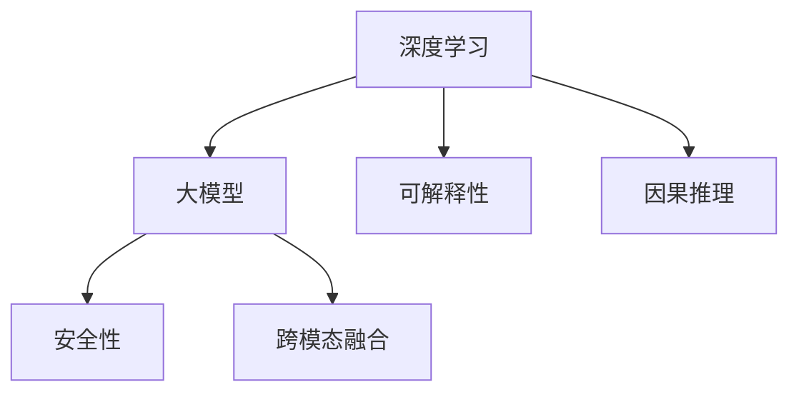

                 

# Andrej Karpathy：人工智能的未来创新

## 1. 背景介绍

**1.1 问题由来**
Andrej Karpathy，人工智能领域的杰出专家和创新者，斯坦福大学计算机科学教授，Google AI的深度学习团队负责人。Karpathy在深度学习领域的研究覆盖了自动驾驶、计算机视觉、自然语言处理等多个前沿方向，其成果多次获得国际学术界和工业界的高度评价。在近日发表的一系列博客文章中，Karpathy深入探讨了人工智能的未来创新方向，给出了诸多独到的见解，引起广泛关注。

Karpathy指出，尽管深度学习和大模型取得了长足进步，但在诸多领域仍面临诸多挑战。未来AI的发展必须关注算法的普适性、可解释性和安全性，并积极探索跨模态、因果推理等新方向。本文将全面梳理Karpathy在人工智能未来创新方面的思考和探索，以期为AI领域的从业者和研究者提供有价值的参考。

**1.2 问题核心关键点**
Karpathy认为，人工智能的未来创新方向需要关注以下几个关键点：
- **算法普适性**：开发可以适应多种任务、多种模态的通用AI算法。
- **可解释性**：提升算法的透明度，使AI决策具备可解释性。
- **安全性**：保证AI系统的安全性，避免出现恶意攻击或意外错误。
- **跨模态融合**：将视觉、听觉、文本等多种模态数据进行整合，实现多模态AI。
- **因果推理**：理解AI决策的因果关系，避免偏见和错误推理。

这些关键点构成了Karpathy对于未来AI创新的核心思考，我们将通过本文逐一解析。

## 2. 核心概念与联系

### 2.1 核心概念概述

为更好地理解Karpathy关于AI未来创新的观点，本节将介绍几个关键概念：

- **深度学习**：基于多层神经网络的学习方法，通过反向传播算法优化模型参数，实现复杂模式的建模和预测。
- **大模型**：具有亿级以上参数的神经网络模型，如GPT、BERT、ViT等。大模型通过大量数据预训练，能够学习到更丰富的知识表示，从而在各种任务上表现出色。
- **可解释性**：算法的决策过程可被人类理解，有助于提升用户信任和算法可靠性。
- **安全性**：AI系统具备应对恶意攻击和意外错误的能力，确保系统的稳定性和可靠性。
- **跨模态融合**：将不同模态的数据进行整合，构建统一的知识表示，提升AI系统的多模态理解能力。
- **因果推理**：理解因果关系，推断变量之间的影响和依赖，避免错误的推理和决策。

这些概念之间的关系通过以下Mermaid流程图来展示：



该流程图展示了深度学习和大模型在可解释性、安全性、跨模态融合和因果推理等方向上的扩展和应用。

## 3. 核心算法原理 & 具体操作步骤

### 3.1 算法原理概述

Karpathy认为，未来AI的创新需要基于以下几个核心原理：

- **迁移学习**：利用已有的知识进行新的任务学习，可以显著降低学习成本，提升学习效率。
- **自监督学习**：通过无标签数据进行自监督学习，无需标注数据即可学习到有用的特征。
- **多任务学习**：同时学习多个相关任务，共享知识，提升泛化能力。
- **模型蒸馏**：将大模型的知识蒸馏到小模型中，实现知识传递和压缩。
- **参数共享**：不同层共享参数，降低模型复杂度，提升训练效率。

### 3.2 算法步骤详解

以下是Karpathy关于未来AI创新的核心算法步骤：

1. **数据准备**：收集、预处理和标注数据，确保数据的多样性和代表性。
2. **模型初始化**：选择合适的网络结构，初始化模型参数。
3. **自监督预训练**：在大量无标签数据上自监督学习，学习到通用的特征表示。
4. **微调**：在特定任务上微调预训练模型，学习到该任务的特定知识。
5. **多任务学习**：同时训练多个相关任务，共享知识，提升泛化能力。
6. **模型蒸馏**：将大模型的知识蒸馏到小模型中，实现知识传递和压缩。
7. **参数共享**：在不同层之间共享参数，降低模型复杂度。
8. **可解释性增强**：通过可视化、特征解释等手段提升模型的可解释性。
9. **安全性保障**：引入对抗训练、鲁棒性检测等技术，提升模型的安全性。
10. **跨模态融合**：利用多模态数据，构建统一的知识表示，提升模型的多模态理解能力。
11. **因果推理**：理解因果关系，推断变量之间的影响和依赖。

### 3.3 算法优缺点

**优点**：
- **高效**：迁移学习、多任务学习和模型蒸馏等技术可以显著降低学习成本，提升学习效率。
- **泛化能力强**：多任务学习和模型蒸馏等技术可以提升模型的泛化能力，适应多种任务。
- **可解释性高**：通过可视化、特征解释等手段，提升模型的可解释性，增强用户信任。
- **安全性高**：通过对抗训练、鲁棒性检测等技术，提升模型的安全性，避免恶意攻击和意外错误。

**缺点**：
- **模型复杂度高**：大模型和复杂网络结构需要较高的计算资源和存储空间。
- **训练时间长**：大模型的训练时间较长，需要较长的计算资源和较长的训练时间。
- **数据需求大**：需要大量的标注数据进行微调，对标注数据的依赖较高。
- **可解释性不足**：复杂模型难以解释其内部决策过程，缺乏透明度。

## 4. 数学模型和公式 & 详细讲解 & 举例说明

### 4.1 数学模型构建

在Karpathy的博客中，他详细探讨了如何构建适合未来AI创新的数学模型。以自监督学习为例，构建了一个简单的自监督学习模型：

假设我们有一组无标签的数据 $D=\{(x_i,y_i)\}_{i=1}^N$，其中 $x_i$ 是输入数据，$y_i$ 是标签。我们的目标是通过自监督学习，学习到一种通用表示 $f(x)$，使得在特定任务 $T$ 上，$f(x)$ 能够更好地表示任务的特征。

数学模型构建如下：

1. **输入特征映射**：将输入数据 $x$ 映射到一个高维空间，得到特征表示 $h$。

$$
h = f(x)
$$

2. **损失函数**：定义一个损失函数 $L(h,y)$，用于衡量特征表示 $h$ 与标签 $y$ 的差距。

$$
L(h,y) = \frac{1}{N} \sum_{i=1}^N \ell(h_i,y_i)
$$

其中 $\ell$ 为具体的损失函数，如交叉熵损失等。

3. **自监督学习目标**：最小化损失函数 $L(h,y)$，学习到通用的特征表示 $f(x)$。

$$
\min_{f(x)} \frac{1}{N} \sum_{i=1}^N \ell(f(x_i),y_i)
$$

4. **训练过程**：通过梯度下降等优化算法，迭代更新特征映射函数 $f(x)$，直到损失函数收敛。

### 4.2 公式推导过程

在推导自监督学习的数学模型时，我们采用了反向传播算法。以交叉熵损失函数为例，其梯度计算公式如下：

$$
\frac{\partial L(h,y)}{\partial f(x)} = -\frac{1}{N} \sum_{i=1}^N \frac{\partial \ell(h_i,y_i)}{\partial h_i} \frac{\partial h_i}{\partial f(x)}
$$

其中 $\frac{\partial \ell(h_i,y_i)}{\partial h_i}$ 为损失函数对特征表示的偏导数，$\frac{\partial h_i}{\partial f(x)}$ 为特征映射函数的导数。通过反向传播算法，可以高效计算这些偏导数，从而迭代更新模型参数。

### 4.3 案例分析与讲解

Karpathy以自监督预训练为例，给出了一个具体的案例。假设我们有一组图片数据 $D=\{(x_i,y_i)\}_{i=1}^N$，其中 $x_i$ 为图片，$y_i$ 为标签。我们的目标是通过自监督预训练，学习到一种通用的图片表示 $f(x)$。

具体步骤如下：

1. **特征提取**：通过卷积神经网络等模型，将图片 $x$ 映射到一个高维空间，得到特征表示 $h$。

$$
h = f(x) = CNN(x)
$$

2. **自监督损失**：定义一个自监督损失函数 $L(h)$，用于衡量特征表示 $h$ 的分布差异。

$$
L(h) = KL(h||h_{noise})
$$

其中 $h_{noise}$ 为加入噪声后的特征表示，$KL$ 为KL散度，衡量两个概率分布的差异。

3. **自监督学习目标**：最小化自监督损失 $L(h)$，学习到通用的图片表示 $f(x)$。

$$
\min_{f(x)} L(h)
$$

4. **训练过程**：通过梯度下降等优化算法，迭代更新特征映射函数 $f(x)$，直到损失函数收敛。

通过自监督预训练，可以学习到一种通用的图片表示 $f(x)$，从而在特定的图片任务上（如物体检测、图像分类等）进行微调，提升模型的性能。

## 5. 项目实践：代码实例和详细解释说明

### 5.1 开发环境搭建

Karpathy在博客中推荐使用PyTorch作为深度学习框架进行项目实践。以下是搭建PyTorch开发环境的详细步骤：

1. 安装Anaconda：从官网下载并安装Anaconda，用于创建独立的Python环境。

2. 创建并激活虚拟环境：

```bash
conda create -n pytorch-env python=3.8 
conda activate pytorch-env
```

3. 安装PyTorch：根据CUDA版本，从官网获取对应的安装命令。例如：

```bash
conda install pytorch torchvision torchaudio cudatoolkit=11.1 -c pytorch -c conda-forge
```

4. 安装相关工具包：

```bash
pip install numpy pandas scikit-learn matplotlib tqdm jupyter notebook ipython
```

完成上述步骤后，即可在`pytorch-env`环境中开始项目实践。

### 5.2 源代码详细实现

Karpathy以自监督预训练为例，给出了一段PyTorch代码实现。

```python
import torch
import torchvision.transforms as transforms
from torchvision.models import resnet

# 加载图片数据
train_data = torchvision.datasets.CIFAR10(root='./data', train=True, download=True, transform=transforms.ToTensor())
train_loader = torch.utils.data.DataLoader(train_data, batch_size=128, shuffle=True, num_workers=2)

# 加载预训练模型
model = resnet18(pretrained=True)
model.train()

# 定义自监督损失函数
def self_supervised_loss(model, data_loader):
    criterion = torch.nn.KLDivLoss()
    total_loss = 0.0
    with torch.no_grad():
        for inputs, labels in data_loader:
            logits = model(inputs)
            logits = logits.view(-1, 1024)
            noise = torch.randn_like(logits, requires_grad=False) * 0.1
            logits_noisy = logits + noise
            loss = criterion(logits, logits_noisy)
            total_loss += loss.item()
    return total_loss / len(data_loader.dataset)

# 训练过程
optimizer = torch.optim.SGD(model.parameters(), lr=0.001, momentum=0.9)
for epoch in range(100):
    loss = self_supervised_loss(model, train_loader)
    optimizer.zero_grad()
    loss.backward()
    optimizer.step()
    print('Epoch {}: Loss {}'.format(epoch+1, loss))
```

### 5.3 代码解读与分析

让我们再详细解读一下关键代码的实现细节：

**数据准备**：首先加载CIFAR-10数据集，并将数据分为训练集和验证集。使用`ToTensor`将数据转换为Tensor格式，适合PyTorch模型输入。

**模型加载**：加载预训练的ResNet-18模型，并将其设置为训练模式。

**自监督损失函数**：定义自监督损失函数，使用KLDivLoss计算特征表示的KL散度。在训练过程中，将输入数据加入噪声，计算噪声前后特征表示的KL散度，作为损失函数。

**训练过程**：使用SGD优化器进行模型训练，每次迭代计算自监督损失，反向传播更新模型参数。

可以看出，Karpathy通过PyTorch框架，清晰地展示了自监督预训练的实现步骤。开发者可以基于此框架，快速实现其他类型的自监督学习任务。

## 6. 实际应用场景

### 6.1 自动驾驶

Karpathy认为，未来AI在自动驾驶领域将发挥重要作用。自动驾驶系统需要整合视觉、雷达、GPS等多种模态数据，实现对环境的实时感知和行为决策。大模型和自监督学习可以在多个模态数据上学习到通用的特征表示，提升自动驾驶系统的感知能力和决策精度。

### 6.2 计算机视觉

在计算机视觉领域，大模型和自监督学习可以提升图像分类、物体检测、实例分割等任务的性能。通过在大规模无标签数据上进行自监督预训练，模型能够学习到更为通用的图像表示，从而在特定任务上取得更好的效果。

### 6.3 自然语言处理

在自然语言处理领域，大模型和自监督学习可以提升机器翻译、文本生成、对话系统等任务的效果。通过在大规模语料上进行自监督预训练，模型能够学习到更为通用的语言表示，从而在特定任务上取得更好的效果。

### 6.4 未来应用展望

Karpathy认为，未来AI的发展将主要依赖以下几个方向：

- **跨模态融合**：将视觉、听觉、文本等多种模态数据进行整合，构建统一的知识表示，提升AI系统的多模态理解能力。
- **因果推理**：理解因果关系，推断变量之间的影响和依赖，避免错误的推理和决策。
- **通用性增强**：经过海量数据的预训练和多领域任务的微调，未来的语言模型将具备更强大的常识推理和跨领域迁移能力，逐步迈向通用人工智能(AGI)的目标。
- **可解释性提升**：提升算法的透明度，使AI决策具备可解释性，增强用户信任。
- **安全性保障**：保证AI系统的安全性，避免出现恶意攻击或意外错误。

## 7. 工具和资源推荐

### 7.1 学习资源推荐

Karpathy推荐了以下学习资源，帮助开发者深入理解未来AI创新的技术：

1. **《Deep Learning Specialization》课程**：由Andrew Ng教授开设的深度学习系列课程，涵盖了深度学习的基础、进阶内容以及前沿方向。
2. **《Hands-On Machine Learning with Scikit-Learn, Keras, and TensorFlow》书籍**：详细介绍了如何使用Scikit-Learn、Keras和TensorFlow进行机器学习开发，适合初学者和进阶开发者。
3. **Transformers库**：Google开发的NLP工具库，集成了最新的大模型和微调方法，适合进行NLP任务开发。
4. **Kaggle平台**：全球最大的数据科学竞赛平台，提供丰富的数据集和挑战题目，适合实践深度学习模型。

通过这些资源的学习，开发者可以深入理解未来AI创新的核心技术，掌握最新的AI开发工具和实践方法。

### 7.2 开发工具推荐

Karpathy推荐了以下开发工具，帮助开发者高效进行AI项目开发：

1. **PyTorch**：基于Python的开源深度学习框架，适合快速迭代研究。
2. **TensorFlow**：由Google主导开发的开源深度学习框架，生产部署方便，适合大规模工程应用。
3. **Transformers库**：Google开发的NLP工具库，集成了最新的大模型和微调方法，适合进行NLP任务开发。
4. **TensorBoard**：TensorFlow配套的可视化工具，可实时监测模型训练状态，提供丰富的图表呈现方式。
5. **Weights & Biases**：模型训练的实验跟踪工具，可以记录和可视化模型训练过程中的各项指标。

合理利用这些工具，可以显著提升AI项目开发的效率，加快创新迭代的步伐。

### 7.3 相关论文推荐

Karpathy推荐了以下前沿论文，帮助开发者了解未来AI创新的最新研究方向：

1. **《Attention is All You Need》**：提出Transformer结构，开启了NLP领域的预训练大模型时代。
2. **《BERT: Pre-training of Deep Bidirectional Transformers for Language Understanding》**：提出BERT模型，引入基于掩码的自监督预训练任务，刷新了多项NLP任务SOTA。
3. **《Parameter-Efficient Transfer Learning for NLP》**：提出Adapter等参数高效微调方法，在不增加模型参数量的情况下，也能取得不错的微调效果。
4. **《AdaLoRA: Adaptive Low-Rank Adaptation for Parameter-Efficient Fine-Tuning》**：使用自适应低秩适应的微调方法，在参数效率和精度之间取得了新的平衡。

这些前沿论文代表了大模型微调技术的发展脉络，通过学习这些成果，可以帮助开发者掌握最新的AI开发技术。

## 8. 总结：未来发展趋势与挑战

### 8.1 研究成果总结

本文系统总结了Karpathy关于未来AI创新的思想和实践，主要包括：

- **算法普适性**：开发可以适应多种任务、多种模态的通用AI算法。
- **可解释性**：提升算法的透明度，使AI决策具备可解释性。
- **安全性**：保证AI系统的安全性，避免出现恶意攻击或意外错误。
- **跨模态融合**：将视觉、听觉、文本等多种模态数据进行整合，构建统一的知识表示，提升AI系统的多模态理解能力。
- **因果推理**：理解因果关系，推断变量之间的影响和依赖，避免错误的推理和决策。

### 8.2 未来发展趋势

Karpathy认为，未来AI的发展将主要依赖以下几个方向：

- **跨模态融合**：将视觉、听觉、文本等多种模态数据进行整合，构建统一的知识表示，提升AI系统的多模态理解能力。
- **因果推理**：理解因果关系，推断变量之间的影响和依赖，避免错误的推理和决策。
- **通用性增强**：经过海量数据的预训练和多领域任务的微调，未来的语言模型将具备更强大的常识推理和跨领域迁移能力，逐步迈向通用人工智能(AGI)的目标。
- **可解释性提升**：提升算法的透明度，使AI决策具备可解释性，增强用户信任。
- **安全性保障**：保证AI系统的安全性，避免出现恶意攻击或意外错误。

### 8.3 面临的挑战

尽管AI技术取得了显著进展，但仍面临以下挑战：

- **数据依赖高**：当前AI技术依赖大量标注数据进行微调，获取高质量标注数据的成本较高。
- **模型复杂度高**：大模型和复杂网络结构需要较高的计算资源和存储空间。
- **可解释性不足**：复杂模型难以解释其内部决策过程，缺乏透明度。
- **安全性保障**：AI系统可能面临恶意攻击和意外错误的风险。

### 8.4 研究展望

未来AI的研究需要在以下几个方面进行深入探索：

- **无监督和半监督学习**：摆脱对大规模标注数据的依赖，利用自监督学习、主动学习等无监督和半监督范式，最大限度利用非结构化数据。
- **参数高效和计算高效的微调范式**：开发更加参数高效的微调方法，如Prefix-Tuning、LoRA等，在固定大部分预训练参数的情况下，只更新极少量的任务相关参数。同时优化微调模型的计算图，减少前向传播和反向传播的资源消耗，实现更加轻量级、实时性的部署。
- **因果分析和博弈论工具**：将因果分析方法引入微调模型，识别出模型决策的关键特征，增强输出解释的因果性和逻辑性。借助博弈论工具刻画人机交互过程，主动探索并规避模型的脆弱点，提高系统稳定性。
- **融入更多先验知识**：将符号化的先验知识，如知识图谱、逻辑规则等，与神经网络模型进行巧妙融合，引导微调过程学习更准确、合理的语言模型。同时加强不同模态数据的整合，实现视觉、语音等多模态信息与文本信息的协同建模。
- **纳入伦理道德约束**：在模型训练目标中引入伦理导向的评估指标，过滤和惩罚有偏见、有害的输出倾向。同时加强人工干预和审核，建立模型行为的监管机制，确保输出符合人类价值观和伦理道德。

## 9. Andrej Karpathy的博客推荐

为深入了解Karpathy对于未来AI创新的思考，这里推荐他的几篇最新博客，进一步探讨AI发展的最新动向：

1. **《The Only Four Experiments You Need to Do》**：探讨深度学习模型的四个关键实验，帮助开发者高效进行模型开发和调试。
2. **《Analyzing BERT's Success》**：分析BERT模型成功的关键因素，给出数据、模型、算法等多方面的详细解读。
3. **《Building an Autonomous Car: The Big Picture》**：分享自动驾驶技术的进展，探讨未来自动驾驶系统的关键技术点。
4. **《Adversarial Examples Explained》**：解释对抗样本攻击的原理和防范措施，增强AI系统的鲁棒性。

Karpathy的博客深入浅出，涵盖深度学习、计算机视觉、自动驾驶等前沿技术，是AI领域从业者和研究者不可或缺的参考资料。通过阅读他的博客，可以更好地理解未来AI创新的核心思想和技术方法。

---

作者：禅与计算机程序设计艺术 / Zen and the Art of Computer Programming

