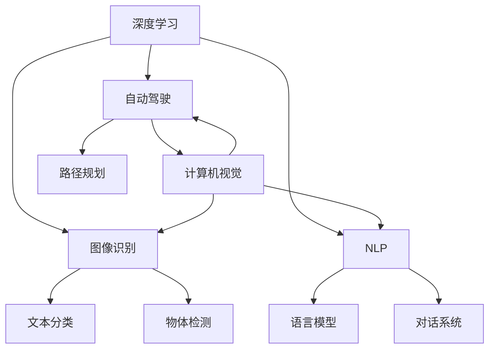

                 

# Andrej Karpathy：人工智能的未来发展前景

## 1. 背景介绍

Andrej Karpathy 是深度学习和计算机视觉领域的顶尖专家，以在NVIDIA和特斯拉的卓越工作而闻名于世。他的研究不仅推动了计算机视觉技术的发展，也为自动驾驶、图像识别等诸多前沿领域提供了关键技术支持。本文将从Andrej Karpathy的视角出发，探讨人工智能（AI）的未来发展前景，包括技术突破、产业应用和社会影响等关键方面。

## 2. 核心概念与联系

### 2.1 核心概念概述

为了深入理解Andrej Karpathy的观点，首先需要对几个关键概念进行梳理：

- **深度学习（Deep Learning）**：通过多层神经网络学习数据表示的机器学习技术，广泛应用于计算机视觉、自然语言处理等领域。
- **自动驾驶（Autonomous Driving）**：结合计算机视觉、传感器融合、路径规划等技术，实现车辆自主导航的系统。
- **图像识别（Image Recognition）**：计算机对图像中的对象进行分类、检测、分割等任务。
- **自然语言处理（NLP）**：使计算机能够理解、生成和处理人类语言的技术，包括文本生成、情感分析、机器翻译等。

这些概念之间通过深度学习技术紧密联系起来，构成了Andrej Karpathy的研究和应用领域。

### 2.2 核心概念原理和架构的 Mermaid 流程图



## 3. 核心算法原理 & 具体操作步骤

### 3.1 算法原理概述

Andrej Karpathy 在深度学习领域的研究重点之一是深度卷积神经网络（CNN）和循环神经网络（RNN），这些网络通过多层次的特征提取和信息传递，能够高效地处理图像和序列数据。

### 3.2 算法步骤详解

#### 3.2.1 图像识别

以图像识别为例，Andrej Karpathy 主要采取以下步骤：

1. **数据准备**：收集并标注大量的图像数据集，如CIFAR-10、ImageNet等。
2. **模型设计**：构建卷积神经网络（CNN），通过多个卷积层、池化层、全连接层进行特征提取和分类。
3. **模型训练**：使用反向传播算法优化模型参数，最小化损失函数，如交叉熵损失。
4. **模型评估**：在验证集上评估模型性能，如准确率、召回率、F1-score等。
5. **模型优化**：调整网络结构、超参数（如学习率、批大小），进一步提升模型性能。

#### 3.2.2 自然语言处理

在NLP领域，Andrej Karpathy 的研究主要集中在语言模型和序列生成任务上，具体步骤包括：

1. **预训练**：在无标签的大规模文本数据上，通过自监督学习（如语言建模）训练语言模型。
2. **微调**：在特定任务（如问答、文本生成）的少量标注数据上，通过有监督学习微调语言模型。
3. **序列生成**：利用微调后的语言模型，生成高质量的自然语言文本，如机器翻译、对话系统等。

### 3.3 算法优缺点

#### 3.3.1 图像识别

**优点**：
- 强大的特征提取能力，能够在高维度空间中学习到复杂的视觉模式。
- 适用于多种图像分类和检测任务，如物体识别、人脸识别等。

**缺点**：
- 对标注数据依赖性强，需要大量高质量的标注数据。
- 模型复杂度较高，训练和推理速度较慢。
- 对抗样本攻击风险高，容易受到噪声干扰。

#### 3.3.2 自然语言处理

**优点**：
- 能够处理自然语言文本，适应性强。
- 序列生成能力强，可以用于生成自然流畅的语言。
- 对数据的依赖相对较小，可以利用无标签数据进行预训练。

**缺点**：
- 模型的可解释性较差，难以理解内部决策过程。
- 对语言噪声敏感，可能受到语法错误、拼写错误的影响。
- 序列生成任务中，模型容易出现长距离依赖问题，导致性能下降。

### 3.4 算法应用领域

Andrej Karpathy 的研究和应用主要集中在以下几个领域：

- **计算机视觉**：用于自动驾驶、图像识别、视频分析等。
- **自动驾驶**：结合传感器融合、路径规划等技术，实现车辆自主导航。
- **自然语言处理**：用于机器翻译、对话系统、文本生成等。
- **游戏AI**：在视频游戏开发中，通过深度学习技术实现智能角色行为和策略。

## 4. 数学模型和公式 & 详细讲解 & 举例说明

### 4.1 数学模型构建

在图像识别任务中，常用的数学模型包括卷积神经网络（CNN）和残差网络（ResNet）。以CNN为例，其基本结构包括卷积层、池化层和全连接层，数学模型可以表示为：

$$
f(x; \theta) = \sigma(\mathcal{F}(x; \theta))
$$

其中 $x$ 为输入图像，$\theta$ 为模型参数，$\sigma$ 为激活函数，$\mathcal{F}$ 为前向传播过程。

### 4.2 公式推导过程

以残差网络为例，其基本结构包括残差块和全连接层，数学模型可以表示为：

$$
\mathcal{F}_{resnet}(x; \theta) = \mathcal{F}_{conv}(x; \theta) + x
$$

其中 $\mathcal{F}_{conv}$ 为卷积层的前向传播过程，$x$ 为残差连接项。

### 4.3 案例分析与讲解

在实际应用中，Andrej Karpathy 经常使用ImageNet数据集进行实验。例如，在ImageNet图像识别竞赛中，他设计了一种多尺度、多层次的卷积神经网络（DenseNet），通过密集连接机制增强特征传递和信息融合，提升了模型的准确率和泛化能力。

## 5. 项目实践：代码实例和详细解释说明

### 5.1 开发环境搭建

Andrej Karpathy 通常使用PyTorch进行深度学习开发。以下是一个简单的PyTorch开发环境搭建过程：

1. 安装Anaconda：从官网下载并安装Anaconda。
2. 创建并激活虚拟环境：
```bash
conda create -n pytorch-env python=3.8 
conda activate pytorch-env
```

3. 安装PyTorch和其他必要的库：
```bash
conda install pytorch torchvision torchaudio cudatoolkit=11.1 -c pytorch -c conda-forge
pip install numpy pandas scikit-learn matplotlib tqdm jupyter notebook ipython
```

### 5.2 源代码详细实现

以下是一个使用PyTorch实现图像分类的示例代码：

```python
import torch
import torch.nn as nn
import torch.optim as optim
from torchvision import datasets, transforms

# 定义卷积神经网络模型
class ConvNet(nn.Module):
    def __init__(self):
        super(ConvNet, self).__init__()
        self.conv1 = nn.Conv2d(3, 32, 3, 1)
        self.pool = nn.MaxPool2d(2, 2)
        self.conv2 = nn.Conv2d(32, 64, 3, 1)
        self.fc1 = nn.Linear(64 * 4 * 4, 128)
        self.fc2 = nn.Linear(128, 10)

    def forward(self, x):
        x = self.pool(F.relu(self.conv1(x)))
        x = self.pool(F.relu(self.conv2(x)))
        x = x.view(-1, 64 * 4 * 4)
        x = F.relu(self.fc1(x))
        x = self.fc2(x)
        return x

# 加载数据集并进行预处理
transform = transforms.Compose([
    transforms.ToTensor(),
    transforms.Normalize((0.5, 0.5, 0.5), (0.5, 0.5, 0.5))
])

train_dataset = datasets.CIFAR10(root='data', train=True, download=True, transform=transform)
test_dataset = datasets.CIFAR10(root='data', train=False, download=True, transform=transform)

# 定义模型、优化器和损失函数
model = ConvNet()
criterion = nn.CrossEntropyLoss()
optimizer = optim.SGD(model.parameters(), lr=0.001, momentum=0.9)

# 训练模型
for epoch in range(10):
    running_loss = 0.0
    for i, data in enumerate(train_loader, 0):
        inputs, labels = data
        optimizer.zero_grad()
        outputs = model(inputs)
        loss = criterion(outputs, labels)
        loss.backward()
        optimizer.step()

        running_loss += loss.item()
        if i % 2000 == 1999:
            print('[%d, %5d] loss: %.3f' %
                  (epoch + 1, i + 1, running_loss / 2000))
            running_loss = 0.0

# 测试模型
correct = 0
total = 0
with torch.no_grad():
    for data in test_loader:
        images, labels = data
        outputs = model(images)
        _, predicted = torch.max(outputs.data, 1)
        total += labels.size(0)
        correct += (predicted == labels).sum().item()

print('Accuracy of the network on the 10000 test images: %d %%' % (
    100 * correct / total))
```

### 5.3 代码解读与分析

上述代码实现了使用卷积神经网络进行CIFAR-10数据集图像分类的完整过程，包括模型定义、数据加载、模型训练和测试等步骤。通过分析代码，可以看出Andrej Karpathy在深度学习应用中的技术思路和实现方法。

## 6. 实际应用场景

### 6.1 自动驾驶

自动驾驶是Andrej Karpathy 研究的重点之一。他领导的Autopilot团队在特斯拉汽车上实现了完全自动驾驶的功能。以下是自动驾驶系统的主要应用场景：

- **环境感知**：通过摄像头、激光雷达等传感器，实时感知周围环境，构建高精度的地图。
- **路径规划**：结合地图和车辆状态，规划最优的行驶路径，避障、变道等。
- **行为决策**：根据交通规则和环境信息，进行行为决策，如加速、减速、停车等。

### 6.2 图像识别

Andrej Karpathy 在图像识别方面的研究也具有重要意义，广泛应用于医疗影像、工业检测等领域。例如，他开发了基于深度学习的皮肤癌图像分类系统，能够自动分类并标注皮肤癌图像，提高诊断效率和准确率。

### 6.3 自然语言处理

在NLP领域，Andrej Karpathy 的研究集中在语言模型和对话系统上。例如，他开发了一种基于Transformer的语言生成模型，能够根据输入的文本生成高质量的自然语言描述，应用于自动摘要、机器翻译等任务。

## 7. 工具和资源推荐

### 7.1 学习资源推荐

Andrej Karpathy 推荐了以下几个重要的学习资源：

1. 《Deep Learning》：由Yoshua Bengio、Ian Goodfellow、Aaron Courville合著的经典教材，系统介绍了深度学习的理论和实践。
2. 《Computer Vision: Algorithms and Applications》：David Forsyth和Jean Ponce合著的经典教材，详细讲解了计算机视觉的核心算法和应用。
3. Coursera的深度学习课程：由Andrew Ng教授授课，涵盖了深度学习的基本概念和应用实例。
4. NVIDIA Deep Learning Blog：Andrej Karpathy 在该博客上分享了大量深度学习的实践经验和研究成果。

### 7.2 开发工具推荐

Andrej Karpathy 推荐了以下几个开发工具：

1. PyTorch：深度学习领域广泛使用的开源框架，提供了丰富的模型和优化器。
2. TensorFlow：Google开发的深度学习框架，支持分布式训练和高效推理。
3. Keras：基于TensorFlow的高层API，提供了简单易用的接口，适合初学者使用。
4. Jupyter Notebook：交互式编程环境，方便快速迭代实验和展示结果。

### 7.3 相关论文推荐

Andrej Karpathy 在深度学习和计算机视觉领域发表了大量论文，以下是其中几篇具有代表性的论文：

1. "Deep Residual Learning for Image Recognition"：提出ResNet结构，解决了深度网络退化问题，取得了ImageNet竞赛的优异成绩。
2. "Learning to Drive with Deep Reinforcement Learning"：应用深度强化学习技术，实现了无人驾驶车辆的自主导航。
3. "Adversarial Examples for Deep-Neural-Network Image Recognition"：探讨了对抗样本攻击的问题，揭示了深度网络的脆弱性。

## 8. 总结：未来发展趋势与挑战

### 8.1 研究成果总结

Andrej Karpathy 的研究成果涵盖了深度学习在计算机视觉、自然语言处理和自动驾驶等多个领域的应用。他的工作不仅推动了学术研究的发展，也为工业界的技术创新和应用落地提供了重要的参考。

### 8.2 未来发展趋势

#### 8.2.1 技术突破

未来，深度学习技术将在以下几个方面取得重要突破：
- **自监督学习**：通过无监督学习任务，如语言模型预训练，进一步提升模型性能。
- **强化学习**：结合深度学习和强化学习技术，实现更加智能的决策和控制。
- **多模态融合**：结合视觉、听觉、文本等多种模态数据，实现更加全面和准确的信息处理。

#### 8.2.2 产业应用

深度学习技术将在以下几个领域得到广泛应用：
- **自动驾驶**：实现更加智能和安全的自动驾驶系统。
- **医疗影像**：提高疾病诊断的准确率和效率。
- **工业检测**：实现更加高效和精确的工业检测和质量控制。
- **自然语言处理**：提升机器翻译、对话系统、自动摘要等任务的性能。

#### 8.2.3 社会影响

深度学习技术将对社会产生深远影响：
- **提高生产效率**：通过自动化和智能化，提高生产和服务效率。
- **改善生活质量**：通过智能家居、健康医疗等应用，提升人们的生活质量。
- **促进创新创业**：激发新的商业模式和技术创新，推动经济社会发展。

### 8.3 面临的挑战

尽管深度学习技术取得了巨大进展，但仍面临以下挑战：
- **数据瓶颈**：大规模标注数据的获取成本较高，限制了深度学习模型的广泛应用。
- **模型复杂度**：深度神经网络的复杂度较高，训练和推理成本较高。
- **算法可解释性**：深度学习模型的决策过程缺乏可解释性，难以理解和调试。
- **伦理和安全**：深度学习模型可能存在偏见和歧视，需要加强伦理和安全研究。

### 8.4 研究展望

未来，深度学习技术将在以下几个方向进行深入研究：
- **可解释性和透明性**：开发更加可解释和透明的深度学习模型，增强算法的可信度和安全性。
- **小样本学习和自适应学习**：研究在少量标注数据下，如何高效学习和适应新任务。
- **跨领域迁移学习**：研究如何实现不同领域之间的知识迁移，提高模型的泛化能力。
- **多模态融合和交互**：研究如何结合多种模态数据，实现更全面和智能的信息处理。

## 9. 附录：常见问题与解答

**Q1: 深度学习算法的可解释性不足，如何改进？**

A: 可解释性是深度学习领域的重要研究方向之一。目前，改进可解释性主要通过以下几个方法：
- **可视化工具**：使用可视化工具，如TensorBoard、Visdom等，展示模型的内部工作机制。
- **局部可解释性**：通过局部可解释性技术，如LIME、SHAP等，解释模型对特定输入的决策过程。
- **全局可解释性**：开发全局可解释性方法，如DeepLift、Adversarial Robustness 3等，增强模型的整体可解释性。

**Q2: 如何处理对抗样本攻击？**

A: 对抗样本攻击是深度学习模型面临的重要挑战。目前，处理对抗样本攻击的主要方法包括：
- **对抗训练**：在训练过程中，引入对抗样本，增强模型的鲁棒性。
- **鲁棒正则化**：在损失函数中加入鲁棒正则化项，防止对抗样本攻击。
- **对抗生成对抗网络（GANs）**：使用GANs生成对抗样本，增强模型的鲁棒性。

**Q3: 如何提高深度学习模型的可解释性？**

A: 提高深度学习模型的可解释性，主要通过以下方法：
- **模型简化**：简化模型结构，降低复杂度，提高可解释性。
- **局部可解释性技术**：通过局部可解释性技术，解释模型对特定输入的决策过程。
- **模型可视化**：使用可视化工具，展示模型的内部工作机制。

**Q4: 如何应对深度学习模型的偏见问题？**

A: 应对深度学习模型的偏见问题，主要通过以下方法：
- **数据多样性**：使用多样化的数据进行训练，减少模型的偏见。
- **算法公平性**：开发公平性算法，如对抗训练、公平正则化等，减少模型的偏见。
- **伦理审查**：建立伦理审查机制，对模型进行定期审查和调整。

**Q5: 如何处理深度学习模型的灾难性遗忘问题？**

A: 灾难性遗忘是深度学习模型在多次微调后，遗忘之前学到的知识的问题。主要通过以下方法解决：
- **知识蒸馏**：将大模型的知识蒸馏到小模型中，保留大模型的重要特征。
- **连续学习**：使用连续学习技术，让模型持续学习新知识，同时保留旧知识。
- **多任务学习**：通过多任务学习，让模型学习多个相关任务，增强模型的记忆能力。

---

作者：禅与计算机程序设计艺术 / Zen and the Art of Computer Programming

