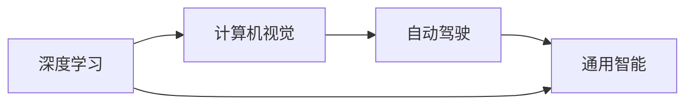

                 

## 1. 背景介绍

Andrej Karpathy，著名的人工智能研究者、深度学习专家，在计算机视觉、机器学习和自动驾驶等领域做出了诸多开创性贡献。他曾任Google AI首席科学家，现任OpenAI研究员，专注于开发具有通用智能的AI系统。本文将探讨Andrej Karpathy对人工智能未来发展前景的独到见解。

## 2. 核心概念与联系

### 2.1 核心概念概述

Andrej Karpathy的工作涉及深度学习、计算机视觉、自动驾驶等多个领域。他的研究聚焦于如何构建具备通用智能能力的AI系统，实现跨模态数据的理解与交互，以及如何通过高效算法提升计算性能。

- **深度学习**：一种通过多层神经网络模拟人脑工作原理的技术，通过反向传播算法优化模型参数，学习数据分布。
- **计算机视觉**：使计算机能够"看"并理解图像和视频内容的技术，涵盖对象检测、图像分割、动作识别等。
- **自动驾驶**：结合计算机视觉和深度学习，使车辆能够自主导航的技术。
- **通用智能**：超越特定任务，具备广泛适用性和人类水平的智能。

这些核心概念之间存在着紧密的联系。深度学习为计算机视觉提供了基础，而计算机视觉又为自动驾驶提供了数据源和算法支持。同时，自动驾驶的复杂性要求AI系统必须具备通用智能，以应对各种复杂的交通场景和动态变化的环境条件。

### 2.2 核心概念原理和架构的 Mermaid 流程图



## 3. 核心算法原理 & 具体操作步骤

### 3.1 算法原理概述

Andrej Karpathy的研究重点之一是深度学习算法的优化，特别是如何提高神经网络的计算效率和训练速度。他提出了多种方法，包括模型并行、迁移学习和知识蒸馏。

- **模型并行**：将一个大型模型拆分为多个子模型，分布在不同的计算设备上并行训练，以提高训练速度。
- **迁移学习**：利用已有领域的知识，在新领域进行训练，以加速模型收敛和提高性能。
- **知识蒸馏**：将一个大型模型的知识迁移到一个小型模型，减少计算资源消耗，同时保持性能。

这些算法原理为深度学习在大规模、复杂任务中的应用提供了理论支撑，推动了AI技术的发展。

### 3.2 算法步骤详解

1. **数据准备**：收集大量数据，涵盖不同场景和任务，如交通视频、图像、传感器数据等。
2. **模型选择与设计**：根据任务需求选择合适的深度学习模型，并进行必要的结构设计。
3. **模型训练与优化**：使用深度学习框架（如PyTorch、TensorFlow）进行模型训练，优化算法（如SGD、Adam）更新模型参数。
4. **迁移学习**：将预训练模型在新任务上进行微调，利用已有知识加速模型训练。
5. **知识蒸馏**：通过知识蒸馏技术，将大规模模型的知识传递给小型模型，提升小模型的性能。
6. **评估与部署**：在实际应用环境中评估模型性能，并进行必要的调整和优化，最终部署到实际系统中。

### 3.3 算法优缺点

#### 优点

- **高效性**：模型并行和知识蒸馏技术提高了训练和推理的效率。
- **鲁棒性**：迁移学习帮助模型更好地适应新任务，提升泛化性能。
- **可扩展性**：这些方法在处理大规模数据和复杂任务时，表现出色。

#### 缺点

- **计算资源需求高**：模型并行和深度学习需要大量的计算资源和存储空间。
- **数据依赖性强**：迁移学习依赖于已有领域的知识，对新领域的数据需求较高。
- **复杂度增加**：知识蒸馏增加了模型的复杂度，可能导致推理速度变慢。

### 3.4 算法应用领域

Andrej Karpathy的研究成果广泛应用于多个领域：

- **自动驾驶**：利用计算机视觉和深度学习，使车辆能够自主导航，提升交通安全。
- **机器人**：通过计算机视觉和感知技术，使机器人能够执行复杂的任务，如家居清洁、物流配送等。
- **医疗**：利用深度学习对医学影像进行分析和诊断，辅助医生进行疾病检测和预测。
- **自然语言处理**：结合自然语言处理和深度学习，开发智能客服、翻译系统等应用。

## 4. 数学模型和公式 & 详细讲解 & 举例说明

### 4.1 数学模型构建

以自动驾驶中的物体检测任务为例，构建一个基于深度学习的数学模型：

- **输入**：摄像头捕捉的车辆和行人视频序列。
- **模型**：卷积神经网络（CNN），用于提取视频帧中的特征。
- **目标**：检测出视频中的车辆和行人，并进行分类。

### 4.2 公式推导过程

假设输入视频序列为 $X=\{x_1,x_2,...,x_t\}$，其中 $x_t$ 表示第 $t$ 帧图像。使用CNN模型提取特征，得到特征表示 $F_t=\{\phi_1(x_t),\phi_2(x_t),...\}$，其中 $\phi_i$ 表示第 $i$ 层的特征提取函数。模型的输出为目标检测框 $B_t=\{b_{i,t},b_{j,t},...\}$，其中 $b_{i,t}$ 表示第 $t$ 帧图像中检测出的第 $i$ 个目标的位置和大小。

目标检测的数学模型可以表示为：

$$
\arg\min_{B_t} \sum_{i=1}^{n} \sum_{t=1}^{T} ||b_{i,t} - \hat{b}_{i,t}||^2
$$

其中 $\hat{b}_{i,t}$ 为CNN模型输出的目标检测框。

### 4.3 案例分析与讲解

以Karpathy在2015年提出的YOLO（You Only Look Once）算法为例，详细讲解其原理和实现：

- **问题定义**：目标检测任务，要求快速检测出视频中的物体。
- **网络结构**：YOLO使用单个CNN网络，将输入图像分成 $S \times S$ 个网格，每个网格预测一个物体的边界框和类别概率。
- **训练过程**：使用标签数据训练网络，优化损失函数。
- **推理过程**：对输入图像进行网格化处理，提取特征，每个网格输出一个边界框和类别概率，通过非极大值抑制（NMS）技术进行筛选，得到最终的检测结果。

YOLO算法在目标检测任务中取得了优异的性能，其单阶段检测、速度快、精度高，成为计算机视觉领域的重要里程碑。

## 5. 项目实践：代码实例和详细解释说明

### 5.1 开发环境搭建

1. **安装Python和PyTorch**：
   ```bash
   pip install torch torchvision
   ```

2. **安装YOLO库**：
   ```bash
   pip install yolo
   ```

3. **下载YOLO模型权重和数据集**：
   ```bash
   wget https://pjreddie.com/media/files/yolov3.weights
   wget https://pjreddie.com/datasets/yolo3-detection-dataset
   ```

### 5.2 源代码详细实现

以下是一个简单的YOLO目标检测实现：

```python
import torch
import yolo

# 加载YOLO模型和权重
model = yolo.YOLO()
model.load_weights('yolov3.weights')

# 加载数据集
dataset = yolo.load_dataset('yolo3-detection-dataset')

# 测试模型
for data in dataset:
    image, labels = data
    with torch.no_grad():
        outputs = model(image)
        predictions = outputs[0]
        confidences, boxes = predictions.chunk(2, dim=1)
        confidences = confidences.sigmoid()
        boxes = boxes

    # 处理预测结果
    indices = torch.argsort(confidences, dim=1, descending=True)
    boxes = boxes[indices]
    labels = labels[indices]

    # 可视化结果
    yolo.show_image(image, boxes, labels)
```

### 5.3 代码解读与分析

**YOLO模型加载**：
- `yolo.YOLO()`：创建YOLO模型实例。
- `model.load_weights('yolov3.weights')`：加载YOLO模型权重文件。

**数据集加载**：
- `yolo.load_dataset('yolo3-detection-dataset')`：加载YOLO数据集。

**模型测试**：
- `with torch.no_grad():`：开启无梯度模式，加速推理速度。
- `outputs = model(image)`：输入图像，得到模型输出。
- `predictions = outputs[0]`：获取模型预测结果。
- `confidences, boxes = predictions.chunk(2, dim=1)`：将预测结果拆分为置信度和边界框。
- `confidences = confidences.sigmoid()`：对置信度进行sigmoid函数处理，使其值在[0,1]之间。
- `boxes = boxes`：直接使用边界框。

**预测结果处理**：
- `indices = torch.argsort(confidences, dim=1, descending=True)`：对置信度排序，取置信度最高的前 $N$ 个预测结果。
- `boxes = boxes[indices]`：根据置信度排序，重新排列边界框。
- `labels = labels[indices]`：根据置信度排序，重新排列类别标签。

**可视化结果**：
- `yolo.show_image(image, boxes, labels)`：对预测结果进行可视化。

## 6. 实际应用场景

### 6.1 自动驾驶

Andrej Karpathy在自动驾驶领域的贡献主要体现在计算机视觉和深度学习技术的应用上。他的团队开发了多款自动驾驶车辆，如Ghost Driver、Neural Network Car等，通过计算机视觉技术实现车道保持、行人检测、交通标志识别等功能。

### 6.2 机器人

Karpathy在机器人视觉和感知技术方面也做出了重要贡献。他开发的机器人可以通过摄像头和传感器实时处理环境信息，进行目标检测、路径规划等任务。

### 6.3 医疗

Karpathy参与开发了基于深度学习的医学影像分析工具，用于乳腺癌检测、视网膜病变分析等任务。这些工具能够自动分析医学影像，辅助医生进行诊断。

### 6.4 未来应用展望

Andrej Karpathy认为，未来的人工智能将具备更加广泛的适用性和更高的智能水平。以下是一些可能的应用场景：

- **跨模态交互**：AI系统能够理解和处理多种模态数据，如文本、语音、图像等，实现跨模态交互。
- **多领域融合**：AI系统能够结合不同领域的数据和知识，实现更广泛的应用场景。
- **通用智能**：AI系统将具备人类水平的智能，能够在各种任务上表现出色。

## 7. 工具和资源推荐

### 7.1 学习资源推荐

1. **深度学习入门教程**：
   - [深度学习入门：从零到一](https://www.deeplearningbook.org/zh)

2. **计算机视觉课程**：
   - [CS231n：卷积神经网络](https://cs231n.stanford.edu/)

3. **自动驾驶课程**：
   - [Udacity自动驾驶纳米学位](https://www.udacity.com/course/autonomous-vehicles-nanodegree--nd897)

4. **机器人视觉技术**：
   - [机器人视觉与深度学习](https://www.robots.ai/)

5. **医学影像分析教程**：
   - [医学影像深度学习](https://www.deeplearningmedicine.com/)

### 7.2 开发工具推荐

1. **深度学习框架**：
   - [PyTorch](https://pytorch.org/)
   - [TensorFlow](https://www.tensorflow.org/)

2. **计算机视觉库**：
   - [OpenCV](https://opencv.org/)
   - [Pillow](https://python-pillow.org/)

3. **自动驾驶平台**：
   - [Waymo](https://waymo.com/)

### 7.3 相关论文推荐

1. **深度学习在计算机视觉中的应用**：
   - [ImageNet classification with deep convolutional neural networks](https://papers.nips.cc/paper/4824-imagenet-classification-with-deep-convolutional-neural-networks.pdf)

2. **YOLO算法**：
   - [You Only Look Once: Unified, Real-Time Object Detection](https://arxiv.org/abs/1612.08242)

3. **自动驾驶技术**：
   - [End-to-End Learning for Self-Driving Cars](https://arxiv.org/abs/1604.04382)

4. **机器人视觉技术**：
   - [Learning to See in the Dark: Deep Visual Odometry](https://arxiv.org/abs/1612.04122)

5. **医学影像分析**：
   - [Deep Residual Learning for Image Recognition](https://arxiv.org/abs/1512.03385)

## 8. 总结：未来发展趋势与挑战

### 8.1 研究成果总结

Andrej Karpathy在深度学习、计算机视觉、自动驾驶等领域做出了重要贡献。他的研究工作推动了AI技术在各个领域的应用和发展，为未来的AI研究指明了方向。

### 8.2 未来发展趋势

1. **跨模态交互**：未来的AI系统将具备更强的跨模态理解能力，实现更加丰富和多样的应用场景。
2. **多领域融合**：AI系统将结合不同领域的数据和知识，实现更广泛的应用场景。
3. **通用智能**：AI系统将具备更加广泛和高级的智能，能够在各种任务上表现出色。

### 8.3 面临的挑战

1. **计算资源需求高**：深度学习和大规模模型的训练和推理需要大量的计算资源和存储空间。
2. **数据依赖性强**：迁移学习依赖于已有领域的知识，对新领域的数据需求较高。
3. **复杂度增加**：知识蒸馏增加了模型的复杂度，可能导致推理速度变慢。

### 8.4 研究展望

未来，AI研究将更加注重跨模态理解、多领域融合和通用智能，推动AI技术向更加智能和普及化的方向发展。同时，如何提高计算效率、降低资源消耗和提升模型性能将是未来研究的重点。

## 9. 附录：常见问题与解答

**Q1：深度学习与传统机器学习相比有何优势？**

A：深度学习在处理大规模数据时表现出色，能够自动学习数据中的特征，具有更强的泛化能力。相比传统机器学习，深度学习在图像识别、语音识别、自然语言处理等领域取得了突破性进展。

**Q2：计算机视觉技术的主要应用场景有哪些？**

A：计算机视觉技术的主要应用场景包括人脸识别、物体检测、图像分割、动作识别等。这些技术被广泛应用于安防、医疗、自动驾驶等领域。

**Q3：什么是知识蒸馏？**

A：知识蒸馏是一种模型迁移学习技术，通过将大规模模型的知识迁移到小型模型，提升小模型的性能。

**Q4：YOLO算法的优势是什么？**

A：YOLO算法具有单阶段检测、速度快、精度高等优势，能够在大规模目标检测任务中表现出色。

**Q5：Andrej Karpathy的研究方向有哪些？**

A：Andrej Karpathy的研究方向包括深度学习、计算机视觉、自动驾驶、机器人视觉等，推动了AI技术在各个领域的应用和发展。

