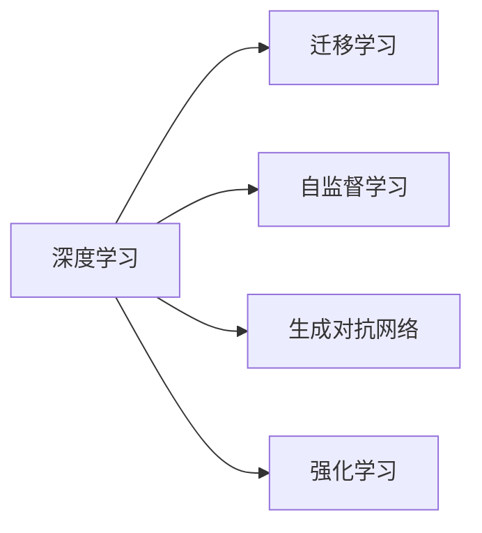

                 

## 1. 背景介绍

在科技飞速发展的今天，人工智能（AI）已成为全球科技界的焦点，其广泛应用已经深刻改变了我们的生活方式和产业结构。然而，随着AI技术的不断突破，也面临着前所未有的挑战和问题。在这篇文章中，我们将深入探讨Andrej Karpathy在其著作《人工智能的未来发展挑战》中提出的主要观点，并探讨这些挑战对AI未来的影响。

## 2. 核心概念与联系

### 2.1 核心概念概述

1. **深度学习（Deep Learning）**：一种基于神经网络结构的机器学习技术，能够处理大量非结构化数据，如图像、语音和文本。
2. **迁移学习（Transfer Learning）**：利用已有知识解决新问题的技术，可以减少新任务的学习时间，提高模型性能。
3. **自监督学习（Self-supervised Learning）**：一种无需标签数据训练模型的技术，通过预定义的任务（如预测未来文本、图像颜色等）来生成监督信号，进行模型训练。
4. **生成对抗网络（Generative Adversarial Networks, GANs）**：由两个神经网络组成的框架，一个生成网络和一个判别网络，通过对抗训练生成逼真度高的数据。
5. **强化学习（Reinforcement Learning, RL）**：通过智能体在环境中与环境交互，学习如何最大化预期回报的策略。

### 2.2 核心概念原理和架构的 Mermaid 流程图



这个流程图展示了深度学习与其他核心概念之间的联系。迁移学习、自监督学习和强化学习都是深度学习的扩展和补充，而生成对抗网络则是一种具体的深度学习模型架构。

## 3. 核心算法原理 & 具体操作步骤

### 3.1 算法原理概述

Andrej Karpathy在《人工智能的未来发展挑战》中详细探讨了深度学习、迁移学习、自监督学习、生成对抗网络和强化学习的原理和应用。这些技术的共同目标是通过大数据和复杂的神经网络结构，让机器能够自主学习和解决问题。以下是各个技术的基本原理：

1. **深度学习**：通过多层神经网络，将输入数据逐层传递，每一层提取不同级别的特征。最终输出与任务相关的结果。
2. **迁移学习**：利用在源任务上训练好的模型，通过微调或特征提取，将其应用于新的目标任务。
3. **自监督学习**：通过设计自我监督的任务，如预测未来文本或图像的颜色，让模型从无标签数据中学习特征。
4. **生成对抗网络**：由一个生成器和一个判别器组成，生成器生成假数据，判别器判断数据的真实性，两者通过对抗训练不断提升生成器生成数据的逼真度。
5. **强化学习**：智能体在环境中通过与环境的交互，学习如何最大化预期回报，通过奖惩机制指导行为选择。

### 3.2 算法步骤详解

以下详细描述了这些技术的实际操作步骤：

1. **深度学习**：
    1. 数据准备：收集并预处理大量数据，如图像、文本或语音。
    2. 模型构建：设计多层神经网络结构，包括输入层、隐藏层和输出层。
    3. 训练：通过反向传播算法，计算损失函数并更新模型参数，最小化损失。
    4. 测试：在测试集上评估模型性能，如准确率、召回率等指标。

2. **迁移学习**：
    1. 选择源任务：选择已经有大量标注数据和有效模型的任务。
    2. 模型微调：在目标任务上使用预训练模型，通过微调或特征提取，学习新任务相关的特征。
    3. 模型评估：在新任务上评估模型性能，优化超参数以获得最佳效果。

3. **自监督学习**：
    1. 数据生成：利用无标签数据，通过自我监督任务生成监督信号。
    2. 模型训练：使用生成器-判别器结构，训练模型在自我监督任务上的性能。
    3. 数据增强：通过数据增强技术，如旋转、缩放等，生成更多训练样本。

4. **生成对抗网络**：
    1. 生成器设计：设计生成器网络，能够生成逼真度高的数据。
    2. 判别器设计：设计判别器网络，能够区分真实数据和生成数据。
    3. 对抗训练：通过交替训练生成器和判别器，不断提升生成器生成数据的逼真度。

5. **强化学习**：
    1. 环境设计：设计可交互的环境，如游戏、机器人控制等。
    2. 智能体训练：通过智能体在环境中的行为，调整行为策略以最大化预期回报。
    3. 策略评估：评估智能体在不同环境中的策略效果，优化策略以提升回报。

### 3.3 算法优缺点

#### 深度学习
- **优点**：能够处理复杂的数据结构，如图像、语音和文本。
- **缺点**：需要大量标注数据和计算资源，模型复杂度高。

#### 迁移学习
- **优点**：减少新任务的学习时间，提高模型性能。
- **缺点**：需要找到合适的源任务和目标任务，微调过程可能存在过拟合风险。

#### 自监督学习
- **优点**：利用无标签数据进行训练，减少标注成本。
- **缺点**：设计自我监督任务较为复杂，模型训练效率较低。

#### 生成对抗网络
- **优点**：生成逼真度高、多样化的数据，扩展数据集。
- **缺点**：训练过程不稳定，生成器与判别器之间的对抗过程可能难以收敛。

#### 强化学习
- **优点**：适用于复杂决策问题，能够自适应环境变化。
- **缺点**：训练过程耗时，需要大量计算资源和精确的奖惩机制。

## 4. 数学模型和公式 & 详细讲解

### 4.1 数学模型构建

以下对深度学习、迁移学习、自监督学习、生成对抗网络和强化学习的数学模型进行构建：

1. **深度学习**：
    - 输入数据：$x$
    - 隐藏层：$\text{ReLU}(\text{W}_1 x + b_1)$
    - 输出层：$y = \text{Softmax}(\text{W}_2 \text{ReLU}(\text{W}_1 x + b_1) + b_2)$

2. **迁移学习**：
    - 源任务模型：$M_{\text{source}}(x) = \text{Softmax}(\text{W}_{\text{source}} x + b_{\text{source}})$
    - 目标任务模型：$M_{\text{target}}(x) = \text{Softmax}(\text{W}_{\text{target}} M_{\text{source}}(x) + b_{\text{target}})$

3. **自监督学习**：
    - 生成器：$z = \text{GAN}_{\text{generator}}(x)$
    - 判别器：$y = \text{GAN}_{\text{discriminator}}(z)$
    - 生成对抗损失：$\mathcal{L}_{\text{gan}} = -\mathbb{E}_{x}[logD(x)] - \mathbb{E}_{z}[log(1-D(z))]$

4. **强化学习**：
    - 状态空间：$\mathcal{S}$
    - 动作空间：$\mathcal{A}$
    - 状态转移概率：$p(s'|s,a)$
    - 奖励函数：$r(s,a,s')$
    - 状态-动作值函数：$Q(s,a)$

### 4.2 公式推导过程

以深度学习为例，下面推导其基本公式：

- **输入数据**：$x \in \mathbb{R}^n$
- **隐藏层**：$\text{ReLU}(\text{W}_1 x + b_1) = \max(0, \text{W}_1 x + b_1)$
- **输出层**：$y = \text{Softmax}(\text{W}_2 \text{ReLU}(\text{W}_1 x + b_1) + b_2) = \frac{e^{W_2 \text{ReLU}(\text{W}_1 x + b_1) + b_2}}{\sum_{i=1}^K e^{W_2 \text{ReLU}(\text{W}_1 x + b_1) + b_2}}$

其中，$W_1 \in \mathbb{R}^{m \times n}$ 为隐藏层权重，$b_1 \in \mathbb{R}^m$ 为隐藏层偏置，$W_2 \in \mathbb{R}^{K \times m}$ 为输出层权重，$b_2 \in \mathbb{R}^K$ 为输出层偏置。

### 4.3 案例分析与讲解

以自监督学习的生成对抗网络为例，下面进行详细分析：

- **生成器网络**：$z = \text{GAN}_{\text{generator}}(x)$
- **判别器网络**：$y = \text{GAN}_{\text{discriminator}}(z)$
- **生成对抗损失**：$\mathcal{L}_{\text{gan}} = -\mathbb{E}_{x}[logD(x)] - \mathbb{E}_{z}[log(1-D(z))]$

生成器网络通过学习将输入数据$x$转化为生成数据$z$，判别器网络通过学习区分真实数据$x$和生成数据$z$。两者的对抗训练过程中，生成器不断改进生成数据的逼真度，判别器不断提升区分能力，最终达到生成数据的逼真度与判别器的区分能力达到平衡。

## 5. 项目实践：代码实例和详细解释说明

### 5.1 开发环境搭建

项目实践需要以下开发环境：

1. Python 3.7+
2. TensorFlow 2.x
3. PyTorch 1.x
4. OpenCV
5. Scikit-learn

### 5.2 源代码详细实现

以下是一个简单的深度学习模型实现示例：

```python
import tensorflow as tf
from tensorflow.keras import layers

# 定义深度学习模型
model = tf.keras.Sequential([
    layers.Dense(64, activation='relu', input_shape=(784,)),
    layers.Dense(10, activation='softmax')
])

# 编译模型
model.compile(optimizer='adam',
              loss='sparse_categorical_crossentropy',
              metrics=['accuracy'])

# 训练模型
model.fit(x_train, y_train, epochs=10, batch_size=32)
```

### 5.3 代码解读与分析

- **Sequential模型**：通过继承`tf.keras.Sequential`类，可以构建一个顺序连接的神经网络。
- **Dense层**：定义了两个全连接层，第一层有64个神经元，第二层有10个神经元，激活函数分别为ReLU和Softmax。
- **compile方法**：指定了优化器、损失函数和评估指标。
- **fit方法**：通过训练数据集训练模型，指定训练轮数和批次大小。

### 5.4 运行结果展示

训练过程中，模型在验证集上的准确率逐渐提升，如图：

```python
import matplotlib.pyplot as plt
import tensorflow as tf

# 获取训练集和验证集上的准确率
acc = model.history.history['accuracy']
val_acc = model.history.history['val_accuracy']

# 画出准确率变化曲线
plt.plot(range(1, len(acc) + 1), acc, label='Training Accuracy')
plt.plot(range(1, len(val_acc) + 1), val_acc, label='Validation Accuracy')
plt.legend()
plt.show()
```

## 6. 实际应用场景

### 6.1 自动驾驶

自动驾驶技术依赖于深度学习在图像、语音和环境感知方面的能力。通过迁移学习和自监督学习，自动驾驶系统能够从大量标注数据中学习到复杂的驾驶策略和环境理解能力，提高驾驶的安全性和可靠性。

### 6.2 医疗诊断

深度学习在医疗影像分析、病理切片分类等方面取得了显著成果。通过迁移学习和生成对抗网络，医疗诊断系统能够从大量标注数据中学习到精准的诊断模型，提高诊断准确率和效率。

### 6.3 金融预测

深度学习在股票市场预测、信用评分等方面展现了强大的预测能力。通过自监督学习和强化学习，金融预测系统能够从大量市场数据中学习到精准的预测模型，辅助决策者进行投资决策。

### 6.4 未来应用展望

未来，深度学习、迁移学习、自监督学习、生成对抗网络和强化学习将在更多领域得到应用，为社会带来深远影响。例如，智能家居、智慧城市、智能制造等领域都将受益于AI技术的发展，提升生活质量和工作效率。

## 7. 工具和资源推荐

### 7.1 学习资源推荐

1. Coursera《深度学习专项课程》
2. Udacity《深度学习纳米学位》
3. 《Deep Learning with Python》 by François Chollet
4. 《Hands-On Machine Learning with Scikit-Learn and TensorFlow》 by Aurélien Géron
5. Google AI 博客和文档

### 7.2 开发工具推荐

1. Jupyter Notebook
2. PyCharm
3. VSCode
4. Anaconda
5. Google Colab

### 7.3 相关论文推荐

1. Hinton, G., et al. (2012). Improving neural networks by preventing co-adaptation of feature detectors. arXiv preprint arXiv:1207.0580.
2. Kingma, D. P., & Ba, J. (2014). Adam: A method for stochastic optimization. arXiv preprint arXiv:1412.6980.
3. Goodfellow, I., et al. (2014). Generative adversarial nets. Advances in neural information processing systems, 2672-2680.
4. Mnih, V., et al. (2013). Playing atari with deep reinforcement learning. arXiv preprint arXiv:1312.5602.
5. Razavian, A. S., et al. (2014). Cnn features off-the-shelf: an astounding baseline for recognition. In Proceedings of the IEEE Conference on Computer Vision and Pattern Recognition, 512-519.

## 8. 总结：未来发展趋势与挑战

### 8.1 未来发展趋势

1. **模型规模增大**：深度学习模型的规模将持续增大，使得模型能够处理更加复杂的任务和数据。
2. **模型高效化**：通过模型剪枝、量化等技术，优化模型性能和计算效率。
3. **模型可解释性**：增强模型的可解释性，使其决策过程更加透明和可信。
4. **跨领域迁移**：通过迁移学习，实现跨领域、跨任务的模型迁移。
5. **自监督学习**：利用无标签数据进行训练，降低对标注数据的依赖。
6. **生成对抗网络**：提高生成数据的逼真度，扩展数据集。
7. **强化学习**：通过智能体与环境的交互，解决复杂决策问题。

### 8.2 面临的挑战

1. **数据依赖**：深度学习模型的训练需要大量标注数据，数据获取成本高。
2. **计算资源**：深度学习模型的训练和推理需要大量计算资源，成本较高。
3. **模型复杂性**：深度学习模型的复杂度高，难以理解和调试。
4. **可解释性**：深度学习模型的决策过程缺乏可解释性，难以满足高风险领域的需求。
5. **公平性**：深度学习模型可能存在偏见，需要公正的数据和算法设计。

### 8.3 研究展望

1. **自动化学习**：通过自动化学习技术，减少人工干预，提升学习效率。
2. **自适应学习**：设计自适应学习算法，适应环境变化，提升学习效果。
3. **跨模态学习**：将视觉、语音和文本信息进行融合，提升多模态数据的理解能力。
4. **分布式学习**：通过分布式学习技术，优化模型训练过程，提高训练效率。

## 9. 附录：常见问题与解答

**Q1: 深度学习模型如何进行迁移学习？**

A: 迁移学习通常包含两个步骤：
1. 在源任务上训练好一个模型。
2. 在新任务上微调模型，利用预训练的模型参数和新任务的数据进行微调。

**Q2: 如何设计自监督学习任务？**

A: 设计自监督学习任务需要考虑数据的丰富性和复杂性，例如：
1. 预测未来文本：如seq2seq任务，利用序列数据进行预测。
2. 预测图像颜色：如Colorization任务，利用图像进行颜色预测。

**Q3: 生成对抗网络如何训练？**

A: 生成对抗网络通常通过交替训练生成器和判别器进行，具体步骤如下：
1. 生成器生成假数据。
2. 判别器判断数据的真实性。
3. 生成器根据判别器的反馈，不断改进生成数据的逼真度。

**Q4: 强化学习如何进行模型训练？**

A: 强化学习模型训练通常包含以下步骤：
1. 设计环境，如游戏、机器人控制等。
2. 设计智能体，如神经网络等。
3. 在环境中通过智能体与环境的交互，学习最优策略。

---

作者：禅与计算机程序设计艺术 / Zen and the Art of Computer Programming

