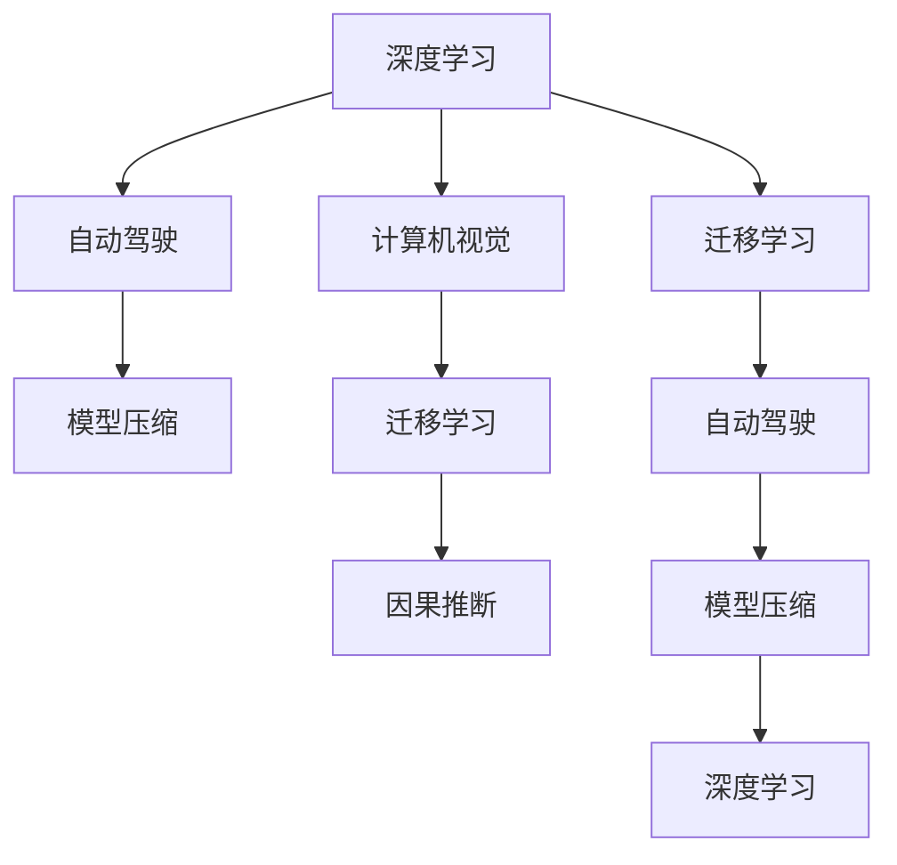

                 

# Andrej Karpathy：人工智能的未来发展挑战

> 关键词：Andrej Karpathy, 人工智能, 深度学习, 计算机视觉, 自动驾驶, 机器学习

## 1. 背景介绍

### 1.1 问题由来
Andrej Karpathy，斯坦福大学教授，也是NVIDIA的高级研究科学家，在深度学习和计算机视觉领域做出了重要贡献。他的研究工作主要集中在自动驾驶、图像生成和视频理解等方向，并领导了NVIDIA自动驾驶平台Drive PX的计算机视觉系统开发。

Andrej Karpathy的论文和演讲深受业界关注，他的观点往往能引导AI领域的发展方向。本文将基于Andrej Karpathy近期对人工智能未来的展望，探讨其在深度学习、自动驾驶和计算机视觉等领域所面临的挑战和机遇。

## 2. 核心概念与联系

### 2.1 核心概念概述

为更好地理解Andrej Karpathy的观点，本节将介绍几个与他研究紧密相关的核心概念：

- **深度学习**：基于神经网络的机器学习方法，旨在让计算机具备类似于人类的学习能力和决策能力。
- **计算机视觉**：使计算机能理解和分析图像、视频等视觉信息的科学和技术，应用于图像分类、目标检测、姿态估计等任务。
- **自动驾驶**：利用计算机视觉和深度学习等技术，使车辆具备自主导航和决策能力，实现自动驾驶。
- **模型压缩**：通过剪枝、量化、蒸馏等技术，减少深度学习模型的参数和计算量，提高模型效率。
- **迁移学习**：通过将一个领域的知识迁移到另一个领域，加快模型训练过程，提高模型泛化能力。
- **因果推断**：推断因果关系，解决变量间相互影响的问题，广泛应用于AI领域的决策和推理任务。

这些核心概念之间的逻辑关系可以通过以下Mermaid流程图来展示：



这个流程图展示了他的核心研究领域的相互关系：

1. 深度学习作为基础技术，为计算机视觉和自动驾驶提供了数据驱动的学习方法。
2. 计算机视觉通过深度学习技术，解析图像和视频信息，并应用到自动驾驶中。
3. 自动驾驶通过深度学习实现自主导航，使用计算机视觉解析周围环境信息。
4. 模型压缩提高了深度学习模型的效率，使计算机视觉和自动驾驶得以实现实时计算。
5. 迁移学习加快了新任务的训练过程，提升模型的泛化能力。
6. 因果推断解决了变量之间的依赖关系，在决策和推理任务中发挥重要作用。

这些核心概念共同构成了Andrej Karpathy的研究框架，为他的人工智能研究提供了理论和方法基础。

## 3. 核心算法原理 & 具体操作步骤

### 3.1 算法原理概述

Andrej Karpathy的工作主要集中在计算机视觉和自动驾驶领域，以下是他在深度学习算法方面的主要贡献和原理概述：

- **神经网络结构设计**：设计了多种神经网络结构，如ResNet、CaffeNet、InceptionNet等，用于图像分类和目标检测。
- **大规模数据集生成**：使用计算机视觉技术生成大规模数据集，如ImageNet、COCO等，为深度学习模型训练提供数据支持。
- **视频理解**：提出了多个视频理解算法，如Space-To-Time卷积、基于兴趣区域的特征提取、三维卷积网络等，用于视频中物体检测和行为识别。
- **自监督学习**：研究了自监督学习技术，通过预训练模型，在大规模无标签数据上学习语言和图像的表示。

### 3.2 算法步骤详解

以下是Andrej Karpathy在深度学习算法方面的主要操作步骤：

1. **数据收集与预处理**：收集大规模图像和视频数据，并进行数据增强、标注等预处理操作。
2. **模型训练**：使用深度学习框架如PyTorch、TensorFlow等，设计并训练神经网络模型。
3. **模型评估**：在验证集和测试集上评估模型性能，如准确率、召回率、F1-score等。
4. **模型调优**：根据评估结果，调整模型参数和超参数，优化模型性能。
5. **部署与测试**：将模型部署到实际应用场景，进行实时测试和性能监控。

### 3.3 算法优缺点

Andrej Karpathy的深度学习算法具有以下优点：

- **准确率高**：通过设计合理的神经网络结构，能够实现高精度的图像和视频分类。
- **适应性强**：自监督学习和迁移学习技术，使模型能够快速适应新任务和新数据。
- **计算效率高**：通过模型压缩和优化，提高了深度学习模型的计算效率。

同时，这些算法也存在一些缺点：

- **数据依赖性强**：深度学习模型需要大规模标注数据进行训练，数据获取成本高。
- **模型复杂度高**：深度神经网络结构复杂，训练和推理计算量较大。
- **鲁棒性不足**：模型对输入数据的微小扰动敏感，鲁棒性有待提高。

### 3.4 算法应用领域

Andrej Karpathy的研究成果广泛应用于计算机视觉和自动驾驶等领域：

- **图像分类**：用于识别图像中的物体和场景，广泛应用于安防、零售、医疗等行业。
- **目标检测**：用于检测图像中的物体位置和数量，如自动驾驶中的交通标志识别、无人机中的障碍物检测等。
- **行为识别**：分析视频中人物的行为，如行为识别、情感分析等。
- **自动驾驶**：通过计算机视觉和深度学习技术，实现车辆的自主导航和决策，提高道路安全性和交通效率。

## 4. 数学模型和公式 & 详细讲解 & 举例说明

### 4.1 数学模型构建

Andrej Karpathy的深度学习模型通常使用以下数学模型进行构建：

- **卷积神经网络(CNN)**：用于图像分类和目标检测，模型结构如下：
  $$
  f(x) = \sigma(W_2 \sigma(W_1 x + b_1) + b_2)
  $$
  其中，$W_1$ 和 $W_2$ 为卷积核和全连接层权重，$b_1$ 和 $b_2$ 为偏置，$\sigma$ 为激活函数。

- **循环神经网络(RNN)**：用于处理序列数据，如自然语言处理，模型结构如下：
  $$
  f(x_t) = \sigma(W_x x_{t-1} + W_h h_{t-1} + b)
  $$
  其中，$W_x$ 和 $W_h$ 为输入和隐藏层权重，$x_{t-1}$ 和 $h_{t-1}$ 为前一时刻的输入和隐藏状态，$b$ 为偏置。

### 4.2 公式推导过程

以卷积神经网络为例，推导其前向传播过程。假设输入为 $x$，卷积核为 $W$，偏置为 $b$，激活函数为 $\sigma$，则卷积神经网络的前向传播过程为：

1. 卷积层：
   $$
   f(x) = \sigma(W x + b)
   $$

2. 池化层：
   $$
   f(x) = \max \{W x\}
   $$

3. 全连接层：
   $$
   f(x) = \sigma(W x + b)
   $$

### 4.3 案例分析与讲解

以图像分类任务为例，分析Andrej Karpathy提出的ResNet模型。ResNet通过残差连接解决了深度网络训练中的梯度消失问题，其模型结构如下：


ResNet的残差连接设计使得深度网络的训练变得更容易，其核心思想是让模型能够学习到更深的层次，避免梯度消失问题。具体来说，假设输入为 $x$，输出为 $y$，中间层为 $h$，则残差连接过程为：

$$
y = f(x) + h
$$

其中 $f(x)$ 为前向传播计算得到的输出，$h$ 为中间层输出，$x$ 为输入。

## 5. 项目实践：代码实例和详细解释说明

### 5.1 开发环境搭建

以下是使用PyTorch搭建深度学习项目的开发环境：

1. 安装Anaconda：
   ```
   conda install anaconda
   ```

2. 创建并激活虚拟环境：
   ```
   conda create -n myenv python=3.7
   conda activate myenv
   ```

3. 安装PyTorch：
   ```
   conda install torch torchvision torchaudio
   ```

4. 安装TensorBoard：
   ```
   pip install tensorboard
   ```

5. 安装NVIDIA CUDA库：
   ```
   conda install pytorch torchvision torchaudio cudatoolkit=11.1 -c pytorch -c conda-forge
   ```

### 5.2 源代码详细实现

以下是使用PyTorch实现图像分类任务的代码：

```python
import torch
import torch.nn as nn
import torch.optim as optim
import torchvision
import torchvision.transforms as transforms

class Net(nn.Module):
    def __init__(self):
        super(Net, self).__init__()
        self.conv1 = nn.Conv2d(3, 6, 5)
        self.pool = nn.MaxPool2d(2, 2)
        self.conv2 = nn.Conv2d(6, 16, 5)
        self.fc1 = nn.Linear(16 * 5 * 5, 120)
        self.fc2 = nn.Linear(120, 84)
        self.fc3 = nn.Linear(84, 10)

    def forward(self, x):
        x = self.pool(nn.functional.relu(self.conv1(x)))
        x = self.pool(nn.functional.relu(self.conv2(x)))
        x = x.view(-1, 16 * 5 * 5)
        x = nn.functional.relu(self.fc1(x))
        x = nn.functional.relu(self.fc2(x))
        x = self.fc3(x)
        return x

net = Net()
criterion = nn.CrossEntropyLoss()
optimizer = optim.SGD(net.parameters(), lr=0.001, momentum=0.9)

# 加载数据集
train_loader = torch.utils.data.DataLoader(
    torchvision.datasets.CIFAR10(root='./data', train=True, download=True,
                                transform=transforms.Compose([
                                    transforms.ToTensor(),
                                    transforms.Normalize((0.5, 0.5, 0.5), (0.5, 0.5, 0.5))),
    batch_size=4, shuffle=True, num_workers=2)

# 训练模型
for epoch in range(2):
    running_loss = 0.0
    for i, data in enumerate(train_loader, 0):
        inputs, labels = data
        optimizer.zero_grad()
        outputs = net(inputs)
        loss = criterion(outputs, labels)
        loss.backward()
        optimizer.step()

        running_loss += loss.item()
        if i % 2000 == 1999:
            print('[%d, %5d] loss: %.3f' % (epoch + 1, i + 1, running_loss / 2000))
            running_loss = 0.0

print('Finished Training')
```

### 5.3 代码解读与分析

在代码实现中，使用了PyTorch框架搭建了一个简单的卷积神经网络，用于图像分类任务。其中，定义了一个Net类作为模型，包含卷积层、池化层和全连接层。在训练过程中，使用了交叉熵损失函数和随机梯度下降优化器。代码中还利用了数据增强和归一化技术，提高了模型泛化能力。

## 6. 实际应用场景

### 6.1 智能驾驶

Andrej Karpathy的研究成果广泛应用于智能驾驶领域，如自动驾驶车辆的目标检测和行为识别。通过计算机视觉技术，自动驾驶车辆能够感知周围环境，并根据实时信息做出决策。

### 6.2 医疗影像分析

在医疗影像分析中，深度学习模型能够自动识别病变区域，辅助医生进行诊断。例如，使用卷积神经网络对医学影像进行分类，识别肿瘤、骨折等病变。

### 6.3 自然语言处理

Andrej Karpathy还研究了自然语言处理技术，如文本生成、机器翻译等。通过深度学习模型，自然语言处理技术能够理解和生成自然语言，应用于智能客服、语音识别等领域。

### 6.4 未来应用展望

未来，Andrej Karpathy的研究将进一步推动深度学习、计算机视觉和自动驾驶等领域的发展，其主要展望如下：

1. **更高效的模型**：通过模型压缩和优化，实现更高效的深度学习模型，支持大规模实时计算。
2. **更普适的算法**：设计更普适的深度学习算法，能够应用于更广泛的任务和数据。
3. **更智能的决策**：利用因果推断技术，实现更智能的决策和推理，解决变量间的依赖关系。
4. **更安全的系统**：通过模型鲁棒性优化，提高系统的稳定性和安全性，避免异常情况下的误判。

## 7. 工具和资源推荐

### 7.1 学习资源推荐

1. **Deep Learning Specialization**：由Andrew Ng开设的深度学习课程，涵盖深度学习的基础知识和前沿技术，适合初学者和进阶学习者。
2. **CS231n: Convolutional Neural Networks for Visual Recognition**：斯坦福大学开设的计算机视觉课程，深入讲解卷积神经网络的结构和应用。
3. **Autonomous Driving with Deep Learning**：由Andrej Karpathy本人主持的课程，涵盖自动驾驶领域的关键技术和应用。
4. **NVIDIA Deep Learning Courses**：NVIDIA提供的深度学习课程，涵盖GPU加速、模型优化等技术。
5. **Coursera Deep Learning Courses**：Coursera平台上的深度学习课程，由多个知名专家开设，内容全面且深入浅出。

### 7.2 开发工具推荐

1. **PyTorch**：深度学习框架，支持动态图和静态图计算，易于开发和调试。
2. **TensorFlow**：深度学习框架，支持分布式计算和GPU加速，适合大规模工程应用。
3. **NVIDIA CUDA Toolkit**：用于GPU加速计算的工具包，支持深度学习模型的优化和加速。
4. **TensorBoard**：可视化工具，用于监控和调试深度学习模型。
5. **Weights & Biases**：模型训练的实验跟踪工具，记录和可视化模型训练过程中的各项指标。

### 7.3 相关论文推荐

1. **Rethinking the Inception Architecture for Computer Vision**：提出InceptionNet架构，用于图像分类和目标检测。
2. **Deep Residual Learning for Image Recognition**：提出ResNet架构，解决深度网络训练中的梯度消失问题。
3. **Visual Attention for Autonomous Vehicles**：研究自动驾驶车辆中的视觉注意力机制，提升决策和推理能力。
4. **Towards End-to-End Object Detection with Real-Time Extraction**：提出YOLO架构，用于实时目标检测。
5. **Cascaded R-CNN: End-to-End Object Detection**：提出Cascaded R-CNN架构，提升目标检测的准确率和效率。

## 8. 总结：未来发展趋势与挑战

### 8.1 研究成果总结

Andrej Karpathy在深度学习和计算机视觉领域的研究成果，为自动驾驶和智能驾驶技术的发展提供了强有力的技术支撑。他提出和实现了多个深度学习架构和算法，推动了计算机视觉和自然语言处理技术的发展。

### 8.2 未来发展趋势

Andrej Karpathy的研究趋势将集中在以下几个方面：

1. **更高效的模型**：通过模型压缩和优化，实现更高效的深度学习模型，支持大规模实时计算。
2. **更普适的算法**：设计更普适的深度学习算法，能够应用于更广泛的任务和数据。
3. **更智能的决策**：利用因果推断技术，实现更智能的决策和推理，解决变量间的依赖关系。
4. **更安全的系统**：通过模型鲁棒性优化，提高系统的稳定性和安全性，避免异常情况下的误判。

### 8.3 面临的挑战

尽管Andrej Karpathy的研究成果显著，但仍面临诸多挑战：

1. **数据获取成本高**：深度学习模型需要大规模标注数据进行训练，数据获取成本高，且标注工作量大。
2. **模型复杂度高**：深度神经网络结构复杂，训练和推理计算量较大。
3. **鲁棒性不足**：模型对输入数据的微小扰动敏感，鲁棒性有待提高。

### 8.4 研究展望

未来，Andrej Karpathy的研究将进一步推动深度学习、计算机视觉和自动驾驶等领域的发展，其主要展望如下：

1. **更高效的模型**：通过模型压缩和优化，实现更高效的深度学习模型，支持大规模实时计算。
2. **更普适的算法**：设计更普适的深度学习算法，能够应用于更广泛的任务和数据。
3. **更智能的决策**：利用因果推断技术，实现更智能的决策和推理，解决变量间的依赖关系。
4. **更安全的系统**：通过模型鲁棒性优化，提高系统的稳定性和安全性，避免异常情况下的误判。

## 9. 附录：常见问题与解答

**Q1：深度学习模型如何提高训练速度？**

A: 深度学习模型可以通过以下方法提高训练速度：

1. **模型压缩**：通过剪枝、量化等技术，减少模型参数和计算量。
2. **分布式训练**：利用多个GPU或TPU进行并行计算，加速训练过程。
3. **学习率优化**：使用Adagrad、Adam等优化算法，提高训练效率。
4. **数据增强**：使用数据增强技术，生成更多的训练样本，提高模型泛化能力。

**Q2：深度学习模型如何提高泛化能力？**

A: 深度学习模型可以通过以下方法提高泛化能力：

1. **数据增强**：使用数据增强技术，生成更多的训练样本，提高模型泛化能力。
2. **迁移学习**：通过将一个领域的知识迁移到另一个领域，加快模型训练过程，提升模型泛化能力。
3. **正则化**：使用L2正则、Dropout等技术，避免过拟合，提高模型泛化能力。
4. **模型优化**：使用Adam、Adagrad等优化算法，提高模型泛化能力。

**Q3：深度学习模型如何提高模型鲁棒性？**

A: 深度学习模型可以通过以下方法提高模型鲁棒性：

1. **对抗训练**：引入对抗样本，提高模型鲁棒性。
2. **正则化**：使用L2正则、Dropout等技术，避免过拟合，提高模型鲁棒性。
3. **模型优化**：使用Adam、Adagrad等优化算法，提高模型鲁棒性。
4. **模型压缩**：通过剪枝、量化等技术，减少模型参数和计算量，提高模型鲁棒性。

**Q4：深度学习模型如何提高模型解释性？**

A: 深度学习模型可以通过以下方法提高模型解释性：

1. **模型蒸馏**：使用模型蒸馏技术，将大模型转换为小模型，提高模型解释性。
2. **可解释性技术**：使用LIME、SHAP等可解释性技术，解释模型决策过程。
3. **可视化工具**：使用TensorBoard等可视化工具，展示模型内部结构。

**Q5：深度学习模型如何提高模型安全性？**

A: 深度学习模型可以通过以下方法提高模型安全性：

1. **对抗样本检测**：使用对抗样本检测技术，避免模型受到对抗样本攻击。
2. **模型鲁棒性优化**：通过对抗训练等技术，提高模型鲁棒性，避免异常情况下的误判。
3. **模型压缩**：通过剪枝、量化等技术，减少模型参数和计算量，提高模型安全性。

---

作者：禅与计算机程序设计艺术 / Zen and the Art of Computer Programming

