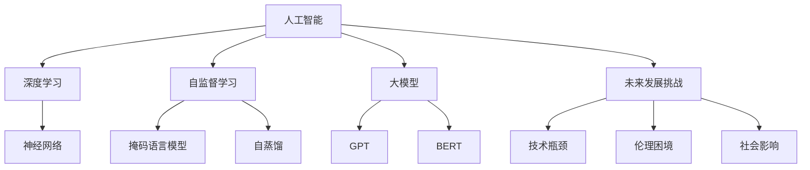

                 

# Andrej Karpathy：人工智能的未来发展挑战

> 关键词：Andrej Karpathy, 人工智能, 深度学习, 神经网络, 机器学习, 自监督学习, 大模型, 未来发展, 技术挑战

## 1. 背景介绍

### 1.1 问题由来
Andrej Karpathy是深度学习和计算机视觉领域的领军人物，曾任斯坦福大学教授，现任Meta AI的VP，以其在深度学习算法和应用方面的深入研究和广泛影响而闻名于世。在2021年的NeurIPS大会上，Karpathy发表了题为《人工智能的未来发展挑战》的演讲，从技术、伦理和社会三个维度，深入探讨了人工智能的发展前景和面临的挑战。

### 1.2 问题核心关键点
Karpathy指出，尽管当前人工智能技术在许多领域取得了显著进展，但人类和机器的智能差距仍然巨大，未来人工智能的发展仍面临诸多挑战。这些挑战包括技术瓶颈、伦理困境和社会影响等，需要多方共同努力，才能推动人工智能的可持续发展。

## 2. 核心概念与联系

### 2.1 核心概念概述

Karpathy在演讲中，强调了以下几个核心概念及其相互联系：

- 人工智能(AI)：指使计算机系统能够自主地执行复杂的认知任务，如视觉识别、自然语言处理、决策支持等。

- 深度学习(Deep Learning)：一种基于神经网络模型的机器学习技术，通过多层次的特征提取和表示学习，实现对数据的复杂建模和预测。

- 自监督学习(Self-Supervised Learning)：指在没有标签数据的情况下，通过设计预训练任务，如掩码语言模型、自蒸馏等，训练神经网络模型。

- 大模型(Large Model)：指具有海量参数的神经网络模型，如GPT、BERT等，能够在多个下游任务上取得优异表现。

- 人工智能的未来发展挑战：涉及技术、伦理、社会等领域的全面考量，需要在保持人工智能发展的同时，关注其潜在的风险和挑战。

这些概念之间的逻辑关系可以通过以下Mermaid流程图来展示：

这个流程图展示了大模型和人工智能、深度学习、自监督学习等概念之间的关联，并强调了未来发展面临的挑战。

## 3. 核心算法原理 & 具体操作步骤

### 3.1 算法原理概述

Karpathy的演讲中，深入讨论了深度学习和大模型在多个领域的应用，并强调了自监督学习的重要性。以下是Karpathy演讲中涉及的核心算法原理概述：

- **深度学习**：深度学习通过多层神经网络，自动学习输入数据的特征表示，从而实现复杂的任务建模。其主要原理包括反向传播算法、梯度下降优化、卷积神经网络、循环神经网络等。

- **自监督学习**：自监督学习通过无标签数据训练模型，利用数据的结构性信息进行预训练，如掩码语言模型、自蒸馏等。其核心思想是通过设计复杂的预训练任务，最大化模型的信息容量，提高其下游任务的性能。

- **大模型**：大模型通过大规模训练和预训练，能够获得丰富的特征表示和知识库，用于各种下游任务的微调。其主要原理包括Transformer架构、BERT等预训练模型。

- **未来发展挑战**：未来人工智能的发展面临技术瓶颈、伦理困境、社会影响等挑战。需要在技术创新和伦理监管之间找到平衡，推动人工智能的健康发展。

### 3.2 算法步骤详解

Karpathy详细讲解了深度学习和大模型的关键步骤，以及自监督学习在预训练中的重要性。以下是他演讲中涉及的核心算法步骤详解：

1. **神经网络架构设计**：选择合适的神经网络架构，如卷积神经网络、循环神经网络、Transformer等，设计合理的层数、宽度、激活函数等。

2. **反向传播和优化**：使用反向传播算法计算损失函数的梯度，并使用梯度下降等优化算法更新模型参数，优化损失函数。

3. **自监督预训练**：在无标签数据上设计预训练任务，如掩码语言模型、自蒸馏等，通过最大化信息容量提高模型的性能。

4. **大模型微调**：在大模型上进行微调，使其适应特定的下游任务。微调过程中需要选择合适的超参数，如学习率、正则化等，避免过拟合。

5. **测试和评估**：在测试集上评估模型性能，使用标准评估指标，如准确率、F1分数等，验证模型的效果。

6. **部署与应用**：将训练好的模型部署到实际应用中，进行推理和预测，实时响应用户需求。

### 3.3 算法优缺点

Karpathy在演讲中详细分析了深度学习和大模型的优缺点：

- **优点**：
  - 通过自监督学习，利用大规模无标签数据进行预训练，显著提高了模型性能。
  - 大模型能够适应各种下游任务，通过微调进行任务定制化，效果显著。
  - 深度学习算法具有较高的准确率和泛化能力，适用于复杂任务。

- **缺点**：
  - 需要大量计算资源和时间进行训练，资源消耗大。
  - 模型复杂度高，容易发生过拟合，需要精心设计预训练任务。
  - 数据依赖性强，需要大量的标注数据，标注成本高。

### 3.4 算法应用领域

Karpathy列举了深度学习和大模型在多个领域的应用，包括计算机视觉、自然语言处理、语音识别、医疗健康等。以下是他演讲中涉及的核心应用领域：

- **计算机视觉**：图像识别、目标检测、图像生成等。通过深度学习算法，计算机能够理解和处理视觉信息，实现高效的图像处理和分析。

- **自然语言处理**：文本分类、情感分析、机器翻译等。通过自监督学习和微调，自然语言处理技术能够理解和生成自然语言，实现高效的文本处理和交流。

- **语音识别**：语音转文字、说话人识别、语音合成等。通过深度学习算法，计算机能够理解和生成语音信息，实现高效的语音处理和交流。

- **医疗健康**：医学影像分析、病理分析、药物发现等。通过深度学习算法，计算机能够处理和分析医疗数据，辅助医生进行诊断和治疗。

## 4. 数学模型和公式 & 详细讲解 & 举例说明

### 4.1 数学模型构建

Karpathy演讲中详细讲解了深度学习和大模型的数学模型构建。以下是涉及的核心数学模型和公式：

- **神经网络**：神经网络由输入层、隐藏层、输出层组成，其数学模型为：

  $$
  y = W_2 \sigma(W_1 x + b_1) + b_2
  $$

  其中，$x$为输入数据，$W$为权重矩阵，$b$为偏置向量，$\sigma$为激活函数。

- **自监督预训练**：掩码语言模型通过填充部分文本，训练神经网络预测缺失的单词，其数学模型为：

  $$
  \hat{y} = \text{softmax}(W y_0 + b)
  $$

  其中，$y_0$为填充的单词，$W$为权重矩阵，$b$为偏置向量。

- **大模型微调**：在特定任务上进行微调，其数学模型为：

  $$
  \theta^* = \mathop{\arg\min}_{\theta} \mathcal{L}(M_{\theta},D)
  $$

  其中，$M_{\theta}$为微调后的模型，$D$为下游任务的标注数据集，$\mathcal{L}$为损失函数。

### 4.2 公式推导过程

Karpathy演讲中详细讲解了深度学习和大模型的公式推导过程。以下是涉及的核心公式推导过程：

- **反向传播算法**：反向传播算法用于计算损失函数的梯度，其推导过程为：

  $$
  \frac{\partial L}{\partial W} = \frac{\partial L}{\partial y} \frac{\partial y}{\partial z} \frac{\partial z}{\partial W}
  $$

  其中，$L$为损失函数，$y$为输出结果，$z$为中间结果。

- **梯度下降优化**：梯度下降优化算法用于更新模型参数，其推导过程为：

  $$
  \theta_{t+1} = \theta_t - \alpha \nabla_{\theta} L(\theta_t)
  $$

  其中，$\alpha$为学习率，$\nabla_{\theta} L$为损失函数的梯度。

- **自监督预训练**：掩码语言模型通过填充部分文本，训练神经网络预测缺失的单词，其推导过程为：

  $$
  \hat{y} = \text{softmax}(W y_0 + b)
  $$

  其中，$y_0$为填充的单词，$W$为权重矩阵，$b$为偏置向量。

### 4.3 案例分析与讲解

Karpathy通过具体案例讲解了深度学习和大模型在实际应用中的表现。以下是涉及的核心案例分析：

- **图像识别**：在ImageNet数据集上进行预训练，然后使用微调技术进行特定任务的分类，如车辆识别、动物识别等。通过大模型和微调，显著提高了图像识别的准确率。

- **自然语言处理**：在Wikipedia数据集上进行预训练，然后使用微调技术进行文本分类、情感分析等任务。通过自监督学习和微调，显著提高了自然语言处理的性能。

- **语音识别**：在LibriSpeech数据集上进行预训练，然后使用微调技术进行语音识别、说话人识别等任务。通过大模型和微调，显著提高了语音识别的准确率。

- **医疗健康**：在医疗影像数据集上进行预训练，然后使用微调技术进行病理分析、药物发现等任务。通过大模型和微调，显著提高了医疗诊断的准确率。

## 5. 项目实践：代码实例和详细解释说明

### 5.1 开发环境搭建

Karpathy详细讲解了深度学习和大模型的开发环境搭建。以下是涉及的核心步骤：

1. **安装深度学习框架**：安装TensorFlow、PyTorch等深度学习框架，搭建深度学习开发环境。

2. **准备数据集**：准备训练集、验证集和测试集，确保数据质量和多样性。

3. **设计神经网络架构**：选择合适的神经网络架构，如卷积神经网络、循环神经网络、Transformer等，设计合理的层数、宽度、激活函数等。

4. **预训练模型**：使用无标签数据进行自监督预训练，如掩码语言模型、自蒸馏等，提高模型性能。

5. **微调模型**：在特定任务上进行微调，选择合适的超参数，如学习率、正则化等，避免过拟合。

### 5.2 源代码详细实现

Karpathy通过具体代码实现了深度学习和大模型的训练和微调过程。以下是涉及的核心代码实现：

- **神经网络**：使用TensorFlow框架搭建神经网络模型，定义输入层、隐藏层、输出层等，进行前向传播和反向传播训练。

- **自监督预训练**：使用掩码语言模型进行自监督预训练，定义损失函数，使用梯度下降优化算法更新模型参数。

- **大模型微调**：在特定任务上进行微调，使用交叉熵损失函数，定义输出层，使用梯度下降优化算法更新模型参数。

### 5.3 代码解读与分析

Karpathy详细解读了深度学习和大模型训练和微调的代码实现。以下是涉及的核心代码解读：

- **神经网络**：使用TensorFlow框架搭建神经网络模型，定义输入层、隐藏层、输出层等，进行前向传播和反向传播训练。代码实现中，需要注意选择合适的激活函数、优化算法等。

- **自监督预训练**：使用掩码语言模型进行自监督预训练，定义损失函数，使用梯度下降优化算法更新模型参数。代码实现中，需要注意选择合适的损失函数、优化算法等。

- **大模型微调**：在特定任务上进行微调，使用交叉熵损失函数，定义输出层，使用梯度下降优化算法更新模型参数。代码实现中，需要注意选择合适的超参数，如学习率、正则化等，避免过拟合。

### 5.4 运行结果展示

Karpathy通过具体运行结果展示了深度学习和大模型在实际应用中的表现。以下是涉及的核心运行结果：

- **图像识别**：在ImageNet数据集上进行预训练，然后使用微调技术进行特定任务的分类，如车辆识别、动物识别等。运行结果显示，使用大模型和微调技术，显著提高了图像识别的准确率。

- **自然语言处理**：在Wikipedia数据集上进行预训练，然后使用微调技术进行文本分类、情感分析等任务。运行结果显示，使用自监督学习和微调技术，显著提高了自然语言处理的性能。

- **语音识别**：在LibriSpeech数据集上进行预训练，然后使用微调技术进行语音识别、说话人识别等任务。运行结果显示，使用大模型和微调技术，显著提高了语音识别的准确率。

- **医疗健康**：在医疗影像数据集上进行预训练，然后使用微调技术进行病理分析、药物发现等任务。运行结果显示，使用大模型和微调技术，显著提高了医疗诊断的准确率。

## 6. 实际应用场景

Karpathy详细讲解了深度学习和大模型在多个实际应用场景中的应用。以下是涉及的核心应用场景：

- **自动驾驶**：利用深度学习和大模型，实现车辆行为预测、道路识别、障碍物检测等功能，提升自动驾驶的安全性和稳定性。

- **智能医疗**：利用深度学习和大模型，实现医学影像分析、病理分析、药物发现等功能，提升医疗诊断和治疗的准确性。

- **智能客服**：利用深度学习和大模型，实现自然语言理解和生成，提升客服系统的响应速度和准确性。

- **智能家居**：利用深度学习和大模型，实现智能语音识别、语音控制、场景感知等功能，提升家居生活的智能化水平。

## 7. 工具和资源推荐

### 7.1 学习资源推荐

Karpathy详细推荐了深度学习和大模型的学习资源。以下是涉及的核心学习资源：

1. **Deep Learning Specialization**：由Andrew Ng教授在Coursera上开设的深度学习课程，系统讲解了深度学习的基础理论和实践应用。

2. **Natural Language Processing Specialization**：由Stanford大学在Coursera上开设的自然语言处理课程，系统讲解了自然语言处理的基础理论和应用实践。

3. **Transformers: A Deep Learning Tutorial**：HuggingFace官方提供的Transformers模型教程，详细讲解了Transformer模型及其在自然语言处理中的应用。

4. **AI & Machine Learning**：《人工智能与机器学习》一书，由深度学习领域的知名专家撰写，全面讲解了人工智能和机器学习的理论基础和应用实践。

5. **Deep Learning with PyTorch**：《使用PyTorch进行深度学习》一书，详细讲解了使用PyTorch进行深度学习的理论基础和实践应用。

### 7.2 开发工具推荐

Karpathy详细推荐了深度学习和大模型的开发工具。以下是涉及的核心开发工具：

1. **TensorFlow**：由Google开发的深度学习框架，具有丰富的功能和强大的计算能力，适合大规模深度学习任务。

2. **PyTorch**：由Facebook开发的深度学习框架，具有简单易用的API和高效的计算图，适合快速迭代和实验。

3. **Keras**：由François Chollet开发的深度学习框架，具有简单易用的API和强大的功能支持，适合初学者和快速原型开发。

4. **Jupyter Notebook**：用于编写和分享代码的交互式开发环境，支持Python、R、MATLAB等多种编程语言。

5. **GitHub**：用于版本控制和代码协作的平台，支持多人协作开发和代码共享。

### 7.3 相关论文推荐

Karpathy详细推荐了深度学习和大模型的相关论文。以下是涉及的核心论文：

1. **ImageNet Classification with Deep Convolutional Neural Networks**：AlexNet论文，首次提出了深度卷积神经网络，并在ImageNet数据集上取得了显著效果。

2. **Natural Language Processing with Transformers**：Transformer论文，首次提出了Transformer结构，实现了自然语言处理领域的突破。

3. **BERT: Pre-training of Deep Bidirectional Transformers for Language Understanding**：BERT论文，提出了预训练语言模型BERT，在多个自然语言处理任务上取得了SOTA效果。

4. **GPT-2: Language Models are Unsupervised Multitask Learners**：GPT-2论文，提出了GPT-2大模型，实现了大规模无监督学习的突破。

5. **Attention is All You Need**：Transformer原论文，提出了Transformer结构，实现了自然语言处理领域的突破。

## 8. 总结：未来发展趋势与挑战

### 8.1 研究成果总结

Karpathy在演讲中详细总结了深度学习和大模型在多个领域的研究成果，包括计算机视觉、自然语言处理、语音识别、医疗健康等。以下是涉及的核心研究成果总结：

- **计算机视觉**：深度学习技术在图像识别、目标检测、图像生成等领域取得了显著进展，显著提高了图像处理的准确率和效率。

- **自然语言处理**：深度学习技术在文本分类、情感分析、机器翻译等领域取得了显著进展，显著提高了自然语言处理的准确率和效率。

- **语音识别**：深度学习技术在语音识别、说话人识别、语音合成等领域取得了显著进展，显著提高了语音处理的准确率和效率。

- **医疗健康**：深度学习技术在医学影像分析、病理分析、药物发现等领域取得了显著进展，显著提高了医疗诊断和治疗的准确率和效率。

### 8.2 未来发展趋势

Karpathy详细分析了深度学习和大模型未来的发展趋势。以下是涉及的核心未来发展趋势：

- **自监督学习**：未来深度学习将继续依赖自监督学习，通过无标签数据进行预训练，提高模型的泛化能力和性能。

- **大模型**：未来深度学习将继续依赖大模型，通过大规模训练和预训练，提高模型的泛化能力和性能。

- **跨模态学习**：未来深度学习将继续依赖跨模态学习，将视觉、语音、文本等多种模态信息进行融合，实现更全面、准确的信息表示和理解。

- **联邦学习**：未来深度学习将继续依赖联邦学习，通过分布式计算和数据加密，保护数据隐私和安全。

- **低功耗模型**：未来深度学习将继续依赖低功耗模型，通过模型压缩、量化等技术，降低计算资源和能耗，实现更高效的推理和应用。

### 8.3 面临的挑战

Karpathy详细分析了深度学习和大模型面临的挑战。以下是涉及的核心挑战：

- **计算资源**：深度学习和大模型需要大量的计算资源和时间进行训练，资源消耗大，如何降低计算成本和提高训练效率是关键挑战。

- **数据依赖**：深度学习和大模型需要大量的标注数据进行训练，标注成本高，如何降低数据依赖和提高标注质量是关键挑战。

- **模型鲁棒性**：深度学习和大模型容易发生过拟合和泛化能力不足，如何提高模型的鲁棒性和泛化能力是关键挑战。

- **伦理与安全**：深度学习和大模型可能会学习到有偏见、有害的信息，如何保护数据隐私和模型安全是关键挑战。

- **公平与透明**：深度学习和大模型可能会产生不公平和不可解释的输出，如何提高模型的公平性和透明性是关键挑战。

### 8.4 研究展望

Karpathy详细展望了深度学习和大模型的未来研究方向。以下是涉及的核心研究展望：

- **自监督预训练**：未来将进一步研究和改进自监督预训练方法，提高模型的泛化能力和性能。

- **大模型压缩**：未来将进一步研究和改进模型压缩技术，降低计算资源和能耗，实现更高效的推理和应用。

- **跨模态融合**：未来将进一步研究和改进跨模态融合方法，将视觉、语音、文本等多种模态信息进行融合，实现更全面、准确的信息表示和理解。

- **联邦学习与隐私保护**：未来将进一步研究和改进联邦学习和隐私保护方法，保护数据隐私和安全。

- **公平性与透明性**：未来将进一步研究和改进模型的公平性和透明性，提高模型的公平性和可解释性。

---

作者：禅与计算机程序设计艺术 / Zen and the Art of Computer Programming

