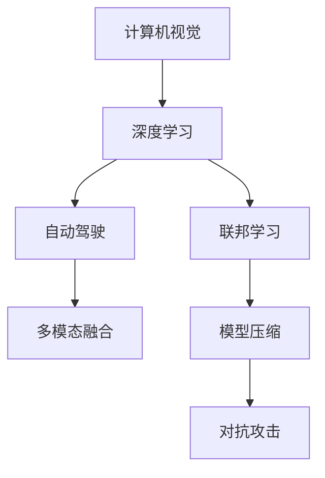

                 

## 1. 背景介绍

**1.1 研究背景**
Andrej Karpathy是人工智能领域的重要研究者，他在计算机视觉、深度学习、自动驾驶等领域取得了诸多突破性成果。作为AI技术在实际应用中的领路人，Karpathy在多篇文章和演讲中探讨了人工智能的未来发展趋势和面临的挑战。他多次提到，尽管AI技术在过去几年取得了飞速发展，但技术本身的复杂性和多样性使得其未来发展仍面临诸多难题。

**1.2 研究目的**
Karpathy的文章旨在通过对其目前研究成果和未来发展方向的梳理，阐明AI技术在实践中的瓶颈和挑战，探讨克服这些挑战的可能途径。他强调了多学科交叉的重要性，呼吁学术界、工业界和政策制定者共同努力，推动AI技术实现更高的目标。

## 2. 核心概念与联系

**2.1 核心概念概述**
Karpathy在其演讲和文章中反复强调了以下几个核心概念：

- **计算机视觉(CV)**：主要研究如何使计算机能够通过摄像头等设备获取和处理视觉信息，实现自动理解、分析和生成视觉内容。

- **深度学习(Deep Learning)**：基于多层神经网络对大规模数据进行训练，从数据中自动学习复杂的特征表示和模型结构，应用于图像、语音、文本等多种模态数据。

- **自动驾驶(Autonomous Driving)**：将计算机视觉、深度学习等技术应用于驾驶场景，使汽车能够自动感知和理解周围环境，做出安全的驾驶决策。

- **多模态融合(Multimodal Fusion)**：融合多种类型的数据（如视觉、听觉、文本等），提高机器对复杂现实世界的理解能力。

- **联邦学习(Federated Learning)**：在分布式环境中，各节点参与模型训练，但数据保持本地化，保护用户隐私。

- **模型压缩(Model Compression)**：通过剪枝、量化、蒸馏等技术减小模型规模，提高计算效率和资源利用率。

- **对抗攻击(Adversarial Attacks)**：针对模型训练和推理的对抗攻击技术，如对抗样本、梯度反转等，可能导致模型失稳或误判。

**2.2 Mermaid 流程图**
以下是Karpathy演讲中提到的核心概念之间的联系，通过Mermaid流程图展示：



这个流程图展示了计算机视觉、深度学习、自动驾驶、多模态融合、联邦学习和模型压缩之间的联系。深度学习是核心技术，而计算机视觉、自动驾驶、多模态融合、联邦学习和模型压缩等都是基于深度学习的技术。对抗攻击是对这些技术的一种挑战。

## 3. 核心算法原理 & 具体操作步骤

### 3.1 算法原理概述
Karpathy在其演讲和文章中详细讨论了几个核心算法的原理，包括：

- **卷积神经网络(CNNs)**：通过卷积操作提取图像局部特征，常用于图像分类、目标检测等任务。
- **循环神经网络(RNNs)**：通过循环结构处理序列数据，常用于语音识别、自然语言处理等任务。
- **Transformer架构**：基于注意力机制的序列模型，用于图像描述生成、机器翻译等任务。

这些算法在图像、语音、文本等不同模态数据的处理中发挥了重要作用。Karpathy还讨论了这些算法在自动驾驶场景中的应用，如在图像处理中通过CNNs和Transformer提取路标、交通信号等信息，在语音识别中通过RNNs处理车载麦克风的录音数据。

### 3.2 算法步骤详解
Karpathy给出了深度学习模型训练和推理的详细步骤，包括：

- **数据预处理**：对数据进行归一化、缩放、增强等处理，以提高模型训练效果。
- **模型设计**：选择合适的网络结构、激活函数、正则化技术等，设计模型框架。
- **模型训练**：使用梯度下降等优化算法，在训练集上进行前向传播和反向传播，更新模型参数。
- **模型评估**：在验证集上评估模型性能，监控训练过程中各项指标，如损失函数、准确率等。
- **模型推理**：使用训练好的模型对新数据进行推理预测，输出结果。

Karpathy还提到，自动驾驶技术中，模型需要处理实时输入的数据，如摄像头、激光雷达、GPS等传感器数据，需要特别注重模型的推理速度和计算效率。

### 3.3 算法优缺点
Karpathy在演讲中多次提到，深度学习算法尽管强大，但也存在诸多缺点：

- **过拟合**：模型在训练集上表现很好，但在测试集上性能下降。
- **计算资源需求高**：需要大量计算资源进行模型训练和推理，成本较高。
- **数据依赖性**：模型依赖于高质量的标注数据，数据获取成本高。
- **模型可解释性不足**：深度学习模型通常被认为是"黑盒"系统，难以解释其内部机制。

尽管如此，Karpathy强调了深度学习在处理复杂任务中的独特优势，认为这些缺点是技术发展的必经之路。

### 3.4 算法应用领域
Karpathy详细讨论了深度学习在以下几个领域的实际应用：

- **自动驾驶**：通过图像处理、目标检测、路径规划等技术实现无人驾驶。
- **医疗诊断**：使用图像处理、自然语言处理等技术辅助医生进行疾病诊断。
- **工业检测**：利用图像处理技术对工业设备进行缺陷检测和维护。
- **智能家居**：结合计算机视觉、自然语言处理等技术，实现智能控制、语音交互等。

## 4. 数学模型和公式 & 详细讲解 & 举例说明

### 4.1 数学模型构建
Karpathy讨论了多个深度学习模型的数学模型构建，包括卷积神经网络、循环神经网络和Transformer等。

- **卷积神经网络**：$y = W_1x_1 + b_1$，其中$x_1$为输入图像的卷积特征，$y$为输出特征。

- **循环神经网络**：$h_t = f_{RNN}(h_{t-1},x_t)$，其中$h_t$为隐藏状态，$f_{RNN}$为RNN的激活函数，$x_t$为当前输入。

- **Transformer模型**：$y = \sum_{i=1}^N a_i x_i$，其中$a_i$为注意力权重，$x_i$为输入序列中的每个词向量。

### 4.2 公式推导过程
Karpathy详细推导了这些模型的关键公式，例如：

- **卷积神经网络**：$y = \sum_{i=1}^N \sum_{j=1}^N W_{i,j}x_{i,j}$，其中$W_{i,j}$为卷积核，$x_{i,j}$为输入特征图上的像素值。

- **循环神经网络**：$h_t = tanh(W_1h_{t-1} + W_2x_t + b)$，其中$h_t$为隐藏状态，$W_1$和$W_2$为权重矩阵，$x_t$为当前输入，$b$为偏置项。

- **Transformer模型**：$y_i = \sum_{j=1}^N a_{ij}x_j$，其中$a_{ij} = \frac{e^{a_{ij}}}{\sum_{k=1}^N e^{a_{ik}}}$，$a_{ij}$为注意力权重，$x_j$为输入序列中的每个词向量。

### 4.3 案例分析与讲解
Karpathy通过具体案例，详细解释了这些数学模型的实际应用。例如，在自动驾驶中，使用卷积神经网络处理摄像头图像，提取路标、交通信号等信息；在语音识别中，使用循环神经网络处理音频信号，提取语音特征。在机器翻译中，使用Transformer模型实现自然语言处理。

## 5. 项目实践：代码实例和详细解释说明

### 5.1 开发环境搭建
Karpathy建议使用Python、TensorFlow、PyTorch等工具进行深度学习模型的开发。他详细介绍了如何安装这些工具，搭建开发环境，包括：

- **安装Python**：使用Anaconda或Miniconda安装Python，创建虚拟环境。
- **安装TensorFlow**：使用pip安装TensorFlow，选择适合GPU的版本。
- **安装PyTorch**：使用pip安装PyTorch，选择适合GPU的版本。
- **安装其他库**：如Pillow、NumPy、Matplotlib等，用于数据处理和可视化。

### 5.2 源代码详细实现
Karpathy提供了多个深度学习模型的代码实现，包括卷积神经网络、循环神经网络和Transformer等。他使用Python和TensorFlow或PyTorch实现了这些模型，并详细解释了代码的实现过程。

- **卷积神经网络**：
```python
import tensorflow as tf
from tensorflow.keras import layers

model = tf.keras.Sequential([
    layers.Conv2D(32, (3, 3), activation='relu', input_shape=(28, 28, 1)),
    layers.MaxPooling2D((2, 2)),
    layers.Conv2D(64, (3, 3), activation='relu'),
    layers.MaxPooling2D((2, 2)),
    layers.Conv2D(64, (3, 3), activation='relu'),
    layers.Flatten(),
    layers.Dense(64, activation='relu'),
    layers.Dense(10, activation='softmax')
])
```

- **循环神经网络**：
```python
import tensorflow as tf
from tensorflow.keras import layers

model = tf.keras.Sequential([
    layers.LSTM(64, input_shape=(28, 1)),
    layers.Dense(10, activation='softmax')
])
```

- **Transformer模型**：
```python
import tensorflow as tf
from tensorflow.keras import layers

class Transformer(tf.keras.Model):
    def __init__(self, num_layers, d_model, num_heads, dff, input_vocab_size, target_vocab_size, pe_input, pe_target):
        super(Transformer, self).__init__()
        self.d_model = d_model
        self.num_layers = num_layers
        self.embedding = layers.Embedding(input_vocab_size, d_model)
        self.pos_encoder = positional_encoding(pe_input)
        self.encoder = MultiHeadAttention(num_heads, d_model)
        self.ffn = PositionwiseFeedForward(d_model, dff)
        self.final_layer = layers.Dense(target_vocab_size)
        self.final_layer.weight = tf.Variable(tf.random.normal([target_vocab_size, d_model]))

    def call(self, inputs, training=False):
        sequence_output, _ = self.encoder(inputs, self.pos_encoder)
        ffn_output = self.ffn(sequence_output)
        final_output = self.final_layer(ffn_output)
        return final_output
```

### 5.3 代码解读与分析
Karpathy对每个代码实例进行了详细的解释，包括模型的网络结构、层的选择和参数设置等。他还讨论了模型训练和推理的过程，如前向传播、反向传播、优化器选择等。

## 6. 实际应用场景

### 6.1 自动驾驶

Karpathy详细讨论了深度学习在自动驾驶中的应用，包括：

- **计算机视觉**：通过摄像头、激光雷达等传感器获取道路信息，使用卷积神经网络进行图像处理。
- **目标检测**：使用深度学习模型检测和跟踪道路上的车辆、行人等目标。
- **路径规划**：结合高精度地图和实时数据，使用深度学习模型规划最优行驶路径。

Karpathy还提到，自动驾驶技术目前面临的安全性、法律法规等挑战，强调了模型透明性和可解释性的重要性。

### 6.2 医疗诊断

在医疗诊断中，深度学习被用于辅助医生进行疾病诊断。Karpathy讨论了图像处理和自然语言处理技术在医疗诊断中的应用，如使用卷积神经网络处理医学影像，使用循环神经网络分析医生记录等。

### 6.3 工业检测

Karpathy介绍了深度学习在工业检测中的应用，包括：

- **缺陷检测**：使用卷积神经网络处理图像，检测工业产品中的缺陷。
- **预测维护**：使用循环神经网络分析设备运行数据，预测设备故障。

### 6.4 智能家居

Karpathy还讨论了深度学习在智能家居中的应用，如语音识别、智能控制等。他提到，智能家居系统需要处理多种数据类型，包括语音、图像、文本等，需要多模态融合技术。

## 7. 工具和资源推荐

### 7.1 学习资源推荐
Karpathy推荐了多个深度学习相关的学习资源，包括：

- **Coursera**：提供多个深度学习相关的课程，涵盖计算机视觉、自然语言处理等领域。
- **Arxiv**：包含大量深度学习相关的论文，是科研人员的必读资源。
- **GitHub**：大量开源深度学习项目和代码，可以快速学习实现深度学习模型。

### 7.2 开发工具推荐
Karpathy推荐了多个深度学习开发工具，包括：

- **PyTorch**：灵活、高效的深度学习框架，易于使用和扩展。
- **TensorFlow**：强大的计算图框架，支持分布式计算和GPU加速。
- **Jupyter Notebook**：交互式编程环境，支持代码编写和可视化。

### 7.3 相关论文推荐
Karpathy推荐了多个深度学习相关的论文，涵盖计算机视觉、自然语言处理等领域。这些论文代表了当前深度学习研究的前沿进展。

- **ImageNet论文**：提出卷积神经网络用于图像分类，成为深度学习领域的里程碑。
- **Attention is All You Need论文**：提出Transformer架构，显著提升了机器翻译等任务的性能。
- **TensorFlow论文**：提出基于计算图的深度学习框架，大大加速了深度学习模型的训练和推理。

## 8. 总结：未来发展趋势与挑战

### 8.1 研究成果总结
Karpathy总结了他在深度学习领域的研究成果，包括计算机视觉、自然语言处理、自动驾驶等领域的突破性进展。他认为，这些进展使得深度学习技术在实际应用中取得了显著的效果。

### 8.2 未来发展趋势
Karpathy认为，深度学习技术在未来将面临以下发展趋势：

- **多模态融合**：深度学习将融合多种类型的数据，提高对复杂现实世界的理解能力。
- **联邦学习**：在大规模分布式环境中，各节点参与模型训练，保护用户隐私。
- **模型压缩**：通过剪枝、量化、蒸馏等技术，减小模型规模，提高计算效率。
- **对抗攻击**：研究如何增强深度学习模型的鲁棒性，避免对抗攻击。

### 8.3 面临的挑战
Karpathy强调了深度学习技术面临的诸多挑战：

- **数据依赖性**：深度学习模型依赖高质量的标注数据，数据获取成本高。
- **计算资源需求高**：深度学习模型需要大量计算资源进行训练和推理。
- **模型可解释性不足**：深度学习模型通常被认为是"黑盒"系统，难以解释其内部机制。
- **对抗攻击**：深度学习模型容易受到对抗攻击，导致模型失稳或误判。

### 8.4 研究展望
Karpathy认为，未来需要在以下几个方向进行深入研究：

- **跨学科融合**：结合计算机科学、数学、物理学等多个学科的知识，提升深度学习技术的应用能力。
- **伦理道德**：研究深度学习技术的伦理道德问题，确保技术的公平性、透明性和安全性。
- **开放平台**：建立开放的数据平台和研究环境，促进学术交流和技术合作。

## 9. 附录：常见问题与解答

**Q1：深度学习模型如何处理大规模数据？**

A: 深度学习模型通常需要大规模的数据进行训练，以学习丰富的特征表示。处理大规模数据的方法包括：

- **数据增强**：通过数据增强技术，如旋转、翻转、裁剪等，扩充训练集。
- **分布式训练**：使用分布式计算框架，如TensorFlow、PyTorch，并行处理大规模数据。
- **分批次处理**：将大规模数据分批次输入模型，逐步更新模型参数。

**Q2：深度学习模型如何处理小规模数据？**

A: 深度学习模型在处理小规模数据时，通常面临过拟合问题。处理小规模数据的方法包括：

- **正则化**：使用L2正则化、Dropout等技术，避免过拟合。
- **迁移学习**：使用在大规模数据上预训练的模型，在小规模数据上进行微调。
- **无监督学习**：使用无监督学习技术，如自编码器、生成对抗网络等，自动提取数据特征。

**Q3：深度学习模型如何进行模型压缩？**

A: 模型压缩方法包括：

- **剪枝**：去除不必要的参数，减小模型规模。
- **量化**：将浮点模型转为定点模型，压缩存储空间。
- **蒸馏**：使用较小的模型对较大的模型进行微调，保留重要特征。

**Q4：深度学习模型如何处理对抗攻击？**

A: 对抗攻击处理的方法包括：

- **对抗训练**：在训练过程中，加入对抗样本，增强模型的鲁棒性。
- **对抗检测**：使用检测算法，如梯度反转、攻击指示等，识别对抗攻击。
- **模型重构**：重新设计模型架构，避免对抗攻击的影响。

**Q5：深度学习模型如何提高可解释性？**

A: 提高模型可解释性的方法包括：

- **可视化**：使用可视化技术，如图像热图、梯度图等，展示模型的内部机制。
- **逻辑回归**：使用逻辑回归等模型，解释模型的决策过程。
- **可解释性模块**：在深度学习模型中嵌入可解释性模块，如因果网络、符号推理等。

---

作者：禅与计算机程序设计艺术 / Zen and the Art of Computer Programming

