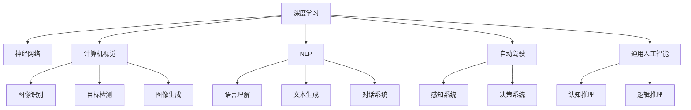

                 

# Andrej Karpathy：人工智能的未来发展方向

> 关键词：深度学习,神经网络,计算机视觉,自然语言处理,自动驾驶,未来的AI发展方向

## 1. 背景介绍

### 1.1 问题由来
在过去十年里，深度学习（Deep Learning）已经取得了前所未有的成功，推动了计算机视觉、自然语言处理（NLP）和自动驾驶等领域的重大进步。然而，尽管如此，人工智能（AI）的前景依然面临着许多挑战和不确定性。特别是在技术、伦理和社会等方面，人工智能的未来发展方向和应用前景仍需深入探讨。本文将邀请人工智能领域的顶尖专家Andrej Karpathy，从深度学习、计算机视觉、自动驾驶等多个角度，探讨人工智能的未来发展方向。

## 2. 核心概念与联系

### 2.1 核心概念概述

为了更好地理解Andrej Karpathy的见解，本节将介绍几个密切相关的核心概念：

- 深度学习（Deep Learning）：一种通过神经网络模型处理复杂数据的技术，广泛用于计算机视觉、自然语言处理等领域。
- 神经网络（Neural Network）：由大量的人工神经元节点组成的计算模型，通过反向传播算法更新参数，优化模型性能。
- 计算机视觉（Computer Vision）：通过算法使计算机“看”的能力，实现图像识别、目标检测、图像生成等任务。
- 自然语言处理（Natural Language Processing, NLP）：让计算机理解、处理和生成人类语言的领域。
- 自动驾驶（Autonomous Driving）：通过计算机视觉、机器学习和传感器技术，使汽车能够自主导航和决策。
- 通用人工智能（Artificial General Intelligence, AGI）：一种具有广泛认知能力的人工智能系统，能够执行任何智力任务。

这些核心概念之间的逻辑关系可以通过以下Mermaid流程图来展示：



这个流程图展示了深度学习及其在多个领域的应用，包括计算机视觉、NLP和自动驾驶。同时，它也指出了通用人工智能在未来的潜力。

### 2.2 核心概念原理和架构的 Mermaid 流程图

由于篇幅限制，这里只提供神经网络和计算机视觉的流程图示例。


这个流程图展示了神经网络的基本架构，包括卷积层、池化层、全连接层和输出层。其中，输入数据经过多层次的处理，最终得到输出数据。

## 3. 核心算法原理 & 具体操作步骤

### 3.1 算法原理概述

Andrej Karpathy认为，深度学习通过多层神经网络结构，可以有效地处理大规模复杂数据。其中，卷积神经网络（CNN）和循环神经网络（RNN）是深度学习的两个重要分支，分别适用于计算机视觉和自然语言处理。此外，自监督学习（Self-Supervised Learning）和对抗训练（Adversarial Training）等技术，也在不断提升模型的泛化能力和鲁棒性。

### 3.2 算法步骤详解

1. **数据预处理**：对输入数据进行归一化、增强等预处理，以提高模型性能。
2. **模型选择**：根据任务选择合适的神经网络结构，如卷积神经网络（CNN）、循环神经网络（RNN）、变分自编码器（VAE）等。
3. **模型训练**：使用反向传播算法更新模型参数，优化损失函数。
4. **模型评估**：在验证集或测试集上评估模型性能，选择最佳模型。
5. **模型部署**：将模型部署到实际应用场景中，进行推理和预测。

### 3.3 算法优缺点

深度学习的优点包括：
- 能够处理大规模复杂数据，具有良好的泛化能力。
- 可以通过神经网络结构自动学习特征表示。
- 在计算机视觉、自然语言处理等领域取得显著成果。

然而，深度学习也存在以下缺点：
- 需要大量标注数据进行训练，数据获取成本高。
- 模型复杂，需要大量计算资源。
- 可解释性差，难以理解模型的内部机制。
- 存在过拟合风险，特别是在数据量不足的情况下。

### 3.4 算法应用领域

深度学习已经在多个领域取得了重大进展，包括但不限于：
- **计算机视觉**：图像识别、目标检测、图像生成等。
- **自然语言处理**：文本分类、机器翻译、情感分析等。
- **自动驾驶**：目标检测、车道保持、决策系统等。
- **游戏AI**：强化学习、策略优化等。
- **医疗**：疾病诊断、基因分析等。

## 4. 数学模型和公式 & 详细讲解 & 举例说明

### 4.1 数学模型构建

Andrej Karpathy强调，深度学习的数学模型构建是确保模型性能的关键。他特别关注神经网络的结构和优化算法。例如，卷积神经网络（CNN）的典型结构包括卷积层、池化层和全连接层，其数学模型可以表示为：

$$
y = W \sigma(z) + b
$$

其中，$z$ 为卷积层的输出，$W$ 为权重矩阵，$\sigma$ 为激活函数，$b$ 为偏置项。

### 4.2 公式推导过程

以卷积神经网络为例，其前向传播的公式可以表示为：

$$
y^{l+1} = \max_{k}(a^{l} * W_k + b_k)
$$

其中，$a^l$ 为第$l$层的输入，$W_k$ 为第$k$个卷积核，$*$ 表示卷积操作，$b_k$ 为偏置项。

### 4.3 案例分析与讲解

以图像分类为例，假设我们有一个图像分类任务，使用卷积神经网络进行训练。首先，对输入图像进行卷积操作，然后通过池化层降维，最后使用全连接层进行分类。在训练过程中，我们通过反向传播算法更新模型参数，最小化交叉熵损失函数。

## 5. 项目实践：代码实例和详细解释说明

### 5.1 开发环境搭建

Andrej Karpathy建议使用Python和PyTorch框架进行深度学习项目开发。以下是Python环境搭建的简单步骤：

1. 安装Python 3.8及以上版本。
2. 安装Anaconda或Miniconda。
3. 创建虚拟环境，例如：

```bash
conda create -n myenv python=3.8
conda activate myenv
```

4. 安装必要的Python库，例如：

```bash
pip install torch torchvision numpy matplotlib
```

### 5.2 源代码详细实现

以下是一个使用PyTorch进行图像分类的代码示例：

```python
import torch
import torch.nn as nn
import torch.optim as optim

# 定义卷积神经网络
class CNN(nn.Module):
    def __init__(self):
        super(CNN, self).__init__()
        self.conv1 = nn.Conv2d(3, 32, kernel_size=3, stride=1, padding=1)
        self.pool = nn.MaxPool2d(kernel_size=2, stride=2)
        self.fc1 = nn.Linear(32 * 16 * 16, 128)
        self.fc2 = nn.Linear(128, 10)

    def forward(self, x):
        x = self.conv1(x)
        x = self.pool(x)
        x = x.view(-1, 32 * 16 * 16)
        x = self.fc1(x)
        x = nn.ReLU()(x)
        x = self.fc2(x)
        return x

# 加载数据集
train_dataset = torchvision.datasets.CIFAR10(root='./data', train=True, download=True, transform=transforms.ToTensor())
train_loader = torch.utils.data.DataLoader(train_dataset, batch_size=32, shuffle=True)

# 定义模型和优化器
model = CNN()
optimizer = optim.SGD(model.parameters(), lr=0.01, momentum=0.9)
criterion = nn.CrossEntropyLoss()

# 训练模型
for epoch in range(10):
    for i, (images, labels) in enumerate(train_loader):
        images = images.to(device)
        labels = labels.to(device)
        optimizer.zero_grad()
        outputs = model(images)
        loss = criterion(outputs, labels)
        loss.backward()
        optimizer.step()

    print(f"Epoch {epoch+1}/{10}, Loss: {loss.item()}")
```

### 5.3 代码解读与分析

以上代码实现了一个简单的卷积神经网络模型，使用CIFAR-10数据集进行训练。具体步骤如下：

1. 定义卷积神经网络模型，包含卷积层、池化层和全连接层。
2. 加载数据集，使用PyTorch的DataLoader进行批处理。
3. 定义模型、优化器和损失函数。
4. 在每个epoch内，对每个批次的数据进行前向传播、计算损失和反向传播。

## 6. 实际应用场景

### 6.1 智能医疗

在医疗领域，深度学习已经被广泛应用于疾病诊断、医学影像分析等任务。例如，使用卷积神经网络对医学影像进行分类，可以显著提高诊断的准确性和效率。此外，自然语言处理技术也被用于分析和理解患者的病历和电子健康记录。

### 6.2 自动驾驶

自动驾驶是深度学习的重要应用场景之一。通过计算机视觉技术，自动驾驶系统可以实时感知周围环境，进行目标检测和车道保持。此外，强化学习也被用于优化驾驶策略和决策系统。

### 6.3 游戏AI

游戏AI是深度学习的重要应用领域。通过强化学习和策略优化，AI可以学习并掌握复杂的策略游戏，如AlphaGo。

### 6.4 未来应用展望

Andrej Karpathy认为，未来的深度学习将继续在计算机视觉、自然语言处理、自动驾驶等领域取得突破。此外，通用人工智能（AGI）也将成为未来的一个重要方向。AGI旨在构建具有广泛认知能力的人工智能系统，能够执行任何智力任务，如编写代码、解决复杂问题等。

## 7. 工具和资源推荐

### 7.1 学习资源推荐

以下是Andrej Karpathy推荐的学习资源：

1. 《深度学习》（Deep Learning）：Ian Goodfellow等人所著，深入浅出地介绍了深度学习的基本概念和算法。
2. 《计算机视觉：模型、学习和推理》（Computer Vision: Models, Learning, and Inference）：Andrew Ng等人所著，全面介绍了计算机视觉的各个方面。
3. 《自然语言处理综论》（Speech and Language Processing）：Daniel Jurafsky和James H. Martin所著，介绍了自然语言处理的各个方面，包括文本分类、机器翻译等。
4. 《自动驾驶系统》（Autonomous Systems）：Andrej Karpathy所著，详细介绍了自动驾驶技术的各个方面，包括感知系统、决策系统等。

### 7.2 开发工具推荐

以下是Andrej Karpathy推荐的开发工具：

1. PyTorch：一种深度学习框架，支持动态图和静态图，易于使用和调试。
2. TensorFlow：一种广泛使用的深度学习框架，支持分布式训练和推理。
3. Jupyter Notebook：一种交互式的开发环境，支持Python、R等语言。
4. Visual Studio Code：一种轻量级的开发环境，支持代码高亮、自动补全等功能。

### 7.3 相关论文推荐

以下是Andrej Karpathy推荐的相关论文：

1. "ImageNet Classification with Deep Convolutional Neural Networks"：Alex Krizhevsky等人所著，介绍了使用卷积神经网络进行图像分类的基本思路。
2. "Attention is All You Need"：Ashish Vaswani等人所著，介绍了使用自注意力机制进行自然语言处理的基本思路。
3. "Playing Atari with Deep Reinforcement Learning"：Volodymyr Mnih等人所著，介绍了使用深度强化学习进行游戏AI的基本思路。

## 8. 总结：未来发展趋势与挑战

### 8.1 研究成果总结

Andrej Karpathy总结了深度学习在计算机视觉、自然语言处理、自动驾驶等领域的研究成果，强调了深度学习在处理大规模复杂数据方面的强大能力。

### 8.2 未来发展趋势

Andrej Karpathy认为，未来的深度学习将继续在各个领域取得突破，包括计算机视觉、自然语言处理、自动驾驶等。此外，通用人工智能（AGI）也将成为未来的一个重要方向。AGI旨在构建具有广泛认知能力的人工智能系统，能够执行任何智力任务。

### 8.3 面临的挑战

尽管深度学习取得了重大进展，但在实际应用中仍面临诸多挑战，包括：
- 数据获取和标注成本高。
- 模型复杂，需要大量计算资源。
- 可解释性差，难以理解模型的内部机制。
- 存在过拟合风险，特别是在数据量不足的情况下。

### 8.4 研究展望

Andrej Karpathy认为，未来的研究需要在以下几个方面寻求新的突破：
- 探索无监督和半监督学习技术，减少对大规模标注数据的依赖。
- 开发更加参数高效的微调方法，提升模型的泛化能力和效率。
- 引入因果分析和博弈论工具，提高模型的可解释性和鲁棒性。
- 纳入伦理道德约束，确保模型的公平性和安全性。

## 9. 附录：常见问题与解答

**Q1：深度学习是否需要大量标注数据？**

A: 是的，深度学习模型通常需要大量标注数据进行训练。数据获取和标注成本高是深度学习面临的主要挑战之一。

**Q2：深度学习的泛化能力如何？**

A: 深度学习模型在处理大规模复杂数据方面具有强大的泛化能力。然而，在实际应用中，过拟合风险仍然存在，特别是在数据量不足的情况下。

**Q3：深度学习模型的可解释性如何？**

A: 深度学习模型的可解释性较差，难以理解其内部机制。这是未来需要重点解决的问题之一。

**Q4：如何提高深度学习模型的效率？**

A: 可以通过优化模型结构、引入参数高效微调方法等手段，提高深度学习模型的效率。

**Q5：深度学习模型的应用前景如何？**

A: 深度学习在计算机视觉、自然语言处理、自动驾驶等领域具有广阔的应用前景。未来的深度学习将继续在这些领域取得重大突破。

---

作者：禅与计算机程序设计艺术 / Zen and the Art of Computer Programming

