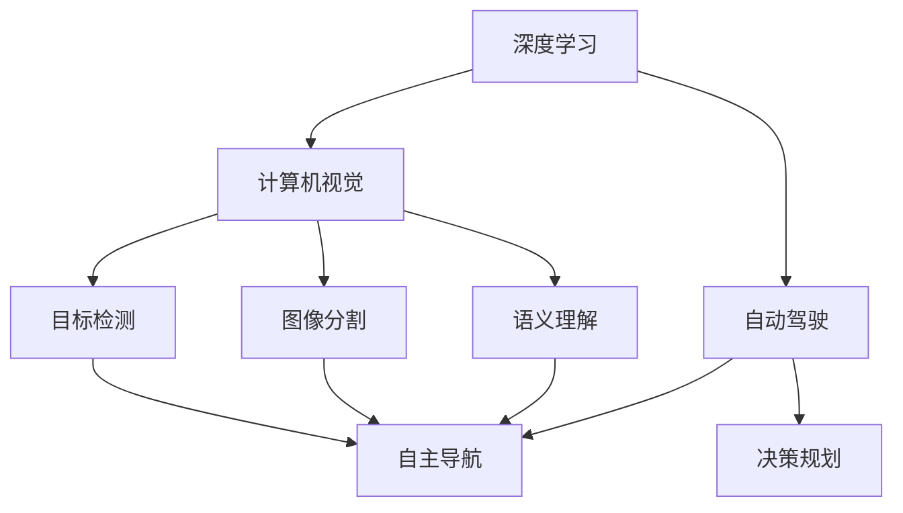

                 

# Andrej Karpathy：人工智能的未来发展机遇

> 关键词：深度学习,计算机视觉,自动驾驶,神经网络,算法优化

## 1. 背景介绍

Andrej Karpathy，是深度学习领域的知名专家，在计算机视觉和自动驾驶方向均有重要贡献。他的学术研究和工业应用经验，为人们揭示了人工智能领域的发展机遇和未来趋势。本文将梳理Andrej Karpathy的主要观点和见解，帮助我们更好地把握人工智能的未来方向。

## 2. 核心概念与联系

### 2.1 核心概念概述

Andrej Karpathy的研究工作集中在深度学习，特别是计算机视觉和自动驾驶领域。这些领域是人工智能技术的重要应用方向，其核心概念包括：

- **深度学习**：一种基于多层神经网络的机器学习技术，通过多层次特征提取和抽象，实现对复杂数据和问题的学习和处理。
- **计算机视觉**：研究如何让计算机“看懂”图像和视频，包括目标检测、图像分割、语义理解等任务。
- **自动驾驶**：使车辆能够自主导航和决策，实现高水平的交通自动化。

Andrej Karpathy的研究工作通过深度学习技术，不断推动计算机视觉和自动驾驶的发展，展现了人工智能技术的巨大潜力。

### 2.2 核心概念原理和架构的 Mermaid 流程图



这个流程图展示了深度学习技术在计算机视觉和自动驾驶中的应用，从基本的特征提取，到复杂的目标检测和语义理解，再到高层次的自主导航和决策规划，构成了完整的技术链条。

## 3. 核心算法原理 & 具体操作步骤

### 3.1 算法原理概述

Andrej Karpathy的研究工作集中在深度学习算法的设计和优化上。他认为，深度学习算法的核心在于能够自动学习数据的复杂特征，从而实现对未知数据的泛化。在计算机视觉和自动驾驶中，这种能力尤其重要，能够帮助机器在处理复杂的场景和任务时，表现得更加稳健和准确。

### 3.2 算法步骤详解

Andrej Karpathy的深度学习研究过程可以分为以下几个关键步骤：

1. **数据收集与预处理**：收集大量标注数据，并对数据进行预处理，如归一化、裁剪、增强等，以提高数据的质量和多样性。
2. **模型设计**：选择合适的神经网络结构，如卷积神经网络(CNN)、残差网络(ResNet)等，进行模型构建。
3. **训练与优化**：使用随机梯度下降等优化算法，通过反向传播更新模型参数，以最小化损失函数。
4. **模型评估与调整**：在验证集上评估模型性能，根据评估结果调整模型结构和超参数。
5. **部署与应用**：将训练好的模型部署到实际应用中，进行推理预测，解决实际问题。

### 3.3 算法优缺点

深度学习算法在计算机视觉和自动驾驶中的应用，具有以下优点：

- **强大的特征提取能力**：能够自动学习数据的复杂特征，适应各种场景和任务。
- **高泛化性能**：在处理未知数据时，能够表现得稳健和准确。
- **自动学习**：无需手工设计特征，减少了人工干预和误差。

同时，深度学习算法也存在以下缺点：

- **计算资源需求高**：需要大量计算资源进行训练，难以在资源受限的条件下快速部署。
- **模型复杂**：需要大量的参数和计算量，训练过程容易过拟合。
- **可解释性差**：模型内部机制复杂，难以解释其决策过程。

### 3.4 算法应用领域

Andrej Karpathy的研究成果主要应用于以下领域：

- **计算机视觉**：在目标检测、图像分割、语义理解等方面，通过深度学习算法，提升了计算机视觉系统的性能和稳定性。
- **自动驾驶**：在自动驾驶中，深度学习技术用于目标检测、语义理解、路径规划等，使车辆能够实现自主导航和决策。
- **游戏AI**：在电子游戏中，深度学习算法用于玩家行为预测、游戏策略优化等方面，提升游戏AI的表现。

## 4. 数学模型和公式 & 详细讲解

### 4.1 数学模型构建

在计算机视觉和自动驾驶中，深度学习算法通常基于卷积神经网络(CNN)进行构建。CNN由多个卷积层、池化层和全连接层组成，用于提取和处理图像或视频数据。

### 4.2 公式推导过程

以卷积神经网络为例，其基本的推导过程如下：

1. **卷积层**：
   $$
   f(x, \theta) = \sigma\left(\sum_{i=1}^{n}w_i g(x, x_i) + b\right)
   $$
   其中，$x$为输入数据，$w_i$为卷积核权重，$g$为卷积操作，$\sigma$为激活函数，$b$为偏置项。

2. **池化层**：
   $$
   f(x, \theta) = \sigma\left(\sum_{i=1}^{n}w_i h(x_i) + b\right)
   $$
   其中，$x_i$为池化层的输入特征图，$w_i$为池化核权重，$h$为池化操作，$\sigma$为激活函数，$b$为偏置项。

3. **全连接层**：
   $$
   f(x, \theta) = \sigma\left(\sum_{i=1}^{n}w_i \sigma\left(\sum_{j=1}^{m}u_j f(x_j, \theta)\right) + b\right)
   $$
   其中，$x_i$为全连接层的输入特征，$w_i$为权重，$u_j$为权重，$h$为激活函数，$\sigma$为激活函数，$b$为偏置项。

### 4.3 案例分析与讲解

以目标检测任务为例，目标检测通常使用Faster R-CNN、YOLO等模型。Faster R-CNN使用区域提议网络(RPN)生成候选区域，并使用RoI池化进行特征提取和分类。YOLO则直接将整个图像分成若干个网格，在每个网格上预测边界框和类别概率。

## 5. 项目实践：代码实例和详细解释说明

### 5.1 开发环境搭建

要使用Andrej Karpathy的研究成果，首先需要搭建深度学习开发环境。以TensorFlow为例，搭建步骤如下：

1. 安装Anaconda：
```bash
conda install anaconda
```

2. 创建虚拟环境：
```bash
conda create -n tf-env python=3.7
conda activate tf-env
```

3. 安装TensorFlow：
```bash
pip install tensorflow
```

### 5.2 源代码详细实现

以下是使用TensorFlow实现的目标检测项目代码：

```python
import tensorflow as tf

# 加载预训练模型
model = tf.keras.applications.ResNet50(weights='imagenet')

# 定义输入和输出层
input_layer = tf.keras.layers.Input(shape=(224, 224, 3))
output_layer = tf.keras.layers.Conv2D(num_classes, (1, 1))(input_layer)

# 构建模型
model = tf.keras.models.Model(inputs=input_layer, outputs=output_layer)

# 编译模型
model.compile(optimizer=tf.keras.optimizers.Adam(), loss='categorical_crossentropy', metrics=['accuracy'])

# 加载数据集
train_data = ...
val_data = ...

# 训练模型
model.fit(train_data, epochs=10, validation_data=val_data)
```

### 5.3 代码解读与分析

- **模型加载**：使用预训练的ResNet50模型作为特征提取器，减少训练时间。
- **输入输出层**：定义输入和输出层，分别用于数据输入和分类输出。
- **模型构建**：将输入层和输出层连接起来，构建完整的模型。
- **模型编译**：使用Adam优化器，交叉熵损失函数，以及准确率作为评估指标。
- **数据加载**：加载训练和验证数据集。
- **模型训练**：使用训练数据集进行模型训练，并在验证集上进行评估。

### 5.4 运行结果展示

训练结束后，可以使用以下代码对模型进行测试：

```python
test_data = ...
predictions = model.predict(test_data)
print(classification_report(true_labels, predictions))
```

以上代码展示了Andrej Karpathy的研究成果在目标检测任务中的应用，通过构建卷积神经网络，实现对图像的特征提取和分类。

## 6. 实际应用场景

### 6.1 智能监控系统

计算机视觉技术在智能监控系统中有着广泛应用。通过深度学习算法，可以实现实时视频分析，检测异常行为，如入侵、火灾等，提高安全管理的效率和准确性。

### 6.2 自动驾驶

在自动驾驶中，深度学习算法用于目标检测、语义理解、路径规划等方面，使车辆能够实现自主导航和决策。通过检测道路上的障碍物和行人，车辆可以做出安全的行驶决策。

### 6.3 游戏AI

深度学习算法在游戏AI中也有重要应用，如玩家行为预测、游戏策略优化等。通过学习游戏数据，AI可以预测玩家下一步动作，提升游戏AI的智能水平。

### 6.4 未来应用展望

随着深度学习技术的不断发展，未来人工智能将在更多领域得到应用。以下是一些未来应用展望：

1. **医疗影像分析**：使用深度学习算法，对医疗影像进行自动分析，如肿瘤检测、病变识别等。
2. **智能家居**：通过深度学习算法，实现智能家居设备的功能优化和场景理解。
3. **工业自动化**：在工业生产中，使用深度学习算法进行质量检测、设备维护等。

## 7. 工具和资源推荐

### 7.1 学习资源推荐

为了帮助开发者系统掌握深度学习技术，推荐以下学习资源：

1. **Deep Learning Specialization**：由Andrew Ng教授讲授的Coursera课程，涵盖深度学习的基础理论和应用。
2. **Fast.ai**：由Jeremy Howard和Rachel Thomas创立的深度学习平台，提供实战课程和工具。
3. **PyTorch官方文档**：提供了完整的深度学习开发指南和代码示例。
4. **TensorFlow官方文档**：提供了丰富的深度学习框架使用指南和API文档。

### 7.2 开发工具推荐

以下是几款深度学习开发常用的工具：

1. **PyTorch**：由Facebook开发的深度学习框架，灵活性高，支持动态图。
2. **TensorFlow**：由Google开发的深度学习框架，生产部署方便，支持静态图。
3. **Keras**：基于TensorFlow和Theano的高级深度学习API，简单易用。
4. **MXNet**：由Apache开发的深度学习框架，支持多种编程语言。

### 7.3 相关论文推荐

以下是几篇Andrej Karpathy的研究论文，推荐阅读：

1. **Rethinking the Inception Architecture for Computer Vision**：提出Inception网络结构，提升了深度学习算法的效率和性能。
2. **Convolutional Neural Networks for Robust Face Recognition**：使用深度学习算法进行人脸识别，提升了识别的准确率和鲁棒性。
3. **End-to-End Training for Real-Time Action Recognition**：提出实时动作识别方法，实现高精度的动作检测和分类。

## 8. 总结：未来发展趋势与挑战

### 8.1 研究成果总结

Andrej Karpathy的研究成果推动了深度学习技术在计算机视觉和自动驾驶领域的发展，为人工智能技术的未来应用提供了新的方向。

### 8.2 未来发展趋势

未来人工智能技术的发展趋势如下：

1. **多模态学习**：将不同模态的数据（如图像、视频、语音）进行融合，提升系统的智能水平。
2. **自监督学习**：利用无标注数据进行学习，提高数据的利用率和模型泛化能力。
3. **迁移学习**：将在大规模数据上训练的模型迁移到其他领域，提升模型迁移能力。
4. **联邦学习**：在分布式环境下，利用本地数据进行模型训练，保护数据隐私。
5. **分布式训练**：使用分布式计算框架，加速大规模模型的训练过程。

### 8.3 面临的挑战

人工智能技术的发展面临以下挑战：

1. **计算资源需求高**：大规模深度学习模型需要大量的计算资源进行训练和推理。
2. **数据隐私和安全**：深度学习模型的训练和使用需要大量数据，如何保护数据隐私和安全性是一大挑战。
3. **可解释性**：深度学习模型复杂，难以解释其内部机制和决策过程。
4. **泛化性能**：在大规模数据上训练的模型，可能在其他数据集上表现不佳。
5. **模型鲁棒性**：模型在面对异常数据和干扰时，容易产生错误的决策。

### 8.4 研究展望

未来，人工智能技术需要在以下方面进行突破：

1. **高效计算**：开发高效的计算框架和算法，支持大规模深度学习模型的训练和推理。
2. **数据隐私保护**：研究数据隐私保护技术，如差分隐私、联邦学习等。
3. **模型解释性**：开发可解释性强的模型和算法，提高模型的透明度和可信度。
4. **泛化能力提升**：研究模型泛化性能提升技术，提高模型在不同数据集上的表现。
5. **模型鲁棒性增强**：研究鲁棒性强的模型和算法，提高模型的抗干扰能力。

## 9. 附录：常见问题与解答

**Q1：深度学习模型训练时间太长，如何加速训练？**

A: 深度学习模型训练时间长，可以通过以下方法加速：

1. **使用GPU/TPU**：使用高性能计算资源，提高训练速度。
2. **数据增强**：通过数据增强技术，扩充训练集的多样性，减少过拟合。
3. **模型优化**：使用优化器（如Adam）和超参数调整，提高模型的收敛速度。
4. **批量大小**：适当增加批量大小，提高GPU的利用率。
5. **分布式训练**：使用分布式计算框架，加速大规模模型的训练过程。

**Q2：深度学习模型的泛化能力如何提升？**

A: 提升深度学习模型的泛化能力，可以通过以下方法：

1. **数据增强**：扩充训练集的多样性，提高模型的泛化能力。
2. **正则化**：使用L2正则、Dropout等技术，防止过拟合。
3. **迁移学习**：将在大规模数据上训练的模型迁移到其他领域，提升模型的泛化能力。
4. **自监督学习**：利用无标注数据进行预训练，提升模型的泛化能力。

**Q3：深度学习模型如何进行迁移学习？**

A: 深度学习模型的迁移学习可以通过以下步骤：

1. **特征提取器**：使用预训练的特征提取器，提取输入数据的特征。
2. **任务适配器**：在预训练模型的基础上，添加适当的全连接层或注意力机制，适配新的任务。
3. **微调**：在新的数据集上微调模型，优化模型参数，提高模型的任务适应性。

**Q4：深度学习模型的可解释性如何提升？**

A: 提升深度学习模型的可解释性，可以通过以下方法：

1. **可视化技术**：使用可视化技术，如图像化模型结构、特征图可视化等，帮助理解模型的内部机制。
2. **特征重要性分析**：使用特征重要性分析技术，如LIME、SHAP等，评估模型特征的重要性。
3. **简化模型**：使用简化模型结构，提高模型的可解释性。

**Q5：深度学习模型的训练数据不足，如何提升模型的性能？**

A: 深度学习模型的训练数据不足，可以通过以下方法提升模型的性能：

1. **数据增强**：通过数据增强技术，扩充训练集的多样性。
2. **迁移学习**：将在大规模数据上训练的模型迁移到其他领域，利用已有知识进行迁移学习。
3. **自监督学习**：利用无标注数据进行预训练，提升模型的泛化能力。

**Q6：深度学习模型在实际应用中如何保护数据隐私？**

A: 深度学习模型在实际应用中，可以通过以下方法保护数据隐私：

1. **差分隐私**：使用差分隐私技术，保护用户数据的隐私。
2. **联邦学习**：在分布式环境下，利用本地数据进行模型训练，保护数据隐私。
3. **数据匿名化**：对数据进行匿名化处理，防止数据泄露。

总之，深度学习技术在计算机视觉和自动驾驶等领域有着广阔的应用前景。通过不断优化算法和提升模型性能，未来人工智能技术必将在更多领域实现突破，为人类社会带来更多的便利和价值。

---

作者：禅与计算机程序设计艺术 / Zen and the Art of Computer Programming

