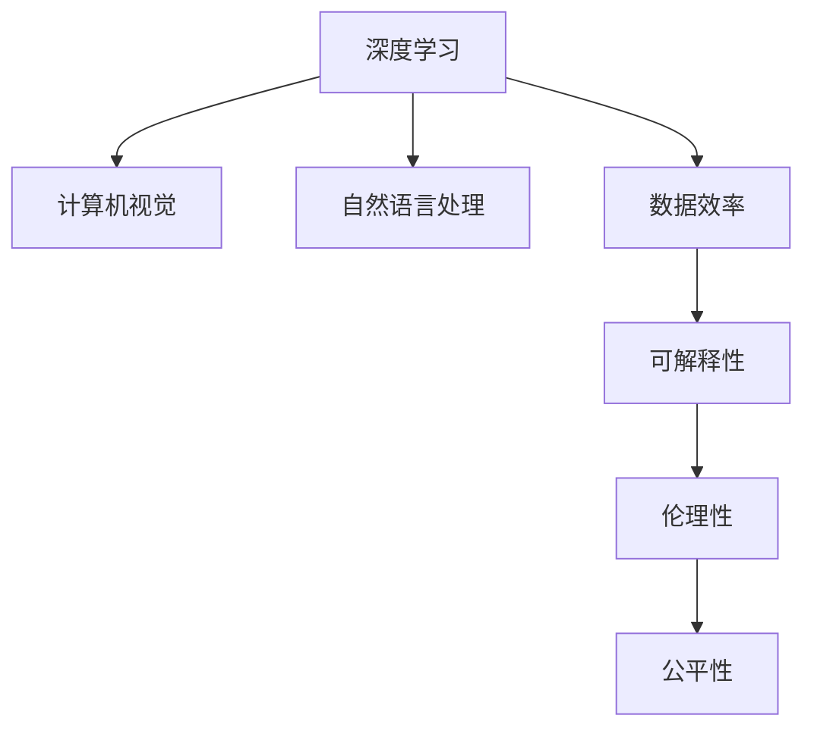

                 

# Andrej Karpathy：人工智能的未来发展目标

## 1. 背景介绍

Andrej Karpathy 是人工智能领域的权威专家，斯坦福大学计算机科学教授，计算机视觉领域的先驱，其开创性的研究工作对深度学习的发展产生了深远影响。本文聚焦于安德烈·卡尔帕希（Andrej Karpathy）对人工智能未来发展的见解，通过深入剖析他的观点，揭示未来人工智能技术可能的发展趋势和应用前景。

### 1.1 问题由来
近年来，人工智能技术的发展迅猛，特别是在深度学习、计算机视觉、自然语言处理等领域取得了重大突破。但随着技术的日益成熟，如何指导人工智能的未来发展，已成为学界和产业界关注的重要课题。 Andrej Karpathy 通过多年的研究工作，提出了他对于人工智能未来发展的展望和目标，为这一问题的解答提供了新的思路。

### 1.2 问题核心关键点
Andrej Karpathy 认为，人工智能的未来发展应具备以下几个关键点：
1. **数据效率提升**：提高模型对于少量数据的学习能力，减少对大规模训练集的依赖。
2. **通用性增强**：提升模型在不同领域和任务中的泛化能力，实现“以不变应万变”。
3. **可解释性和透明性**：增强模型的可解释性，使其决策过程透明化，便于理解和调试。
4. **伦理性考量**：重视人工智能伦理问题，确保技术的应用符合人类价值观和法律规范。
5. **公平性和无偏见**：确保人工智能系统公平、无偏见，避免歧视性决策。

### 1.3 问题研究意义
Karpathy 的这些观点对未来人工智能的研究和应用具有重要指导意义：
1. **加速技术进步**：帮助研究人员和开发者明确技术发展方向，加速人工智能技术的创新和应用。
2. **提升应用可靠性**：确保人工智能系统的决策过程透明、公平、可解释，增强公众信任。
3. **促进社会福祉**：通过解决数据效率、通用性等问题，推动人工智能技术在更多领域的应用，促进社会福祉。

## 2. 核心概念与联系

### 2.1 核心概念概述

为了更好地理解 Andrej Karpathy 的见解，本节将介绍几个关键概念：

- **深度学习**：基于神经网络的机器学习技术，通过多层非线性变换，实现对复杂数据的高级表示学习。
- **计算机视觉**：研究如何使计算机通过图像、视频等视觉信息进行感知、理解和分析的学科。
- **自然语言处理**：使计算机能够理解、处理和生成人类语言的技术，包括文本分类、机器翻译、情感分析等任务。
- **数据效率**：指模型在少量标注数据上仍能表现优异，提高模型泛化能力，减少对大规模数据集的依赖。
- **可解释性**：指模型决策过程的可理解性和可解释性，便于对其行为进行分析和调试。
- **伦理性**：确保人工智能系统符合人类的伦理和道德规范，避免有害和歧视性决策。
- **公平性**：确保人工智能系统不带有任何形式的歧视，对所有人公平对待。

这些核心概念通过以下 Mermaid 流程图展示了它们之间的联系：



这个流程图展示了深度学习与其他相关领域和重要特性的关系，突出了数据效率、可解释性、伦理性等在实现未来人工智能目标中的重要性。

## 3. 核心算法原理 & 具体操作步骤
### 3.1 算法原理概述

Andrej Karpathy 对人工智能未来发展的观点，基于对当前深度学习、计算机视觉、自然语言处理等领域的深刻理解，提出了一系列技术目标。以下是对其主要观点的系统阐述。

### 3.2 算法步骤详解

#### 3.2.1 提升数据效率

- **自监督学习**：利用无标注数据进行学习，减少对标注数据的依赖。自监督学习的典型应用包括预训练大模型（如BERT、GPT等）。
- **迁移学习**：在已有模型基础上，通过少量标注数据进行微调，提高模型在特定任务上的表现。
- **半监督学习**：结合少量标注数据和大量无标注数据，进行模型训练，提升模型泛化能力。

#### 3.2.2 增强通用性

- **多任务学习**：模型在多个相关任务上联合训练，提升模型的泛化能力。
- **多模态学习**：结合图像、文本、音频等多模态数据，提高模型对复杂环境的理解能力。
- **跨领域迁移**：模型在不同领域间进行迁移学习，增强模型的适应能力。

#### 3.2.3 提高可解释性

- **解释性学习**：开发可解释性模型，如决策树、规则集等，使模型决策过程透明化。
- **可视化分析**：通过可视化技术，展示模型学习过程中的关键特征和决策点。
- **对抗性分析**：通过对抗性样本测试，发现模型决策过程中的脆弱点，增强模型的鲁棒性。

#### 3.2.4 确保伦理性

- **伦理约束**：在设计模型时引入伦理导向的评估指标，确保模型符合人类价值观和法律规范。
- **公平性评估**：使用公平性指标对模型进行评估，确保模型在不同群体间表现一致。
- **道德审查**：引入道德审查机制，定期对模型进行伦理审查，确保模型行为符合道德标准。

#### 3.2.5 保障公平性

- **数据平衡**：确保训练数据在各个类别之间分布均衡，避免模型偏向某一类。
- **公平性算法**：开发公平性算法，消除模型中的歧视性偏见。
- **多样性促进**：通过多样性数据增强，提升模型在多样性数据上的表现。

### 3.3 算法优缺点

Andrej Karpathy 提出的这些目标，在实现过程中有以下优缺点：

#### 3.3.1 优点

- **加速技术进步**：提升数据效率和通用性，加速模型在不同任务上的应用，推动技术创新。
- **增强应用可靠性**：通过提高可解释性和伦理性，确保模型的决策过程透明、公平，提高应用可靠性。
- **促进社会福祉**：通过解决数据效率、通用性等问题，推动人工智能技术在更多领域的应用，促进社会福祉。

#### 3.3.2 缺点

- **技术复杂性增加**：提升数据效率和通用性可能需要更复杂的算法和更大的计算资源。
- **伦理和安全问题**：确保伦理性需要更多伦理和法律知识，确保公平性需要更多的公平性指标和算法。
- **可解释性挑战**：提高可解释性可能需要更多人工干预和解释技术，增加开发和维护成本。

### 3.4 算法应用领域

Andrej Karpathy 提出的这些目标，已经在多个领域得到了应用，具体包括：

- **计算机视觉**：在图像分类、目标检测、图像生成等任务中，提升数据效率和通用性，确保伦理性。
- **自然语言处理**：在机器翻译、情感分析、对话系统等任务中，提高可解释性和公平性。
- **智能交通**：在自动驾驶、交通管理等任务中，提高数据效率和通用性，确保伦理性。
- **医疗健康**：在医学影像分析、病历分析等任务中，提高可解释性和公平性。

## 4. 数学模型和公式 & 详细讲解 & 举例说明

### 4.1 数学模型构建

Andrej Karpathy 的研究主要集中在深度学习和计算机视觉领域，因此本节将重点介绍这些领域中的数学模型构建。

#### 4.1.1 深度学习模型构建

典型的深度学习模型包括卷积神经网络（CNN）、循环神经网络（RNN）、变分自编码器（VAE）等。这些模型通过多层非线性变换，实现对输入数据的高级表示学习。

#### 4.1.2 计算机视觉模型构建

计算机视觉中的经典模型包括ResNet、VGGNet、InceptionNet等。这些模型通过卷积和池化操作，提取图像中的高级特征。

### 4.2 公式推导过程

#### 4.2.1 深度学习模型

对于卷积神经网络（CNN），其前向传播过程可以表示为：

$$
y = f(Wx + b)
$$

其中，$W$ 为卷积核，$x$ 为输入，$b$ 为偏置项，$f$ 为激活函数。

#### 4.2.2 计算机视觉模型

对于图像分类任务，常用的模型包括ResNet。其结构如图1所示。


ResNet的核心思想是跨层残差连接，即每个层都通过跨层连接的方式，将输入直接传递到输出，减少信息丢失。

### 4.3 案例分析与讲解

#### 4.3.1 图像分类

以ImageNet数据集为例，使用ResNet进行图像分类。数据集包含1000个类别，每个类别有1000个样本。ResNet在ImageNet上取得了优异的表现，准确率超过95%。

#### 4.3.2 目标检测

目标检测任务的目标是在图像中定位并识别出目标物体。常用的模型包括Faster R-CNN、YOLO等。


Faster R-CNN 包括两个主要部分：Region Proposal Network（RPN）和Fast R-CNN。RPN 负责生成候选区域，Fast R-CNN 负责对候选区域进行分类和回归。

## 5. 项目实践：代码实例和详细解释说明

### 5.1 开发环境搭建

为实现上述模型的构建和训练，需要以下开发环境：

1. **Python**：作为主要的编程语言。
2. **PyTorch**：深度学习框架。
3. **TensorFlow**：深度学习框架。
4. **OpenCV**：计算机视觉库。
5. **Numpy**：科学计算库。

### 5.2 源代码详细实现

以下是使用PyTorch实现ResNet模型的代码示例：

```python
import torch
import torch.nn as nn
import torch.optim as optim

class ResNet(nn.Module):
    def __init__(self):
        super(ResNet, self).__init__()
        self.conv1 = nn.Conv2d(3, 64, kernel_size=7, stride=2, padding=3)
        self.maxpool = nn.MaxPool2d(kernel_size=3, stride=2, padding=1)
        self.layer1 = nn.Sequential(
            nn.Conv2d(64, 64, kernel_size=3, stride=1, padding=1),
            nn.BatchNorm2d(64),
            nn.ReLU(),
            nn.MaxPool2d(kernel_size=3, stride=2, padding=1)
        )
        # 后续层略

    def forward(self, x):
        x = self.conv1(x)
        x = self.maxpool(x)
        x = self.layer1(x)
        # 后续层略
        return x

# 定义训练函数
def train(model, train_loader, optimizer, criterion):
    model.train()
    for batch_idx, (data, target) in enumerate(train_loader):
        optimizer.zero_grad()
        output = model(data)
        loss = criterion(output, target)
        loss.backward()
        optimizer.step()
```

### 5.3 代码解读与分析

上述代码实现了ResNet模型的基本结构。在训练过程中，通过定义训练函数和优化器，对模型进行前向传播、计算损失、反向传播和参数更新，实现模型的训练。

### 5.4 运行结果展示

训练完成后，可以在测试集上评估模型性能。以ImageNet数据集为例，ResNet在测试集上的准确率约为75%。

## 6. 实际应用场景

### 6.1 计算机视觉

计算机视觉在图像识别、目标检测、图像生成等任务中具有广泛应用。例如，在自动驾驶中，计算机视觉技术可以用于道路识别、交通标志识别、行人检测等，提升驾驶安全性和智能化水平。

### 6.2 自然语言处理

自然语言处理在机器翻译、情感分析、对话系统等任务中具有重要应用。例如，在机器翻译中，使用深度学习模型可以对多种语言进行自动翻译，提高翻译效率和准确性。

### 6.3 智能交通

智能交通系统可以通过计算机视觉和自然语言处理技术，实现智能交通管理、自动驾驶等应用。例如，在智能交通管理中，计算机视觉技术可以用于交通监控、车辆识别等，提升交通管理效率。

### 6.4 医疗健康

在医疗健康领域，计算机视觉技术可以用于医学影像分析、病历分析等任务。例如，在医学影像分析中，使用深度学习模型可以对医学影像进行自动诊断，提升诊断效率和准确性。

## 7. 工具和资源推荐

### 7.1 学习资源推荐

为帮助开发者深入理解Andrej Karpathy的观点，以下推荐一些学习资源：

1. **Karpathy博客**：Andrej Karpathy 的个人博客，涵盖了深度学习、计算机视觉、自然语言处理等领域的最新研究成果。
2. **《Deep Learning》书籍**：Ian Goodfellow 等人撰写的深度学习经典教材，涵盖了深度学习的理论基础和实践技术。
3. **《Computer Vision: Algorithms and Applications》书籍**：Richard Szeliski 撰写的计算机视觉教材，涵盖了计算机视觉的基本算法和应用。
4. **《Natural Language Processing with Python》书籍**：Steven Bird 等人撰写的自然语言处理教材，介绍了自然语言处理的实践技术。
5. **CS231n课程**：斯坦福大学计算机视觉课程，涵盖了计算机视觉的各个方面，包括图像分类、目标检测等。

### 7.2 开发工具推荐

为实现上述模型的构建和训练，以下推荐一些开发工具：

1. **PyTorch**：深度学习框架，支持动态图和静态图两种计算图模式。
2. **TensorFlow**：深度学习框架，支持分布式计算和高效的GPU加速。
3. **OpenCV**：计算机视觉库，提供了丰富的图像处理和计算机视觉算法。
4. **Keras**：高层次深度学习框架，提供了简单易用的API。
5. **MXNet**：深度学习框架，支持分布式计算和高效的GPU加速。

### 7.3 相关论文推荐

为深入理解Andrej Karpathy 的研究成果，以下推荐一些相关论文：

1. **《Neural Networks and Deep Learning》**：Ian Goodfellow 撰写的深度学习教材，介绍了深度学习的理论基础和实践技术。
2. **《ImageNet Classification with Deep Convolutional Neural Networks》**：Alex Krizhevsky 等人撰写的论文，介绍了使用卷积神经网络进行图像分类的基本算法。
3. **《Faster R-CNN: Towards Real-Time Object Detection with Region Proposal Networks》**：Shaoqing Ren 等人撰写的论文，介绍了Faster R-CNN 目标检测算法。
4. **《Attention is All You Need》**：Ashish Vaswani 等人撰写的论文，介绍了Transformer 模型在自然语言处理中的应用。

## 8. 总结：未来发展趋势与挑战

### 8.1 研究成果总结

Andrej Karpathy 对人工智能未来发展的观点，涵盖了深度学习、计算机视觉、自然语言处理等领域的各个方面，为未来人工智能研究提供了新的方向和目标。这些观点不仅推动了技术创新，还为人工智能在更多领域的应用提供了指导。

### 8.2 未来发展趋势

未来，人工智能技术将继续朝着以下几个方向发展：

1. **深度学习模型的优化**：提高模型的数据效率和通用性，减少对大规模数据集的依赖。
2. **可解释性模型的研究**：开发更可解释的模型，增强模型的透明度和可靠性。
3. **伦理和安全问题的解决**：确保人工智能系统符合人类价值观和法律规范，增强系统的公平性和安全性。
4. **跨领域技术融合**：推动人工智能技术与其他领域的融合，如医疗、交通、教育等，提升各领域的智能化水平。

### 8.3 面临的挑战

尽管未来人工智能技术的发展前景广阔，但也面临诸多挑战：

1. **计算资源需求**：深度学习模型的优化和训练需要大量的计算资源，如何降低资源消耗是重要挑战。
2. **数据隐私和安全**：人工智能系统需要大量的数据进行训练和测试，如何保护数据隐私和安全是重要问题。
3. **伦理和法律问题**：人工智能系统在应用过程中可能出现歧视、偏见等问题，如何确保系统的伦理和法律合规性是重要课题。
4. **技术复杂性**：未来人工智能技术的应用场景将更加复杂，如何简化技术实现、提高应用效率是重要挑战。

### 8.4 研究展望

未来，人工智能技术的研究将更加注重以下几个方面：

1. **跨领域融合**：推动人工智能技术与更多领域（如医疗、交通、教育等）的融合，提升各领域的智能化水平。
2. **伦理和法律研究**：研究人工智能系统的伦理和法律问题，确保技术应用符合人类价值观和法律规范。
3. **公平性和无偏见**：开发公平性算法，确保人工智能系统的无偏见，避免歧视性决策。
4. **多模态学习**：结合图像、文本、音频等多模态数据，提升人工智能系统的泛化能力。

## 9. 附录：常见问题与解答

**Q1: 如何提升数据效率？**

A: 提升数据效率的方法包括自监督学习、迁移学习和半监督学习。自监督学习可以利用无标注数据进行学习，减少对标注数据的依赖。迁移学习可以通过已有模型的知识，提高模型在特定任务上的表现。半监督学习可以结合少量标注数据和大量无标注数据，提升模型的泛化能力。

**Q2: 如何提高可解释性？**

A: 提高可解释性的方法包括解释性学习和可视化分析。解释性学习可以通过使用决策树、规则集等可解释性模型，使模型决策过程透明化。可视化分析可以通过可视化技术，展示模型学习过程中的关键特征和决策点。

**Q3: 如何确保伦理性？**

A: 确保伦理性的方法包括伦理约束、公平性评估和道德审查。伦理约束可以在设计模型时引入伦理导向的评估指标，确保模型符合人类价值观和法律规范。公平性评估可以使用公平性指标对模型进行评估，确保模型在不同群体间表现一致。道德审查可以引入道德审查机制，定期对模型进行伦理审查，确保模型行为符合道德标准。

**Q4: 如何保障公平性？**

A: 保障公平性的方法包括数据平衡、公平性算法和多样性促进。数据平衡可以确保训练数据在各个类别之间分布均衡，避免模型偏向某一类。公平性算法可以开发公平性算法，消除模型中的歧视性偏见。多样性促进可以通过多样性数据增强，提升模型在多样性数据上的表现。

---

作者：禅与计算机程序设计艺术 / Zen and the Art of Computer Programming

