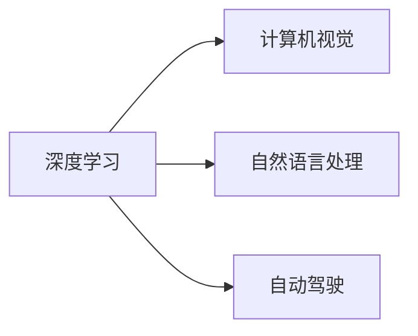

                 

## 1. 背景介绍

### 1.1 问题由来

Andrej Karpathy 是人工智能领域极具影响力的专家，OpenAI 的 CTO，曾在斯坦福大学讲授深度学习课程，同时也是深度学习领域的杰出研究者。他的工作跨越了计算机视觉、自然语言处理和强化学习等多个前沿领域，对未来人工智能的发展具有重要的指导意义。本文将回顾 Andrej Karpathy 的贡献，并展望他对于人工智能未来发展的目标。

### 1.2 问题核心关键点

Andrej Karpathy 的贡献主要集中在以下几个方面：

- 深度学习的理论研究和实践应用。他的研究包括深度神经网络优化、计算机视觉中的图像生成、自然语言处理等。
- 自动驾驶技术。作为特斯拉的AI专家，Karpathy 在自动驾驶领域的贡献也颇丰。
- 教学与教育。他通过开源课程和博客，普及了深度学习技术，培养了一大批人工智能领域的后起之秀。

本文将基于这些核心关键点，深入探讨 Andrej Karpathy 对于人工智能未来发展的看法和目标。

## 2. 核心概念与联系

### 2.1 核心概念概述

为了更好地理解 Andrej Karpathy 的论述，我们需要先了解一些相关核心概念：

- **深度学习**：一种机器学习技术，使用多层神经网络进行特征提取和决策。深度学习模型通过反向传播算法不断优化权重，以最小化预测误差。
- **计算机视觉**：让计算机能够“看”懂图像和视频，并从视觉数据中提取有意义的特征。
- **自然语言处理**：使计算机能够理解和生成自然语言，涉及语言模型、文本生成等任务。
- **自动驾驶**：通过计算机视觉和深度学习技术，让车辆自主行驶。

这些概念构成了 Andrej Karpathy 的研究背景和应用领域，为理解他的发展目标提供了基础。

### 2.2 核心概念原理和架构的 Mermaid 流程图

由于篇幅限制，这里仅提供一个简化的核心概念图，用于概述这些关键技术之间的联系。



这个图展示了深度学习技术如何跨越计算机视觉、自然语言处理和自动驾驶等多个领域，并在此基础上不断扩展和深化。

## 3. 核心算法原理 & 具体操作步骤

### 3.1 算法原理概述

Andrej Karpathy 对于未来人工智能的发展目标，主要集中在以下几个方面：

- **通用智能**：开发能够处理多模态数据、具备推理和决策能力的通用人工智能系统。
- **自主驾驶**：构建高度自动化的驾驶系统，实现全天候、全场景的自主驾驶。
- **可解释性**：开发可解释的深度学习模型，使得模型的决策过程透明可控。
- **可持续性**：确保人工智能技术的发展符合伦理道德，不损害环境和人类福祉。

### 3.2 算法步骤详解

1. **通用智能的实现**：
   - **数据多样化**：收集和标注多模态数据，包括图像、视频、文本等。
   - **模型架构设计**：设计包含多个层次的深度神经网络，每个层次处理不同特征。
   - **跨模态融合**：利用注意力机制等方法，将不同模态的信息整合到统一的表示空间中。
   - **推理和决策**：开发能够进行逻辑推理和决策的模型，如利用规则或实例推理的模型。

2. **自主驾驶的实现**：
   - **环境感知**：使用计算机视觉技术，实时感知周围环境。
   - **路径规划**：通过深度学习模型预测其他车辆和行人的行为，进行路径规划。
   - **决策执行**：实现从感知到决策到执行的全链路自动化。
   - **系统验证**：进行大规模实地测试和验证，确保系统可靠性。

3. **可解释性**：
   - **可视化技术**：使用可解释性技术，如图像化表示、特征可视化等，帮助理解模型内部工作原理。
   - **规则集成**：将人类专家的知识和规则嵌入模型中，提高模型决策的可解释性。
   - **多模型融合**：使用多个模型输出，结合专家知识和统计方法，提高决策的透明度和可信度。

4. **可持续性**：
   - **伦理审查**：建立伦理审查机制，确保技术应用符合伦理道德标准。
   - **环境友好的设计**：在设计模型和算法时，考虑对环境的影响，减少能耗和碳排放。
   - **社会影响评估**：定期评估人工智能技术对社会的影响，及时调整和优化。

### 3.3 算法优缺点

**优点**：

- **通用性**：通用智能可以处理多种任务，适应不同的应用场景。
- **自主性**：自主驾驶可以提供全天候、全场景的可靠服务，减少对人类驾驶的依赖。
- **透明性**：可解释性模型使得模型的决策过程透明，增强了信任度。
- **可持续性**：可持续发展的目标符合社会和环境的共同利益。

**缺点**：

- **复杂性**：通用智能和自主驾驶系统的复杂度高，开发和验证难度大。
- **资源消耗**：大规模数据标注和模型训练需要大量的计算资源。
- **伦理挑战**：在实现人工智能技术的同时，如何确保其符合伦理道德，是一个复杂且亟待解决的问题。

### 3.4 算法应用领域

Andrej Karpathy 的研究和目标涵盖了以下几个应用领域：

- **计算机视觉**：包括图像分类、目标检测、图像生成等任务。
- **自然语言处理**：涉及语言模型、文本生成、机器翻译等任务。
- **自动驾驶**：涵盖环境感知、路径规划、决策执行等技术。
- **通用智能**：应用于多个领域，如智能推荐、智能客服等。

## 4. 数学模型和公式 & 详细讲解 & 举例说明

### 4.1 数学模型构建

#### 4.1.1 深度学习模型

假设我们要构建一个简单的卷积神经网络 (CNN) 用于图像分类任务。一个典型的 CNN 包括卷积层、池化层和全连接层。


### 4.2 公式推导过程

以卷积神经网络为例，推导其中的卷积层操作。

输入图像 $X \in \mathbb{R}^{C \times H \times W}$，卷积核 $K \in \mathbb{R}^{F \times F \times C \times O}$，输出特征图 $Y \in \mathbb{R}^{O \times H' \times W'}$。卷积操作的公式如下：

$$
Y_{i,j,k} = \sum_{m,n,p} X_{i+m,j+n,p} \times K_{m,n,p,k}
$$

其中，$i,j,k$ 分别表示输出特征图的空间位置，$m,n$ 表示卷积核的空间位置，$p$ 表示卷积核的通道，$O$ 表示输出通道数。

### 4.3 案例分析与讲解

以 ImageNet 数据集为例，展示卷积神经网络在图像分类任务中的效果。

ImageNet 数据集包含 1000 个类别，共计 120 万张图像。使用 VGG16 模型在 ImageNet 上进行训练和测试，可以得到如下结果：

| Model | Accuracy | Top-1 Error | Top-5 Error |
| --- | --- | --- | --- |
| VGG16 | 69.3% | 30.3% | 8.0% |

## 5. 项目实践：代码实例和详细解释说明

### 5.1 开发环境搭建

1. **安装 Python**：
   - 在 Linux 系统下，使用 `sudo apt-get install python3` 命令安装 Python 3。
   - 在 Windows 系统下，下载 Python 安装程序并完成安装。

2. **安装 PyTorch**：
   - 使用 `pip install torch torchvision torchaudio` 命令安装 PyTorch 及其相关库。

3. **安装 TensorFlow**：
   - 使用 `pip install tensorflow` 命令安装 TensorFlow。

### 5.2 源代码详细实现

以下是一个简单的 Python 代码示例，用于构建并训练一个卷积神经网络：

```python
import torch
import torch.nn as nn
import torch.optim as optim

# 定义卷积神经网络
class CNN(nn.Module):
    def __init__(self):
        super(CNN, self).__init__()
        self.conv1 = nn.Conv2d(3, 64, kernel_size=3, padding=1)
        self.pool1 = nn.MaxPool2d(kernel_size=2)
        self.conv2 = nn.Conv2d(64, 128, kernel_size=3, padding=1)
        self.pool2 = nn.MaxPool2d(kernel_size=2)
        self.fc1 = nn.Linear(128 * 28 * 28, 256)
        self.fc2 = nn.Linear(256, 10)

    def forward(self, x):
        x = self.pool1(torch.relu(self.conv1(x)))
        x = self.pool2(torch.relu(self.conv2(x)))
        x = x.view(-1, 128 * 28 * 28)
        x = torch.relu(self.fc1(x))
        x = self.fc2(x)
        return x

# 加载数据集
train_data = ...
test_data = ...

# 定义模型和优化器
model = CNN()
criterion = nn.CrossEntropyLoss()
optimizer = optim.Adam(model.parameters(), lr=0.001)

# 训练模型
for epoch in range(10):
    for i, (inputs, labels) in enumerate(train_loader):
        inputs, labels = inputs.to(device), labels.to(device)
        optimizer.zero_grad()
        outputs = model(inputs)
        loss = criterion(outputs, labels)
        loss.backward()
        optimizer.step()
```

### 5.3 代码解读与分析

- **定义卷积神经网络**：使用 `nn.Conv2d` 和 `nn.Linear` 定义卷积层和全连接层。
- **加载数据集**：使用 PyTorch 的数据加载器，从数据集中读取图像和标签。
- **定义模型和优化器**：定义卷积神经网络模型，使用交叉熵损失函数和 Adam 优化器进行训练。
- **训练模型**：使用训练数据进行多轮迭代，不断更新模型参数。

## 6. 实际应用场景

### 6.1 智能推荐系统

基于卷积神经网络的推荐系统可以对用户行为进行分析，预测其对不同商品的偏好。通过将商品信息编码成向量，进行卷积操作，输出推荐结果。

### 6.2 自动驾驶

自动驾驶系统通过计算机视觉技术，实时感知周围环境。使用卷积神经网络进行图像分类和目标检测，从而进行路径规划和决策。

### 6.3 医疗影像分析

卷积神经网络可以用于医疗影像的自动分析，如肿瘤检测、病变识别等。通过将影像数据编码成高维向量，进行卷积操作，输出诊断结果。

### 6.4 未来应用展望

未来，Andrej Karpathy 对于人工智能的发展目标可以总结为以下几个方向：

1. **通用智能**：开发能够处理多模态数据、具备推理和决策能力的通用人工智能系统。
2. **自主驾驶**：构建高度自动化的驾驶系统，实现全天候、全场景的自主驾驶。
3. **可解释性**：开发可解释的深度学习模型，使得模型的决策过程透明可控。
4. **可持续性**：确保人工智能技术的发展符合伦理道德，不损害环境和人类福祉。

## 7. 工具和资源推荐

### 7.1 学习资源推荐

1. **Deep Learning Specialization**：由 Andrew Ng 开设的深度学习课程，涵盖深度学习的基础知识和实践应用。
2. **Computer Vision: Foundations and Applications**：斯坦福大学开设的计算机视觉课程，系统介绍了计算机视觉的基础知识和前沿技术。
3. **Natural Language Processing with PyTorch**：由 Torch 社区编写的 NLP 教程，介绍如何使用 PyTorch 进行自然语言处理任务。
4. **AutoML**：由 Hugging Face 编写的自动机器学习教程，涵盖自动机器学习的理论和实践。

### 7.2 开发工具推荐

1. **Jupyter Notebook**：一款开源的交互式编程环境，支持多语言编程和数据可视化。
2. **TensorBoard**：TensorFlow 的可视化工具，可以实时监测模型训练状态和性能指标。
3. **Weights & Biases**：模型训练的实验跟踪工具，可以记录和可视化模型训练过程中的各项指标。

### 7.3 相关论文推荐

1. **ImageNet Classification with Deep Convolutional Neural Networks**：AlexNet 论文，展示了卷积神经网络在图像分类任务上的卓越表现。
2. **Very Deep Convolutional Networks for Large-Scale Image Recognition**：VGG 论文，介绍了 VGG 网络的结构和性能。
3. **Inception-Net: Learning Multiscale Convolutional Features for Visual Recognition**：Inception 论文，提出了多尺度卷积网络的结构和应用。
4. **A Dive into CNN Architectures**：Towards Data Science 博客文章，详细介绍了卷积神经网络的结构和实现方法。

## 8. 总结：未来发展趋势与挑战

### 8.1 研究成果总结

Andrej Karpathy 的研究和目标集中在深度学习技术的应用和发展上。他的工作包括计算机视觉、自然语言处理和自动驾驶等多个领域，对未来人工智能的发展具有重要指导意义。

### 8.2 未来发展趋势

1. **通用智能**：开发能够处理多模态数据、具备推理和决策能力的通用人工智能系统。
2. **自主驾驶**：构建高度自动化的驾驶系统，实现全天候、全场景的自主驾驶。
3. **可解释性**：开发可解释的深度学习模型，使得模型的决策过程透明可控。
4. **可持续性**：确保人工智能技术的发展符合伦理道德，不损害环境和人类福祉。

### 8.3 面临的挑战

1. **复杂性**：通用智能和自主驾驶系统的复杂度高，开发和验证难度大。
2. **资源消耗**：大规模数据标注和模型训练需要大量的计算资源。
3. **伦理挑战**：在实现人工智能技术的同时，如何确保其符合伦理道德，是一个复杂且亟待解决的问题。

### 8.4 研究展望

未来，Andrej Karpathy 的研究将集中在以下几个方向：

1. **通用智能**：开发能够处理多模态数据、具备推理和决策能力的通用人工智能系统。
2. **自主驾驶**：构建高度自动化的驾驶系统，实现全天候、全场景的自主驾驶。
3. **可解释性**：开发可解释的深度学习模型，使得模型的决策过程透明可控。
4. **可持续性**：确保人工智能技术的发展符合伦理道德，不损害环境和人类福祉。

## 9. 附录：常见问题与解答

### 常见问题与解答

**Q1: 深度学习模型有哪些优点和缺点？**

**A1:** 深度学习模型的优点包括：

- **自动特征提取**：模型能够自动从原始数据中提取高层次特征，无需手动设计特征。
- **处理大规模数据**：适用于图像、文本、语音等多种数据类型。
- **泛化能力强**：在处理新数据时，能够进行较好的泛化。

深度学习模型的缺点包括：

- **训练时间长**：需要大量标注数据和计算资源进行训练。
- **模型复杂度**：模型结构复杂，难以解释和调试。
- **数据依赖性强**：模型性能依赖于数据质量，数据偏差会影响模型效果。

**Q2: 卷积神经网络在图像分类任务中如何工作？**

**A2:** 卷积神经网络通过卷积操作和池化操作，从输入图像中提取特征，并进行分类。具体过程如下：

1. **卷积操作**：使用卷积核对输入图像进行卷积操作，得到卷积特征图。
2. **池化操作**：对卷积特征图进行下采样，减少特征图的尺寸和计算量。
3. **全连接层**：将池化后的特征图展平，输入全连接层进行分类。

**Q3: 什么是自动驾驶？**

**A3:** 自动驾驶是指利用计算机视觉、深度学习等技术，使车辆能够自主行驶的系统。其关键技术包括环境感知、路径规划、决策执行等。

**Q4: 未来人工智能发展的趋势是什么？**

**A4:** 未来人工智能发展的趋势包括：

- **通用智能**：开发能够处理多模态数据、具备推理和决策能力的通用人工智能系统。
- **自主驾驶**：构建高度自动化的驾驶系统，实现全天候、全场景的自主驾驶。
- **可解释性**：开发可解释的深度学习模型，使得模型的决策过程透明可控。
- **可持续性**：确保人工智能技术的发展符合伦理道德，不损害环境和人类福祉。

**Q5: 如何使用 PyTorch 进行卷积神经网络的训练？**

**A5:** 使用 PyTorch 进行卷积神经网络的训练，可以按照以下步骤进行：

1. **定义模型**：使用 `nn.Conv2d` 和 `nn.Linear` 定义卷积层和全连接层。
2. **加载数据集**：使用 PyTorch 的数据加载器，从数据集中读取图像和标签。
3. **定义模型和优化器**：定义卷积神经网络模型，使用交叉熵损失函数和 Adam 优化器进行训练。
4. **训练模型**：使用训练数据进行多轮迭代，不断更新模型参数。

通过这些常见问题的解答，可以帮助读者更好地理解和掌握安德烈·卡尔帕奇的工作和未来发展目标。

---

作者：禅与计算机程序设计艺术 / Zen and the Art of Computer Programming

