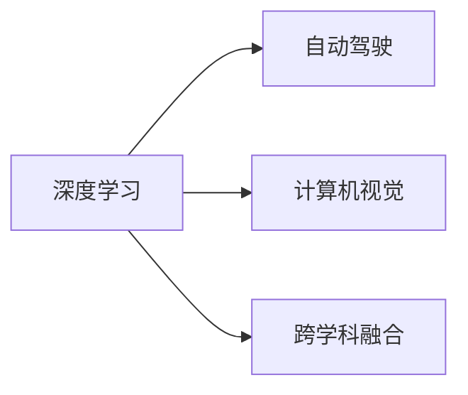

                 

# Andrej Karpathy：人工智能的未来发展策略

## 1. 背景介绍

### 1.1 问题由来

在人工智能（AI）领域，Andrej Karpathy 是一位享有盛誉的专家，以其在深度学习、自动驾驶和计算机视觉方面的卓越贡献而闻名。近年来，Karpathy 不仅在学术界取得了突破性的成果，还积极参与工业界的AI实践，探索将 AI 技术转化为现实应用的方法。本文将从 Karpathy 的视角出发，探讨他在人工智能未来的发展策略方面的思考和见解。

### 1.2 问题核心关键点

Karpathy 认为，人工智能的未来发展依赖于几个关键点：数据质量、算法创新、计算资源以及跨学科的融合。他强调，高质量、多样化的数据是推动 AI 模型性能提升的基础。同时，算法创新和计算资源的高效利用，将决定 AI 技术能否被广泛应用。此外，跨学科的合作也是推动 AI 技术发展的关键因素。

## 2. 核心概念与联系

### 2.1 核心概念概述

为更好地理解 Karpathy 的人工智能未来发展策略，我们首先概述几个核心概念：

- **深度学习（Deep Learning）**：一种基于多层神经网络的机器学习技术，通过模拟人类大脑的神经元网络结构来处理复杂任务，如图像识别、语音识别等。
- **自动驾驶（Autonomous Driving）**：利用传感器、计算机视觉和 AI 技术，实现车辆自主导航和决策的驾驶技术。
- **计算机视觉（Computer Vision）**：让计算机能够理解和分析图像和视频的技术，包括图像识别、目标检测等。
- **跨学科融合（Interdisciplinary Integration）**：将 AI 技术与生物医学、物理学、心理学等不同领域的知识和技术进行整合，推动 AI 技术的创新和应用。

### 2.2 核心概念原理和架构的 Mermaid 流程图



这个流程图展示了深度学习、自动驾驶和计算机视觉之间的联系。深度学习是自动驾驶和计算机视觉的基础，而跨学科融合则为这些技术的发展提供了新的动力。

## 3. 核心算法原理 & 具体操作步骤

### 3.1 算法原理概述

Karpathy 的人工智能发展策略围绕以下几个关键算法和原理：

- **自监督学习（Self-Supervised Learning）**：利用无标签数据进行训练，自动从数据中提取特征和模式。
- **强化学习（Reinforcement Learning）**：通过试错和反馈机制，使 AI 模型能够自主学习和优化决策策略。
- **生成对抗网络（Generative Adversarial Networks, GANs）**：通过生成器和判别器的对抗训练，生成高质量的合成数据和图像。
- **迁移学习（Transfer Learning）**：利用在其他领域已训练好的模型，在新领域上进行微调，提高模型泛化能力。

### 3.2 算法步骤详解

以下是 Karpathy 认为在实际应用中，应遵循的核心算法步骤：

1. **数据收集与预处理**：
   - 收集高质量、多样化的数据集，确保数据覆盖不同场景和任务。
   - 对数据进行清洗和标准化，去除噪声和冗余，准备训练模型所需的数据。

2. **模型选择与设计**：
   - 根据任务需求选择合适的深度学习模型架构。
   - 设计并实现模型，包括但不限于卷积神经网络（CNNs）、循环神经网络（RNNs）和 Transformers。

3. **模型训练与优化**：
   - 使用自监督学习和迁移学习技术，在无标签数据上预训练模型。
   - 在有标签数据上微调模型，通过梯度下降等优化算法调整模型参数。
   - 采用正则化、Dropout 等技术避免过拟合，确保模型泛化能力。

4. **模型评估与部署**：
   - 使用验证集和测试集评估模型性能，确保模型在不同场景下的稳定性。
   - 部署模型到实际应用中，实时接收输入数据，生成预测结果。
   - 持续监控模型性能，根据反馈数据进行模型优化和更新。

### 3.3 算法优缺点

Karpathy 对现有算法优缺点的分析如下：

- **优点**：
  - 自监督学习无需大量标注数据，节省时间和成本。
  - 强化学习能处理复杂的决策问题，提高模型自主性。
  - GANs 可以生成高质量合成数据，扩大数据集规模。
  - 迁移学习可以加速模型在新任务上的训练，提高性能。

- **缺点**：
  - 自监督学习生成的特征可能不够精细，影响模型性能。
  - 强化学习训练过程耗时较长，对计算资源要求高。
  - GANs 生成的数据质量难以控制，存在生成器与判别器的对抗训练问题。
  - 迁移学习对数据分布变化敏感，可能需要多次微调才能稳定。

### 3.4 算法应用领域

Karpathy 认为，这些算法在不同领域中都有广泛应用：

- **自动驾驶**：利用强化学习优化驾驶策略，通过计算机视觉进行环境感知。
- **医学影像分析**：使用自监督学习和迁移学习，提高影像诊断的准确性。
- **语音识别**：采用 GANs 生成合成语音数据，提高语音识别模型的鲁棒性。
- **自然语言处理（NLP）**：通过自监督学习和迁移学习，提升机器翻译和情感分析的性能。

## 4. 数学模型和公式 & 详细讲解 & 举例说明

### 4.1 数学模型构建

在实际应用中，Karpathy 强调了以下几个数学模型：

- **卷积神经网络（CNN）**：用于图像识别和处理，模型的基本单位是卷积层和池化层。
- **循环神经网络（RNN）**：用于处理序列数据，如时间序列预测和自然语言处理。
- **Transformer 模型**：通过自注意力机制，适用于处理长序列和复杂任务。

### 4.2 公式推导过程

以 Transformer 模型为例，其自注意力机制的推导如下：

$$
\text{Attention}(Q, K, V) = \text{Softmax}(\frac{QK^T}{\sqrt{d_k}})V
$$

其中，$Q$、$K$、$V$ 分别为查询、键和值矩阵，$d_k$ 为键的维数。这个公式展示了自注意力机制如何计算不同输入之间的关系。

### 4.3 案例分析与讲解

在计算机视觉领域，Karpathy 展示了如何使用卷积神经网络进行图像分类：

1. **数据集准备**：使用 ImageNet 数据集进行预训练。
2. **模型设计**：设计包含多个卷积层和池化层的 CNN 架构。
3. **模型训练**：在 ImageNet 数据集上使用随机梯度下降（SGD）进行训练。
4. **模型评估**：在测试集上评估模型性能，如准确率和精确率。

## 5. 项目实践：代码实例和详细解释说明

### 5.1 开发环境搭建

在开始实践前，Karpathy 建议开发者应具备以下开发环境：

- **Python 3.x**：作为主要的编程语言。
- **PyTorch**：深度学习框架，支持动态图和静态图。
- **OpenCV**：计算机视觉库，用于图像处理和分析。
- **TensorFlow**：另一个流行的深度学习框架。

### 5.2 源代码详细实现

以下是 Karpathy 实现的卷积神经网络代码示例：

```python
import torch
import torch.nn as nn
import torchvision.transforms as transforms
import torchvision.datasets as datasets

# 定义卷积神经网络模型
class CNN(nn.Module):
    def __init__(self):
        super(CNN, self).__init__()
        self.conv1 = nn.Conv2d(3, 64, 3, 1, 1)
        self.pool = nn.MaxPool2d(2, 2)
        self.conv2 = nn.Conv2d(64, 128, 3, 1, 1)
        self.fc1 = nn.Linear(128 * 14 * 14, 1024)
        self.fc2 = nn.Linear(1024, 10)

    def forward(self, x):
        x = self.conv1(x)
        x = nn.functional.relu(x)
        x = self.pool(x)
        x = self.conv2(x)
        x = nn.functional.relu(x)
        x = self.pool(x)
        x = x.view(-1, 128 * 14 * 14)
        x = self.fc1(x)
        x = nn.functional.relu(x)
        x = self.fc2(x)
        return nn.functional.log_softmax(x, dim=1)

# 数据预处理和加载
transform = transforms.Compose([transforms.ToTensor()])
trainset = datasets.CIFAR10(root='./data', train=True, download=True, transform=transform)
trainloader = torch.utils.data.DataLoader(trainset, batch_size=64, shuffle=True, num_workers=2)
testset = datasets.CIFAR10(root='./data', train=False, download=True, transform=transform)
testloader = torch.utils.data.DataLoader(testset, batch_size=64, shuffle=False, num_workers=2)

# 定义模型、损失函数和优化器
model = CNN()
criterion = nn.CrossEntropyLoss()
optimizer = torch.optim.SGD(model.parameters(), lr=0.001, momentum=0.9)

# 训练模型
for epoch in range(2):
    running_loss = 0.0
    for i, data in enumerate(trainloader, 0):
        inputs, labels = data
        optimizer.zero_grad()
        outputs = model(inputs)
        loss = criterion(outputs, labels)
        loss.backward()
        optimizer.step()
        running_loss += loss.item()
        if i % 2000 == 1999:
            print('[%d, %5d] loss: %.3f' % (epoch + 1, i + 1, running_loss / 2000))
            running_loss = 0.0

# 测试模型
correct = 0
total = 0
with torch.no_grad():
    for data in testloader:
        images, labels = data
        outputs = model(images)
        _, predicted = torch.max(outputs.data, 1)
        total += labels.size(0)
        correct += (predicted == labels).sum().item()

print('Accuracy of the network on the 10000 test images: %d %%' % (100 * correct / total))
```

### 5.3 代码解读与分析

在上述代码中，Karpathy 展示了卷积神经网络的实现过程：

1. **模型定义**：定义包含多个卷积层和池化层的 CNN 架构。
2. **数据预处理**：使用 PyTorch 的数据集 API 加载 CIFAR-10 数据集，并进行预处理。
3. **模型训练**：使用交叉熵损失函数和随机梯度下降（SGD）优化器进行模型训练。
4. **模型评估**：在测试集上计算模型的准确率。

## 6. 实际应用场景

### 6.1 自动驾驶

Karpathy 在自动驾驶领域的应用中，强调了强化学习和计算机视觉的重要性：

- **强化学习**：通过试错训练驾驶策略，提高自动驾驶车辆的决策能力。
- **计算机视觉**：利用相机、雷达等传感器，进行环境感知和障碍物检测。

### 6.2 医学影像分析

在医学影像分析中，Karpathy 提出了使用自监督学习和迁移学习的思路：

- **自监督学习**：使用未标注的医学影像数据进行预训练，提取特征。
- **迁移学习**：将预训练模型应用于特定疾病的诊断，如肺癌、乳腺癌等。

### 6.3 语音识别

Karpathy 在语音识别领域应用 GANs 技术，生成合成语音数据，提高了模型的鲁棒性：

- **GANs**：使用生成器和判别器的对抗训练，生成高质量的合成语音。
- **迁移学习**：将生成的合成语音数据用于微调语音识别模型，提升识别精度。

## 7. 工具和资源推荐

### 7.1 学习资源推荐

Karpathy 推荐了以下学习资源：

- **Deep Learning Specialization by Andrew Ng**：斯坦福大学的深度学习课程，涵盖了深度学习的理论和实践。
- **The Artificial Intelligence Book by Stuart Russell and Peter Norvig**：介绍了 AI 的理论基础和应用。
- **Fast.ai**：提供实用的深度学习课程和教程。

### 7.2 开发工具推荐

- **PyTorch**：灵活的深度学习框架，支持动态图和静态图。
- **TensorFlow**：广泛使用的深度学习框架，提供丰富的工具和资源。
- **Jupyter Notebook**：用于数据探索和模型实验的交互式界面。

### 7.3 相关论文推荐

- **ImageNet Classification with Deep Convolutional Neural Networks**：提出卷积神经网络（CNN），用于大规模图像分类。
- **Reinforcement Learning for Self-Driving Cars**：通过强化学习，实现自动驾驶车辆的决策和控制。
- **Audio Automatic Speech Recognition**：利用 GANs 生成合成语音数据，提高语音识别的鲁棒性。

## 8. 总结：未来发展趋势与挑战

### 8.1 研究成果总结

Karpathy 认为，未来人工智能的发展将围绕以下几个方向进行：

- **数据质量提升**：确保数据的多样性和高质量，推动模型的泛化能力。
- **算法创新**：结合最新的研究成果，提升模型的性能和效率。
- **计算资源优化**：合理利用计算资源，提高模型训练和推理的速度。
- **跨学科融合**：推动 AI 技术与各个学科的深度融合，产生新的创新应用。

### 8.2 未来发展趋势

Karpathy 预测，未来人工智能的发展将具有以下几个趋势：

- **自监督学习**：更加依赖无标签数据进行训练，降低对标注数据的依赖。
- **强化学习**：在更复杂的环境中进行训练，提高模型的自主性和鲁棒性。
- **GANs**：生成更高质量的合成数据，拓展数据集规模。
- **跨学科融合**：AI 技术与各个学科的深度融合，产生更多的创新应用。

### 8.3 面临的挑战

Karpathy 认为，未来人工智能的发展仍面临以下几个挑战：

- **数据隐私和安全**：确保数据的使用符合隐私保护和法律要求。
- **模型可解释性**：提高模型的可解释性，使决策过程透明、可理解。
- **模型鲁棒性**：提高模型的鲁棒性，避免在复杂环境中出现故障。
- **计算资源限制**：合理利用计算资源，避免过度依赖高性能设备。

### 8.4 研究展望

Karpathy 展望了未来人工智能的研究方向：

- **可解释性研究**：开发更多的可解释性模型，提高模型的透明性和可理解性。
- **鲁棒性提升**：研究和开发更鲁棒的模型，提高模型在复杂环境中的稳定性和可靠性。
- **跨学科融合**：推动 AI 技术与各个学科的深度融合，产生更多的创新应用。

## 9. 附录：常见问题与解答

**Q1: 深度学习在自动驾驶中的优势是什么？**

A: 深度学习在自动驾驶中的优势主要体现在以下几个方面：
1. **环境感知**：通过计算机视觉技术，深度学习模型能够处理高维、复杂的环境数据，识别道路、交通标志等重要信息。
2. **决策优化**：通过强化学习技术，深度学习模型能够自主学习和优化决策策略，提高驾驶安全性。
3. **鲁棒性**：深度学习模型通过自监督学习和迁移学习，提高了模型的鲁棒性，能够适应不同环境条件和驾驶场景。

**Q2: 自监督学习和迁移学习在实际应用中有什么区别？**

A: 自监督学习和迁移学习在实际应用中的区别如下：
1. **数据来源**：自监督学习使用未标注的数据进行训练，而迁移学习使用标注数据进行微调。
2. **目标任务**：自监督学习的目标是学习通用的特征表示，而迁移学习的目标是适应特定任务。
3. **应用场景**：自监督学习适用于数据标注成本高、标注数据稀缺的场景，而迁移学习适用于新任务训练数据不足、需要快速适应新任务的场景。

**Q3: 强化学习在自动驾驶中的具体应用有哪些？**

A: 强化学习在自动驾驶中的具体应用包括：
1. **行为决策**：通过试错训练，强化学习模型能够自主学习最优驾驶策略，提高驾驶的自主性和安全性。
2. **路径规划**：利用强化学习模型，自动驾驶车辆能够在复杂环境中规划最优路径，避开障碍物，实现安全驾驶。
3. **交通控制**：利用强化学习模型，自动驾驶车辆可以与交通系统进行协同控制，优化交通流量和减少拥堵。

**Q4: GANs 在语音识别中的应用有哪些？**

A: GANs 在语音识别中的应用包括：
1. **数据增强**：通过 GANs 生成高质量的合成语音数据，扩大数据集规模，提高模型的鲁棒性和泛化能力。
2. **语音生成**：利用 GANs 生成符合特定语义的合成语音，用于自动语音识别和自然语言处理。
3. **隐私保护**：使用 GANs 生成合成语音，保护用户隐私，避免语音数据泄露。

**Q5: 如何提升模型的可解释性？**

A: 提升模型可解释性的方法包括：
1. **可视化工具**：使用可视化工具，展示模型的决策过程和特征重要性。
2. **解释模型**：开发解释性模型，如可解释的决策树、LIME 等，使模型决策过程透明、可理解。
3. **交互式界面**：开发交互式界面，使用户能够理解模型输出和决策依据。

---

作者：禅与计算机程序设计艺术 / Zen and the Art of Computer Programming

