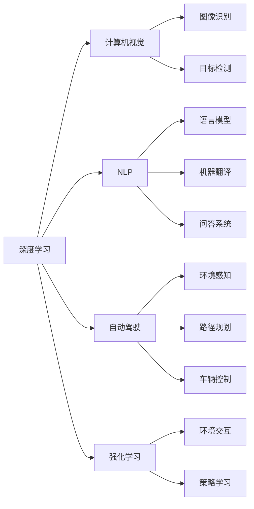

                 

# Andrej Karpathy：人工智能的未来发展策略

## 1. 背景介绍

Andrej Karpathy，斯坦福大学计算机科学教授，Caffe2创始人之一，NVIDIA首席AI科学家，曾任Tesla Autopilot计算机视觉负责人。作为深度学习领域的前沿研究者，Karpathy在计算机视觉、自然语言处理、自动驾驶等领域都有深入研究，并发表了一系列极具影响力的工作。本文将从深度学习与人工智能发展的视角出发，探讨Andrej Karpathy提出的未来人工智能发展策略。

## 2. 核心概念与联系

### 2.1 核心概念概述

- **深度学习（Deep Learning）**：一种模拟人脑神经网络结构的人工智能算法，通过多层次的非线性变换来学习和提取数据特征。
- **计算机视觉（Computer Vision）**：利用计算机处理和分析图像、视频等视觉数据，以实现图像识别、目标检测、自动驾驶等功能。
- **自然语言处理（Natural Language Processing, NLP）**：使计算机能够理解、处理和生成人类语言，包括语言模型、机器翻译、问答系统等。
- **自动驾驶（Autonomous Driving）**：使车辆具备无人驾驶能力，通过感知、决策和控制技术实现自动导航。
- **强化学习（Reinforcement Learning）**：一种通过与环境交互，通过奖励和惩罚机制来学习最优策略的机器学习技术。

这些核心概念构成了Andrej Karpathy提出的未来人工智能发展策略的基础。

### 2.2 核心概念原理和架构的 Mermaid 流程图



## 3. 核心算法原理 & 具体操作步骤

### 3.1 算法原理概述

Andrej Karpathy提出的未来人工智能发展策略，主要基于以下几个关键原则：

1. **数据驱动**：强调高质量标注数据的收集和利用，推动深度学习的泛化能力。
2. **多任务学习**：通过多任务学习，提升模型在多种相关任务上的性能，增强模型的泛化能力。
3. **迁移学习**：利用已训练模型在新任务上进行微调，以减少训练成本和时间。
4. **强化学习**：通过与环境的交互，优化模型的决策策略，实现自动驾驶等复杂任务。
5. **自监督学习**：利用无标签数据，通过自监督学习方式进行模型预训练，减少对标注数据的依赖。
6. **跨模态学习**：将不同模态的数据（如图像、文本、音频）进行融合，提升模型在多模态任务上的表现。

### 3.2 算法步骤详解

1. **数据收集与预处理**：
   - 收集高质量的标注数据，包括图像、文本、音频等。
   - 对数据进行清洗、归一化等预处理，确保数据质量。

2. **模型选择与设计**：
   - 选择适合任务的深度学习模型架构，如CNN、RNN、Transformer等。
   - 设计合适的损失函数和优化算法，如交叉熵损失、Adam等。

3. **模型训练与验证**：
   - 将数据划分为训练集、验证集和测试集。
   - 使用训练集训练模型，验证集评估模型性能，调整超参数。

4. **模型微调与迁移学习**：
   - 对预训练模型进行微调，适应特定任务。
   - 利用已训练模型在新任务上进行迁移学习，减少训练时间和成本。

5. **强化学习与自动驾驶**：
   - 使用强化学习算法，让模型通过与环境交互学习最优策略。
   - 在自动驾驶中，模型需要学习环境感知、路径规划、车辆控制等复杂任务。

6. **自监督学习与无标签数据利用**：
   - 通过自监督学习，利用无标签数据进行模型预训练，提升模型的泛化能力。
   - 如利用数据增强技术生成更多无标签数据，提高模型学习效率。

7. **跨模态学习与多任务学习**：
   - 将不同模态的数据进行融合，提升模型在多模态任务上的表现。
   - 通过多任务学习，模型可以同时学习多个相关任务，增强泛化能力。

### 3.3 算法优缺点

#### 优点

1. **泛化能力强**：多任务学习和迁移学习使得模型能够更好地适应新任务，提升泛化能力。
2. **训练效率高**：迁移学习可以减少训练时间，自监督学习可以利用无标签数据提升学习效率。
3. **模型灵活**：多任务学习和跨模态学习使得模型更加灵活，能够应对多种复杂任务。

#### 缺点

1. **数据依赖**：高质量标注数据的需求较高，数据收集和处理成本较大。
2. **模型复杂**：多任务学习和大模型结构复杂，计算资源消耗较大。
3. **过拟合风险**：自监督学习可能过度拟合，多任务学习可能忽略任务间差异。

### 3.4 算法应用领域

Andrej Karpathy提出的策略在多个领域都得到了应用，包括但不限于：

- **计算机视觉**：在图像识别、目标检测、人脸识别等领域取得了显著成果。
- **自然语言处理**：在机器翻译、问答系统、文本生成等领域表现出色。
- **自动驾驶**：在环境感知、路径规划、车辆控制等方面推动了自动驾驶技术的发展。
- **强化学习**：在游戏AI、机器人控制等方面展示了强大的学习能力。
- **多模态学习**：将图像、文本、音频等多模态数据进行融合，提升模型性能。

## 4. 数学模型和公式 & 详细讲解 & 举例说明

### 4.1 数学模型构建

以下以计算机视觉中的图像识别任务为例，构建数学模型：

设输入图像为 $x \in \mathbb{R}^{d}$，输出标签为 $y \in \{0, 1\}$。模型通过多层神经网络进行特征提取和分类，其损失函数为：

$$
L(w, x, y) = -y\log p(y|x; w) - (1-y)\log (1-p(y|x; w))
$$

其中 $w$ 为模型参数，$p(y|x; w)$ 为模型对标签 $y$ 的条件概率。

### 4.2 公式推导过程

通过对输入图像 $x$ 进行卷积、池化等操作，得到特征表示 $f(x)$。将 $f(x)$ 输入全连接层，得到分类概率 $p(y|x; w)$。通过交叉熵损失函数，最小化模型预测概率与真实标签的差距。

### 4.3 案例分析与讲解

以自监督学习的实例——数据增强为例，介绍其工作原理：

1. **随机裁剪和旋转**：对输入图像进行随机裁剪、旋转等操作，生成更多训练样本。
2. **噪声添加**：在图像中添加噪声，提升模型对数据变化的不敏感性。
3. **多尺度训练**：使用不同尺度的图像进行训练，提升模型的泛化能力。
4. **翻转和镜像**：对图像进行翻转、镜像等操作，生成更多训练样本。

## 5. 项目实践：代码实例和详细解释说明

### 5.1 开发环境搭建

1. **安装Python和相关库**：
   ```bash
   pip install torch torchvision
   ```

2. **安装Caffe2**：
   ```bash
   pip install caffe2
   ```

3. **安装NVIDIA GPU驱动程序和CUDA**：
   ```bash
   pip install nvidia-cuda-toolkit==11.1
   ```

### 5.2 源代码详细实现

以下是使用Caffe2进行图像识别任务的Python代码实现：

```python
import caffe2.python.predictor.predictor as predictor

# 加载模型和参数
predictor_init_net, predict_net, model_params = ...

# 创建预测器
predictor = predictor.Predictor(predictor_init_net, model_params)

# 设置输入
input_blob = 'data'
input_data = ...

# 预测
output_blob = 'softmax_output'
softmax_output = predictor.predict([input_blob], [output_blob])
```

### 5.3 代码解读与分析

1. **加载模型和参数**：
   - `predictor_init_net`：初始化网络定义，包含模型架构信息。
   - `predict_net`：预测网络定义，包含模型前向传播过程。
   - `model_params`：模型参数，包括权重和偏置等。

2. **创建预测器**：
   - 使用 `predictor.Predictor` 创建预测器对象，用于执行模型预测。

3. **设置输入**：
   - 定义输入张量的名称和数据，输入数据可以是图像或其他类型的数据。

4. **预测输出**：
   - 调用 `predict` 方法，将输入数据传递给模型进行前向传播，返回预测结果。

### 5.4 运行结果展示

可以通过可视化的方式展示预测结果，例如使用Matplotlib库：

```python
import matplotlib.pyplot as plt

# 将预测结果可视化
plt.imshow(softmax_output)
plt.title('Predicted Image')
plt.show()
```

## 6. 实际应用场景

### 6.1 计算机视觉

在自动驾驶中，计算机视觉技术被广泛应用于环境感知、目标检测、车道线识别等领域。例如，利用卷积神经网络（CNN）对摄像头拍摄的图像进行实时分析，检测行人、车辆等障碍物，实现自动驾驶中的路径规划和避障功能。

### 6.2 自然语言处理

在机器翻译中，使用Transformer模型对源语言和目标语言进行编码和解码，实现高质量的文本翻译。例如，将英语文本翻译成中文，利用微调后的Transformer模型，能够获得流畅、准确的翻译结果。

### 6.3 自动驾驶

在自动驾驶中，计算机视觉和强化学习技术相结合，实现环境感知和路径规划。例如，通过摄像头、雷达等传感器获取环境信息，利用强化学习算法学习最优驾驶策略，实现自主导航。

### 6.4 未来应用展望

未来，人工智能将在更多领域发挥作用，例如医疗诊断、金融预测、智能制造等。利用深度学习和大数据技术，可以提升各个领域的决策效率和准确性，推动社会进步。

## 7. 工具和资源推荐

### 7.1 学习资源推荐

1. **《Deep Learning》书籍**：Ian Goodfellow等著，全面介绍了深度学习的理论和实践。
2. **《Reinforcement Learning: An Introduction》书籍**：Richard S. Sutton和Andrew G. Barto著，介绍了强化学习的原理和算法。
3. **《Python Machine Learning》书籍**：Sebastian Raschka著，介绍了机器学习在Python中的实现。
4. **Coursera深度学习和强化学习课程**：由斯坦福大学和MIT等名校提供的免费课程，适合初学者学习。
5. **Kaggle竞赛平台**：提供大量机器学习和深度学习竞赛，适合实践和挑战自我。

### 7.2 开发工具推荐

1. **PyTorch**：由Facebook开发的深度学习框架，支持动态计算图，适合快速原型开发。
2. **Caffe2**：由Facebook开发的深度学习框架，支持大规模分布式训练，适合高性能应用。
3. **TensorFlow**：由Google开发的深度学习框架，支持静态计算图，适合生产部署。
4. **NVIDIA CUDA**：用于GPU加速的编程平台，支持高性能深度学习模型的训练和推理。
5. **Jupyter Notebook**：支持Python代码的交互式执行，适合科研和教学使用。

### 7.3 相关论文推荐

1. **《ImageNet Classification with Deep Convolutional Neural Networks》论文**：Alex Krizhevsky等著，提出了深度卷积神经网络（CNN），在图像识别领域取得重大突破。
2. **《Attention is All You Need》论文**：Ashish Vaswani等著，提出了Transformer模型，在自然语言处理领域取得重大进展。
3. **《Playing Atari with Deep Reinforcement Learning》论文**：Volodymyr Mnih等著，提出了深度强化学习算法，在玩游戏任务上取得显著成果。

## 8. 总结：未来发展趋势与挑战

### 8.1 研究成果总结

Andrej Karpathy在深度学习和人工智能领域的贡献主要体现在以下几个方面：

1. **深度学习架构设计**：提出了卷积神经网络（CNN）和Transformer等经典模型架构。
2. **计算机视觉**：在图像识别、目标检测等领域取得显著成果。
3. **自然语言处理**：在机器翻译、问答系统等领域推动了深度学习的应用。
4. **强化学习**：在自动驾驶、游戏AI等领域展示了强大的学习能力。
5. **跨模态学习**：将不同模态的数据进行融合，提升模型性能。

### 8.2 未来发展趋势

未来，人工智能将在更多领域发挥作用，例如医疗诊断、金融预测、智能制造等。利用深度学习和大数据技术，可以提升各个领域的决策效率和准确性，推动社会进步。

1. **医疗诊断**：利用深度学习技术对医学影像、电子病历等数据进行分析，提升诊断效率和准确性。
2. **金融预测**：利用深度学习技术对市场数据进行分析，预测股票、外汇等金融市场的走势。
3. **智能制造**：利用深度学习技术对生产数据进行分析，优化生产流程和提高产品质量。

### 8.3 面临的挑战

虽然深度学习和人工智能取得了显著进展，但仍面临以下挑战：

1. **数据质量**：高质量标注数据的需求较高，数据收集和处理成本较大。
2. **模型复杂**：深度学习模型复杂，计算资源消耗较大。
3. **过拟合风险**：深度学习模型可能过度拟合，泛化能力不足。
4. **模型解释性**：深度学习模型缺乏可解释性，难以理解和调试。
5. **伦理和隐私问题**：深度学习模型的应用可能涉及隐私和伦理问题，需要关注和解决。

### 8.4 研究展望

未来，人工智能的发展方向将包括以下几个方面：

1. **模型压缩和优化**：提升深度学习模型的计算效率和推理速度，降低资源消耗。
2. **模型解释性**：增强深度学习模型的可解释性，提供更透明的决策过程。
3. **跨模态学习**：将不同模态的数据进行融合，提升模型性能。
4. **联邦学习**：利用分布式计算技术，保护数据隐私和安全。
5. **多任务学习**：通过多任务学习，提升模型在多种相关任务上的性能。

## 9. 附录：常见问题与解答

**Q1: 深度学习和人工智能有什么区别？**

A: 深度学习是人工智能的一个重要分支，利用深度神经网络模拟人脑处理数据的方式，实现复杂的模式识别和预测任务。而人工智能则涵盖更广泛的内容，包括机器学习、自然语言处理、计算机视觉等多个领域。

**Q2: 深度学习模型如何避免过拟合？**

A: 过拟合是深度学习模型面临的重要问题，常用的方法包括数据增强、正则化、Dropout等。例如，通过在训练集上进行随机裁剪、旋转等操作，生成更多训练样本，可以有效减少过拟合。

**Q3: 如何提高深度学习模型的泛化能力？**

A: 泛化能力是深度学习模型的重要性能指标，可以通过多任务学习和迁移学习来提升。例如，在一个任务上训练模型，然后在另一个相关任务上进行微调，可以有效提升模型的泛化能力。

**Q4: 深度学习模型在实际应用中面临哪些挑战？**

A: 深度学习模型在实际应用中面临数据质量、计算资源、模型解释性、伦理和隐私问题等挑战。解决这些问题需要跨学科的合作和技术创新。

**Q5: 深度学习模型的应用前景如何？**

A: 深度学习模型在计算机视觉、自然语言处理、自动驾驶等领域展现出强大的应用前景。未来，深度学习模型将广泛应用于更多领域，提升各个行业的决策效率和准确性。

---

作者：禅与计算机程序设计艺术 / Zen and the Art of Computer Programming

