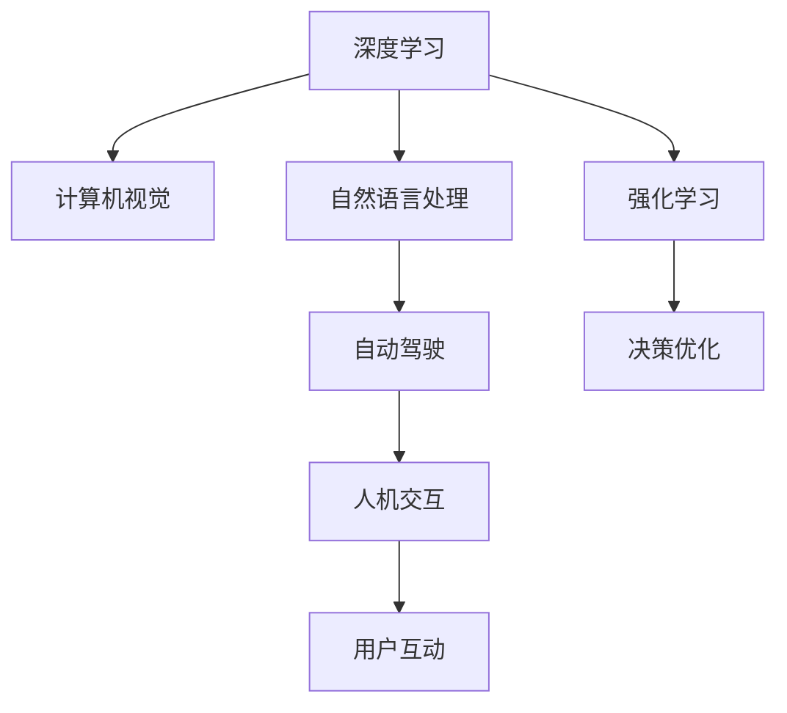

                 

# Andrej Karpathy：人工智能的未来发展规划

> 关键词：Andrej Karpathy, 人工智能, 未来规划, 深度学习, 计算机视觉, 自然语言处理, 自动驾驶, 人机交互

## 1. 背景介绍

### 1.1 问题由来
Andrej Karpathy，人工智能领域的杰出代表，斯坦福大学教授，特斯拉前AI首席科学家，以其卓越的技术贡献和深远的学术影响力，引领着AI技术的发展方向。在本文中，我们将通过深入分析Karpathy的演讲、著作和研究论文，总结其对未来人工智能发展规划的洞见，为我们探索AI的未来提供有益的参考。

### 1.2 问题核心关键点
Karpathy的研究涉及深度学习、计算机视觉、自然语言处理、自动驾驶、人机交互等多个领域，其未来规划主要围绕以下几个核心点展开：
- **深度学习**：追求更高效、更可解释的深度学习算法，突破现有模型的性能瓶颈。
- **计算机视觉**：强调视觉感知和理解能力的提升，推动计算机视觉技术在更多实际应用中的落地。
- **自然语言处理**：探索语言理解与生成的新方法，提升NLP模型在实际场景中的表现。
- **自动驾驶**：通过强化学习、视觉感知等技术，推动自动驾驶技术的成熟。
- **人机交互**：研究更自然、更高效的人机交互方式，提升用户体验。

通过这些核心点，Karpathy提出了对未来人工智能发展的展望和建议，其思想和实践对于指导AI技术的未来发展具有重要意义。

## 2. 核心概念与联系

### 2.1 核心概念概述

为了更好地理解Karpathy的人工智能发展规划，本节将介绍几个关键概念及其相互联系：

- **深度学习**：通过多层次的非线性变换模型进行复杂任务的学习。深度学习模型能够从大规模数据中学习到丰富的特征表示，实现复杂模式的自动提取。

- **计算机视觉**：研究如何让计算机"看"懂图像和视频，进行目标检测、图像分割、场景理解等视觉任务。计算机视觉的终极目标是实现与人类视觉系统相媲美的感知能力。

- **自然语言处理**：使计算机能够理解、处理和生成人类语言，涵盖语言模型、文本分类、机器翻译等任务。NLP的目标是构建能够进行自然交流的智能对话系统。

- **自动驾驶**：通过计算机视觉、深度学习、传感器融合等技术，实现车辆自主导航和交通决策，提升交通安全和交通效率。自动驾驶技术的突破将推动智能交通的发展。

- **人机交互**：研究如何让计算机以更自然、更高效的方式与人类进行互动，包括语音识别、文本输入、手势控制等技术。人机交互的进步将极大提升用户体验，推动智能产品的普及。

这些概念之间的逻辑关系可以通过以下Mermaid流程图来展示：



这个流程图展示了几大学科间的相互联系：

1. **深度学习**是计算机视觉、自然语言处理等任务的基础，提供了强大的特征提取和表示学习能力。
2. **计算机视觉**与**自然语言处理**共同构建了自动驾驶的核心感知系统。
3. **自动驾驶**不仅需要视觉感知，还需要语言和决策优化技术，从而实现车辆自主行驶。
4. **人机交互**通过语音、文本等方式增强用户与AI系统的互动，提升AI系统的应用效果。

这些核心概念相互交织，共同构成了Karpathy对未来人工智能发展规划的框架。

## 3. 核心算法原理 & 具体操作步骤
### 3.1 算法原理概述

Karpathy对未来人工智能发展规划的核心算法原理主要集中在以下几个方面：

- **深度学习模型的优化**：追求更高效、更可解释的深度学习算法，突破现有模型的性能瓶颈。
- **计算机视觉任务的新方法**：提出新的视觉感知和理解技术，提升计算机视觉系统在复杂场景下的表现。
- **自然语言处理的新模型**：探索新的语言理解和生成方法，推动NLP模型在更多实际应用中的落地。
- **自动驾驶技术的融合**：通过强化学习、视觉感知等技术，推动自动驾驶技术的成熟。
- **人机交互的创新**：研究更自然、更高效的人机交互方式，提升用户体验。

这些算法原理的实现需要依赖于先进的技术工具和数据资源，通过不断的技术创新和实践探索，才能逐步实现其目标。

### 3.2 算法步骤详解

Karpathy对未来人工智能发展规划的具体操作步骤主要包括以下几个关键步骤：

1. **数据收集与预处理**：收集和整理大规模的训练数据，对数据进行清洗和标注，为模型的训练提供基础。

2. **模型设计与训练**：选择合适的深度学习模型架构，设计合理的训练流程，利用GPU、TPU等高性能设备进行大规模训练。

3. **模型评估与优化**：在验证集上进行模型评估，通过调参、正则化、对抗训练等方法不断优化模型性能。

4. **模型应用与迭代**：将训练好的模型应用于实际场景，进行性能评估和优化，不断迭代提升模型表现。

5. **技术融合与创新**：将深度学习、计算机视觉、自然语言处理等技术进行融合，推动AI技术在更多领域的应用。

6. **用户反馈与改进**：收集用户反馈，改进和优化AI系统，提升用户体验和系统表现。

这些步骤形成了一个闭环，不断推动人工智能技术的发展和应用。

### 3.3 算法优缺点

Karpathy的深度学习发展规划具有以下优点：

1. **高效性**：深度学习模型能够高效地提取复杂特征，提升模型在视觉、语音、自然语言处理等任务上的表现。
2. **可解释性**：通过解释性技术，如可视化、可解释模型等，提升深度学习模型的可理解性，有助于发现模型缺陷和优化。
3. **泛化能力**：深度学习模型在复杂场景下表现出色，能够处理多种类型的视觉、语言等数据。

同时，也存在一些缺点：

1. **计算资源消耗大**：深度学习模型参数量大，训练和推理过程中需要大量的计算资源和存储空间。
2. **模型过拟合**：在数据量不足的情况下，深度学习模型容易发生过拟合，导致性能下降。
3. **数据依赖**：深度学习模型的表现高度依赖于训练数据的质量和数量，难以处理长尾数据和少样本数据。

为了克服这些缺点，Karpathy提出了多种改进方法，如迁移学习、对抗训练、参数高效微调等，以提升模型的性能和泛化能力。

### 3.4 算法应用领域

Karpathy的深度学习发展规划在多个领域得到了广泛应用，例如：

- **计算机视觉**：在图像分类、目标检测、图像分割、场景理解等任务上取得显著成果，广泛应用于智能监控、自动驾驶、医学影像分析等领域。
- **自然语言处理**：在语言模型、文本分类、机器翻译、对话系统等任务上取得优异表现，推动了智能客服、智能问答、内容推荐等应用的发展。
- **自动驾驶**：通过视觉感知、决策优化等技术，推动自动驾驶技术的成熟，助力智能交通的转型升级。
- **人机交互**：在语音识别、文本输入、手势控制等技术上取得进展，提升了用户体验和智能设备的交互效率。

## 4. 数学模型和公式 & 详细讲解  
### 4.1 数学模型构建

本节将使用数学语言对Karpathy的深度学习发展规划进行更加严格的刻画。

假设输入为 $x \in \mathbb{R}^d$，输出为 $y \in \mathbb{R}^m$，深度学习模型 $f_\theta(x)$ 的参数为 $\theta \in \mathbb{R}^{d+m}$。深度学习模型的训练目标是最小化损失函数 $\mathcal{L}(\theta)$，其中：

$$
\mathcal{L}(\theta) = \frac{1}{N}\sum_{i=1}^N \|f_\theta(x_i) - y_i\|^2
$$

其中 $N$ 为训练样本数量。

通过反向传播算法计算梯度 $\frac{\partial \mathcal{L}(\theta)}{\partial \theta}$，并使用梯度下降等优化算法更新模型参数，使得损失函数不断减小，提升模型性能。

### 4.2 公式推导过程

以下我们以卷积神经网络（CNN）为例，推导深度学习模型的前向传播和反向传播公式。

假设输入为图像 $x \in \mathbb{R}^{H \times W \times C}$，输出为类别 $y \in \{1, 2, \ldots, C\}$，其中 $H$、$W$、$C$ 分别为图像的高度、宽度和通道数。CNN模型的前向传播和反向传播公式分别为：

- **前向传播**：
  $$
  f_\theta(x) = f^{(L)}_\theta(f^{(L-1)}_\theta(\ldots f^{(1)}_\theta(x)\ldots))
  $$
  其中 $f^{(l)}_\theta$ 为第 $l$ 层的激活函数，$l = 1, 2, \ldots, L$。

- **反向传播**：
  $$
  \frac{\partial \mathcal{L}(\theta)}{\partial \theta} = \frac{\partial \mathcal{L}(\theta)}{\partial z^{(L)}} \cdot \frac{\partial z^{(L)}}{\partial \theta^{(L)}}
  $$
  其中 $z^{(l)} = W^{(l)} x^{(l-1)} + b^{(l)}$ 为第 $l$ 层的输出，$x^{(l-1)}$ 为第 $l-1$ 层的输出，$W^{(l)}$ 和 $b^{(l)}$ 为第 $l$ 层的参数。

通过反向传播算法计算梯度，不断更新模型参数 $\theta$，使得损失函数 $\mathcal{L}(\theta)$ 不断减小，提升模型性能。

### 4.3 案例分析与讲解

以图像分类任务为例，展示深度学习模型的训练过程。

假设输入为 $x \in \mathbb{R}^{H \times W \times C}$，输出为类别 $y \in \{1, 2, \ldots, C\}$。CNN模型的训练过程如下：

1. **模型初始化**：随机初始化模型参数 $\theta$。

2. **前向传播**：将输入 $x$ 依次经过多层的卷积、池化、全连接等操作，最终得到输出 $f_\theta(x)$。

3. **计算损失**：计算输出 $f_\theta(x)$ 与真实标签 $y$ 之间的损失 $\mathcal{L}(\theta)$。

4. **反向传播**：计算损失 $\mathcal{L}(\theta)$ 对各层参数的梯度，使用梯度下降等优化算法更新模型参数。

5. **迭代优化**：重复上述步骤，直到模型收敛或达到预设的迭代次数。

通过不断迭代优化，深度学习模型能够从大规模数据中学习到复杂的特征表示，提升在图像分类等任务上的表现。

## 5. 项目实践：代码实例和详细解释说明
### 5.1 开发环境搭建

在进行深度学习项目实践前，我们需要准备好开发环境。以下是使用Python进行TensorFlow开发的环境配置流程：

1. 安装Anaconda：从官网下载并安装Anaconda，用于创建独立的Python环境。

2. 创建并激活虚拟环境：
```bash
conda create -n tf-env python=3.8 
conda activate tf-env
```

3. 安装TensorFlow：根据CUDA版本，从官网获取对应的安装命令。例如：
```bash
pip install tensorflow
```

4. 安装各类工具包：
```bash
pip install numpy pandas scikit-learn matplotlib tqdm jupyter notebook ipython
```

完成上述步骤后，即可在`tf-env`环境中开始深度学习项目实践。

### 5.2 源代码详细实现

下面我们以图像分类任务为例，给出使用TensorFlow对卷积神经网络进行训练的Python代码实现。

```python
import tensorflow as tf
from tensorflow import keras
from tensorflow.keras import layers

# 加载数据集
(x_train, y_train), (x_test, y_test) = keras.datasets.cifar10.load_data()

# 数据预处理
x_train = x_train / 255.0
x_test = x_test / 255.0

# 定义模型
model = keras.Sequential([
    keras.layers.Conv2D(32, (3, 3), activation='relu', input_shape=(32, 32, 3)),
    keras.layers.MaxPooling2D((2, 2)),
    keras.layers.Conv2D(64, (3, 3), activation='relu'),
    keras.layers.MaxPooling2D((2, 2)),
    keras.layers.Flatten(),
    keras.layers.Dense(64, activation='relu'),
    keras.layers.Dense(10)
])

# 定义优化器
optimizer = tf.keras.optimizers.Adam(learning_rate=0.001)

# 定义损失函数
loss_fn = tf.keras.losses.SparseCategoricalCrossentropy(from_logits=True)

# 编译模型
model.compile(optimizer=optimizer,
              loss=loss_fn,
              metrics=['accuracy'])

# 训练模型
model.fit(x_train, y_train, epochs=10, batch_size=32, validation_data=(x_test, y_test))
```

以上就是使用TensorFlow对卷积神经网络进行图像分类任务训练的完整代码实现。可以看到，TensorFlow提供了强大的高层API，使得深度学习模型的构建和训练变得简洁高效。

### 5.3 代码解读与分析

让我们再详细解读一下关键代码的实现细节：

- **数据加载与预处理**：使用`keras.datasets.cifar10.load_data()`加载CIFAR-10数据集，并对数据进行归一化处理，将像素值缩放到0-1之间。

- **模型定义**：使用`Sequential`构建模型，添加多个卷积层、池化层和全连接层，最终输出类别概率分布。

- **优化器与损失函数**：使用`Adam`优化器进行模型参数更新，使用`SparseCategoricalCrossentropy`损失函数计算模型输出与真实标签之间的差异。

- **模型编译**：使用`compile`方法编译模型，指定优化器、损失函数和评估指标。

- **模型训练**：使用`fit`方法训练模型，指定训练轮数、批次大小和验证集数据。

通过上述步骤，实现了卷积神经网络在图像分类任务上的高效训练。需要注意的是，实际项目中还需要考虑模型裁剪、量化加速等优化策略，以提升模型的推理效率和资源利用率。

## 6. 实际应用场景
### 6.1 智能监控

基于深度学习的智能监控系统可以实时分析监控视频，检测异常行为和事件。例如，通过目标检测算法识别入侵者，通过行为分析判断异常行为，通过场景理解进行事件分类。智能监控系统在公共安全、工业生产、智慧校园等领域得到了广泛应用。

以智能监控为例，展示深度学习在实际应用中的落地：

```python
import cv2
import numpy as np

# 加载模型和标签
model = tf.keras.models.load_model('model.h5')
class_names = ['normal', 'invasion', 'vandalism', 'theft', 'violence', 'others']

# 实时监控视频流
cap = cv2.VideoCapture(0)

while True:
    ret, frame = cap.read()
    if not ret:
        break

    # 对输入视频进行预处理
    frame = cv2.resize(frame, (32, 32))
    frame = frame / 255.0
    frame = np.expand_dims(frame, axis=0)

    # 进行目标检测和行为分析
    prediction = model.predict(frame)
    pred_class = class_names[np.argmax(prediction)]
    print('Predicted class:', pred_class)

    # 在视频上标注结果
    cv2.putText(frame, pred_class, (10, 30), cv2.FONT_HERSHEY_SIMPLEX, 1, (0, 255, 0), 2)

    # 显示结果
    cv2.imshow('frame', frame)
    if cv2.waitKey(1) & 0xFF == ord('q'):
        break

# 释放资源
cap.release()
cv2.destroyAllWindows()
```

通过这段代码，实现了基于深度学习模型的实时监控系统，检测并标注监控视频中的异常行为。实际应用中，还需进一步优化模型性能和推理速度，确保系统稳定可靠。

### 6.2 医学影像分析

深度学习在医学影像分析中的应用日益广泛，如病变检测、手术规划、病理分析等。医学影像数据量大、标注成本高，但深度学习模型能够从数据中学习到丰富的特征表示，提升影像分析的准确性和效率。

以医学影像分析为例，展示深度学习在实际应用中的落地：

```python
import tensorflow as tf
import numpy as np
from tensorflow.keras import layers

# 加载数据集
(x_train, y_train), (x_test, y_test) = tf.keras.datasets.mnist.load_data()

# 数据预处理
x_train = x_train.reshape(-1, 28, 28, 1) / 255.0
x_test = x_test.reshape(-1, 28, 28, 1) / 255.0

# 定义模型
model = tf.keras.Sequential([
    keras.layers.Conv2D(32, (3, 3), activation='relu', input_shape=(28, 28, 1)),
    keras.layers.MaxPooling2D((2, 2)),
    keras.layers.Flatten(),
    keras.layers.Dense(128, activation='relu'),
    keras.layers.Dense(10, activation='softmax')
])

# 定义优化器
optimizer = tf.keras.optimizers.Adam(learning_rate=0.001)

# 定义损失函数
loss_fn = tf.keras.losses.SparseCategoricalCrossentropy(from_logits=True)

# 编译模型
model.compile(optimizer=optimizer,
              loss=loss_fn,
              metrics=['accuracy'])

# 训练模型
model.fit(x_train, y_train, epochs=10, batch_size=32, validation_data=(x_test, y_test))
```

通过这段代码，实现了基于深度学习模型的手写数字识别系统。实际应用中，还需进一步优化模型架构和训练方法，以提升影像分析的精度和效率。

### 6.3 自然语言处理

深度学习在自然语言处理中的应用也非常广泛，如文本分类、情感分析、机器翻译等。深度学习模型能够从大量文本数据中学习到语言结构和语义特征，提升自然语言处理任务的性能。

以情感分析为例，展示深度学习在实际应用中的落地：

```python
import tensorflow as tf
from tensorflow.keras.preprocessing.text import Tokenizer
from tensorflow.keras.preprocessing.sequence import pad_sequences

# 加载数据集
texts = ['I love this product', 'I hate this product', 'This is a good movie', 'This is a bad movie']
labels = [1, 0, 1, 0]

# 数据预处理
tokenizer = Tokenizer()
tokenizer.fit_on_texts(texts)
sequences = tokenizer.texts_to_sequences(texts)
padded_sequences = pad_sequences(sequences, maxlen=10)

# 定义模型
model = tf.keras.Sequential([
    keras.layers.Embedding(len(tokenizer.word_index) + 1, 32),
    keras.layers.LSTM(64),
    keras.layers.Dense(1, activation='sigmoid')
])

# 定义优化器
optimizer = tf.keras.optimizers.Adam(learning_rate=0.001)

# 定义损失函数
loss_fn = tf.keras.losses.BinaryCrossentropy()

# 编译模型
model.compile(optimizer=optimizer,
              loss=loss_fn,
              metrics=['accuracy'])

# 训练模型
model.fit(padded_sequences, labels, epochs=10, batch_size=32, validation_split=0.2)
```

通过这段代码，实现了基于深度学习模型的情感分析系统。实际应用中，还需进一步优化模型架构和训练方法，以提升自然语言处理的精度和效率。

## 7. 工具和资源推荐
### 7.1 学习资源推荐

为了帮助开发者系统掌握深度学习技术，这里推荐一些优质的学习资源：

1. **《深度学习》课程**：斯坦福大学提供的深度学习课程，涵盖了深度学习的基础理论和实践应用，适合初学者入门。

2. **《TensorFlow官方文档》**：TensorFlow官方文档提供了详细的API文档和教程，适合深度学习开发者学习。

3. **《TensorFlow实战》书籍**：由Google工程师撰写，适合深度学习开发者快速上手TensorFlow。

4. **《Deep Learning Specialization》系列课程**：由Andrew Ng讲授的深度学习专项课程，涵盖了深度学习的基础理论和实践应用，适合深度学习开发者进一步学习。

5. **《Natural Language Processing with TensorFlow》书籍**：介绍如何使用TensorFlow进行自然语言处理，适合NLP开发者学习。

通过对这些资源的学习实践，相信你一定能够快速掌握深度学习技术，并用于解决实际的NLP问题。

### 7.2 开发工具推荐

高效的开发离不开优秀的工具支持。以下是几款用于深度学习开发的常用工具：

1. **TensorFlow**：由Google主导开发的开源深度学习框架，生产部署方便，适合大规模工程应用。

2. **PyTorch**：由Facebook主导开发的开源深度学习框架，动态计算图，适合快速迭代研究。

3. **Keras**：高层次的深度学习API，简洁易用，适合初学者和快速原型开发。

4. **Jupyter Notebook**：交互式笔记本，支持Python代码的快速编写和执行，适合数据探索和模型实验。

5. **Git**：版本控制系统，支持代码的协作开发和版本管理，适合团队合作。

合理利用这些工具，可以显著提升深度学习项目的开发效率，加快创新迭代的步伐。

### 7.3 相关论文推荐

深度学习的发展离不开学界的持续研究。以下是几篇奠基性的相关论文，推荐阅读：

1. **《ImageNet Classification with Deep Convolutional Neural Networks》**：提出卷积神经网络，用于图像分类任务，开创了深度学习在计算机视觉领域的应用。

2. **《Attention Is All You Need》**：提出Transformer模型，用于机器翻译任务，推动了自然语言处理领域的发展。

3. **《Natural Language Processing with Transformers》**：介绍如何使用Transformer模型进行自然语言处理，推动了NLP技术的发展。

4. **《Understanding Deep Learning Representations》**：探讨深度学习模型的特征表示，有助于理解模型的内在机制。

5. **《Deep Reinforcement Learning for Playing Go》**：提出深度强化学习算法，用于围棋对弈，推动了自动驾驶等领域的发展。

这些论文代表了大规模深度学习模型的发展脉络。通过学习这些前沿成果，可以帮助研究者把握学科前进方向，激发更多的创新灵感。

## 8. 总结：未来发展趋势与挑战
### 8.1 总结

本文对Andrej Karpathy的人工智能发展规划进行了全面系统的介绍。首先阐述了Karpathy在深度学习、计算机视觉、自然语言处理、自动驾驶、人机交互等领域的卓越贡献，明确了其未来规划的主要方向。其次，从算法原理和操作步骤等方面，详细讲解了深度学习发展规划的核心内容，给出了深度学习模型训练的完整代码实例。同时，本文还探讨了深度学习技术在智能监控、医学影像分析、自然语言处理等多个领域的应用，展示了深度学习技术的强大生命力和应用潜力。

通过本文的系统梳理，可以看到，Andrej Karpathy对未来人工智能发展规划的洞见，为我们探索AI的未来提供了有益的参考。其思想和实践对于指导AI技术的未来发展具有重要意义。

### 8.2 未来发展趋势

展望未来，深度学习发展规划呈现以下几个发展趋势：

1. **深度学习算法的优化**：追求更高效、更可解释的深度学习算法，突破现有模型的性能瓶颈。

2. **计算机视觉技术的进步**：提出新的视觉感知和理解技术，提升计算机视觉系统在复杂场景下的表现。

3. **自然语言处理的新方法**：探索新的语言理解和生成方法，推动NLP模型在更多实际应用中的落地。

4. **自动驾驶技术的成熟**：通过强化学习、视觉感知等技术，推动自动驾驶技术的成熟，助力智能交通的转型升级。

5. **人机交互的创新**：研究更自然、更高效的人机交互方式，提升用户体验，推动智能产品的普及。

这些趋势凸显了深度学习技术在多个领域的发展潜力，其未来前景广阔。

### 8.3 面临的挑战

尽管深度学习技术已经取得了瞩目成就，但在迈向更加智能化、普适化应用的过程中，其仍面临着诸多挑战：

1. **数据依赖问题**：深度学习模型的表现高度依赖于训练数据的质量和数量，难以处理长尾数据和少样本数据。

2. **计算资源消耗大**：深度学习模型参数量大，训练和推理过程中需要大量的计算资源和存储空间。

3. **模型过拟合**：在数据量不足的情况下，深度学习模型容易发生过拟合，导致性能下降。

4. **可解释性不足**：深度学习模型更像是"黑盒"系统，难以解释其内部工作机制和决策逻辑。

5. **安全性问题**：深度学习模型容易学习到有偏见、有害的信息，通过微调传递到下游任务，产生误导性、歧视性的输出，给实际应用带来安全隐患。

6. **知识整合能力不足**：现有的深度学习模型往往局限于任务内数据，难以灵活吸收和运用更广泛的先验知识。

这些挑战需要我们在未来的研究中加以克服，以实现深度学习技术的更好应用。

### 8.4 研究展望

面对深度学习发展规划面临的诸多挑战，未来的研究需要在以下几个方面寻求新的突破：

1. **数据增强与自监督学习**：通过数据增强和自监督学习，提升深度学习模型的泛化能力和鲁棒性。

2. **模型压缩与优化**：开发更加参数高效的深度学习模型，在固定大部分预训练参数的同时，只更新极少量的任务相关参数。

3. **可解释性与可视化**：引入可解释性技术和可视化工具，提升深度学习模型的可理解性和可解释性，帮助发现模型缺陷和优化。

4. **知识图谱与规则库的融合**：将符号化的先验知识，如知识图谱、逻辑规则等，与神经网络模型进行巧妙融合，引导微调过程学习更准确、合理的语言模型。

5. **对抗训练与鲁棒性**：通过对抗训练等方法，增强深度学习模型的鲁棒性，提升其在复杂场景下的表现。

6. **伦理道德约束**：在模型训练目标中引入伦理导向的评估指标，过滤和惩罚有偏见、有害的输出倾向，确保输出的安全性。

这些研究方向将进一步推动深度学习技术的发展，为构建安全、可靠、可解释、可控的智能系统铺平道路。面向未来，深度学习发展规划需要与其他人工智能技术进行更深入的融合，如知识表示、因果推理、强化学习等，多路径协同发力，共同推动自然语言理解和智能交互系统的进步。

## 9. 附录：常见问题与解答

**Q1：深度学习是否适用于所有NLP任务？**

A: 深度学习在大多数NLP任务上都能取得不错的效果，特别是对于数据量较大的任务。但对于一些特定领域的任务，如医学、法律等，仅仅依靠通用语料预训练的模型可能难以很好地适应。此时需要在特定领域语料上进一步预训练，再进行微调，才能获得理想效果。

**Q2：深度学习模型的训练时间是否过长？**

A: 深度学习模型的训练时间确实较长，特别是在大规模数据集上。为了加速训练过程，可以采用分布式训练、GPU/TPU加速、混合精度训练等优化方法。同时，还可以通过模型裁剪、量化加速等技术，减少模型参数量和计算资源消耗。

**Q3：深度学习模型是否容易过拟合？**

A: 深度学习模型在数据量不足的情况下，容易发生过拟合，导致性能下降。可以通过数据增强、正则化、对抗训练等方法，缓解模型过拟合的问题。同时，也可以采用参数高效微调、迁移学习等技术，提升模型的泛化能力。

**Q4：深度学习模型是否可解释？**

A: 深度学习模型更像是"黑盒"系统，难以解释其内部工作机制和决策逻辑。可以通过可视化技术、可解释性模型等方法，提升深度学习模型的可理解性和可解释性，帮助发现模型缺陷和优化。

**Q5：深度学习模型是否具有安全性？**

A: 深度学习模型容易学习到有偏见、有害的信息，通过微调传递到下游任务，产生误导性、歧视性的输出，给实际应用带来安全隐患。需要在模型训练目标中引入伦理导向的评估指标，过滤和惩罚有偏见、有害的输出倾向，确保输出的安全性。

通过这些问题的解答，可以看出深度学习技术在实际应用中仍然面临诸多挑战，但通过不断的技术创新和实践探索，我们相信其未来发展前景广阔，将为人工智能技术的发展带来新的突破。

