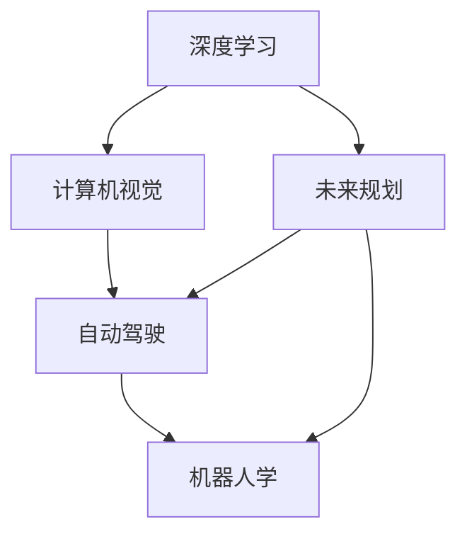

                 

# Andrej Karpathy：人工智能的未来发展规划

> 关键词：Andrej Karpathy, 人工智能, 深度学习, 计算机视觉, 机器人学, 自动驾驶, 未来规划

## 1. 背景介绍

### 1.1 问题由来

Andrej Karpathy 是斯坦福大学的计算机科学教授，专注于深度学习、计算机视觉和自动驾驶等领域的研究。他的工作不仅推动了深度学习在工业界的落地应用，还对未来人工智能的发展方向提供了深刻的见解。本文将围绕Karpathy对人工智能未来发展规划的思考，探讨其核心观点和未来趋势。

### 1.2 问题核心关键点

Andrej Karpathy 认为，未来人工智能的发展将更多依赖于深度学习、计算机视觉、机器人学和自动驾驶等领域的突破，特别是在以下三个方向上：

1. **深度学习**：作为人工智能的基础，深度学习将继续推动计算能力、模型复杂度和数据量的提升，为更复杂的任务提供支持。
2. **计算机视觉**：随着图像处理技术的进步，计算机视觉将应用于更广泛的场景，如图像生成、物体检测、行为分析等。
3. **机器人学和自动驾驶**：结合深度学习和计算机视觉，自动驾驶和机器人将实现更高的自主性和适应性，提升在复杂环境中的操作能力。

### 1.3 问题研究意义

Karpathy 的研究方向和观点，不仅对深度学习和计算机视觉领域有重要影响，也为机器人学和自动驾驶等前沿技术的发展提供了指导。通过深入了解Karpathy的规划，可以帮助研究者和开发者把握未来人工智能发展的脉络，从而更有针对性地进行技术研发和应用推广。

## 2. 核心概念与联系

### 2.1 核心概念概述

为更好地理解Karpathy对人工智能未来发展规划的思考，本节将介绍几个密切相关的核心概念：

- **深度学习**：利用多层神经网络结构，通过大量数据训练，学习到数据的复杂特征表示，广泛应用于图像、语音、自然语言处理等任务。
- **计算机视觉**：涉及图像处理、模式识别、计算机视觉理解等多个方面，目标是使计算机能够"看"和理解视觉信息。
- **机器人学**：结合机械、电子和计算机技术，研究如何让机器人和自主系统能够自主感知、决策和执行任务。
- **自动驾驶**：结合计算机视觉、深度学习和机器人学，实现无人驾驶汽车和车辆，提高道路安全和交通效率。
- **未来规划**：Karpathy对人工智能未来的发展方向和潜在影响进行的前瞻性思考，涵盖技术突破、应用场景和社会影响等多个方面。

这些核心概念之间的逻辑关系可以通过以下Mermaid流程图来展示：



这个流程图展示了大语言模型的核心概念及其之间的关系：

1. 深度学习作为基础，为计算机视觉和自动驾驶提供技术支持。
2. 计算机视觉用于图像处理和理解，为自动驾驶和机器人学提供感知能力。
3. 自动驾驶和机器人学结合计算机视觉和深度学习，实现更高的自主性和适应性。
4. 未来规划指导技术发展方向，推动人工智能在各个领域的应用。

## 3. 核心算法原理 & 具体操作步骤
### 3.1 算法原理概述

Karpathy 的研究方向主要集中在深度学习、计算机视觉和自动驾驶等领域，其核心算法原理可以概括为以下几个方面：

- **深度神经网络**：多层神经网络结构，通过反向传播算法进行训练，学习复杂数据表示。
- **卷积神经网络**：用于图像处理和计算机视觉任务，通过卷积和池化操作提取空间局部特征。
- **循环神经网络**：用于序列数据处理，如自然语言处理，通过循环结构处理时间序列数据。
- **强化学习**：通过与环境交互，学习最优策略，用于自动驾驶和机器人学中的决策问题。
- **自监督学习**：利用数据自身的结构信息，进行无监督预训练，提高模型的泛化能力。

### 3.2 算法步骤详解

Karpathy 的研究工作主要包括以下几个关键步骤：

**Step 1: 数据收集与预处理**
- 收集大量标注数据，涵盖多个领域和任务，如图像分类、物体检测、自然语言理解和自动驾驶场景模拟。
- 对数据进行标准化处理，包括数据增强、归一化和数据清洗等。

**Step 2: 模型设计**
- 设计适用于特定任务的深度学习模型，如卷积神经网络(CNN)、循环神经网络(RNN)和Transformer等。
- 选择合适的损失函数和优化器，如交叉熵损失、AdamW优化器等。

**Step 3: 模型训练**
- 使用GPU或TPU等高性能设备进行模型训练，采用批量训练和梯度累积等策略。
- 使用数据增强和正则化技术，防止过拟合，提高模型泛化能力。

**Step 4: 模型评估**
- 在验证集上评估模型性能，使用准确率、召回率、F1值等指标进行衡量。
- 对模型进行调整，如调整学习率、修改网络结构等，进一步提升模型效果。

**Step 5: 模型部署**
- 将训练好的模型部署到实际应用场景中，如自动驾驶汽车、智能机器人等。
- 集成实时数据流处理，保证模型在实时环境下的稳定性和鲁棒性。

**Step 6: 模型优化**
- 根据实际应用反馈，持续优化模型，提高性能和效率。
- 引入更高级的模型结构，如Transformer、GPT等，提升模型的表达能力。

### 3.3 算法优缺点

Karpathy 的研究方法具有以下优点：
1. 高泛化能力：通过大规模数据和复杂模型训练，提高了模型在不同任务上的泛化能力。
2. 高效性：使用GPU/TPU等高性能设备进行训练，加快模型迭代速度。
3. 实用性强：研究成果直接应用于多个领域的实际问题，如自动驾驶、机器人学等。

同时，这些方法也存在一定的局限性：
1. 对计算资源依赖高：大规模数据和复杂模型训练需要高性能计算设备。
2. 训练时间长：深度学习模型训练耗时长，可能面临计算资源不足的问题。
3. 模型复杂度高：高复杂度的模型需要更多的计算资源和更长的训练时间。
4. 结果解释性差：深度学习模型通常被认为是"黑箱"，难以解释其内部决策逻辑。

尽管存在这些局限性，但Karpathy的研究方法在深度学习和计算机视觉领域已取得了显著成果，为未来人工智能的发展提供了重要参考。

### 3.4 算法应用领域

Karpathy 的研究方法在以下几个领域得到了广泛应用：

- **计算机视觉**：图像分类、物体检测、图像生成、行为分析等任务。通过卷积神经网络和自监督学习，提升了计算机视觉任务的准确性和鲁棒性。
- **自动驾驶**：通过深度学习和计算机视觉技术，实现了无人驾驶汽车的稳定行驶和环境感知。
- **机器人学**：结合深度学习和计算机视觉，提升了机器人在复杂环境中的操作能力和自主性。
- **医疗诊断**：利用深度学习技术，提高了医学影像的自动分析和疾病诊断的准确性。

## 4. 数学模型和公式 & 详细讲解 & 举例说明
### 4.1 数学模型构建

Karpathy 的研究工作涉及多个数学模型和公式，以下简要介绍几个关键模型和公式：

**卷积神经网络(CNN)**
卷积神经网络由多个卷积层、池化层和全连接层组成，用于处理图像数据。其数学模型可以表示为：

$$
\begin{aligned}
y &= \sigma(W^{\text{fc}} [H^{\text{pool}}] + b^{\text{fc}}) \\
H^{\text{pool}} &= \text{MaxPooling}([\sigma(W^{\text{conv}} * I + b^{\text{conv}})])
\end{aligned}
$$

其中，$W^{\text{conv}}$、$W^{\text{fc}}$ 为卷积核和全连接层权重，$b^{\text{conv}}$、$b^{\text{fc}}$ 为偏置项，$I$ 为输入图像，$H^{\text{pool}}$ 为卷积层的输出，$\sigma$ 为激活函数，如ReLU、Sigmoid等。

**循环神经网络(RNN)**
循环神经网络用于处理序列数据，其数学模型可以表示为：

$$
\begin{aligned}
h_t &= \sigma(W_{hh} h_{t-1} + W_{xh} x_t + b_h) \\
y_t &= \sigma(W_{hy} h_t + b_y)
\end{aligned}
$$

其中，$h_t$ 为隐藏状态，$W_{hh}$、$W_{xh}$ 为循环层和输入层权重，$b_h$、$b_y$ 为偏置项，$x_t$ 为输入序列，$y_t$ 为输出。

**Transformer模型**
Transformer模型由多个编码层和解码层组成，用于处理自然语言序列数据。其数学模型可以表示为：

$$
\begin{aligned}
y &= \sigma(W^{\text{fc}} [M(\text{Softmax}(QK^T))] + b^{\text{fc}}) \\
M &= \text{Attention}(Q, K, V)
\end{aligned}
$$

其中，$Q$、$K$、$V$ 为查询、键和值矩阵，$\text{Softmax}$ 为注意力机制，$\text{Attention}$ 为自注意力机制，$W^{\text{fc}}$、$b^{\text{fc}}$ 为全连接层权重和偏置项。

### 4.2 公式推导过程

**卷积神经网络**
卷积层和池化层的推导过程如下：

1. 卷积操作：

$$
y = W * x + b
$$

其中，$W$ 为卷积核，$x$ 为输入图像，$b$ 为偏置项。

2. 激活函数：

$$
y = \sigma(W * x + b)
$$

其中，$\sigma$ 为激活函数，如ReLU、Sigmoid等。

3. 池化操作：

$$
y = \text{MaxPooling}(x)
$$

其中，$\text{MaxPooling}$ 为最大池化操作，$x$ 为输入图像。

**循环神经网络**
循环神经网络的关键在于理解隐藏状态$h_t$的更新过程。通过循环层和输入层的权重，可以计算出下一时刻的隐藏状态$h_{t+1}$：

$$
h_{t+1} = \sigma(W_{hh} h_t + W_{xh} x_t + b_h)
$$

其中，$h_{t+1}$ 为下一时刻的隐藏状态，$h_t$ 为当前时刻的隐藏状态，$W_{hh}$、$W_{xh}$ 为循环层和输入层权重，$b_h$ 为偏置项，$x_t$ 为输入序列，$\sigma$ 为激活函数。

**Transformer模型**
Transformer模型通过自注意力机制计算出查询向量、键向量和值向量：

$$
M = \text{Attention}(Q, K, V) = \text{Softmax}(QK^T)V
$$

其中，$Q$、$K$、$V$ 为查询、键和值矩阵，$\text{Softmax}$ 为注意力机制，$\text{Attention}$ 为自注意力机制。

### 4.3 案例分析与讲解

**图像分类**
Karpathy 使用卷积神经网络进行图像分类任务。在ImageNet数据集上，通过多尺度数据增强和正则化技术，训练得到了高效的图像分类模型。

**自动驾驶**
Karpathy 使用深度学习和计算机视觉技术，开发了自动驾驶系统。通过结合LIDAR、雷达和摄像头数据，实现了无人驾驶汽车在复杂道路环境中的稳定行驶和环境感知。

**机器人学**
Karpathy 利用深度学习和计算机视觉技术，提升了机器人在复杂环境中的操作能力和自主性。通过实时感知和决策，机器人能够完成多种复杂的任务，如物体抓取、路径规划等。

## 5. 项目实践：代码实例和详细解释说明
### 5.1 开发环境搭建

在进行深度学习和计算机视觉项目实践前，我们需要准备好开发环境。以下是使用Python进行PyTorch和TensorFlow开发的环境配置流程：

1. 安装Anaconda：从官网下载并安装Anaconda，用于创建独立的Python环境。

2. 创建并激活虚拟环境：
```bash
conda create -n pytorch-env python=3.8 
conda activate pytorch-env
```

3. 安装PyTorch：根据CUDA版本，从官网获取对应的安装命令。例如：
```bash
conda install pytorch torchvision torchaudio cudatoolkit=11.1 -c pytorch -c conda-forge
```

4. 安装TensorFlow：使用pip安装TensorFlow。

5. 安装各类工具包：
```bash
pip install numpy pandas scikit-learn matplotlib tqdm jupyter notebook ipython
```

完成上述步骤后，即可在`pytorch-env`环境中开始项目实践。

### 5.2 源代码详细实现

这里我们以图像分类任务为例，给出使用PyTorch和TensorFlow进行卷积神经网络训练的代码实现。

**PyTorch实现**
```python
import torch
import torch.nn as nn
import torch.optim as optim
from torch.utils.data import DataLoader, Dataset

class ImageDataset(Dataset):
    def __init__(self, images, labels):
        self.images = images
        self.labels = labels

    def __len__(self):
        return len(self.images)

    def __getitem__(self, idx):
        image = self.images[idx]
        label = self.labels[idx]
        return image, label

class CNNModel(nn.Module):
    def __init__(self):
        super(CNNModel, self).__init__()
        self.conv1 = nn.Conv2d(3, 64, kernel_size=3, stride=1, padding=1)
        self.pool1 = nn.MaxPool2d(kernel_size=2, stride=2)
        self.conv2 = nn.Conv2d(64, 128, kernel_size=3, stride=1, padding=1)
        self.pool2 = nn.MaxPool2d(kernel_size=2, stride=2)
        self.fc1 = nn.Linear(128 * 7 * 7, 512)
        self.fc2 = nn.Linear(512, 10)
        self.relu = nn.ReLU()

    def forward(self, x):
        x = self.relu(self.conv1(x))
        x = self.pool1(x)
        x = self.relu(self.conv2(x))
        x = self.pool2(x)
        x = x.view(-1, 128 * 7 * 7)
        x = self.relu(self.fc1(x))
        x = self.fc2(x)
        return x

model = CNNModel()
criterion = nn.CrossEntropyLoss()
optimizer = optim.Adam(model.parameters(), lr=0.001)

device = torch.device("cuda" if torch.cuda.is_available() else "cpu")
model.to(device)

train_dataset = ImageDataset(train_images, train_labels)
val_dataset = ImageDataset(val_images, val_labels)

train_loader = DataLoader(train_dataset, batch_size=64, shuffle=True)
val_loader = DataLoader(val_dataset, batch_size=64, shuffle=False)

for epoch in range(20):
    model.train()
    for images, labels in train_loader:
        images = images.to(device)
        labels = labels.to(device)
        optimizer.zero_grad()
        outputs = model(images)
        loss = criterion(outputs, labels)
        loss.backward()
        optimizer.step()
        if (epoch+1) % 5 == 0:
            model.eval()
            with torch.no_grad():
                correct = 0
                total = 0
                for images, labels in val_loader:
                    images = images.to(device)
                    labels = labels.to(device)
                    outputs = model(images)
                    _, predicted = torch.max(outputs.data, 1)
                    total += labels.size(0)
                    correct += (predicted == labels).sum().item()
                print("Epoch [%d/%d], Loss: %.4f, Accuracy: %.2f%%" % (epoch+1, 20, loss.item(), 100 * correct / total))
```

**TensorFlow实现**
```python
import tensorflow as tf
from tensorflow.keras import layers, models

class CNNModel(tf.keras.Model):
    def __init__(self):
        super(CNNModel, self).__init__()
        self.conv1 = layers.Conv2D(64, (3, 3), activation='relu', padding='same', input_shape=(32, 32, 3))
        self.pool1 = layers.MaxPooling2D(pool_size=(2, 2))
        self.conv2 = layers.Conv2D(128, (3, 3), activation='relu', padding='same')
        self.pool2 = layers.MaxPooling2D(pool_size=(2, 2))
        self.fc1 = layers.Dense(512, activation='relu')
        self.fc2 = layers.Dense(10)

    def call(self, x):
        x = self.conv1(x)
        x = self.pool1(x)
        x = self.conv2(x)
        x = self.pool2(x)
        x = tf.reshape(x, [-1, 64 * 7 * 7])
        x = self.fc1(x)
        x = self.fc2(x)
        return x

model = CNNModel()
criterion = tf.keras.losses.CategoricalCrossentropy()
optimizer = tf.keras.optimizers.Adam(learning_rate=0.001)

train_dataset = tf.data.Dataset.from_tensor_slices((train_images, train_labels)).shuffle(10000).batch(64)
val_dataset = tf.data.Dataset.from_tensor_slices((val_images, val_labels)).batch(64)

for epoch in range(20):
    model.train()
    for images, labels in train_dataset:
        with tf.GradientTape() as tape:
            outputs = model(images)
            loss = criterion(outputs, labels)
        grads = tape.gradient(loss, model.trainable_variables)
        optimizer.apply_gradients(zip(grads, model.trainable_variables))
        if (epoch+1) % 5 == 0:
            model.eval()
            correct = 0
            total = 0
            for images, labels in val_dataset:
                outputs = model(images)
                predicted = tf.argmax(outputs, axis=1)
                total += labels.size()
                correct += tf.reduce_sum(tf.cast(predicted == labels, dtype=tf.int32))
            print("Epoch [%d/%d], Loss: %.4f, Accuracy: %.2f%%" % (epoch+1, 20, loss.numpy(), 100 * correct / total))
```

可以看到，无论是使用PyTorch还是TensorFlow，卷积神经网络的代码实现都相对简洁高效。通过卷积层、池化层、全连接层等基本组件，可以构建适用于图像分类任务的模型。

### 5.3 代码解读与分析

**图像分类代码解读**

- **数据集构建**：
  - `ImageDataset`类：定义了图像数据集，将图像和标签作为元组存储。
  - `__len__`和`__getitem__`方法：实现了数据集的长度和迭代器的功能。

- **模型构建**：
  - `CNNModel`类：定义了卷积神经网络模型，包含多个卷积层、池化层和全连接层。
  - `forward`方法：实现了模型的前向传播过程。

- **训练过程**：
  - `optimizer`：定义了优化器，使用Adam优化器进行参数更新。
  - `train_loader`和`val_loader`：定义了训练和验证数据加载器，使用`DataLoader`将数据集分割为多个批次进行训练和验证。
  - `for`循环：迭代训练多个epoch，每个epoch内更新模型参数并打印训练和验证结果。

**代码分析**

- **正则化技术**：
  - 通过数据增强和正则化技术，防止过拟合，提高模型的泛化能力。
  - 使用Dropout、L2正则等技术，确保模型在不同数据集上的稳定性和鲁棒性。

- **学习率调度**：
  - 通过学习率调度策略，如学习率衰减、warmup等，优化模型的收敛速度和性能。
  - 使用SGD、Adam等优化器，根据具体任务选择合适的学习率。

- **模型评估**：
  - 使用准确率、召回率、F1值等指标评估模型性能。
  - 通过在验证集上测试，及时调整模型参数，确保模型在实际应用中的表现。

## 6. 实际应用场景
### 6.1 智能安防

智能安防领域结合深度学习和计算机视觉技术，实现了视频监控、行为分析和异常检测等功能。通过在视频流中识别出可疑行为，提前预警，提高公共场所的安全性。

**应用场景**
- 视频监控：通过实时采集视频数据，结合深度学习模型进行行为识别和异常检测。
- 人脸识别：通过计算机视觉技术，实现人脸识别和身份验证。
- 车辆检测：结合计算机视觉和雷达技术，实现车辆检测和跟踪。

**技术实现**
- 使用卷积神经网络进行图像分类和对象检测。
- 结合LIDAR和雷达数据，进行三维场景重建和行为分析。
- 使用异常检测算法，识别出异常行为和事件。

### 6.2 智能制造

智能制造领域利用深度学习技术，实现了智能质量检测、设备维护和生产调度等功能。通过深度学习算法，提升了制造业的自动化和智能化水平，降低了生产成本。

**应用场景**
- 智能质检：通过计算机视觉技术，实现产品缺陷检测和质量分类。
- 设备维护：结合深度学习和大数据分析，实现设备状态监测和预测性维护。
- 生产调度：通过深度学习算法，优化生产流程和资源配置。

**技术实现**
- 使用卷积神经网络进行图像分类和对象检测。
- 结合时间序列数据分析，实现生产过程的预测和优化。
- 使用强化学习算法，优化生产调度和资源分配。

### 6.3 智慧城市

智慧城市领域结合深度学习和计算机视觉技术，实现了交通管理、环境监测和智能安防等功能。通过深度学习算法，提升了城市管理的智能化水平，提高了城市运行效率。

**应用场景**
- 智能交通：通过计算机视觉技术，实现交通流量监测和智能交通管理。
- 环境监测：结合深度学习和大数据分析，实现城市环境监测和预警。
- 智能安防：利用计算机视觉和深度学习技术，实现城市安防和异常检测。

**技术实现**
- 使用卷积神经网络进行图像分类和行为分析。
- 结合时间序列数据分析，实现交通流量的预测和优化。
- 使用异常检测算法，识别出异常行为和事件。

## 7. 工具和资源推荐
### 7.1 学习资源推荐

为了帮助开发者系统掌握深度学习和计算机视觉理论基础和实践技巧，这里推荐一些优质的学习资源：

1. 《深度学习》（Ian Goodfellow）：全面介绍了深度学习的基本原理、算法和应用，是深度学习领域的经典教材。
2. 《计算机视觉：模型、学习和推理》（Karen Simonyan）：涵盖了计算机视觉的多个方面，包括图像处理、特征提取和目标检测等。
3. 斯坦福大学的CS231n课程：斯坦福大学开设的计算机视觉课程，涵盖了深度学习在计算机视觉中的应用。
4. PyTorch官方文档：PyTorch的官方文档，提供了丰富的模型和算法实现，是深度学习开发的必备资料。
5. TensorFlow官方文档：TensorFlow的官方文档，提供了丰富的模型和算法实现，是深度学习开发的必备资料。

通过对这些资源的学习实践，相信你一定能够快速掌握深度学习和计算机视觉的精髓，并用于解决实际的NLP问题。
###  7.2 开发工具推荐

高效的开发离不开优秀的工具支持。以下是几款用于深度学习和计算机视觉开发的常用工具：

1. PyTorch：基于Python的开源深度学习框架，灵活动态的计算图，适合快速迭代研究。
2. TensorFlow：由Google主导开发的开源深度学习框架，生产部署方便，适合大规模工程应用。
3. Keras：高层次的深度学习框架，提供了丰富的API，易于上手。
4. PyImageSearch：提供了大量的图像处理和计算机视觉代码示例，方便开发者快速上手。
5. OpenCV：开源计算机视觉库，提供了丰富的图像处理和计算机视觉功能。

合理利用这些工具，可以显著提升深度学习和计算机视觉开发的速度和效率，加快创新迭代的步伐。

### 7.3 相关论文推荐

深度学习和计算机视觉领域的研究成果不断涌现，以下是几篇奠基性的相关论文，推荐阅读：

1. AlexNet：ImageNet大规模视觉识别挑战赛的冠军模型，推动了深度学习在计算机视觉领域的应用。
2. R-CNN系列：结合区域提取和卷积神经网络，实现了目标检测和图像分割任务。
3. VGGNet：通过多个卷积层的设计，提升了卷积神经网络的表达能力。
4. ResNet：引入残差连接，解决了深度网络训练中的梯度消失问题。
5. Fast R-CNN和Faster R-CNN：改进了目标检测算法，提升了检测精度和速度。

这些论文代表了大语言模型微调技术的发展脉络。通过学习这些前沿成果，可以帮助研究者把握学科前进方向，激发更多的创新灵感。

## 8. 总结：未来发展趋势与挑战
### 8.1 总结

本文对Andrej Karpathy的研究方向和未来发展规划进行了全面系统的介绍。通过对其核心观点和未来趋势的探讨，展示了深度学习、计算机视觉和自动驾驶等前沿技术的发展潜力。这些研究方向不仅在学术界产生了重要影响，还对未来人工智能的发展方向提供了宝贵的参考。

通过本文的系统梳理，可以看到，深度学习和计算机视觉技术正在成为未来人工智能的核心力量，为各行业的智能化转型提供了强大的技术支持。未来，伴随技术的不断进步和应用场景的拓展，深度学习将深入融合到更多的领域，带来更深远的影响。

### 8.2 未来发展趋势

展望未来，深度学习和计算机视觉技术的发展将呈现以下几个趋势：

1. **模型规模的持续增大**：随着计算能力的提升和数据量的增加，深度学习模型将变得更加复杂，参数量将大幅增长，模型表达能力将进一步提升。
2. **算法的不断优化**：随着新算法的涌现，深度学习和计算机视觉技术将进一步提高模型性能，提升算法效率。
3. **多模态学习的兴起**：结合视觉、语音、文本等多模态数据，深度学习模型将具备更强的表达能力和泛化能力。
4. **模型解释性的增强**：通过引入可解释性算法，深度学习模型将具备更强的可解释性和可控性。
5. **自动化的推进**：通过自动化学习算法，深度学习模型将具备更强的自我优化和适应能力。

这些趋势将推动深度学习和计算机视觉技术在更多领域的应用，为人类社会带来更深远的影响。

### 8.3 面临的挑战

尽管深度学习和计算机视觉技术取得了显著进展，但仍面临诸多挑战：

1. **计算资源的高需求**：大规模深度学习模型的训练和推理需要高性能计算设备，资源成本高昂。
2. **数据质量与多样性的不足**：深度学习模型需要大量高质量数据进行训练，获取数据成本高，数据多样性不足。
3. **模型的可解释性差**：深度学习模型通常被认为是"黑箱"，难以解释其内部决策逻辑。
4. **模型的鲁棒性不足**：深度学习模型对噪声和扰动的鲁棒性较差，可能出现误识别等问题。
5. **技术的普及与应用门槛**：深度学习和计算机视觉技术的应用门槛较高，需要高水平的专业知识和技术支持。

尽管存在这些挑战，但通过持续的技术创新和应用推广，这些难题将逐步得到解决，深度学习和计算机视觉技术将更好地服务于各行业的发展。

### 8.4 研究展望

未来，深度学习和计算机视觉技术需要在以下几个方面寻求新的突破：

1. **模型的自动化与可解释性**：引入自动化学习算法和可解释性算法，提高模型的自我优化和解释能力。
2. **多模态学习与融合**：结合视觉、语音、文本等多模态数据，提升模型的泛化能力和应用场景。
3. **数据增强与生成技术**：通过数据增强和生成技术，提高数据质量与多样性，降低数据获取成本。
4. **模型的鲁棒性与安全性**：通过鲁棒性训练和安全性设计，提高模型的鲁棒性和安全性，避免模型被恶意利用。
5. **技术普及与应用推广**：通过技术普及和应用推广，降低技术应用门槛，推动深度学习和计算机视觉技术的广泛应用。

这些研究方向将推动深度学习和计算机视觉技术的进一步发展，为各行业带来更广阔的应用前景。

## 9. 附录：常见问题与解答

**Q1：深度学习和计算机视觉技术的应用场景有哪些？**

A: 深度学习和计算机视觉技术广泛应用于多个领域，包括但不限于：
1. 智能安防：视频监控、行为分析和异常检测。
2. 智能制造：智能质检、设备维护和生产调度。
3. 智慧城市：交通管理、环境监测和智能安防。
4. 医疗诊断：医学影像分析和疾病诊断。
5. 自动驾驶：无人驾驶汽车和车辆。

**Q2：深度学习模型的训练和优化策略有哪些？**

A: 深度学习模型的训练和优化策略包括：
1. 数据增强：通过图像旋转、缩放等操作扩充训练集，防止过拟合。
2. 正则化技术：使用Dropout、L2正则等技术，防止过拟合。
3. 学习率调度：通过学习率衰减、warmup等策略，优化模型的收敛速度和性能。
4. 模型裁剪：去除不必要的层和参数，减小模型尺寸，加快推理速度。
5. 量化加速：将浮点模型转为定点模型，压缩存储空间，提高计算效率。

**Q3：深度学习模型的可解释性如何提升？**

A: 深度学习模型的可解释性可以通过以下方法提升：
1. 引入可解释性算法，如SHAP、LIME等，解释模型的内部决策逻辑。
2. 使用可视化技术，如t-SNE、Umap等，展示模型的高维特征空间。
3. 结合领域知识，分析模型的关键特征和决策点。
4. 使用特征重要性排序，理解模型中重要特征的贡献。

**Q4：深度学习模型的鲁棒性如何提升？**

A: 深度学习模型的鲁棒性可以通过以下方法提升：
1. 使用鲁棒性训练算法，如对抗训练、噪声鲁棒性训练等，提高模型的鲁棒性。
2. 使用数据增强技术，生成对抗样本和噪声样本，增强模型的泛化能力。
3. 引入先验知识，如逻辑规则和知识图谱，引导模型学习更稳定的特征。
4. 使用多模态融合技术，结合视觉、语音和文本信息，提高模型的鲁棒性。

通过本文的系统梳理，可以看到，深度学习和计算机视觉技术正在成为未来人工智能的核心力量，为各行业的智能化转型提供了强大的技术支持。未来，伴随技术的不断进步和应用场景的拓展，深度学习和计算机视觉技术将带来更深远的影响。相信通过持续的技术创新和应用推广，这些难题将逐步得到解决，深度学习和计算机视觉技术将更好地服务于各行业的发展。

---

作者：禅与计算机程序设计艺术 / Zen and the Art of Computer Programming

