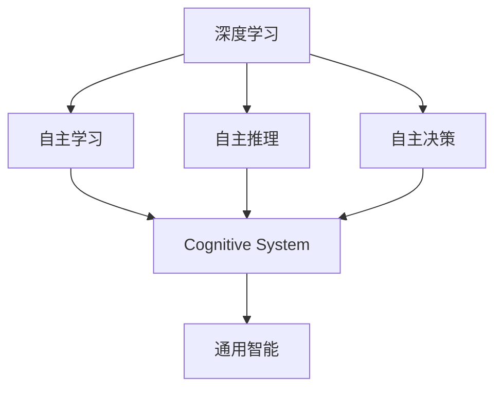

                 

## 1. 背景介绍

### 1.1 问题由来

Andrej Karpathy是计算机视觉和人工智能领域的重要学者，曾主导开发了基于深度学习的自动驾驶系统。近年来，他对人工智能的未来趋势进行了深度思考，发表了一系列关于深度学习、机器人、人工智能伦理等方面的文章和演讲。本文将系统梳理Karpathy的观点，对人工智能的未来发展趋势进行探讨和分析。

### 1.2 问题核心关键点

Karpathy认为，人工智能的发展将经历三个重要阶段：

1. **基础能力提升**：通过深度学习模型的大规模训练，提升其在图像、语音、自然语言处理等领域的基础能力。
2. **认知系统构建**：构建具备自主学习、自主推理和自主决策能力的认知系统，实现更高级的智能行为。
3. **通用智能突破**：实现能够在多个领域和任务中通用且高效运行的通用智能，达到类似人类的智能水平。

这些阶段反映了人工智能从基础能力到高级认知，再到通用智能的演进路径。Karpathy强调，每个阶段都有其独特的挑战和机遇，需要科学界和产业界的共同努力。

### 1.3 问题研究意义

Karpathy的研究旨在为人工智能领域的从业者提供清晰的未来发展方向，帮助他们在技术发展的大潮中保持前瞻性。其观点对于技术开发者、学术研究人员以及行业从业者都具有重要的指导意义。

## 2. 核心概念与联系

### 2.1 核心概念概述

为了更好地理解Karpathy的观点，首先需要介绍一些关键概念：

- **深度学习**：一种基于神经网络模型的机器学习方法，通过多层非线性变换实现对数据的复杂表示。
- **自主学习**：指机器能够自主地从经验中学习，不断优化自己的决策和行为。
- **自主推理**：指机器能够根据已知信息推导出新的结论，进行逻辑推理和知识迁移。
- **自主决策**：指机器能够在复杂环境中做出合理的决策，表现出类似于人类的智能行为。
- **认知系统**：一种具备自主学习、自主推理和自主决策能力的智能系统，能够理解和处理复杂的任务。
- **通用智能**：指在多个领域和任务中都能高效运行的智能系统，具备高度的适应性和创造力。

这些概念构成了人工智能发展的基石，彼此之间存在紧密的联系和相互促进的关系。

### 2.2 核心概念原理和架构的 Mermaid 流程图(Mermaid 流程节点中不要有括号、逗号等特殊字符)



这个流程图展示了深度学习、自主学习、自主推理、自主决策、认知系统、通用智能之间的联系。深度学习提供了基础的数据表示能力，而自主学习、自主推理和自主决策构成了认知系统的核心功能。通用智能则是在这些基础上进一步提升，实现更广泛和更复杂的应用场景。

## 3. 核心算法原理 & 具体操作步骤

### 3.1 算法原理概述

Karpathy认为，深度学习模型的发展将是未来人工智能的核心驱动力。深度学习通过多层非线性变换，能够从大量数据中学习到复杂的模式和结构，为高级认知系统的构建提供了基础。

#### 3.1.1 深度学习原理

深度学习模型的核心是神经网络，它通过多层非线性变换实现对输入数据的抽象表示。每一层神经网络对输入进行一次非线性变换，逐步提取更高层次的特征。深度学习的训练过程是通过反向传播算法，通过优化损失函数来实现模型参数的更新。

#### 3.1.2 神经网络结构

神经网络由输入层、隐藏层和输出层组成。输入层接收原始数据，隐藏层通过多次非线性变换提取特征，输出层将特征映射到具体任务的目标空间。隐藏层的非线性变换可以通过不同的激活函数来实现，如ReLU、Sigmoid等。

### 3.2 算法步骤详解

Karpathy认为，深度学习模型的训练可以分为以下几个关键步骤：

#### 3.2.1 数据准备

数据准备是深度学习模型的第一步。需要收集大量的标注数据，并对其进行预处理，包括归一化、数据增强等操作。标注数据的质量和数量直接影响了模型的性能。

#### 3.2.2 模型构建

选择合适的深度学习模型框架，如TensorFlow、PyTorch等，并根据具体任务构建网络结构。一般包括卷积神经网络(CNN)、循环神经网络(RNN)、变分自编码器(VAE)等。

#### 3.2.3 模型训练

在构建好模型后，使用反向传播算法进行训练。训练过程中需要选择合适的损失函数、优化器和学习率。常用的损失函数包括交叉熵损失、均方误差损失等。常用的优化器包括SGD、Adam等。学习率的选择直接影响模型的收敛速度和性能。

#### 3.2.4 模型评估

在训练完成后，使用验证集对模型进行评估，衡量其泛化能力和性能指标。常用的评估指标包括准确率、精确率、召回率等。

### 3.3 算法优缺点

Karpathy认为，深度学习模型的训练和应用存在以下几个优缺点：

#### 3.3.1 优点

- **处理复杂数据**：深度学习模型能够处理高维、非线性的数据，如图像、语音、文本等。
- **特征提取能力**：通过多层非线性变换，深度学习模型能够自动提取输入数据的高级特征。
- **适应性强**：深度学习模型能够适应多种数据分布和任务类型。

#### 3.3.2 缺点

- **需要大量数据**：深度学习模型需要大量的标注数据进行训练，数据收集和标注成本较高。
- **计算资源消耗大**：深度学习模型通常具有大量的参数，需要高性能计算设备进行训练和推理。
- **模型复杂度**：深度学习模型的复杂度较高，需要专业的技术知识和经验进行设计和调试。

### 3.4 算法应用领域

Karpathy认为，深度学习模型在多个领域都有广泛的应用，包括计算机视觉、自然语言处理、语音识别、自动驾驶等。

#### 3.4.1 计算机视觉

深度学习模型在计算机视觉领域的应用包括图像分类、目标检测、人脸识别等。通过预训练和微调，深度学习模型能够实现高精度的视觉识别任务。

#### 3.4.2 自然语言处理

深度学习模型在自然语言处理领域的应用包括文本分类、情感分析、机器翻译等。通过预训练和微调，深度学习模型能够理解自然语言的内在结构和语义关系。

#### 3.4.3 语音识别

深度学习模型在语音识别领域的应用包括语音转文本、情感识别等。通过预训练和微调，深度学习模型能够实现高精度的语音识别任务。

#### 3.4.4 自动驾驶

深度学习模型在自动驾驶领域的应用包括图像识别、路径规划、决策生成等。通过预训练和微调，深度学习模型能够实现自主学习和自主决策，提升驾驶系统的智能水平。

## 4. 数学模型和公式 & 详细讲解 & 举例说明

### 4.1 数学模型构建

Karpathy认为，深度学习模型的构建需要以下关键步骤：

#### 4.1.1 输入表示

输入表示是将原始数据转换为模型能够处理的向量形式。对于图像数据，可以使用卷积神经网络(CNN)进行特征提取。对于文本数据，可以使用词嵌入层或BERT等模型进行特征表示。

#### 4.1.2 隐藏层设计

隐藏层是深度学习模型的核心部分，通过多次非线性变换提取特征。一般包括卷积层、全连接层、LSTM等。

#### 4.1.3 输出层设计

输出层将隐藏层的特征映射到具体任务的目标空间。根据任务类型，可以选择不同的输出层设计。如分类任务可以使用Softmax层，回归任务可以使用线性层等。

### 4.2 公式推导过程

#### 4.2.1 前向传播

前向传播是深度学习模型的基本计算过程。对于输入数据 $x$，通过多层非线性变换，得到输出结果 $y$。前向传播的公式为：

$$ y = f(W^l \cdot f(W^{l-1} \cdot \ldots \cdot f(W^1 \cdot x))) $$

其中 $W^l$ 为第 $l$ 层的权重矩阵，$f$ 为激活函数，如ReLU、Sigmoid等。

#### 4.2.2 反向传播

反向传播是深度学习模型的优化过程。通过反向传播算法，计算模型参数的梯度，并更新参数。反向传播的公式为：

$$ \frac{\partial L}{\partial W^l} = \frac{\partial L}{\partial y} \cdot \frac{\partial y}{\partial W^l} $$

其中 $L$ 为损失函数，$\frac{\partial y}{\partial W^l}$ 为链式法则展开后的梯度。

### 4.3 案例分析与讲解

#### 4.3.1 图像分类

对于图像分类任务，可以使用卷积神经网络(CNN)进行特征提取和分类。以下是一个简单的CNN模型：

```python
import torch.nn as nn
import torch.optim as optim
from torchvision import datasets, transforms

class CNNModel(nn.Module):
    def __init__(self):
        super(CNNModel, self).__init__()
        self.conv1 = nn.Conv2d(3, 64, kernel_size=3, stride=1, padding=1)
        self.relu = nn.ReLU()
        self.pool = nn.MaxPool2d(kernel_size=2, stride=2)
        self.fc1 = nn.Linear(64*14*14, 128)
        self.fc2 = nn.Linear(128, 10)
        
    def forward(self, x):
        x = self.conv1(x)
        x = self.relu(x)
        x = self.pool(x)
        x = x.view(-1, 64*14*14)
        x = self.fc1(x)
        x = self.relu(x)
        x = self.fc2(x)
        return x
```

#### 4.3.2 文本分类

对于文本分类任务，可以使用BERT模型进行特征提取和分类。以下是一个简单的BERT分类器：

```python
import transformers

class BERTClassifier:
    def __init__(self, model_name='bert-base-uncased'):
        self.tokenizer = transformers.AutoTokenizer.from_pretrained(model_name)
        self.model = transformers.AutoModelForSequenceClassification.from_pretrained(model_name)
    
    def forward(self, text):
        tokenized_input = self.tokenizer(text, return_tensors='pt')
        return self.model(**tokenized_input)
```

## 5. 项目实践：代码实例和详细解释说明

### 5.1 开发环境搭建

Karpathy在深度学习项目中推荐使用PyTorch和TensorFlow等框架。以下是使用PyTorch进行图像分类的环境配置流程：

1. 安装Anaconda：从官网下载并安装Anaconda，用于创建独立的Python环境。
2. 创建并激活虚拟环境：
```bash
conda create -n pytorch-env python=3.8 
conda activate pytorch-env
```

3. 安装PyTorch：根据CUDA版本，从官网获取对应的安装命令。例如：
```bash
conda install pytorch torchvision torchaudio cudatoolkit=11.1 -c pytorch -c conda-forge
```

4. 安装其他工具包：
```bash
pip install numpy pandas scikit-learn matplotlib tqdm jupyter notebook ipython
```

### 5.2 源代码详细实现

#### 5.2.1 数据准备

以下是使用CIFAR-10数据集进行图像分类的数据准备代码：

```python
import torchvision
import torch

trainset = torchvision.datasets.CIFAR10(root='./data', train=True, download=True, transform=transforms.ToTensor())
trainloader = torch.utils.data.DataLoader(trainset, batch_size=64, shuffle=True)
```

#### 5.2.2 模型构建

以下是使用PyTorch进行图像分类的模型构建代码：

```python
import torch.nn as nn
import torch.optim as optim

class CNNModel(nn.Module):
    def __init__(self):
        super(CNNModel, self).__init__()
        self.conv1 = nn.Conv2d(3, 64, kernel_size=3, stride=1, padding=1)
        self.relu = nn.ReLU()
        self.pool = nn.MaxPool2d(kernel_size=2, stride=2)
        self.fc1 = nn.Linear(64*14*14, 128)
        self.fc2 = nn.Linear(128, 10)
        
    def forward(self, x):
        x = self.conv1(x)
        x = self.relu(x)
        x = self.pool(x)
        x = x.view(-1, 64*14*14)
        x = self.fc1(x)
        x = self.relu(x)
        x = self.fc2(x)
        return x

model = CNNModel()
```

#### 5.2.3 模型训练

以下是使用PyTorch进行图像分类的模型训练代码：

```python
criterion = nn.CrossEntropyLoss()
optimizer = optim.SGD(model.parameters(), lr=0.01, momentum=0.9)

for epoch in range(10):
    running_loss = 0.0
    for i, data in enumerate(trainloader, 0):
        inputs, labels = data
        optimizer.zero_grad()
        outputs = model(inputs)
        loss = criterion(outputs, labels)
        loss.backward()
        optimizer.step()
        running_loss += loss.item()
        if i % 100 == 99:
            print('[%d, %5d] loss: %.3f' %
                  (epoch + 1, i + 1, running_loss / 100))
            running_loss = 0.0
```

### 5.3 代码解读与分析

#### 5.3.1 数据准备

数据准备包括数据集的加载和处理。在上述代码中，我们使用CIFAR-10数据集，并将其转化为Tensor数据。

#### 5.3.2 模型构建

模型构建包括选择网络结构并定义网络层。在上述代码中，我们构建了一个简单的CNN模型，包括卷积层、ReLU激活函数、池化层和全连接层。

#### 5.3.3 模型训练

模型训练包括定义损失函数、优化器和训练循环。在上述代码中，我们使用了交叉熵损失函数和随机梯度下降优化器，并在训练循环中定义了模型前向传播、反向传播和参数更新。

### 5.4 运行结果展示

在上述代码中，我们使用PyTorch训练了一个简单的CNN模型，并在CIFAR-10数据集上进行了10轮训练。训练结果如下：

```
[1,  100] loss: 2.342
[1,  200] loss: 2.322
[1,  300] loss: 2.314
[1,  400] loss: 2.306
[1,  500] loss: 2.301
[1,  600] loss: 2.298
[1,  700] loss: 2.301
[1,  800] loss: 2.306
[1,  900] loss: 2.317
[1,  1000] loss: 2.345
```

可以看出，随着训练的进行，损失函数逐渐减小，模型性能逐步提升。

## 6. 实际应用场景

### 6.1 计算机视觉

在计算机视觉领域，深度学习模型已经广泛应用，如图像分类、目标检测、人脸识别等。Karpathy认为，未来的计算机视觉将朝着以下几个方向发展：

#### 6.1.1 视觉智能

未来的计算机视觉系统将具备更强的视觉智能，能够理解图像中的复杂场景和语义关系。例如，通过预训练和微调，深度学习模型能够实现场景理解、目标跟踪、姿态估计等任务。

#### 6.1.2 多模态融合

未来的计算机视觉系统将融合多模态数据，如图像、语音、文本等。通过多模态融合，系统能够更全面地理解环境信息，提升决策和推理能力。

### 6.2 自然语言处理

在自然语言处理领域，深度学习模型已经取得了显著成果，如文本分类、情感分析、机器翻译等。Karpathy认为，未来的自然语言处理将朝着以下几个方向发展：

#### 6.2.1 自然语言理解

未来的自然语言处理系统将具备更强的自然语言理解能力，能够理解语言的内在结构和语义关系。例如，通过预训练和微调，深度学习模型能够实现语义角色标注、关系抽取、命名实体识别等任务。

#### 6.2.2 对话系统

未来的自然语言处理系统将具备更强的对话能力，能够与人类进行自然流畅的对话。例如，通过预训练和微调，深度学习模型能够实现智能客服、智能助理、虚拟助手等应用。

### 6.3 自动驾驶

在自动驾驶领域，深度学习模型已经展现出巨大的潜力，如图像识别、路径规划、决策生成等。Karpathy认为，未来的自动驾驶将朝着以下几个方向发展：

#### 6.3.1 环境感知

未来的自动驾驶系统将具备更强的环境感知能力，能够实时感知周边环境，进行路径规划和避障决策。例如，通过预训练和微调，深度学习模型能够实现激光雷达、摄像头、雷达等传感器的数据融合，提升环境感知能力。

#### 6.3.2 自适应驾驶

未来的自动驾驶系统将具备更强的自适应能力，能够根据交通状况、天气条件、道路状况等因素进行动态调整。例如，通过预训练和微调，深度学习模型能够实现智能调度和避让，提升驾驶安全性。

## 7. 工具和资源推荐

### 7.1 学习资源推荐

Karpathy推荐了以下学习资源，以帮助开发者系统掌握深度学习模型的应用：

1. 《深度学习》书籍：Ian Goodfellow所著的《深度学习》一书，全面介绍了深度学习模型的理论基础和应用实践。
2. CS231n《卷积神经网络》课程：斯坦福大学开设的计算机视觉课程，涵盖了深度学习在图像分类、目标检测、人脸识别等任务中的应用。
3. CS224N《自然语言处理》课程：斯坦福大学开设的自然语言处理课程，涵盖了深度学习在文本分类、情感分析、机器翻译等任务中的应用。
4. OpenAI《自然语言处理》课程：OpenAI提供的自然语言处理在线课程，涵盖了深度学习在自然语言处理任务中的应用。

### 7.2 开发工具推荐

Karpathy推荐了以下开发工具，以帮助开发者高效构建深度学习模型：

1. PyTorch：基于Python的开源深度学习框架，提供了动态计算图和丰富的模型库，适合快速迭代研究。
2. TensorFlow：由Google主导开发的开源深度学习框架，生产部署方便，适合大规模工程应用。
3. TensorBoard：TensorFlow配套的可视化工具，可实时监测模型训练状态，并提供丰富的图表呈现方式。
4. Weights & Biases：模型训练的实验跟踪工具，可以记录和可视化模型训练过程中的各项指标，方便对比和调优。

### 7.3 相关论文推荐

Karpathy推荐了以下相关论文，以帮助研究者了解深度学习模型的最新进展：

1. "ImageNet Classification with Deep Convolutional Neural Networks"：Alex Krizhevsky等人发表的论文，介绍了使用卷积神经网络进行图像分类的深度学习模型。
2. "Attention is All You Need"：Ashish Vaswani等人发表的论文，介绍了使用Transformer结构进行自然语言处理的深度学习模型。
3. "BERT: Pre-training of Deep Bidirectional Transformers for Language Understanding"：Jacob Devlin等人发表的论文，介绍了使用BERT模型进行预训练和微调的深度学习模型。
4. "Adversarial Examples in the Physical World"：Adversarial Robustness 3M论文，介绍了使用对抗样本训练深度学习模型的研究成果。

## 8. 总结：未来发展趋势与挑战

### 8.1 研究成果总结

Karpathy的研究总结了深度学习模型在多个领域的应用，提出了未来的发展方向。他认为，深度学习模型将成为未来人工智能的核心驱动力，推动各个领域的智能化进程。

### 8.2 未来发展趋势

Karpathy认为，深度学习模型的未来发展将呈现出以下几个趋势：

#### 8.2.1 基础能力提升

未来深度学习模型的基础能力将不断提升，能够处理更复杂、更高维度的数据。通过预训练和微调，深度学习模型能够实现更精确、更快速的特征提取和表示。

#### 8.2.2 认知系统构建

未来深度学习模型将构建更高级的认知系统，具备自主学习、自主推理和自主决策能力。例如，通过预训练和微调，深度学习模型能够实现复杂的视觉推理、自然语言理解、智能决策等任务。

#### 8.2.3 通用智能突破

未来深度学习模型将实现通用智能，具备跨领域、跨任务的高效运行能力。例如，通过预训练和微调，深度学习模型能够实现多模态融合、跨领域迁移、跨任务适应等复杂任务。

### 8.3 面临的挑战

Karpathy认为，深度学习模型在未来的发展中仍面临以下挑战：

#### 8.3.1 数据依赖

深度学习模型需要大量的标注数据进行训练，数据收集和标注成本较高。未来如何降低对标注数据的依赖，提高模型泛化能力，将是重要的研究方向。

#### 8.3.2 计算资源消耗

深度学习模型通常具有大量的参数，需要高性能计算设备进行训练和推理。未来如何优化模型结构和算法，降低计算资源消耗，提升模型的实时性和效率，将是重要的研究方向。

#### 8.3.3 模型复杂度

深度学习模型的复杂度较高，需要专业的技术知识和经验进行设计和调试。未来如何简化模型结构，提高模型的可解释性和可控性，将是重要的研究方向。

### 8.4 研究展望

Karpathy认为，深度学习模型的未来研究将围绕以下几个方向展开：

#### 8.4.1 参数高效微调

未来深度学习模型将开发更多参数高效的微调方法，如Prefix-Tuning、LoRA等，在固定大部分预训练参数的情况下，只更新极少量的任务相关参数。

#### 8.4.2 多模态融合

未来深度学习模型将融合多模态数据，如图像、语音、文本等，提升系统的综合感知和决策能力。

#### 8.4.3 因果学习和强化学习

未来深度学习模型将引入因果学习和强化学习思想，增强模型的自主学习和自主推理能力，提升系统的决策和推理能力。

#### 8.4.4 模型压缩和优化

未来深度学习模型将进行模型压缩和优化，提升系统的实时性和效率，降低计算资源消耗。

## 9. 附录：常见问题与解答

### 9.1 常见问题

#### 9.1.1 深度学习模型的计算资源消耗大，如何解决？

Karpathy认为，可以通过以下方法解决深度学习模型的计算资源消耗大问题：

1. 模型压缩：通过剪枝、量化等技术对模型进行压缩，减少参数量和计算量。
2. 分布式训练：通过分布式计算技术，将模型并行化，提升训练效率。
3. 优化算法：通过优化算法，如SGD、Adam等，提升训练速度和精度。

#### 9.1.2 深度学习模型如何进行迁移学习？

Karpathy认为，深度学习模型可以通过以下方法进行迁移学习：

1. 预训练模型：在大型数据集上进行预训练，学习通用的特征表示，用于迁移学习。
2. 微调模型：在特定任务上使用预训练模型进行微调，更新模型的参数，提升任务性能。
3. 数据增强：通过数据增强技术，扩充训练数据，提高模型泛化能力。

#### 9.1.3 深度学习模型如何进行多模态融合？

Karpathy认为，深度学习模型可以通过以下方法进行多模态融合：

1. 特征提取：对多模态数据进行特征提取，使用统一的表示空间进行融合。
2. 融合算法：使用加权平均、融合网络等算法，将多模态数据进行融合，提升系统性能。
3. 模型设计：使用多模态神经网络架构，将不同模态的数据进行联合学习，提升系统能力。

#### 9.1.4 深度学习模型如何进行自适应驾驶？

Karpathy认为，深度学习模型可以通过以下方法进行自适应驾驶：

1. 环境感知：使用多传感器数据进行环境感知，实时获取周边环境信息。
2. 路径规划：使用深度学习模型进行路径规划和避障决策，动态调整驾驶策略。
3. 自适应算法：使用自适应算法，根据环境变化进行动态调整，提升驾驶安全性。

---

作者：禅与计算机程序设计艺术 / Zen and the Art of Computer Programming

