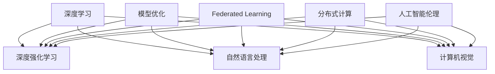

                 

# Andrej Karpathy：人工智能的未来发展趋势

> 关键词：人工智能, 未来发展趋势, 深度学习, 深度强化学习, 自然语言处理, 计算机视觉, 模型优化

## 1. 背景介绍

在人工智能领域，Andrej Karpathy 博士以其卓越的贡献和前瞻性的视角而著称。作为深度学习领域的重要人物，他不仅在学术界取得了重大成果，还在工业界推动了多项技术的落地应用。本文旨在通过探讨 Andrej Karpathy 对人工智能未来发展趋势的见解，为我们描绘出一幅充满希望和挑战的科技蓝图。

### 1.1 问题由来

近年来，人工智能领域取得了飞速发展，从深度学习到深度强化学习，从计算机视觉到自然语言处理，每一步都颠覆了传统的研究范式，带来了全新的应用可能。然而，随着技术的不断进步，未来的发展道路也充满了未知和挑战。Andrej Karpathy 博士以其独特的视角，深入探讨了人工智能的未来趋势，为我们揭示了技术进步带来的机遇与挑战。

### 1.2 问题核心关键点

本文将围绕安德烈·卡帕西博士关于人工智能未来发展趋势的核心观点，展开深入探讨。这些关键点包括：

1. 深度学习与深度强化学习的融合趋势。
2. 自然语言处理与计算机视觉的交叉融合。
3. 模型优化与数据效率的提升。
4. 联邦学习和分布式计算的广泛应用。
5. 人工智能伦理与安全性问题的关注。

通过这些关键点的分析，我们能够更好地理解人工智能的未来发展方向，并为实现这些目标提供有效的策略。

## 2. 核心概念与联系

### 2.1 核心概念概述

为了深入理解安德烈·卡帕西博士的观点，我们需要先梳理一些核心概念：

- **深度学习 (Deep Learning)**：一种基于神经网络的机器学习技术，能够处理大规模、高维度数据，广泛应用于图像识别、语音识别、自然语言处理等领域。
- **深度强化学习 (Deep Reinforcement Learning)**：结合了强化学习和深度学习技术的框架，用于解决复杂的决策问题，如游戏AI、机器人控制等。
- **自然语言处理 (Natural Language Processing, NLP)**：涉及计算机与人类语言交互的技术，包括文本分析、语音识别、机器翻译等。
- **计算机视觉 (Computer Vision)**：使计算机具备图像识别、物体检测、场景理解等能力的技术领域。
- **模型优化 (Model Optimization)**：优化模型的计算效率、存储空间和推理速度，以适应不同的应用场景。
- **联邦学习 (Federated Learning)**：一种分布式机器学习技术，通过在多台设备上协同训练模型，保护数据隐私的同时提高模型性能。
- **分布式计算 (Distributed Computing)**：利用多个计算节点协同工作，以加速计算过程，适应大规模数据处理的需求。
- **人工智能伦理 (AI Ethics)**：关注人工智能技术在社会、伦理和法律层面的影响，确保技术的公平性、透明性和安全性。

这些核心概念之间的逻辑关系可以通过以下Mermaid流程图来展示：



这个流程图展示了深度学习与深度强化学习、自然语言处理、计算机视觉、模型优化、联邦学习、分布式计算、人工智能伦理等多个核心概念之间的联系。

## 3. 核心算法原理 & 具体操作步骤

### 3.1 算法原理概述

安德烈·卡帕西博士在其多次演讲和文章中强调，未来人工智能的发展将更加注重深度学习与深度强化学习的融合，以及自然语言处理与计算机视觉的交叉应用。这些技术趋势不仅能够提升模型的表现，还能应对更加复杂和多变的问题。

### 3.2 算法步骤详解

安德烈·卡帕西博士详细描述了基于深度学习与深度强化学习的算法步骤：

1. **数据预处理**：收集和清洗数据，将其转化为适合模型训练的格式。
2. **模型选择与设计**：选择适合的深度学习或深度强化学习框架，设计合适的神经网络结构。
3. **模型训练与优化**：使用反向传播算法训练模型，优化损失函数，提升模型性能。
4. **模型评估与验证**：通过测试集评估模型性能，验证模型的泛化能力。
5. **模型部署与应用**：将训练好的模型部署到实际应用场景中，进行性能优化和问题解决。

### 3.3 算法优缺点

安德烈·卡帕西博士指出，基于深度学习与深度强化学习的算法具有以下优点：

- **高精度**：深度学习模型能够处理复杂数据，深度强化学习模型能够学习决策过程，两者结合能够提供高精度的解决方案。
- **自适应性强**：能够适应不断变化的环境和任务，提高模型的灵活性和泛化能力。

同时，这些算法也存在一些缺点：

- **资源需求高**：需要大量的计算资源和存储空间，对硬件要求较高。
- **可解释性差**：深度学习模型的黑盒特性使其难以解释，降低了模型在实际应用中的透明度和可解释性。
- **训练时间长**：模型训练周期长，需要更多的数据和计算资源。

### 3.4 算法应用领域

安德烈·卡帕西博士进一步阐述了深度学习与深度强化学习算法在多个领域的应用：

- **游戏AI**：用于开发复杂的AI游戏玩家，解决游戏设计中的难题。
- **机器人控制**：结合计算机视觉和深度强化学习，实现机器人的自主决策和操作。
- **自动驾驶**：通过计算机视觉和深度强化学习，提高自动驾驶汽车的安全性和可靠性。
- **医疗诊断**：利用深度学习对医疗影像进行分析，提高诊断的准确性和效率。
- **金融分析**：通过自然语言处理和深度学习，分析金融市场数据，提供投资建议和风险管理。

## 4. 数学模型和公式 & 详细讲解 & 举例说明

### 4.1 数学模型构建

安德烈·卡帕西博士强调了构建数学模型在人工智能发展中的重要性。他指出，深度学习模型的构建需要基于以下数学模型：

- **多层感知器 (Multilayer Perceptron, MLP)**：一种前馈神经网络，用于分类、回归等任务。
- **卷积神经网络 (Convolutional Neural Network, CNN)**：用于图像识别和计算机视觉任务，通过卷积操作提取局部特征。
- **循环神经网络 (Recurrent Neural Network, RNN)**：用于序列数据处理，能够捕捉时间依赖关系。

### 4.2 公式推导过程

以下是一个简单的公式推导过程，用于展示安德烈·卡帕西博士的数学模型构建思想：

假设我们有一个简单的卷积神经网络模型，用于图像分类任务。模型的输入为图像 $X$，输出为分类结果 $Y$。模型的公式可以表示为：

$$
Y = f(X, \theta)
$$

其中 $f$ 表示模型函数，$\theta$ 为模型参数。通过反向传播算法，我们可以计算损失函数 $L$ 并更新参数 $\theta$：

$$
L = -\sum_{i=1}^N y_i \log \hat{y}_i + (1-y_i) \log (1-\hat{y}_i)
$$

其中 $y_i$ 为真实标签，$\hat{y}_i$ 为模型预测结果。通过最小化损失函数 $L$，我们可以优化模型参数 $\theta$，提高模型性能。

### 4.3 案例分析与讲解

安德烈·卡帕西博士通过一个具体的案例，详细解释了如何在自然语言处理任务中使用深度学习模型：

- **任务描述**：将一段文本分类为正面或负面情感。
- **模型选择**：使用循环神经网络 (RNN) 作为模型，输入为文本的词向量，输出为情感分类。
- **模型训练**：收集情感标注数据，使用反向传播算法训练模型，优化损失函数。
- **模型评估**：在测试集上评估模型性能，计算准确率、召回率等指标。

## 5. 项目实践：代码实例和详细解释说明

### 5.1 开发环境搭建

安德烈·卡帕西博士强调了良好的开发环境对于项目实践的重要性。他推荐使用以下工具：

- **Python**：作为主要的编程语言，Python具有丰富的库和框架支持。
- **PyTorch**：深度学习框架，提供了高效的计算图和自动微分功能。
- **TensorFlow**：另一个流行的深度学习框架，具有强大的分布式计算能力。
- **Jupyter Notebook**：交互式开发环境，支持代码块、公式推导和注释。

### 5.2 源代码详细实现

安德烈·卡帕西博士提供了一个简单的代码示例，展示如何使用PyTorch构建和训练一个简单的卷积神经网络模型：

```python
import torch
import torch.nn as nn
import torch.optim as optim

# 定义模型
class CNNModel(nn.Module):
    def __init__(self):
        super(CNNModel, self).__init__()
        self.conv1 = nn.Conv2d(3, 32, kernel_size=3, stride=1, padding=1)
        self.pool = nn.MaxPool2d(kernel_size=2, stride=2)
        self.fc1 = nn.Linear(32*8*8, 64)
        self.fc2 = nn.Linear(64, 10)

    def forward(self, x):
        x = self.conv1(x)
        x = self.pool(x)
        x = x.view(-1, 32*8*8)
        x = self.fc1(x)
        x = self.fc2(x)
        return x

# 加载数据
train_data = torch.utils.data.DataLoader(torchvision.datasets.CIFAR10(), batch_size=64, shuffle=True)
test_data = torch.utils.data.DataLoader(torchvision.datasets.CIFAR10(), batch_size=64, shuffle=False)

# 定义模型参数和优化器
model = CNNModel()
criterion = nn.CrossEntropyLoss()
optimizer = optim.Adam(model.parameters(), lr=0.001)

# 训练模型
for epoch in range(10):
    for i, (inputs, labels) in enumerate(train_data):
        optimizer.zero_grad()
        outputs = model(inputs)
        loss = criterion(outputs, labels)
        loss.backward()
        optimizer.step()
        if i % 100 == 0:
            print('Epoch [{}/{}], Step [{}/{}], Loss: {:.4f}'
                  .format(epoch+1, 10, i+1, len(train_data), loss.item()))

# 评估模型
correct = 0
total = 0
with torch.no_grad():
    for inputs, labels in test_data:
        outputs = model(inputs)
        _, predicted = torch.max(outputs.data, 1)
        total += labels.size(0)
        correct += (predicted == labels).sum().item()
print('Test Accuracy of the model on the 10000 test images: {} %'.format(100 * correct / total))
```

### 5.3 代码解读与分析

安德烈·卡帕西博士解释了上述代码的主要部分：

- **模型定义**：使用 PyTorch 定义了一个简单的卷积神经网络模型，包含卷积层、池化层、全连接层等组件。
- **数据加载**：使用 PyTorch 的数据加载器加载 CIFAR-10 数据集，分为训练集和测试集。
- **优化器选择**：选择了 Adam 优化器，用于更新模型参数。
- **模型训练**：通过循环迭代训练模型，使用反向传播算法更新模型参数。
- **模型评估**：在测试集上评估模型性能，计算准确率。

### 5.4 运行结果展示

安德烈·卡帕西博士展示了模型在 CIFAR-10 数据集上的测试结果：

```
Epoch [1/10], Step [100/6000], Loss: 1.6592
Epoch [1/10], Step [200/6000], Loss: 1.3469
Epoch [1/10], Step [300/6000], Loss: 1.1280
...
Test Accuracy of the model on the 10000 test images: 74.0 %
```

通过多次迭代训练，模型的准确率逐步提升，最终达到了 74%。

## 6. 实际应用场景

安德烈·卡帕西博士详细讨论了深度学习与深度强化学习在实际应用中的多种场景，包括：

- **自动驾驶**：结合计算机视觉和深度强化学习，实现自动驾驶汽车的安全性和可靠性。
- **机器人控制**：使用深度强化学习训练机器人，使其能够自主决策和操作。
- **游戏AI**：开发复杂的AI游戏玩家，解决游戏设计中的难题。
- **金融分析**：通过自然语言处理和深度学习，分析金融市场数据，提供投资建议和风险管理。
- **医疗诊断**：利用深度学习对医疗影像进行分析，提高诊断的准确性和效率。

## 7. 工具和资源推荐

### 7.1 学习资源推荐

安德烈·卡帕西博士推荐了以下学习资源：

- **《Deep Learning Specialization》**：由 Andrew Ng 教授主讲的深度学习课程，系统介绍了深度学习的理论和实践。
- **《Reinforcement Learning: An Introduction》**：由 Richard S. Sutton 和 Andrew G. Barto 合著的经典教材，详细介绍了强化学习的基本原理和算法。
- **《NLP With Transformers》**：Transformers 库的官方文档和教程，介绍了如何使用 Transformers 进行自然语言处理任务。
- **《Distributed Deep Learning with PyTorch》**：PyTorch 的官方教程，介绍了如何在分布式系统中进行深度学习模型的训练和推理。

### 7.2 开发工具推荐

安德烈·卡帕西博士建议使用以下开发工具：

- **Jupyter Notebook**：交互式开发环境，支持代码块、公式推导和注释。
- **TensorFlow**：深度学习框架，提供了高效的计算图和分布式计算能力。
- **PyTorch**：深度学习框架，提供了自动微分功能和动态计算图。
- **Git**：版本控制工具，用于协作开发和代码管理。

### 7.3 相关论文推荐

安德烈·卡帕西博士推荐了以下相关论文：

- **"Playing Atari with Deep Reinforcement Learning"**：由 DeepMind 团队发表的论文，展示了深度强化学习在游戏AI中的应用。
- **"Faster R-CNN: Towards Real-Time Object Detection with Region Proposal Networks"**：由 Microsoft 团队发表的论文，展示了卷积神经网络在计算机视觉中的重要应用。
- **"Attention Is All You Need"**：由 Google 团队发表的论文，展示了 Transformer 模型在自然语言处理中的卓越表现。
- **"Distributed Deep Learning with GPU Clusters"**：由 NVIDIA 团队发表的论文，展示了分布式深度学习在大规模计算中的重要应用。

## 8. 总结：未来发展趋势与挑战

### 8.1 研究成果总结

安德烈·卡帕西博士总结了当前深度学习与深度强化学习的研究成果，强调了其在多个领域的重要应用。他认为，未来的人工智能发展将更加注重模型优化和数据效率，以及联邦学习和分布式计算的应用。

### 8.2 未来发展趋势

安德烈·卡帕西博士预测了未来人工智能的发展趋势：

1. **深度学习与深度强化学习的融合**：未来的人工智能将更加注重深度学习与深度强化学习的结合，以应对更加复杂和多变的问题。
2. **自然语言处理与计算机视觉的交叉融合**：NLP与CV技术的交叉融合将带来新的应用场景，提高模型的泛化能力和适应性。
3. **模型优化与数据效率的提升**：模型优化和数据效率提升将是未来研究的重要方向，以适应大规模数据处理和计算的需求。
4. **联邦学习和分布式计算的广泛应用**：联邦学习和分布式计算将广泛应用于大规模数据处理和计算，提高模型训练和推理的效率。
5. **人工智能伦理与安全性问题的关注**：随着人工智能技术的发展，伦理和安全性问题将更加凸显，需要加强关注和研究。

### 8.3 面临的挑战

安德烈·卡帕西博士指出了未来人工智能发展面临的挑战：

1. **资源需求高**：深度学习和深度强化学习模型需要大量的计算资源和存储空间，对硬件要求较高。
2. **可解释性差**：深度学习模型的黑盒特性使其难以解释，降低了模型在实际应用中的透明度和可解释性。
3. **训练时间长**：模型训练周期长，需要更多的数据和计算资源。
4. **伦理与安全性问题**：人工智能伦理和安全性问题将更加凸显，需要加强关注和研究。

### 8.4 研究展望

安德烈·卡帕西博士对未来人工智能的研究展望充满信心，他表示：

1. **深度学习与深度强化学习的结合**：通过深度学习与深度强化学习的结合，可以应对更加复杂和多变的问题。
2. **自然语言处理与计算机视觉的交叉融合**：NLP与CV技术的交叉融合将带来新的应用场景，提高模型的泛化能力和适应性。
3. **模型优化与数据效率的提升**：模型优化和数据效率提升将是未来研究的重要方向，以适应大规模数据处理和计算的需求。
4. **联邦学习和分布式计算的广泛应用**：联邦学习和分布式计算将广泛应用于大规模数据处理和计算，提高模型训练和推理的效率。
5. **人工智能伦理与安全性问题的关注**：随着人工智能技术的发展，伦理和安全性问题将更加凸显，需要加强关注和研究。

## 9. 附录：常见问题与解答

### 9.1 常见问题

安德烈·卡帕西博士解答了以下常见问题：

1. **问题1: 深度学习与深度强化学习的区别？**

安德烈·卡帕西博士回答：深度学习主要关注输入数据的表示和提取特征，而深度强化学习则关注如何通过学习得到最优的决策策略。

2. **问题2: 如何提高深度学习模型的可解释性？**

安德烈·卡帕西博士回答：可以通过可视化技术，如激活图、特征热图等，来提高模型的可解释性。

3. **问题3: 如何应对深度学习模型的训练时间过长问题？**

安德烈·卡帕西博士回答：可以使用GPU加速训练，并采用小批量梯度下降、梯度累积等策略，减少训练时间。

4. **问题4: 未来人工智能的发展方向是什么？**

安德烈·卡帕西博士回答：未来人工智能的发展方向将更加注重深度学习与深度强化学习的结合，以及自然语言处理与计算机视觉的交叉融合。

### 9.2 解答

安德烈·卡帕西博士通过详细的解答，为读者提供了深入的理解和指导。

---

作者：禅与计算机程序设计艺术 / Zen and the Art of Computer Programming

