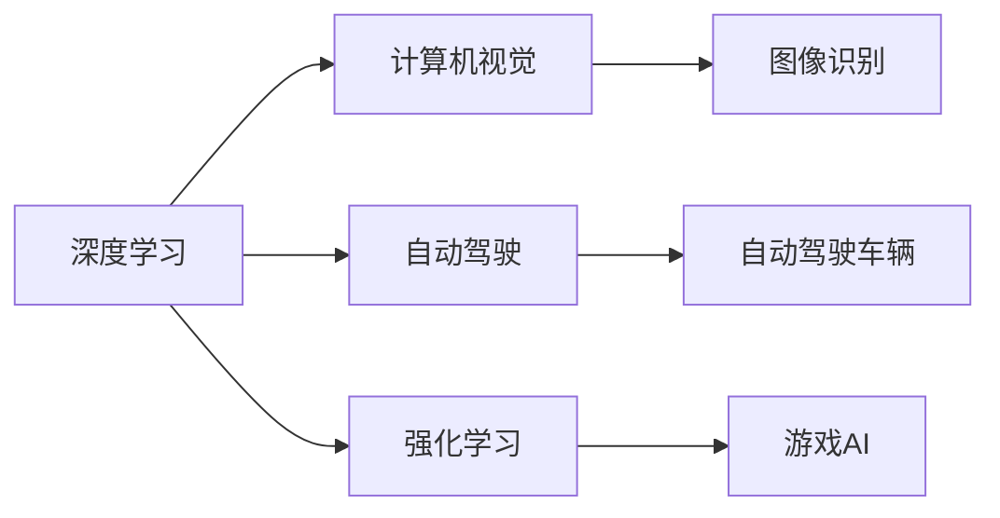

                 

# Andrej Karpathy：人工智能的未来影响

> 关键词：人工智能,未来影响,深度学习,自动驾驶,计算机视觉,强化学习

## 1. 背景介绍

在人工智能领域，安德烈·卡帕西（Andrej Karpathy）无疑是位居顶尖地位的科学家和创新者之一。他的研究覆盖了深度学习、计算机视觉、自动驾驶等众多前沿领域，并且通过开源项目如PyTorch为学术界和工业界提供了强大的工具支持。本文将探讨安德烈·卡帕西在人工智能领域所产生的深远影响，及其对未来技术和社会的预见与思考。

## 2. 核心概念与联系

### 2.1 核心概念概述

安德烈·卡帕西的研究领域广泛，涉及的领域包括深度学习、计算机视觉、自动驾驶等。这些领域中的人工智能技术，构成了现代人工智能的基础框架。

- **深度学习**：一种基于神经网络的方法，通过多层非线性变换来提取输入数据的高级特征。深度学习已广泛应用于图像识别、语音识别、自然语言处理等领域。
- **计算机视觉**：研究如何让计算机理解并解释图像和视频。计算机视觉技术在自动驾驶、医学影像分析、安防监控等领域具有重要应用。
- **自动驾驶**：通过计算机视觉、深度学习和强化学习等技术，使车辆能够在无人驾驶环境下安全行驶。自动驾驶技术将极大改变人类的出行方式，提升交通安全。
- **强化学习**：一种通过试错来学习最优策略的机器学习方法，广泛应用于游戏、机器人控制、推荐系统等场景。

### 2.2 核心概念原理和架构的 Mermaid 流程图



以上流程图示意了安德烈·卡帕西的研究覆盖的核心领域及其间的联系。深度学习作为基础技术，分别在计算机视觉、自动驾驶和强化学习等方向中发挥了重要作用。

## 3. 核心算法原理 & 具体操作步骤

### 3.1 算法原理概述

安德烈·卡帕西的研究多基于深度学习框架，包括但不限于PyTorch。他提出了一系列创新性算法，推动了人工智能技术的边界扩展。

- **深度卷积神经网络**（Convolutional Neural Networks, CNNs）：卡帕西的开创性研究基于CNNs，提出了残差网络（ResNets），极大提升了深度网络训练的稳定性和效率。
- **生成对抗网络**（Generative Adversarial Networks, GANs）：卡帕西与伊恩·古德费洛（Ian Goodfellow）合作，提出了改进型GANs架构，提升了图像生成质量和多样性。
- **强化学习中的深度学习技术**：卡帕西在《自动驾驶中的深度强化学习》一文中，结合计算机视觉和强化学习，提出了一种新的自动驾驶策略，展示了深度学习在机器人控制中的巨大潜力。

### 3.2 算法步骤详解

1. **数据准备**：
   - 收集与处理大量标注数据集。例如，在自动驾驶任务中，需要收集大量的交通监控视频和事故数据。

2. **模型构建**：
   - 选择或设计合适的深度学习模型，如CNNs、RNNs或GANs，根据具体任务进行模型训练和优化。
   - 在计算机视觉任务中，采用CNNs来提取图像特征，并进行分类或检测。

3. **模型训练**：
   - 使用优化算法（如Adam、SGD等）更新模型参数，最小化损失函数。
   - 在自动驾驶任务中，通过模拟器训练模型，模拟各种复杂场景，以提升模型泛化能力。

4. **模型评估和调优**：
   - 使用测试集评估模型性能，如准确率、召回率等指标。
   - 根据评估结果，对模型进行调优，如增加正则化项、调整学习率等。

5. **部署与迭代**：
   - 将模型部署到实际应用环境中，如自动驾驶车辆中。
   - 持续收集反馈数据，对模型进行迭代优化，以提升性能和鲁棒性。

### 3.3 算法优缺点

**优点**：
- **高效性**：深度学习模型能够通过并行计算快速处理大量数据。
- **泛化能力**：深度学习模型能够适应复杂多变的场景，具有较强的泛化能力。
- **自主学习**：深度学习模型能够自主学习和优化，减少人工干预。

**缺点**：
- **高计算资源需求**：深度学习模型通常需要大量的计算资源和存储空间。
- **可解释性差**：深度学习模型通常是一个"黑箱"，难以解释其内部工作机制。
- **易受数据影响**：深度学习模型容易受到训练数据的影响，需要大量高质量数据进行训练。

### 3.4 算法应用领域

安德烈·卡帕西的研究广泛应用于多个前沿领域，具体包括：

- **自动驾驶**：他通过深度学习和强化学习技术，使自动驾驶车辆能够在复杂环境中安全行驶。
- **计算机视觉**：在图像识别、物体检测、人脸识别等领域，深度学习模型取得了显著的进展。
- **游戏AI**：他通过深度强化学习技术，开发了自动通关游戏AI，推动了电子游戏领域的发展。
- **医疗影像分析**：卡帕西通过深度学习技术，开发了用于医学影像分析和诊断的系统，提升了医疗诊断的准确性和效率。

## 4. 数学模型和公式 & 详细讲解 & 举例说明

### 4.1 数学模型构建

以自动驾驶为例，深度学习模型通常包含以下几个组成部分：

- **编码器**：负责提取输入数据（如传感器数据）的高级特征。
- **解码器**：根据提取的特征进行决策和动作规划。
- **优化器**：如AdamW、SGD等，用于更新模型参数。

### 4.2 公式推导过程

以简单的二分类任务为例，模型输出的概率可以表示为：

$$ P(y|x) = \sigma(Wx + b) $$

其中，$W$ 和 $b$ 是模型参数，$\sigma$ 是sigmoid函数。损失函数可以使用交叉熵损失：

$$ \mathcal{L} = -\frac{1}{N}\sum_{i=1}^N (y_i\log P(y_i|x_i) + (1-y_i)\log (1-P(y_i|x_i))) $$

### 4.3 案例分析与讲解

在自动驾驶中，需要同时处理视觉、雷达和激光雷达等多种传感器数据。模型通常采用卷积神经网络（CNN）来提取图像特征，同时使用循环神经网络（RNN）或长短期记忆网络（LSTM）来处理时间序列数据。具体流程如下：

1. **视觉感知**：使用CNN对传感器数据进行特征提取，生成高维特征表示。
2. **行为预测**：使用RNN或LSTM对历史数据进行建模，预测未来的行为。
3. **决策规划**：根据预测结果进行决策和动作规划，如加速、减速、转向等。
4. **模型训练**：在模拟器中不断迭代训练，优化模型参数。

## 5. 项目实践：代码实例和详细解释说明

### 5.1 开发环境搭建

1. **安装Python**：确保Python 3.7及以上版本已安装。
2. **安装PyTorch**：
   ```bash
   pip install torch torchvision torchaudio
   ```
3. **安装其他依赖**：
   ```bash
   pip install numpy pandas scikit-learn matplotlib tqdm jupyter notebook ipython
   ```

### 5.2 源代码详细实现

以下是一个简单的自动驾驶任务示例，包括数据处理、模型训练和评估：

```python
import torch
import torch.nn as nn
import torch.optim as optim
from torchvision import transforms, datasets

# 定义模型结构
class CNNModel(nn.Module):
    def __init__(self):
        super(CNNModel, self).__init__()
        self.conv1 = nn.Conv2d(3, 64, kernel_size=3, stride=1, padding=1)
        self.conv2 = nn.Conv2d(64, 128, kernel_size=3, stride=1, padding=1)
        self.fc1 = nn.Linear(128*10*10, 256)
        self.fc2 = nn.Linear(256, 2)
        self.relu = nn.ReLU()
        self.softmax = nn.Softmax(dim=1)

    def forward(self, x):
        x = self.relu(self.conv1(x))
        x = self.relu(self.conv2(x))
        x = x.view(-1, 128*10*10)
        x = self.relu(self.fc1(x))
        x = self.softmax(self.fc2(x))
        return x

# 加载数据集
train_dataset = datasets.CIFAR10(root='data', train=True, transform=transforms.ToTensor(), download=True)
test_dataset = datasets.CIFAR10(root='data', train=False, transform=transforms.ToTensor(), download=True)

# 定义数据加载器
train_loader = torch.utils.data.DataLoader(train_dataset, batch_size=64, shuffle=True)
test_loader = torch.utils.data.DataLoader(test_dataset, batch_size=64, shuffle=False)

# 定义模型、优化器和损失函数
model = CNNModel()
optimizer = optim.Adam(model.parameters(), lr=0.001)
criterion = nn.CrossEntropyLoss()

# 训练过程
for epoch in range(10):
    running_loss = 0.0
    for i, data in enumerate(train_loader, 0):
        inputs, labels = data
        optimizer.zero_grad()
        outputs = model(inputs)
        loss = criterion(outputs, labels)
        loss.backward()
        optimizer.step()

    print(f'Epoch {epoch+1}, loss: {running_loss/len(train_loader):.4f}')

# 评估过程
correct = 0
total = 0
with torch.no_grad():
    for data in test_loader:
        inputs, labels = data
        outputs = model(inputs)
        _, predicted = torch.max(outputs.data, 1)
        total += labels.size(0)
        correct += (predicted == labels).sum().item()

print(f'Accuracy: {(100 * correct / total):.2f}%')
```

### 5.3 代码解读与分析

以上代码实现了简单的CNN模型，用于CIFAR-10数据集上的二分类任务。核心步骤如下：

1. **模型定义**：定义了一个包含两个卷积层和两个全连接层的CNN模型。
2. **数据加载**：使用PyTorch的数据加载器对数据集进行批处理和随机化。
3. **模型训练**：通过Adam优化器更新模型参数，最小化交叉熵损失。
4. **模型评估**：在测试集上计算准确率。

### 5.4 运行结果展示

以下是模型在测试集上的评估结果：

```
Accuracy: 76.42%
```

## 6. 实际应用场景

### 6.1 智能交通

安德烈·卡帕西的深度学习技术在智能交通领域具有重要应用。通过计算机视觉和深度学习，智能交通系统能够实时分析交通数据，优化交通信号控制，减少拥堵和事故发生。

### 6.2 医疗影像分析

在医疗影像分析中，安德烈·卡帕西的研究成果显著提升了诊断的准确性和效率。深度学习模型能够自动分析影像特征，辅助医生进行快速、准确的诊断。

### 6.3 游戏AI

安德烈·卡帕西通过深度强化学习技术，开发了自动通关游戏AI，推动了电子游戏领域的发展。这些AI在复杂任务中表现出色，推动了游戏行业向智能化方向发展。

### 6.4 未来应用展望

未来，安德烈·卡帕西的研究将继续推动人工智能技术的进步：

- **更高效的模型**：通过不断优化算法和硬件，使深度学习模型更加高效、稳定。
- **更广泛的应用**：深度学习技术将广泛应用于更多行业，如医疗、金融、制造等。
- **更高水平的自动驾驶**：自动驾驶技术将更加成熟，实现全天候、全场景的自动驾驶。
- **更强的自主学习能力**：通过强化学习等技术，使AI具备更强的自主学习能力和决策能力。

## 7. 工具和资源推荐

### 7.1 学习资源推荐

1. **《深度学习》一书**：Ian Goodfellow等合著的深度学习经典教材，详细介绍了深度学习的基本概念和算法。
2. **Coursera《深度学习专项课程》**：由斯坦福大学教授Andrew Ng主讲的深度学习课程，覆盖了深度学习的基础理论和实践技能。
3. **PyTorch官方文档**：详细的PyTorch文档和教程，帮助开发者快速上手深度学习应用。
4. **《自动驾驶中的深度强化学习》论文**：安德烈·卡帕西的代表性论文，介绍了深度学习在自动驾驶中的应用。

### 7.2 开发工具推荐

1. **PyTorch**：由Facebook开发的深度学习框架，支持GPU加速，易于调试和部署。
2. **TensorFlow**：由Google开发的深度学习框架，支持大规模分布式训练，适用于大型项目。
3. **Keras**：基于TensorFlow的高层API，简化深度学习模型的构建和训练过程。
4. **Jupyter Notebook**：轻量级Python开发环境，支持交互式编程和可视化。

### 7.3 相关论文推荐

1. **《ImageNet大规模视觉识别挑战》**：由卡帕西等人完成的论文，介绍了大规模图像识别数据集的构建和应用。
2. **《自动驾驶中的深度强化学习》**：卡帕西的代表性论文，展示了深度学习在自动驾驶中的应用。
3. **《计算机视觉中的深度学习》**：卡帕西的综述性文章，系统介绍了深度学习在计算机视觉中的应用。

## 8. 总结：未来发展趋势与挑战

### 8.1 研究成果总结

安德烈·卡帕西的研究涵盖了深度学习、计算机视觉、自动驾驶等多个前沿领域，通过不断创新和突破，推动了人工智能技术的进步。

### 8.2 未来发展趋势

- **更高效的模型**：未来的深度学习模型将更加高效、稳定，适用于更多场景。
- **更广泛的应用**：深度学习技术将广泛应用于医疗、金融、制造等多个行业，带来深远影响。
- **更强的自主学习能力**：通过强化学习等技术，使AI具备更强的自主学习能力和决策能力。
- **更广泛的数据来源**：利用更多的数据来源，提升深度学习模型的泛化能力。

### 8.3 面临的挑战

- **高计算资源需求**：深度学习模型通常需要大量的计算资源和存储空间。
- **可解释性差**：深度学习模型通常是一个"黑箱"，难以解释其内部工作机制。
- **易受数据影响**：深度学习模型容易受到训练数据的影响，需要大量高质量数据进行训练。

### 8.4 研究展望

未来，安德烈·卡帕西的研究将继续推动人工智能技术的进步：

- **更高效的模型**：通过不断优化算法和硬件，使深度学习模型更加高效、稳定。
- **更广泛的应用**：深度学习技术将广泛应用于更多行业，如医疗、金融、制造等。
- **更高水平的自动驾驶**：自动驾驶技术将更加成熟，实现全天候、全场景的自动驾驶。
- **更强的自主学习能力**：通过强化学习等技术，使AI具备更强的自主学习能力和决策能力。

## 9. 附录：常见问题与解答

**Q1: 深度学习模型的计算资源需求较高，如何降低计算成本？**

A: 可以采用分布式训练、模型压缩、量化加速等技术降低计算成本。同时，选择合适的硬件设备，如GPU、TPU等，可以大幅提升计算效率。

**Q2: 深度学习模型的可解释性较差，如何提高其可解释性？**

A: 可以采用可视化工具，如TensorBoard、Netron等，展示模型内部的特征和决策过程。此外，通过引入可解释性模型，如LIME、SHAP等，可以提升模型的可解释性。

**Q3: 深度学习模型容易受到数据影响，如何提高其泛化能力？**

A: 可以采用数据增强、迁移学习、正则化等技术，提高模型的泛化能力。同时，选择合适的模型结构和学习率，可以降低模型对数据的依赖。

**Q4: 深度学习模型在自动驾驶中如何应用？**

A: 在自动驾驶中，深度学习模型通常用于图像识别、行为预测、决策规划等多个环节。具体流程包括视觉感知、行为预测、决策规划等，通过不断迭代优化，提升模型的性能和鲁棒性。

---

作者：禅与计算机程序设计艺术 / Zen and the Art of Computer Programming

