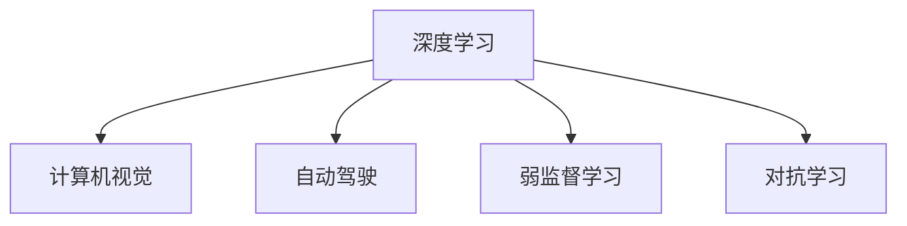

                 

## 1. 背景介绍

安德烈·卡帕西（Andrej Karpathy），作为AI领域的翘楚，一直以来都在深度学习、计算机视觉和自动驾驶等领域进行前沿探索。他的工作影响了AI的发展方向，并推动了相关技术的普及和应用。卡帕西的思想和观点常常为AI社区所追捧，并对研究人员和工程师们提供了深刻的见解。本文将从人工智能的现状和未来挑战两方面出发，深入探讨卡帕西关于AI的未来展望。

## 2. 核心概念与联系

### 2.1 核心概念概述

卡帕西在AI研究中强调了多个核心概念，这些概念构成了他关于人工智能未来发展的基石。以下是其中几个关键概念：

- **深度学习（Deep Learning）**：指利用多层神经网络来模拟人类视觉、听觉、语言等高级认知功能的技术。深度学习通过大量的数据和计算资源训练出能够识别、分类、生成和预测等复杂任务的模型。
- **计算机视觉（Computer Vision）**：涉及如何让计算机像人一样"看"的能力。计算机视觉在自动驾驶、医学影像分析、视频监控等方面有广泛应用。
- **自动驾驶（Autonomous Driving）**：使汽车在无需人类干预的情况下，基于环境感知和规划自主行驶。自动驾驶是AI在现实世界的具体应用之一。
- **弱监督学习（Weakly Supervised Learning）**：指在数据标注成本高的情况下，如何利用少量的标签信息进行有效训练。弱监督学习通过数据增强、迁移学习等方法，缓解了数据标注的挑战。
- **对抗学习（Adversarial Learning）**：研究如何构建模型，使其在面对精心设计的对抗样本时仍能保持稳定性能。对抗学习在数据隐私保护和网络安全中具有重要应用。

### 2.2 核心概念原理和架构的 Mermaid 流程图



该图展示了深度学习在计算机视觉、自动驾驶、弱监督学习和对抗学习中的应用。这些概念相互关联，共同构成了卡帕西对AI技术的理解。

## 3. 核心算法原理 & 具体操作步骤

### 3.1 算法原理概述

卡帕西强调了深度学习在人工智能中的核心地位，并指出深度学习模型之所以能够取得成功，主要归因于其在处理大规模数据和构建复杂非线性函数方面具有无可比拟的潜力。在计算机视觉领域，深度学习通过卷积神经网络（CNN）和循环神经网络（RNN）等模型，学习图像和序列数据的特征表示，从而实现图像分类、物体检测、语义分割等任务。

在自动驾驶领域，深度学习模型通过感知融合、行为规划和决策执行等模块，使得无人车能够在复杂环境下自主驾驶。自动驾驶模型通常包含感知模块（如摄像头、激光雷达等传感器数据的处理）和决策模块（如路径规划和行为选择）。

在对抗学习方面，卡帕西指出，对抗样本能够揭示模型的弱点，从而促使研究人员不断改进模型的鲁棒性。对抗样本是通过对输入数据进行微小扰动，使得模型在面对这些扰动时仍能保持稳定性能。这一领域的研究不仅仅局限于图像处理，还包括语音处理、自然语言处理等多个方向。

### 3.2 算法步骤详解

以计算机视觉中的图像分类任务为例，卡帕西介绍了深度学习模型的一般训练流程：

1. **数据准备**：收集大量标记好的图像数据，将其划分为训练集、验证集和测试集。

2. **模型选择**：根据任务特点选择合适的深度学习模型，如卷积神经网络（CNN）。

3. **模型训练**：将训练数据输入模型，通过反向传播算法计算损失函数，并根据损失函数调整模型参数。训练过程中需要监控验证集上的性能指标，避免过拟合。

4. **模型评估**：在测试集上评估模型的性能，通常使用准确率、精确率、召回率等指标。

5. **模型部署**：将训练好的模型部署到实际应用中，进行推理预测。

在自动驾驶领域，卡帕西强调了传感器数据融合的重要性。无人车需要在多个传感器（如摄像头、激光雷达、雷达等）的数据中，综合处理感知信息，构建高精度的环境地图，并做出实时决策。这一过程中，深度学习模型负责感知数据的前向处理，行为规划和决策执行模块则负责后续的推理和决策。

在对抗学习方面，卡帕西指出，构建对抗样本的过程和对抗模型的训练是两个关键步骤。通过对抗样本，研究人员可以评估模型的鲁棒性，并通过对抗训练提高模型的防御能力。

### 3.3 算法优缺点

深度学习模型在处理大规模数据和构建复杂函数方面具有强大的能力，但也存在以下局限：

- **数据依赖性**：深度学习模型需要大量的标注数据进行训练，数据不足时效果不佳。
- **计算资源消耗大**：深度学习模型通常需要大量计算资源进行训练和推理，这在高性能计算设备上可以实现，但在普通设备上则面临挑战。
- **可解释性不足**：深度学习模型通常被视为"黑盒"系统，难以解释其内部工作机制。
- **泛化能力**：深度学习模型在训练集上效果优异，但在测试集上可能表现不佳，存在泛化能力不足的问题。

尽管如此，深度学习模型仍在AI领域取得了广泛应用，其强大的特征提取和表示学习能力使其在计算机视觉、自然语言处理等领域具有重要价值。

### 3.4 算法应用领域

深度学习模型已经在多个领域取得了显著成就：

- **计算机视觉**：在图像分类、目标检测、图像分割等任务中表现优异。
- **自然语言处理**：通过语言模型、序列生成模型等，实现了文本分类、机器翻译、语音识别等任务。
- **自动驾驶**：在无人车感知和行为规划中发挥重要作用。
- **医学影像**：通过图像处理和分析，提高了疾病诊断的准确性。
- **游戏AI**：在电子游戏中实现高度智能的对手。

## 4. 数学模型和公式 & 详细讲解 & 举例说明

### 4.1 数学模型构建

以图像分类为例，深度学习模型通常由卷积层、池化层、全连接层等组成。输入为图像数据，输出为分类标签。模型的目标是通过最小化损失函数来优化参数，使模型能够正确分类图像。

假设输入图像数据为 $x$，模型参数为 $\theta$，输出标签为 $y$。常见的损失函数包括交叉熵损失函数：

$$
\mathcal{L}(\theta) = -\frac{1}{N}\sum_{i=1}^N \sum_{j=1}^C y_{ij}\log p_{ij}
$$

其中，$N$ 为样本数量，$C$ 为类别数量，$y_{ij}$ 为样本 $i$ 在类别 $j$ 上的标签，$p_{ij}$ 为模型在类别 $j$ 上的预测概率。

### 4.2 公式推导过程

通过反向传播算法，计算损失函数对模型参数的梯度，使用梯度下降等优化算法更新参数：

$$
\theta \leftarrow \theta - \eta \nabla_{\theta}\mathcal{L}(\theta)
$$

其中，$\eta$ 为学习率，$\nabla_{\theta}\mathcal{L}(\theta)$ 为损失函数对参数的梯度。

### 4.3 案例分析与讲解

以目标检测任务为例，卡帕西详细分析了深度学习模型在处理图像中多个物体时的策略。目标检测模型通常包含两个阶段：区域提取（Region Proposal）和分类（Classification）。在区域提取阶段，模型首先生成多个候选区域，然后在这些区域上进行分类。

区域提取阶段常用的方法包括选择性搜索（Selective Search）和区域池化（Region Pooling）。分类阶段通常使用卷积神经网络（CNN）进行特征提取和分类。目标检测模型通过联合训练两个阶段，实现了高精度的物体检测。

## 5. 项目实践：代码实例和详细解释说明

### 5.1 开发环境搭建

要实践深度学习模型，需要搭建一个包含高性能计算资源的开发环境。以下是一个简单的Python深度学习环境搭建流程：

1. **安装Python**：使用Anaconda或Miniconda安装Python 3.8或以上版本。

2. **安装深度学习库**：安装TensorFlow、PyTorch、Keras等深度学习库。

3. **安装计算机视觉库**：安装OpenCV、Pillow等计算机视觉库。

4. **安装模型库**：安装预训练模型库，如ImageNet预训练的模型。

### 5.2 源代码详细实现

以下是一个简单的图像分类任务代码实现，使用了Keras库：

```python
from keras.models import Sequential
from keras.layers import Conv2D, MaxPooling2D, Flatten, Dense

# 构建模型
model = Sequential()
model.add(Conv2D(32, (3, 3), activation='relu', input_shape=(32, 32, 3)))
model.add(MaxPooling2D((2, 2)))
model.add(Conv2D(64, (3, 3), activation='relu'))
model.add(MaxPooling2D((2, 2)))
model.add(Flatten())
model.add(Dense(64, activation='relu'))
model.add(Dense(10, activation='softmax'))

# 编译模型
model.compile(optimizer='adam', loss='categorical_crossentropy', metrics=['accuracy'])

# 训练模型
model.fit(train_images, train_labels, epochs=10, validation_data=(test_images, test_labels))
```

### 5.3 代码解读与分析

- **模型构建**：使用卷积层和池化层进行特征提取，使用全连接层进行分类。
- **模型编译**：选择合适的优化器和损失函数，并定义评估指标。
- **模型训练**：使用训练数据和标签进行模型训练，并在验证集上进行性能评估。

## 6. 实际应用场景

### 6.1 自动驾驶

自动驾驶是卡帕西深度学习的实际应用之一。自动驾驶技术需要处理高精度地图、车辆传感器数据和实时环境信息，进行路径规划和决策。深度学习模型在自动驾驶中发挥了重要作用，如感知模块的视觉识别、行为规划的决策选择等。

### 6.2 医学影像分析

深度学习在医学影像分析中也有广泛应用。通过卷积神经网络（CNN）模型，医生可以高效地检测出病变区域，并进行分类诊断。卡帕西指出，深度学习模型在医学影像中的表现优于传统方法，能够提高疾病诊断的准确性。

### 6.3 游戏AI

游戏AI是卡帕西深度学习应用的另一个重要领域。通过深度学习模型，游戏AI能够在复杂的游戏环境中做出实时决策，从而获得更高的游戏分数。

### 6.4 未来应用展望

卡帕西认为，未来深度学习将在多个领域继续发挥重要作用：

- **自动驾驶**：未来无人车将具备更强的环境感知能力和决策能力，实现更加安全和高效的自动驾驶。
- **计算机视觉**：深度学习模型将在图像识别、视频分析、增强现实等领域取得更广泛的应用。
- **自然语言处理**：深度学习模型将在智能客服、语音识别、机器翻译等领域推动智能化进程。
- **医疗健康**：深度学习模型将在疾病诊断、基因分析、个性化治疗等领域发挥重要作用。
- **智能制造**：深度学习模型将在工业自动化、智能制造等领域推动生产效率的提升。

## 7. 工具和资源推荐

### 7.1 学习资源推荐

- **深度学习课程**：Coursera和Udacity提供了多个深度学习课程，包括入门到高级的课程，涵盖深度学习的基础理论和实践技能。
- **书籍推荐**：《深度学习》（Goodfellow et al.）和《计算机视觉：算法与应用》（Szegedy et al.）是深度学习和计算机视觉领域的经典书籍。
- **在线资源**：Deep Learning AMAs（Ask Me Anything）和GitHub等平台，提供了大量的深度学习项目和代码实现。

### 7.2 开发工具推荐

- **Jupyter Notebook**：用于数据探索、模型训练和结果展示，支持多种编程语言和库。
- **TensorBoard**：用于可视化深度学习模型的训练过程和结果，帮助调试和优化模型。
- **PyTorch和TensorFlow**：流行的深度学习框架，提供了丰富的API和工具库。

### 7.3 相关论文推荐

- **AlexNet**：ImageNet数据集上的卷积神经网络，标志着深度学习在图像识别领域的突破。
- **Inception**：提出的Inception模块，提高了深度卷积神经网络在图像分类任务中的性能。
- **ResNet**：通过残差连接解决了深度神经网络的退化问题，使网络能够更深层次地学习特征。
- **Transformer**：提出了自注意力机制，提高了序列生成模型的效果。

## 8. 总结：未来发展趋势与挑战

### 8.1 研究成果总结

卡帕西在深度学习和计算机视觉领域的贡献，推动了AI技术的快速发展。他在多个领域的研究和应用，展示了深度学习模型的强大能力和潜力。

### 8.2 未来发展趋势

- **模型结构**：未来深度学习模型将更加复杂和高效，如基于Transformer的结构将逐渐成为主流。
- **数据和计算资源**：随着算力硬件的进步和数据存储技术的提升，深度学习模型将能够处理更大规模的数据。
- **跨学科融合**：深度学习将与其他学科（如数学、物理、医学等）进行更多融合，产生更多交叉学科成果。
- **应用场景**：深度学习将在更多领域（如医疗、金融、制造等）中得到广泛应用。
- **伦理性与安全性**：深度学习模型的伦理性、公平性、安全性等问题将受到更多关注。

### 8.3 面临的挑战

- **数据标注成本高**：深度学习模型需要大量标注数据，数据标注成本较高。
- **模型复杂度高**：深度学习模型结构复杂，训练和推理成本高。
- **泛化能力不足**：深度学习模型在测试集上泛化能力有限，可能存在过拟合问题。
- **伦理性与安全问题**：深度学习模型可能存在偏见和歧视，需要更多的伦理审查和安全保障。

### 8.4 研究展望

- **弱监督学习**：如何利用少量标注数据进行有效训练，提高模型的泛化能力。
- **模型压缩与优化**：如何优化模型结构，降低计算资源消耗，提高模型效率。
- **跨领域应用**：如何在不同领域中推广深度学习模型，实现领域迁移。
- **伦理与公平性**：如何设计深度学习模型，保证其公平性和伦理性。

## 9. 附录：常见问题与解答

**Q1：深度学习模型是否适合所有任务？**

A: 深度学习模型在处理大规模数据和复杂任务时表现优异，但对于某些任务，如自然语言理解，其效果可能不如传统方法。需要根据具体任务的特点选择合适的模型。

**Q2：如何提高深度学习模型的泛化能力？**

A: 数据增强、正则化、早停等方法可以有效提高模型的泛化能力。同时，使用更多的标注数据和更多的训练样本也是提高泛化能力的重要手段。

**Q3：深度学习模型的可解释性问题如何解决？**

A: 使用可解释性方法，如注意力机制、层级解释、局部解释等，可以部分解决深度学习模型的可解释性问题。

**Q4：深度学习模型在实际应用中如何优化？**

A: 优化模型结构、选择合适的优化器和损失函数、调整超参数等方法可以有效提高深度学习模型的性能。

**Q5：深度学习模型在自动驾驶中的表现如何？**

A: 深度学习模型在自动驾驶中的表现优异，尤其是在感知和行为规划方面。但目前仍需进一步提高其鲁棒性和安全性。

---

作者：禅与计算机程序设计艺术 / Zen and the Art of Computer Programming

