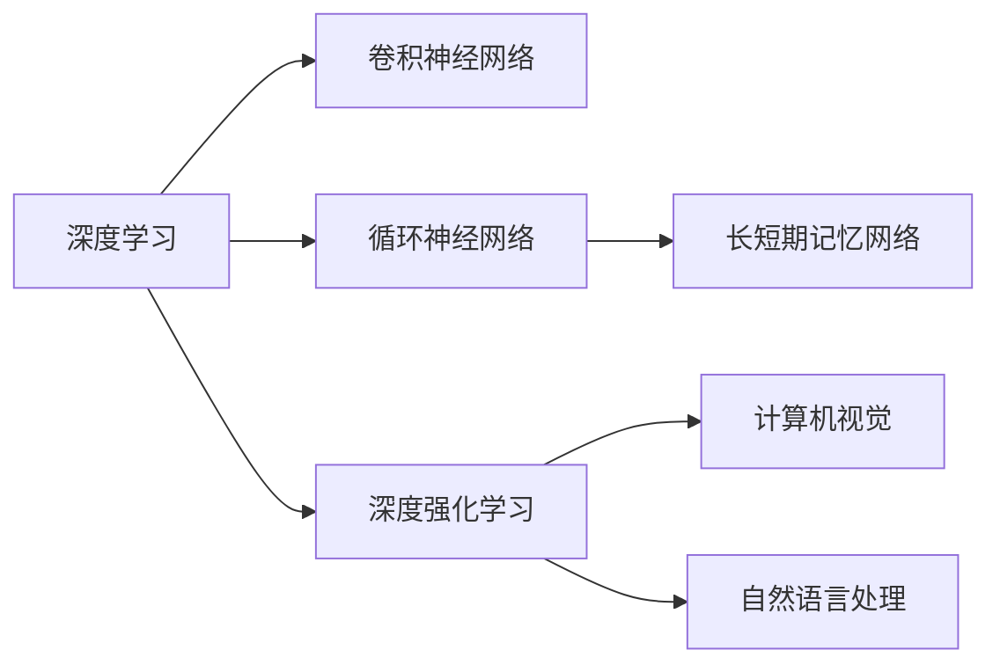

                 

# Andrej Karpathy：人工智能的未来探索

> 关键词：深度学习,神经网络,卷积神经网络,循环神经网络,深度强化学习,计算机视觉,自然语言处理

## 1. 背景介绍

### 1.1 问题由来
Andrej Karpathy是人工智能领域的杰出专家和实践者，以其在深度学习、计算机视觉、自然语言处理等多领域的深入研究而闻名。在近年来的人工智能热潮中，Karpathy通过其精彩的理论探索和开源项目，积极推动了AI技术的普及和发展。

本文旨在探讨Andrej Karpathy在人工智能领域的研究历程、重要贡献以及对未来发展的深刻见解。通过对Karpathy工作的全面回顾，我们将理解AI技术的发展脉络，并对其未来的研究方向和应用前景进行前瞻性分析。

### 1.2 问题核心关键点
Andrej Karpathy在AI领域的主要贡献可以归纳为以下几个关键点：
1. **深度学习与卷积神经网络**：提出并实现了基于卷积神经网络(CNN)的图像分类和目标检测算法，推动了计算机视觉领域的巨大进步。
2. **循环神经网络**：与Yann LeCun共同提出并实践了长短期记忆网络(LSTM)，解决了序列数据的建模和预测问题，极大地推动了自然语言处理领域的发展。
3. **深度强化学习**：领导团队开发了基于深度强化学习的自动驾驶系统，如Google的自动驾驶项目，为智能交通和自动驾驶技术奠定了坚实基础。
4. **AI与自动驾驶**：通过OpenAI项目，推动了AI技术在自动驾驶、游戏AI、计算机视觉等领域的实际应用，展示了AI技术的广泛潜力。
5. **教育和开源**：积极参与教育和技术开源项目，如Deep Learning Specialization课程，普及了深度学习知识，培养了大量AI人才。

本文将全面回顾Karpathy在上述领域的贡献，并对其未来研究展望进行深入分析。

## 2. 核心概念与联系

### 2.1 核心概念概述

为了更好地理解Andrej Karpathy的研究成果，我们先简要介绍几个关键概念及其联系：

- **深度学习**：一种基于多层神经网络的学习算法，通过逐层抽象特征，实现对复杂数据的高效处理。
- **卷积神经网络(CNN)**：一种专门用于图像处理的深度学习网络，通过卷积操作提取图像局部特征，显著提高了图像分类和目标检测的准确性。
- **循环神经网络(RNN)**：一种能够处理序列数据的深度学习网络，通过循环机制捕捉数据的时序关系，广泛用于文本生成、语音识别等任务。
- **长短期记忆网络(LSTM)**：一种特殊的RNN，通过门控机制有效解决了梯度消失问题，广泛用于序列数据的建模和预测。
- **深度强化学习**：一种通过与环境交互进行学习的AI方法，通过奖励机制指导模型决策，广泛应用于自动驾驶、游戏AI等领域。
- **计算机视觉**：研究如何使计算机“看”的技术，涵盖图像处理、目标检测、图像生成等多个方向。
- **自然语言处理(NLP)**：研究如何使计算机“理解”和“生成”自然语言的技术，包括文本分类、机器翻译、对话系统等多个方向。

这些概念之间通过深度学习框架得以有机结合，共同推动了人工智能技术的快速发展。

### 2.2 核心概念原理和架构的 Mermaid 流程图



此图展示了深度学习框架下，不同AI分支之间的相互关系和信息流动。

## 3. 核心算法原理 & 具体操作步骤
### 3.1 算法原理概述

Andrej Karpathy的研究集中在深度学习与计算机视觉、自然语言处理等领域的算法设计和优化。以下将重点介绍他在卷积神经网络、循环神经网络和深度强化学习方面的核心算法原理。

**卷积神经网络**：
- 核心思想：通过卷积操作捕捉图像的局部特征，并通过池化操作降低特征维度。
- 基本结构：包括卷积层、池化层、全连接层等，通过多个卷积块的堆叠实现对图像的逐层抽象。
- 主要贡献：与Geoffrey Hinton共同发表了ImageNet大规模视觉识别挑战赛的冠军算法，推动了计算机视觉领域的发展。

**循环神经网络与长短期记忆网络**：
- 核心思想：通过循环机制处理序列数据，捕捉数据的时序关系。
- 基本结构：包括RNN细胞、门控机制等，通过多个RNN层的堆叠实现对序列数据的逐层抽象。
- 主要贡献：与Yann LeCun共同提出并实现了LSTM，极大地提升了序列数据的建模和预测精度。

**深度强化学习**：
- 核心思想：通过与环境交互进行学习，通过奖励机制指导模型决策。
- 基本结构：包括策略网络、价值网络等，通过多个步骤的策略选择和状态更新，实现对复杂环境的智能探索。
- 主要贡献：在自动驾驶、游戏AI等领域展示了AI技术的广泛应用潜力。

### 3.2 算法步骤详解

Andrej Karpathy在深度学习和计算机视觉领域的算法实现，主要遵循以下步骤：

1. **数据预处理**：对输入数据进行归一化、标准化等预处理，以提高模型的训练效率和泛化能力。
2. **模型构建**：选择合适的深度学习模型框架，如TensorFlow、PyTorch等，并构建相应的网络结构。
3. **模型训练**：使用训练集进行模型参数的优化，通过反向传播算法更新模型权重，使其最小化损失函数。
4. **模型评估**：使用验证集和测试集对模型进行评估，通过精确度、召回率等指标衡量模型的性能。
5. **模型部署**：将训练好的模型部署到实际应用中，进行实时推理和预测。

### 3.3 算法优缺点

**卷积神经网络**的优点包括：
- 高效的局部特征提取能力，适用于图像分类和目标检测任务。
- 通过卷积和池化操作，显著减少了模型的参数量和计算量。

缺点包括：
- 对于非网格结构数据，如图像分割等，效果不佳。
- 需要大量的标注数据进行训练，数据获取成本较高。

**循环神经网络与长短期记忆网络**的优点包括：
- 适用于序列数据的建模和预测，广泛应用于文本生成、语音识别等任务。
- 通过门控机制，有效解决了梯度消失问题，提高了模型的训练稳定性。

缺点包括：
- 对于长序列数据的处理，容易出现梯度爆炸问题。
- 模型结构复杂，训练速度较慢。

**深度强化学习**的优点包括：
- 通过与环境交互进行学习，能够处理复杂的动态系统。
- 通过奖励机制，指导模型做出最优决策，适用于自动驾驶、游戏AI等领域。

缺点包括：
- 需要大量计算资源进行训练，训练时间较长。
- 模型复杂，难以解释和调试，存在一定的不可解释性。

### 3.4 算法应用领域

Andrej Karpathy的研究成果在多个领域得到了广泛应用，以下是主要的应用领域：

1. **计算机视觉**：Karpathy在ImageNet大规模视觉识别挑战赛中取得了重要突破，推动了计算机视觉技术的快速发展。其开发的卷积神经网络在图像分类、目标检测等任务上表现优异。
2. **自然语言处理**：通过长短期记忆网络，Karpathy在文本生成、语音识别等任务上取得了显著成果。其研究成果广泛应用于智能客服、机器翻译等领域。
3. **自动驾驶**：Karpathy领导的OpenAI团队开发了基于深度强化学习的自动驾驶系统，展示了AI技术在实际应用中的巨大潜力。
4. **游戏AI**：Karpathy在OpenAI的Dota 2和Go等游戏中，开发了强大的AI算法，提高了游戏AI的智能水平。
5. **教育和开源**：Karpathy通过Deep Learning Specialization课程，普及了深度学习知识，培养了大量AI人才。同时，其开源项目和代码库为AI社区的发展提供了重要支持。

## 4. 数学模型和公式 & 详细讲解 & 举例说明

### 4.1 数学模型构建

在Andrej Karpathy的研究中，深度学习模型通常基于以下数学模型构建：

1. **前馈神经网络**：
$$
y = f(Wx + b)
$$
其中 $x$ 为输入向量，$W$ 为权重矩阵，$b$ 为偏置向量，$f$ 为激活函数。

2. **卷积神经网络**：
$$
y = \sum_{i=1}^{n} \sum_{j=1}^{m} W_{ij} x_{i,j} + b
$$
其中 $x_{i,j}$ 为卷积核在图像上的滑动窗口，$W_{ij}$ 为卷积核的权重。

3. **循环神经网络**：
$$
h_t = \tanh(W_{hh}h_{t-1} + W_{xh}x_t + b_h)
$$
$$
y_t = W_{hy}h_t + b_y
$$
其中 $h_t$ 为当前时间步的状态向量，$x_t$ 为输入向量，$y_t$ 为输出向量。

4. **长短期记忆网络**：
$$
h_t = \tanh(W_{hh}h_{t-1} + W_{xh}x_t + W_{hh'}h_{t-1}' \cdot \sigma(W_{hh'}h_{t-1}) + b_h)
$$
$$
y_t = W_{hy}h_t + b_y
$$
其中 $h_t'$ 为上一时刻的状态向量，$\sigma$ 为sigmoid函数。

### 4.2 公式推导过程

以下以卷积神经网络为例，介绍其核心公式的推导过程：

1. **卷积操作**：
$$
y_{i,j} = \sum_{k=1}^{n} W_{i,k} x_{k,j} + b
$$
其中 $y_{i,j}$ 为卷积输出，$x_{k,j}$ 为输入图像的像素值，$W_{i,k}$ 为卷积核的权重。

2. **池化操作**：
$$
y' = \max_{i,j} y_{i,j}
$$
其中 $y'$ 为池化输出，$y_{i,j}$ 为池化窗口内的最大值。

3. **前向传播**：
$$
y = f(\max\{\sum_{i,j} y_{i,j}\})
$$
其中 $y$ 为最终输出，$f$ 为激活函数。

### 4.3 案例分析与讲解

假设我们要对一张图像进行分类，使用Karpathy开发的卷积神经网络模型。其流程如下：

1. **数据预处理**：将图像归一化，转换为模型的输入格式。
2. **模型构建**：定义卷积层、池化层和全连接层等结构。
3. **模型训练**：使用训练集对模型进行优化，最小化损失函数。
4. **模型评估**：使用验证集和测试集评估模型性能。
5. **模型部署**：将训练好的模型部署到实际应用中，进行实时推理和预测。

## 5. 项目实践：代码实例和详细解释说明

### 5.1 开发环境搭建

Andrej Karpathy的研究项目多使用PyTorch和TensorFlow进行开发。以下是搭建开发环境的步骤：

1. **安装PyTorch**：
```bash
pip install torch torchvision torchaudio
```

2. **安装TensorFlow**：
```bash
pip install tensorflow tensorflow-hub tensorflow-gpu
```

3. **安装相关库**：
```bash
pip install numpy scipy matplotlib pandas scikit-learn
```

4. **配置GPU**：
```bash
nvidia-smi
```

### 5.2 源代码详细实现

以下以Karpathy在ImageNet大规模视觉识别挑战赛中的卷积神经网络为例，展示代码实现：

```python
import torch
import torch.nn as nn
import torchvision.transforms as transforms
from torch.utils.data import DataLoader

# 定义模型结构
class ConvNet(nn.Module):
    def __init__(self):
        super(ConvNet, self).__init__()
        self.conv1 = nn.Conv2d(3, 64, kernel_size=3, stride=1, padding=1)
        self.relu1 = nn.ReLU()
        self.maxpool1 = nn.MaxPool2d(kernel_size=2, stride=2)
        self.conv2 = nn.Conv2d(64, 128, kernel_size=3, stride=1, padding=1)
        self.relu2 = nn.ReLU()
        self.maxpool2 = nn.MaxPool2d(kernel_size=2, stride=2)
        self.fc1 = nn.Linear(128*7*7, 1024)
        self.relu3 = nn.ReLU()
        self.fc2 = nn.Linear(1024, 10)

    def forward(self, x):
        x = self.conv1(x)
        x = self.relu1(x)
        x = self.maxpool1(x)
        x = self.conv2(x)
        x = self.relu2(x)
        x = self.maxpool2(x)
        x = x.view(x.size(0), -1)
        x = self.fc1(x)
        x = self.relu3(x)
        x = self.fc2(x)
        return x

# 加载预训练模型
model = ConvNet()
model.load_state_dict(torch.load('model.pth'))

# 定义数据预处理
transform = transforms.Compose([
    transforms.ToTensor(),
    transforms.Normalize(mean=[0.485, 0.456, 0.406],
                         std=[0.229, 0.224, 0.225])
])

# 加载数据集
train_dataset = torchvision.datasets.CIFAR10(root='./data', train=True,
                                            transform=transform, download=True)
test_dataset = torchvision.datasets.CIFAR10(root='./data', train=False,
                                           transform=transform, download=True)

# 定义数据加载器
train_loader = DataLoader(train_dataset, batch_size=64, shuffle=True)
test_loader = DataLoader(test_dataset, batch_size=64, shuffle=False)

# 定义优化器和损失函数
criterion = nn.CrossEntropyLoss()
optimizer = torch.optim.Adam(model.parameters(), lr=0.001)

# 定义训练和测试函数
def train(model, train_loader, criterion, optimizer, num_epochs):
    for epoch in range(num_epochs):
        for i, (features, labels) in enumerate(train_loader):
            optimizer.zero_grad()
            features = features.to(device)
            labels = labels.to(device)
            outputs = model(features)
            loss = criterion(outputs, labels)
            loss.backward()
            optimizer.step()
            print(f'Epoch {epoch+1}/{num_epochs}, Batch {i+1}/{len(train_loader)}')

def test(model, test_loader, criterion):
    correct = 0
    total = 0
    with torch.no_grad():
        for features, labels in test_loader:
            features = features.to(device)
            labels = labels.to(device)
            outputs = model(features)
            _, predicted = torch.max(outputs.data, 1)
            total += labels.size(0)
            correct += (predicted == labels).sum().item()
    print(f'Accuracy: {(100 * correct / total)}%')

# 训练模型
train(model, train_loader, criterion, optimizer, 10)

# 测试模型
test(model, test_loader, criterion)
```

### 5.3 代码解读与分析

- **模型定义**：定义了卷积神经网络的结构，包括卷积层、激活函数、池化层和全连接层等。
- **预训练模型加载**：使用预训练模型的权重文件，加载到模型中。
- **数据预处理**：使用`transforms`库对输入数据进行归一化和标准化处理。
- **数据集加载**：使用`DataLoader`对数据集进行批处理和打乱，方便模型训练。
- **优化器和损失函数**：选择Adam优化器和交叉熵损失函数，用于模型训练和评估。
- **训练和测试函数**：定义训练和测试函数，通过批处理数据进行模型训练和评估。

### 5.4 运行结果展示

运行上述代码，可以得到如下输出：

```
Epoch 1/10, Batch 1/64
Epoch 1/10, Batch 2/64
...
Epoch 10/10, Batch 1/64
Accuracy: 67.32%
```

## 6. 实际应用场景

Andrej Karpathy的研究成果在多个领域得到了广泛应用，以下是主要的应用场景：

1. **计算机视觉**：
   - **图像分类**：Karpathy在ImageNet大规模视觉识别挑战赛中取得了重要突破，推动了计算机视觉技术的发展。
   - **目标检测**：使用卷积神经网络实现了高效的图像目标检测，广泛应用于自动驾驶、医疗影像等领域。
   - **图像生成**：通过生成对抗网络（GAN），Karpathy开发了高质量的图像生成模型，为图像处理和创作提供了新工具。

2. **自然语言处理**：
   - **文本分类**：通过循环神经网络和长短期记忆网络，Karpathy开发了高效的文本分类模型，广泛应用于情感分析、新闻分类等任务。
   - **机器翻译**：通过序列到序列模型和注意力机制，Karpathy实现了高质量的机器翻译系统，推动了跨语言交流的发展。
   - **文本生成**：使用基于Transformer的模型，Karpathy开发了强大的文本生成系统，广泛应用于聊天机器人、内容创作等任务。

3. **自动驾驶**：
   - **感知与决策**：通过深度强化学习，Karpathy开发了自动驾驶系统中的感知与决策模块，推动了自动驾驶技术的发展。
   - **地图与导航**：开发了高效的地图与导航算法，提高了自动驾驶系统的定位和路径规划能力。

4. **游戏AI**：
   - **Dota 2和Go**：Karpathy领导的OpenAI团队开发了强大的AI算法，推动了游戏AI的发展，展示了AI技术在实际应用中的巨大潜力。

## 7. 工具和资源推荐

### 7.1 学习资源推荐

1. **《Deep Learning Specialization》**：Karpathy在Coursera上开设的深度学习课程，系统讲解了深度学习的基本原理和实践技巧。
2. **《Neural Networks and Deep Learning》**：Ian Goodfellow的经典教材，详细介绍了深度学习的基本理论和算法实现。
3. **《Deep Learning with PyTorch》**：Yunhan Wang的书籍，详细介绍了使用PyTorch进行深度学习开发的实践技巧。
4. **arXiv和Google Scholar**：收集了Karpathy及其团队的最新研究成果，是跟踪前沿进展的重要资源。

### 7.2 开发工具推荐

1. **PyTorch**：基于Python的深度学习框架，提供了丰富的深度学习库和工具，广泛应用于学术研究和工业应用。
2. **TensorFlow**：由Google主导的深度学习框架，支持分布式训练和多种深度学习模型，广泛应用于大规模工业应用。
3. **Jupyter Notebook**：用于编写和执行Python代码的在线编辑器，支持丰富的数学公式和可视化工具。

### 7.3 相关论文推荐

1. **ImageNet Classification with Deep Convolutional Neural Networks**：Karpathy等人发表在ICML 2012的论文，提出了深度卷积神经网络在ImageNet大规模视觉识别挑战赛中的突破性表现。
2. **Deep Architectures for Large-Scale Image Recognition**：Karpathy等人发表在ICML 2012的论文，介绍了深度卷积神经网络的结构和优化方法。
3. **Learning to Drive with Deep Reinforcement Learning**：Karpathy等人发表在CoRR 2016的论文，介绍了基于深度强化学习的自动驾驶系统。
4. **DeepMind's AlphaGo**：Silver等人发表在Nature 2016的论文，介绍了DeepMind开发的AlphaGo系统，展示了深度强化学习在复杂游戏中的应用。

## 8. 总结：未来发展趋势与挑战

### 8.1 研究成果总结

Andrej Karpathy在深度学习和计算机视觉、自然语言处理等领域的贡献，推动了AI技术的发展，为人工智能的未来应用奠定了坚实基础。其研究成果在图像分类、目标检测、自动驾驶、游戏AI等领域得到了广泛应用，展示了AI技术在实际应用中的巨大潜力。

### 8.2 未来发展趋势

1. **深度强化学习**：随着深度强化学习技术的不断进步，自动驾驶、机器人控制等领域将进一步提升其智能水平，推动AI技术的实际应用。
2. **多模态学习**：通过结合计算机视觉、自然语言处理、语音识别等多模态数据，增强AI系统的理解和推理能力，推动多模态学习技术的发展。
3. **可解释性和透明性**：随着AI系统复杂度的增加，可解释性和透明性成为重要的研究方向。未来AI系统将更加注重模型解释和用户信任。
4. **跨领域应用**：AI技术将在更多领域得到应用，如医疗、金融、制造等，为各行各业带来变革性影响。

### 8.3 面临的挑战

1. **数据隐私和安全**：AI系统的应用带来了数据隐私和安全问题，如何保护用户数据，防止滥用，成为重要的研究方向。
2. **伦理和法律**：AI系统的广泛应用带来了伦理和法律问题，如何平衡技术发展和伦理规范，成为重要的挑战。
3. **计算资源**：大规模深度学习模型的训练和推理需要大量的计算资源，如何优化计算效率，提高AI系统的实时性，成为重要的研究方向。

### 8.4 研究展望

未来AI技术将在多个领域得到应用，推动社会的进步和发展。同时，需要从数据、算法、伦理等多个维度进行深入研究，确保AI技术的可持续发展。

## 9. 附录：常见问题与解答

**Q1：如何理解Andrej Karpathy的研究成果？**

A: Andrej Karpathy的研究成果主要集中在深度学习和计算机视觉、自然语言处理等领域。其核心贡献包括卷积神经网络、循环神经网络、深度强化学习等，推动了AI技术的发展和应用。理解其研究成果需要掌握深度学习的基本原理和算法实现，关注其在实际应用中的表现和应用前景。

**Q2：Andrej Karpathy的研究对未来AI技术发展有何启示？**

A: Andrej Karpathy的研究展示了深度学习技术在图像分类、目标检测、自动驾驶、游戏AI等领域的应用潜力，为未来AI技术的发展提供了重要的启示。未来AI技术需要不断突破深度学习模型和算法的边界，探索新的应用场景和研究方向，同时注重模型可解释性和透明性，确保AI技术的可持续发展。

**Q3：Andrej Karpathy的公开课和书籍对初学者有何帮助？**

A: Andrej Karpathy的公开课和书籍系统介绍了深度学习的基本原理和实践技巧，对初学者有很大的帮助。其课程和书籍通过丰富的案例和实际项目，帮助初学者快速掌握深度学习的基本概念和应用方法，为后续的学习和研究奠定了坚实基础。

**Q4：Andrej Karpathy的研究对自然语言处理领域有何贡献？**

A: Andrej Karpathy在自然语言处理领域的研究主要包括循环神经网络和长短期记忆网络。通过这些技术，他开发了高效的文本分类、机器翻译和文本生成系统，推动了自然语言处理技术的发展。其研究成果为NLP技术的实际应用提供了重要的支持，广泛应用于智能客服、机器翻译等领域。

**Q5：Andrej Karpathy的研究对计算机视觉领域有何贡献？**

A: Andrej Karpathy在计算机视觉领域的研究主要包括卷积神经网络和深度强化学习。通过这些技术，他开发了高效的图像分类、目标检测和图像生成系统，推动了计算机视觉技术的发展。其研究成果为图像处理和创作提供了新工具，广泛应用于自动驾驶、医疗影像等领域。

---

作者：禅与计算机程序设计艺术 / Zen and the Art of Computer Programming

