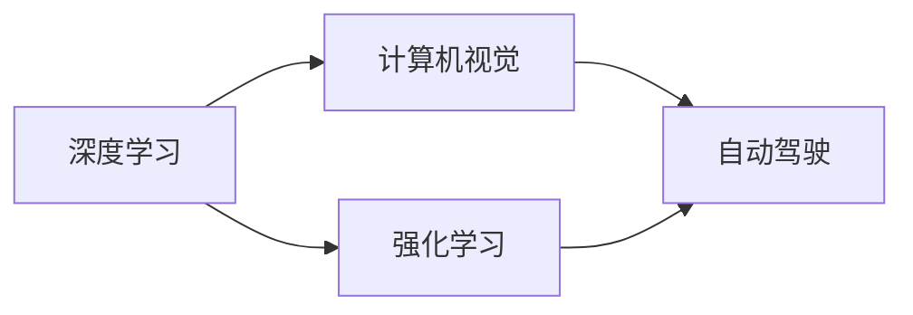

                 

# Andrej Karpathy：人工智能的未来趋势

> 关键词：人工智能,深度学习,神经网络,计算机视觉,自动驾驶,强化学习

## 1. 背景介绍

Andrej Karpathy，是斯坦福大学计算机科学教授，人工智能领域知名学者，深度学习领域的先驱之一。他的研究成果在计算机视觉、自动驾驶、强化学习等多个领域具有重要影响。Karpathy在社交媒体上的活跃表现，使他成为人工智能领域的知名“意见领袖”，其思想和洞见对广大AI从业者和爱好者产生了深远影响。

本文通过梳理Andrej Karpathy在公开场合演讲和文章的精彩内容，提炼其对人工智能未来趋势的见解，希望能为读者提供有益的启示和思考。

## 2. 核心概念与联系

### 2.1 核心概念概述

Andrej Karpathy对人工智能的看法主要体现在几个核心概念上：

- **深度学习**：一种模仿人类大脑神经网络结构，通过多层次神经网络进行自动特征提取与学习的技术。
- **计算机视觉**：使计算机“看懂”图像、视频等视觉数据的领域。Karpathy在这一领域有丰富的研究成果。
- **自动驾驶**：结合计算机视觉和强化学习，使汽车能够自主决策和导航，提高交通安全和效率。
- **强化学习**：通过与环境的交互，优化决策策略以最大化奖励。在自动驾驶、机器人等领域有重要应用。

这些核心概念构成了Karpathy对人工智能的总体框架，其中深度学习和强化学习是技术实现的核心，计算机视觉和自动驾驶是其应用的主要方向。

### 2.2 核心概念原理和架构的 Mermaid 流程图



此图展示了深度学习、计算机视觉、自动驾驶和强化学习之间的关系和交互：深度学习是技术基础，计算机视觉和自动驾驶是主要应用方向，而强化学习则是自动驾驶中的重要组成部分。

## 3. 核心算法原理 & 具体操作步骤

### 3.1 算法原理概述

Andrej Karpathy对人工智能的未来趋势，基于其对深度学习和强化学习的理解，做出了以下几方面的预判：

1. **神经网络结构的进一步优化**：未来的深度学习算法将更加关注模型结构的优化，包括更高效的网络结构设计、更智能的参数初始化方法等。

2. **强化学习在自动驾驶中的应用**：自动驾驶技术的突破，离不开强化学习。未来，强化学习将通过更加智能的奖励机制、更高效的学习算法，使自动驾驶汽车在复杂环境中更好地决策。

3. **计算机视觉的普及和提升**：计算机视觉技术将进一步深入应用，如家庭监控、智能安防、医疗影像分析等。同时，计算机视觉的精度和速度也将得到显著提升。

4. **跨学科整合**：未来的人工智能将不再局限于单一学科，而是通过跨学科整合，如结合生物、物理、化学等领域的知识，进一步提升人工智能的智能化水平。

### 3.2 算法步骤详解

以下是Karpathy对未来人工智能发展的详细步骤：

1. **神经网络结构优化**：开发更加高效的网络结构，如ResNet、Inception等，并探索新的网络设计方法，如超网络、动态网络等。

2. **强化学习算法创新**：研发更智能的强化学习算法，如Q-learning、Deep Q-learning、Actor-Critic等，通过改进奖励机制和更新策略，提升自动驾驶等领域的决策能力。

3. **计算机视觉应用拓展**：开发更快速、更准确的计算机视觉算法，如基于CNN的图像分类、检测、分割等，并将其应用到更多领域，如医学影像、智能监控等。

4. **跨学科整合研究**：结合生物学、物理学、化学等领域的知识，探索更加通用的智能模型，提升人工智能的整体智能化水平。

### 3.3 算法优缺点

Andrej Karpathy对未来人工智能的发展趋势，有着深刻而独到的见解。以下是他对算法优缺点的总结：

**优点**：
1. **高效性**：深度学习和强化学习算法通过自动特征提取和优化，能够高效处理大规模数据，解决复杂问题。
2. **普适性**：这些算法能够应用到多个领域，如计算机视觉、自动驾驶等，具有广泛的适用性。
3. **可扩展性**：随着硬件的发展，如GPU、TPU等，这些算法的计算能力将进一步提升，能够处理更加复杂和庞大的数据集。

**缺点**：
1. **数据需求大**：深度学习和强化学习对数据的需求量极大，数据获取和标注成本高，数据分布不均衡的问题尚未完全解决。
2. **模型复杂性高**：神经网络和强化学习模型的复杂性较高，解释性和可解释性不足，难以调试和优化。
3. **过拟合风险**：随着模型规模的增大，过拟合风险增加，需要更多正则化技术。

### 3.4 算法应用领域

Andrej Karpathy认为，深度学习和强化学习的应用领域将会进一步扩展，涵盖多个重要领域：

1. **计算机视觉**：广泛应用于图像分类、目标检测、语义分割等任务。
2. **自动驾驶**：使汽车能够自主决策和导航，提高交通安全和效率。
3. **机器人技术**：结合计算机视觉和强化学习，使机器人能够自主执行复杂任务。
4. **医疗影像分析**：提高医学影像的诊断精度，如病理分析、肿瘤检测等。
5. **自然语言处理**：通过深度学习技术，提升语言理解和生成的能力。

## 4. 数学模型和公式 & 详细讲解 & 举例说明

### 4.1 数学模型构建

Andrej Karpathy曾详细阐述过神经网络的数学模型，以下是一个简单的示例：

假设有一个三层的神经网络，输入为 $x$，输出为 $y$，参数为 $\theta$，激活函数为 $f(x)$。神经网络的数学模型可以表示为：

$$ y = \theta_1 f(\theta_2 f(\theta_3 x)) $$

其中 $\theta_1, \theta_2, \theta_3$ 为网络参数，$f(x)$ 为激活函数，如sigmoid、ReLU等。

### 4.2 公式推导过程

以神经网络的反向传播算法为例，公式推导如下：

1. 前向传播：
   $$ y = \theta_1 f(\theta_2 f(\theta_3 x)) $$

2. 反向传播：
   $$ \frac{\partial L}{\partial \theta} = \frac{\partial L}{\partial y} \frac{\partial y}{\partial \theta} $$
   $$ \frac{\partial L}{\partial \theta} = \frac{\partial L}{\partial y} \frac{\partial f(y)}{\partial y} \frac{\partial y}{\partial \theta_1} \frac{\partial \theta_1}{\partial y_1} \frac{\partial y_1}{\partial x} \frac{\partial x}{\partial \theta} $$

其中 $L$ 为损失函数，$\frac{\partial y}{\partial \theta}$ 为导数，$y_1 = f(\theta_2 f(\theta_3 x))$ 为前向传播的结果。

### 4.3 案例分析与讲解

Karpathy曾使用卷积神经网络（CNN）处理图像分类任务，以CIFAR-10数据集为例，以下是其算法实现的步骤：

1. 定义CNN模型结构，包括卷积层、池化层、全连接层等。
2. 加载CIFAR-10数据集，并预处理数据（如归一化、one-hot编码等）。
3. 使用交叉熵损失函数，计算模型在训练集上的损失，并反向传播更新模型参数。
4. 在验证集上评估模型性能，调整学习率等超参数。
5. 在测试集上测试模型性能，记录精度、召回率等指标。

## 5. 项目实践：代码实例和详细解释说明

### 5.1 开发环境搭建

以下是使用Python和PyTorch搭建神经网络模型的开发环境步骤：

1. 安装Anaconda：从官网下载并安装Anaconda，用于创建独立的Python环境。

2. 创建并激活虚拟环境：
   ```bash
   conda create -n pytorch-env python=3.8 
   conda activate pytorch-env
   ```

3. 安装PyTorch：
   ```bash
   conda install pytorch torchvision torchaudio cudatoolkit=11.1 -c pytorch -c conda-forge
   ```

4. 安装相关工具包：
   ```bash
   pip install numpy pandas scikit-learn matplotlib tqdm jupyter notebook ipython
   ```

### 5.2 源代码详细实现

以下是一个使用PyTorch实现神经网络模型的代码示例：

```python
import torch
import torch.nn as nn
import torch.optim as optim

# 定义神经网络模型
class Net(nn.Module):
    def __init__(self):
        super(Net, self).__init__()
        self.conv1 = nn.Conv2d(3, 6, 5)
        self.pool = nn.MaxPool2d(2, 2)
        self.conv2 = nn.Conv2d(6, 16, 5)
        self.fc1 = nn.Linear(16 * 5 * 5, 120)
        self.fc2 = nn.Linear(120, 84)
        self.fc3 = nn.Linear(84, 10)

    def forward(self, x):
        x = self.pool(F.relu(self.conv1(x)))
        x = self.pool(F.relu(self.conv2(x)))
        x = x.view(-1, 16 * 5 * 5)
        x = F.relu(self.fc1(x))
        x = F.relu(self.fc2(x))
        x = self.fc3(x)
        return x

# 加载数据集
train_data = torchvision.datasets.CIFAR10(root='./data', train=True, download=True)
test_data = torchvision.datasets.CIFAR10(root='./data', train=False, download=True)
train_loader = torch.utils.data.DataLoader(train_data, batch_size=4, shuffle=True)
test_loader = torch.utils.data.DataLoader(test_data, batch_size=4, shuffle=False)

# 定义模型、损失函数和优化器
model = Net()
criterion = nn.CrossEntropyLoss()
optimizer = optim.SGD(model.parameters(), lr=0.001, momentum=0.9)

# 训练模型
for epoch in range(2):
    running_loss = 0.0
    for i, data in enumerate(train_loader, 0):
        inputs, labels = data
        optimizer.zero_grad()
        outputs = model(inputs)
        loss = criterion(outputs, labels)
        loss.backward()
        optimizer.step()
        running_loss += loss.item()
        if i % 2000 == 1999:
            print('[%d, %5d] loss: %.3f' %
                  (epoch + 1, i + 1, running_loss / 2000))
            running_loss = 0.0
```

### 5.3 代码解读与分析

代码中，我们定义了一个简单的神经网络模型，使用CIFAR-10数据集进行训练和测试。以下是关键代码的详细解读：

**Net类**：定义了神经网络的结构，包括卷积层、池化层、全连接层等。

**train_loader和test_loader**：使用PyTorch的数据加载器，将数据集分成训练集和测试集，并进行批处理。

**model, criterion, optimizer**：定义了神经网络模型、交叉熵损失函数和随机梯度下降优化器。

**训练模型**：在每个epoch中，使用训练集进行前向传播和反向传播，更新模型参数。

## 6. 实际应用场景

### 6.1 计算机视觉

Andrej Karpathy认为，计算机视觉技术将进一步普及和提升，应用于更多领域，如智能安防、医疗影像分析、自动驾驶等。

1. **智能安防**：在家庭监控、公共场所监控等领域，使用计算机视觉技术识别异常行为，提高安全性和效率。
2. **医疗影像分析**：通过计算机视觉技术，快速分析医学影像，如X光片、CT等，提高诊断精度，减少误诊。
3. **自动驾驶**：结合计算机视觉和强化学习，使汽车能够自主导航，提升驾驶安全性和舒适性。

### 6.2 自动驾驶

Andrej Karpathy认为，自动驾驶技术的突破离不开深度学习和强化学习。未来，自动驾驶汽车将能够自主处理复杂道路情况，实现高效、安全的智能出行。

1. **感知**：使用计算机视觉技术，感知道路、交通标志、行人等，识别环境信息。
2. **决策**：结合强化学习算法，优化决策策略，使车辆在复杂道路环境中做出最优决策。
3. **执行**：通过控制算法，执行决策结果，调整车辆速度、方向等，实现自主驾驶。

### 6.3 机器人技术

Andrej Karpathy认为，机器人技术将结合计算机视觉和强化学习，实现更加灵活、智能的操作。

1. **环境感知**：使用计算机视觉技术，识别物体、场景，理解环境信息。
2. **任务执行**：结合强化学习算法，优化操作策略，执行复杂任务，如搬运、装配等。
3. **人机交互**：通过语音识别、自然语言处理等技术，实现与人类更好的交互。

## 7. 工具和资源推荐

### 7.1 学习资源推荐

以下是Andrej Karpathy推荐的学习资源：

1. **Deep Learning Specialization**：由Andrew Ng主讲的深度学习课程，涵盖神经网络、卷积神经网络、循环神经网络等内容。
2. **Computer Vision: Principles and Practice**：斯坦福大学开设的计算机视觉课程，讲解图像处理、目标检测、语义分割等知识。
3. **Hands-On Reinforcement Learning with Python**：关于强化学习的书籍，涵盖Q-learning、Deep Q-learning、Actor-Critic等内容。
4. **Deep Learning with PyTorch**：使用PyTorch实现深度学习的书籍，适合初学者和进阶者。
5. **AI Generation with Transformers**：介绍Transformer的书籍，讲解预训练语言模型和微调等内容。

### 7.2 开发工具推荐

以下是Andrej Karpathy推荐的使用工具：

1. **PyTorch**：基于Python的深度学习框架，灵活高效。
2. **TensorFlow**：由Google主导开发的深度学习框架，适合大规模工程应用。
3. **Weights & Biases**：模型训练的实验跟踪工具，记录和可视化模型训练过程。
4. **TensorBoard**：TensorFlow配套的可视化工具，实时监测模型训练状态。
5. **Google Colab**：免费的Jupyter Notebook环境，支持GPU/TPU计算资源。

### 7.3 相关论文推荐

以下是Andrej Karpathy推荐的相关论文：

1. **ImageNet Classification with Deep Convolutional Neural Networks**：Hinton等人提出的ImageNet分类模型，开创了卷积神经网络在计算机视觉中的应用。
2. **Liszt: Playing simple musical variations on a small model**：Karpathy等人使用神经网络生成音乐，展示了深度学习的艺术性。
3. **Neural Odometry**：Karpathy等人提出的基于深度学习的驾驶导航方法，提高了自动驾驶的精度和鲁棒性。
4. **SimpleStatues: A Simple Curriculum for Iterative Self-Training of Generative Models**：Karpathy等人提出的自训练模型方法，提高生成模型的效果。

## 8. 总结：未来发展趋势与挑战

### 8.1 总结

Andrej Karpathy对人工智能的未来趋势进行了详细阐述，认为深度学习和强化学习将进一步推动计算机视觉、自动驾驶、机器人等领域的发展。他强调了模型结构的优化、算法创新、跨学科整合等重要研究方向，并提出了相应的解决方案。

通过梳理Karpathy的思考，我们能够更深刻地理解人工智能的发展方向，明确未来研究的关键点，为人工智能技术的创新和应用提供有益的参考。

### 8.2 未来发展趋势

Andrej Karpathy认为，未来人工智能的发展趋势将包括以下几个方面：

1. **深度学习算法优化**：开发更加高效、普适的深度学习算法，解决大规模数据处理、复杂任务建模等问题。
2. **强化学习在实际应用中的应用**：强化学习在自动驾驶、机器人等领域将有更广泛的应用，提升决策能力和智能化水平。
3. **跨学科整合**：结合生物学、物理学、化学等领域的知识，探索更加通用的智能模型，提高人工智能的整体智能化水平。
4. **模型可解释性**：研究模型解释性问题，增强人工智能系统的可解释性和可审计性。
5. **人工智能伦理和安全性**：加强对人工智能伦理和安全性的研究，确保技术应用符合人类价值观和伦理道德。

### 8.3 面临的挑战

Andrej Karpathy对未来人工智能的发展面临的挑战进行了深入分析，包括以下几个方面：

1. **数据需求量大**：深度学习和强化学习对数据的需求量极大，数据获取和标注成本高。
2. **模型复杂性高**：神经网络和强化学习模型的复杂性较高，解释性和可解释性不足。
3. **过拟合风险**：随着模型规模的增大，过拟合风险增加。
4. **伦理和安全问题**：人工智能技术的伦理和安全问题日益凸显，需要加强研究。

### 8.4 研究展望

面对未来人工智能的挑战，Andrej Karpathy提出了以下研究展望：

1. **无监督学习和自监督学习**：探索无监督学习和自监督学习方法，降低对标注数据的依赖。
2. **模型压缩和优化**：研究模型压缩和优化方法，提升计算效率和模型性能。
3. **多模态融合**：探索多模态数据融合方法，提高人工智能系统的感知和理解能力。
4. **跨学科合作**：加强跨学科合作，推动人工智能技术在更多领域的应用。
5. **伦理和安全研究**：加强人工智能伦理和安全问题的研究，确保技术应用符合人类价值观和伦理道德。

## 9. 附录：常见问题与解答

**Q1: 神经网络的结构设计有哪些关键因素？**

A: 神经网络的结构设计包括多个关键因素，如层数、节点数、激活函数、正则化等。层数过多或节点过多可能导致过拟合，激活函数选择不当会影响模型性能，正则化方法可以防止过拟合。

**Q2: 神经网络的反向传播算法有哪些改进方法？**

A: 神经网络的反向传播算法可以通过多种改进方法提升性能，如梯度裁剪、动量优化、自适应学习率等。这些方法可以在保证训练效率的同时，提高模型的精度和鲁棒性。

**Q3: 如何评估神经网络的性能？**

A: 神经网络的性能可以通过多种指标进行评估，如精度、召回率、F1分数、ROC曲线等。不同任务和数据集可能需要不同的评估指标，需要根据具体情况进行选择。

**Q4: 强化学习在自动驾驶中的应用有哪些？**

A: 强化学习在自动驾驶中的应用包括环境感知、决策制定和任务执行。通过强化学习，自动驾驶汽车可以感知道路环境，制定最优驾驶策略，执行复杂驾驶任务。

**Q5: 计算机视觉在自动驾驶中的应用有哪些？**

A: 计算机视觉在自动驾驶中的应用包括道路感知、交通标志识别、行人检测等。通过计算机视觉技术，自动驾驶汽车可以理解道路环境和交通规则，做出最优驾驶决策。

---

作者：禅与计算机程序设计艺术 / Zen and the Art of Computer Programming

