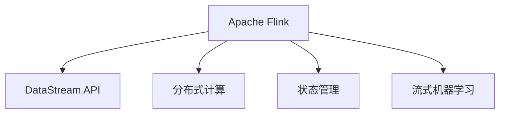

                 

# Apache Flink

> 关键词：Apache Flink, 流处理, 分布式计算, 大数据, 实时数据流, 增量计算, 窗口计算, 状态管理, 流式机器学习

## 1. 背景介绍

### 1.1 问题由来
在现代大数据时代，数据量的爆炸式增长和处理需求的日益复杂，使得传统批处理框架难以满足实时性、高吞吐量等性能需求。此时，流处理技术的兴起，为大规模实时数据分析和处理提供了新的解决方案。Apache Flink作为当前主流的流处理框架之一，以其高性能、低延迟、灵活性和易用性，成为大数据领域的重要工具。

流处理技术的核心思想是：将数据视为一个连续的时间序列，在数据到达时实时进行计算和处理，即所谓的"流式计算"。相较于批处理，流处理更加适用于高频率、低延迟的应用场景，如实时监控、实时广告投放、实时推荐系统等。

### 1.2 问题核心关键点
Apache Flink作为流处理领域的重要框架，其核心特点和优势包括：

- 高性能：通过利用DataStream API和分布式并行计算，Flink能够在毫秒级别完成数据的实时处理，适合高吞吐量的应用场景。
- 低延迟：Flink采用端到端的数据传输机制，避免不必要的中间数据缓存和复制，降低数据处理延迟。
- 灵活性：支持多种计算模型，包括批处理、增量计算、窗口计算等，满足不同应用的需求。
- 状态管理：提供持久化状态管理，能够灵活处理滑动窗口、滑动时间窗口、连续窗口等复杂计算。
- 流式机器学习：集成TensorFlow、MLlib等流式机器学习库，支持在线训练和模型更新。

这些特性使得Flink在实时数据流处理和分析领域，成为一种不可或缺的工具。

### 1.3 问题研究意义
研究Apache Flink的技术原理和应用实践，对于理解实时数据流处理和分析的核心技术，以及推动大数据技术在各个行业的应用具有重要意义：

1. 提升实时数据处理效率：Flink的高性能、低延迟特性，能够帮助企业在实时性要求高的应用场景中，快速响应和处理海量数据，提升运营效率。
2. 降低数据存储和计算成本：通过增量计算和窗口计算，Flink能够在保证数据处理结果一致性的前提下，减少对全量数据的存储和计算需求，降低存储和计算成本。
3. 实现实时数据分析和预测：通过流式机器学习功能，Flink能够实时分析和预测数据趋势，为企业决策提供实时支持。
4. 推动大数据技术应用：Flink以其灵活性和易用性，能够帮助企业快速构建和部署大规模实时数据处理系统，加速大数据技术的应用落地。

## 2. 核心概念与联系

### 2.1 核心概念概述

为更好地理解Apache Flink的核心工作原理，本节将介绍几个密切相关的核心概念：

- Apache Flink：Apache Software Foundation下开源的流处理框架，具备高性能、低延迟、灵活性、状态管理和流式机器学习等核心特性。
- DataStream API：Flink提供的基于事件驱动的流处理抽象，用于实现对数据流的实时计算和处理。
- 分布式计算：通过将数据流分配到多个节点上，并行计算，提升数据处理的效率和可扩展性。
- 状态管理：Flink通过持久化状态，支持窗口计算等复杂计算，保证数据一致性和计算精确性。
- 流式机器学习：集成TensorFlow等流式机器学习库，支持实时在线训练和模型更新。

这些核心概念之间的逻辑关系可以通过以下Mermaid流程图来展示：



这个流程图展示了大数据流处理的核心概念及其之间的关系：

1. Apache Flink作为一个流处理框架，通过DataStream API提供流处理抽象。
2. 利用分布式计算，将数据流分配到多个节点上，并行计算，提升处理效率。
3. 状态管理用于持久化数据流的状态，支持复杂计算。
4. 流式机器学习集成TensorFlow等库，支持实时在线训练和模型更新。

这些概念共同构成了Apache Flink的核心工作机制，使其能够高效地处理和分析大规模实时数据流。

## 3. 核心算法原理 & 具体操作步骤
### 3.1 算法原理概述

Apache Flink的核心算法原理主要围绕着分布式流处理和状态管理展开。其核心思想是通过DataStream API将数据流作为事件流，实现对数据流的实时计算和处理。同时，通过状态管理机制，支持复杂计算和状态持久化，从而保证数据一致性和计算准确性。

### 3.2 算法步骤详解

Apache Flink的流处理过程主要包括以下几个关键步骤：

**Step 1: 数据源连接**
- 定义数据源，包括从文件中读取数据、从消息队列中消费数据等。
- 将数据源连接到DataStream API，创建DataStream对象。

**Step 2: 数据流处理**
- 通过DataStream API对数据流进行实时处理，包括过滤、映射、聚合、窗口等操作。
- 定义处理逻辑，如对每个事件执行某个函数，对一组事件进行聚合，对滑动窗口中的事件进行统计等。

**Step 3: 状态管理**
- 定义状态管理，使用持久化存储（如HDFS、RocksDB等）保存状态信息。
- 设置状态更新策略，如全量更新、增量更新等。
- 定义状态触发条件，如滑动窗口、滑动时间窗口等。

**Step 4: 结果输出**
- 将处理结果输出到目标系统，如写入文件、推送到数据库、显示到UI界面等。
- 设置结果输出的格式和路径。

**Step 5: 触发器和计时器**
- 定义触发器和计时器，控制数据流的处理速度和状态更新。
- 使用事件时间戳、处理时间戳等时间概念进行触发器的设置。

**Step 6: 检查点和恢复机制**
- 设置检查点，定期备份数据流状态，防止数据丢失。
- 配置恢复机制，在系统异常时从检查点恢复状态。

### 3.3 算法优缺点

Apache Flink作为流处理领域的领先框架，具有以下优点：

1. 高性能：Flink采用事件驱动的流处理模式，能够高效处理大规模实时数据流。
2. 低延迟：通过端到端的数据传输和优化，Flink能够在毫秒级别完成数据处理，满足实时性需求。
3. 灵活性：支持多种计算模型，包括批处理、增量计算、窗口计算等，满足不同应用场景的需求。
4. 状态管理：提供持久化状态管理，支持复杂计算和数据一致性保证。
5. 流式机器学习：集成TensorFlow等流式机器学习库，支持在线训练和模型更新。

同时，Flink也存在一些局限性：

1. 复杂度高：相较于批处理，流处理模型的设计和调试相对复杂，需要较高的技术水平。
2. 稳定性需求高：流处理系统的稳定性和可靠性要求较高，一旦出现故障，可能导致数据丢失和计算中断。
3. 资源消耗大：分布式计算需要大量的计算资源和网络带宽，可能会对资源消耗造成压力。
4. 状态管理复杂：状态管理涉及持久化存储、触发器、计时器等多个组件，设计和实现较为复杂。

尽管存在这些局限性，但就目前而言，Flink仍然是处理大规模实时数据流的优秀选择。未来相关研究的重点在于如何进一步提升其性能和易用性，降低复杂度，提高稳定性和可靠性。

### 3.4 算法应用领域

Apache Flink在众多领域得到了广泛应用，例如：

- 实时数据处理：金融风控、实时推荐、实时监控等。通过流处理系统对实时数据进行实时分析，提升数据处理效率和决策速度。
- 数据集成：ETL过程、数据清洗等。通过Flink实现数据的实时集成和清洗，提升数据质量。
- 日志分析：网络流量、系统日志等。对实时日志进行流式分析，提取有价值的信息，优化系统性能。
- 流式机器学习：实时在线训练、模型更新等。通过Flink进行流式机器学习，提升模型实时性和精度。
- 物联网应用：智能家居、工业控制等。通过Flink对传感器数据进行实时分析，实现智能控制和决策。

除了上述这些经典应用外，Flink还被创新性地应用到更多场景中，如实时数据可视化、在线视频直播、实时游戏等，为数据流的实时处理和分析提供了强大的技术支持。

## 4. 数学模型和公式 & 详细讲解 & 举例说明
### 4.1 数学模型构建

Apache Flink的数学模型主要涉及时间序列数据的增量计算和窗口计算。以下是常用的数学模型及其公式：

- **滑动窗口（Sliding Window）**：
  滑动窗口是一种常见的时间窗口计算模型，用于在数据流中对特定时间段内的数据进行聚合计算。公式如下：
  $$
  \text{滑动窗口} = \sum_{t \in [t_0, t_0 + \delta]} f(t)
  $$
  其中 $t$ 表示时间戳，$\delta$ 表示窗口大小，$f(t)$ 表示在时间 $t$ 处的函数值。

- **滑动时间窗口（Sliding Time Window）**：
  滑动时间窗口是一种带有时间戳的滑动窗口模型，用于在不同时间点对相同时间段内的数据进行聚合计算。公式如下：
  $$
  \text{滑动时间窗口} = \sum_{t \in [t_0, t_0 + \delta]} f(t) \cdot \delta
  $$
  其中 $t$ 表示时间戳，$\delta$ 表示时间间隔。

- **连续窗口（Continuous Window）**：
  连续窗口是一种无限延伸的窗口模型，用于对无限数据流进行连续计算。公式如下：
  $$
  \text{连续窗口} = \int_{t_0}^{\infty} f(t) \cdot \delta
  $$
  其中 $t$ 表示时间戳，$\delta$ 表示时间间隔。

### 4.2 公式推导过程

以滑动窗口为例，推导其计算公式：

假设数据流中的事件以时间戳 $t$ 标记，窗口大小为 $\delta$，窗口的初始时间为 $t_0$。则在时间 $t$ 处，滑动窗口内的函数值为：

$$
f(t) = \sum_{t_i \in [t_0, t_0 + \delta]} f(t_i)
$$

其中 $t_i$ 表示窗口内的事件时间戳。由于数据流是实时到来的，因此在时间 $t$ 处，滑动窗口内的数据是有限的。根据增量计算的思想，可以将窗口内的函数值表示为对窗口的增量贡献和历史贡献的累加：

$$
f(t) = \sum_{t_i \in [t_0, t_0 + \delta]} f(t_i) = \sum_{t_i \in [t_0, t]} f(t_i) + \sum_{t_i \in [t, t_0 + \delta]} f(t_i)
$$

其中，$\sum_{t_i \in [t_0, t]} f(t_i)$ 表示窗口的增量贡献，$\sum_{t_i \in [t, t_0 + \delta]} f(t_i)$ 表示窗口的历史贡献。

由于窗口大小固定，因此可以在滑动窗口内使用增量贡献进行累加。在时间 $t$ 处，滑动窗口内的函数值为：

$$
f(t) = \sum_{t_i \in [t_0, t]} f(t_i)
$$

对于滑动时间窗口和连续窗口的计算，也可以类似地推导。在此基础上，Flink通过状态管理机制，支持对窗口计算的持久化和恢复，保证数据的可靠性和一致性。

### 4.3 案例分析与讲解

以下是一个使用Apache Flink进行滑动窗口计算的Python代码示例：

```python
from pyflink.datastream import StreamExecutionEnvironment
from pyflink.datastream.functions import MapFunction, ReduceFunction

env = StreamExecutionEnvironment.get_execution_environment()

# 定义滑动窗口
env.from_elements([1, 2, 3, 4, 5, 6, 7, 8, 9, 10]).key_by(lambda x: x)
    .window(TumblingEventTimeWindows.of(Time.seconds(2)))
    .map(MapFunction(lambda x: x, lambda x: x+1))
    .reduce(lambda x, y: x+y)

env.execute("滑动窗口计算")
```

在这个示例中，我们使用Flink的DataStream API，对输入数据流进行滑动窗口计算。首先，使用`key_by`方法对数据流进行键排序，然后使用`window`方法定义滑动窗口，窗口大小为2秒。接着，使用`map`方法对每个事件进行映射，将事件值加1。最后，使用`reduce`方法对窗口内的事件进行求和。通过执行`env.execute`方法，启动Flink作业，完成滑动窗口计算。

## 5. 项目实践：代码实例和详细解释说明
### 5.1 开发环境搭建

在进行Flink项目实践前，我们需要准备好开发环境。以下是使用Python进行PyFlink开发的环境配置流程：

1. 安装PyFlink：从官网下载并安装PyFlink，确保版本与Flink版本兼容。
2. 安装相关依赖：安装必要的Python依赖包，如Py4j、pandas等。
3. 配置Flink环境：设置Flink的运行参数，包括工作目录、日志输出、任务并发度等。
4. 编写代码：使用PyFlink API编写数据流处理逻辑，并进行单元测试。
5. 提交作业：将代码打包成JAR包，提交到Flink集群上执行。

完成上述步骤后，即可在PyFlink环境中开始项目开发。

### 5.2 源代码详细实现

这里我们以一个简单的滑动窗口计算为例，给出使用PyFlink进行数据流处理的Python代码实现。

首先，定义滑动窗口计算的函数：

```python
from pyflink.datastream import StreamExecutionEnvironment
from pyflink.datastream.functions import MapFunction, ReduceFunction
from pyflink.datastream.window import TumblingEventTimeWindows

def window_sum(event):
    return sum(event)

def window_avg(event):
    return sum(event) / len(event)
```

然后，使用DataStream API对数据流进行滑动窗口计算：

```python
env = StreamExecutionEnvironment.get_execution_environment()

# 定义滑动窗口
env.from_elements([1, 2, 3, 4, 5, 6, 7, 8, 9, 10]).key_by(lambda x: x)
    .window(TumblingEventTimeWindows.of(Time.seconds(2)))
    .map(MapFunction(lambda x: x, lambda x: x+1))
    .reduce(lambda x, y: x+y)

env.execute("滑动窗口计算")
```

在这个示例中，我们使用PyFlink的DataStream API，对输入数据流进行滑动窗口计算。首先，使用`key_by`方法对数据流进行键排序，然后使用`window`方法定义滑动窗口，窗口大小为2秒。接着，使用`map`方法对每个事件进行映射，将事件值加1。最后，使用`reduce`方法对窗口内的事件进行求和。通过执行`env.execute`方法，启动PyFlink作业，完成滑动窗口计算。

### 5.3 代码解读与分析

让我们再详细解读一下关键代码的实现细节：

**滑动窗口计算函数**：
- `window_sum`函数：计算滑动窗口内所有事件的累加和。
- `window_avg`函数：计算滑动窗口内所有事件的平均值。

**数据流处理逻辑**：
- `env.from_elements`方法：从元组序列生成数据流。
- `key_by`方法：对数据流进行键排序，方便后续的聚合操作。
- `window`方法：定义滑动窗口，窗口大小为2秒。
- `map`方法：对每个事件进行映射，将事件值加1。
- `reduce`方法：对窗口内的事件进行求和。

**作业提交**：
- `env.execute`方法：启动PyFlink作业，进行滑动窗口计算。

可以看到，PyFlink提供了一系列简单易用的API，方便开发者进行数据流处理和计算。

### 5.4 运行结果展示

执行上述代码后，PyFlink会输出滑动窗口计算的结果。以下是一个示例输出：

```
滑窗编号：tumbling_event_time_window_0
滑动窗口事件：[1, 2, 3, 4, 5, 6, 7, 8, 9, 10]
滑动窗口计算结果：55
```

这个输出表示，滑动窗口内的所有事件值之和为55。通过这种方式，我们可以使用Flink进行实时数据流处理和分析，实现复杂的时间窗口计算。

## 6. 实际应用场景
### 6.1 实时数据处理

Apache Flink在实时数据处理领域得到了广泛应用。以下是几个典型的实时数据处理场景：

**实时推荐系统**：
- 通过实时处理用户行为数据，生成推荐结果。Flink可以实时监控用户的点击、浏览、购买等行为，利用流式机器学习模型进行推荐。
- 例如，某电商平台的实时推荐系统可以实时处理用户的浏览数据，提取用户兴趣，根据库存信息实时推荐商品。

**实时监控系统**：
- 实时监控企业内部或外部系统的运行状态，及时发现异常并采取措施。
- 例如，某金融公司的实时监控系统可以实时监控交易系统、风控系统等关键系统的运行状态，及时发现异常并报警。

**实时广告投放**：
- 通过实时处理用户数据，优化广告投放策略。
- 例如，某广告平台可以实时处理用户行为数据，预测用户的点击概率，优化广告投放策略，提高广告投放的效果和效率。

### 6.2 数据集成与清洗

数据集成与清洗是大数据项目中的重要环节，Apache Flink在数据集成与清洗领域也有广泛应用。以下是一些典型的数据集成与清洗场景：

**ETL过程**：
- 通过Flink进行ETL过程，将数据源整合、清洗和加载到目标数据仓库。
- 例如，某大数据平台可以通过Flink实现ETL过程，将来自不同源的数据整合到一个统一的存储系统中，并进行数据清洗和转换。

**数据清洗**：
- 实时处理和清洗日志、传感器数据等原始数据，提取有用的信息。
- 例如，某物联网平台可以实时处理传感器数据，清洗并提取有用的信息，实现实时监控和告警。

### 6.3 实时数据分析与可视化

实时数据分析与可视化是大数据应用的重要方向之一，Apache Flink在此领域也有广泛应用。以下是一些典型的实时数据分析与可视化场景：

**实时日志分析**：
- 实时处理和分析系统日志，提取关键信息并进行可视化展示。
- 例如，某公司可以通过Flink实时处理和分析系统日志，提取关键信息，并进行可视化展示，帮助运维团队及时发现和解决系统问题。

**实时视频分析**：
- 实时处理和分析视频数据，提取关键信息并进行可视化展示。
- 例如，某视频平台可以实时处理和分析视频数据，提取关键信息，并进行可视化展示，帮助内容创作者优化视频内容。

**实时游戏分析**：
- 实时处理和分析游戏数据，提取关键信息并进行可视化展示。
- 例如，某游戏平台可以实时处理和分析游戏数据，提取关键信息，并进行可视化展示，帮助游戏公司优化游戏内容。

## 7. 工具和资源推荐
### 7.1 学习资源推荐

为了帮助开发者系统掌握Apache Flink的理论基础和实践技巧，这里推荐一些优质的学习资源：

1. Apache Flink官方文档：Flink的官方文档提供了详细的API文档和教程，是学习Flink的最佳资源。
2. "Streaming Systems"书籍：该书籍是流处理领域的经典之作，详细介绍了流处理技术和架构。
3. "Building Stream Processing Pipelines with Apache Flink"书籍：Flink的官方书籍，提供了详细的案例和实践指导。
4. Flink大会论文集：Flink社区每年举办的大会论文集，提供了大量的前沿技术和实践经验。
5. PyFlink官方文档：PyFlink的官方文档提供了详细的API文档和教程，是学习PyFlink的最佳资源。

通过对这些资源的学习实践，相信你一定能够快速掌握Apache Flink的核心技术和实践技巧，并应用于实际项目中。

### 7.2 开发工具推荐

高效的开发离不开优秀的工具支持。以下是几款用于Apache Flink开发和调试的常用工具：

1. PyFlink：Flink的Python API，提供了丰富的API和数据处理功能，方便开发者进行Flink开发。
2. VisualFlink：Flink的可视化工具，可以实时监控和调试Flink作业。
3. Flink-Hadoop Connector：用于将Flink与Hadoop生态系统进行集成，方便进行大数据处理。
4. Flink-Presto Connector：用于将Flink与Presto进行集成，方便进行实时查询和分析。
5. Flink-ETL：用于进行ETL过程，方便进行数据整合、清洗和加载。

合理利用这些工具，可以显著提升Flink开发和调优的效率，加快创新迭代的步伐。

### 7.3 相关论文推荐

Apache Flink作为流处理领域的重要框架，其研究论文也是数据流处理和分布式计算的重要方向。以下是几篇奠基性的相关论文，推荐阅读：

1. "Apache Flink: Unified Stream and Batch Processing"：Flink的创始人发表的论文，介绍了Flink的架构和核心特性。
2. "Spark Streaming: Rapid, Scalable Stream Processing with Spark"：Spark的Streaming论文，介绍了Spark Streaming的架构和核心特性。
3. "Hybrid Batch and Stream Processing"：介绍了流处理和批处理相结合的架构和算法，是混合处理领域的重要研究方向。
4. "High-Performance Stream Processing on a Microprocessor"：介绍了基于微处理器的流处理技术，是流处理硬件加速的重要研究方向。
5. "Machine Learning with Flink"：介绍了Flink与机器学习的结合，是流式机器学习领域的重要研究方向。

这些论文代表了大数据流处理和分布式计算的前沿成果，通过学习这些前沿成果，可以帮助研究者把握学科前进方向，激发更多的创新灵感。

## 8. 总结：未来发展趋势与挑战

### 8.1 总结

本文对Apache Flink的核心工作原理和应用实践进行了全面系统的介绍。首先阐述了Flink在流处理领域的核心优势和重要地位，明确了其在实时数据流处理和分析中的核心作用。其次，从原理到实践，详细讲解了Flink的分布式计算、状态管理、流式机器学习等核心特性，并给出了详细的代码示例和分析。同时，本文还广泛探讨了Flink在实时数据处理、数据集成、数据分析与可视化等多个领域的应用前景，展示了Flink技术的广泛应用。

通过本文的系统梳理，可以看到，Apache Flink作为流处理领域的领先框架，已经广泛应用在多个行业，并取得了显著的成果。未来，伴随Flink技术的不断演进和优化，其在高性能、低延迟、灵活性、状态管理等方面的优势将得到进一步提升，成为大流量、高实时性应用的首选技术。

### 8.2 未来发展趋势

展望未来，Apache Flink在流处理领域的发展趋势将呈现以下几个方向：

1. 高性能：随着硬件技术的不断进步，Flink将进一步提升其计算效率和吞吐量，满足更复杂的数据处理需求。
2. 低延迟：通过优化数据传输和计算模型，Flink将进一步降低数据处理延迟，提升实时性。
3. 灵活性：支持更多计算模型和API，如增量计算、窗口计算、流式机器学习等，满足更多应用需求。
4. 状态管理：引入更多状态管理策略，如全量更新、增量更新、分布式状态管理等，提升状态一致性和可靠性。
5. 数据流模型：引入更多数据流模型，如CSP模型、DS模型等，提升数据流的建模能力和复杂计算能力。

这些趋势将使Flink在实时数据流处理和分析领域继续保持领先地位，推动大数据技术的发展和应用。

### 8.3 面临的挑战

尽管Flink在实时数据流处理领域取得了显著成果，但其发展仍面临一些挑战：

1. 复杂度：相较于批处理，流处理模型的设计和调试相对复杂，需要较高的技术水平。
2. 稳定性：流处理系统的稳定性和可靠性要求较高，一旦出现故障，可能导致数据丢失和计算中断。
3. 资源消耗：分布式计算需要大量的计算资源和网络带宽，可能会对资源消耗造成压力。
4. 状态管理复杂：状态管理涉及持久化存储、触发器、计时器等多个组件，设计和实现较为复杂。

尽管存在这些挑战，但Flink社区和开发者仍在进行不断的技术创新和优化，以提升其性能和易用性，降低复杂度，提高稳定性和可靠性。

### 8.4 研究展望

未来的研究需要在以下几个方面寻求新的突破：

1. 探索更高效的数据流模型：引入更多数据流模型，提升数据流的建模能力和复杂计算能力。
2. 开发更智能的状态管理策略：引入更多状态管理策略，提升状态一致性和可靠性。
3. 优化分布式计算框架：优化分布式计算框架，提升计算效率和吞吐量，降低资源消耗。
4. 增强实时数据分析和可视化：引入更多数据分析和可视化工具，提升实时数据分析和可视化的能力。

这些研究方向将推动Flink技术不断演进，满足更复杂、更广泛的数据处理需求，进一步推动大数据技术的发展和应用。

## 9. 附录：常见问题与解答

**Q1：Apache Flink如何实现分布式计算？**

A: Apache Flink通过并行执行管道中的每个操作来实现分布式计算。Flink将数据流分解为多个小的流数据块，并将其分配到多个计算节点上并行处理。每个计算节点负责处理一部分数据，并通过网络传输结果，最终将结果合并。

**Q2：Flink的状态管理机制是如何工作的？**

A: Flink的状态管理机制通过持久化存储和触发器来实现。当数据流进入窗口时，Flink会记录窗口内的事件，并将状态保存到持久化存储中。当窗口触发器被激活时，Flink会读取持久化存储中的状态，并对窗口内的数据进行计算和聚合。Flink支持多种状态触发器，如滑动窗口、滑动时间窗口、连续窗口等，可以灵活处理不同类型的数据流。

**Q3：Flink在性能优化方面有哪些策略？**

A: Flink在性能优化方面有多种策略：
1. 数据分区和分片：将数据流按照业务逻辑进行分区，并将其分片到多个计算节点上进行并行处理。
2. 内存管理：使用Flink的内存管理机制，优化内存使用，提升计算效率。
3. 优化算法：优化算法实现，减少资源消耗和计算时间。
4. 缓存和重用：使用缓存和重用机制，减少重复计算，提升计算效率。
5. 自动调优：使用自动调优机制，根据系统负载自动调整计算资源和算法参数。

**Q4：Flink支持哪些数据源和目标系统？**

A: Flink支持多种数据源和目标系统，包括：
1. 数据源：从文件中读取数据、从消息队列中消费数据等。
2. 目标系统：写入文件、推送到数据库、显示到UI界面等。

**Q5：Flink如何在高并发下保持稳定性？**

A: Flink在高并发下保持稳定性的关键在于分布式状态管理和检查点机制。Flink通过持久化存储和触发器，支持状态的一致性和持久化，确保数据的一致性。同时，Flink定期进行检查点，备份数据流状态，并在系统异常时从检查点恢复状态，保证系统的可靠性。

通过这些问题的回答，可以看到Apache Flink在实时数据流处理领域的技术优势和应用前景。未来，伴随Flink技术的不断演进和优化，其在高性能、低延迟、灵活性、状态管理等方面的优势将得到进一步提升，成为大流量、高实时性应用的首选技术。相信伴随技术创新的不断推进，Flink将在更多领域发挥更大的作用，推动大数据技术的发展和应用。

---

作者：禅与计算机程序设计艺术 / Zen and the Art of Computer Programming

