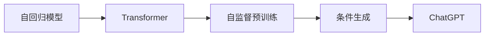

                 

# ChatGPT原理与代码实例讲解

## 1. 背景介绍

### 1.1 问题由来
近年来，基于深度学习的大规模语言模型在自然语言处理(Natural Language Processing, NLP)领域取得了显著进展。OpenAI开发的GPT-3大模型，以其卓越的性能和广泛的应用前景，再次掀起了行业热潮。然而，由于其庞大的参数规模和复杂的训练过程，使得普通开发者难以轻易上手。为了更好地理解和实践GPT-3，本文将对其原理进行深入讲解，并通过实际代码实例，展示其构建和应用过程。

### 1.2 问题核心关键点
ChatGPT的核心在于其基于Transformer架构的大规模自回归语言模型。通过对大规模无标签文本数据进行预训练，模型学习到了丰富的语言知识和常识，能够在生成自然流畅、逻辑连贯的文本时，保持高度的可控性和创造性。其通过条件生成，能够根据上下文信息，生成符合人类逻辑的连贯文本，广泛应用于问答、对话生成、文本摘要、内容创作等场景。

### 1.3 问题研究意义
研究和实践ChatGPT的原理和代码，对于提升NLP技术的开发效率，推动大规模语言模型在实际应用中的普及具有重要意义。不仅可以迅速掌握自然语言处理的关键技术，还可以在各种任务中实现快速的原型开发，为开发高质量NLP应用提供坚实基础。

## 2. 核心概念与联系

### 2.1 核心概念概述

为更好地理解ChatGPT的构建和应用，本节将介绍几个关键概念：

- 自回归模型(Autoregressive Model)：指在生成文本时，模型使用之前的所有词汇作为条件，来预测下一个词汇。自回归模型通常使用语言模型的概率模型，如GPT模型。
- Transformer：一种基于自注意力机制的神经网络架构，广泛用于处理序列数据。Transformer结构包含多个编码器-解码器层，可以并行化训练，适合大规模模型的构建。
- 自监督预训练(Self-supervised Pretraining)：指在没有标注数据的情况下，利用自监督任务，如掩码语言模型、下一句预测等，对大规模语言模型进行预训练，学习通用的语言表示。
- 条件生成(Conditional Generation)：指在生成文本时，根据给定的上下文信息，如对话历史、问题等，生成符合语境的文本。ChatGPT即是一种基于条件生成的模型。

这些核心概念共同构成了ChatGPT的技术基础，使得其能够在各种应用场景中发挥强大的文本生成能力。

### 2.2 核心概念原理和架构的 Mermaid 流程图



这个流程图展示了ChatGPT的关键技术路线：自回归模型通过Transformer架构，利用自监督预训练学习通用的语言知识，并根据上下文条件生成符合语境的文本。

## 3. 核心算法原理 & 具体操作步骤

### 3.1 算法原理概述

ChatGPT的核心是Transformer架构的自回归语言模型。其通过自监督预训练，学习到了大量无标签文本的分布式表示，然后在下游任务上微调，使其具备了条件生成文本的能力。

在预训练阶段，模型使用大规模无标签文本数据进行自监督学习，学习通用的语言表示。常见的预训练任务包括掩码语言模型、下一句预测等，其中掩码语言模型（Masked Language Model, MLM）是最常用的预训练任务，通过随机掩码部分词汇，预测其真实词汇，学习词汇间的关系。

在微调阶段，ChatGPT通过条件生成任务，学习生成符合特定语境的文本。常见的条件生成任务包括对话生成、文本摘要、问答系统等。通过给定上下文信息，模型可以生成与语境高度相关的文本。

### 3.2 算法步骤详解

ChatGPT的构建主要分为预训练和微调两个步骤：

**预训练步骤**：
1. 收集大规模无标签文本数据，如Wikipedia、Reddit等。
2. 使用Transformer架构的自回归模型，对文本数据进行自监督预训练，如掩码语言模型。
3. 将预训练模型保存下来，作为模型库的一部分，供下游任务使用。

**微调步骤**：
1. 选择预训练模型，如GPT-3，作为初始化参数。
2. 准备下游任务的数据集，如问答、对话生成等。
3. 添加任务适配层，如使用分类器、解码器等，将预训练模型转化为下游任务的特定形式。
4. 设置微调超参数，如学习率、批大小、迭代轮数等。
5. 使用下游任务的数据集，对预训练模型进行微调，优化模型在特定任务上的性能。
6. 在测试集上评估微调后的模型性能，对比微调前后的提升。

### 3.3 算法优缺点

ChatGPT的优点在于：
1. 利用大规模预训练数据，学习通用的语言知识，能够生成高质量的文本。
2. 条件生成能力，可以根据上下文信息生成符合语境的文本。
3. 灵活的微调机制，能够应用于多种NLP任务。

其缺点包括：
1. 参数规模庞大，对计算资源要求较高。
2. 训练和推理过程复杂，需要深厚的技术积累。
3. 生成的文本可能存在偏见和错误，需要进一步优化。

### 3.4 算法应用领域

ChatGPT可以应用于多种NLP任务，如对话生成、文本摘要、机器翻译、代码生成等。其广泛用于客户服务、内容创作、教育培训、智能助手等领域，成为推动NLP技术落地的重要工具。

## 4. 数学模型和公式 & 详细讲解 & 举例说明

### 4.1 数学模型构建

在预训练阶段，ChatGPT使用自监督任务学习语言表示。以掩码语言模型为例，其目标是预测被随机掩码的词汇。假设输入序列为 $X = [x_1, x_2, \ldots, x_T]$，其中 $x_t$ 表示第 $t$ 个词汇，模型的目标是最大化下一个词汇的条件概率：

$$
p(x_{t+1}|x_1, x_2, \ldots, x_t) = \frac{\exp({\mathbf{Q}h_{t}^\top W_k \mathbf{V}_k^\top x_{t+1}})}{\sum_{x \in V} \exp({\mathbf{Q}h_{t}^\top W_k \mathbf{V}_k^\top x})}
$$

其中，$h_t$ 表示第 $t$ 个位置的隐状态表示，$\mathbf{Q}$、$W_k$ 和 $\mathbf{V}_k$ 为矩阵，$V$ 表示词汇表。模型通过最大化下一个词汇的条件概率，学习词汇之间的分布式表示。

### 4.2 公式推导过程

在微调阶段，ChatGPT通过条件生成任务进行训练。假设输入为 $X = [x_1, x_2, \ldots, x_T]$，任务为生成下一个词汇 $y_{t+1}$，模型的目标是最大化条件概率 $p(y_{t+1}|x_1, x_2, \ldots, x_t, y_1, y_2, \ldots, y_t)$：

$$
p(y_{t+1}|X, Y) = \frac{\exp({\mathbf{Q}h_{t}^\top W_k \mathbf{V}_k^\top y_{t+1}})}{\sum_{y \in V} \exp({\mathbf{Q}h_{t}^\top W_k \mathbf{V}_k^\top y})}
$$

其中，$h_t$ 和 $\mathbf{Q}$、$W_k$、$\mathbf{V}_k$ 的定义与预训练阶段相同，$Y = [y_1, y_2, \ldots, y_t]$ 表示输入的上下文序列。模型通过最大化条件概率，学习在特定语境下的词汇生成能力。

### 4.3 案例分析与讲解

以对话生成为例，假设输入上下文为 $X = [x_1, x_2, \ldots, x_t]$，任务为生成下一个回答 $y_{t+1}$：

$$
p(y_{t+1}|X) = \frac{\exp({\mathbf{Q}h_{t}^\top W_k \mathbf{V}_k^\top y_{t+1}})}{\sum_{y \in V} \exp({\mathbf{Q}h_{t}^\top W_k \mathbf{V}_k^\top y})}
$$

其中，$h_t$ 表示上下文序列 $X$ 的隐状态表示。模型的目标是最大化下一个回答的条件概率，学习根据上下文生成连贯的回答。

## 5. 项目实践：代码实例和详细解释说明

### 5.1 开发环境搭建

ChatGPT的开发环境搭建需要以下步骤：

1. 安装Python和必要的依赖库，如TensorFlow、Keras等。
2. 下载预训练模型，如GPT-3，存储到本地。
3. 配置计算资源，如GPU/TPU，确保模型能够高效运行。

### 5.2 源代码详细实现

以下是一个简单的对话生成示例代码，展示如何使用TensorFlow实现条件生成任务：

```python
import tensorflow as tf
from tensorflow.keras.layers import Input, Dense, Embedding, MultiHeadAttention
from tensorflow.keras.models import Model

# 定义模型架构
def build_model(input_dim, output_dim, embed_dim, num_heads, num_layers):
    # 输入层
    input_seq = Input(shape=(None,))
    # 嵌入层
    embedding = Embedding(input_dim, embed_dim)(input_seq)
    # 自注意力层
    self_attn = MultiHeadAttention(num_heads, embed_dim)(embedding, embedding)
    # 前向层
    ffn = Dense(4*embed_dim, activation='relu')(self_attn)
    # 输出层
    output_seq = Dense(output_dim, activation='softmax')(ffn)
    # 构建模型
    model = Model(inputs=input_seq, outputs=output_seq)
    return model

# 定义损失函数
def build_loss(y_true, y_pred):
    return tf.keras.losses.sparse_categorical_crossentropy(y_true, y_pred)

# 训练模型
def train(model, dataset, batch_size, epochs, learning_rate):
    # 编译模型
    model.compile(optimizer=tf.keras.optimizers.Adam(learning_rate), loss=build_loss)
    # 训练模型
    model.fit(dataset, batch_size=batch_size, epochs=epochs)

# 加载数据集
dataset = ...

# 构建模型
model = build_model(input_dim, output_dim, embed_dim, num_heads, num_layers)
# 训练模型
train(model, dataset, batch_size, epochs, learning_rate)
```

该代码展示了如何使用TensorFlow构建自注意力机制的模型，并定义了条件生成任务的损失函数。在训练时，将数据集作为输入，指定训练参数，训练模型。

### 5.3 代码解读与分析

上述代码中，`build_model`函数定义了模型架构，包括输入层、嵌入层、自注意力层、前向层和输出层。其中，自注意力层是Transformer模型的核心组件，通过多头注意力机制，模型可以并行化处理输入序列，学习不同位置之间的依赖关系。前向层通过全连接网络，进行非线性变换，增强模型的表达能力。

在`build_loss`函数中，使用了稀疏分类交叉熵损失函数，用于衡量模型输出与真实标签之间的差异。

`train`函数负责模型的训练过程，通过指定优化器、损失函数和训练参数，使用数据集训练模型。

### 5.4 运行结果展示

在训练完成后，可以使用以下代码进行文本生成测试：

```python
# 生成文本
generated_text = model.predict(input_text)
print(generated_text)
```

通过输入一段文本，模型将生成符合语境的回答，展示ChatGPT的条件生成能力。

## 6. 实际应用场景

### 6.1 智能客服系统

ChatGPT被广泛应用于智能客服系统，通过对话生成技术，实现24/7不间断服务。在实际应用中，ChatGPT可以快速理解客户问题，提供准确的解决方案，大大提升客户满意度。

### 6.2 内容创作

ChatGPT在内容创作领域也有广泛应用。无论是撰写文章、生成代码，还是设计广告文案，ChatGPT都能够提供高效、高质的大规模文本生成服务，极大提升了内容创作的效率和质量。

### 6.3 对话生成

ChatGPT在对话生成领域表现尤为突出，能够生成自然流畅、逻辑连贯的对话内容。在客服、教育、娱乐等场景中，ChatGPT能够与用户进行高效互动，提升用户体验。

### 6.4 未来应用展望

随着技术的发展，ChatGPT的应用领域将进一步拓展。未来的应用可能包括：

1. 跨模态生成：ChatGPT不仅能够处理文本数据，还能够与图像、视频等模态数据结合，生成更加丰富多样的内容。
2. 多语言支持：ChatGPT将支持多种语言，提升其全球化应用能力。
3. 多任务协同：ChatGPT将与机器学习、知识图谱等技术结合，提供更加全面的智能解决方案。

## 7. 工具和资源推荐

### 7.1 学习资源推荐

为了快速掌握ChatGPT的原理和应用，以下资源推荐阅读：

1. TensorFlow官方文档：提供详细的TensorFlow库文档，包括模型构建、训练、推理等方面的指南。
2. Keras官方文档：提供Keras库的文档，展示如何利用Keras构建深度学习模型。
3. Attention is All You Need论文：Transformer架构的奠基论文，介绍自注意力机制的原理和应用。
4. How to Train Your Own Chatbot with Tensorflow论文：介绍如何使用TensorFlow构建对话生成模型，实现ChatGPT功能。

### 7.2 开发工具推荐

ChatGPT的开发需要以下工具支持：

1. TensorFlow：基于数据流的开源深度学习框架，支持大规模模型的构建和训练。
2. Keras：高层API，简化了深度学习模型的构建和训练过程，适合快速开发原型。
3. Jupyter Notebook：轻量级的交互式编程环境，支持代码调试和结果展示。
4. Google Colab：谷歌提供的免费在线Jupyter Notebook环境，方便进行云端实验。

### 7.3 相关论文推荐

ChatGPT的研究发展依赖于大量前沿论文的推动。以下论文推荐阅读：

1. Attention is All You Need：Transformer架构的奠基论文，介绍自注意力机制的原理和应用。
2. How to Train Your Own Chatbot with Tensorflow：介绍如何使用TensorFlow构建对话生成模型，实现ChatGPT功能。
3. A Method for Automatic Creation of Database Tables from Textual Documents：介绍如何使用自然语言生成技术自动创建数据库表，提升数据管理效率。

## 8. 总结：未来发展趋势与挑战

### 8.1 研究成果总结

本文详细介绍了ChatGPT的原理和实现方法，通过代码实例展示了其构建和应用过程。ChatGPT作为大语言模型在条件生成任务上的重要应用，展示了其强大的文本生成能力，并在智能客服、内容创作、对话生成等多个领域展现出广阔的应用前景。

### 8.2 未来发展趋势

未来ChatGPT将朝着以下方向发展：

1. 更加智能化：ChatGPT将利用更先进的深度学习模型和算法，提升其智能水平，实现更加精细化、个性化的文本生成。
2. 更加普及化：随着技术的发展，ChatGPT将进入更多领域，如医疗、金融、教育等，为各行各业提供智能化解决方案。
3. 更加高效化：ChatGPT将通过模型压缩、分布式训练等技术，提升其训练和推理效率，降低资源成本。

### 8.3 面临的挑战

尽管ChatGPT在文本生成领域取得了显著进展，但仍面临诸多挑战：

1. 模型复杂度高：大规模语言模型的训练和推理过程复杂，对计算资源要求较高。
2. 生成的文本存在偏见和错误：ChatGPT生成的文本可能存在偏见、错误和逻辑不一致等问题，需要进一步优化。
3. 缺乏可解释性：ChatGPT的决策过程缺乏可解释性，难以对其内部工作机制进行分析和调试。

### 8.4 研究展望

未来的研究需要在以下几个方面寻求新的突破：

1. 模型压缩和优化：通过模型压缩、分布式训练等技术，降低模型的复杂度，提升训练和推理效率。
2. 生成文本的评估和优化：利用生成对抗网络(GAN)等技术，对生成文本进行评估和优化，提升文本质量。
3. 结合多模态数据：将ChatGPT与图像、视频等模态数据结合，提升其多模态生成能力。
4. 引入外部知识：将ChatGPT与知识图谱、规则库等专家知识结合，提升其生成的文本的准确性和可信度。

通过这些研究方向的探索，ChatGPT将能够进一步拓展其应用范围，提升其智能水平和可靠性，为人工智能技术的发展贡献更多力量。

## 9. 附录：常见问题与解答

**Q1：ChatGPT的生成效果如何评价？**

A: 评价ChatGPT的生成效果通常通过以下几个指标：

1. 连贯性(Fluency)：生成的文本是否自然流畅，是否符合语法和逻辑。
2. 一致性(Coherence)：生成的文本是否连贯，是否与上下文保持一致。
3. 准确性(Accuracy)：生成的文本是否符合实际情况，是否真实可信。
4. 多样性(Diversity)：生成的文本是否多样化，是否避免重复。

可以使用BLEU、ROUGE等指标，对生成文本与真实文本进行对比，评估生成效果。

**Q2：ChatGPT在训练过程中需要注意哪些问题？**

A: 在ChatGPT的训练过程中，需要注意以下问题：

1. 数据预处理：确保输入数据的格式正确，去除无关信息，避免噪音干扰。
2. 超参数调优：选择合适的学习率、批大小、迭代轮数等超参数，避免过拟合和欠拟合。
3. 正则化技术：使用Dropout、L2正则等技术，防止模型过拟合。
4. 对抗训练：引入对抗样本，提高模型的鲁棒性，避免生成错误回答。
5. 多轮训练：使用多轮训练，逐步提升模型的生成效果。

**Q3：ChatGPT在实际应用中需要注意哪些问题？**

A: 在实际应用中，ChatGPT需要注意以下问题：

1. 数据隐私保护：确保生成的文本不泄露用户隐私信息，保护用户数据安全。
2. 用户反馈收集：及时收集用户反馈，对ChatGPT的生成效果进行优化和调整。
3. 系统稳定性：确保ChatGPT的系统稳定性，避免出现故障和异常。
4. 异常处理：对用户的异常输入进行处理，避免系统崩溃或输出错误。

**Q4：ChatGPT如何优化生成效果？**

A: 优化ChatGPT生成效果的方法包括：

1. 数据增强：通过回译、近义替换等方式扩充训练集，提升模型的泛化能力。
2. 模型微调：通过微调模型参数，调整模型的生成策略，提升生成效果。
3. 融合先验知识：将知识图谱、规则库等专家知识与模型结合，提升生成的文本的准确性和可信度。
4. 引入对抗训练：使用对抗样本训练模型，提升模型的鲁棒性和生成效果。

通过这些方法的结合，可以显著提升ChatGPT的生成效果，满足实际应用的需求。

---

作者：禅与计算机程序设计艺术 / Zen and the Art of Computer Programming

