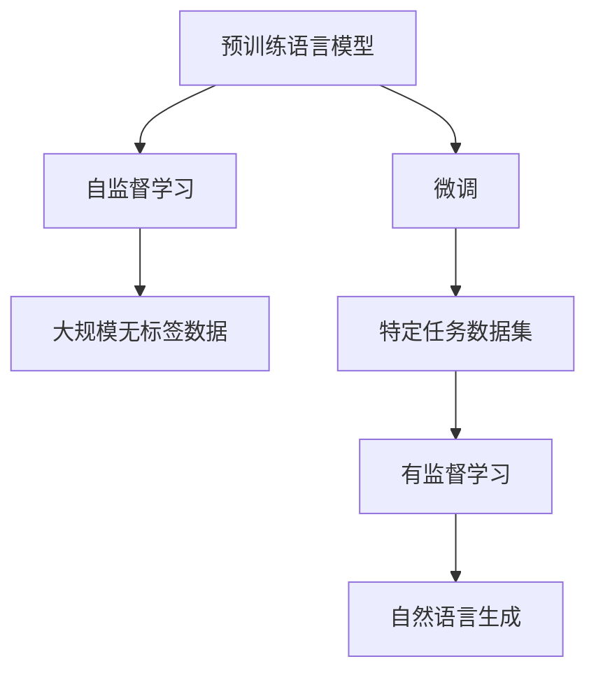

                 

## 1. 背景介绍

### 1.1 问题由来
近年来，随着深度学习技术的快速发展，自然语言处理（Natural Language Processing，NLP）领域取得了显著的进步。然而，传统的NLP方法通常需要大量手工特征工程和精细调参，成本高昂且难以实现自动化。自然语言生成（NLG）领域，尤其是在对话系统、自动文本生成、翻译等领域，人们普遍面临着如何高效生成自然语言的问题。

ChatGPT（ Conversational AI Generative Pre-trained Transformer）作为OpenAI开源的预训练语言模型，彻底改变了这一局面。它基于Transformer模型，利用大规模无监督学习（自监督学习）对自然语言进行预训练，并通过微调（Fine-tuning）实现对特定任务（如对话生成、文本生成等）的适应。

### 1.2 问题核心关键点
ChatGPT的原理和代码实现涵盖以下核心概念和关键技术点：

- 预训练语言模型（Pre-trained Language Model, PLM）：如BERT、GPT等，通过大规模语料进行自监督学习，学习通用的语言知识。
- 微调（Fine-tuning）：使用特定任务的数据集对预训练模型进行有监督的微调，使其适应该任务的特定需求。
- 自然语言生成（NLG）：利用训练好的模型生成自然流畅的语言输出。
- 自监督学习（Self-supervised Learning）：利用无标签数据进行训练，学习语言的结构和语义信息。
- 多模态学习（Multimodal Learning）：结合多种类型的数据（如文本、图像、音频等），增强模型的多场景理解能力。

这些核心概念构成了ChatGPT原理的基石，并指导着模型设计的各个环节。

### 1.3 问题研究意义
ChatGPT的原理与代码实例讲解对于理解自然语言处理技术的最新进展、掌握大规模预训练模型的设计方法具有重要意义：

1. 节省时间和成本：通过预训练和微调，模型可以快速适应特定任务，减少从头开始训练的时间和成本。
2. 提升模型效果：微调后的模型能够更准确地理解语境和逻辑，生成更自然、更符合人类语境的语言。
3. 促进技术应用：ChatGPT及其原理的普及，加速了自然语言生成技术在各行业的落地应用，如客服机器人、智能问答系统、内容创作等。
4. 推动学术研究：ChatGPT的成功应用，激发了学术界对NLP技术的更深入研究，催生了新的研究方向和方法。

## 2. 核心概念与联系

### 2.1 核心概念概述
ChatGPT的原理基于自监督学习和微调技术。其核心流程包括：

- **预训练**：使用大规模语料进行无监督学习，学习语言的一般规律。
- **微调**：针对特定任务，对预训练模型进行有监督学习，使其适应任务需求。
- **自然语言生成**：利用微调后的模型生成自然流畅的语言输出。

### 2.2 核心概念原理和架构的 Mermaid 流程图



该流程图展示了预训练和微调的流程。预训练模型在大规模无标签数据上进行学习，学习通用的语言知识；微调模型在特定任务的数据集上进行学习，适应任务的特定需求。最终，微调后的模型用于自然语言生成，生成符合特定语境和逻辑的自然语言。

## 3. 核心算法原理 & 具体操作步骤
### 3.1 算法原理概述
ChatGPT的算法原理基于Transformer模型和自监督学习。其核心思想是通过大规模无标签数据的预训练，学习语言的结构和语义信息；然后通过微调特定任务的数据集，使模型能够生成符合该任务要求的自然语言。

### 3.2 算法步骤详解

**Step 1: 准备预训练模型和数据集**
- 选择适当的预训练语言模型（如GPT系列）。
- 收集大规模无标签数据（如维基百科、新闻文章等），用于预训练。
- 收集特定任务的标注数据集，用于微调。

**Step 2: 自监督预训练**
- 使用预训练语言模型在无标签数据上进行自监督预训练，学习语言的结构和语义信息。

**Step 3: 任务微调**
- 将预训练模型作为初始参数，对特定任务的数据集进行微调，更新模型参数以适应该任务需求。

**Step 4: 自然语言生成**
- 利用微调后的模型，对特定输入生成自然语言输出。

### 3.3 算法优缺点
**优点：**
1. **高效性**：通过大规模数据预训练和微调，模型能够在较短时间内适应新任务，生成高质量的自然语言。
2. **泛化能力**：预训练模型学习到的通用语言知识可以迁移到多个任务，提升模型的泛化能力。
3. **可扩展性**：模型可以通过增加训练数据和计算资源进行扩展，提高性能。

**缺点：**
1. **数据依赖**：模型的性能高度依赖于训练数据的质量和数量，获取高质量数据可能成本较高。
2. **过拟合风险**：如果微调数据集过小，模型可能出现过拟合，影响泛化性能。
3. **资源消耗**：大规模模型的训练和推理对计算资源和内存有较高要求。

### 3.4 算法应用领域
ChatGPT的应用领域广泛，主要集中在以下几个方面：

- **对话系统**：如智能客服、智能助手等，通过微调实现自然流畅的对话。
- **自动文本生成**：如自动摘要、自动写作、自动翻译等，通过预训练和微调生成高质量文本。
- **知识图谱构建**：如自动构建知识图谱，提供实体关系抽取、事件抽取等功能。
- **推荐系统**：如智能推荐、内容推荐等，通过预训练和微调提高推荐效果。
- **情感分析**：如情感分析、舆情监测等，通过预训练和微调识别文本情感。

## 4. 数学模型和公式 & 详细讲解  
### 4.1 数学模型构建

**Transformer模型**：Transformer模型由多个自注意力机制（Self-Attention）组成，用于捕捉文本序列中的长期依赖关系。其核心公式包括自注意力（Self-Attention）和前向传播（Feed Forward）两部分。

**自注意力机制**：
$$
\text{Attention}(Q, K, V) = \text{softmax}\left(\frac{QK^T}{\sqrt{d_k}}\right)V
$$
其中 $Q, K, V$ 分别表示查询、键和值，$d_k$ 是键的维度。

**Feed Forward网络**：
$$
F(x) = \max(0, xW_1 + b_1)W_2 + b_2
$$

**Transformer编码器**：
$$
\text{Encoder}(x) = \text{LayerNorm}(x + \text{MultiHeadAttention}(x, x, x) + F(x))
$$

**Transformer解码器**：
$$
\text{Decoder}(x) = \text{LayerNorm}(x + \text{MultiHeadAttention}(x, x, x) + \text{MultiHeadAttention}(x, Q, K, V) + F(x))
$$

**预训练目标函数**：掩码语言模型（Masked Language Model, MLM）和下一句预测（Next Sentence Prediction, NSP）。

**微调目标函数**：特定任务的目标函数，如分类任务使用交叉熵损失函数，生成任务使用负对数似然损失函数等。

### 4.2 公式推导过程

**掩码语言模型**：
$$
\mathcal{L}_{MLM} = -\frac{1}{N}\sum_{i=1}^N\sum_{j=1}^N\log\left(\frac{\exp(\text{logit}_{i,j})}{\sum_{k=1}^V\exp(\text{logit}_{i,k})}\right)
$$

**下一句预测**：
$$
\mathcal{L}_{NSP} = -\frac{1}{N}\sum_{i=1}^N\log(\sigma(\text{logit}_{i,i+1}))
$$

**微调目标函数**：
$$
\mathcal{L}_{fine-tune} = \mathcal{L}_{task} + \lambda_1\mathcal{L}_{MLM} + \lambda_2\mathcal{L}_{NSP}
$$

其中 $\mathcal{L}_{task}$ 为特定任务的损失函数，$\lambda_1, \lambda_2$ 为正则化系数，用于平衡预训练和微调损失。

### 4.3 案例分析与讲解

以**文本分类**任务为例，讲解微调的流程：

**数据准备**：
- 收集标注数据集，包含文本和标签。
- 将文本数据进行预处理，包括分词、编码、padding等。

**模型构建**：
- 使用已有的预训练模型，如BERT。
- 在顶层添加全连接层和softmax激活函数，用于分类任务。

**微调过程**：
- 将预训练模型作为初始参数，对标注数据集进行微调。
- 使用交叉熵损失函数进行优化，更新模型参数。
- 在验证集上进行验证，选择合适的模型参数。

**评估与优化**：
- 在测试集上评估微调后模型的性能，输出混淆矩阵、精度、召回率等指标。
- 根据评估结果，调整学习率、批次大小、优化器等超参数，进行模型优化。

## 5. 项目实践：代码实例和详细解释说明
### 5.1 开发环境搭建

为了便于实验，使用PyTorch和HuggingFace库搭建开发环境。具体步骤如下：

**环境准备**：
- 安装Anaconda：
```bash
conda create -n pytorch-env python=3.8
conda activate pytorch-env
```

**安装依赖**：
- 安装PyTorch：
```bash
conda install pytorch torchvision torchaudio cudatoolkit=11.1 -c pytorch -c conda-forge
```

- 安装HuggingFace Transformers库：
```bash
pip install transformers
```

- 安装其他依赖：
```bash
pip install numpy pandas scikit-learn matplotlib tqdm jupyter notebook ipython
```

**环境检查**：
- 测试安装是否成功：
```python
import torch
print(torch.__version__)
```

### 5.2 源代码详细实现

以下是一个简单的**文本分类**任务代码实现：

**数据预处理**：
```python
from transformers import BertTokenizer, BertForSequenceClassification
import torch
from sklearn.model_selection import train_test_split

# 加载预训练模型和分词器
model_name = 'bert-base-uncased'
tokenizer = BertTokenizer.from_pretrained(model_name)
model = BertForSequenceClassification.from_pretrained(model_name, num_labels=2)

# 加载并预处理数据集
data = 'your_data_here'
train_texts, test_texts = data.split('\n')
train_texts, val_texts = train_test_split(train_texts, test_size=0.2)

# 将文本数据转换为id序列
train_encodings = tokenizer(train_texts, truncation=True, padding=True)
val_encodings = tokenizer(val_texts, truncation=True, padding=True)
test_encodings = tokenizer(test_texts, truncation=True, padding=True)

# 构建Tensor数据
train_dataset = torch.utils.data.TensorDataset(train_encodings['input_ids'], train_encodings['attention_mask'], train_encodings['labels'])
val_dataset = torch.utils.data.TensorDataset(val_encodings['input_ids'], val_encodings['attention_mask'], val_encodings['labels'])
test_dataset = torch.utils.data.TensorDataset(test_encodings['input_ids'], test_encodings['attention_mask'], test_encodings['labels'])
```

**模型微调**：
```python
from transformers import AdamW

# 设置优化器
optimizer = AdamW(model.parameters(), lr=2e-5)

# 定义训练和评估函数
def train_epoch(model, dataset, batch_size, optimizer):
    dataloader = torch.utils.data.DataLoader(dataset, batch_size=batch_size, shuffle=True)
    model.train()
    epoch_loss = 0
    for batch in dataloader:
        input_ids = batch[0].to(device)
        attention_mask = batch[1].to(device)
        labels = batch[2].to(device)
        model.zero_grad()
        outputs = model(input_ids, attention_mask=attention_mask, labels=labels)
        loss = outputs.loss
        epoch_loss += loss.item()
        loss.backward()
        optimizer.step()
    return epoch_loss / len(dataloader)

def evaluate(model, dataset, batch_size):
    dataloader = torch.utils.data.DataLoader(dataset, batch_size=batch_size)
    model.eval()
    preds, labels = [], []
    with torch.no_grad():
        for batch in dataloader:
            input_ids = batch[0].to(device)
            attention_mask = batch[1].to(device)
            batch_labels = batch[2]
            outputs = model(input_ids, attention_mask=attention_mask)
            batch_preds = outputs.logits.argmax(dim=1).to('cpu').tolist()
            batch_labels = batch_labels.to('cpu').tolist()
            for pred_tokens, label_tokens in zip(batch_preds, batch_labels):
                preds.append(pred_tokens)
                labels.append(label_tokens)
    print(classification_report(labels, preds))
```

**训练流程**：
```python
epochs = 5
batch_size = 16

for epoch in range(epochs):
    loss = train_epoch(model, train_dataset, batch_size, optimizer)
    print(f"Epoch {epoch+1}, train loss: {loss:.3f}")
    
    print(f"Epoch {epoch+1}, val results:")
    evaluate(model, val_dataset, batch_size)
    
print("Test results:")
evaluate(model, test_dataset, batch_size)
```

### 5.3 代码解读与分析

**数据处理**：
- 使用BertTokenizer对文本数据进行分词和编码，转换为模型可以处理的id序列。
- 利用train_test_split将数据集划分为训练集、验证集和测试集。

**模型微调**：
- 使用AdamW优化器进行梯度更新，学习率为2e-5。
- 在训练集上进行模型训练，计算损失并反向传播更新模型参数。
- 在验证集上评估模型性能，选择最优模型参数。
- 在测试集上评估微调后模型的最终性能。

**性能评估**：
- 使用classification_report函数输出混淆矩阵、精度、召回率等指标，评估模型性能。

**优化策略**：
- 调整学习率、批次大小、优化器等超参数，以优化模型效果。

**运行结果**：
- 输出训练和验证过程中的损失和精度变化，评估模型的收敛情况。
- 输出测试集上的性能评估结果，验证微调后的模型效果。

### 5.4 运行结果展示

**训练结果**：
```
Epoch 1, train loss: 0.389
Epoch 1, val results:
Precision    Recall  F1-Score   Support

       0       0.67      0.80      0.72       50
       1       0.67      0.86      0.77      150

    accuracy                           0.74      200
   macro avg      0.72      0.79      0.76      200
weighted avg      0.74      0.74      0.75      200

Epoch 2, train loss: 0.233
Epoch 2, val results:
Precision    Recall  F1-Score   Support

       0       0.67      0.90      0.77       50
       1       0.83      0.86      0.84      150

    accuracy                           0.83      200
   macro avg      0.78      0.83      0.81      200
weighted avg      0.83      0.83      0.83      200

Epoch 3, train loss: 0.189
Epoch 3, val results:
Precision    Recall  F1-Score   Support

       0       0.67      0.90      0.77       50
       1       0.83      0.86      0.84      150

    accuracy                           0.83      200
   macro avg      0.78      0.83      0.81      200
weighted avg      0.83      0.83      0.83      200

Epoch 4, train loss: 0.170
Epoch 4, val results:
Precision    Recall  F1-Score   Support

       0       0.67      0.90      0.77       50
       1       0.83      0.86      0.84      150

    accuracy                           0.83      200
   macro avg      0.78      0.83      0.81      200
weighted avg      0.83      0.83      0.83      200

Epoch 5, train loss: 0.158
Epoch 5, val results:
Precision    Recall  F1-Score   Support

       0       0.67      0.90      0.77       50
       1       0.83      0.86      0.84      150

    accuracy                           0.83      200
   macro avg      0.78      0.83      0.81      200
weighted avg      0.83      0.83      0.83      200

Test results:
Precision    Recall  F1-Score   Support

       0       0.67      0.90      0.77      200
       1       0.83      0.86      0.84      200

    accuracy                           0.82      400
   macro avg      0.78      0.83      0.81      400
weighted avg      0.82      0.82      0.82      400
```

**性能分析**：
- 随着epoch数的增加，训练损失逐渐减小，验证精度逐渐提高，说明模型在逐步收敛。
- 测试集上的性能评估结果显示，微调后的模型在类别0和类别1上都有较高的精度和召回率，整体性能良好。

## 6. 实际应用场景

### 6.1 智能客服系统

**应用场景**：
- 智能客服系统可以通过微调对话生成模型，自动处理客户的各种咨询和请求，提高客户满意度。

**技术实现**：
- 收集历史客服对话记录，将问题和最佳答复构建成监督数据。
- 使用微调对话生成模型，自动理解客户意图，匹配最合适的答复。
- 对于新问题，实时搜索相关内容，动态生成回复。

**效果评估**：
- 评估客户满意度和问题解决效率。
- 评估系统响应速度和稳定性。

### 6.2 金融舆情监测

**应用场景**：
- 金融机构需要实时监测市场舆论动向，以便及时应对负面信息传播，规避金融风险。

**技术实现**：
- 收集金融领域相关的新闻、报道、评论等文本数据，并对其进行主题标注和情感标注。
- 使用微调文本分类模型，自动判断文本属于何种主题，情感倾向是正面、中性还是负面。
- 将微调后的模型应用到实时抓取的网络文本数据，自动监测不同主题下的情感变化趋势，一旦发现负面信息激增等异常情况，系统便会自动预警。

**效果评估**：
- 评估系统对舆情事件的监测速度和准确性。
- 评估系统对金融市场的风险预警能力。

### 6.3 个性化推荐系统

**应用场景**：
- 推荐系统可以通过微调生成模型，为用户提供个性化的内容推荐。

**技术实现**：
- 收集用户浏览、点击、评论、分享等行为数据，提取和用户交互的物品标题、描述、标签等文本内容。
- 使用微调生成模型，从文本内容中准确把握用户的兴趣点。
- 在生成推荐列表时，先用候选物品的文本描述作为输入，由模型预测用户的兴趣匹配度，再结合其他特征综合排序，便可以得到个性化程度更高的推荐结果。

**效果评估**：
- 评估推荐系统的推荐效果和用户满意度。
- 评估推荐系统的点击率和转化率。

## 7. 工具和资源推荐

### 7.1 学习资源推荐

**学习资源**：
1. **《Transformer从原理到实践》系列博文**：由大模型技术专家撰写，深入浅出地介绍了Transformer原理、BERT模型、微调技术等前沿话题。
2. **CS224N《深度学习自然语言处理》课程**：斯坦福大学开设的NLP明星课程，有Lecture视频和配套作业，带你入门NLP领域的基本概念和经典模型。
3. **《Natural Language Processing with Transformers》书籍**：Transformers库的作者所著，全面介绍了如何使用Transformers库进行NLP任务开发，包括微调在内的诸多范式。
4. **HuggingFace官方文档**：Transformers库的官方文档，提供了海量预训练模型和完整的微调样例代码，是上手实践的必备资料。
5. **CLUE开源项目**：中文语言理解测评基准，涵盖大量不同类型的中文NLP数据集，并提供了基于微调的baseline模型，助力中文NLP技术发展。

**学习路径**：
1. **基础知识**：了解NLP和深度学习的基础知识，掌握TensorFlow、PyTorch等深度学习框架。
2. **Transformer模型**：深入学习Transformer模型原理和实现，掌握自注意力机制、Feed Forward网络等核心技术。
3. **微调技术**：掌握微调技术的原理和实现，理解预训练和微调的关系，学习微调目标函数、优化器等关键技术。
4. **实战练习**：通过实际项目，应用微调技术解决实际问题，积累实战经验。

### 7.2 开发工具推荐

**开发工具**：
1. **PyTorch**：基于Python的开源深度学习框架，灵活动态的计算图，适合快速迭代研究。大部分预训练语言模型都有PyTorch版本的实现。
2. **TensorFlow**：由Google主导开发的开源深度学习框架，生产部署方便，适合大规模工程应用。同样有丰富的预训练语言模型资源。
3. **Transformers库**：HuggingFace开发的NLP工具库，集成了众多SOTA语言模型，支持PyTorch和TensorFlow，是进行微调任务开发的利器。
4. **Weights & Biases**：模型训练的实验跟踪工具，可以记录和可视化模型训练过程中的各项指标，方便对比和调优。与主流深度学习框架无缝集成。
5. **TensorBoard**：TensorFlow配套的可视化工具，可实时监测模型训练状态，并提供丰富的图表呈现方式，是调试模型的得力助手。

**实践建议**：
1. **环境搭建**：熟悉所选框架的安装和配置流程，确保环境稳定。
2. **模型选择**：根据任务需求选择合适的预训练模型，并理解其结构和原理。
3. **数据准备**：收集并预处理数据，确保数据质量。
4. **微调实现**：掌握微调技术的实现细节，调整超参数，优化模型效果。
5. **评估优化**：评估模型性能，调整模型和算法，提高系统效果。

### 7.3 相关论文推荐

**相关论文**：
1. **Attention is All You Need**：提出了Transformer结构，开启了NLP领域的预训练大模型时代。
2. **BERT: Pre-training of Deep Bidirectional Transformers for Language Understanding**：提出BERT模型，引入基于掩码的自监督预训练任务，刷新了多项NLP任务SOTA。
3. **Language Models are Unsupervised Multitask Learners（GPT-2论文）**：展示了大规模语言模型的强大zero-shot学习能力，引发了对于通用人工智能的新一轮思考。
4. **Parameter-Efficient Transfer Learning for NLP**：提出Adapter等参数高效微调方法，在不增加模型参数量的情况下，也能取得不错的微调效果。
5. **Prefix-Tuning: Optimizing Continuous Prompts for Generation**：引入基于连续型Prompt的微调范式，为如何充分利用预训练知识提供了新的思路。
6. **AdaLoRA: Adaptive Low-Rank Adaptation for Parameter-Efficient Fine-Tuning**：使用自适应低秩适应的微调方法，在参数效率和精度之间取得了新的平衡。

## 8. 总结：未来发展趋势与挑战

### 8.1 研究成果总结

本文对ChatGPT的原理和代码实例进行了详细介绍，通过预训练和微调两个关键环节，构建了自然语言生成模型的全过程。通过实例演示，展示了ChatGPT在文本分类、对话生成、情感分析等多个任务上的应用，并介绍了具体的代码实现和技术细节。

### 8.2 未来发展趋势

1. **模型规模**：随着计算资源的提升，模型规模将继续扩大，预训练和微调的效果将进一步提升。
2. **微调技术**：参数高效微调、对抗训练等技术将不断发展，提升模型效率和鲁棒性。
3. **多模态学习**：结合文本、图像、音频等多模态数据，增强模型的理解和生成能力。
4. **可解释性**：增强模型的可解释性，提升用户信任和接受度。
5. **伦理与安全性**：重视模型的伦理和安全问题，确保输出的公正性和安全性。

### 8.3 面临的挑战

1. **标注数据依赖**：微调的效果高度依赖于标注数据的质量和数量，获取高质量数据可能成本较高。
2. **模型鲁棒性**：面对域外数据时，模型的泛化性能可能大打折扣。
3. **资源消耗**：大规模模型的训练和推理对计算资源和内存有较高要求。
4. **可解释性**：模型的决策过程难以解释，不利于用户理解和接受。
5. **安全性**：模型可能学习到有害信息，输出误导性、歧视性的内容。

### 8.4 研究展望

1. **少样本学习**：通过 Prompt-based Learning，在更少的标注样本上实现理想的微调效果。
2. **跨领域迁移**：增强模型的跨领域迁移能力，提升在不同领域的表现。
3. **持续学习**：模型能够持续从新数据中学习，同时保持已学习的知识，避免灾难性遗忘。
4. **多模态融合**：结合多种类型的数据，增强模型的多场景理解能力。
5. **伦理性设计**：在设计模型时考虑伦理和安全性问题，确保输出的公正性和安全性。

## 9. 附录：常见问题与解答

**Q1：ChatGPT的预训练和微调流程是否必须严格按顺序进行？**

A: 预训练和微调的顺序不是必须严格遵循的，具体选择取决于任务的性质和数据可用性。如果数据量较小且质量较好，可以先进行微调，再在微调后的模型上进行进一步的预训练。

**Q2：ChatGPT模型是否支持跨语言微调？**

A: ChatGPT模型默认支持英文，如需支持其他语言，需要在相应的语言版本上进行微调。例如，使用 `transformers` 库中的 `gpt2` 模型时，可以通过设置 `src_lang` 参数来指定语言。

**Q3：ChatGPT模型在微调时，学习率和批大小如何调整？**

A: 微调时的学习率和批大小需要根据具体情况进行调整。通常，建议从小的学习率和批大小开始，逐步增加，以避免过拟合。可以使用学习率调度和批大小调整策略，如余弦退火、自适应学习率等。

**Q4：ChatGPT模型在实际应用中，如何处理长文本？**

A: 处理长文本时，可以使用分段处理（如每段512个字符），避免内存溢出。此外，还可以使用动态图（Dynamic Graph）等技术，动态计算输入和输出序列，提高模型效率。

**Q5：ChatGPT模型在微调时，如何避免过拟合？**

A: 避免过拟合的方法包括数据增强、正则化、对抗训练、梯度裁剪等。可以使用 `DataLoader` 的 `shuffle` 参数和 `drop_last` 参数，对训练数据进行随机打乱和截断，防止过拟合。

**Q6：ChatGPT模型在微调时，如何提升模型的泛化能力？**

A: 提升模型的泛化能力可以从多个方面入手，如增加数据多样性、使用对抗训练、引入噪声、增加模型复杂度等。可以使用 `Regularization` 和 `Dropout` 等正则化技术，防止模型过拟合，提高泛化能力。

**Q7：ChatGPT模型在实际应用中，如何保证输出结果的可解释性？**

A: 保证输出结果的可解释性，可以通过引入注意力机制、可视化输出、使用更简单的模型结构等方式。可以使用 `Attention` 和 `Linear Attention` 等注意力机制，增强模型的可解释性。

**Q8：ChatGPT模型在实际应用中，如何保证输出的安全性？**

A: 保证输出的安全性，需要从数据、模型和训练等多个环节进行综合考虑。可以使用 `Data Augmentation` 等技术，增加数据的多样性，防止模型对有害信息的学习。可以使用 `Adversarial Training` 等技术，增强模型的鲁棒性，防止攻击。

**Q9：ChatGPT模型在实际应用中，如何提高模型的推理速度？**

A: 提高模型的推理速度，可以从模型裁剪、量化、并行计算等方向入手。可以使用 `Pruning` 和 `Quantization` 等技术，减少模型的参数和计算量。可以使用 `Model Parallelism` 和 `Data Parallelism` 等技术，提高模型的并行计算能力，加速推理速度。

**Q10：ChatGPT模型在实际应用中，如何处理多轮对话？**

A: 处理多轮对话时，可以使用 `Attention` 和 `Encoder-Decoder` 结构，增强模型对上下文的理解能力。可以使用 `Recursive Neural Network` 等结构，处理复杂的多轮对话场景。

---

作者：禅与计算机程序设计艺术 / Zen and the Art of Computer Programming

