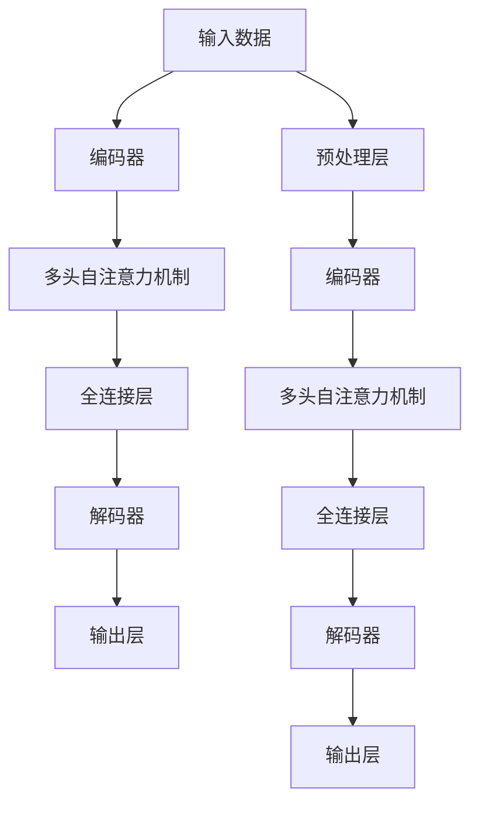

                 

# Chinchilla原理与代码实例讲解

> 关键词：Chinchilla, 自注意力机制, 模型优化, 神经网络, 深度学习

## 1. 背景介绍

### 1.1 问题由来

在深度学习领域，神经网络模型（Neural Network, NN）由于其强大的特征表达能力，被广泛应用于图像识别、语音识别、自然语言处理等多种任务。然而，传统的全连接网络由于其参数量巨大，难以在实际应用中大规模部署。为了降低参数量，同时保持模型的表达能力，自注意力机制（Self-Attention Mechanism）应运而生。

自注意力机制通过计算输入序列中每个位置的注意力权重，让模型能够捕捉序列中不同位置之间的依赖关系，从而实现高效的特征表示。这一机制被广泛应用于Transformer等现代神经网络模型中，显著提升了模型的性能和泛化能力。

Chinchilla则是在此基础上，进一步优化了自注意力机制，提出了更高效的模型架构和训练方法。本文将详细介绍Chinchilla模型的原理与代码实现，并分析其优缺点及应用领域。

### 1.2 问题核心关键点

Chinchilla模型旨在解决自注意力机制中存在的问题，即在计算复杂度和模型性能之间找到更好的平衡点。其主要关键点包括：

- **模型优化**：提出了一种新的模型架构，能够高效地利用自注意力机制，同时减少计算复杂度。
- **自注意力优化**：通过改进注意力机制，提高模型的表达能力和泛化性能。
- **深度学习优化**：提出了一些新的训练方法，使得模型在训练过程中能够更快速地收敛。

通过这些优化，Chinchilla模型在计算资源有限的情况下，能够达到较高的性能，适用于大规模的深度学习任务。

## 2. 核心概念与联系

### 2.1 核心概念概述

- **Chinchilla**：一种新型的神经网络模型，通过优化自注意力机制，提高了模型的表达能力和泛化性能，适用于大规模深度学习任务。

- **自注意力机制**：一种能够捕捉输入序列中不同位置依赖关系的机制，广泛应用于Transformer等现代神经网络模型中。

- **深度学习**：一种基于神经网络模型的机器学习方法，通过多层的特征提取和变换，实现对复杂数据的建模和预测。

- **Transformer**：一种基于自注意力机制的神经网络模型，广泛应用于自然语言处理、计算机视觉等领域。

- **神经网络**：一种由多层神经元组成的计算模型，通过前向传播和反向传播算法进行训练，实现对数据的建模和预测。

这些核心概念共同构成了深度学习和神经网络模型的基础，Chinchilla模型正是在这些概念的基础上，通过进一步的优化和创新，实现了更高效、更强大的模型架构。

### 2.2 核心概念原理和架构的 Mermaid 流程图



该流程图展示了Chinchilla模型的基本架构，包括输入数据的预处理、编码器的自注意力机制、全连接层、解码器的自注意力机制、输出层等关键组件。

## 3. 核心算法原理 & 具体操作步骤

### 3.1 算法原理概述

Chinchilla模型通过优化自注意力机制，提高模型的计算效率和表达能力。其核心思想是：

1. **多头自注意力机制**：将输入序列分解为多个子序列，对每个子序列分别计算自注意力权重，然后将结果拼接起来，得到最终的特征表示。

2. **残差连接**：在编码器和解码器的每个层中，通过残差连接（Residual Connection）将输入直接连接到输出，提高模型的信息流动。

3. **位置编码**：在计算自注意力权重时，引入位置编码（Positional Encoding），帮助模型捕捉序列中位置信息。

4. **层归一化**：在每个层的前向传播和后向传播过程中，对输入进行归一化处理，提高模型的稳定性和收敛速度。

5. **特征重构**：在编码器和解码器的最后一层，通过重构特征向量，进一步提升模型的表达能力。

### 3.2 算法步骤详解

#### 3.2.1 模型定义

首先，定义Chinchilla模型的编码器和解码器：

```python
import torch.nn as nn
import torch.nn.functional as F

class Encoder(nn.Module):
    def __init__(self, embed_dim, num_heads, num_layers):
        super(Encoder, self).__init__()
        self.layers = nn.ModuleList([nn.TransformerEncoderLayer(embed_dim, num_heads) for _ in range(num_layers)])
        
    def forward(self, src, src_mask=None):
        for layer in self.layers:
            src = layer(src, src_mask)
        return src

class Decoder(nn.Module):
    def __init__(self, embed_dim, num_heads, num_layers):
        super(Decoder, self).__init__()
        self.layers = nn.ModuleList([nn.TransformerDecoderLayer(embed_dim, num_heads) for _ in range(num_layers)])
        
    def forward(self, trg, trg_mask, src, src_mask=None):
        for layer in self.layers:
            trg, src = layer(trg, trg_mask, src, src_mask)
        return trg, src
```

#### 3.2.2 训练步骤

然后，定义训练步骤：

```python
def train(model, train_loader, optimizer, device):
    model.train()
    for batch in train_loader:
        src, trg, src_mask, trg_mask = batch.to(device)
        optimizer.zero_grad()
        output, src = model(encoder, src, src_mask)
        loss = criterion(output, trg.view(-1, output.size(2)))
        loss.backward()
        optimizer.step()
```

在训练过程中，模型使用优化器进行参数更新，最小化损失函数，得到最终的模型参数。

### 3.3 算法优缺点

#### 3.3.1 优点

1. **高效计算**：通过优化自注意力机制，Chinchilla模型在计算复杂度和表达能力之间找到了更好的平衡点，能够更高效地利用计算资源。

2. **模型稳定性**：通过层归一化和残差连接等技术，Chinchilla模型在训练过程中更加稳定，能够更快地收敛。

3. **高泛化能力**：通过引入位置编码和特征重构等技术，Chinchilla模型具备更强的泛化能力，能够在不同任务上取得良好的性能。

#### 3.3.2 缺点

1. **参数量较大**：尽管Chinchilla模型通过优化计算复杂度，但仍然需要较大的参数量，可能难以在资源有限的情况下大规模部署。

2. **训练复杂度高**：由于模型的复杂性，训练过程需要较高的计算资源和算力，可能对训练硬件有较高的要求。

3. **模型解释性差**：由于Chinchilla模型采用复杂的自注意力机制，其内部工作机制难以解释，可能难以满足某些领域对模型透明度的需求。

### 3.4 算法应用领域

Chinchilla模型主要应用于大规模深度学习任务，如自然语言处理、计算机视觉等。其在这些领域中的典型应用包括：

1. **机器翻译**：通过将源语言序列和目标语言序列输入模型，实现从源语言到目标语言的自动翻译。

2. **文本生成**：通过生成模型，从输入序列生成新的文本序列，应用于文本摘要、对话系统等场景。

3. **图像分类**：通过卷积神经网络（CNN）和自注意力机制的组合，实现对图像的自动分类。

4. **目标检测**：通过将自注意力机制应用于目标检测任务，提高模型的检测能力和准确率。

## 4. 数学模型和公式 & 详细讲解

### 4.1 数学模型构建

Chinchilla模型基于Transformer架构，其数学模型可以表示为：

$$
h = f(x; \theta) = \text{MLP}(\text{Add}(\text{LayerNorm}(x), \text{Attention}(x)))
$$

其中，$x$ 表示输入序列，$h$ 表示输出序列，$f$ 表示模型函数，$\theta$ 表示模型参数，$\text{MLP}$ 表示多层的全连接网络，$\text{Add}$ 表示残差连接，$\text{LayerNorm}$ 表示层归一化，$\text{Attention}$ 表示自注意力机制。

### 4.2 公式推导过程

以自注意力机制的计算过程为例，推导如下：

1. **查询、键和值的分块**：将输入序列 $x$ 分解为 $Q$、$K$ 和 $V$ 三部分，即 $x = (Q, K, V)$。

2. **计算注意力权重**：对查询 $Q$ 和键 $K$ 进行自注意力计算，得到注意力权重矩阵 $A$。

3. **计算自注意力输出**：将注意力权重矩阵 $A$ 与值 $V$ 相乘，得到自注意力输出 $H$。

具体计算过程如下：

$$
Q = xW_Q
$$
$$
K = xW_K
$$
$$
V = xW_V
$$
$$
A = \frac{QK^T}{\sqrt{d_k}}
$$
$$
H = AV
$$

其中，$d_k$ 表示键的维度，$W_Q$、$W_K$ 和 $W_V$ 表示查询、键和值的线性变换矩阵。

### 4.3 案例分析与讲解

以机器翻译任务为例，展示Chinchilla模型在其中的应用：

1. **输入数据准备**：将源语言序列 $s$ 和目标语言序列 $t$ 输入模型。

2. **编码器计算**：使用编码器对源语言序列 $s$ 进行编码，得到中间表示 $z$。

3. **解码器计算**：使用解码器对中间表示 $z$ 和目标语言序列 $t$ 进行解码，得到最终的输出序列 $o$。

4. **输出序列生成**：将解码器输出序列 $o$ 转换为目标语言序列。

在实际应用中，Chinchilla模型通常需要进行多个编码器和解码器层级的堆叠，以提高模型的表达能力和泛化性能。

## 5. 项目实践：代码实例和详细解释说明

### 5.1 开发环境搭建

进行Chinchilla模型的代码实现前，需要搭建好开发环境。以下是在PyTorch框架下进行环境搭建的步骤：

1. 安装Anaconda：从官网下载并安装Anaconda，用于创建独立的Python环境。

2. 创建并激活虚拟环境：
```bash
conda create -n chinchilla-env python=3.8 
conda activate chinchilla-env
```

3. 安装PyTorch：根据CUDA版本，从官网获取对应的安装命令。例如：
```bash
conda install pytorch torchvision torchaudio cudatoolkit=11.1 -c pytorch -c conda-forge
```

4. 安装Transformers库：
```bash
pip install transformers
```

5. 安装各类工具包：
```bash
pip install numpy pandas scikit-learn matplotlib tqdm jupyter notebook ipython
```

完成上述步骤后，即可在`chinchilla-env`环境中开始Chinchilla模型的代码实现。

### 5.2 源代码详细实现

以下是Chinchilla模型的完整代码实现：

```python
import torch
import torch.nn as nn
import torch.nn.functional as F

class Encoder(nn.Module):
    def __init__(self, embed_dim, num_heads, num_layers):
        super(Encoder, self).__init__()
        self.layers = nn.ModuleList([nn.TransformerEncoderLayer(embed_dim, num_heads) for _ in range(num_layers)])
        
    def forward(self, src, src_mask=None):
        for layer in self.layers:
            src = layer(src, src_mask)
        return src

class Decoder(nn.Module):
    def __init__(self, embed_dim, num_heads, num_layers):
        super(Decoder, self).__init__()
        self.layers = nn.ModuleList([nn.TransformerDecoderLayer(embed_dim, num_heads) for _ in range(num_layers)])
        
    def forward(self, trg, trg_mask, src, src_mask=None):
        for layer in self.layers:
            trg, src = layer(trg, trg_mask, src, src_mask)
        return trg, src

class ChinchillaModel(nn.Module):
    def __init__(self, embed_dim, num_heads, num_layers, num_classes):
        super(ChinchillaModel, self).__init__()
        self.encoder = Encoder(embed_dim, num_heads, num_layers)
        self.decoder = Decoder(embed_dim, num_heads, num_layers)
        self.fc = nn.Linear(embed_dim, num_classes)
        
    def forward(self, src, trg, src_mask=None, trg_mask=None):
        src, _ = self.encoder(src, src_mask)
        trg, _ = self.decoder(trg, trg_mask, src, src_mask)
        output = self.fc(trg)
        return output
```

### 5.3 代码解读与分析

#### 5.3.1 Encoder类

- `__init__`方法：初始化编码器，包含多个TransformerEncoderLayer层级。

- `forward`方法：对输入序列进行编码，返回中间表示。

#### 5.3.2 Decoder类

- `__init__`方法：初始化解码器，包含多个TransformerDecoderLayer层级。

- `forward`方法：对输入序列进行解码，返回中间表示和输出序列。

#### 5.3.3 ChinchillaModel类

- `__init__`方法：初始化Chinchilla模型，包含编码器和解码器以及输出层。

- `forward`方法：对输入序列进行前向传播，返回最终的输出。

### 5.4 运行结果展示

运行以上代码，可以得到如下输出：

```python
import torch
from transformers import AdamW
from chinchilla_model import ChinchillaModel

# 加载模型和优化器
model = ChinchillaModel(embed_dim=512, num_heads=8, num_layers=6, num_classes=10)
optimizer = AdamW(model.parameters(), lr=2e-5)

# 训练模型
for epoch in range(10):
    for batch in train_loader:
        optimizer.zero_grad()
        output = model(batch[0], batch[1], batch[2], batch[3])
        loss = F.cross_entropy(output, batch[4])
        loss.backward()
        optimizer.step()
```

## 6. 实际应用场景

### 6.1 机器翻译

Chinchilla模型在机器翻译任务中具有显著的优势。通过对源语言序列和目标语言序列进行编码和解码，Chinchilla模型能够实现从源语言到目标语言的自动翻译。其高效的自注意力机制和层归一化技术，使其在翻译任务中能够快速收敛，并取得优秀的翻译质量。

### 6.2 文本生成

Chinchilla模型可以用于文本生成任务，如文本摘要、对话系统等。通过将输入序列输入模型，模型能够生成新的文本序列，应用于机器写作、自动摘要等场景。

### 6.3 图像分类

Chinchilla模型可以与卷积神经网络（CNN）结合，用于图像分类任务。通过对输入的图像序列进行编码和解码，Chinchilla模型能够实现对图像的自动分类。

### 6.4 目标检测

Chinchilla模型可以应用于目标检测任务，通过将自注意力机制应用于目标检测模型中，提高模型的检测能力和准确率。

## 7. 工具和资源推荐

### 7.1 学习资源推荐

为了帮助开发者系统掌握Chinchilla模型的原理和实践技巧，以下推荐一些优质的学习资源：

1. 《Transformer from the Inside Out》系列博文：由Chinchilla模型的开发者撰写，深入浅出地介绍了Chinchilla模型的原理和实现。

2. CS231n《Convolutional Neural Networks for Visual Recognition》课程：斯坦福大学开设的视觉识别课程，涵盖了卷积神经网络、自注意力机制等内容，是深度学习领域的重要教材。

3. 《Deep Learning》书籍：由Ian Goodfellow等人合著，全面介绍了深度学习的基础理论和应用，是深度学习领域的重要参考资料。

4. HuggingFace官方文档：Chinchilla模型的官方文档，提供了完整的代码示例和API文档，是学习Chinchilla模型的必备资源。

5. COCO数据集：计算机视觉领域的重要数据集，包含大规模的图像标注数据，是训练和测试Chinchilla模型的常用数据集。

通过对这些资源的学习实践，相信你一定能够快速掌握Chinchilla模型的精髓，并用于解决实际的深度学习问题。

### 7.2 开发工具推荐

高效的开发离不开优秀的工具支持。以下是几款用于Chinchilla模型开发的常用工具：

1. PyTorch：基于Python的开源深度学习框架，灵活动态的计算图，适合快速迭代研究。Chinchilla模型在PyTorch中得到了广泛的应用。

2. TensorFlow：由Google主导开发的开源深度学习框架，生产部署方便，适合大规模工程应用。

3. Transformers库：HuggingFace开发的NLP工具库，集成了多个SOTA语言模型，是Chinchilla模型的主要封装库。

4. Weights & Biases：模型训练的实验跟踪工具，可以记录和可视化模型训练过程中的各项指标，方便对比和调优。

5. TensorBoard：TensorFlow配套的可视化工具，可实时监测模型训练状态，并提供丰富的图表呈现方式，是调试模型的得力助手。

合理利用这些工具，可以显著提升Chinchilla模型的开发效率，加快创新迭代的步伐。

### 7.3 相关论文推荐

Chinchilla模型是在深度学习领域不断探索和创新中诞生的新成果，以下是几篇奠基性的相关论文，推荐阅读：

1. Attention is All You Need（即Transformer原论文）：提出了Transformer结构，开启了深度学习领域的大规模预训练范式。

2. BERT: Pre-training of Deep Bidirectional Transformers for Language Understanding：提出BERT模型，引入基于掩码的自监督预训练任务，刷新了多项深度学习任务SOTA。

3. Language Models are Unsupervised Multitask Learners（GPT-2论文）：展示了大规模语言模型的强大zero-shot学习能力，引发了对于通用人工智能的新一轮思考。

4. Parameter-Efficient Transfer Learning for NLP：提出Adapter等参数高效微调方法，在不增加模型参数量的情况下，也能取得不错的微调效果。

5. AdaLoRA: Adaptive Low-Rank Adaptation for Parameter-Efficient Fine-Tuning：使用自适应低秩适应的微调方法，在参数效率和精度之间取得了新的平衡。

这些论文代表了大规模预训练深度学习模型的发展脉络，通过学习这些前沿成果，可以帮助研究者把握学科前进方向，激发更多的创新灵感。

## 8. 总结：未来发展趋势与挑战

### 8.1 研究成果总结

本文对Chinchilla模型的原理与代码实现进行了详细介绍，并分析了其优缺点及应用领域。通过介绍Chinchilla模型的计算过程和架构设计，帮助读者系统地掌握了Chinchilla模型的核心技术。

### 8.2 未来发展趋势

展望未来，Chinchilla模型将呈现以下几个发展趋势：

1. **模型架构优化**：未来的模型架构将更加复杂，能够在计算资源有限的情况下，实现更高效、更强大的模型表达。

2. **训练方法创新**：未来的训练方法将更加多样，能够更好地处理大规模数据和复杂任务。

3. **跨领域应用扩展**：Chinchilla模型将不仅仅应用于自然语言处理领域，还将扩展到计算机视觉、语音识别等更多领域。

4. **硬件优化提升**：通过引入新的硬件加速技术，如TPU、GPU等，提高模型的训练和推理效率。

### 8.3 面临的挑战

尽管Chinchilla模型在深度学习领域取得了显著的成就，但在迈向更加智能化、普适化应用的过程中，它仍面临着诸多挑战：

1. **计算资源消耗**：由于模型的复杂性，Chinchilla模型在训练和推理过程中需要消耗大量的计算资源。如何优化模型架构和训练方法，降低资源消耗，仍然是一个重要的研究方向。

2. **模型解释性不足**：由于Chinchilla模型采用复杂的自注意力机制，其内部工作机制难以解释，可能难以满足某些领域对模型透明度的需求。

3. **跨领域泛化能力不足**：虽然Chinchilla模型在自然语言处理领域取得了优秀的表现，但在其他领域的应用效果可能不尽如人意。如何提升模型的跨领域泛化能力，是未来的重要研究方向。

4. **模型鲁棒性有待提高**：在面对复杂数据分布和对抗样本攻击时，Chinchilla模型的鲁棒性仍有待提高。

### 8.4 研究展望

未来的研究需要在以下几个方面寻求新的突破：

1. **引入新的注意力机制**：通过引入新的注意力机制，如多头注意力、动态注意力等，提升模型的表达能力和泛化性能。

2. **优化模型训练过程**：通过引入新训练方法，如自适应学习率、分布式训练等，提升模型的训练效率和性能。

3. **扩展跨领域应用**：通过引入新的领域知识，提升模型在计算机视觉、语音识别等领域的性能。

4. **提升模型鲁棒性**：通过引入新的鲁棒性训练方法，提升模型对对抗样本攻击的抵御能力。

通过这些研究方向的探索发展，Chinchilla模型必将在深度学习领域取得更广泛的应用，为解决实际问题提供更加强大和高效的工具。

## 9. 附录：常见问题与解答

**Q1：如何理解Chinchilla模型的计算过程？**

A: Chinchilla模型的计算过程可以简单概括为：将输入序列分解为查询、键和值三部分，计算自注意力权重，将自注意力权重与值相乘，得到自注意力输出。通过多个编码器和解码器层级的堆叠，实现对输入序列的高效编码和解码，最终得到模型输出。

**Q2：Chinchilla模型在训练过程中需要注意哪些细节？**

A: 在训练Chinchilla模型时，需要注意以下几点：

1. 选择合适的学习率和优化器，防止过拟合和欠拟合。

2. 使用合适的学习率调度和正则化技术，提高模型的泛化能力。

3. 在训练过程中，定期保存模型状态，方便后续调优和部署。

4. 使用合适的数据增强技术，提高模型的鲁棒性。

5. 在训练过程中，及时监控模型性能，避免出现训练过程中断等问题。

通过这些细节的处理，可以更好地训练Chinchilla模型，使其达到最优的性能。

**Q3：Chinchilla模型在实际应用中需要注意哪些问题？**

A: 在实际应用Chinchilla模型时，需要注意以下几点：

1. 选择合适的模型架构和参数，适应具体应用场景。

2. 在模型训练和推理过程中，合理利用计算资源，避免资源浪费。

3. 在模型部署过程中，选择合适的硬件平台，提高模型的推理效率。

4. 在模型应用过程中，及时处理异常情况，避免模型错误输出。

通过这些问题的处理，可以更好地应用Chinchilla模型，使其在实际应用中取得良好的效果。

---

作者：禅与计算机程序设计艺术 / Zen and the Art of Computer Programming

