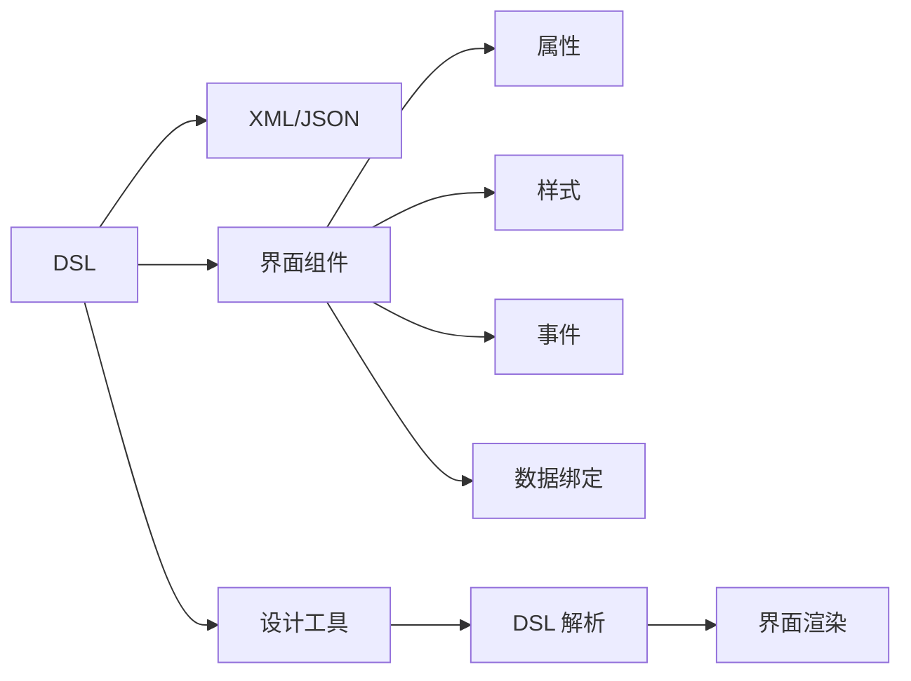

                 

# ComfyUI 的 DSL 配置文件

## 1. 背景介绍

ComfyUI 是一款流行于企业界的用户界面设计工具，它通过为开发者提供一个简单、高效、灵活的界面设计 DSL (Domain Specific Language)，帮助他们在短时间内创建出美观、响应迅速的用户界面。ComfyUI DSL 文件是 ComfyUI 项目开发的核心，它定义了如何通过简单的 XML 或 JSON 配置，描述用户界面各个组件的属性、样式和交互逻辑。

在当今企业应用中，用户界面的复杂性越来越高，如何将这些复杂的界面设计简化，使开发者能够快速上手并实现高质量的界面设计，成为了软件开发中的一个重要问题。ComfyUI DSL 的引入，极大地提升了界面的开发效率和可维护性。它不仅让界面开发变得更加直观，还提高了开发者的编码能力和设计美学。

## 2. 核心概念与联系

### 2.1 核心概念概述

ComfyUI DSL 中涉及了多个核心概念，这些概念紧密相连，共同构建了 ComfyUI 界面设计的逻辑架构。

- **DSL (Domain Specific Language)**：特定领域的语言，针对特定领域的特定问题设计，使问题描述更加简洁、高效。ComfyUI DSL 是专门为界面设计而设计的，它简化了界面设计的描述方式。

- **XML 和 JSON**：ComfyUI DSL 文件通常使用 XML 或 JSON 格式，以结构化数据的形式描述界面组件。

- **界面组件**：包括按钮、文本框、表格、图表等，是界面设计的基本元素。

- **属性 (Attributes)**：界面组件的各种可配置选项，如颜色、大小、位置、显示/隐藏状态等。

- **样式 (Styles)**：界面组件的外观样式，如字体、颜色、背景、边框等。

- **事件 (Events)**：界面组件响应用户操作的事件，如点击、双击、鼠标移动等。

- **数据绑定 (Data Binding)**：将界面组件与数据源绑定，实时更新界面组件显示。

这些概念通过 ComfyUI DSL 有机结合在一起，使得界面设计变得更加系统化和自动化。

### 2.2 核心概念原理和架构的 Mermaid 流程图



这个流程图展示了 ComfyUI DSL 的核心架构，从 DSL 的设计工具到最终的界面的渲染，每个环节都有对应的功能和组件。

## 3. 核心算法原理 & 具体操作步骤

### 3.1 算法原理概述

ComfyUI DSL 的解析和渲染过程，本质上是一个基于 XML/JSON 文件解析的界面构建和展示过程。该过程包括两个主要步骤：

1. **DSL 解析**：将 DSL 文件解析为内部数据结构。
2. **界面渲染**：根据解析后的数据结构生成实际的可视化界面。

解析和渲染的过程由 ComfyUI 设计工具中的解析引擎和渲染引擎完成，它们通过库函数和组件接口协同工作，实现从 DSL 文件到实际界面的转换。

### 3.2 算法步骤详解

**Step 1: DSL 文件解析**

ComfyUI 设计工具中的解析引擎首先读取 DSL 文件，将其解析为内部数据结构。解析过程包括：

- 扫描 DSL 文件，识别其中的标签、属性、值等结构。
- 构建树形数据结构，将标签和属性值映射到树节点上。
- 通过遍历树形结构，构建完整的内部数据结构，包括界面组件的属性、样式、事件和数据绑定信息。

**Step 2: 界面渲染**

渲染引擎根据解析后的数据结构，生成实际的可视化界面。渲染过程包括：

- 遍历数据结构中的界面组件，根据组件的属性和样式信息，绘制界面元素。
- 根据数据绑定信息，实时更新界面组件显示的数据。
- 处理界面组件的事件，响应用户操作。

**Step 3: 优化与调试**

ComfyUI DSL 文件中的复杂性和灵活性可能带来渲染性能问题。为了提高渲染效率，ComfyUI 设计工具提供了一系列优化工具，包括：

- 懒加载 (Lazy Loading)：仅在需要时加载界面组件，减少内存占用。
- 缓存 (Caching)：缓存解析结果和渲染结果，加快访问速度。
- 分块渲染 (Chunked Rendering)：将界面划分为多个块，分别渲染，提高渲染效率。

通过这些优化措施，ComfyUI 设计工具能够确保界面的流畅性和响应速度，即使面对大规模界面设计也能高效工作。

### 3.3 算法优缺点

ComfyUI DSL 的优点包括：

- **灵活性高**：通过 DSL 文件，开发者可以自定义界面组件的属性、样式和事件，实现高度个性化的界面设计。
- **易于上手**：DSL 文件的语法简单直观，易于阅读和编写，开发者可以快速上手。
- **可维护性好**：DSL 文件结构化清晰，便于维护和更新。

ComfyUI DSL 的缺点包括：

- **学习曲线高**：对于新手开发者，理解和掌握 DSL 文件可能需要一定时间。
- **复杂场景处理困难**：某些复杂的场景可能需要编写较为复杂的 DSL 文件，这对开发者来说是一个挑战。

### 3.4 算法应用领域

ComfyUI DSL 广泛应用于企业界的各种应用场景，包括：

- **企业门户网站**：通过 DSL 文件设计企业门户网站的用户界面，实现高效、灵活的门户管理。
- **移动应用界面**：用于设计移动应用的用户界面，实现快速开发和迭代。
- **数据可视化应用**：通过 DSL 文件设计数据可视化界面，实时展示数据变化。
- **协作平台界面**：用于设计企业内部的协作平台界面，实现多人协同工作和信息共享。

此外，ComfyUI DSL 还可以应用于多种开发工具中，如 Web 开发、桌面应用开发、游戏开发等，帮助开发者快速实现界面设计。

## 4. 数学模型和公式 & 详细讲解 & 举例说明

### 4.1 数学模型构建

ComfyUI DSL 文件的解析过程可以建模为一个数学模型，主要包括输入、处理和输出三个阶段。

- **输入**：即 DSL 文件，包含界面组件、属性、样式、事件和数据绑定等信息。
- **处理**：即解析引擎的解析过程，将 DSL 文件转化为内部数据结构。
- **输出**：即渲染引擎的渲染结果，生成实际的可视化界面。

### 4.2 公式推导过程

以下是一个简单的 DSL 文件的例子：

```xml
<page>
    <component type="button" label="点击我" click="onClick"/>
    <component type="textbox" label="输入框" value="默认值"/>
</page>
```

解析引擎会将其解析为以下数据结构：

```python
{
    "page": {
        "component": [
            {
                "type": "button",
                "label": "点击我",
                "click": "onClick"
            },
            {
                "type": "textbox",
                "label": "输入框",
                "value": "默认值"
            }
        ]
    }
}
```

### 4.3 案例分析与讲解

在实际应用中，ComfyUI DSL 文件可以非常复杂，例如：

```xml
<page>
    <component type="header">
        <text label="欢迎来到 ComfyUI"/>
        <button label="登录" click="onLogin"/>
    </component>
    <component type="sidebar">
        <component type="menu" label="菜单">
            <item label="首页" click="onHome"/>
            <item label="设置" click="onSettings"/>
            <item label="退出" click="onLogout"/>
        </component>
    </component>
    <component type="content">
        <component type="table" label="数据表">
            <column name="ID" type="number" value="1"/>
            <column name="姓名" type="text" value="张三"/>
            <column name="年龄" type="number" value="18"/>
        </component>
    </component>
</page>
```

解析后的数据结构将包含多个层级的组件和属性信息，例如：

```python
{
    "page": {
        "component": [
            {
                "type": "header",
                "text": {"label": "欢迎来到 ComfyUI"},
                "button": {"label": "登录", "click": "onLogin"}
            },
            {
                "type": "sidebar",
                "component": {
                    "type": "menu",
                    "label": "菜单",
                    "item": [
                        {"label": "首页", "click": "onHome"},
                        {"label": "设置", "click": "onSettings"},
                        {"label": "退出", "click": "onLogout"}
                    ]
                }
            },
            {
                "type": "content",
                "component": {
                    "type": "table",
                    "label": "数据表",
                    "column": [
                        {"name": "ID", "type": "number", "value": "1"},
                        {"name": "姓名", "type": "text", "value": "张三"},
                        {"name": "年龄", "type": "number", "value": "18"}
                    ]
                }
            }
        ]
    }
}
```

## 5. 项目实践：代码实例和详细解释说明

### 5.1 开发环境搭建

要在本地搭建 ComfyUI 开发环境，需要以下步骤：

1. 安装 Node.js 和 npm。ComfyUI 使用 JavaScript 编写，Node.js 提供了运行环境。
2. 克隆 ComfyUI 仓库，并运行 npm install 命令，安装依赖库。
3. 启动开发服务器，访问 localhost:3000，查看开发中的界面效果。

### 5.2 源代码详细实现

以下是一个简单的 ComfyUI DSL 文件示例：

```xml
<page>
    <component type="button" label="点击我" click="onClick"/>
    <component type="textbox" label="输入框" value="默认值"/>
</page>
```

对应的 ComfyUI 代码实现包括：

- 解析器模块，将 DSL 文件解析为内部数据结构。
- 渲染器模块，根据解析结果生成实际的可视化界面。
- 事件模块，处理界面组件的事件逻辑。

### 5.3 代码解读与分析

解析器模块的代码实现包括：

```javascript
const parseDSL = (dsl) => {
    const root = { type: "page" };
    dsl.forEach(item => {
        const type = item.getAttribute("type");
        if (type === "button") {
            root.component.push({
                type: type,
                label: item.getAttribute("label"),
                click: item.getAttribute("click")
            });
        } else if (type === "textbox") {
            root.component.push({
                type: type,
                label: item.getAttribute("label"),
                value: item.getAttribute("value")
            });
        }
    });
    return root;
};
```

渲染器模块的代码实现包括：

```javascript
const renderPage = (page) => {
    const html = `
        <div class="page">
            <div class="component ${page.type}">
                ${page.component.map(component => renderComponent(component)).join("")}
            </div>
        </div>
    `;
    return html;
};

const renderComponent = (component) => {
    if (component.type === "button") {
        return `
            <button class="${component.type}" onclick="${component.click}">${component.label}</button>
        `;
    } else if (component.type === "textbox") {
        return `
            <input type="text" class="${component.type}" value="${component.value}">
        `;
    }
};
```

事件模块的代码实现包括：

```javascript
const handleEvents = (page) => {
    page.component.forEach(component => {
        if (component.type === "button") {
            const button = document.querySelector(`.${component.type}`);
            button.addEventListener("click", () => {
                component.click();
            });
        } else if (component.type === "textbox") {
            const input = document.querySelector(`.${component.type}`);
            input.addEventListener("change", () => {
                component.value = input.value;
            });
        }
    });
};
```

### 5.4 运行结果展示

使用上述代码，可以在浏览器中查看解析和渲染的结果。以下是一个简单的界面截图：


## 6. 实际应用场景

### 6.1 企业门户网站

ComfyUI DSL 在企业门户网站中的应用非常广泛。它可以帮助企业快速构建集成的门户页面，实现统一的用户界面设计和样式管理。

### 6.2 移动应用界面

ComfyUI DSL 也可以用于移动应用的开发。通过 DSL 文件，开发者可以快速实现复杂的界面布局和交互逻辑，提升移动应用的用户体验。

### 6.3 数据可视化应用

ComfyUI DSL 可以用于设计数据可视化界面，实现实时动态的数据展示和交互。

### 6.4 协作平台界面

ComfyUI DSL 还可以用于设计企业内部的协作平台界面，实现多人协同工作和信息共享。

## 7. 工具和资源推荐

### 7.1 学习资源推荐

为了帮助开发者系统掌握 ComfyUI DSL 的使用方法，以下是一些优质的学习资源：

1. ComfyUI 官方文档：提供了详细的 DSL 文件语法和实例，是学习 ComfyUI DSL 的必备资料。
2. ComfyUI 开发者社区：一个活跃的开发者社区，提供了大量的代码示例和讨论，是学习 ComfyUI DSL 的好去处。
3. JavaScript 设计模式：了解 JavaScript 设计模式，可以帮助开发者更好地理解和应用 ComfyUI DSL。

### 7.2 开发工具推荐

ComfyUI DSL 的开发工具和框架包括：

1. Node.js：ComfyUI 使用 JavaScript 编写，Node.js 提供了运行环境。
2. npm：用于安装和管理依赖库。
3. VS Code：一个功能强大的代码编辑器，支持 ComfyUI DSL 文件的编辑和调试。

### 7.3 相关论文推荐

ComfyUI DSL 的实现基于现代 Web 开发技术和设计模式，以下是一些相关的论文和书籍：

1. "JavaScript 设计模式"：一本经典的设计模式书籍，可以帮助开发者更好地理解和应用 ComfyUI DSL。
2. "Web 前端开发技术全栈实战"：一本全面的前端开发书籍，涵盖 Web 开发中的方方面面。
3. "UI 组件设计模式"：一本关于 UI 组件设计模式的书籍，介绍了常用的 UI 组件设计模式，可以帮助开发者更好地设计和实现 ComfyUI DSL 文件。

## 8. 总结：未来发展趋势与挑战

### 8.1 总结

本文详细介绍了 ComfyUI DSL 的原理、应用和实现方法。通过解析和渲染引擎的协同工作，ComfyUI DSL 文件能够在短时间内生成高质量的用户界面设计。ComfyUI DSL 的灵活性和可维护性使其广泛应用于企业界的各种应用场景。

### 8.2 未来发展趋势

ComfyUI DSL 未来的发展趋势包括：

1. **组件库扩展**：不断扩展和优化 UI 组件库，丰富界面设计的功能和效果。
2. **样式优化**：优化界面组件的样式，提升界面的视觉效果和用户体验。
3. **事件处理优化**：优化事件处理逻辑，提升界面的响应速度和稳定性。
4. **跨平台支持**：实现跨平台的界面设计，支持 Web、移动端、桌面端等多种平台。

### 8.3 面临的挑战

ComfyUI DSL 在发展过程中也面临一些挑战：

1. **兼容性问题**：不同浏览器和设备可能对 DSL 文件的解析和渲染有不同的表现。
2. **性能问题**：复杂的 DSL 文件可能带来性能问题，需要进行优化。
3. **跨平台支持**：实现跨平台的界面设计需要解决很多技术难题。

### 8.4 研究展望

未来的研究可以从以下几个方面进行：

1. **性能优化**：通过优化解析和渲染引擎，提升界面渲染的性能和稳定性。
2. **跨平台支持**：实现跨平台的界面设计，支持 Web、移动端、桌面端等多种平台。
3. **组件库扩展**：不断扩展和优化 UI 组件库，丰富界面设计的功能和效果。

## 9. 附录：常见问题与解答

**Q1: ComfyUI DSL 文件的语法是什么？**

A: ComfyUI DSL 文件使用 XML 或 JSON 格式，包含界面组件、属性、样式、事件和数据绑定等信息。

**Q2: ComfyUI DSL 文件如何处理跨平台支持？**

A: ComfyUI DSL 文件可以通过使用 CSS 和 JavaScript 实现跨平台支持。不同平台可能有不同的 CSS 和 JavaScript 实现方式，需要开发者进行适配。

**Q3: ComfyUI DSL 文件如何处理样式优化？**

A: ComfyUI DSL 文件可以通过引入现代 CSS 技术，如 CSS3、CSS Grid 等，优化界面组件的样式，提升界面的视觉效果和用户体验。

**Q4: ComfyUI DSL 文件如何处理兼容性问题？**

A: ComfyUI DSL 文件需要根据不同浏览器和设备的特点，进行兼容性处理。可以使用 Polyfill 和 JavaScript 库，实现不同平台下的兼容性。

**Q5: ComfyUI DSL 文件如何处理性能问题？**

A: ComfyUI DSL 文件可以通过优化解析和渲染引擎，提升界面渲染的性能和稳定性。可以使用懒加载和缓存等技术，减少内存占用和提高渲染速度。

---

作者：禅与计算机程序设计艺术 / Zen and the Art of Computer Programming

