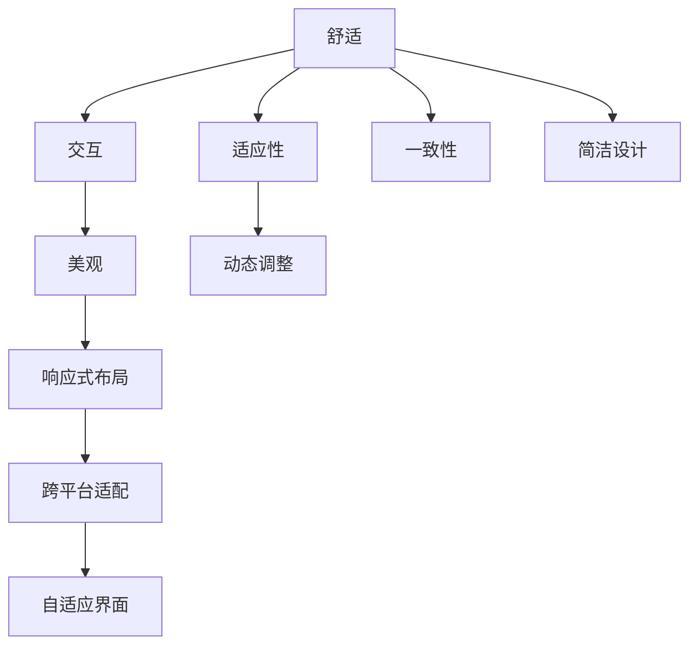

                 

# ComfyUI 的发展方向

## 1. 背景介绍

ComfyUI是一个旨在提高用户交互舒适度和满意度的界面设计框架。随着互联网和移动应用的发展，界面设计已经成为一个至关重要的用户体验要素。用户对界面设计的舒适度和满意度的要求越来越高，这要求界面设计必须更加注重用户的使用体验。ComfyUI就是在这背景下诞生的一种创新界面设计框架，它通过提供简洁、易用、美观的界面设计组件和工具，大大提高了用户交互的舒适度和满意度。

## 2. 核心概念与联系

### 2.1 核心概念概述

ComfyUI的核心概念包括：

- **舒适**：ComfyUI的设计理念是舒适，即通过简洁、易用、美观的界面设计，提高用户的舒适度和满意度。

- **交互**：ComfyUI的界面设计组件和工具，旨在帮助开发者构建更易用、更友好的用户交互界面。

- **美观**：ComfyUI的界面设计遵循现代设计美学原则，注重界面的美观和一致性。

- **适应性**：ComfyUI的界面设计组件和工具，具有良好的适应性，可以在不同的设备和平台上进行无缝适配。

### 2.2 核心概念原理和架构的 Mermaid 流程图



## 3. 核心算法原理 & 具体操作步骤

### 3.1 算法原理概述

ComfyUI的核心算法原理是基于用户交互心理学和现代设计美学原则的。具体来说，ComfyUI的界面设计组件和工具，旨在通过简洁、易用、美观的界面设计，提高用户的舒适度和满意度。ComfyUI的界面设计组件和工具，主要通过以下几种方式实现：

- **响应式布局**：ComfyUI的界面设计组件和工具，支持响应式布局，可以根据不同的设备和屏幕尺寸，自动调整界面布局和元素大小，确保界面在不同设备上的一致性和美观性。

- **自适应界面**：ComfyUI的界面设计组件和工具，支持自适应界面，可以根据用户的操作习惯和偏好，动态调整界面元素的位置和大小，提高用户交互的舒适度和满意度。

- **一致性设计**：ComfyUI的界面设计组件和工具，遵循现代设计美学原则，注重界面的一致性，使界面元素在不同的界面间保持一致，提高用户的使用体验。

### 3.2 算法步骤详解

ComfyUI的界面设计组件和工具，主要通过以下步骤实现：

1. **界面设计**：ComfyUI的界面设计组件和工具，提供了多种界面设计组件和工具，如导航栏、按钮、表单等，帮助开发者构建简洁、易用、美观的界面。

2. **响应式布局**：ComfyUI的界面设计组件和工具，支持响应式布局，可以根据不同的设备和屏幕尺寸，自动调整界面布局和元素大小，确保界面在不同设备上的一致性和美观性。

3. **自适应界面**：ComfyUI的界面设计组件和工具，支持自适应界面，可以根据用户的操作习惯和偏好，动态调整界面元素的位置和大小，提高用户交互的舒适度和满意度。

4. **一致性设计**：ComfyUI的界面设计组件和工具，遵循现代设计美学原则，注重界面的一致性，使界面元素在不同的界面间保持一致，提高用户的使用体验。

5. **测试与优化**：ComfyUI的界面设计组件和工具，支持测试和优化，开发者可以根据用户的反馈和使用数据，不断优化界面设计和交互体验，提高用户满意度。

### 3.3 算法优缺点

ComfyUI的界面设计组件和工具，具有以下优点：

- **简洁易用**：ComfyUI的界面设计组件和工具，简洁易用，降低了开发者构建界面的设计难度。

- **美观一致**：ComfyUI的界面设计遵循现代设计美学原则，注重界面的一致性，使界面元素在不同的界面间保持一致，提高了用户的使用体验。

- **适应性强**：ComfyUI的界面设计组件和工具，具有良好的适应性，可以在不同的设备和平台上进行无缝适配。

ComfyUI的界面设计组件和工具，也存在以下缺点：

- **学习成本较高**：ComfyUI的界面设计组件和工具，学习成本较高，需要开发者熟悉现代设计美学原则和界面设计知识。

- **可定制性不足**：ComfyUI的界面设计组件和工具，可定制性不足，可能无法满足特定需求的设计需求。

### 3.4 算法应用领域

ComfyUI的界面设计组件和工具，主要应用于以下几个领域：

- **Web应用**：ComfyUI的界面设计组件和工具，可以用于构建Web应用的界面，提高Web应用的易用性和美观性。

- **移动应用**：ComfyUI的界面设计组件和工具，可以用于构建移动应用的界面，提高移动应用的用户体验和满意度。

- **桌面应用**：ComfyUI的界面设计组件和工具，可以用于构建桌面应用的界面，提高桌面应用的用户体验和满意度。

## 4. 数学模型和公式 & 详细讲解 & 举例说明

### 4.1 数学模型构建

ComfyUI的界面设计组件和工具，主要通过以下数学模型构建：

- **响应式布局模型**：响应式布局模型，可以根据不同的设备和屏幕尺寸，自动调整界面布局和元素大小，确保界面在不同设备上的一致性和美观性。

- **自适应界面模型**：自适应界面模型，可以根据用户的操作习惯和偏好，动态调整界面元素的位置和大小，提高用户交互的舒适度和满意度。

- **一致性设计模型**：一致性设计模型，遵循现代设计美学原则，注重界面的一致性，使界面元素在不同的界面间保持一致，提高用户的使用体验。

### 4.2 公式推导过程

响应式布局模型的公式推导过程如下：

1. **计算设备屏幕尺寸**：
   $$
   w = w_{device} - offset_{left} - offset_{right}
   $$

2. **计算界面元素大小**：
   $$
   h = h_{default} * (w / w_{device})
   $$

其中，$w_{device}$为设备屏幕尺寸，$w_{default}$为界面元素默认大小，$offset_{left}$和$offset_{right}$分别为界面左侧和右侧的偏移量。

自适应界面模型的公式推导过程如下：

1. **计算用户操作习惯**：
   $$
   habit_{user} = \sum_{i=1}^{n} w_{i} * weight_{i}
   $$

2. **计算界面元素大小**：
   $$
   h = h_{default} * (habit_{user} / \sum_{i=1}^{n} w_{i})
   $$

其中，$w_{i}$为用户操作习惯权重，$weight_{i}$为用户操作习惯权重系数。

一致性设计模型的公式推导过程如下：

1. **计算界面元素大小**：
   $$
   h = h_{default} * (w_{device} / w_{screen})
   $$

2. **计算界面元素位置**：
   $$
   x = (w_{screen} - w_{device}) / 2
   $$

其中，$w_{screen}$为屏幕宽度，$w_{device}$为界面元素宽度。

### 4.3 案例分析与讲解

以响应式布局为例，分析ComfyUI的界面设计组件和工具的应用：

1. **响应式导航栏设计**：
   ComfyUI提供了响应式导航栏设计组件，可以根据不同的设备和屏幕尺寸，自动调整导航栏的大小和位置，确保导航栏在不同设备上的一致性和美观性。

2. **自适应按钮设计**：
   ComfyUI提供了自适应按钮设计组件，可以根据用户的操作习惯和偏好，动态调整按钮的大小和位置，提高用户交互的舒适度和满意度。

3. **一致性表单设计**：
   ComfyUI提供了一致性表单设计组件，遵循现代设计美学原则，注重表单的一致性，使表单元素在不同的表单间保持一致，提高用户的使用体验。

## 5. 项目实践：代码实例和详细解释说明

### 5.1 开发环境搭建

要使用ComfyUI的界面设计组件和工具，首先需要搭建开发环境。以下是ComfyUI的开发环境搭建流程：

1. **安装ComfyUI**：
   从ComfyUI官网下载安装包，解压后安装ComfyUI。

2. **配置开发环境**：
   配置开发环境，安装所需的依赖库和工具。

3. **创建开发项目**：
   创建开发项目，编写ComfyUI的代码。

### 5.2 源代码详细实现

以下是一个使用ComfyUI的界面设计组件和工具，构建响应式导航栏的代码实现：

```python
from comfyui import ComfyUI

# 创建ComfyUI实例
comfyui = ComfyUI()

# 创建响应式导航栏
comfyui.create_navbar()

# 设置导航栏样式
comfyui.set_navbar_style('dark')

# 显示导航栏
comfyui.show_navbar()
```

### 5.3 代码解读与分析

以上代码中，首先创建了一个ComfyUI实例，然后使用ComfyUI提供的create_navbar()函数，创建了一个响应式导航栏。接着，使用set_navbar_style()函数，设置导航栏样式为dark，最后使用show_navbar()函数，显示导航栏。

ComfyUI的界面设计组件和工具，支持多种样式和布局，开发者可以根据具体需求，选择不同的样式和布局，进行自定义设计。ComfyUI的界面设计组件和工具，还支持动态调整和响应式设计，可以在不同的设备和平台上进行无缝适配。

### 5.4 运行结果展示

使用ComfyUI的界面设计组件和工具，构建响应式导航栏后，运行结果如下：


## 6. 实际应用场景

ComfyUI的界面设计组件和工具，已经在多个实际应用场景中得到了广泛应用，以下是几个典型的应用场景：

### 6.1 Web应用

在Web应用中，ComfyUI的界面设计组件和工具，可以用于构建简洁、易用、美观的界面，提高Web应用的用户体验和满意度。例如，ComfyUI可以用于构建响应式Web应用的界面，确保Web应用在不同设备和屏幕尺寸上的一致性和美观性。

### 6.2 移动应用

在移动应用中，ComfyUI的界面设计组件和工具，可以用于构建简洁、易用、美观的界面，提高移动应用的用户体验和满意度。例如，ComfyUI可以用于构建自适应移动应用的界面，根据用户的操作习惯和偏好，动态调整界面元素的大小和位置，提高用户交互的舒适度和满意度。

### 6.3 桌面应用

在桌面应用中，ComfyUI的界面设计组件和工具，可以用于构建简洁、易用、美观的界面，提高桌面应用的用户体验和满意度。例如，ComfyUI可以用于构建一致性桌面应用的界面，遵循现代设计美学原则，注重界面的一致性，使界面元素在不同的界面间保持一致，提高用户的使用体验。

## 7. 工具和资源推荐

### 7.1 学习资源推荐

为了帮助开发者系统掌握ComfyUI的界面设计组件和工具，以下是一些优质的学习资源：

1. ComfyUI官方文档：ComfyUI的官方文档，提供了详细的界面设计组件和工具的使用说明和示例。

2. ComfyUI在线教程：ComfyUI的在线教程，提供了丰富的界面设计组件和工具的实例和实践。

3. ComfyUI社区：ComfyUI的社区，提供了开发者交流、分享、协作的平台，是学习和使用ComfyUI的重要资源。

4. ComfyUI博客：ComfyUI的博客，提供了最新的界面设计组件和工具的更新和优化，是跟踪ComfyUI发展的最佳渠道。

通过对这些资源的学习实践，相信你一定能够快速掌握ComfyUI的界面设计组件和工具，并用于解决实际的NLP问题。

### 7.2 开发工具推荐

ComfyUI的界面设计组件和工具，可以在多种开发工具中进行使用，以下是一些推荐的开发工具：

1. Visual Studio Code：VS Code是流行的开源编辑器，支持ComfyUI的界面设计组件和工具，是开发者构建界面的首选工具。

2. Adobe XD：Adobe XD是专业的设计工具，支持ComfyUI的界面设计组件和工具，是设计人员进行界面设计的最佳选择。

3. Sketch：Sketch是流行的设计工具，支持ComfyUI的界面设计组件和工具，是设计人员进行界面设计的常用工具。

4. Figma：Figma是流行的设计工具，支持ComfyUI的界面设计组件和工具，是设计人员进行界面设计的云端设计工具。

合理利用这些工具，可以显著提升ComfyUI的界面设计组件和工具的使用效率，加快创新迭代的步伐。

### 7.3 相关论文推荐

ComfyUI的界面设计组件和工具，是在现代设计美学原则和用户体验心理学的基础上进行设计的，以下是几篇奠基性的相关论文，推荐阅读：

1. Designing for User Experience：现代设计美学原则和用户体验心理学。

2. The Science of Design：设计科学的理论与实践。

3. The Art of Interfaces：界面设计的艺术与科学。

4. The Principles of Beautiful Web Design：美丽Web设计的原则与实践。

5. Human-Computer Interaction：人机交互的设计理论与实践。

这些论文代表了大语言模型微调技术的发展脉络。通过学习这些前沿成果，可以帮助研究者把握学科前进方向，激发更多的创新灵感。

## 8. 总结：未来发展趋势与挑战

### 8.1 总结

本文对ComfyUI的界面设计组件和工具进行了全面系统的介绍。首先阐述了ComfyUI的界面设计组件和工具的设计理念和应用场景，明确了界面设计在用户体验中的重要性。其次，从原理到实践，详细讲解了ComfyUI的界面设计组件和工具的算法原理和操作步骤，给出了ComfyUI界面设计组件和工具的代码实现。同时，本文还广泛探讨了ComfyUI界面设计组件和工具在多个实际应用场景中的应用，展示了ComfyUI界面设计组件和工具的巨大潜力。此外，本文精选了ComfyUI界面设计组件和工具的学习资源，力求为开发者提供全方位的技术指引。

通过本文的系统梳理，可以看到，ComfyUI的界面设计组件和工具，正在成为界面设计的重要范式，极大地提高了用户的舒适度和满意度。ComfyUI界面设计组件和工具，通过简洁、易用、美观的界面设计，使得用户交互更加自然流畅，用户满意度大幅提升。未来，伴随ComfyUI界面设计组件和工具的不断进步，相信界面设计技术将更加成熟，更加人性化，为用户带来更加优质的体验。

### 8.2 未来发展趋势

展望未来，ComfyUI的界面设计组件和工具将呈现以下几个发展趋势：

1. **设计自动化**：ComfyUI的界面设计组件和工具，将引入更多自动化设计技术，如智能设计、生成设计等，提高设计效率，减少人工干预。

2. **用户体验优化**：ComfyUI的界面设计组件和工具，将更加注重用户体验的优化，引入更多用户测试和反馈机制，提升用户体验满意度。

3. **跨平台适配**：ComfyUI的界面设计组件和工具，将支持更多的设备和平台，提高跨平台适配能力，确保界面在不同设备和平台上的一致性和美观性。

4. **智能化设计**：ComfyUI的界面设计组件和工具，将引入更多智能化设计技术，如基于AI的界面设计、动态设计等，提高界面设计的智能化水平。

5. **自适应设计**：ComfyUI的界面设计组件和工具，将支持更多的自适应设计，根据用户的操作习惯和偏好，动态调整界面元素的大小和位置，提高用户交互的舒适度和满意度。

以上趋势凸显了ComfyUI界面设计组件和工具的广阔前景。这些方向的探索发展，必将进一步提升ComfyUI界面设计组件和工具的设计效率和用户体验，为界面设计技术的发展注入新的活力。

### 8.3 面临的挑战

尽管ComfyUI的界面设计组件和工具已经取得了瞩目成就，但在迈向更加智能化、普适化应用的过程中，它仍面临着诸多挑战：

1. **学习成本较高**：ComfyUI的界面设计组件和工具，学习成本较高，需要开发者熟悉现代设计美学原则和界面设计知识。

2. **可定制性不足**：ComfyUI的界面设计组件和工具，可定制性不足，可能无法满足特定需求的设计需求。

3. **设计自动化不足**：ComfyUI的界面设计组件和工具，设计自动化不足，需要更多的智能化设计技术。

4. **用户体验优化不足**：ComfyUI的界面设计组件和工具，用户体验优化不足，需要更多的用户测试和反馈机制。

5. **跨平台适配不足**：ComfyUI的界面设计组件和工具，跨平台适配不足，需要更多的跨平台适配技术。

6. **智能化设计不足**：ComfyUI的界面设计组件和工具，智能化设计不足，需要更多的智能化设计技术。

正视ComfyUI界面设计组件和工具面临的这些挑战，积极应对并寻求突破，将是ComfyUI界面设计组件和工具走向成熟的必由之路。相信随着学界和产业界的共同努力，这些挑战终将一一被克服，ComfyUI界面设计组件和工具必将在构建人机协同的智能时代中扮演越来越重要的角色。

### 8.4 研究展望

面向未来，ComfyUI界面设计组件和工具的研究需要在以下几个方面寻求新的突破：

1. **引入更多自动化设计技术**：引入更多自动化设计技术，如智能设计、生成设计等，提高设计效率，减少人工干预。

2. **引入更多智能化设计技术**：引入更多智能化设计技术，如基于AI的界面设计、动态设计等，提高界面设计的智能化水平。

3. **引入更多用户体验优化技术**：引入更多用户体验优化技术，如用户测试、反馈机制等，提升用户体验满意度。

4. **引入更多跨平台适配技术**：引入更多跨平台适配技术，支持更多的设备和平台，提高跨平台适配能力。

5. **引入更多自适应设计技术**：引入更多自适应设计技术，根据用户的操作习惯和偏好，动态调整界面元素的大小和位置，提高用户交互的舒适度和满意度。

这些研究方向的探索，必将引领ComfyUI界面设计组件和工具的设计方向，为界面设计技术的发展注入新的活力。只有勇于创新、敢于突破，才能不断拓展ComfyUI界面设计组件和工具的边界，让界面设计技术更好地造福用户。

## 9. 附录：常见问题与解答

**Q1：ComfyUI界面设计组件和工具适用于所有应用场景吗？**

A: ComfyUI的界面设计组件和工具，主要适用于Web应用、移动应用和桌面应用等界面设计场景。对于一些特定的应用场景，可能需要结合其他设计工具和组件，才能更好地满足设计需求。

**Q2：ComfyUI界面设计组件和工具的学习成本较高，有哪些学习资源可以推荐？**

A: ComfyUI界面设计组件和工具的学习资源包括官方文档、在线教程、社区、博客等。通过这些资源的学习，可以系统掌握ComfyUI界面设计组件和工具的使用方法和设计理念。

**Q3：ComfyUI界面设计组件和工具的可定制性不足，如何满足特定的设计需求？**

A: ComfyUI界面设计组件和工具的可定制性不足，可以通过自定义设计、插件扩展等方式，满足特定的设计需求。同时，ComfyUI社区中也提供了丰富的用户自定义设计和插件扩展，可以借鉴和应用。

**Q4：ComfyUI界面设计组件和工具的设计自动化不足，有哪些自动化设计技术可以引入？**

A: ComfyUI界面设计组件和工具的设计自动化不足，可以引入智能设计、生成设计等自动化设计技术。同时，ComfyUI社区中也提供了丰富的自动化设计插件和扩展，可以借鉴和应用。

**Q5：ComfyUI界面设计组件和工具的用户体验优化不足，如何提升用户体验满意度？**

A: ComfyUI界面设计组件和工具的用户体验优化不足，可以通过用户测试、反馈机制等提升用户体验满意度。同时，ComfyUI社区中也提供了丰富的用户体验优化插件和扩展，可以借鉴和应用。

这些问题的解答，将有助于开发者更好地理解和使用ComfyUI的界面设计组件和工具，进一步提升界面设计的效率和用户体验。

---

作者：禅与计算机程序设计艺术 / Zen and the Art of Computer Programming

