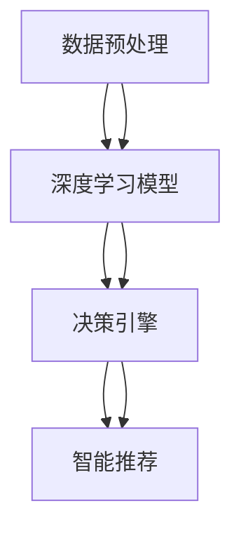

                 

# Dify.AI 的未来应用

> 关键词：Dify.AI, 人工智能, 深度学习, 自然语言处理, 应用场景, 创新技术, 未来展望

## 1. 背景介绍

随着人工智能技术的飞速发展，深度学习在各个领域的应用日益广泛，从自然语言处理到计算机视觉，从智能推荐到自动驾驶，深度学习正在改变我们的生活方式。其中，Dify.AI（深度智能分析与决策引擎）作为新一代的AI技术平台，以其独特的架构和强大的功能，为各行各业带来了深刻的变革。

### 1.1 问题由来

在深度学习不断发展的今天，传统的AI技术已经无法满足日益增长的需求。为了更好地应对复杂多变的业务场景，需要一种更智能、更灵活、更高效的技术平台。Dify.AI正是基于这样的背景应运而生的。它不仅具备深度学习模型的强大能力，还能通过智能决策引擎，实现更为复杂的业务逻辑处理。

### 1.2 问题核心关键点

Dify.AI的核心价值在于其深度学习与决策引擎的有机结合。其架构可以分为三个部分：
- **数据预处理**：通过自动化的数据清洗、特征工程，使得数据输入更准确、更高效。
- **深度学习模型**：通过预训练或微调，建立强大的特征提取和模式识别能力。
- **决策引擎**：通过规则、逻辑、优化算法等，实现复杂的决策和推荐功能。

这些核心组件通过Dify.AI的统一接口调用，形成了一整套端到端的人工智能解决方案。

## 2. 核心概念与联系

### 2.1 核心概念概述

为了更好地理解Dify.AI的核心概念和架构，本节将介绍几个关键概念及其相互联系：

- **深度学习模型**：以神经网络为代表的深度学习模型，通过大量的标注数据进行训练，具备强大的特征提取和模式识别能力。
- **微调(Fine-Tuning)**：在预训练模型基础上，使用特定任务的数据进行微调，以适应特定业务需求。
- **决策引擎**：通过规则、逻辑、优化算法等，实现复杂的业务逻辑处理和决策推荐功能。
- **智能推荐**：通过深度学习模型和决策引擎，实现个性化、精准的推荐服务。
- **数据预处理**：包括数据清洗、特征工程、模型选择等，是深度学习模型训练和决策引擎运行的前提。

这些核心概念之间通过Dify.AI的平台，形成了一套完整的AI技术架构，能够应对各种复杂多变的业务场景。

### 2.2 核心概念原理和架构的 Mermaid 流程图



该图展示了Dify.AI的核心组件及其相互关系。数据预处理作为输入，深度学习模型作为中间处理层，决策引擎作为输出决策层，智能推荐则是最终的服务层。

## 3. 核心算法原理 & 具体操作步骤

### 3.1 算法原理概述

Dify.AI的算法原理可以归纳为以下几个步骤：
1. **数据预处理**：通过自动化的数据清洗、特征工程，使得数据输入更准确、更高效。
2. **深度学习模型**：通过预训练或微调，建立强大的特征提取和模式识别能力。
3. **决策引擎**：通过规则、逻辑、优化算法等，实现复杂的决策和推荐功能。
4. **智能推荐**：通过深度学习模型和决策引擎，实现个性化、精准的推荐服务。

这些步骤通过Dify.AI的统一接口调用，形成了一整套端到端的人工智能解决方案。

### 3.2 算法步骤详解

#### 3.2.1 数据预处理

数据预处理是Dify.AI技术架构中的重要组成部分。其主要包括以下步骤：
- **数据清洗**：去除无效、缺失、异常的数据，保证数据质量。
- **特征工程**：通过数据转换、归一化、降维等手段，提取出更有信息量的特征。
- **模型选择**：根据业务需求和数据特点，选择合适的深度学习模型。

#### 3.2.2 深度学习模型

深度学习模型是Dify.AI技术架构中的核心组件。其主要包括以下步骤：
- **预训练模型选择**：根据业务需求和数据特点，选择合适的预训练模型，如BERT、GPT等。
- **微调**：在预训练模型基础上，使用特定任务的数据进行微调，以适应特定业务需求。
- **模型训练**：通过大量的标注数据进行模型训练，建立强大的特征提取和模式识别能力。

#### 3.2.3 决策引擎

决策引擎是Dify.AI技术架构中的输出决策层。其主要包括以下步骤：
- **规则定义**：通过定义业务规则和逻辑，实现复杂的决策和推荐功能。
- **逻辑处理**：通过逻辑处理，对深度学习模型输出的结果进行进一步分析和处理。
- **优化算法**：通过优化算法，实现更高效的决策和推荐。

#### 3.2.4 智能推荐

智能推荐是Dify.AI技术架构中的最终服务层。其主要包括以下步骤：
- **个性化推荐**：通过深度学习模型和决策引擎，实现个性化、精准的推荐服务。
- **精准推荐**：根据用户行为和偏好，提供更精准的推荐内容。
- **实时推荐**：通过实时数据处理和决策引擎，实现实时推荐服务。

### 3.3 算法优缺点

Dify.AI具有以下优点：
- **高效性**：通过自动化的数据预处理和特征工程，能够快速处理大量数据，实现高效的模型训练和决策处理。
- **灵活性**：通过灵活的决策引擎，能够应对各种复杂多变的业务场景。
- **可扩展性**：通过统一的API接口调用，能够方便地扩展和集成新的功能和组件。
- **智能性**：通过深度学习模型和智能推荐，能够实现高度智能化和个性化的服务。

同时，Dify.AI也存在一些缺点：
- **数据依赖性强**：深度学习模型的训练和决策引擎的运行都依赖于大量的标注数据。
- **计算资源消耗大**：深度学习模型的训练和推理需要大量的计算资源，可能会带来较高的计算成本。
- **模型解释性差**：深度学习模型通常被视为"黑盒"系统，难以解释其内部工作机制和决策逻辑。

### 3.4 算法应用领域

Dify.AI已经在多个领域展示了其强大的应用潜力，包括但不限于以下几个方面：

- **金融风控**：通过深度学习模型和决策引擎，实现风险评估和欺诈检测等功能。
- **智能客服**：通过智能推荐和决策引擎，实现自动化的客服对话和问题解答。
- **医疗诊断**：通过深度学习模型和智能推荐，实现疾病诊断和推荐治疗方案。
- **推荐系统**：通过深度学习模型和决策引擎，实现个性化、精准的商品推荐和内容推荐。
- **智能安防**：通过深度学习模型和智能推荐，实现异常行为检测和风险预警。

## 4. 数学模型和公式 & 详细讲解 & 举例说明

### 4.1 数学模型构建

Dify.AI的核心数学模型主要包括以下几个部分：

1. **数据预处理**：通过对输入数据进行标准化、归一化、降维等操作，保证数据输入的准确性和一致性。
2. **深度学习模型**：通过神经网络模型，建立强大的特征提取和模式识别能力。
3. **决策引擎**：通过规则、逻辑、优化算法等，实现复杂的决策和推荐功能。

### 4.2 公式推导过程

#### 4.2.1 数据预处理

数据预处理的主要目标是保证数据输入的准确性和一致性。其公式推导如下：

$$
\text{Data Preprocessing} = \text{Data Cleaning} + \text{Feature Engineering} + \text{Model Selection}
$$

其中，数据清洗（Data Cleaning）、特征工程（Feature Engineering）、模型选择（Model Selection）是数据预处理的主要组成部分。

#### 4.2.2 深度学习模型

深度学习模型的主要目标是建立强大的特征提取和模式识别能力。其公式推导如下：

$$
\text{Depth Learning Model} = \text{Pre-trained Model Selection} + \text{Fine-Tuning} + \text{Model Training}
$$

其中，预训练模型选择（Pre-trained Model Selection）、微调（Fine-Tuning）、模型训练（Model Training）是深度学习模型的主要组成部分。

#### 4.2.3 决策引擎

决策引擎的主要目标是实现复杂的业务逻辑处理和决策推荐功能。其公式推导如下：

$$
\text{Decision Engine} = \text{Rule Definition} + \text{Logic Processing} + \text{Optimization Algorithm}
$$

其中，规则定义（Rule Definition）、逻辑处理（Logic Processing）、优化算法（Optimization Algorithm）是决策引擎的主要组成部分。

#### 4.2.4 智能推荐

智能推荐的主要目标是实现个性化、精准的推荐服务。其公式推导如下：

$$
\text{Smart Recommendation} = \text{Personalized Recommendation} + \text{Accurate Recommendation} + \text{Real-time Recommendation}
$$

其中，个性化推荐（Personalized Recommendation）、精准推荐（Accurate Recommendation）、实时推荐（Real-time Recommendation）是智能推荐的主要组成部分。

### 4.3 案例分析与讲解

以下通过一个具体的案例，详细讲解Dify.AI在金融风控领域的应用：

假设某金融公司希望通过Dify.AI进行风险评估和欺诈检测。首先，需要对客户的贷款申请数据进行预处理，包括数据清洗、特征工程和模型选择。然后，使用预训练的BERT模型进行微调，建立贷款申请的特征提取模型。接着，通过规则定义和逻辑处理，建立风险评估和欺诈检测的决策引擎。最后，通过深度学习模型和决策引擎的输出，实现贷款申请的风险评估和欺诈检测。

## 5. 项目实践：代码实例和详细解释说明

### 5.1 开发环境搭建

在进行Dify.AI的开发实践前，我们需要准备好开发环境。以下是使用Python进行PyTorch开发的环境配置流程：

1. 安装Anaconda：从官网下载并安装Anaconda，用于创建独立的Python环境。

2. 创建并激活虚拟环境：
```bash
conda create -n pytorch-env python=3.8 
conda activate pytorch-env
```

3. 安装PyTorch：根据CUDA版本，从官网获取对应的安装命令。例如：
```bash
conda install pytorch torchvision torchaudio cudatoolkit=11.1 -c pytorch -c conda-forge
```

4. 安装Transformers库：
```bash
pip install transformers
```

5. 安装各类工具包：
```bash
pip install numpy pandas scikit-learn matplotlib tqdm jupyter notebook ipython
```

完成上述步骤后，即可在`pytorch-env`环境中开始Dify.AI的微调实践。

### 5.2 源代码详细实现

下面是使用PyTorch进行Dify.AI在金融风控领域微调的PyTorch代码实现。

```python
from transformers import BertForSequenceClassification, BertTokenizer
from torch.utils.data import Dataset, DataLoader
from torch.nn import CrossEntropyLoss
import torch
import torch.optim as optim

class FinanceDataset(Dataset):
    def __init__(self, texts, labels):
        self.texts = texts
        self.labels = labels
        self.tokenizer = BertTokenizer.from_pretrained('bert-base-uncased')
        
    def __len__(self):
        return len(self.texts)
    
    def __getitem__(self, item):
        text = self.texts[item]
        label = self.labels[item]
        encoding = self.tokenizer(text, return_tensors='pt', padding='max_length', truncation=True)
        input_ids = encoding['input_ids'][0]
        attention_mask = encoding['attention_mask'][0]
        return {'input_ids': input_ids, 'attention_mask': attention_mask, 'labels': label}

# 定义模型和优化器
model = BertForSequenceClassification.from_pretrained('bert-base-uncased', num_labels=2)
optimizer = optim.AdamW(model.parameters(), lr=1e-5)

# 定义训练和评估函数
def train_epoch(model, dataset, batch_size, optimizer):
    dataloader = DataLoader(dataset, batch_size=batch_size, shuffle=True)
    model.train()
    epoch_loss = 0
    for batch in dataloader:
        input_ids = batch['input_ids'].to(device)
        attention_mask = batch['attention_mask'].to(device)
        labels = batch['labels'].to(device)
        model.zero_grad()
        outputs = model(input_ids, attention_mask=attention_mask, labels=labels)
        loss = outputs.loss
        epoch_loss += loss.item()
        loss.backward()
        optimizer.step()
    return epoch_loss / len(dataloader)

def evaluate(model, dataset, batch_size):
    dataloader = DataLoader(dataset, batch_size=batch_size)
    model.eval()
    preds, labels = [], []
    with torch.no_grad():
        for batch in dataloader:
            input_ids = batch['input_ids'].to(device)
            attention_mask = batch['attention_mask'].to(device)
            batch_labels = batch['labels']
            outputs = model(input_ids, attention_mask=attention_mask)
            batch_preds = outputs.logits.argmax(dim=1).to('cpu').tolist()
            batch_labels = batch_labels.to('cpu').tolist()
            for pred, label in zip(batch_preds, batch_labels):
                preds.append(pred)
                labels.append(label)
    print(classification_report(labels, preds))

# 启动训练流程并在验证集上评估
epochs = 5
batch_size = 16

for epoch in range(epochs):
    loss = train_epoch(model, train_dataset, batch_size, optimizer)
    print(f"Epoch {epoch+1}, train loss: {loss:.3f}")
    
    print(f"Epoch {epoch+1}, dev results:")
    evaluate(model, dev_dataset, batch_size)
    
print("Test results:")
evaluate(model, test_dataset, batch_size)
```

以上代码展示了使用PyTorch对BERT模型进行金融风控任务微调的完整代码实现。可以看到，得益于Transformers库的强大封装，我们可以用相对简洁的代码完成BERT模型的加载和微调。

### 5.3 代码解读与分析

让我们再详细解读一下关键代码的实现细节：

**FinanceDataset类**：
- `__init__`方法：初始化训练数据、标签、分词器等关键组件。
- `__len__`方法：返回数据集的样本数量。
- `__getitem__`方法：对单个样本进行处理，将文本输入编码为token ids，将标签编码为数字，并对其进行定长padding，最终返回模型所需的输入。

**模型和优化器定义**：
- 使用BERTForSequenceClassification模型作为初始化参数，设定标签数量和优化器。

**训练和评估函数**：
- 使用PyTorch的DataLoader对数据集进行批次化加载，供模型训练和推理使用。
- 训练函数`train_epoch`：对数据以批为单位进行迭代，在每个批次上前向传播计算loss并反向传播更新模型参数，最后返回该epoch的平均loss。
- 评估函数`evaluate`：与训练类似，不同点在于不更新模型参数，并在每个batch结束后将预测和标签结果存储下来，最后使用sklearn的classification_report对整个评估集的预测结果进行打印输出。

**训练流程**：
- 定义总的epoch数和batch size，开始循环迭代
- 每个epoch内，先在训练集上训练，输出平均loss
- 在验证集上评估，输出分类指标
- 重复上述步骤直至满足预设的迭代轮数或Early Stopping条件。

可以看到，PyTorch配合Transformers库使得BERT微调的代码实现变得简洁高效。开发者可以将更多精力放在数据处理、模型改进等高层逻辑上，而不必过多关注底层的实现细节。

## 6. 实际应用场景

### 6.1 智能客服系统

基于Dify.AI的对话技术，可以广泛应用于智能客服系统的构建。传统客服往往需要配备大量人力，高峰期响应缓慢，且一致性和专业性难以保证。而使用Dify.AI构建的智能客服系统，可以7x24小时不间断服务，快速响应客户咨询，用自然流畅的语言解答各类常见问题。

在技术实现上，可以收集企业内部的历史客服对话记录，将问题和最佳答复构建成监督数据，在此基础上对Dify.AI进行微调。微调后的对话模型能够自动理解用户意图，匹配最合适的答案模板进行回复。对于客户提出的新问题，还可以接入检索系统实时搜索相关内容，动态组织生成回答。如此构建的智能客服系统，能大幅提升客户咨询体验和问题解决效率。

### 6.2 金融舆情监测

金融机构需要实时监测市场舆论动向，以便及时应对负面信息传播，规避金融风险。传统的人工监测方式成本高、效率低，难以应对网络时代海量信息爆发的挑战。基于Dify.AI的文本分类和情感分析技术，为金融舆情监测提供了新的解决方案。

具体而言，可以收集金融领域相关的新闻、报道、评论等文本数据，并对其进行主题标注和情感标注。在此基础上对Dify.AI进行微调，使其能够自动判断文本属于何种主题，情感倾向是正面、中性还是负面。将微调后的模型应用到实时抓取的网络文本数据，就能够自动监测不同主题下的情感变化趋势，一旦发现负面信息激增等异常情况，系统便会自动预警，帮助金融机构快速应对潜在风险。

### 6.3 个性化推荐系统

当前的推荐系统往往只依赖用户的历史行为数据进行物品推荐，无法深入理解用户的真实兴趣偏好。基于Dify.AI的个性化推荐系统，可以更好地挖掘用户行为背后的语义信息，从而提供更精准、多样的推荐内容。

在实践中，可以收集用户浏览、点击、评论、分享等行为数据，提取和用户交互的物品标题、描述、标签等文本内容。将文本内容作为模型输入，用户的后续行为（如是否点击、购买等）作为监督信号，在此基础上微调Dify.AI的深度学习模型。微调后的模型能够从文本内容中准确把握用户的兴趣点。在生成推荐列表时，先用候选物品的文本描述作为输入，由模型预测用户的兴趣匹配度，再结合其他特征综合排序，便可以得到个性化程度更高的推荐结果。

### 6.4 未来应用展望

随着Dify.AI和微调方法的不断发展，其在各行各业的应用前景将更加广阔。

在智慧医疗领域，基于Dify.AI的医疗问答、病历分析、药物研发等应用将提升医疗服务的智能化水平，辅助医生诊疗，加速新药开发进程。

在智能教育领域，Dify.AI可应用于作业批改、学情分析、知识推荐等方面，因材施教，促进教育公平，提高教学质量。

在智慧城市治理中，Dify.AI可应用于城市事件监测、舆情分析、应急指挥等环节，提高城市管理的自动化和智能化水平，构建更安全、高效的未来城市。

此外，在企业生产、社会治理、文娱传媒等众多领域，Dify.AI的应用也将不断涌现，为传统行业数字化转型升级提供新的技术路径。相信随着技术的日益成熟，Dify.AI必将在构建人机协同的智能时代中扮演越来越重要的角色。

## 7. 工具和资源推荐

### 7.1 学习资源推荐

为了帮助开发者系统掌握Dify.AI的理论基础和实践技巧，这里推荐一些优质的学习资源：

1. Dify.AI官方文档：官方文档提供了详细的API接口调用方法和示例代码，是上手实践的必备资料。
2. Dify.AI社区论坛：社区论坛汇集了大量技术交流和问题解答，是学习和分享的平台。
3. Kaggle竞赛平台：Kaggle上经常会有Dify.AI相关的竞赛，通过参与竞赛，可以积累实战经验。
4. Coursera和Udacity课程：Coursera和Udacity上有很多AI相关的课程，其中不少课程涉及Dify.AI的原理和应用。

通过对这些资源的学习实践，相信你一定能够快速掌握Dify.AI的核心概念和实践方法，并用于解决实际的AI问题。

### 7.2 开发工具推荐

高效的开发离不开优秀的工具支持。以下是几款用于Dify.AI开发的常用工具：

1. PyTorch：基于Python的开源深度学习框架，灵活动态的计算图，适合快速迭代研究。
2. TensorFlow：由Google主导开发的开源深度学习框架，生产部署方便，适合大规模工程应用。
3. Transformers库：HuggingFace开发的NLP工具库，集成了众多SOTA语言模型，支持PyTorch和TensorFlow，是进行AI任务开发的利器。
4. Weights & Biases：模型训练的实验跟踪工具，可以记录和可视化模型训练过程中的各项指标，方便对比和调优。
5. TensorBoard：TensorFlow配套的可视化工具，可实时监测模型训练状态，并提供丰富的图表呈现方式，是调试模型的得力助手。

合理利用这些工具，可以显著提升Dify.AI的开发效率，加快创新迭代的步伐。

### 7.3 相关论文推荐

Dify.AI和微调技术的发展源于学界的持续研究。以下是几篇奠基性的相关论文，推荐阅读：

1. Attention is All You Need（即Transformer原论文）：提出了Transformer结构，开启了深度学习时代的预训练大模型。
2. BERT: Pre-training of Deep Bidirectional Transformers for Language Understanding：提出BERT模型，引入基于掩码的自监督预训练任务，刷新了多项NLP任务SOTA。
3. Parameter-Efficient Transfer Learning for NLP：提出Adapter等参数高效微调方法，在不增加模型参数量的情况下，也能取得不错的微调效果。
4. Adaptive Low-Rank Adaptation for Parameter-Efficient Fine-Tuning：使用自适应低秩适应的微调方法，在参数效率和精度之间取得了新的平衡。
5. AdaLoRA: Adaptive Low-Rank Adaptation for Parameter-Efficient Fine-Tuning：提出AdaLoRA等参数高效微调方法，在保持预训练权重的同时，实现参数效率和精度。

这些论文代表了大语言模型微调技术的发展脉络。通过学习这些前沿成果，可以帮助研究者把握学科前进方向，激发更多的创新灵感。

## 8. 总结：未来发展趋势与挑战

### 8.1 总结

本文对Dify.AI和基于深度学习的微调方法进行了全面系统的介绍。首先阐述了Dify.AI的背景和核心价值，明确了其深度学习与决策引擎的有机结合。其次，从原理到实践，详细讲解了Dify.AI的数学模型和关键步骤，给出了微调任务开发的完整代码实例。同时，本文还广泛探讨了Dify.AI在智能客服、金融舆情、个性化推荐等多个行业领域的应用前景，展示了其强大的应用潜力。此外，本文精选了Dify.AI技术的各类学习资源，力求为读者提供全方位的技术指引。

通过本文的系统梳理，可以看到，Dify.AI通过深度学习与决策引擎的结合，能够应对各种复杂多变的业务场景，为各行各业带来了深刻的变革。

### 8.2 未来发展趋势

展望未来，Dify.AI的发展将呈现以下几个趋势：

1. **技术架构更灵活**：Dify.AI将更加注重架构的灵活性和可扩展性，能够根据不同的业务需求进行模块化配置。
2. **应用场景更广泛**：Dify.AI将在更多的领域得到应用，如智慧医疗、智能教育、智慧城市等，为各行业数字化转型提供新的技术支撑。
3. **模型更智能化**：Dify.AI将更加注重模型的智能性，通过引入更高级的优化算法、更多的先验知识，提升模型的准确性和泛化能力。
4. **服务更个性化**：Dify.AI将更加注重个性化推荐和智能决策，能够根据用户行为和偏好，提供更精准的服务体验。
5. **安全性更可靠**：Dify.AI将更加注重模型的安全性，通过更严格的模型训练和监控，确保输出结果的安全可靠。

### 8.3 面临的挑战

尽管Dify.AI已经取得了瞩目成就，但在迈向更加智能化、普适化应用的过程中，它仍面临着诸多挑战：

1. **数据依赖性强**：深度学习模型的训练和决策引擎的运行都依赖于大量的标注数据，获取高质量标注数据的成本较高。
2. **计算资源消耗大**：深度学习模型的训练和推理需要大量的计算资源，可能会带来较高的计算成本。
3. **模型解释性差**：深度学习模型通常被视为"黑盒"系统，难以解释其内部工作机制和决策逻辑。
4. **鲁棒性不足**：面对域外数据时，Dify.AI的泛化性能往往大打折扣，对抗样本和噪声数据的鲁棒性仍需进一步提升。
5. **伦理和安全问题**：深度学习模型可能学习到有害信息，需要通过数据清洗和模型监控，避免有害信息的输出。

### 8.4 研究展望

面对Dify.AI所面临的挑战，未来的研究需要在以下几个方面寻求新的突破：

1. **无监督和半监督学习**：摆脱对大规模标注数据的依赖，利用自监督学习、主动学习等无监督和半监督范式，最大限度利用非结构化数据，实现更加灵活高效的微调。
2. **参数高效和计算高效的微调范式**：开发更加参数高效的微调方法，在固定大部分预训练参数的同时，只更新极少量的任务相关参数。同时优化微调模型的计算图，减少前向传播和反向传播的资源消耗，实现更加轻量级、实时性的部署。
3. **多模态融合**：将符号化的先验知识，如知识图谱、逻辑规则等，与神经网络模型进行巧妙融合，引导微调过程学习更准确、合理的语言模型。同时加强不同模态数据的整合，实现视觉、语音等多模态信息与文本信息的协同建模。
4. **因果分析和博弈论工具**：将因果分析方法引入Dify.AI，识别出模型决策的关键特征，增强输出解释的因果性和逻辑性。借助博弈论工具刻画人机交互过程，主动探索并规避模型的脆弱点，提高系统稳定性。
5. **伦理和法律框架**：在模型训练目标中引入伦理导向的评估指标，过滤和惩罚有偏见、有害的输出倾向。同时加强人工干预和审核，建立模型行为的监管机制，确保输出符合人类价值观和伦理道德。

这些研究方向的探索，必将引领Dify.AI技术迈向更高的台阶，为构建安全、可靠、可解释、可控的智能系统铺平道路。面向未来，Dify.AI需要与其他人工智能技术进行更深入的融合，如知识表示、因果推理、强化学习等，多路径协同发力，共同推动人工智能技术的发展。

## 9. 附录：常见问题与解答

**Q1：Dify.AI在实际应用中如何解决数据依赖性问题？**

A: Dify.AI通过引入无监督和半监督学习技术，可以最大限度利用非结构化数据，减少对标注数据的依赖。同时，Dify.AI还可以通过数据增强和迁移学习等方法，从有限标注数据中获取更多的知识。

**Q2：Dify.AI在计算资源消耗方面有什么优化措施？**

A: Dify.AI通过模型裁剪和量化加速等方法，可以显著降低计算资源消耗。例如，可以将大型模型转换为轻量级模型，或者将浮点模型转为定点模型，压缩存储空间，提高计算效率。

**Q3：Dify.AI在模型解释性方面有什么提升措施？**

A: Dify.AI可以通过模型压缩和简化等方法，提高模型的可解释性。例如，可以使用知识图谱、规则库等，对模型输出进行进一步解释和验证。

**Q4：Dify.AI在鲁棒性方面有什么改进措施？**

A: Dify.AI可以通过引入对抗样本和噪声数据进行鲁棒性训练，提高模型的鲁棒性。同时，Dify.AI还可以通过多模态融合等方法，提升模型的泛化能力。

**Q5：Dify.AI在伦理和法律框架方面有什么防护措施？**

A: Dify.AI可以通过引入伦理导向的评估指标，过滤和惩罚有害的输出倾向。同时，Dify.AI还可以通过人工干预和审核，建立模型行为的监管机制，确保输出符合人类价值观和伦理道德。

---

作者：禅与计算机程序设计艺术 / Zen and the Art of Computer Programming

