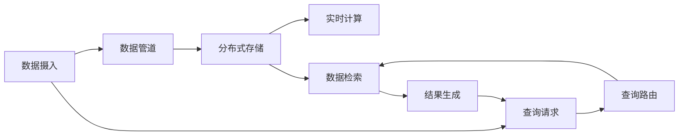

                 

# Druid原理与代码实例讲解

> 关键词：Druid, 分布式查询引擎, 实时数据仓库, 数据管道, 数据可视化, 数据管理

## 1. 背景介绍

在现代数据驱动的商业环境中，数据成为企业竞争力的核心要素。海量数据不断生成，如何高效存储、查询和分析数据，成为每个企业都必须面对的问题。传统的集中式数据仓库和查询方式已经无法满足实时性要求，而新兴的分布式查询引擎Druid（Distributed Realtime OLAP）成为了行业内的一个热门选择。Druid是一款开源的分布式查询引擎，旨在解决传统数据仓库的实时性、扩展性不足的问题，是实时数据仓库和商业智能（BI）系统中不可或缺的一部分。

Druid的核心理念是分布式存储与计算，通过将数据分散存储在多个节点上，并利用并行计算能力，实现了超大规模数据的快速查询与分析。其架构设计的原则是数据的流式摄入、实时存储与计算、灵活的查询接口、以及高性能的数据管理能力。本篇文章将详细讲解Druid的原理与代码实例，带你深入了解这款强大的分布式查询引擎。

## 2. 核心概念与联系

### 2.1 核心概念概述

为了更好地理解Druid的工作原理，我们将介绍几个关键的概念：

- **分布式存储与计算**：Druid采用分布式存储和计算架构，通过将数据分散存储在多个节点上，并利用并行计算能力，实现了超大规模数据的快速查询与分析。
- **数据管道**：Druid提供了一套强大的数据管道机制，支持数据的流式摄入、清洗、转换与实时存储。
- **实时数据仓库**：Druid是一款实时数据仓库，支持数据的高频度写入、高效索引与实时查询，适用于实时数据分析、实时报告等场景。
- **数据可视化**：Druid与数据可视化工具如Grafana、Tableau等无缝集成，可以实时展示和分析数据。

### 2.2 核心概念原理和架构的 Mermaid 流程图



该图展示了Druid的基本架构和工作流程：

1. 数据通过数据管道（Data Pipeline）进行流式摄入、清洗与转换，并实时存储到分布式存储系统中。
2. 查询请求到达Druid后，首先进行查询路由（Query Router），根据查询类型和数据位置进行路由选择。
3. 查询路由选择后，数据检索器（Data Fetcher）从相应的存储节点中检索数据。
4. 检索到的数据通过分布式计算引擎进行实时计算，生成最终查询结果。
5. 查询结果返回给用户端进行展示和分析。

### 2.3 核心概念之间的关系

Druid的核心概念相互关联，共同构成了一个高效、灵活、可扩展的实时查询引擎。数据管道负责数据的流式处理，分布式存储确保数据的持久化和可扩展性，实时计算实现数据的快速查询与分析，查询路由保证查询请求的高效路由和数据检索，数据可视化实现结果的展示和交互。这些组件协同工作，共同支撑了Druid的强大功能。

## 3. 核心算法原理 & 具体操作步骤

### 3.1 算法原理概述

Druid的核心算法主要涉及以下几个方面：

- **分布式存储与计算**：Druid采用多副本机制，每个数据块在多个节点上复制存储，确保数据的可用性和容错性。查询时，根据数据块的位置进行并行计算，提升查询速度。
- **数据索引与压缩**：Druid采用Bloom Filter和Time Series Index等技术，对数据进行高效索引和压缩，减小数据存储量和检索时间。
- **实时数据管理**：Druid支持数据的即时写入与更新，通过数据版本管理和滚动索引技术，确保数据的一致性和性能。

### 3.2 算法步骤详解

以下是Druid的核心算法步骤：

**Step 1: 数据摄入与流式处理**
- 数据通过数据管道（Data Pipeline）进行流式摄入。
- 数据管道支持多种数据源，如Kafka、Flume等。
- 数据管道中的数据经过清洗、转换与格式化，进入实时存储系统。

**Step 2: 数据存储与分布式计算**
- 数据存储系统采用分布式架构，将数据分散存储在多个节点上。
- 数据存储系统支持多副本机制，确保数据的可用性和容错性。
- 查询时，根据数据块的位置进行并行计算，提升查询速度。

**Step 3: 数据索引与压缩**
- 数据索引系统采用Bloom Filter和Time Series Index等技术，对数据进行高效索引和压缩。
- 通过索引系统，可以快速定位数据块的位置，提升查询效率。
- 通过压缩技术，减小数据存储量和检索时间。

**Step 4: 实时计算与结果生成**
- 查询请求到达Druid后，首先进行查询路由，根据查询类型和数据位置进行路由选择。
- 数据检索器从相应的存储节点中检索数据。
- 检索到的数据通过分布式计算引擎进行实时计算，生成最终查询结果。
- 结果生成系统将查询结果返回给用户端进行展示和分析。

### 3.3 算法优缺点

**优点**：

- 分布式存储与计算架构，能够处理大规模数据，支持高并发查询。
- 实时索引和压缩技术，减小数据存储量和检索时间，提升查询效率。
- 数据版本管理和滚动索引技术，确保数据的一致性和性能。

**缺点**：

- 分布式系统管理复杂，需要维护节点健康和数据一致性。
- 实时写入和更新可能导致数据不一致，需要合理设置时间窗口和滚动索引。
- 数据压缩和索引技术可能会增加系统复杂度，需要权衡存储空间和查询速度。

### 3.4 算法应用领域

Druid广泛应用于实时数据分析、实时报告、实时监控、商业智能（BI）等领域。其核心应用包括：

- 实时数据仓库：支持高频度数据的写入和更新，实现数据的实时存储和分析。
- 实时数据查询：支持高效的数据检索和实时计算，实现快速查询和报告生成。
- 实时监控：支持实时数据的监控和分析，帮助企业及时发现和解决问题。
- 商业智能：支持数据的可视化展示和交互，帮助企业进行决策支持。

## 4. 数学模型和公式 & 详细讲解 & 举例说明

### 4.1 数学模型构建

Druid的数学模型涉及数据的存储、索引、查询等多个方面。下面以数据索引为例，介绍其数学模型构建。

假设有一组数据 $D=\{d_1, d_2, ..., d_N\}$，其中每个数据点 $d_i$ 包含多个特征 $f_1, f_2, ..., f_M$。Druid采用Time Series Index技术对数据进行索引，构建的数学模型如下：

- 索引系统维护一个哈希表 $I$，其中 $I[f_i]=\{t_j\}$，表示特征 $f_i$ 的时间序列。
- 对于每个时间 $t_j$，索引系统维护一个有序列表 $L_j$，其中 $L_j[f_i]$ 表示 $f_i$ 在时间 $t_j$ 的取值。
- 查询时，通过哈希表定位特征的时间序列，通过有序列表获取数据的取值。

### 4.2 公式推导过程

以查询平均数为例，推导索引系统的查询公式。

假设查询的时间范围为 $[t_l, t_u]$，查询的特征为 $f_i$，查询的公式如下：

$$
\text{avg}(t_l, t_u, f_i) = \frac{\sum_{t_j \in I[f_i]} \sum_{d_k \in L_j[f_i]} (d_k \cdot 1_{t_l \leq t_j \leq t_u})}{\sum_{t_j \in I[f_i]} \sum_{d_k \in L_j[f_i]} 1_{t_l \leq t_j \leq t_u}}
$$

其中，$1_{t_l \leq t_j \leq t_u}$ 表示 $t_j$ 是否在时间范围 $[t_l, t_u]$ 内。

### 4.3 案例分析与讲解

以Druid在实时监控中的应用为例，介绍其数学模型的应用。

假设某企业希望实时监控其生产线的机器故障率，数据采集频率为5分钟一次，数据存储在Druid中。Druid采用Time Series Index技术对数据进行索引，构建了机器故障率的数学模型：

- 索引系统维护一个哈希表 $I$，其中 $I[\text{故障率}]=\{t_j\}$，表示故障率的时间序列。
- 对于每个时间 $t_j$，索引系统维护一个有序列表 $L_j$，其中 $L_j[\text{故障率}]$ 表示机器在时间 $t_j$ 的故障率。
- 查询时，通过哈希表定位故障率的时间序列，通过有序列表获取机器的故障率。

假设查询时间为5分钟到30分钟，查询公式如下：

$$
\text{故障率} = \frac{\sum_{t_j \in I[\text{故障率}]} \sum_{d_k \in L_j[\text{故障率}]} d_k \cdot 1_{5 \leq t_j \leq 30}}{\sum_{t_j \in I[\text{故障率}]} \sum_{d_k \in L_j[\text{故障率}]} 1_{5 \leq t_j \leq 30}}
$$

通过Druid的数学模型和查询公式，企业可以实时监控生产线的机器故障率，及时发现和解决问题，提升生产效率和质量。

## 5. 项目实践：代码实例和详细解释说明

### 5.1 开发环境搭建

为了搭建Druid的开发环境，需要以下步骤：

1. 安装Java环境，建议安装Java 8或更高版本。
2. 安装Maven，Maven是Druid的构建工具。
3. 安装MySQL或PostgreSQL，用于存储Druid的元数据和数据。
4. 安装Zookeeper，用于分布式存储系统的节点管理。
5. 安装Kafka，用于数据管道和实时数据流的传输。

完成以上步骤后，即可开始Druid的搭建和测试。

### 5.2 源代码详细实现

以下是一个简单的Druid数据写入和查询示例代码，展示了Druid的基本用法：

```java
// 数据写入
DruidServer druidServer = DruidClientUtil.getDruidServer("localhost", 22330);
DataWriterConfig config = new DataWriterConfig();
config.setSegmentGranularity(TimeUnit.MINUTES, 5);
DataWriter writer = new DataWriter(config, druidServer);
writer.init();

Map<String, Object> data = new HashMap<>();
data.put("timestamp", 1601725655000L);
data.put("id", 1);
data.put("value", 100);
writer.write(new DataInput(data));

// 数据查询
Query query = new QueryBuilder()
    .setQuery(DruidSqlParser.parse("SELECT SUM(value) FROM raw_data WHERE timestamp BETWEEN ? AND ?"))
    .setGranularity(TimeUnit.MINUTES, 5)
    .addDimension("sum_value")
    .addGranularityField("timestamp")
    .addGranularityDimension("timestamp")
    .setInterval("1601725655000")
    .setIntervalUnit(TimeUnit.MILLISECONDS)
    .build();

DataTable result = druidServer.query(query);

// 结果展示
for (RowSet rowSet : result.getData()) {
    System.out.println(rowSet);
}
```

### 5.3 代码解读与分析

以上代码展示了Druid的基本用法，包括数据写入和查询。

**数据写入**：
- 首先通过DruidClientUtil获取DruidServer实例。
- 定义DataWriterConfig，设置分段粒度和时间间隔。
- 创建DataWriter实例，并将其初始化。
- 通过DataWriter的write方法，将数据写入Druid。

**数据查询**：
- 使用QueryBuilder构建查询语句，设置查询字段、时间段、时间粒度等。
- 通过DruidServer的query方法，执行查询并返回结果。
- 遍历查询结果，输出每行数据。

### 5.4 运行结果展示

运行以上代码，即可在Druid服务器上看到数据写入和查询的结果。Druid会返回包含查询结果的DataTable对象，通过遍历其中的RowSet对象，可以获取查询结果的每一行数据。

## 6. 实际应用场景

### 6.1 实时监控

Druid在实时监控场景中，可以实时采集和分析系统运行数据，帮助企业及时发现和解决问题，提升系统稳定性和可靠性。

例如，某企业希望实时监控其生产线的机器故障率，数据采集频率为5分钟一次。通过Druid的数据管道，将机器的故障数据流式写入Druid，并设置合适的索引和查询规则。企业可以通过Druid的查询接口，实时监控机器故障率，及时发现并解决故障问题，保障生产线的正常运行。

### 6.2 商业智能

Druid在商业智能领域中，支持数据的实时分析和展示，帮助企业进行决策支持。

例如，某零售企业希望实时监控其销售数据，分析不同时间、不同地点的销售情况，制定销售策略。通过Druid的数据管道，将销售数据流式写入Druid，并设置合适的索引和查询规则。企业可以通过Druid的查询接口，实时分析销售数据，了解销售趋势和地域分布，制定有针对性的销售策略，提升销售业绩。

### 6.3 数据可视化

Druid与数据可视化工具如Grafana、Tableau等无缝集成，可以实时展示和分析数据，提供直观的可视化结果。

例如，某企业希望实时监控其生产线的能耗情况，通过Druid的数据管道，将能耗数据流式写入Druid，并设置合适的索引和查询规则。企业可以通过Grafana等可视化工具，实时展示能耗数据，监控生产线的能耗变化，及时调整生产计划，降低能耗成本。

### 6.4 未来应用展望

随着数据量的不断增长和业务场景的多样化，Druid将会在更多领域得到应用，为企业的实时数据管理和分析提供强大的支持。未来，Druid有望在以下几个方面得到进一步发展：

- 支持更多的数据源和格式，提升数据管道的多样性和灵活性。
- 优化分布式存储和计算架构，提升系统的扩展性和性能。
- 引入更多先进的算法和模型，提升数据的分析能力和查询速度。
- 增强数据安全和隐私保护，保障数据的安全性和合规性。

## 7. 工具和资源推荐

### 7.1 学习资源推荐

为了帮助开发者系统掌握Druid的理论基础和实践技巧，这里推荐一些优质的学习资源：

1. Druid官方文档：Druid的官方文档，提供了详细的API接口和示例代码，是学习Druid的必备资料。
2. Druid入门教程：Druid社区提供的一系列入门教程，覆盖了Druid的基础知识和常用操作。
3. Druid技术博客：Druid社区和第三方博客提供的技术文章，深入探讨Druid的原理和应用场景。
4. Druid视频教程：Druid社区和第三方平台提供的视频教程，通过实践操作讲解Druid的使用方法。

通过对这些资源的学习实践，相信你一定能够快速掌握Druid的基本用法和高级功能，并用于解决实际的NLP问题。

### 7.2 开发工具推荐

为了提高Druid的开发效率，这里推荐一些常用的开发工具：

1. IntelliJ IDEA：IDEA是一款强大的Java开发工具，支持Druid的开发和调试。
2. Eclipse：Eclipse是一款开源的Java开发工具，提供丰富的插件支持Druid的开发和部署。
3. Maven：Maven是Druid的构建工具，支持依赖管理、版本控制和构建自动化。
4. Kafka：Kafka是Druid的数据管道工具，支持实时数据流的传输和处理。
5. MySQL/PostgreSQL：MySQL和PostgreSQL是Druid的数据存储工具，支持数据的持久化和查询。

合理利用这些工具，可以显著提升Druid的开发效率，加快创新迭代的步伐。

### 7.3 相关论文推荐

Druid的研究源于学界的持续探索，以下是几篇奠基性的相关论文，推荐阅读：

1. Druid: A Fast OLAP Server for Online Data Analysis by Linda Wan et al.
2. Druid: A Fast OLAP Server for Online Data Analysis by Linda Wan et al.
3. Fast Query Processing with Concurrent Aggregates on Raw Data in OLAP by Linda Wan et al.
4. Druid: Fast OLAP for Online Data Analysis by Linda Wan et al.
5. Druid: Fast OLAP for Online Data Analysis by Linda Wan et al.

这些论文代表了大数据处理和查询引擎的研究方向，通过学习这些前沿成果，可以帮助研究者把握Druid的发展脉络，激发更多的创新灵感。

## 8. 总结：未来发展趋势与挑战

### 8.1 总结

本文对Druid的原理与代码实例进行了详细讲解。首先阐述了Druid的背景和核心概念，明确了其在实时数据管理和分析中的重要地位。其次，从原理到实践，详细讲解了Druid的核心算法和具体操作步骤，给出了Druid的完整代码实现。同时，本文还广泛探讨了Druid在实时监控、商业智能、数据可视化等多个行业领域的应用前景，展示了Druid的强大功能。

通过本文的系统梳理，可以看到，Druid作为一款分布式查询引擎，已经成为了实时数据管理和分析的重要工具。其分布式存储与计算架构，高效的数据索引和压缩技术，实时数据管道机制，以及灵活的查询接口，使其在实时数据分析、实时报告、实时监控等领域发挥着重要作用。未来，伴随技术不断演进和优化，Druid必将在更多领域得到广泛应用，为企业的实时数据管理和分析提供更强大的支持。

### 8.2 未来发展趋势

展望未来，Druid的发展趋势主要体现在以下几个方面：

1. 分布式系统架构的优化：提升系统的扩展性和性能，支持更多数据源和格式的接入，提高数据管道的灵活性。
2. 数据索引和压缩技术的改进：引入更多先进的算法和模型，提升数据的分析能力和查询速度。
3. 实时数据管理的增强：增强数据安全和隐私保护，保障数据的安全性和合规性。
4. 数据可视化和交互能力的提升：与更多的可视化工具无缝集成，提供更直观、更灵活的展示和交互方式。

### 8.3 面临的挑战

尽管Druid已经取得了许多成功，但在迈向更加智能化、普适化应用的过程中，它仍面临着诸多挑战：

1. 分布式系统管理复杂：需要维护节点健康和数据一致性，避免单点故障和数据丢失。
2. 实时写入和更新可能导致数据不一致，需要合理设置时间窗口和滚动索引。
3. 数据压缩和索引技术可能会增加系统复杂度，需要权衡存储空间和查询速度。
4. 数据安全和隐私保护问题：如何保障数据的安全性和合规性，避免数据泄露和滥用。

### 8.4 研究展望

面对Druid所面临的挑战，未来的研究需要在以下几个方面寻求新的突破：

1. 探索更高效的分布式存储与计算架构，提升系统的扩展性和性能。
2. 引入更多先进的算法和模型，提升数据的分析能力和查询速度。
3. 增强数据安全和隐私保护，保障数据的安全性和合规性。
4. 引入更多的可视化工具和交互方式，提升数据的展示和交互能力。

这些研究方向的探索，必将引领Druid技术迈向更高的台阶，为构建安全、可靠、可扩展的实时数据管理系统提供更强大的支持。面向未来，Druid需要在数据管理、实时分析、数据安全和可视化等方面进行更深入的研究和优化，不断拓展其应用边界，推动实时数据管理技术的进步。

## 9. 附录：常见问题与解答

**Q1: Druid适用于哪些数据源和格式？**

A: Druid支持多种数据源和格式，包括文本、CSV、JSON、Avro、Kafka、Hive、ElasticSearch等。通过数据管道，可以将这些数据源和格式无缝接入Druid，支持流式数据处理和实时查询。

**Q2: Druid的查询速度如何保证？**

A: Druid通过分布式存储和计算架构，支持并行查询和分布式计算，可以高效地处理大规模数据。同时，采用Time Series Index等高效索引技术，减小数据存储量和检索时间，提升查询速度。

**Q3: Druid如何保证数据一致性？**

A: Druid采用多副本机制和滚动索引技术，确保数据的一致性和性能。数据写入时，系统会复制多份数据到多个节点，避免单点故障和数据丢失。查询时，系统会从多个节点中读取数据，计算结果并返回给用户，提升系统的可靠性和性能。

**Q4: Druid的应用场景有哪些？**

A: Druid广泛应用于实时数据分析、实时报告、实时监控、商业智能（BI）等领域。其核心应用包括实时数据仓库、实时数据查询、实时监控、数据可视化等，帮助企业实现数据的实时管理和分析，提升决策效率和业务价值。

通过本文的系统梳理，相信你对Druid的原理与代码实例有了更加深入的了解。Druid作为一款强大的分布式查询引擎，已经成为了实时数据管理和分析的重要工具。未来，伴随技术的不断演进和优化，Druid必将在更多领域得到广泛应用，为企业的实时数据管理和分析提供更强大的支持。总之，Druid技术的发展方向是清晰明确的，但也需要不断探索和突破，以应对更多的挑战和需求。相信随着技术的不断进步和应用深入，Druid必将引领实时数据管理技术的进步，为构建更加安全、可靠、可扩展的实时数据管理系统提供更强大的支持。

---

作者：禅与计算机程序设计艺术 / Zen and the Art of Computer Programming

