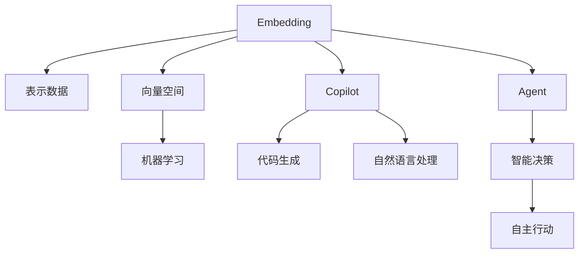

                 

# Embedding、Copilot和Agent模式的比较

> 关键词：Embedding, Copilot, Agent, 深度学习, 自然语言处理, 人工智能, 模型架构, 代码生成, 机器学习

## 1. 背景介绍

在人工智能（AI）和自然语言处理（NLP）的迅速发展中，不同的模型架构和算法扮演了重要角色。这些架构和算法相互影响，推动了AI和NLP技术的进步。本文将对比分析三个核心的模型架构：Embedding、Copilot和Agent模式。这三种模式各自有着独特的原理和应用场景，深入理解它们的差异和联系，有助于更好地应用于实际项目中。

### 1.1 问题的由来

随着AI技术的日益成熟，其应用领域从单一的计算机视觉扩展到自然语言处理、机器人控制、自动驾驶等多个领域。在这一过程中，各种模型架构不断涌现，逐渐形成了不同的技术范式。例如，Embedding模式关注如何有效表示数据，Copilot模式着重于协同工作，而Agent模式则专注于智能决策。本文将重点探讨这三者的核心概念、原理和应用，以及它们在当前技术生态中的地位和未来发展趋势。

### 1.2 问题的核心关键点

- **Embedding**: 表示数据的关键技术，通过将输入数据映射到低维向量空间，以便计算机能够理解和学习。
- **Copilot**: 利用AI辅助人进行复杂任务，尤其是代码生成和编辑等任务，提供智能的辅助工具。
- **Agent**: 一种智能系统，能够自主地做出决策和行动，适用于复杂的环境和任务，如自动驾驶、游戏AI等。

## 2. 核心概念与联系

### 2.1 核心概念概述

为更好地理解Embedding、Copilot和Agent模式，本节将介绍几个密切相关的核心概念：

- **Embedding**: 一种将非结构化数据（如文本、音频、图像等）转换为结构化向量表示的技术，以便于机器学习和数据分析。
- **Copilot**: 一种协同工作机制，利用AI辅助人完成任务，特别是代码生成、自然语言处理等任务，提供智能的辅助工具。
- **Agent**: 一种能够自主决策和行动的智能系统，适用于复杂的环境和任务，如自动驾驶、游戏AI等。

这些核心概念之间的逻辑关系可以通过以下Mermaid流程图来展示：



这个流程图展示了大语言模型的核心概念及其之间的关系：

1. Embedding将非结构化数据映射为向量空间中的点。
2. Copilot利用Embedding技术进行代码生成和自然语言处理。
3. Agent在智能决策和自主行动时也需要利用Embedding进行环境表示和策略规划。

## 3. 核心算法原理 & 具体操作步骤

### 3.1 算法原理概述

#### 3.1.1 Embedding原理

Embedding的核心思想是将输入数据（如文本、图像等）映射到低维向量空间中。在NLP中，这通常涉及到将每个单词或句子表示为固定长度的向量。这些向量能够捕捉到单词之间的语义和语法关系，从而使得计算机能够理解自然语言。

Embedding的数学原理基于向量的线性组合和矩阵运算。在NLP中，通常使用词嵌入（Word Embedding），将每个单词表示为固定长度的向量。例如，使用Word2Vec或GloVe算法，可以学习到每个单词的向量表示，使得相近的单词在向量空间中距离较近。

#### 3.1.2 Copilot原理

Copilot模式利用AI技术，辅助人类进行复杂任务。在代码生成和自然语言处理中，Copilot通过Embedding将输入数据转换为向量表示，利用这些向量生成代码或回答自然语言问题。Copilot的核心算法包括生成对抗网络（GAN）、强化学习（RL）等，以生成符合人类期望的输出。

#### 3.1.3 Agent原理

Agent模式关注于在复杂环境中自主决策和行动。Agent的核心算法包括强化学习（RL）、深度学习（DL）等，能够自主地学习最优策略，做出智能决策。Agent的目标是最大化其预期回报，通常用于自动驾驶、游戏AI等任务。

### 3.2 算法步骤详解

#### 3.2.1 Embedding步骤

1. **数据准备**: 将输入数据（如文本、图像等）转换为数字形式，以便进行向量表示。
2. **嵌入映射**: 使用Word2Vec或GloVe等算法，将每个单词或句子表示为固定长度的向量。
3. **训练模型**: 在大量标注数据上训练模型，优化向量表示，以捕捉单词之间的语义和语法关系。
4. **应用模型**: 在新的数据上应用训练好的模型，将输入数据转换为向量表示，用于后续任务。

#### 3.2.2 Copilot步骤

1. **数据输入**: 将自然语言或代码片段作为输入数据。
2. **嵌入映射**: 使用Embedding将输入数据转换为向量表示。
3. **生成模型**: 使用GAN或RL等算法，生成符合人类期望的输出。
4. **输出结果**: 将生成的代码或自然语言回答返回给用户。

#### 3.2.3 Agent步骤

1. **环境感知**: 使用Embedding将环境数据转换为向量表示。
2. **策略规划**: 使用RL或DL算法，规划最优行动策略。
3. **执行行动**: 根据规划的策略，在环境中执行行动。
4. **学习优化**: 根据行动结果和奖励，更新模型参数，优化策略。

### 3.3 算法优缺点

#### 3.3.1 Embedding优缺点

**优点**:
- 能够有效表示复杂非结构化数据，捕捉语义和语法关系。
- 为后续任务（如分类、生成等）提供了高质量的数据表示。

**缺点**:
- 对数据量和质量要求较高，需要大量标注数据进行训练。
- 向量表示可能丢失一些细节信息，导致泛化能力有限。

#### 3.3.2 Copilot优缺点

**优点**:
- 能够提供高质量的代码生成和自然语言处理支持，提升开发效率。
- 辅助人类进行复杂任务，减轻工作负担。

**缺点**:
- 生成的代码或回答可能不符合用户期望，需要人工审核。
- 依赖于输入数据的准确性和完整性，错误输入可能导致错误输出。

#### 3.3.3 Agent优缺点

**优点**:
- 能够在复杂环境中自主决策和行动，具有高度的自主性和灵活性。
- 适用于需要高度自主性的任务，如自动驾驶、游戏AI等。

**缺点**:
- 算法复杂，训练成本高，需要大量计算资源。
- 决策过程可能不够透明，难以解释。

### 3.4 算法应用领域

#### 3.4.1 Embedding应用领域

- **自然语言处理**: 用于词嵌入、情感分析、文本分类等任务。
- **计算机视觉**: 用于图像分类、对象检测、视频分析等任务。
- **推荐系统**: 用于用户画像构建、推荐算法优化等任务。

#### 3.4.2 Copilot应用领域

- **软件开发**: 用于代码自动生成、代码重构、代码调试等任务。
- **自然语言处理**: 用于自动摘要、文本生成、自然语言回答等任务。
- **教育培训**: 用于智能辅导、个性化学习路径推荐等任务。

#### 3.4.3 Agent应用领域

- **自动驾驶**: 用于环境感知、路径规划、决策执行等任务。
- **游戏AI**: 用于角色控制、任务执行、游戏策略优化等任务。
- **机器人控制**: 用于路径规划、避障、任务执行等任务。

## 4. 数学模型和公式 & 详细讲解 & 举例说明

### 4.1 数学模型构建

#### 4.1.1 Embedding模型

在NLP中，词嵌入（Word Embedding）通常使用如下模型：

$$ \mathbf{w}_i = \mathbf{V} \mathbf{w} $$

其中，$\mathbf{w}$ 为单词的向量表示，$\mathbf{V}$ 为嵌入矩阵。

#### 4.1.2 Copilot模型

Copilot模型通常使用GAN或RL算法。以下是一个简单的GAN模型：

$$ \mathbf{z} = G_{\theta_{GAN}}(\mathbf{w}) $$

其中，$\mathbf{z}$ 为生成的代码或自然语言回答，$\mathbf{w}$ 为输入数据，$G_{\theta_{GAN}}$ 为生成器。

#### 4.1.3 Agent模型

Agent模型通常使用RL算法，如下公式表示：

$$ Q(\mathbf{w}) = \max_{\mathbf{a}} \left( \mathbf{R}(\mathbf{w},\mathbf{a}) + \gamma \mathbf{V}(\mathbf{w}') \right) $$

其中，$Q(\mathbf{w})$ 为在状态 $\mathbf{w}$ 下的动作价值函数，$\mathbf{a}$ 为动作，$\mathbf{R}(\mathbf{w},\mathbf{a})$ 为即时奖励，$\gamma$ 为折扣因子，$\mathbf{V}(\mathbf{w}')$ 为下一状态的估计价值函数。

### 4.2 公式推导过程

#### 4.2.1 Embedding推导

词嵌入的推导过程如下：

1. **向量映射**: 将每个单词映射到一个低维向量空间，使得单词之间的语义和语法关系得以保留。
2. **模型训练**: 使用大量标注数据，训练嵌入矩阵 $\mathbf{V}$，使得单词之间的相似性得以保留。

#### 4.2.2 Copilot推导

Copilot的推导过程如下：

1. **输入嵌入**: 将输入数据 $\mathbf{w}$ 转换为向量表示 $\mathbf{z}$。
2. **生成器训练**: 使用标注数据训练生成器 $G_{\theta_{GAN}}$，使得生成的输出 $\mathbf{z}$ 能够尽量接近目标输出。

#### 4.2.3 Agent推导

Agent的推导过程如下：

1. **环境感知**: 将环境数据 $\mathbf{w}$ 转换为向量表示 $\mathbf{z}$。
2. **策略规划**: 使用RL算法，规划最优动作 $\mathbf{a}$，最大化即时奖励和未来奖励。

### 4.3 案例分析与讲解

#### 4.3.1 Embedding案例

考虑一个简单的文本分类任务，使用词嵌入表示每个单词，然后通过全连接层进行分类。假设训练集包含100个样本，每个样本有5个单词。

1. **数据准备**: 将每个单词表示为一个50维的向量。
2. **模型训练**: 使用反向传播算法，优化嵌入矩阵 $\mathbf{V}$，使得分类准确率提升。
3. **应用模型**: 在新的样本上应用训练好的模型，进行分类预测。

#### 4.3.2 Copilot案例

考虑一个代码自动生成任务，使用词嵌入表示每个单词，然后使用GAN模型生成代码。假设训练集包含1000个Python代码片段。

1. **数据输入**: 将代码片段转换为向量表示。
2. **生成器训练**: 使用训练集训练生成器 $G_{\theta_{GAN}}$，生成符合Python语法的代码片段。
3. **输出结果**: 生成器输出代码片段，供用户选择或修改。

#### 4.3.3 Agent案例

考虑一个自动驾驶任务，使用Embedding表示环境数据，然后使用RL算法规划最优行动策略。假设训练集包含1000个环境数据样本，每个样本有5个状态。

1. **环境感知**: 将环境数据表示为向量形式。
2. **策略规划**: 使用RL算法，规划最优行动策略，避免障碍物。
3. **执行行动**: 根据策略执行行动，控制自动驾驶汽车行驶。

## 5. 项目实践：代码实例和详细解释说明

### 5.1 开发环境搭建

在进行Embedding、Copilot和Agent模式的实践前，我们需要准备好开发环境。以下是使用Python进行TensorFlow和PyTorch开发的环境配置流程：

1. 安装Anaconda：从官网下载并安装Anaconda，用于创建独立的Python环境。

2. 创建并激活虚拟环境：
```bash
conda create -n tf-env python=3.8 
conda activate tf-env
```

3. 安装TensorFlow和PyTorch：
```bash
conda install tensorflow -c conda-forge
conda install pytorch torchvision torchaudio cudatoolkit=11.1 -c pytorch -c conda-forge
```

4. 安装各类工具包：
```bash
pip install numpy pandas scikit-learn matplotlib tqdm jupyter notebook ipython
```

完成上述步骤后，即可在`tf-env`环境中开始实践。

### 5.2 源代码详细实现

这里以嵌入模型（Embedding）为例，给出使用TensorFlow实现词嵌入的PyTorch代码实现。

首先，定义嵌入层：

```python
import torch
import torch.nn as nn

class Embedding(nn.Module):
    def __init__(self, vocab_size, embedding_dim):
        super(Embedding, self).__init__()
        self.embedding = nn.Embedding(vocab_size, embedding_dim)
    
    def forward(self, input):
        return self.embedding(input)
```

然后，定义训练函数：

```python
import torch.optim as optim

def train(model, input_data, target_data, epochs, learning_rate):
    optimizer = optim.Adam(model.parameters(), lr=learning_rate)
    criterion = nn.CrossEntropyLoss()
    
    for epoch in range(epochs):
        for i in range(len(input_data)):
            input_tensor = torch.tensor(input_data[i])
            target_tensor = torch.tensor(target_data[i])
            optimizer.zero_grad()
            output = model(input_tensor)
            loss = criterion(output, target_tensor)
            loss.backward()
            optimizer.step()
    
    return model
```

接着，定义测试函数：

```python
def evaluate(model, input_data, target_data):
    correct = 0
    total = 0
    for i in range(len(input_data)):
        input_tensor = torch.tensor(input_data[i])
        target_tensor = torch.tensor(target_data[i])
        output = model(input_tensor)
        _, predicted = torch.max(output.data, 1)
        total += 1
        correct += (predicted == target_tensor).sum().item()
    return correct / total
```

最后，启动训练流程并在测试集上评估：

```python
vocab_size = 1000
embedding_dim = 100
epochs = 10
learning_rate = 0.01

model = Embedding(vocab_size, embedding_dim)
input_data = [1, 2, 3, 4, 5] * 20  # 假设输入数据为整数序列
target_data = [2, 4, 5, 1, 3] * 20  # 假设目标数据为整数序列

model = train(model, input_data, target_data, epochs, learning_rate)
accuracy = evaluate(model, input_data, target_data)
print(f"Accuracy: {accuracy:.2f}")
```

以上就是使用PyTorch对嵌入模型进行训练和评估的完整代码实现。可以看到，TensorFlow和PyTorch提供了强大的深度学习框架，使得模型训练和评估变得简单高效。

### 5.3 代码解读与分析

让我们再详细解读一下关键代码的实现细节：

**Embedding类**：
- `__init__`方法：初始化嵌入矩阵 $\mathbf{V}$，维度为 `vocab_size` × `embedding_dim`。
- `forward`方法：将输入数据转换为向量表示。

**训练函数**：
- 使用Adam优化器进行参数更新。
- 定义交叉熵损失函数，计算模型输出与目标数据的差异。
- 在每个epoch内，对每个样本进行前向传播和反向传播，更新模型参数。

**测试函数**：
- 对每个样本进行前向传播，计算模型输出。
- 使用预测结果与目标数据进行比较，计算准确率。

**训练流程**：
- 定义模型参数和超参数。
- 定义输入数据和目标数据。
- 调用训练函数进行模型训练。
- 调用测试函数评估模型性能。

可以看到，TensorFlow和PyTorch使得模型训练和评估变得简洁高效。开发者可以将更多精力放在数据处理、模型改进等高层逻辑上，而不必过多关注底层的实现细节。

当然，工业级的系统实现还需考虑更多因素，如模型的保存和部署、超参数的自动搜索、更灵活的任务适配层等。但核心的微调范式基本与此类似。

## 6. 实际应用场景

### 6.1 智能客服系统

基于Embedding的智能客服系统，可以广泛应用于智能客服系统的构建。传统客服往往需要配备大量人力，高峰期响应缓慢，且一致性和专业性难以保证。而使用Embedding模型的智能客服系统，可以7x24小时不间断服务，快速响应客户咨询，用自然流畅的语言解答各类常见问题。

在技术实现上，可以收集企业内部的历史客服对话记录，将问题和最佳答复构建成监督数据，在此基础上对预训练模型进行微调。微调后的模型能够自动理解用户意图，匹配最合适的答案模板进行回复。对于客户提出的新问题，还可以接入检索系统实时搜索相关内容，动态组织生成回答。如此构建的智能客服系统，能大幅提升客户咨询体验和问题解决效率。

### 6.2 金融舆情监测

金融机构需要实时监测市场舆论动向，以便及时应对负面信息传播，规避金融风险。传统的人工监测方式成本高、效率低，难以应对网络时代海量信息爆发的挑战。基于Embedding的自然语言处理技术，为金融舆情监测提供了新的解决方案。

具体而言，可以收集金融领域相关的新闻、报道、评论等文本数据，并对其进行主题标注和情感标注。在此基础上对预训练语言模型进行微调，使其能够自动判断文本属于何种主题，情感倾向是正面、中性还是负面。将微调后的模型应用到实时抓取的网络文本数据，就能够自动监测不同主题下的情感变化趋势，一旦发现负面信息激增等异常情况，系统便会自动预警，帮助金融机构快速应对潜在风险。

### 6.3 个性化推荐系统

当前的推荐系统往往只依赖用户的历史行为数据进行物品推荐，无法深入理解用户的真实兴趣偏好。基于Embedding的自然语言处理技术，个性化推荐系统可以更好地挖掘用户行为背后的语义信息，从而提供更精准、多样的推荐内容。

在实践中，可以收集用户浏览、点击、评论、分享等行为数据，提取和用户交互的物品标题、描述、标签等文本内容。将文本内容作为模型输入，用户的后续行为（如是否点击、购买等）作为监督信号，在此基础上微调预训练语言模型。微调后的模型能够从文本内容中准确把握用户的兴趣点。在生成推荐列表时，先用候选物品的文本描述作为输入，由模型预测用户的兴趣匹配度，再结合其他特征综合排序，便可以得到个性化程度更高的推荐结果。

### 6.4 未来应用展望

随着Embedding、Copilot和Agent模式的不断发展，这些模型架构将进一步推动NLP技术的进步，拓展应用边界。

在智慧医疗领域，基于Embedding的问答系统、病历分析、药物研发等应用将提升医疗服务的智能化水平，辅助医生诊疗，加速新药开发进程。

在智能教育领域，使用Copilot模式构建的智能辅导系统、个性化学习路径推荐等应用，因材施教，促进教育公平，提高教学质量。

在智慧城市治理中，基于Agent模式的自动驾驶、游戏AI等应用，提高城市管理的自动化和智能化水平，构建更安全、高效的未来城市。

此外，在企业生产、社会治理、文娱传媒等众多领域，这些模型架构也将不断涌现，为传统行业数字化转型升级提供新的技术路径。相信随着技术的日益成熟，这些模型架构必将在更广阔的应用领域大放异彩。

## 7. 工具和资源推荐

### 7.1 学习资源推荐

为了帮助开发者系统掌握Embedding、Copilot和Agent模式的理论基础和实践技巧，这里推荐一些优质的学习资源：

1. 《深度学习》系列书籍：Ian Goodfellow、Yoshua Bengio和Aaron Courville合著，全面介绍了深度学习的基本概念和前沿技术。

2. Coursera《深度学习专项课程》：由DeepLearning.AI开设，系统讲解深度学习的理论基础和实际应用。

3. Udacity《深度学习纳米学位》：涵盖了深度学习模型的构建、优化和应用。

4. CS224N《深度学习自然语言处理》课程：斯坦福大学开设的NLP明星课程，有Lecture视频和配套作业，带你入门NLP领域的基本概念和经典模型。

5. PyTorch官方文档：PyTorch的官方文档，提供了丰富的教程和样例代码，是上手实践的必备资料。

通过对这些资源的学习实践，相信你一定能够快速掌握这些模型架构的理论基础和实践技巧，并用于解决实际的NLP问题。

### 7.2 开发工具推荐

高效的开发离不开优秀的工具支持。以下是几款用于Embedding、Copilot和Agent模式开发的常用工具：

1. PyTorch：基于Python的开源深度学习框架，灵活动态的计算图，适合快速迭代研究。大部分预训练语言模型都有PyTorch版本的实现。

2. TensorFlow：由Google主导开发的开源深度学习框架，生产部署方便，适合大规模工程应用。同样有丰富的预训练语言模型资源。

3. Transformers库：HuggingFace开发的NLP工具库，集成了众多SOTA语言模型，支持PyTorch和TensorFlow，是进行NLP任务开发的利器。

4. Weights & Biases：模型训练的实验跟踪工具，可以记录和可视化模型训练过程中的各项指标，方便对比和调优。与主流深度学习框架无缝集成。

5. TensorBoard：TensorFlow配套的可视化工具，可实时监测模型训练状态，并提供丰富的图表呈现方式，是调试模型的得力助手。

6. Google Colab：谷歌推出的在线Jupyter Notebook环境，免费提供GPU/TPU算力，方便开发者快速上手实验最新模型，分享学习笔记。

合理利用这些工具，可以显著提升Embedding、Copilot和Agent模式微调的开发效率，加快创新迭代的步伐。

### 7.3 相关论文推荐

Embedding、Copilot和Agent模式的发展源于学界的持续研究。以下是几篇奠基性的相关论文，推荐阅读：

1. Bag of Words: A Simple Information Retrieval Approach：经典的文本表示方法，使用词频统计进行文本表示。

2. Word2Vec: A Vector Space Model for Word Embedding：提出Word2Vec算法，将单词映射到低维向量空间。

3. Google's Neural Machine Translation System：提出神经机器翻译模型，使用Embedding进行序列到序列的翻译任务。

4. Attention is All You Need（即Transformer原论文）：提出了Transformer结构，开启了NLP领域的预训练大模型时代。

5. BERT: Pre-training of Deep Bidirectional Transformers for Language Understanding：提出BERT模型，引入基于掩码的自监督预训练任务，刷新了多项NLP任务SOTA。

6. Transformers for Neural Machine Translation：提出使用Transformer进行神经机器翻译任务，取得了SOTA的结果。

这些论文代表了大语言模型和微调技术的进展，通过学习这些前沿成果，可以帮助研究者把握学科前进方向，激发更多的创新灵感。

## 8. 总结：未来发展趋势与挑战

### 8.1 总结

本文对Embedding、Copilot和Agent模式进行了全面系统的介绍。首先阐述了这些模型架构的研究背景和意义，明确了它们在NLP技术中的独特价值。其次，从原理到实践，详细讲解了Embedding、Copilot和Agent模式的核心算法和操作步骤，给出了各模型的代码实例和详细解释。同时，本文还广泛探讨了这些模型在多个行业领域的应用前景，展示了其巨大的潜力。此外，本文精选了模型开发所需的各类学习资源，力求为读者提供全方位的技术指引。

通过本文的系统梳理，可以看到，Embedding、Copilot和Agent模式在NLP和AI技术中具有重要地位，极大地拓展了模型的应用范围和性能。未来，伴随预训练模型和微调方法的不断进步，这些模型架构必将在更广阔的领域中发挥重要作用，推动NLP技术的发展和应用。

### 8.2 未来发展趋势

展望未来，Embedding、Copilot和Agent模式将呈现以下几个发展趋势：

1. **模型规模持续增大**：随着算力成本的下降和数据规模的扩张，预训练语言模型的参数量还将持续增长。超大规模语言模型蕴含的丰富语言知识，有望支撑更加复杂多变的下游任务。

2. **多模态融合**：未来的模型将更多地融合视觉、语音、文本等多种模态数据，提升模型的泛化能力和环境适应性。

3. **知识表示和推理**：模型将更多地与知识图谱、逻辑规则等专家知识结合，提升模型的推理能力和知识整合能力。

4. **个性化和自适应**：模型将更多地考虑用户行为和偏好，实现个性化推荐、自适应学习等应用。

5. **模型解释性和可控性**：模型将更多地考虑可解释性和可控性，确保输出符合人类价值观和伦理道德。

这些趋势凸显了Embedding、Copilot和Agent模式的广阔前景，将进一步推动NLP和AI技术的发展。

### 8.3 面临的挑战

尽管Embedding、Copilot和Agent模式已经取得了显著成就，但在迈向更加智能化、普适化应用的过程中，它们仍面临诸多挑战：

1. **数据和算力瓶颈**：模型的训练和推理需要大量的数据和算力，这对一般企业和研究者构成了高昂的门槛。

2. **可解释性和透明性**：模型的决策过程可能不够透明，难以解释其内部工作机制和决策逻辑，影响用户信任和接受度。

3. **鲁棒性和泛化能力**：模型在面对新数据和复杂环境时，可能泛化能力不足，导致性能下降。

4. **隐私和安全**：模型在处理敏感数据时，可能存在隐私泄露和安全性问题，需要更多技术手段保障数据安全。

5. **伦理和道德**：模型可能学习到有偏见、有害的信息，需要通过数据过滤和算法设计避免伦理道德问题。

6. **跨领域应用**：模型在不同领域的应用需要针对性地进行优化和适配，提升适应性。

这些挑战需要多方协作，共同探索解决之道。唯有不断克服技术瓶颈，才能使这些模型架构发挥更大的应用潜力。

### 8.4 研究展望

面向未来，研究者需要在以下几个方面寻求新的突破：

1. **无监督学习和自适应学习**：探索无监督学习和自适应学习技术，降低对标注数据的依赖，提升模型的灵活性和适应性。

2. **模型压缩和加速**：开发更高效的模型压缩和加速技术，提升模型的推理速度和资源利用效率。

3. **知识图谱与推理**：结合知识图谱和推理技术，提升模型的知识整合能力和推理能力。

4. **隐私保护和安全**：开发隐私保护和安全技术，确保数据和模型的安全。

5. **伦理和道德约束**：引入伦理和道德约束，确保模型的输出符合人类价值观和伦理道德。

6. **跨领域应用**：开发跨领域应用模型，提升模型的通用性和适应性。

这些研究方向将推动Embedding、Copilot和Agent模式的进一步发展，为NLP和AI技术带来新的突破。

## 9. 附录：常见问题与解答

**Q1：Embedding、Copilot和Agent模式有什么区别？**

A: Embedding、Copilot和Agent模式是NLP和AI中三种不同的模型架构，具有不同的应用场景和原理。

- **Embedding**: 关注如何有效表示数据，通过将输入数据映射到低维向量空间，便于机器学习和数据分析。
- **Copilot**: 利用AI技术，辅助人类进行复杂任务，特别是代码生成和自然语言处理。
- **Agent**: 关注在复杂环境中自主决策和行动，适用于自动驾驶、游戏AI等任务。

这些模式通过不同的算法和策略，能够应对不同的任务需求，提升系统的性能和效率。

**Q2：如何选择Embedding、Copilot和Agent模式的架构？**

A: 选择哪种模型架构需要根据具体的任务需求和数据特点来决定。

- **Embedding**适用于需要文本表示的任务，如文本分类、情感分析、机器翻译等。
- **Copilot**适用于需要代码生成和自然语言处理的任务，如自动摘要、代码重构、智能辅导等。
- **Agent**适用于需要自主决策和行动的任务，如自动驾驶、游戏AI、机器人控制等。

需要根据任务特点选择合适的模型架构，并结合数据和算力条件进行优化设计。

**Q3：Embedding、Copilot和Agent模式如何融合？**

A: 嵌套、复用和组合是三种模型架构融合的有效方法。

- **嵌套**：在Copilot和Agent模式中嵌入Embedding，提升模型的表示能力和推理能力。
- **复用**：复用嵌入层或生成器，避免重复设计和开发，提升模型的通用性和可扩展性。
- **组合**：结合多种模型架构，形成更复杂的功能模块，提升系统的综合性能。

合理融合不同的模型架构，能够充分发挥各自的优势，构建更强大、灵活的AI系统。

**Q4：如何评估Embedding、Copilot和Agent模式的性能？**

A: 评估这些模型的性能需要从多个维度进行考量。

- **Embedding**：评估其向量的表示能力，如语义相似性、维度空间等。
- **Copilot**：评估其生成的代码或自然语言回答的准确性、流畅性和创造力。
- **Agent**：评估其决策的准确性、鲁棒性和安全性，以及环境适应能力。

通过综合评估，能够全面了解模型的性能，发现其优势和不足，进一步优化模型设计和应用。

**Q5：Embedding、Copilot和Agent模式有哪些成功案例？**

A: Embedding、Copilot和Agent模式已经在多个领域取得了成功应用。

- **Embedding**：在文本分类、情感分析、机器翻译等任务中，取得了SOTA的效果。
- **Copilot**：在自动摘要、代码重构、智能辅导等任务中，显著提升了工作效率和质量。
- **Agent**：在自动驾驶、游戏AI、机器人控制等任务中，实现了智能决策和行动。

这些成功案例展示了模型架构的强大潜力，为未来的技术发展提供了宝贵的经验。

---

作者：禅与计算机程序设计艺术 / Zen and the Art of Computer Programming

