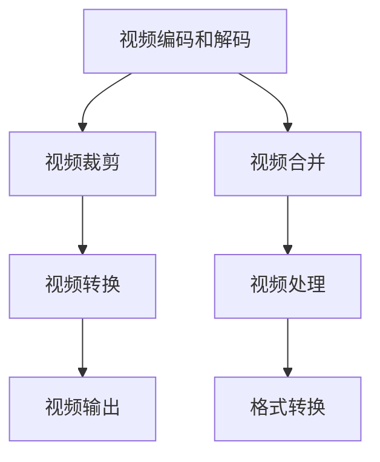

                 

# FFmpeg 视频编辑：裁剪和合并视频片段

> 关键词：FFmpeg, 视频编辑, 视频裁剪, 视频合并, 视频处理

## 1. 背景介绍

在现代信息时代，视频作为一种重要的媒介形式，被广泛用于信息传递、娱乐、教育等领域。随着技术的发展，视频处理技术也在不断进步，帮助用户以更便捷、高效的方式创建、编辑和分享视频内容。FFmpeg是一款开源、跨平台的媒体处理工具，支持包括视频裁剪、合并在内的多种视频编辑操作。本文将详细介绍FFmpeg如何进行视频裁剪和合并操作，帮助用户更好地处理和管理视频内容。

## 2. 核心概念与联系

### 2.1 核心概念概述

FFmpeg是一款开源的、跨平台的媒体处理工具，支持多种视频和音频格式。FFmpeg的核心概念包括视频编码、解码、裁剪、合并、格式转换等。这些概念构成了FFmpeg的核心功能和操作，广泛应用于各种视频处理场景。

**视频编码和解码**：FFmpeg支持H.264、H.265、MPEG-4等多种视频编码和解码格式，能够高效地对视频进行压缩和解压缩。

**视频裁剪**：视频裁剪指的是从原始视频中截取特定时间段或特定位置的视频内容，用于去除不必要的部分或突出重点部分。

**视频合并**：视频合并指的是将多个视频片段合并为一个完整的视频文件，方便用户将多个视频内容整合并生成一个完整的视频。

**视频处理**：视频处理包括视频裁剪、合并、格式转换等操作，是FFmpeg的重要功能之一。

这些核心概念通过FFmpeg提供的命令行工具、库函数和GUI界面等多种方式实现，构成了FFmpeg强大的视频处理能力。

### 2.2 核心概念原理和架构的 Mermaid 流程图



这个流程图展示了FFmpeg视频处理的主要流程：

1. **视频编码和解码**：FFmpeg支持多种视频编码和解码格式，能够高效地对视频进行压缩和解压缩。
2. **视频裁剪**：从原始视频中截取特定时间段或特定位置的视频内容，用于去除不必要的部分或突出重点部分。
3. **视频合并**：将多个视频片段合并为一个完整的视频文件，方便用户将多个视频内容整合并生成一个完整的视频。
4. **视频处理**：包括视频裁剪、合并、格式转换等操作，是FFmpeg的重要功能之一。
5. **视频转换**：将视频从一种格式转换为另一种格式，方便不同平台之间的兼容性。
6. **视频输出**：将处理后的视频输出到指定的文件或流媒体中。

这些核心概念通过FFmpeg提供的命令行工具、库函数和GUI界面等多种方式实现，构成了FFmpeg强大的视频处理能力。

## 3. 核心算法原理 & 具体操作步骤

### 3.1 算法原理概述

FFmpeg的视频裁剪和合并操作主要基于以下几个算法原理：

1. **视频流处理**：FFmpeg将视频流视为一个连续的数据流，每个视频帧都有一个时间戳和位置信息。通过处理这些信息，可以实现视频的裁剪和合并操作。
2. **视频编解码器**：FFmpeg内置多种编解码器，能够高效地对视频进行编码和解码。这些编解码器支持H.264、H.265、MPEG-4等多种视频格式。
3. **视频流操作**：FFmpeg提供了多种视频流操作，包括添加、删除、复制视频流，以及设置视频流的编码参数等。这些操作可以通过命令行工具、库函数和GUI界面等多种方式实现。

### 3.2 算法步骤详解

#### 3.2.1 视频裁剪

**步骤1**：选择需要裁剪的视频文件。

```bash
ffmpeg -i input.mp4
```

**步骤2**：设置裁剪的起始和结束时间。

```bash
ffmpeg -i input.mp4 -ss 00:00:05 -to 00:00:15 -c copy output.mp4
```

**步骤3**：指定输出文件名和格式。

```bash
ffmpeg -i input.mp4 -ss 00:00:05 -to 00:00:15 -c copy output.mp4
```

**步骤4**：运行命令并保存输出文件。

```bash
ffmpeg -i input.mp4 -ss 00:00:05 -to 00:00:15 -c copy output.mp4
```

#### 3.2.2 视频合并

**步骤1**：选择需要合并的视频文件。

```bash
ffmpeg -i input1.mp4 -i input2.mp4
```

**步骤2**：设置合并后的视频格式和参数。

```bash
ffmpeg -i input1.mp4 -i input2.mp4 -c copy output.mp4
```

**步骤3**：运行命令并保存输出文件。

```bash
ffmpeg -i input1.mp4 -i input2.mp4 -c copy output.mp4
```

### 3.3 算法优缺点

#### 3.3.1 算法优点

1. **高效性**：FFmpeg支持多种视频格式和编解码器，能够高效地处理视频数据，减少了处理时间和计算资源。
2. **灵活性**：FFmpeg提供了多种视频流操作和参数设置，用户可以根据需求自由组合和调整，实现灵活的视频处理。
3. **跨平台支持**：FFmpeg支持Windows、Linux、macOS等多个平台，能够在不同操作系统上运行。

#### 3.3.2 算法缺点

1. **复杂性**：FFmpeg的命令行工具和参数设置较为复杂，初学者需要花费一定时间学习和理解。
2. **文件大小限制**：对于特别大的视频文件，可能会出现内存不足或处理时间过长的问题。
3. **依赖库问题**：FFmpeg的某些功能依赖于第三方库，如x264、libvorbis等，需要确保这些库在系统中已安装。

### 3.4 算法应用领域

FFmpeg的视频裁剪和合并操作广泛应用于以下领域：

1. **视频剪辑和编辑**：视频剪辑师使用FFmpeg进行视频剪辑和编辑，去除不必要的部分，突出重点部分。
2. **视频制作和创作**：视频创作者使用FFmpeg进行视频制作和创作，将多个视频片段整合并生成一个完整的视频。
3. **多媒体展示和展示**：多媒体展示和展示系统使用FFmpeg进行视频格式转换和裁剪，适应不同展示平台的需求。
4. **视频监控和记录**：视频监控和记录系统使用FFmpeg进行视频存储和处理，裁剪不必要的部分，保留关键信息。

## 4. 数学模型和公式 & 详细讲解 & 举例说明

### 4.1 数学模型构建

在FFmpeg中进行视频裁剪和合并操作，主要涉及以下数学模型：

1. **视频流时间戳**：视频流中的每个帧都有一个时间戳，表示其在视频中的位置和时间。
2. **视频流编码参数**：视频流的编码参数包括视频分辨率、帧率、比特率等，这些参数会影响视频的质量和大小。
3. **视频流操作**：视频流操作包括添加、删除、复制视频流，以及设置视频流的编码参数等。

### 4.2 公式推导过程

假设视频流的起始时间为$t_s$，结束时间为$t_e$，总时长为$T$，帧率为$f$，视频流的时间戳为$t$，视频流的起始时间为$t_s$，结束时间为$t_e$，总时长为$T$，帧率为$f$。

视频流的总时长$T$可以表示为：

$$
T = \frac{t_e - t_s}{f}
$$

视频流的当前时间戳$t$可以表示为：

$$
t = t_s + (n-1)\frac{T}{f}
$$

其中$n$为视频流的当前帧数。

视频流的编码参数包括视频分辨率$W\times H$、帧率$f$、比特率$b$等，这些参数会影响视频的质量和大小。

### 4.3 案例分析与讲解

假设需要从视频文件`input.mp4`中裁剪出从第5秒到第15秒的内容，保存为`output.mp4`。

**步骤1**：选择需要裁剪的视频文件。

```bash
ffmpeg -i input.mp4
```

**步骤2**：设置裁剪的起始和结束时间。

```bash
ffmpeg -i input.mp4 -ss 00:00:05 -to 00:00:15 -c copy output.mp4
```

**步骤3**：指定输出文件名和格式。

```bash
ffmpeg -i input.mp4 -ss 00:00:05 -to 00:00:15 -c copy output.mp4
```

**步骤4**：运行命令并保存输出文件。

```bash
ffmpeg -i input.mp4 -ss 00:00:05 -to 00:00:15 -c copy output.mp4
```

## 5. 项目实践：代码实例和详细解释说明

### 5.1 开发环境搭建

安装FFmpeg的步骤如下：

1. 在Linux系统上，可以使用以下命令安装FFmpeg：

```bash
sudo apt-get update
sudo apt-get install ffmpeg
```

2. 在Windows系统上，可以从FFmpeg官网下载预编译的Windows版本，解压缩后直接运行。

3. 在macOS系统上，可以使用Homebrew工具安装FFmpeg：

```bash
brew install ffmpeg
```

### 5.2 源代码详细实现

以下是使用FFmpeg进行视频裁剪和合并的命令行示例：

#### 5.2.1 视频裁剪

```bash
ffmpeg -i input.mp4 -ss 00:00:05 -to 00:00:15 -c copy output.mp4
```

**解释**：
- `-i input.mp4`：指定输入文件。
- `-ss 00:00:05`：设置起始时间戳为第5秒。
- `-to 00:00:15`：设置结束时间戳为第15秒。
- `-c copy`：指定复制视频流，不进行重新编码。
- `output.mp4`：指定输出文件。

#### 5.2.2 视频合并

```bash
ffmpeg -i input1.mp4 -i input2.mp4 -c copy output.mp4
```

**解释**：
- `-i input1.mp4`：指定输入文件1。
- `-i input2.mp4`：指定输入文件2。
- `-c copy`：指定复制视频流，不进行重新编码。
- `output.mp4`：指定输出文件。

### 5.3 代码解读与分析

**视频裁剪示例**：

```bash
ffmpeg -i input.mp4 -ss 00:00:05 -to 00:00:15 -c copy output.mp4
```

**解释**：
- `-i input.mp4`：指定输入文件为`input.mp4`。
- `-ss 00:00:05`：设置起始时间戳为第5秒。
- `-to 00:00:15`：设置结束时间戳为第15秒。
- `-c copy`：指定复制视频流，不进行重新编码。
- `output.mp4`：指定输出文件为`output.mp4`。

**视频合并示例**：

```bash
ffmpeg -i input1.mp4 -i input2.mp4 -c copy output.mp4
```

**解释**：
- `-i input1.mp4`：指定输入文件1为`input1.mp4`。
- `-i input2.mp4`：指定输入文件2为`input2.mp4`。
- `-c copy`：指定复制视频流，不进行重新编码。
- `output.mp4`：指定输出文件为`output.mp4`。

### 5.4 运行结果展示

使用FFmpeg进行视频裁剪和合并操作后，可以得到以下结果：

1. **视频裁剪**：生成裁剪后的视频文件，文件大小变小，内容只包含指定时间段内的视频内容。
2. **视频合并**：生成合并后的视频文件，文件大小变大，内容包含所有输入文件的内容。

## 6. 实际应用场景

### 6.1 视频剪辑和编辑

视频剪辑和编辑是视频处理中最常见的任务之一。视频剪辑师使用FFmpeg进行视频剪辑和编辑，去除不必要的部分，突出重点部分，从而得到更加精炼和有价值的视频内容。例如，广告公司可以使用FFmpeg进行视频广告的剪辑和编辑，将多个广告片段整合并生成一个完整的视频广告。

### 6.2 视频制作和创作

视频创作者使用FFmpeg进行视频制作和创作，将多个视频片段整合并生成一个完整的视频。例如，电影制作团队可以使用FFmpeg进行电影场景的剪辑和拼接，将多个拍摄片段整合并生成一个完整电影。

### 6.3 多媒体展示和展示

多媒体展示和展示系统使用FFmpeg进行视频格式转换和裁剪，适应不同展示平台的需求。例如，网站和应用可以使用FFmpeg进行视频格式转换和裁剪，将视频文件适配到不同的设备和浏览器上，从而实现更好的展示效果。

### 6.4 视频监控和记录

视频监控和记录系统使用FFmpeg进行视频存储和处理，裁剪不必要的部分，保留关键信息。例如，监控系统可以使用FFmpeg进行视频存储和处理，裁剪掉不必要的部分，保留关键信息，从而提高视频监控的效果。

## 7. 工具和资源推荐

### 7.1 学习资源推荐

1. FFmpeg官方文档：提供了FFmpeg的详细使用说明和API文档，是学习FFmpeg的最佳资源。
2. FFmpeg教程和示例：提供了大量的FFmpeg教程和示例，帮助用户快速上手。
3. FFmpeg源代码：提供了FFmpeg的源代码和编译指南，帮助用户深入理解FFmpeg的工作原理。

### 7.2 开发工具推荐

1. Linux系统：Linux系统提供了大量的命令行工具和库函数，适合进行视频处理和开发。
2. Windows系统：Windows系统提供了预编译的FFmpeg版本，方便安装和使用。
3. macOS系统：macOS系统提供了Homebrew工具，方便安装和使用FFmpeg。

### 7.3 相关论文推荐

1. "Efficient video processing using FFmpeg"：介绍了FFmpeg的高效视频处理能力。
2. "FFmpeg: the state-of-the-art video processing library"：介绍了FFmpeg的发展历程和功能。
3. "A review of video processing tools: comparing FFmpeg and VLC"：比较了FFmpeg和VLC视频处理工具的性能和功能。

## 8. 总结：未来发展趋势与挑战

### 8.1 研究成果总结

FFmpeg是一款强大的视频处理工具，支持多种视频编码和解码格式，能够高效地处理视频数据。FFmpeg的裁剪和合并操作广泛应用于视频剪辑、视频制作、多媒体展示和展示、视频监控和记录等多个领域，为视频处理提供了强大的支持。

### 8.2 未来发展趋势

1. **多模态视频处理**：未来的视频处理将不仅仅局限于单一的视频格式，而是会涉及到更多的模态数据，如音频、图像等，实现更加丰富的视频处理功能。
2. **实时视频处理**：随着技术的不断发展，实时视频处理将成为视频处理的一个重要方向，FFmpeg将更加注重实时处理能力的提升。
3. **智能视频处理**：未来的视频处理将更多地结合人工智能技术，实现智能化的视频处理，如视频剪辑、视频生成等。
4. **跨平台支持**：FFmpeg将更加注重跨平台支持，提供更加便捷和高效的视频处理体验。

### 8.3 面临的挑战

1. **复杂性**：FFmpeg的命令行工具和参数设置较为复杂，初学者需要花费一定时间学习和理解。
2. **文件大小限制**：对于特别大的视频文件，可能会出现内存不足或处理时间过长的问题。
3. **依赖库问题**：FFmpeg的某些功能依赖于第三方库，如x264、libvorbis等，需要确保这些库在系统中已安装。

### 8.4 研究展望

未来的视频处理技术将更加注重实时性、智能化和跨平台支持，FFmpeg需要不断提升这些方面的能力，以满足用户的实际需求。同时，FFmpeg还需要更加注重易用性和可扩展性，为用户提供更加便捷和高效的视频处理体验。

## 9. 附录：常见问题与解答

**Q1: 如何进行视频裁剪？**

A: 使用FFmpeg进行视频裁剪，可以使用以下命令：

```bash
ffmpeg -i input.mp4 -ss 00:00:05 -to 00:00:15 -c copy output.mp4
```

其中，`-ss`参数设置起始时间戳，`-to`参数设置结束时间戳，`-c copy`参数指定复制视频流，不进行重新编码。

**Q2: 如何进行视频合并？**

A: 使用FFmpeg进行视频合并，可以使用以下命令：

```bash
ffmpeg -i input1.mp4 -i input2.mp4 -c copy output.mp4
```

其中，`-i`参数指定输入文件，`-c copy`参数指定复制视频流，不进行重新编码。

**Q3: 如何进行视频格式转换？**

A: 使用FFmpeg进行视频格式转换，可以使用以下命令：

```bash
ffmpeg -i input.mp4 -c:v libx264 -c:a aac output.mp4
```

其中，`-c:v libx264`参数指定视频编码器为libx264，`-c:a aac`参数指定音频编码器为aac。

**Q4: 如何进行视频缩放？**

A: 使用FFmpeg进行视频缩放，可以使用以下命令：

```bash
ffmpeg -i input.mp4 -vf "scale=640:480" output.mp4
```

其中，`-vf`参数指定视频滤镜，`scale=640:480`参数指定视频缩放比例为640x480。

**Q5: 如何进行视频分割？**

A: 使用FFmpeg进行视频分割，可以使用以下命令：

```bash
ffmpeg -i input.mp4 -map 0 -c copy output.mp4
```

其中，`-map`参数指定输入流，`0`表示输入流为0号流，`-c copy`参数指定复制视频流，不进行重新编码。

通过以上附录内容，相信读者可以更好地理解FFmpeg的视频处理能力，掌握视频裁剪和合并的操作方法，从而更好地处理和管理视频内容。

