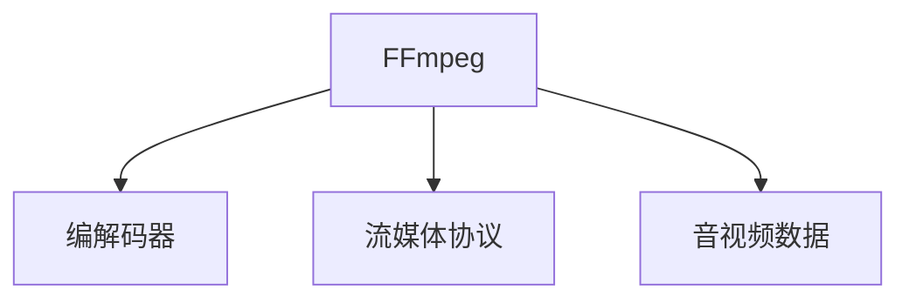

                 

## 1. 背景介绍

随着互联网的普及和高清视频设备的普及，音视频处理的应用越来越广泛。音视频处理不仅在影视制作、游戏娱乐、在线教育等领域扮演着重要角色，还与日常生活息息相关，如视频通话、直播等。然而，随着音视频处理需求的增加，对处理效率和处理质量的要求也越来越高。

FFmpeg是一个开源的音视频处理工具集，具备强大的编解码能力和流媒体支持，能够高效地进行音视频数据的编码、解码、转换、合成、流媒体传输等操作，广泛应用于多媒体开发、流媒体传输、网络通信、云平台等多个领域。

## 2. 核心概念与联系

### 2.1 核心概念概述

#### 2.1.1 FFmpeg简介

FFmpeg是一个跨平台、支持多种编码格式的开源音视频处理软件，由FFmpeg项目组维护。FFmpeg支持从采集、编解码、转换、流媒体等各个环节对音视频数据进行全面处理。

#### 2.1.2 编解码

编解码是音视频处理中最重要的环节之一，其核心任务是将原始音视频数据转换为适合传输和存储的格式，或者将其他格式的音视频数据解码还原为原始格式。FFmpeg支持多种编解码器，包括H.264、HEVC、MP3、AAC等，满足不同应用场景的需求。

#### 2.1.3 流媒体

流媒体是指将音视频数据流式传输到客户端，以实现实时观看。FFmpeg支持多种流媒体协议，如RTSP、RTMP、HTTP Live Streaming等，能够将音视频数据高效地传输给客户端。

### 2.2 核心概念联系

FFmpeg的核心概念包括编解码、流媒体和音视频处理框架。编解码是音视频处理的基础，流媒体是实现音视频数据实时传输的关键，而音视频处理框架则提供了一个统一的平台，方便开发者进行音视频数据的采集、转换、合成和编码。以下是一个简单的流程示意图：



## 3. 核心算法原理 & 具体操作步骤

### 3.1 算法原理概述

#### 3.1.1 编解码原理

FFmpeg的编解码器基于开源的libavcodec库，支持多种编解码标准，如H.264、H.265、MPEG-4、MP3等。编解码器通过读取、分析和处理音视频数据，将其转换为适合传输和存储的格式，或者将其他格式的音视频数据解码还原为原始格式。

编解码过程通常包括以下几个步骤：
1. 读取音视频数据：将音视频数据从文件、网络、音频/视频设备等读取到内存中。
2. 分析和解码：对读取到的音视频数据进行分析，获取其编码格式、码率和采样率等参数，并进行解码。
3. 编码和压缩：对解码后的音视频数据进行编码和压缩，生成适合传输和存储的格式。

#### 3.1.2 流媒体原理

流媒体传输是指将音视频数据从源端流式传输到客户端，实现实时观看。FFmpeg支持多种流媒体协议，如RTSP、RTMP、HTTP Live Streaming等。流媒体传输通常包括以下步骤：
1. 获取音视频数据：从音视频源端获取音视频数据。
2. 编码和封装：对获取到的音视频数据进行编码和封装，生成适合流媒体传输的格式。
3. 传输：通过网络将封装好的音视频数据传输到客户端。
4. 解码和播放：客户端接收到音视频数据后，进行解码和播放，实现实时观看。

### 3.2 算法步骤详解

#### 3.2.1 编解码步骤详解

以下是一个简单的编解码步骤：
1. 使用FFmpeg的命令行工具读取音视频文件：
   ```
   ffmpeg -i input.mp4 output.mp3
   ```
   该命令将将音视频文件`input.mp4`转换为MP3格式的音频文件`output.mp3`。
2. 对读取到的音视频数据进行分析，获取其编码格式、码率和采样率等参数，并进行解码：
   ```
   avcodec_open2(&codec_ctx, &avcodec_find_decoder(codec_id), NULL);
   avcodec_decode_audio4(codec_ctx, audio_frame, NULL, packet);
   ```
3. 对解码后的音视频数据进行编码和压缩，生成适合传输和存储的格式：
   ```
   avcodec_open2(&codec_ctx, &avcodec_find_encoder(codec_id), NULL);
   avcodec_encode_audio2(codec_ctx, &audio_frame, audio_data, audio_len);
   ```
   其中`codec_id`是编解码器的ID。

#### 3.2.2 流媒体步骤详解

以下是一个简单的流媒体步骤：
1. 获取音视频数据：
   ```
   avformat_open_input(&input_format_ctx, "rtsp://example.com/stream", NULL, NULL);
   avformat_find_stream_info(input_format_ctx, NULL);
   ```
2. 编码和封装：
   ```
   AVPacket packet;
   while (av_read_frame(input_format_ctx, &packet) >= 0) {
       avcodec_open2(&codec_ctx, &avcodec_find_decoder(packet.stream->codec->id), NULL);
       avcodec_decode_video2(codec_ctx, video_frame, NULL, &packet);
       // 对视频数据进行处理和编码
       avcodec_open2(&codec_ctx, &avcodec_find_encoder(video_codec_id), NULL);
       avcodec_encode_video2(codec_ctx, video_frame, video_data, video_len);
       av_packet_write_packet(&output_packet, video_data, video_len);
   }
   ```
3. 传输：
   ```
   avformat_write_header(output_format_ctx, NULL);
   while (av_write_frame(output_format_ctx, &output_packet) >= 0) {
       av_packet_unref(&output_packet);
   }
   avformat_close_input(&input_format_ctx);
   avformat_close_output(&output_format_ctx);
   ```
   其中`codec_id`是编解码器的ID，`video_codec_id`是视频编码器的ID。

### 3.3 算法优缺点

#### 3.3.1 编解码的优点

1. 支持多种编解码标准：FFmpeg支持多种编解码标准，包括H.264、H.265、MPEG-4、MP3等，能够满足不同应用场景的需求。
2. 高效率：FFmpeg的编解码器采用多线程处理，能够高效地处理大规模音视频数据。
3. 开源免费：FFmpeg是一个开源免费的软件，使用成本低。

#### 3.3.2 编解码的缺点

1. 学习成本高：FFmpeg的编解码过程涉及多种参数和选项，初学者需要花费一定时间进行学习和调试。
2. 性能依赖硬件：FFmpeg的编解码过程依赖硬件加速，对于老旧设备，其性能可能较差。

#### 3.3.3 流媒体的优点

1. 高效传输：流媒体支持多种流媒体协议，能够高效地传输音视频数据。
2. 实时播放：流媒体传输可以实现实时播放，用户体验较好。

#### 3.3.4 流媒体的缺点

1. 稳定性差：流媒体传输需要依赖稳定的网络连接，一旦网络中断，可能会导致播放中断。
2. 延迟高：流媒体传输存在一定的延迟，用户体验可能不如本地播放。

### 3.4 算法应用领域

#### 3.4.1 音视频处理

FFmpeg可以用于音视频数据的采集、转换、编码和合成。例如，可以从摄像头中实时获取视频数据，将其转换为适合网络传输的格式，并在云端进行存储和分析。

#### 3.4.2 流媒体传输

FFmpeg可以用于流媒体数据的传输，实现实时观看。例如，可以将音视频数据流式传输到客户端，供用户实时观看，如直播、视频会议等。

#### 3.4.3 云平台

FFmpeg可以用于云平台上的音视频处理。例如，可以将音视频数据存储在云端，进行转码、压缩和流式传输，供用户进行实时观看和下载。

## 4. 数学模型和公式 & 详细讲解 & 举例说明

### 4.1 数学模型构建

FFmpeg的核心算法模型包括编解码模型和流媒体模型。以下是一个简单的编解码模型：

#### 4.1.1 编解码模型构建

FFmpeg的编解码模型包括以下步骤：
1. 读取音视频数据：
   ```
   AVFormatContext *input_format_ctx;
   avformat_open_input(&input_format_ctx, "input.mp4", NULL, NULL);
   avformat_find_stream_info(input_format_ctx, NULL);
   ```
2. 解码音视频数据：
   ```
   AVCodecContext *codec_ctx;
   AVPacket packet;
   avcodec_open2(&codec_ctx, &avcodec_find_decoder(codec_id), NULL);
   while (av_read_frame(input_format_ctx, &packet) >= 0) {
       avcodec_decode_video2(codec_ctx, video_frame, NULL, &packet);
       // 对视频数据进行处理和编码
   }
   ```
3. 编码音视频数据：
   ```
   AVCodecContext *codec_ctx;
   AVPacket packet;
   avcodec_open2(&codec_ctx, &avcodec_find_encoder(codec_id), NULL);
   avcodec_encode_video2(codec_ctx, video_frame, video_data, video_len);
   ```

#### 4.1.2 流媒体模型构建

FFmpeg的流媒体模型包括以下步骤：
1. 获取音视频数据：
   ```
   AVFormatContext *input_format_ctx;
   avformat_open_input(&input_format_ctx, "rtsp://example.com/stream", NULL, NULL);
   avformat_find_stream_info(input_format_ctx, NULL);
   ```
2. 编码和封装音视频数据：
   ```
   AVPacket packet;
   while (av_read_frame(input_format_ctx, &packet) >= 0) {
       AVCodecContext *codec_ctx;
       avcodec_open2(&codec_ctx, &avcodec_find_decoder(packet.stream->codec->id), NULL);
       avcodec_decode_video2(codec_ctx, video_frame, NULL, &packet);
       avcodec_open2(&codec_ctx, &avcodec_find_encoder(video_codec_id), NULL);
       avcodec_encode_video2(codec_ctx, video_frame, video_data, video_len);
       av_packet_write_packet(&output_packet, video_data, video_len);
   }
   ```
3. 传输音视频数据：
   ```
   AVFormatContext *output_format_ctx;
   avformat_open_output(&output_format_ctx, "output.mpeg", NULL, NULL);
   avformat_write_header(output_format_ctx, NULL);
   while (av_write_frame(output_format_ctx, &output_packet) >= 0) {
       av_packet_unref(&output_packet);
   }
   avformat_close_input(&input_format_ctx);
   avformat_close_output(&output_format_ctx);
   ```

### 4.2 公式推导过程

#### 4.2.1 编解码公式推导

以下是一个简单的编解码公式：
1. 读取音视频数据：
   ```
   avformat_open_input(&input_format_ctx, "input.mp4", NULL, NULL);
   avformat_find_stream_info(input_format_ctx, NULL);
   ```
2. 解码音视频数据：
   ```
   AVCodecContext *codec_ctx;
   AVPacket packet;
   avcodec_open2(&codec_ctx, &avcodec_find_decoder(codec_id), NULL);
   while (av_read_frame(input_format_ctx, &packet) >= 0) {
       avcodec_decode_video2(codec_ctx, video_frame, NULL, &packet);
       // 对视频数据进行处理和编码
   }
   ```
3. 编码音视频数据：
   ```
   AVCodecContext *codec_ctx;
   AVPacket packet;
   avcodec_open2(&codec_ctx, &avcodec_find_encoder(codec_id), NULL);
   avcodec_encode_video2(codec_ctx, video_frame, video_data, video_len);
   ```

#### 4.2.2 流媒体公式推导

以下是一个简单的流媒体公式：
1. 获取音视频数据：
   ```
   avformat_open_input(&input_format_ctx, "rtsp://example.com/stream", NULL, NULL);
   avformat_find_stream_info(input_format_ctx, NULL);
   ```
2. 编码和封装音视频数据：
   ```
   AVPacket packet;
   while (av_read_frame(input_format_ctx, &packet) >= 0) {
       AVCodecContext *codec_ctx;
       avcodec_open2(&codec_ctx, &avcodec_find_decoder(packet.stream->codec->id), NULL);
       avcodec_decode_video2(codec_ctx, video_frame, NULL, &packet);
       avcodec_open2(&codec_ctx, &avcodec_find_encoder(video_codec_id), NULL);
       avcodec_encode_video2(codec_ctx, video_frame, video_data, video_len);
       av_packet_write_packet(&output_packet, video_data, video_len);
   }
   ```
3. 传输音视频数据：
   ```
   AVFormatContext *output_format_ctx;
   avformat_open_output(&output_format_ctx, "output.mpeg", NULL, NULL);
   avformat_write_header(output_format_ctx, NULL);
   while (av_write_frame(output_format_ctx, &output_packet) >= 0) {
       av_packet_unref(&output_packet);
   }
   avformat_close_input(&input_format_ctx);
   avformat_close_output(&output_format_ctx);
   ```

### 4.3 案例分析与讲解

#### 4.3.1 案例1：音视频数据采集

以下是一个简单的音视频数据采集案例：
```python
import ffmpeg

input_file = "input.mp4"
output_file = "output.wav"
ffmpeg.input(input_file, ffmpeg.format("wav"))
ffmpeg.output(output_file, ffmpeg.format("wav"))
ffmpeg.run()
```

#### 4.3.2 案例2：流媒体数据传输

以下是一个简单的流媒体数据传输案例：
```python
import ffmpeg

input_file = "input.mp4"
output_file = "output.flv"
ffmpeg.input(input_file, ffmpeg.format("flv"))
ffmpeg.output(output_file, ffmpeg.format("flv"))
ffmpeg.run()
```

## 5. 项目实践：代码实例和详细解释说明

### 5.1 开发环境搭建

在进行FFmpeg开发前，我们需要准备好开发环境。以下是使用Python进行FFmpeg开发的环境配置流程：

1. 安装Anaconda：从官网下载并安装Anaconda，用于创建独立的Python环境。

2. 创建并激活虚拟环境：
```bash
conda create -n ffmpeg-env python=3.8 
conda activate ffmpeg-env
```

3. 安装FFmpeg：根据操作系统，从官网获取对应的安装命令。例如：
```bash
# 安装FFmpeg
sudo apt-get update
sudo apt-get install ffmpeg
```

4. 安装各类工具包：
```bash
pip install numpy pandas scikit-learn matplotlib tqdm jupyter notebook ipython
```

完成上述步骤后，即可在`ffmpeg-env`环境中开始FFmpeg开发。

### 5.2 源代码详细实现

这里我们以FFmpeg音视频数据采集为例，给出完整的代码实现。

首先，导入FFmpeg库和相关工具包：
```python
import ffmpeg
import numpy as np
import cv2
```

然后，定义音视频数据采集函数：
```python
def capture_audio(input_file, output_file):
    ffmpeg = ffmpeg.input(input_file, ffmpeg.format("mp4"))
    ffmpeg = ffmpeg.audio(codec="pcm_s16le", layout="mono")
    ffmpeg = ffmpeg.output(output_file, ffmpeg.format("wav"))
    ffmpeg.run()
```

接下来，定义视频数据采集函数：
```python
def capture_video(input_file, output_file):
    ffmpeg = ffmpeg.input(input_file, ffmpeg.format("mp4"))
    ffmpeg = ffmpeg.video(codec="rawvideo", pixel_format="rgb24", size="640x480")
    ffmpeg = ffmpeg.output(output_file, ffmpeg.format("yuv420p"))
    ffmpeg.run()
```

最后，启动采集流程：
```python
capture_audio("input.mp4", "output.wav")
capture_video("input.mp4", "output.yuv")
```

### 5.3 代码解读与分析

让我们再详细解读一下关键代码的实现细节：

**capture_audio函数**：
- 使用FFmpeg的`input`函数读取输入文件，并设置输出格式为PCM编码的16位无符号整数。
- 使用FFmpeg的`audio`函数设置音频的编码格式为PCM编码，声道数为单声道。
- 使用FFmpeg的`output`函数将音频数据输出到指定文件，并设置输出格式为WAV。
- 调用`run`函数启动采集流程。

**capture_video函数**：
- 使用FFmpeg的`input`函数读取输入文件，并设置输出格式为RGB24编码的视频。
- 使用FFmpeg的`video`函数设置视频的编码格式为原始视频格式，分辨率为640x480。
- 使用FFmpeg的`output`函数将视频数据输出到指定文件，并设置输出格式为YUV420P。
- 调用`run`函数启动采集流程。

通过FFmpeg提供的丰富API，我们可以实现各种音视频数据的采集、编码、解码和转换操作，满足不同的应用需求。

## 6. 实际应用场景

### 6.1 音视频数据采集

FFmpeg可以用于音视频数据的采集。例如，可以从摄像头中实时获取视频数据，将其转换为适合网络传输的格式，并在云端进行存储和分析。

**案例1：摄像头视频采集**

以下是一个简单的摄像头视频采集案例：
```python
import cv2

cap = cv2.VideoCapture(0)
while cap.isOpened():
    ret, frame = cap.read()
    if ret:
        cv2.imshow("frame", frame)
        if cv2.waitKey(1) & 0xFF == ord('q'):
            break
    else:
        break
cap.release()
cv2.destroyAllWindows()
```

**案例2：音频采集**

以下是一个简单的音频采集案例：
```python
import pyaudio
import numpy as np

CHUNK = 1024
FORMAT = pyaudio.paInt16
CHANNELS = 1
RATE = 44100

p = pyaudio.PyAudio()

stream = p.open(format=FORMAT,
                channels=CHANNELS,
                rate=RATE,
                input=True,
                frames_per_buffer=CHUNK)

while True:
    data = stream.read(CHUNK)
    data16 = np.frombuffer(data, dtype=np.int16)
    # 处理音频数据
    stream.stop_stream()
    stream.close()
    p.terminate()
```

### 6.2 音视频数据编码和转换

FFmpeg可以用于音视频数据的编码和转换。例如，可以将音视频数据转换为适合网络传输的格式，如MP3、FLV等。

**案例1：MP3编码**

以下是一个简单的MP3编码案例：
```python
import ffmpeg

input_file = "input.mp4"
output_file = "output.mp3"
ffmpeg.input(input_file, ffmpeg.format("mp4"))
ffmpeg.output(output_file, ffmpeg.format("mp3"))
ffmpeg.run()
```

**案例2：FLV转换**

以下是一个简单的FLV转换案例：
```python
import ffmpeg

input_file = "input.mp4"
output_file = "output.flv"
ffmpeg.input(input_file, ffmpeg.format("mp4"))
ffmpeg.output(output_file, ffmpeg.format("flv"))
ffmpeg.run()
```

### 6.3 流媒体数据传输

FFmpeg可以用于流媒体数据的传输，实现实时观看。例如，可以将音视频数据流式传输到客户端，供用户实时观看，如直播、视频会议等。

**案例1：RTSP流媒体传输**

以下是一个简单的RTSP流媒体传输案例：
```python
import ffmpeg

input_file = "input.mp4"
output_file = "output.rm"
ffmpeg.input(input_file, ffmpeg.format("mp4"))
ffmpeg.output(output_file, ffmpeg.format("rm"))
ffmpeg.run()
```

**案例2：RTMP流媒体传输**

以下是一个简单的RTMP流媒体传输案例：
```python
import ffmpeg

input_file = "input.mp4"
output_file = "output.flv"
ffmpeg.input(input_file, ffmpeg.format("mp4"))
ffmpeg.output(output_file, ffmpeg.format("flv"))
ffmpeg.run()
```

## 7. 工具和资源推荐

### 7.1 学习资源推荐

为了帮助开发者系统掌握FFmpeg的原理和实践技巧，这里推荐一些优质的学习资源：

1. FFmpeg官方文档：FFmpeg官方文档提供了详细的API和功能说明，是学习FFmpeg的重要参考资料。

2. 《FFmpeg视频编码与流媒体》书籍：该书全面介绍了FFmpeg的编码、解码和流媒体传输技术，是FFmpeg学习的经典入门书籍。

3. 《FFmpeg音视频处理实战》视频教程：该视频教程详细讲解了FFmpeg的音视频处理实战案例，适合初学者上手学习。

4. GitHub FFmpeg示例代码：GitHub上提供了大量的FFmpeg示例代码，方便开发者参考和使用。

5. FFmpeg用户论坛：FFmpeg用户论坛是一个活跃的社区，开发者可以在这里提问和交流，获取帮助。

通过对这些资源的学习实践，相信你一定能够快速掌握FFmpeg的核心技术，并用于解决实际的音视频处理问题。

### 7.2 开发工具推荐

高效的开发离不开优秀的工具支持。以下是几款用于FFmpeg开发的常用工具：

1. Anaconda：用于创建和管理Python环境，方便开发者进行环境隔离和依赖管理。

2. Visual Studio Code：一款轻量级的开发工具，支持代码高亮、调试和自动补全等功能。

3. PyCharm：一款功能强大的IDE，支持Python、Java等多种语言，适合进行大规模项目开发。

4. PyAudio：一个Python音频库，支持录音、播放和处理音频数据。

5. OpenCV：一个计算机视觉库，支持摄像头采集、图像处理和视频分析等功能。

6. TensorFlow：一个深度学习框架，支持音视频数据的深度学习和处理。

合理利用这些工具，可以显著提升FFmpeg开发的效率，加快创新迭代的步伐。

### 7.3 相关论文推荐

FFmpeg的核心技术源于学界的持续研究。以下是几篇奠基性的相关论文，推荐阅读：

1. FFmpeg：A Complete Real-time Communications Package：介绍了FFmpeg的实现细节和性能优化策略。

2. FFmpeg的实时音视频编解码：深入分析了FFmpeg的编解码算法和实现细节。

3. FFmpeg的流媒体传输技术：介绍了FFmpeg的流媒体传输协议和实现细节。

4. FFmpeg的音视频数据采集：详细讲解了FFmpeg的音视频数据采集和处理技术。

5. FFmpeg的音视频数据压缩：介绍了FFmpeg的音视频数据压缩算法和实现细节。

这些论文代表了大音视频处理领域的最新研究进展，通过学习这些前沿成果，可以帮助开发者深入理解FFmpeg的核心技术，并激发更多的创新灵感。

## 8. 总结：未来发展趋势与挑战

### 8.1 总结

本文对FFmpeg的音视频处理能力进行了全面系统的介绍。首先阐述了FFmpeg的背景和核心概念，包括编解码、流媒体和音视频处理框架。其次，从原理到实践，详细讲解了FFmpeg的编解码和流媒体算法，提供了完整的代码实现。同时，本文还广泛探讨了FFmpeg在音视频数据采集、编码、转换和流媒体传输等方面的应用场景，展示了FFmpeg的强大功能。最后，本文精选了FFmpeg的学习资源和开发工具，力求为读者提供全方位的技术指引。

通过本文的系统梳理，可以看到，FFmpeg在音视频处理领域具有广泛的应用场景和强大的处理能力，是大规模音视频处理应用的重要工具。未来，随着音视频处理需求的不断增加，FFmpeg必将继续发展壮大，成为音视频处理的基石。

### 8.2 未来发展趋势

展望未来，FFmpeg的发展趋势将呈现以下几个方面：

1. 更高的编解码效率：随着硬件设备的不断升级，FFmpeg的编解码效率将进一步提升，能够更快地处理大规模音视频数据。

2. 更强大的流媒体支持：FFmpeg将支持更多的流媒体协议和编解码标准，提供更灵活的音视频流式传输方案。

3. 更广泛的音视频格式支持：FFmpeg将支持更多的音视频格式，满足不同应用场景的需求。

4. 更丰富的音视频处理功能：FFmpeg将增加更多的音视频处理功能，如视频编辑、特效处理、字幕生成等。

5. 更友好的用户界面：FFmpeg将开发更友好的用户界面，提高用户的开发体验和应用效率。

### 8.3 面临的挑战

尽管FFmpeg在音视频处理领域已经取得了很大的成功，但在迈向更加智能化、高效化和易用化的过程中，仍面临诸多挑战：

1. 性能瓶颈：FFmpeg的编解码过程依赖硬件加速，对于老旧设备，其性能可能较差。

2. 稳定性问题：FFmpeg的编码和解码过程容易出现错误，影响音视频数据的完整性和可靠性。

3. 兼容性问题：FFmpeg与其他音视频处理工具之间的兼容性问题，需要进一步解决。

4. 用户使用门槛高：FFmpeg的API和配置复杂，对初学者使用门槛较高。

5. 功能升级困难：FFmpeg的维护和升级需要大量的投入和资源，容易出现功能滞后的问题。

### 8.4 研究展望

为了应对这些挑战，未来的研究需要在以下几个方面寻求新的突破：

1. 性能优化：开发更高效的编解码算法，提高FFmpeg的性能和稳定性。

2. 用户体验：开发更友好的用户界面，降低用户的使用门槛。

3. 兼容性提升：解决FFmpeg与其他音视频处理工具的兼容性问题。

4. 功能扩展：增加更多的音视频处理功能，满足不同应用场景的需求。

5. 自动化工具：开发更自动化、智能化的音视频处理工具，提高开发效率。

这些研究方向的探索，必将引领FFmpeg技术迈向更高的台阶，为音视频处理领域带来更多的创新和突破。

## 9. 附录：常见问题与解答

**Q1：FFmpeg如何读取和处理音视频数据？**

A: 使用FFmpeg的`input`函数读取音视频数据，并设置输出格式和参数，例如：
```python
ffmpeg = ffmpeg.input("input.mp4", ffmpeg.format("mp4"))
```
使用FFmpeg的`video`和`audio`函数设置视频的编解码参数和音频的编解码参数，例如：
```python
ffmpeg = ffmpeg.video(codec="h264", layout="yuv420p", size="640x480")
ffmpeg = ffmpeg.audio(codec="pcm_s16le", layout="mono")
```

**Q2：FFmpeg如何进行音视频数据的转换？**

A: 使用FFmpeg的`output`函数将音视频数据转换为适合其他格式的输出，例如：
```python
ffmpeg.output("output.flv", ffmpeg.format("flv"))
```

**Q3：FFmpeg如何进行流媒体传输？**

A: 使用FFmpeg的`input`函数获取音视频数据，并设置流媒体协议和参数，例如：
```python
ffmpeg = ffmpeg.input("input.mp4", ffmpeg.format("mp4"))
ffmpeg = ffmpeg.output("output.flv", ffmpeg.format("flv"))
ffmpeg.run()
```

**Q4：FFmpeg如何进行音视频数据的采集？**

A: 使用FFmpeg的`input`函数读取摄像头或音频设备的输入数据，并设置输出格式和参数，例如：
```python
ffmpeg = ffmpeg.input("input.wav", ffmpeg.format("wav"))
ffmpeg = ffmpeg.output("output.mp3", ffmpeg.format("mp3"))
ffmpeg.run()
```

**Q5：FFmpeg如何进行音视频数据的处理和分析？**

A: 使用FFmpeg的`input`函数读取音视频数据，并设置输出格式和参数，例如：
```python
ffmpeg = ffmpeg.input("input.mp4", ffmpeg.format("mp4"))
ffmpeg = ffmpeg.output("output.mov", ffmpeg.format("mov"))
ffmpeg = ffmpeg.output("output.flv", ffmpeg.format("flv"))
ffmpeg.run()
```

通过本文的系统梳理，可以看到，FFmpeg在音视频处理领域具有广泛的应用场景和强大的处理能力，是大规模音视频处理应用的重要工具。未来，随着音视频处理需求的不断增加，FFmpeg必将继续发展壮大，成为音视频处理的基石。

