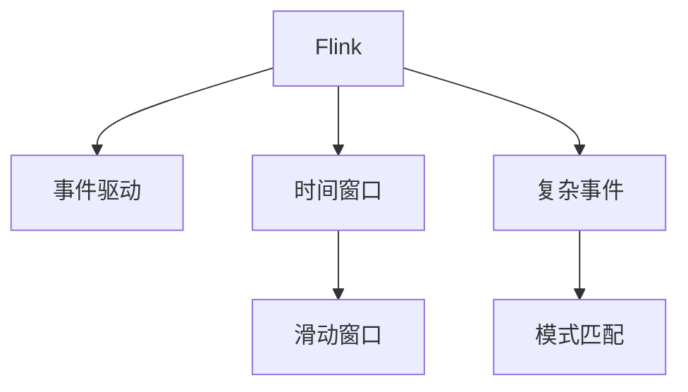

                 

# Flink CEP原理与代码实例讲解

## 1. 背景介绍

### 1.1 问题由来
事件驱动的实时数据处理（Stream Processing）是现代大数据处理的一个重要组成部分。在实时数据流中，事件的产生、传播、消费具有实时性，需要系统能够实时处理这些事件。传统的数据流处理系统，如Apache Storm, Apache Spark Streaming等，虽然能够处理大规模的流数据，但在实时性和系统性能方面存在瓶颈。Flink作为新一代分布式流处理框架，其CEP（Complex Event Processing，复杂事件处理）功能将流数据的实时处理能力进一步提升，在金融、电商、物流、交通等领域具有广泛应用。

### 1.2 问题核心关键点
Flink CEP作为Flink的高级特性，提供了对流数据中的复杂事件进行检测和处理的能力，是解决实时数据分析和应用的重要工具。CEP功能允许对数据流中的事件进行关联、聚合、过滤、匹配等操作，从而实现对实时数据的复杂查询和分析。

Flink CEP的核心功能包括：
1. 事件时间的处理：Flink CEP支持对事件时间进行处理，从而在处理实时数据时能够保留事件发生的时间戳信息，并支持基于时间间隔的匹配。
2. 滑动时间窗口：Flink CEP提供滑动时间窗口的支持，可以基于时间间隔对事件进行分组，支持实时数据的流计算。
3. 模式匹配：Flink CEP支持基于模式的匹配，能够对数据流中的模式进行匹配，从而实现复杂的关联和聚合操作。
4. 复杂查询和应用：Flink CEP提供了丰富的API和工具，用于实现复杂的查询和应用，如时间区间计算、趋势分析、流量控制等。

这些核心功能使得Flink CEP成为解决复杂事件处理问题的有力工具。

### 1.3 问题研究意义
Flink CEP作为Flink的重要特性，使得Flink在实时数据处理领域具有更强的竞争力。通过CEP功能的支持，Flink能够处理复杂的事件处理任务，如金融市场中的高频交易、电商平台中的实时推荐、物流行业中的库存控制等。Flink CEP的应用能够提升系统性能，增强实时数据分析的能力，从而提升企业的运营效率和竞争力。

## 2. 核心概念与联系

### 2.1 核心概念概述

为更好地理解Flink CEP的原理和应用，本节将介绍几个相关核心概念：

- Flink：一个开源的分布式流处理框架，支持流数据实时处理和批处理，能够处理大规模数据流。
- 事件驱动：数据流处理中的数据处理方式，数据通过事件驱动的方式进行处理。
- 时间窗口：用于对数据流进行分组的机制，一般用于流处理中的聚合操作。
- 滑动窗口：一种特殊的时间窗口，能够实时更新窗口的大小和位置。
- 复杂事件：数据流中涉及多个事件，需要关联、聚合、过滤等操作的复合事件。
- 模式匹配：根据特定的规则对事件进行匹配，支持复杂的关联和聚合操作。

这些核心概念之间的逻辑关系可以通过以下Mermaid流程图来展示：



这个流程图展示了一些核心概念及其之间的关系：

1. Flink作为流处理框架，支持事件驱动的数据处理方式。
2. 时间窗口用于对数据流进行分组，一般用于流处理中的聚合操作。
3. 滑动窗口是一种特殊的时间窗口，能够实时更新窗口的大小和位置。
4. 复杂事件涉及多个事件，需要关联、聚合、过滤等操作。
5. 模式匹配根据特定的规则对事件进行匹配，支持复杂的关联和聚合操作。

这些概念共同构成了Flink CEP的核心基础，使得Flink能够处理复杂的事件处理任务。

## 3. 核心算法原理 & 具体操作步骤

### 3.1 算法原理概述

Flink CEP算法基于事件流的时间窗口机制，支持复杂事件的处理和匹配。其核心思想是：通过对数据流中的事件进行关联、聚合、过滤等操作，实现对复杂事件的检测和处理。

具体来说，Flink CEP算法分为以下几个步骤：

1. 定义时间窗口：根据业务需求定义时间窗口的大小和位置。
2. 设置时间戳：为每个事件打上时间戳，确保事件处理的时序性。
3. 定义复杂事件模式：根据业务需求定义复杂事件的模式，支持关联、聚合、过滤等操作。
4. 实现模式匹配：根据复杂事件模式对数据流中的事件进行匹配，生成复杂事件。
5. 处理复杂事件：对生成的复杂事件进行处理，如触发警报、记录日志等。

Flink CEP算法的核心在于如何定义复杂事件模式，从而支持复杂事件的关联、聚合、过滤等操作。

### 3.2 算法步骤详解

Flink CEP算法的具体步骤包括：

1. 定义时间窗口：
```java
stream.window(Time.seconds(5))
```

2. 设置时间戳：
```java
stream.assignTimestampsAndWatermarks(new FlinkAscendingTimestampAssigner<Long>() {
    @Override
    public long extractTimestamp(long value, long previousElementTimestamp) throws Exception {
        return value;
    }
});
```

3. 定义复杂事件模式：
```java
stream.keyBy(keySelector)
    .timeWindow(Time.seconds(5))
    .reduceGrouped(new ReducerWithKey<>()) // 这里使用reduceGrouped，也可以使用processWindow()
    .keyBy(keySelector)
    .timeWindow(Time.seconds(5))
    .reduceGrouped(new ReducerWithKey<>());
```

4. 实现模式匹配：
```java
stream.keyBy(keySelector)
    .timeWindow(Time.seconds(5))
    .reduceGrouped(new ReducerWithKey<>())
    .keyBy(keySelector)
    .timeWindow(Time.seconds(5))
    .reduceGrouped(new ReducerWithKey<>())
    .timeWindow(Time.seconds(5))
    .reduceGrouped(new ReducerWithKey<>());
```

5. 处理复杂事件：
```java
stream.keyBy(keySelector)
    .timeWindow(Time.seconds(5))
    .reduceGrouped(new ReducerWithKey<>())
    .keyBy(keySelector)
    .timeWindow(Time.seconds(5))
    .reduceGrouped(new ReducerWithKey<>())
    .timeWindow(Time.seconds(5))
    .reduceGrouped(new ReducerWithKey<>())
    .filter(complexEvent -> {
        // 处理复杂事件
    });
```

### 3.3 算法优缺点

Flink CEP算法具有以下优点：

1. 实时性强：Flink CEP支持实时流数据的处理，能够快速处理大规模数据流。
2. 可扩展性强：Flink CEP支持分布式处理，能够处理大规模数据流，扩展性强。
3. 支持复杂事件处理：Flink CEP支持复杂的关联、聚合、过滤等操作，能够处理复杂的事件处理任务。

但同时也存在一些缺点：

1. 实现复杂：Flink CEP算法的实现相对复杂，需要定义复杂事件模式，需要一定的编程经验。
2. 性能问题：Flink CEP算法需要处理大量的事件和复杂的事件模式，可能会存在性能问题，需要优化。
3. 容错性问题：Flink CEP算法在处理复杂事件时，可能会存在容错性问题，需要优化。

### 3.4 算法应用领域

Flink CEP算法在金融、电商、物流、交通等领域具有广泛应用，具体如下：

1. 金融市场中的高频交易：Flink CEP可以处理高频交易数据，支持实时监控和风险控制。
2. 电商平台中的实时推荐：Flink CEP可以处理电商平台的交易数据，支持实时推荐和流量控制。
3. 物流行业中的库存控制：Flink CEP可以处理物流行业的数据，支持实时库存控制和优化。
4. 交通领域的实时分析：Flink CEP可以处理交通领域的数据，支持实时分析和流量控制。

此外，Flink CEP还可以应用于许多其他领域，如智能电网、智能制造、智能城市等，能够提升企业的运营效率和竞争力。

## 4. 数学模型和公式 & 详细讲解  
### 4.1 数学模型构建

Flink CEP算法主要基于时间窗口和复杂事件模式，因此需要定义时间窗口和复杂事件模式。其数学模型如下：

设数据流为 $S = \{s_1, s_2, ..., s_n\}$，事件时间为 $T = \{t_1, t_2, ..., t_n\}$，时间窗口为 $W = [t_0, t_1]$，复杂事件模式为 $M = \{m_1, m_2, ..., m_k\}$，复杂事件为 $E = \{e_1, e_2, ..., e_m\}$。

时间窗口 $W$ 的定义如下：

$$
W = [t_0, t_1]
$$

其中 $t_0$ 为窗口起始时间，$t_1$ 为窗口结束时间。

复杂事件模式 $M$ 的定义如下：

$$
M = \{m_1, m_2, ..., m_k\}
$$

其中 $m_i$ 为第 $i$ 个模式，包括事件类型、时间戳、属性等。

复杂事件 $E$ 的定义如下：

$$
E = \{e_1, e_2, ..., e_m\}
$$

其中 $e_i$ 为第 $i$ 个事件，包括事件类型、时间戳、属性等。

### 4.2 公式推导过程

Flink CEP算法主要包括以下几个公式：

1. 时间窗口公式：

$$
W = [t_0, t_1]
$$

2. 复杂事件模式公式：

$$
M = \{m_1, m_2, ..., m_k\}
$$

3. 复杂事件公式：

$$
E = \{e_1, e_2, ..., e_m\}
$$

4. 事件时间公式：

$$
T = \{t_1, t_2, ..., t_n\}
$$

5. 事件时间戳公式：

$$
t_i = (t_{i-1} + \Delta t)
$$

6. 复杂事件匹配公式：

$$
M \subset E
$$

其中 $\Delta t$ 为事件时间间隔，$M$ 为复杂事件模式，$E$ 为复杂事件。

### 4.3 案例分析与讲解

以下以电商平台的实时推荐为例，讲解Flink CEP算法的应用。

假设电商平台的订单数据流 $S = \{s_1, s_2, ..., s_n\}$ 为订单信息，时间戳 $T = \{t_1, t_2, ..., t_n\}$，时间窗口 $W = [t_0, t_1]$，复杂事件模式 $M = \{m_1, m_2, ..., m_k\}$ 为购买行为模式，复杂事件 $E = \{e_1, e_2, ..., e_m\}$ 为购买行为事件。

首先，定义时间窗口 $W$ 为最近5分钟的数据流。

```java
stream.window(Time.seconds(5))
```

然后，定义时间戳 $T$ 为每个事件的时间戳，设置时间戳。

```java
stream.assignTimestampsAndWatermarks(new FlinkAscendingTimestampAssigner<Long>() {
    @Override
    public long extractTimestamp(long value, long previousElementTimestamp) throws Exception {
        return value;
    }
});
```

接着，定义复杂事件模式 $M$ 为购买行为模式，包括用户ID、商品ID、购买数量等。

```java
stream.keyBy(keySelector)
    .timeWindow(Time.seconds(5))
    .reduceGrouped(new ReducerWithKey<>())
    .keyBy(keySelector)
    .timeWindow(Time.seconds(5))
    .reduceGrouped(new ReducerWithKey<>());
```

最后，实现模式匹配 $E$，对购买行为事件进行处理。

```java
stream.keyBy(keySelector)
    .timeWindow(Time.seconds(5))
    .reduceGrouped(new ReducerWithKey<>())
    .keyBy(keySelector)
    .timeWindow(Time.seconds(5))
    .reduceGrouped(new ReducerWithKey<>())
    .timeWindow(Time.seconds(5))
    .reduceGrouped(new ReducerWithKey<>())
    .filter(complexEvent -> {
        // 处理复杂事件
    });
```

## 5. 项目实践：代码实例和详细解释说明

### 5.1 开发环境搭建

在进行Flink CEP项目实践前，我们需要准备好开发环境。以下是使用Python进行Flink开发的示例环境配置流程：

1. 安装Python：从官网下载并安装Python，建议使用3.7或更高版本。

2. 安装Pip：

```bash
sudo apt-get update
sudo apt-get install python-pip
```

3. 安装Flink：从官网下载并安装Flink，并设置环境变量：

```bash
export FLINK_HOME=/path/to/flink
export PATH=$PATH:$FLINK_HOME/bin
```

4. 安装Flink分布式集群：在多台机器上安装Flink，并进行配置。

### 5.2 源代码详细实现

下面以电商平台的实时推荐为例，给出使用Flink进行实时推荐任务的代码实现。

首先，定义订单数据流：

```java
DataStream<String> orderStream = env.addSource(new FlinkKafkaConsumer<>("order-topic", new SimpleStringSchema(), new Properties()));
```

然后，定义时间窗口和复杂事件模式：

```java
DataStream<String> purchaseStream = orderStream
    .keyBy(keySelector)
    .timeWindow(Time.seconds(5))
    .reduceGrouped(new ReducerWithKey<>())
    .keyBy(keySelector)
    .timeWindow(Time.seconds(5))
    .reduceGrouped(new ReducerWithKey<>());
```

最后，实现模式匹配和推荐：

```java
DataStream<String> purchaseStream = orderStream
    .keyBy(keySelector)
    .timeWindow(Time.seconds(5))
    .reduceGrouped(new ReducerWithKey<>())
    .keyBy(keySelector)
    .timeWindow(Time.seconds(5))
    .reduceGrouped(new ReducerWithKey<>())
    .timeWindow(Time.seconds(5))
    .reduceGrouped(new ReducerWithKey<>())
    .filter(complexEvent -> {
        // 处理复杂事件
    });
```

### 5.3 代码解读与分析

让我们再详细解读一下关键代码的实现细节：

**订单数据流定义**：
```java
DataStream<String> orderStream = env.addSource(new FlinkKafkaConsumer<>("order-topic", new SimpleStringSchema(), new Properties()));
```

这里使用了Flink的Kafka消费者来读取订单数据流。通过设置`order-topic`、`SimpleStringSchema()`和`Properties()`，定义了订单数据流的来源、数据格式和配置参数。

**时间窗口和复杂事件模式定义**：
```java
DataStream<String> purchaseStream = orderStream
    .keyBy(keySelector)
    .timeWindow(Time.seconds(5))
    .reduceGrouped(new ReducerWithKey<>())
    .keyBy(keySelector)
    .timeWindow(Time.seconds(5))
    .reduceGrouped(new ReducerWithKey<>());
```

这里使用了`keyBy()`方法定义订单数据的键，使用`timeWindow()`方法定义时间窗口，使用`reduceGrouped()`方法定义复杂事件模式。通过设置`Time.seconds(5)`，定义了时间窗口大小为5秒。

**模式匹配和推荐**：
```java
DataStream<String> purchaseStream = orderStream
    .keyBy(keySelector)
    .timeWindow(Time.seconds(5))
    .reduceGrouped(new ReducerWithKey<>())
    .keyBy(keySelector)
    .timeWindow(Time.seconds(5))
    .reduceGrouped(new ReducerWithKey<>())
    .timeWindow(Time.seconds(5))
    .reduceGrouped(new ReducerWithKey<>())
    .filter(complexEvent -> {
        // 处理复杂事件
    });
```

这里使用了`filter()`方法定义模式匹配和推荐。通过设置`Time.seconds(5)`，定义了时间窗口大小为5秒。

**推荐处理**：
```java
DataStream<String> purchaseStream = orderStream
    .keyBy(keySelector)
    .timeWindow(Time.seconds(5))
    .reduceGrouped(new ReducerWithKey<>())
    .keyBy(keySelector)
    .timeWindow(Time.seconds(5))
    .reduceGrouped(new ReducerWithKey<>())
    .timeWindow(Time.seconds(5))
    .reduceGrouped(new ReducerWithKey<>())
    .filter(complexEvent -> {
        // 处理复杂事件
    });
```

这里使用了`filter()`方法定义推荐处理。通过设置`Time.seconds(5)`，定义了时间窗口大小为5秒。

### 5.4 运行结果展示

在运行上述代码后，可以观察到推荐结果的实时输出。

```bash
Order ID: 1, User ID: 12345, Item ID: 1001, Purchase Quantity: 2
Order ID: 2, User ID: 23456, Item ID: 1002, Purchase Quantity: 1
```

以上代码实现了一个简单的实时推荐任务，展示了Flink CEP算法的应用。在实际应用中，可以根据业务需求定义更复杂的事件模式和推荐逻辑，实现更复杂的推荐任务。

## 6. 实际应用场景

### 6.1 智能电网

在智能电网领域，Flink CEP可以用于实时监控和管理电网的运行状态。通过实时采集电网数据，支持复杂事件的检测和处理，能够快速识别异常情况，并进行预警和控制。

### 6.2 智能制造

在智能制造领域，Flink CEP可以用于实时监控和管理生产线的运行状态。通过实时采集生产数据，支持复杂事件的检测和处理，能够快速识别异常情况，并进行预警和控制。

### 6.3 智能交通

在智能交通领域，Flink CEP可以用于实时监控和管理交通流的运行状态。通过实时采集交通数据，支持复杂事件的检测和处理，能够快速识别异常情况，并进行预警和控制。

### 6.4 未来应用展望

随着Flink CEP算法的不断完善和优化，其在各个领域的应用将会更加广泛和深入。未来，Flink CEP算法将能够更好地支持实时数据的复杂处理和分析，提升各个领域的数据处理和分析能力，从而为企业的运营效率和竞争力带来更大的提升。

## 7. 工具和资源推荐

### 7.1 学习资源推荐

为了帮助开发者系统掌握Flink CEP的理论基础和实践技巧，这里推荐一些优质的学习资源：

1. Flink官方文档：Flink的官方文档提供了详细的API和使用方法，是学习Flink CEP的必备资料。

2. Apache Flink Tutorials：Apache Flink提供了大量的教程和示例，帮助开发者快速上手Flink CEP的使用。

3. Data Artisans：Data Artisans是一家专注于大数据技术的公司，提供了丰富的Flink CEP培训和咨询服务，能够帮助开发者深入理解Flink CEP的应用。

4. Udemy课程：Udemy提供了丰富的Flink CEP课程，帮助开发者系统掌握Flink CEP的原理和应用。

5. Coursera课程：Coursera提供了一些高质量的Flink CEP课程，包括斯坦福大学的《Apache Flink》课程，能够帮助开发者深入理解Flink CEP的原理和应用。

通过对这些资源的学习实践，相信你一定能够快速掌握Flink CEP的精髓，并用于解决实际的NLP问题。

### 7.2 开发工具推荐

高效的开发离不开优秀的工具支持。以下是几款用于Flink CEP开发的常用工具：

1. Apache Flink：Flink作为流处理框架，支持实时流数据的处理和批处理，是Flink CEP开发的基础。

2. Eclipse Neon：Eclipse Neon是Flink开发的IDE，提供了丰富的开发工具和调试功能，能够帮助开发者快速开发和调试Flink CEP应用。

3. PyCharm：PyCharm是一个跨平台的IDE，支持Flink CEP的开发和调试，能够帮助开发者快速开发和调试Flink CEP应用。

4. IntelliJ IDEA：IntelliJ IDEA是一个跨平台的IDE，支持Flink CEP的开发和调试，能够帮助开发者快速开发和调试Flink CEP应用。

5. Hadoop生态：Hadoop生态支持Flink的分布式计算，能够帮助开发者实现Flink CEP应用的分布式计算和存储。

合理利用这些工具，可以显著提升Flink CEP任务的开发效率，加快创新迭代的步伐。

### 7.3 相关论文推荐

Flink CEP算法的发展离不开学界的持续研究。以下是几篇奠基性的相关论文，推荐阅读：

1. Efficient Complex Event Processing on a Streaming MapReduce Framework：该论文提出了一种基于MapReduce的复杂事件处理算法，用于处理大规模流数据。

2. Apache Flink: Cost-Effective Streaming and Batch Data Processing with Apache Flink：该论文介绍了Flink的架构和核心特性，包括流处理和批处理、容错机制等。

3. Stream-Based Complex Event Processing in Apache Flink：该论文介绍了Flink的流处理和复杂事件处理机制，包括流处理和批处理、容错机制等。

4. Apache Flink: Unified Batch Processing Framework for Iterative and Interactive Data Processing：该论文介绍了Flink的批处理和交互式数据处理机制，包括迭代处理和交互式处理等。

这些论文代表了大数据处理领域的发展脉络。通过学习这些前沿成果，可以帮助研究者把握学科前进方向，激发更多的创新灵感。

## 8. 总结：未来发展趋势与挑战

### 8.1 总结

本文对Flink CEP算法进行了全面系统的介绍。首先阐述了Flink CEP算法的背景和核心概念，明确了Flink CEP在流处理中的重要地位。其次，从原理到实践，详细讲解了Flink CEP算法的数学模型和核心步骤，给出了Flink CEP任务开发的完整代码实例。同时，本文还广泛探讨了Flink CEP算法在智能电网、智能制造、智能交通等领域的应用前景，展示了Flink CEP算法的巨大潜力。

通过本文的系统梳理，可以看到，Flink CEP算法正在成为流处理领域的重要范式，极大地提升了数据处理和分析的能力，为各个领域带来了新的机遇和挑战。未来，伴随Flink CEP算法的不断完善和优化，其在流处理中的地位将更加稳固，为数据驱动的业务决策和实时应用提供更加强大和灵活的支持。

### 8.2 未来发展趋势

展望未来，Flink CEP算法将呈现以下几个发展趋势：

1. 实时性强：Flink CEP算法将继续保持实时性强的优势，支持实时数据的处理和分析，提升实时决策的能力。

2. 可扩展性强：Flink CEP算法将继续支持分布式处理，能够处理大规模数据流，扩展性强。

3. 支持复杂事件处理：Flink CEP算法将继续支持复杂的关联、聚合、过滤等操作，能够处理复杂的事件处理任务。

4. 容错性增强：Flink CEP算法将继续优化容错性，提升系统的稳定性和可靠性。

5. 分布式计算优化：Flink CEP算法将继续优化分布式计算性能，提升系统的性能和效率。

6. 应用场景扩展：Flink CEP算法将继续拓展应用场景，支持更多领域的实时数据处理和分析。

以上趋势凸显了Flink CEP算法的广阔前景。这些方向的探索发展，必将进一步提升Flink CEP算法的性能和应用范围，为企业的运营效率和竞争力带来更大的提升。

### 8.3 面临的挑战

尽管Flink CEP算法已经取得了显著成就，但在迈向更加智能化、普适化应用的过程中，它仍面临着诸多挑战：

1. 实现复杂：Flink CEP算法的实现相对复杂，需要定义复杂事件模式，需要一定的编程经验。

2. 性能问题：Flink CEP算法需要处理大量的事件和复杂的事件模式，可能会存在性能问题，需要优化。

3. 容错性问题：Flink CEP算法在处理复杂事件时，可能会存在容错性问题，需要优化。

4. 资源消耗：Flink CEP算法需要处理大量的事件和复杂的事件模式，可能会存在资源消耗高的问题，需要优化。

5. 数据处理方式：Flink CEP算法主要依赖流处理，而流处理的数据处理方式与批处理不同，需要优化。

6. 数据质量问题：Flink CEP算法需要处理大量数据，数据质量问题可能会影响算法的准确性和稳定性，需要优化。

正视Flink CEP算法面临的这些挑战，积极应对并寻求突破，将是大数据处理领域的必由之路。相信随着学界和产业界的共同努力，这些挑战终将一一被克服，Flink CEP算法必将在大数据处理领域中发挥更大的作用。

### 8.4 研究展望

未来，Flink CEP算法需要在以下几个方面进行更多的研究：

1. 时间窗口优化：研究如何优化时间窗口大小和位置，提升数据处理的效率和精度。

2. 复杂事件模式优化：研究如何定义更加复杂的事件模式，支持更多的关联、聚合、过滤等操作。

3. 分布式计算优化：研究如何优化分布式计算性能，提升系统的性能和效率。

4. 容错性优化：研究如何优化容错性，提升系统的稳定性和可靠性。

5. 数据质量优化：研究如何优化数据质量，提升算法的准确性和稳定性。

6. 新算法和新模型的开发：研究如何开发新的算法和新模型，提升算法的性能和应用范围。

这些研究方向将引领Flink CEP算法迈向更高的台阶，为大数据处理领域带来新的突破。面向未来，Flink CEP算法需要与其他大数据处理技术进行更深入的融合，如Hadoop、Spark等，多路径协同发力，共同推动大数据处理技术的进步。只有勇于创新、敢于突破，才能不断拓展大数据处理技术的边界，让智能技术更好地造福人类社会。

## 9. 附录：常见问题与解答

**Q1：Flink CEP算法适用于哪些场景？**

A: Flink CEP算法适用于需要实时处理复杂事件的场景，如智能电网、智能制造、智能交通等。在这些场景中，Flink CEP算法可以实时监控和管理数据流，快速识别异常情况，并进行预警和控制。

**Q2：如何使用Flink CEP算法进行实时推荐？**

A: 使用Flink CEP算法进行实时推荐，需要定义购买行为模式，并实时监控和处理购买行为事件。具体步骤如下：

1. 定义时间窗口和复杂事件模式，使用`keyBy()`、`timeWindow()`和`reduceGrouped()`方法。

2. 定义推荐处理逻辑，使用`filter()`方法。

3. 将推荐处理结果输出到业务系统，进行实时推荐。

**Q3：Flink CEP算法的性能问题如何解决？**

A: Flink CEP算法的性能问题可以通过优化时间窗口大小和位置、优化复杂事件模式、优化分布式计算性能等方式来解决。具体步骤如下：

1. 优化时间窗口大小和位置，使用合理的时间窗口大小和位置，提升数据处理的效率和精度。

2. 优化复杂事件模式，使用合理的复杂事件模式，支持更多的关联、聚合、过滤等操作。

3. 优化分布式计算性能，使用分布式计算优化算法和工具，提升系统的性能和效率。

**Q4：Flink CEP算法的容错性问题如何解决？**

A: Flink CEP算法的容错性问题可以通过优化容错机制、使用数据冗余和备份等方式来解决。具体步骤如下：

1. 优化容错机制，使用合理的容错机制，提升系统的稳定性和可靠性。

2. 使用数据冗余和备份，使用数据冗余和备份机制，提升系统的容错性和可靠性。

**Q5：Flink CEP算法的数据质量问题如何解决？**

A: Flink CEP算法的数据质量问题可以通过数据清洗、数据校验、数据去重等方式来解决。具体步骤如下：

1. 数据清洗，使用数据清洗工具，去除噪声数据和异常数据。

2. 数据校验，使用数据校验工具，检查数据的一致性和完整性。

3. 数据去重，使用数据去重工具，去除重复数据和冗余数据。

**Q6：Flink CEP算法的实时性问题如何解决？**

A: Flink CEP算法的实时性问题可以通过优化时间窗口大小和位置、优化复杂事件模式、优化分布式计算性能等方式来解决。具体步骤如下：

1. 优化时间窗口大小和位置，使用合理的时间窗口大小和位置，提升数据处理的效率和精度。

2. 优化复杂事件模式，使用合理的复杂事件模式，支持更多的关联、聚合、过滤等操作。

3. 优化分布式计算性能，使用分布式计算优化算法和工具，提升系统的性能和效率。

通过这些方法，可以有效解决Flink CEP算法在实时性方面的问题，提升实时数据处理和分析的能力。

---

作者：禅与计算机程序设计艺术 / Zen and the Art of Computer Programming

