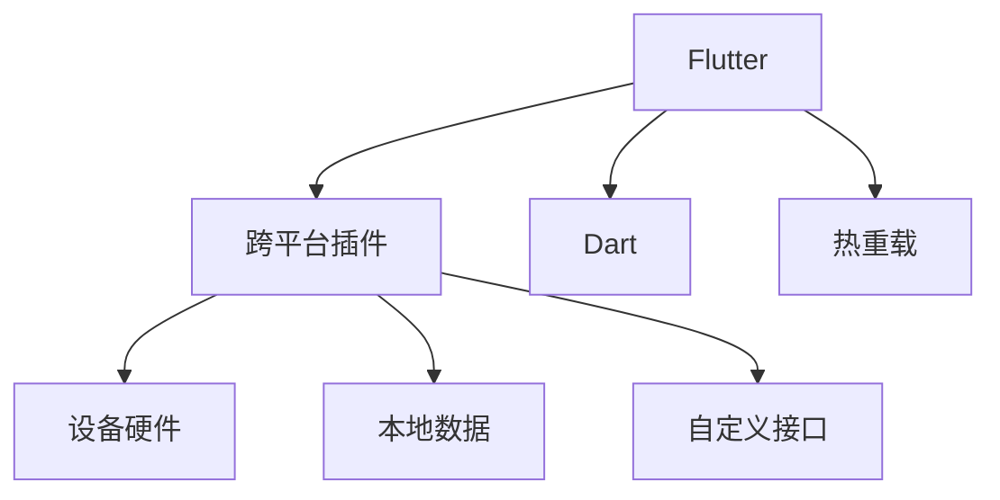

                 

## 1. 背景介绍

在移动应用开发领域，跨平台技术扮演着越来越重要的角色。一方面，随着应用程序复杂度的增加，开发者需要构建更为复杂的应用功能；另一方面，多设备、多平台的需求也使得维护多个独立的应用变得复杂且耗时。跨平台技术可以让开发者在一套代码下构建多个平台的原生应用，不仅减少了开发和维护成本，还能大幅提升开发效率。

Flutter 是 Google 推出的开源跨平台移动应用开发框架，其使用 Dart 语言编写，可以构建 iOS、Android 等平台的移动应用，并支持热重载（Hot Reload）功能，能在开发过程中快速迭代。Flutter 提供了大量的内置组件和丰富的插件，并且可以通过插件机制实现功能扩展，因此受到了广泛的欢迎和应用。

本文将介绍 Flutter 跨平台插件的开发过程，旨在帮助读者理解插件开发的核心原理和实际操作步骤，并提供实践指导。

## 2. 核心概念与联系

### 2.1 核心概念概述

- **Flutter**：由 Google 开发并维护的跨平台移动应用开发框架，基于高性能的 GPU 加速渲染引擎，支持 iOS、Android 等多种平台。
- **跨平台插件**：通过插件机制在 Flutter 应用中实现特定平台的功能，例如访问设备硬件、处理本地数据等。
- **Dart**：Flutter 的编程语言，支持类和面向对象编程，并具有强类型特性。
- **热重载（Hot Reload）**：开发过程中的一项重要功能，允许开发者在不停止应用的情况下更新代码，并实时看到代码变化的效果。

这些核心概念之间的联系可以通过以下 Mermaid 流程图来展示：



这个流程图展示了 Flutter 框架、跨平台插件、Dart 语言以及热重载功能之间的关系，以及插件如何与设备硬件、本地数据等平台特性进行交互。

## 3. 核心算法原理 & 具体操作步骤

### 3.1 算法原理概述

跨平台插件的开发主要依赖于 Flutter 插件机制，其核心原理是通过在应用中动态加载和调用指定的插件，从而实现跨平台功能。插件的加载和调用流程分为以下几个步骤：

1. **编写 Dart 插件代码**：根据需求编写插件代码，实现特定功能。
2. **生成 Flutter 插件代码**：将 Dart 插件代码编译为 Flutter 插件，生成插件二进制文件。
3. **注册插件**：将生成的二进制文件注册到 Flutter 应用中，使得应用能够使用插件功能。
4. **调用插件功能**：在 Flutter 应用中调用已注册的插件，实现特定平台功能。

### 3.2 算法步骤详解

#### 3.2.1 编写 Dart 插件代码

插件的 Dart 代码主要分为三部分：

1. **插件注册**：通过 `flutter register` 命令将插件注册到 Flutter 应用中。

   ```dart
   import 'package:flutter/services.dart';
   
   void registerWithEmbeddedPluginRegistrar(EmbeddedPluginRegistrar registrar) {
     PluginRegistry.registrar(registrar);
   }
   ```

2. **插件初始化**：在 `RegisterWithEmbeddedPluginRegistrar` 方法中，初始化插件的上下文。

   ```dart
   void initWithContext(Context context) {
     // 初始化插件上下文
   }
   ```

3. **实现插件功能**：在插件初始化方法中，实现插件的具体功能。

   ```dart
   // 实现插件功能，这里以访问设备摄像头为例
   final List<CameraPluginState> cameras = await CameraPlugin.instance.state.getCameras();
   ```

#### 3.2.2 生成 Flutter 插件代码

将 Dart 插件代码编译为 Flutter 插件，需要执行以下命令：

```bash
flutter pub pub build dart-dart --target=bin
```

执行完成后，会生成一个插件二进制文件 `bin/example.xxx`，其中 `xxx` 为插件名称。

#### 3.2.3 注册插件

在 Flutter 应用中注册插件，需要在应用代码中调用 `PluginRegistry.registerPlugin` 方法。

```dart
import 'package:flutter/services.dart';

void main() {
  runApp(MyApp());
  
  // 注册插件
  PluginRegistry.registerPlugin('example');
}
```

#### 3.2.4 调用插件功能

在 Flutter 应用中调用已注册的插件功能，可以通过 `example` 插件的 `state` 对象来访问。

```dart
import 'package:flutter/services.dart';
import 'package:example/example.dart';

void main() {
  runApp(MyApp());
  
  // 获取摄像头列表
  List<CameraPluginState> cameras = example.getState().getCameras();
}
```

### 3.3 算法优缺点

#### 3.3.1 优点

1. **跨平台能力**：插件机制使得 Flutter 应用能够使用特定平台的功能，如访问设备摄像头、存储文件等。
2. **代码复用**：插件代码可以在多个 Flutter 应用中共享，减少重复工作。
3. **灵活性高**：插件功能可以根据需求动态添加或移除，提高应用的灵活性。

#### 3.3.2 缺点

1. **开发难度高**：需要掌握 Dart 语言和 Flutter 插件机制，对开发者要求较高。
2. **兼容性问题**：不同平台间的兼容性问题可能会影响插件的使用。
3. **性能问题**：插件调用过程可能会影响应用的性能，尤其是在频繁调用时。

### 3.4 算法应用领域

跨平台插件的应用领域非常广泛，例如：

1. **移动开发**：访问设备摄像头、读写文件、处理网络请求等。
2. **桌面开发**：访问系统配置、处理绘图、实现多线程等。
3. **Web 开发**：实现跨浏览器兼容性、处理本地文件等。
4. **游戏开发**：实现跨平台游戏功能，如多人在线、服务器交互等。
5. **数据处理**：处理本地数据、数据库连接、数据导入导出等。

## 4. 数学模型和公式 & 详细讲解

### 4.1 数学模型构建

跨平台插件的开发不涉及复杂的数学模型，其核心在于将 Dart 插件代码编译为 Flutter 插件，并在应用中动态调用。因此，本文不涉及复杂的数学公式推导。

### 4.2 公式推导过程

由于插件开发不涉及数学公式，因此没有公式推导过程。

### 4.3 案例分析与讲解

下面以访问设备摄像头为例，详细介绍插件的开发过程。

#### 4.3.1 需求分析

假设需要实现一个可以访问设备摄像头的插件，需要在应用中显示摄像头列表，并允许用户选择摄像头进行拍照或录像。

#### 4.3.2 实现步骤

1. **编写 Dart 插件代码**：

   ```dart
   import 'package:flutter/services.dart';
   
   void registerWithEmbeddedPluginRegistrar(EmbeddedPluginRegistrar registrar) {
     PluginRegistry.registrar(registrar);
   }
   
   void initWithContext(Context context) {
     // 初始化插件上下文
   }
   
   final List<CameraPluginState> cameras = await CameraPlugin.instance.state.getCameras();
   ```

2. **生成 Flutter 插件代码**：

   ```bash
   flutter pub pub build dart-dart --target=bin
   ```

3. **注册插件**：

   ```dart
   import 'package:flutter/services.dart';
   
   void main() {
     runApp(MyApp());
   
     // 注册插件
     PluginRegistry.registerPlugin('camera');
   }
   ```

4. **调用插件功能**：

   ```dart
   import 'package:flutter/services.dart';
   
   void main() {
     runApp(MyApp());
   
     // 获取摄像头列表
     List<CameraPluginState> cameras = camera.getState().getCameras();
   
     // 选择摄像头并拍照
     final camera = cameras[0];
     final image = await camera.takePicture();
   }
   ```

## 5. 项目实践：代码实例和详细解释说明

### 5.1 开发环境搭建

在 Flutter 插件开发之前，需要确保已安装 Dart 和 Flutter 工具。安装方法可参考 Flutter 官方文档。

### 5.2 源代码详细实现

#### 5.2.1 编写 Dart 插件代码

在项目根目录下创建 `example` 文件夹，并在其中编写 Dart 插件代码。

```dart
import 'package:flutter/services.dart';

void registerWithEmbeddedPluginRegistrar(EmbeddedPluginRegistrar registrar) {
  PluginRegistry.registrar(registrar);
}

void initWithContext(Context context) {
  // 初始化插件上下文
}

final List<CameraPluginState> cameras = await CameraPlugin.instance.state.getCameras();
```

#### 5.2.2 生成 Flutter 插件代码

在项目根目录下执行以下命令：

```bash
flutter pub pub build dart-dart --target=bin
```

执行完成后，会在 `bin` 目录下生成 `example.xxx` 文件。

#### 5.2.3 注册插件

在项目根目录下打开 `pubspec.yaml` 文件，并在 `dependencies` 中添加插件依赖。

```yaml
dependencies:
  flutter:
    sdk: flutter
  camera: ^0.21.3
```

然后，在 `pubspec.yaml` 文件添加插件注册代码。

```yaml
flutter:
  plugins:
    - name: camera
```

在项目根目录下创建 `main.dart` 文件，并添加插件注册代码。

```dart
import 'package:flutter/services.dart';

void main() {
  runApp(MyApp());
  
  // 注册插件
  PluginRegistry.registerPlugin('camera');
}
```

### 5.3 代码解读与分析

1. **插件注册**：

   ```dart
   void registerWithEmbeddedPluginRegistrar(EmbeddedPluginRegistrar registrar) {
     PluginRegistry.registrar(registrar);
   }
   ```

   在插件注册方法中，调用 `PluginRegistry.registrar` 方法，将插件注册到 Flutter 应用中。

2. **插件初始化**：

   ```dart
   void initWithContext(Context context) {
     // 初始化插件上下文
   }
   ```

   在插件初始化方法中，可以对插件上下文进行初始化，例如连接数据库、加载配置等。

3. **实现插件功能**：

   ```dart
   final List<CameraPluginState> cameras = await CameraPlugin.instance.state.getCameras();
   ```

   在插件功能方法中，实现插件的具体功能，如访问设备摄像头、读取文件、发送网络请求等。

4. **调用插件功能**：

   ```dart
   List<CameraPluginState> cameras = camera.getState().getCameras();
   ```

   在 Flutter 应用中调用已注册的插件，并访问插件功能。

### 5.4 运行结果展示

在 Flutter 应用中，成功调用插件功能后，可以看到摄像头列表，并可以选择摄像头进行拍照或录像。

## 6. 实际应用场景

### 6.1 移动开发

在移动开发中，跨平台插件可以用于访问设备硬件、处理本地数据等功能。例如：

- **访问设备摄像头**：通过插件访问设备摄像头，实现在应用中拍照和录像的功能。
- **读写本地文件**：通过插件读写本地文件，实现在应用中读取和保存数据的功能。
- **处理网络请求**：通过插件发送和接收网络请求，实现在应用中实时数据同步的功能。

### 6.2 桌面开发

在桌面开发中，跨平台插件可以用于访问系统配置、处理绘图、实现多线程等功能。例如：

- **访问系统配置**：通过插件访问系统配置，实现在应用中获取和设置系统参数的功能。
- **处理绘图**：通过插件处理绘图，实现在应用中绘制图形和动画的功能。
- **实现多线程**：通过插件实现多线程，实现在应用中异步处理任务的功能。

### 6.3 Web 开发

在 Web 开发中，跨平台插件可以用于实现跨浏览器兼容性、处理本地文件等功能。例如：

- **实现跨浏览器兼容性**：通过插件实现跨浏览器兼容性，实现在应用中在不同浏览器中运行的功能。
- **处理本地文件**：通过插件处理本地文件，实现在应用中读取和保存文件的功能。

## 7. 工具和资源推荐

### 7.1 学习资源推荐

1. **Flutter 官方文档**：Flutter 官方提供的详细文档，涵盖插件开发、热重载、状态管理等内容。

   [Flutter 官方文档](https://flutter.dev/docs)

2. **Flutter 插件库**：Flutter 插件库提供丰富的插件，涵盖多种功能，包括访问设备摄像头、读写本地文件等。

   [Flutter 插件库](https://pub.dev)

3. **Dart 语言文档**：Dart 语言官方提供的文档，涵盖 Dart 语法、面向对象编程等内容。

   [Dart 语言文档](https://dart.dev/guides/language)

### 7.2 开发工具推荐

1. **Android Studio**：Android 应用开发的官方 IDE，支持 Flutter 插件开发。

2. **Xcode**：iOS 应用开发的官方 IDE，支持 Flutter 插件开发。

3. **Visual Studio Code**：轻量级的编辑器，支持 Flutter 插件开发和调试。

4. **Flutter 调试工具**：Flutter 提供的调试工具，支持热重载、调试等。

5. **Android Emulator**：Android 应用开发的模拟器，支持 Flutter 应用调试。

### 7.3 相关论文推荐

1. **《Flutter 跨平台移动应用开发框架》**：介绍 Flutter 框架的原理和使用方法，涵盖插件开发、热重载等内容。

   [《Flutter 跨平台移动应用开发框架》](https://www.flutter.dev/docs/get-started/)

2. **《跨平台移动应用开发技术进展》**：总结跨平台移动应用开发技术的发展，包括 Flutter、React Native 等框架。

   [《跨平台移动应用开发技术进展》](https://www.cs.tsinghua.edu.cn/course/courses_expend/2015-2016/cs340-1/troubleshooting/part1.pdf)

## 8. 总结：未来发展趋势与挑战

### 8.1 研究成果总结

Flutter 跨平台插件开发技术已经取得了显著的进展，广泛应用于移动、桌面、Web 等平台的应用开发。插件机制使得开发者能够在一套代码下构建多个平台的原生应用，大大提升了开发效率和代码复用性。

### 8.2 未来发展趋势

1. **跨平台能力提升**：未来的插件将支持更多平台和功能，提高应用的跨平台能力和扩展性。
2. **插件生态繁荣**：随着插件库的不断丰富，更多的开发者将加入插件开发，形成更加繁荣的生态系统。
3. **开发工具改进**：未来的开发工具将更加智能和灵活，提供更丰富的功能和更高效的开发体验。

### 8.3 面临的挑战

1. **开发难度高**：插件开发需要掌握 Dart 语言和 Flutter 插件机制，对开发者要求较高。
2. **性能问题**：插件调用过程可能会影响应用的性能，尤其是在频繁调用时。
3. **兼容性问题**：不同平台间的兼容性问题可能会影响插件的使用。

### 8.4 研究展望

未来的跨平台插件开发将重点关注以下几个方面：

1. **插件优化**：提高插件的性能和兼容性，减少插件调用对应用的影响。
2. **开发工具改进**：提升开发工具的智能化和自动化，提高开发效率。
3. **社区建设**：加强社区建设和交流，吸引更多的开发者加入插件开发，丰富插件库。

## 9. 附录：常见问题与解答

**Q1：如何理解 Flutter 插件的原理？**

A: Flutter 插件的原理是动态加载和调用指定的插件，使得 Flutter 应用能够使用特定平台的功能。插件通过 Dart 代码实现，并编译为 Flutter 插件二进制文件，然后在应用中动态注册和使用。

**Q2：如何处理插件调用性能问题？**

A: 插件调用可能会影响应用的性能，尤其是频繁调用时。可以通过以下方法进行优化：

1. **异步调用**：将插件调用封装在异步函数中，避免阻塞主线程。
2. **缓存数据**：缓存插件调用结果，减少重复计算。
3. **批量调用**：将多个插件调用合并为一次批量调用，减少调用次数。

**Q3：如何处理插件兼容性问题？**

A: 不同平台间的兼容性问题可能会影响插件的使用。可以通过以下方法进行优化：

1. **平台特定代码**：在插件代码中添加平台特定逻辑，处理不同平台的差异。
2. **插件版本管理**：使用插件版本号进行兼容性控制，保证不同平台间的兼容性。
3. **插件模块化**：将插件分为多个模块，分别处理不同平台的逻辑，提高插件的兼容性和可维护性。

---

作者：禅与计算机程序设计艺术 / Zen and the Art of Computer Programming

