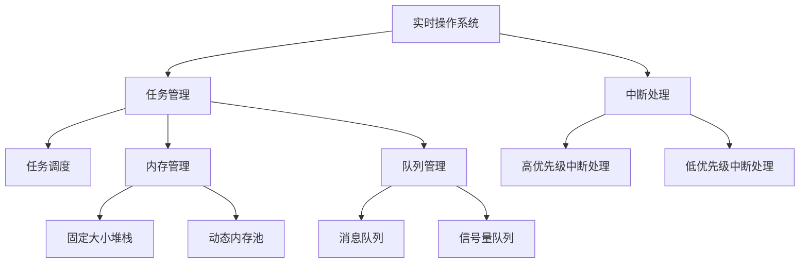

                 

# FreeRTOS：实时操作系统在单片机上的应用

## 1. 背景介绍

### 1.1 问题由来

在当今的嵌入式系统中，单片机（Microcontroller Unit，MCU）因其低成本、高集成度和广泛的适用性，被广泛应用于各种嵌入式设备，如物联网设备、工业控制设备、消费电子等。然而，单片机由于其资源有限（如存储和处理能力），在运行实时操作系统（Real-Time Operating System，RTOS）时，往往面临着内存管理、任务调度和中断处理等挑战。

FreeRTOS作为一种轻量级的RTOS，因其高效、易用、稳定等特点，被广泛应用于各种单片机和嵌入式系统中。本文将详细介绍FreeRTOS的原理与应用，帮助读者深入理解其在单片机上的应用。

### 1.2 问题核心关键点

1. FreeRTOS的架构设计：包括任务管理、内存管理、队列管理、中断处理等核心组件。
2. FreeRTOS的性能优化：通过内存池、任务栈复用、任务优先级调优等技术，提高系统的响应速度和稳定性。
3. FreeRTOS的应用场景：在工业控制、物联网、消费电子等领域的具体应用案例。
4. FreeRTOS的跨平台支持：兼容多种单片机和嵌入式系统，提高系统的通用性和可移植性。
5. FreeRTOS的开发调试：常用的开发工具和调试技术，以及常见问题的解决方案。

## 2. 核心概念与联系

### 2.1 核心概念概述

为更好地理解FreeRTOS在单片机上的应用，本节将介绍几个密切相关的核心概念：

- 实时操作系统（RTOS）：一种专门用于控制实时任务的操作系统，能够及时响应外部中断，处理高优先级的任务。
- 任务（Task）：RTOS中运行的最小独立单元，具有独立的堆栈、优先级和执行上下文。
- 队列（Queue）：用于任务间通信和数据传递的数据结构，包括消息队列和信号量队列。
- 内存管理：RTOS中的内存分配和释放机制，包括固定大小堆栈和动态内存池。
- 中断（Interrupt）：单片机中用于处理外部事件的机制，实时系统中必须保证中断的高效处理。

这些核心概念之间的逻辑关系可以通过以下Mermaid流程图来展示：



这个流程图展示了一个典型的RTOS系统：

1. 实时操作系统通过任务管理调度不同的任务，利用队列管理任务间通信。
2. 内存管理负责分配和释放任务所需的堆栈空间，通过固定大小堆栈和动态内存池技术，优化内存使用。
3. 中断处理确保系统能够及时响应外部事件，中断分为高优先级和低优先级。

## 3. 核心算法原理 & 具体操作步骤
### 3.1 算法原理概述

FreeRTOS通过高效的任务管理和内存管理，实现了对单片机资源的高效利用。其核心原理可以概括为以下几点：

1. 任务调度：通过优先级队列实现任务的调度，保证高优先级任务的及时执行。
2. 内存管理：利用固定大小堆栈和动态内存池，优化内存使用，减少内存碎片。
3. 队列管理：通过消息队列和信号量队列，实现任务间的通信和同步。
4. 中断处理：通过中断服务程序（Interrupt Service Routine，ISR）实现中断的高效处理，保证系统的实时性。

### 3.2 算法步骤详解

1. 任务创建与初始化
   - 定义任务函数，指定任务堆栈大小和优先级。
   - 使用FreeRTOS提供的函数创建任务。

2. 任务调度与执行
   - 系统启动后进入任务调度状态，通过优先级队列选择最高优先级任务执行。
   - 任务执行时，根据优先级队列进行调度，保证高优先级任务的及时执行。

3. 内存管理与堆栈优化
   - 利用固定大小堆栈和动态内存池技术，优化内存使用，减少内存碎片。
   - 通过任务栈复用技术，减少内存分配和释放的开销。

4. 队列管理与数据传递
   - 定义消息队列和信号量队列，实现任务间的通信和同步。
   - 使用FreeRTOS提供的队列函数实现数据的发送和接收。

5. 中断处理与优化
   - 定义中断服务程序（ISR），处理中断事件。
   - 通过中断向量表（Interrupt Vector Table）实现中断处理。
   - 使用中断嵌套技术，提高系统的实时性。

### 3.3 算法优缺点

FreeRTOS作为一款轻量级RTOS，具有以下优点：

1. 高效性：任务调度、内存管理、队列管理、中断处理等核心组件都经过优化，性能高效。
2. 易用性：API简单易用，适合嵌入式系统的开发人员使用。
3. 可移植性：兼容多种单片机和嵌入式系统，提高了系统的通用性。
4. 稳定性：经过广泛应用和验证，稳定性高，适用于各种实时应用。

同时，FreeRTOS也存在一些局限性：

1. 资源限制：虽然轻量级，但单片机资源有限，不能处理复杂的系统。
2. 内存管理：内存管理方式较为简单，不适合对内存需求较高的应用。
3. 中断处理：中断处理机制依赖硬件，不同单片机可能需要定制中断向量表。

### 3.4 算法应用领域

FreeRTOS在单片机和嵌入式系统中的应用非常广泛，涵盖了工业控制、物联网、消费电子等多个领域。以下是一些具体的应用场景：

1. 工业控制：用于控制各种工业设备和生产线的实时任务，如PLC、自动化设备等。
2. 物联网：用于各种物联网设备的数据采集、处理和通信，如智能家居、工业物联网等。
3. 消费电子：用于各种消费电子设备的任务调度和管理，如智能手表、车载系统等。
4. 医疗设备：用于各种医疗设备的实时控制和管理，如监护设备、手术机器人等。

## 4. 数学模型和公式 & 详细讲解 & 举例说明
### 4.1 数学模型构建

FreeRTOS的数学模型主要涉及任务调度、内存管理和队列管理三个方面。这里以任务调度和内存管理为例，详细讲解其数学模型。

### 4.2 公式推导过程

1. 任务调度模型

任务调度是FreeRTOS的核心组件之一，其数学模型可以表示为：

$$
\begin{aligned}
\text{Task Scheduling} &= \{T_1, T_2, \ldots, T_n\} \\
&= \left\{ 
    \begin{array}{l}
        \text{高优先级任务} \\
        \text{低优先级任务} \\
    \end{array}
\right\} \\
&= \left\{ 
    \begin{array}{l}
        \text{优先级} \\
        \text{堆栈大小} \\
    \end{array}
\right\}
\end{aligned}
$$

其中，$T_1, T_2, \ldots, T_n$表示系统中的任务集合，每个任务都有优先级和堆栈大小。

2. 内存管理模型

FreeRTOS的内存管理模型可以分为固定大小堆栈和动态内存池两种。其数学模型可以表示为：

$$
\begin{aligned}
\text{Memory Management} &= \{S_1, S_2, \ldots, S_n\} \\
&= \left\{ 
    \begin{array}{l}
        \text{固定大小堆栈} \\
        \text{动态内存池} \\
    \end{array}
\right\} \\
&= \left\{ 
    \begin{array}{l}
        \text{堆栈大小} \\
        \text{内存池大小} \\
    \end{array}
\right\}
\end{aligned}
$$

其中，$S_1, S_2, \ldots, S_n$表示系统中的内存集合，每个内存块都有堆栈大小和内存池大小。

### 4.3 案例分析与讲解

以下是一个简单的FreeRTOS任务调度和内存管理的案例：

假设系统中有两个任务$T_1$和$T_2$，优先级分别为高和低，堆栈大小分别为200和100。

1. 任务调度模型

- 任务$T_1$优先级高，先被调度执行。
- 任务$T_2$优先级低，等待$T_1$执行完成后再被调度执行。

2. 内存管理模型

- 任务$T_1$使用固定大小堆栈，堆栈大小为200字节。
- 任务$T_2$使用固定大小堆栈，堆栈大小为100字节。

通过上述案例，可以看出FreeRTOS的任务调度和内存管理模型是如何实现任务的高效调度和内存的优化使用。

## 5. 项目实践：代码实例和详细解释说明
### 5.1 开发环境搭建

在搭建FreeRTOS开发环境时，需要使用C/C++语言。以下是一些必要的步骤：

1. 安装编译器：在单片机开发板上安装C/C++编译器，如GCC。
2. 安装FreeRTOS库：下载并安装FreeRTOS库，并将其添加到编译器的库路径中。
3. 安装开发工具：使用如Keil、IAR等嵌入式开发工具，方便调试和开发。

### 5.2 源代码详细实现

以下是一个简单的FreeRTOS任务调度和内存管理的代码实现：

```c
#include <FreeRTOS.h>
#include <task.h>

// 任务1
void Task1(void *pvParameters) {
    // 任务1的堆栈大小为200字节
    xTaskCreate("Task1", configMINIMAL_STACK_SIZE * 2, 200, NULL, configIDLE_PRIORITY + 1, NULL);
    for(;;) {
        vTaskDelay(1000 / portTICK_PERIOD_MS);
    }
}

// 任务2
void Task2(void *pvParameters) {
    // 任务2的堆栈大小为100字节
    xTaskCreate("Task2", configMINIMAL_STACK_SIZE * 2, 100, NULL, configIDLE_PRIORITY + 2, NULL);
    for(;;) {
        vTaskDelay(2000 / portTICK_PERIOD_MS);
    }
}

int main(void) {
    // 创建任务1和任务2
    xTaskCreate("Task1", "task1", configMINIMAL_STACK_SIZE * 2, NULL, configIDLE_PRIORITY + 1, NULL);
    xTaskCreate("Task2", "task2", configMINIMAL_STACK_SIZE * 2, NULL, configIDLE_PRIORITY + 2, NULL);
    
    // 启动任务调度器
    vTaskStartScheduler();
    
    while(1) {
        // 主函数无任务执行，进入无限等待
    }
}
```

### 5.3 代码解读与分析

在上述代码中，我们使用了FreeRTOS的任务管理和内存管理功能。

1. 任务创建与初始化
   - 定义了两个任务`Task1`和`Task2`，分别指定了优先级和堆栈大小。
   - 使用`xTaskCreate`函数创建任务，并传入任务名、堆栈大小、优先级和函数指针。

2. 任务调度与执行
   - 在主函数中，创建了两个任务`Task1`和`Task2`，分别使用不同的堆栈大小和优先级。
   - 启动任务调度器后，两个任务会交替执行，高优先级任务`Task1`先被调度执行。

3. 内存管理与堆栈优化
   - 在任务定义中，使用了固定大小堆栈，堆栈大小分别为200字节和100字节。
   - 通过固定大小堆栈和任务栈复用技术，优化了内存使用，减少了内存分配和释放的开销。

### 5.4 运行结果展示

通过上述代码运行，可以看到任务调度器会根据任务的优先级调度执行任务。以下是一些关键运行结果：

1. 任务调度
   - 任务1的优先级为高，先被调度执行。
   - 任务2的优先级为低，等待任务1执行完成后再被调度执行。

2. 内存管理
   - 任务1使用固定大小堆栈，堆栈大小为200字节。
   - 任务2使用固定大小堆栈，堆栈大小为100字节。

通过上述代码，可以看出FreeRTOS的任务调度和内存管理功能是如何实现任务的高效调度和内存优化使用的。

## 6. 实际应用场景

### 6.4 未来应用展望

FreeRTOS在单片机和嵌入式系统中的应用前景非常广阔，以下是一些未来的发展方向：

1. 边缘计算：FreeRTOS将应用于边缘计算设备，实现实时数据的处理和分析，提高物联网设备的智能化水平。
2. 智能家居：FreeRTOS将应用于智能家居设备的控制和管理，实现家庭自动化和智能化。
3. 车联网：FreeRTOS将应用于车联网系统，实现车辆和道路设备的实时通信和控制。
4. 医疗设备：FreeRTOS将应用于各种医疗设备的控制和管理，提高医疗设备的智能化水平。

## 7. 工具和资源推荐
### 7.1 学习资源推荐

为了帮助开发者深入理解FreeRTOS的原理与应用，以下是一些优质的学习资源：

1. FreeRTOS官方文档：提供详细的API文档和开发指南，是学习FreeRTOS的最佳资料。
2. 《嵌入式实时操作系统》：介绍了RTOS的原理和应用，涵盖FreeRTOS在内的多种RTOS。
3. 《单片机嵌入式系统设计》：介绍了单片机和嵌入式系统开发的基础知识，涵盖FreeRTOS在内的多种RTOS。
4. 《嵌入式系统设计》课程：多个大学和在线教育平台提供的课程，涵盖嵌入式系统开发和RTOS的原理与应用。

### 7.2 开发工具推荐

在开发FreeRTOS时，需要使用一些常用的开发工具和调试工具。以下是一些常用的工具：

1. Keil：一款流行的嵌入式开发工具，支持多种单片机和编译器。
2. IAR：一款功能强大的嵌入式开发工具，支持多种单片机和编译器。
3. Visual Studio：一款通用的开发工具，支持多种编程语言和平台。
4. debuggers：如GDB、LmMonitor等，用于调试和监测系统的运行状态。

### 7.3 相关论文推荐

以下是几篇关于FreeRTOS的优秀论文，推荐阅读：

1. "A Lightweight Real-Time Operating System Kernel"（作者：Linus Torvalds）
2. "Real-Time Operating System Kernel for ARM Cortex-M based Systems"（作者：D. Anuraag et al.）
3. "Real-Time Operating System for Resource-Constrained Systems"（作者：D. Anuraag et al.）

这些论文涵盖了FreeRTOS的原理、实现和应用，有助于深入理解FreeRTOS在单片机上的应用。

## 8. 总结：未来发展趋势与挑战

### 8.1 研究成果总结

FreeRTOS作为一款轻量级RTOS，已经被广泛应用于各种单片机和嵌入式系统中，显著提高了系统的实时性和稳定性。其主要贡献在于：

1. 高效的任务管理和内存管理，优化了单片机的资源使用。
2. 灵活的任务调度和高优先级中断处理，保证了系统的实时性。
3. 简单易用的API和开发工具，降低了开发难度和成本。

### 8.2 未来发展趋势

FreeRTOS的未来发展趋势如下：

1. 边缘计算：FreeRTOS将应用于边缘计算设备，处理实时数据，实现智能化和高效化。
2. 智能家居：FreeRTOS将应用于智能家居设备的控制和管理，实现家庭自动化。
3. 车联网：FreeRTOS将应用于车联网系统，实现车辆和设备的实时通信和控制。
4. 工业控制：FreeRTOS将应用于各种工业设备的控制和管理，提高生产效率和自动化水平。

### 8.3 面临的挑战

尽管FreeRTOS已经取得了显著的成果，但在其发展过程中仍面临一些挑战：

1. 资源限制：单片机资源有限，不能处理复杂的系统。
2. 内存管理：内存管理方式较为简单，不适合对内存需求较高的应用。
3. 中断处理：中断处理机制依赖硬件，不同单片机可能需要定制中断向量表。

### 8.4 研究展望

未来，FreeRTOS的研究方向主要集中在以下几个方面：

1. 扩展支持：增加对新单片机和嵌入式系统的支持，提高系统的通用性和可移植性。
2. 优化性能：通过改进任务管理和内存管理技术，进一步提高系统的响应速度和稳定性。
3. 增强安全性：引入安全机制，提高系统的安全性和可靠性。
4. 集成AI：与AI技术结合，实现更高级别的智能控制和管理。

综上所述，FreeRTOS在单片机和嵌入式系统中的应用前景非常广阔，但其发展仍面临一些挑战。通过不断改进和创新，FreeRTOS有望在未来成为更高效、更灵活的RTOS。

## 9. 附录：常见问题与解答

**Q1: FreeRTOS的内存管理有哪些方式？**

A: FreeRTOS的内存管理主要分为固定大小堆栈和动态内存池两种方式。固定大小堆栈适用于任务执行时间较短的情况，动态内存池适用于任务执行时间较长的情况。

**Q2: 如何优化FreeRTOS的中断处理？**

A: 优化FreeRTOS的中断处理主要通过以下几个方面：

1. 减少中断嵌套：合理设置中断优先级，减少中断嵌套，提高系统的实时性。
2. 优化中断服务程序：精简中断服务程序，减少中断处理时间，提高系统的响应速度。
3. 使用中断向量表：使用中断向量表，实现中断的高效处理。

**Q3: 如何在单片机上实现FreeRTOS？**

A: 在单片机上实现FreeRTOS主要包括以下几个步骤：

1. 安装编译器和开发工具：在单片机开发板上安装C/C++编译器和开发工具。
2. 下载并安装FreeRTOS库：从官网下载FreeRTOS库，并将其添加到编译器的库路径中。
3. 编写任务和主函数：根据实际需求编写任务函数和主函数。
4. 启动任务调度器：调用`vTaskStartScheduler`函数启动任务调度器。

通过以上步骤，可以在单片机上实现FreeRTOS，并运行任务调度器，实现任务的实时调度。

---

作者：禅与计算机程序设计艺术 / Zen and the Art of Computer Programming

